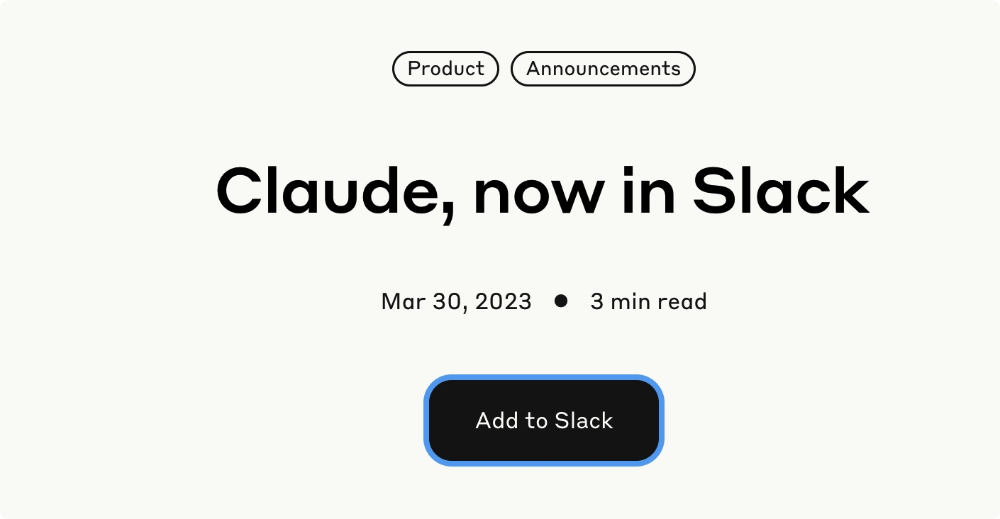
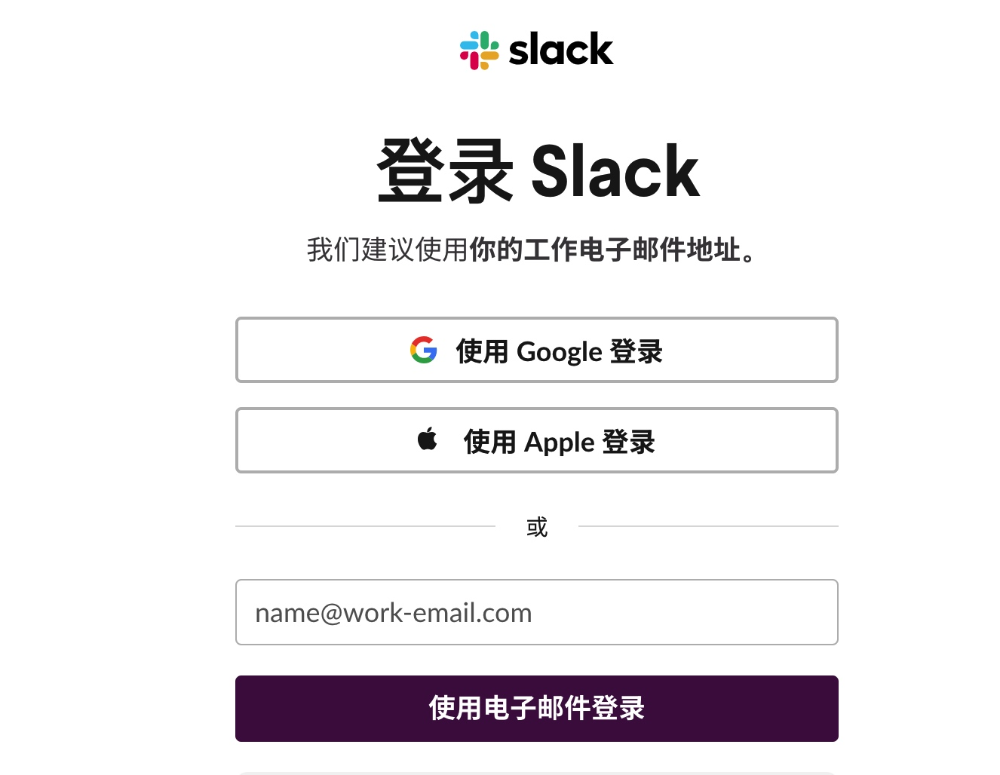
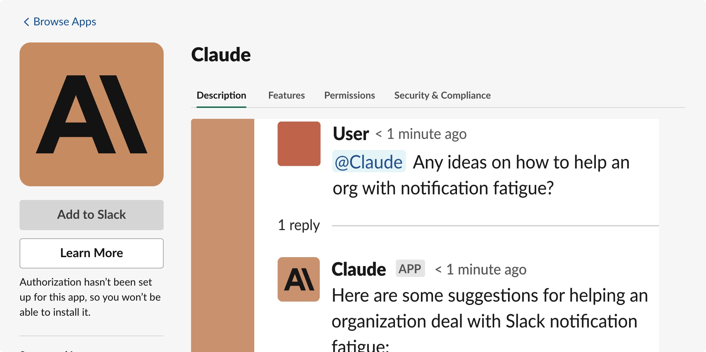
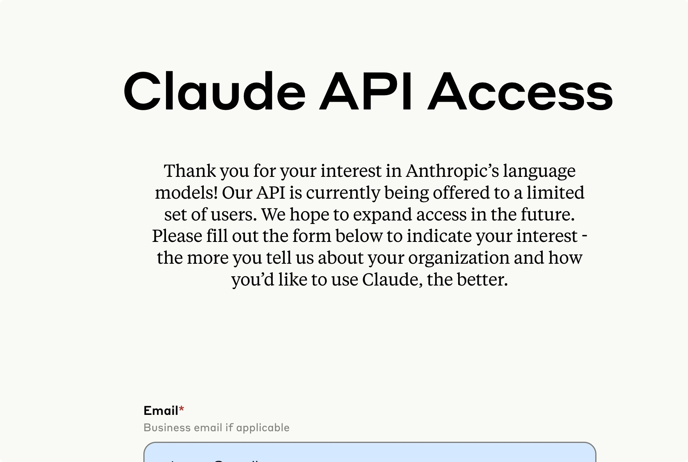
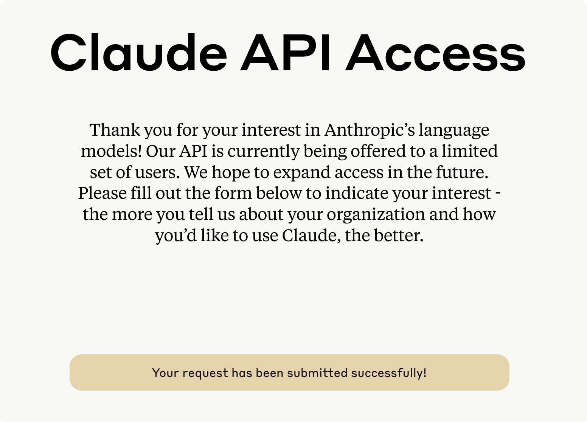

# claude注册
claude免费，平替chatgpt

## 注册账号
1. 进入https://www.anthropic.com/product
2. 滚动到页面底部，点击Product News，“Claude in Slack”。这里最新claude2，https://www.anthropic.com/index/claude-2。
3. 点击“Add to Slack”
   

1. 会进入Slack官网，https://slack.com/apps/A04KGS7N9A8-claude?tab=more_info 在这个页面上点击“登录并安装”
2. 这里需要先注册一个Slack账号，可以直接使用Apple ID登录，或者用邮件注册一个（可以用hotmail或者outlook，亲测sina邮箱不行）。
   
   
1. 遇到了无法Authorization hasn’t been set up for this app, so you won’t be able to install it.
   申请加入白名单
   https://www.anthropic.com/earlyaccess
   
   
    申请成功就可以添加到工作区
2. 注册成功登录后，需要创建新工作区
3. 输入团队名称、你的名字及团队成员后，就可以进入工作区，胜利就在眼前。
4. 进入工作区
5. 但是我们发现并没有Claude应用，因为我们只是完成了首次登录，还没有添加Claude到Slack中。再次登录“第三步”中的Slack官网，已经识别到你的工作区，这时点击“添加到Slack”。使用第三步中的地址：https://slack.com/apps/A04KGS7N
6. 出现不支持当前所在区域的提示，通过“科学”的方法更换你的IP地址，例如可以在百度中搜索“IP”查看你当前的IP地址：
7. 再次尝试“添加到Slack”见第七步，不出意外的成功！
8. 再次进入工作区，可以看到Claude应用，并且后续正常上网即可使用。工作区：https://app.slack.com/client/
9. 通过Claude应用发起沟通即可，实现ChatGPT完美平替

参考：
https://zhuanlan.zhihu.com/p/623242552