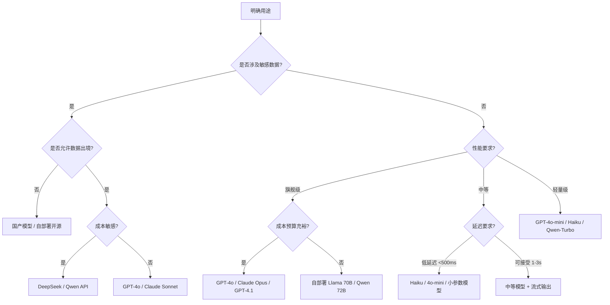
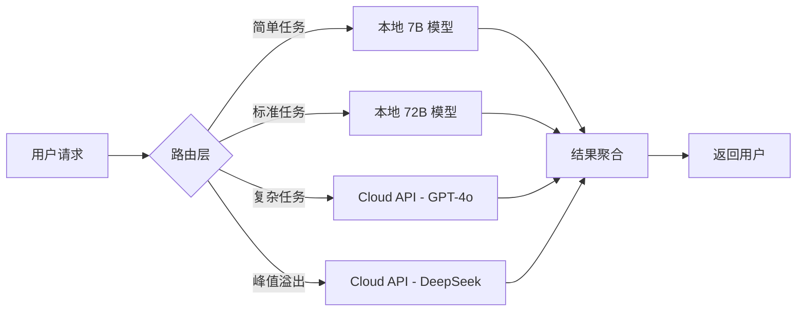

# 模型选择与部署策略：GPT、Claude、开源模型、国产模型全景

模型选型是 LLM 工程落地中最关键的前置决策之一。选错了模型，要么是花了冤枉钱——用旗舰模型跑分类任务；要么是质量坍塌——用轻量模型做复杂推理。更隐蔽的陷阱在于：你在评估阶段用 API 跑通了 POC，上线时才发现 10 万次日请求的成本远超预算，或者数据合规要求不允许把用户数据发往境外。

本文为有 LLM 应用开发经验的工程师提供一份系统性的选型与部署参考。不做入门科普，聚焦决策：**什么场景用什么模型，用什么方式部署，花多少钱**。

---

## 1. 模型选型的工程决策框架

模型选型不是一个技术问题，而是一个**四维决策问题**：用途、性能需求、成本预算、部署约束。下面给出一个实用的决策树：

### 1.1 决策树

### 1.2 四维决策矩阵

| 维度 | 关键问题 | 决策要点 |
| :--- | :--- | :--- |
| **用途** | 文本生成？代码生成？多模态？分类/提取？ | 分类/提取等简单任务用小模型；复杂推理用旗舰模型 |
| **性能需求** | 准确率容忍度？延迟要求？输出长度？ | 延迟 <500ms 场景几乎必须用小模型或自部署 |
| **成本预算** | 月预算？日请求量？可接受的单次成本？ | 见第 6 节的成本分析 |
| **部署约束** | 数据合规？网络环境？运维能力？ | 合规场景优先国产/自部署；无运维团队优先 Cloud API |

### 1.3 一个实用经验法则

**先用最强模型验证产品质量的上限，再用成本约束向下选型**。具体做法：

1. 用 GPT-4o 或 Claude Opus 跑通核心场景，建立质量基线
2. 逐步替换为更便宜的模型（4o-mini、Haiku、Qwen-Turbo），对比质量损失
3. 对于质量下降超过可接受阈值的任务，保留强模型；其余降级

这个"从上往下试"的策略比"从下往上试"效率高得多——因为你很快就能知道质量天花板在哪里。

---

## 2. 闭源模型对比

### 2.1 综合对比表

| 模型 | 上下文窗口 | 输入价格 ($/1M) | 输出价格 ($/1M) | 核心优势 | 适用场景 |
| :--- | :--- | :--- | :--- | :--- | :--- |
| **GPT-4o** | 128K | $2.50 | $10.00 | 多模态（文本+图像+音频）、工具调用成熟、生态最完整 | 通用旗舰，多模态，复杂推理 |
| **GPT-4o-mini** | 128K | $0.15 | $0.60 | 极致性价比，128K 上下文 | 分类、提取、简单问答、大批量处理 |
| **GPT-4.1** | 1M | $2.00 | $8.00 | 百万级上下文，指令遵循大幅提升 | 长文档分析，大规模代码理解 |
| **Claude 3.5 Sonnet** | 200K | $3.00 | $15.00 | 长上下文质量领先，代码生成优秀，Extended Thinking | 代码生成，长文分析，复杂推理 |
| **Claude 3.5 Haiku** | 200K | $0.80 | $4.00 | 速度极快（首 token <300ms），200K 上下文 | 高并发场景，实时对话，路由分类 |
| **Claude Opus 4** | 200K | $15.00 | $75.00 | 最强推理能力，多步复杂任务 | 科研级推理，复杂 Agent 任务 |
| **Gemini 1.5 Pro** | 2M | $1.25-$2.50 | $5.00-$10.00 | 超长上下文（2M），多模态原生支持 | 超长文档/视频理解，多模态分析 |
| **Gemini 1.5 Flash** | 1M | $0.075 | $0.30 | 极低价格，速度快 | 大批量轻量任务，实时应用 |

### 2.2 选型策略

**OpenAI（GPT 系列）** 的核心优势在于**生态成熟度**：Function Calling 支持最完善、插件生态最丰富、社区资源最多。GPT-4o 是当前"不会出错"的默认选择——几乎所有场景都能胜任，只是不一定是最优解。

**Anthropic（Claude 系列）** 在**代码生成和长文分析**上有明确优势。Claude 3.5 Sonnet 的代码能力在多项评测中超过 GPT-4o，且 200K 上下文窗口在处理长文档时有实际优势——不需要分段处理，上下文连贯性更好。Extended Thinking 模式允许模型在回答前进行多步推理，适合需要深度思考的任务。

**Google（Gemini 系列）** 的差异化在于**超长上下文**。2M Token 的上下文窗口意味着可以一次性处理整本书籍、完整的代码仓库或长达数小时的视频转写。Gemini 1.5 Flash 的定价策略极具攻击性——$0.075/1M 输入 Token，比 GPT-4o-mini 便宜一倍。

### 2.3 API 能力矩阵

| 能力 | GPT-4o | Claude 3.5 Sonnet | Gemini 1.5 Pro |
| :--- | :--- | :--- | :--- |
| Function Calling | ✅ 最成熟 | ✅ 支持 | ✅ 支持 |
| Structured Output (JSON Schema) | ✅ | ✅ | ✅ |
| Vision（图像理解） | ✅ | ✅ | ✅ |
| Audio 输入/输出 | ✅ 原生 | ❌ | ✅ |
| Extended Thinking | ❌ | ✅ | ✅ (思考模式) |
| Batch API | ✅ 50% 折扣 | ✅ 50% 折扣 | ✅ |
| 文件上传 | ✅ | ✅ | ✅ |
| 代码解释器 | ✅ Sandbox | ❌ | ✅ Sandbox |
| Web Search | ✅ 内置 | ❌ 需 Function | ✅ grounding |

---

## 3. 开源模型对比

开源模型在 2024-2025 年经历了质的飞跃。部分模型在特定任务上已经接近甚至超越闭源模型，同时带来了**部署灵活性、数据隐私、定制化能力**等闭源模型无法提供的优势。

### 3.1 综合对比表

| 模型 | 参数量 | 架构 | 许可证 | MMLU | MATH | HumanEval | 部署最低显存 (FP16) |
| :--- | :--- | :--- | :--- | :--- | :--- | :--- | :--- |
| **Llama 3.1 8B** | 8B | Dense Transformer | Llama License | 68.4 | 51.9 | 72.6 | ~16 GB (1×A100-40G) |
| **Llama 3.1 70B** | 70B | Dense Transformer | Llama License | 86.1 | 68.0 | 80.5 | ~140 GB (2×A100-80G) |
| **Llama 3.1 405B** | 405B | Dense Transformer | Llama License | 88.6 | 73.8 | 89.0 | ~810 GB (8×A100-80G) |
| **Llama 3.2 3B** | 3B | Dense Transformer | Llama License | 63.4 | 42.0 | 58.2 | ~6 GB |
| **Llama 3.2 90B** | 90B (V+T) | Dense + Adapter | Llama License | 87.5 | 71.8 | 86.1 | ~180 GB |
| **Qwen 2.5 7B** | 7B | Dense Transformer | Apache 2.0 | 74.2 | 61.6 | 84.8 | ~14 GB |
| **Qwen 2.5 72B** | 72B | Dense Transformer | Apache 2.0 | 85.3 | 76.1 | 86.4 | ~144 GB |
| **Qwen 3 235B** | 235B (22B 激活) | MoE | Apache 2.0 | 88.1 | 81.5 | 90.2 | ~460 GB (MoE，全量加载) |
| **DeepSeek V3** | 671B (37B 激活) | MoE | MIT | 88.5 | 90.2 | 89.5 | ~1.3 TB (全量) / ~80 GB (量化) |
| **DeepSeek R1** | 671B (37B 激活) | MoE + RL | MIT | 90.8 | 97.3 | 92.1 | 同 V3 |
| **Mistral Large 2** | 123B | Dense Transformer | Apache 2.0 | 84.0 | 69.9 | 84.1 | ~246 GB |
| **Mistral Nemo 12B** | 12B | Dense Transformer | Apache 2.0 | 71.2 | 50.8 | 68.3 | ~24 GB |
| **Phi-4** | 14B | Dense Transformer | MIT | 84.8 | 82.6 | 82.6 | ~28 GB |

### 3.2 关键选型维度

**参数量与硬件门槛**：

- **8B-14B**：单张消费级 GPU（RTX 4090 24GB）即可运行，适合边缘部署和快速迭代
- **70B-72B**：需要 2×A100-80G 或 4×RTX 4090，是性能/成本的最佳平衡点
- **200B+**：需要多卡服务器集群，适合有 GPU 资源的企业级部署

**MoE vs Dense**：

MoE（Mixture of Experts）模型以激活参数量换取了推理效率。DeepSeek V3 总参数 671B，但每次推理只激活 37B 参数，这意味着其推理速度接近 37B Dense 模型，而模型容量接近 671B。代价是需要更大的显存来加载全部参数。

**许可证考量**：

- **MIT**：最宽松，DeepSeek 系列采用，允许商用、修改、分发
- **Apache 2.0**：非常宽松，Qwen、Mistral、Phi 系列采用
- **Llama License**：允许商用，但月活超过 7 亿用户需要向 Meta 申请额外许可，对超大规模应用有限制

---

## 4. 国产模型生态

国产大模型在 2024-2025 年展现出强劲的技术创新力，尤其在特定领域（中文理解、长上下文、成本控制）上形成了独特的竞争力。

### 4.1 DeepSeek：MoE 创新的引领者

DeepSeek 是国内技术创新最具代表性的团队，其核心贡献在于**将 MoE 架构推向了新的工程高度**：

- **DeepSeek V3**：671B 总参数 / 37B 激活参数的 MoE 架构，采用 Multi-head Latent Attention（MLA）大幅压缩 KV Cache 内存占用，训练仅用 2048×H800 GPU，成本约 557 万美元——远低于同等规模模型
- **DeepSeek R1**：在 V3 基础上引入强化学习（Group Relative Policy Optimization），推理能力大幅提升，MATH 评测得分 97.3%，几乎追平 OpenAI o1
- **FP8 混合精度训练**：DeepSeek V3 率先大规模验证了 FP8 训练的可行性，在几乎不损失精度的情况下将训练吞吐量提升约 40%

DeepSeek 的另一大优势是**API 定价的破坏性**：$0.27/1M 输入 Token，仅为 GPT-4o 的约 1/10，且开源模型权重可自行部署。

### 4.2 Qwen（通义千问）：全能型选手

Qwen 是阿里云推出的大模型系列，技术路线的全面性在国产模型中首屈一指：

- **Qwen 2.5**：Dense 架构，覆盖 0.5B 到 72B 全尺寸，Apache 2.0 许可，中文能力与 GPT-4o 持平
- **Qwen 3**：引入 MoE 架构（235B/22B 激活），MATH 评测 81.5%，代码评测 90.2%，综合能力进入全球第一梯队
- **多模态**：Qwen-VL 系列支持图像理解，Qwen-Audio 支持音频输入，形成完整的多模态矩阵
- **代码能力**：Qwen-Coder 系列在代码评测（HumanEval、MBPP）上表现优异，是目前代码领域最强的开源模型之一
- **中文分词效率**：Qwen 的分词器针对中文深度优化，同样的中文内容消耗的 Token 数比 GPT 系列少约 20-30%，大规模场景下成本优势显著

### 4.3 其他国产模型

| 模型 | 开发方 | 核心特色 | 技术贡献 |
| :--- | :--- | :--- | :--- |
| **GLM-4** | 智谱 AI | 全面对标 GPT-4，工具调用能力强 | ChatGLM 架构的持续演进，中文对话质量领先 |
| **Kimi** | 月之暗面 | 超长上下文先驱，支持 200K+ | 首个大规模商用 200K 上下文模型，长文处理体验优秀 |
| **ERNIE 4.0** | 百度 | 中文知识理解深度，搜索增强 | 融合百度搜索知识图谱，事实性回答准确率高 |
| **MiniMax** | MiniMax | 多模态融合，语音对话 | 在语音合成和多模态交互方面有独特技术积累 |
| **Yi** | 零一万物 | 高训练效率，国际化 | Yi-Lightning 在部分评测中进入全球前列 |
| **Baichuan 4** | 百川智能 | 中文医疗/法律垂直领域 | 在垂直领域的知识深度上有独特优势 |

### 4.4 国产模型的技术定位总结

国产模型的共同优势集中在三个方面：

1. **中文语义理解**：分词效率、文化语境、中文对齐数据量均优于国际模型
2. **成本控制**：API 定价普遍低于 OpenAI/Anthropic 同级模型 3-10 倍
3. **合规友好**：数据不出境，满足国内数据安全法规要求

劣势主要在**多模态能力的深度和工具调用生态的成熟度**上，但差距在快速缩小。

---

## 5. 本地部署方案

当 Cloud API 无法满足需求（数据隐私、延迟要求、成本控制）时，本地部署成为必选项。当前主流的本地部署框架各有明确的定位：

### 5.1 部署框架对比

| 框架 | 定位 | 核心优势 | 适用场景 | 学习曲线 |
| :--- | :--- | :--- | :--- | :--- |
| **Ollama** | 开发者友好的本地部署工具 | 一键安装/运行，自动管理模型，兼容 OpenAI API 格式 | 本地开发、快速原型、个人使用 | ⭐ 极低 |
| **vLLM** | 高吞吐量推理引擎 | PagedAttention 技术，连续批处理，吞吐量领先 2-24× | 生产环境、高并发部署 | ⭐⭐⭐ 中等 |
| **TGI** | HuggingFace 官方推理服务 | 与 HuggingFace 生态深度集成，量化支持好 | HuggingFace 用户、团队内部服务 | ⭐⭐ 中等 |
| **llama.cpp** | C++ 推理引擎 | 无需 GPU，支持 CPU/Metal/Vulkan，量化极致 | 边缘设备、嵌入式、资源受限环境 | ⭐⭐⭐⭐ 较高 |
| **SGLang** | 高级推理编程框架 | RadixAttention、结构化生成加速 | 复杂推理链、Agent 工作流 | ⭐⭐⭐⭐ 较高 |

### 5.2 Ollama vs vLLM 深度对比

这两个框架代表了两种截然不同的部署哲学：

| 维度 | Ollama | vLLM |
| :--- | :--- | :--- |
| **安装方式** | 单命令安装，跨平台 | Python 包安装，Linux 为主 |
| **模型管理** | `ollama pull` 自动下载管理 | 手动下载 HuggingFace 模型 |
| **API 兼容** | 兼容 OpenAI API 格式 | 完全兼容 OpenAI API 格式 |
| **推理优化** | 基础优化 | PagedAttention + 连续批处理 |
| **吞吐量** | 单请求优化，吞吐有限 | 高并发场景吞吐量 10×+ |
| **并发支持** | 有限（单 GPU 场景） | 优秀（多 GPU 张量并行） |
| **量化支持** | GGUF 格式，量化选择丰富 | GPTQ/AWQ/FP8 等多种格式 |
| **内存效率** | 标准管理 | PagedAttention 显著减少显存浪费 |
| **适合场景** | 个人开发、测试、小规模 | 生产环境、高并发、团队服务 |

**选择建议**：

- 如果你是**个人开发者**或在做**原型验证**，用 Ollama——5 分钟内就能跑起模型
- 如果你需要**生产级部署**或**高并发服务**，用 vLLM——PagedAttention 的显存效率优势在高并发时是数量级的差异
- 两者可以并存：用 Ollama 开发调试，生产环境切换到 vLLM

### 5.3 硬件需求速查表

基于 FP16（BF16）精度的最低硬件需求，实际部署建议留 30% 余量：

| 模型规模 | 最低 GPU 显存 | 推荐配置 | 推荐推理框架 | 参考成本（硬件） |
| :--- | :--- | :--- | :--- | :--- |
| **3B** | 6 GB | RTX 4060 Ti 16GB | Ollama / llama.cpp | ¥3,000 |
| **7-8B** | 16 GB | RTX 4090 24GB | Ollama / vLLM | ¥12,000 |
| **14B** | 28 GB | A6000 48GB 或 2×RTX 4090 | vLLM | ¥25,000 |
| **32B** | 64 GB | A100 80GB | vLLM | ¥80,000 |
| **70-72B** | 140 GB | 2×A100 80GB 或 4×RTX 4090 | vLLM + 张量并行 | ¥160,000 |
| **123B** | 246 GB | 4×A100 80GB | vLLM + 张量并行 | ¥320,000 |
| **671B (MoE, 量化)** | 80-160 GB | 2-4×A100 80GB (AWQ/GPTQ) | vLLM | ¥160,000-320,000 |

**量化对显存的影响**：

| 量化精度 | 模型大小缩减 | 精度损失 | 适用场景 |
| :--- | :--- | :--- | :--- |
| FP16/BF16 | 基准 (1×) | 无 | 对质量要求最高的场景 |
| INT8 | ~0.5× | 极小 | 生产环境首选 |
| INT4 (AWQ/GPTQ) | ~0.25× | 较小 | 成本敏感的生产环境 |
| GGUF Q4_K_M | ~0.3× | 中等 | 消费级硬件的甜蜜点 |
| GGUF Q2_K | ~0.15× | 较大 | 仅在极端资源受限时使用 |

---

## 6. 部署策略选型

### 6.1 三种部署模式对比

| 维度 | Cloud API | 自部署（Self-Hosted） | 混合模式（Hybrid） |
| :--- | :--- | :--- | :--- |
| **初始成本** | ¥0（按量付费） | 高（GPU 服务器采购） | 中等 |
| **运维复杂度** | 无 | 高（需 GPU 运维团队） | 中等 |
| **数据隐私** | 依赖供应商合规体系 | 完全可控 | 敏感数据本地，非敏感走 API |
| **弹性扩展** | 无限（受配额限制） | 固定（受硬件限制） | 基线本地 + 弹性 API |
| **延迟** | 网络延迟 + 推理延迟 | 纯推理延迟（内网极低） | 可按需优化 |
| **模型更新** | 自动获得最新版本 | 需手动更新 | 按策略更新 |
| **锁死风险** | 高（供应商依赖） | 低（开源模型可迁移） | 中等 |

### 6.2 不同规模的成本分析

以下按日请求量分析三种部署模式的月度总成本（含推理参数：平均输入 2000 Token，输出 500 Token）：

| 日请求量 | Cloud API（GPT-4o） | Cloud API（DeepSeek V3） | 自部署（vLLM + 72B） | 混合策略 |
| :--- | :--- | :--- | :--- | :--- |
| **100 次** | ¥220/月 | ¥20/月 | ¥8,000+/月（GPU 固定成本） | ¥220/月（全走 API） |
| **1,000 次** | ¥2,200/月 | ¥200/月 | ¥8,000+/月 | ¥2,200/月（全走 API） |
| **10,000 次** | ¥22,000/月 | ¥2,000/月 | ¥8,000+/月（盈亏平衡点） | ¥10,000/月（70% 本地 + 30% API） |
| **100,000 次** | ¥220,000/月 | ¥20,000/月 | ¥16,000/月（扩容 GPU） | ¥25,000/月（80% 本地 + 20% API 弹性） |

> **盈亏平衡点计算**：以 A100-80G 云服务器（约 ¥25/小时，月租约 ¥18,000）为基准，vLLM 运行 Qwen 2.5 72B，吞吐量约 50-100 req/s，日均处理 10 万次请求绰绰有余。盈亏平衡点大约在 **5,000-10,000 次/日**——超过这个量级，自部署开始划算。

**混合策略的最佳实践**：

- **基线流量**（日常 80%）：路由到自部署模型，固定成本
- **峰值流量**（高峰 20%）：溢出到 Cloud API，按量付费
- **高质量任务**（复杂推理、关键决策）：路由到旗舰模型（GPT-4o/Claude Sonnet）
- **低质量容忍任务**（分类、提取、摘要）：路由到轻量模型或本地小模型

---

## 7. 安全视角

模型选型不仅是性能和成本的博弈，安全是不可忽视的维度——尤其是涉及用户数据和合规要求时。

### 7.1 Cloud API 的数据隐私风险

使用 Cloud API 时，用户数据不可避免地离开你的基础设施。不同供应商的数据处理策略差异显著：

| 供应商 | 数据存储 | 数据用于训练？ | 合规认证 | 数据留存期 |
| :--- | :--- | :--- | :--- | :--- |
| **OpenAI** | 美国 | 默认不（API 数据） | SOC 2 Type II, GDPR | 30 天（API 默认，可缩短至 0） |
| **Anthropic** | 美国 | 不（API 数据） | SOC 2 Type II | 30 天 |
| **Google** | 美国 | 默认不（API 数据） | SOC 2, ISO 27001 | 30 天 |
| **DeepSeek** | 中国 | 不确定（API） | 国内等保 | 未公开 |
| **Qwen/阿里云** | 中国 | 不（API 数据） | 等保三级, ISO 27001 | 可配置 |

**关键风险点**：

- 即使供应商声称"不用于训练"，数据在传输和处理过程中仍经过其基础设施
- 国内数据出境合规要求（《数据安全法》《个人信息保护法》）可能限制使用境外 API 处理敏感数据
- 医疗、金融等受监管行业有额外的数据驻留要求

### 7.2 模型安全护栏（Safety Guardrails）

生产级 LLM 应用必须在模型层面之外构建安全防线：

| 防护层 | 机制 | 典型实现 |
| :--- | :--- | :--- |
| **输入过滤** | 在请求到达模型前检测恶意输入 | LLM-Guard, NeMo Guardrails, 自建分类器 |
| **输出审查** | 在模型返回前检测有害/违规输出 | OpenAI Moderation API, 自建规则引擎 |
| **Prompt 注入防御** | 防止用户通过输入操纵系统行为 | 输入/输出双层检测, 分隔符隔离, 指令层级化 |
| **PII 脱敏** | 自动检测并脱敏个人隐私信息 | Presidio, 自定义 NER 管道 |
| **速率限制** | 防止滥用和 DoS | API 网关层限流, 用户级配额 |
| **审计日志** | 完整记录所有交互，满足合规要求 | 结构化日志 + 长期存储 |

### 7.3 Fine-tuning 与合规

当通用模型无法满足特定合规要求时，Fine-tuning 是关键手段：

**合规导向的 Fine-tuning 场景**：

- **行业术语标准化**：金融、医疗、法律等领域对术语准确性有严格要求
- **输出格式约束**：确保模型输出符合行业规范（如医学报告格式、法律文书格式）
- **行为边界定义**：明确模型在特定场景下"什么能说、什么不能说"
- **多语言本地化**：针对特定市场的文化敏感内容进行本地化调整

**Fine-tuning 的安全考量**：

- 使用 LoRA/QLoRA 进行参数高效微调，避免全量微调导致的灾难性遗忘
- 保留基座模型的安全护栏——微调数据中应包含安全拒绝样本
- 建立微调后的红队测试流程，在上线前系统性地测试安全边界

---

## 8. 延伸阅读

### 8.1 模型评测资源

- [Chatbot Arena (LMSYS)](https://chat.lmsys.org/) - 基于人类偏好的模型排名，持续更新
- [Open LLM Leaderboard (HuggingFace)](https://huggingface.co/spaces/open-llm-leaderboard/open_llm_leaderboard) - 开源模型标准化评测排行榜
- [Artificial Analysis](https://artificialanalysis.ai/) - 模型价格/性能/延迟的综合对比平台

### 8.2 部署框架文档

- [Ollama 官方文档](https://ollama.com/docs) - 最简部署指南
- [vLLM 官方文档](https://docs.vllm.ai/) - 生产级推理引擎
- [TGI (Text Generation Inference)](https://huggingface.co/docs/text-generation-inference) - HuggingFace 官方推理服务
- [llama.cpp](https://github.com/ggerganov/llama.cpp) - C++ 推理引擎，支持 CPU/Metal

### 8.3 国产模型资源

- [DeepSeek API 文档](https://platform.deepseek.com/api-docs) - MoE 模型 API 对接
- [Qwen 官方仓库](https://github.com/QwenLM/Qwen) - 通义千问开源模型
- [智谱 AI 开放平台](https://open.bigmodel.cn/) - GLM 系列模型 API

### 8.4 安全与合规

- [OWASP Top 10 for LLM Applications](https://owasp.org/www-project-top-10-for-large-language-model-applications/) - LLM 应用安全风险清单
- [NIST AI Risk Management Framework](https://www.nist.gov/artificial-intelligence/executive-order-safe-secure-and-trustworthy-artificial-intelligence) - AI 风险管理框架
- [《生成式人工智能服务管理暂行办法》](http://www.cac.gov.cn/2023-07/13/c_1690898327029107.htm) - 国内生成式 AI 监管政策
