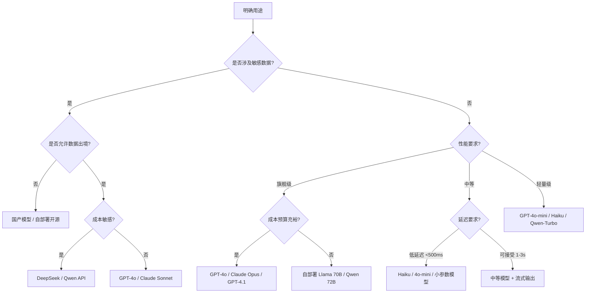

# 模型选择与部署策略：GPT、Claude、开源模型、国产模型全景

模型选型是 LLM 工程落地中最关键的前置决策之一。选错了模型，要么是花了冤枉钱——用旗舰模型跑分类任务；要么是质量坍塌——用轻量模型做复杂推理。更隐蔽的陷阱在于：你在评估阶段用 API 跑通了 POC，上线时才发现 10 万次日请求的成本远超预算，或者数据合规要求不允许把用户数据发往境外。

本文为有 LLM 应用开发经验的工程师提供一份系统性的选型与部署参考。不做入门科普，聚焦决策：**什么场景用什么模型，用什么方式部署，花多少钱**。

---

## 1. 模型选型的工程决策框架

模型选型不是一个技术问题，而是一个**四维决策问题**：用途、性能需求、成本预算、部署约束。下面给出一个实用的决策树：

### 1.1 决策树

```mermaid
graph TD
    A[明确用途] --> B{是否涉及敏感数据?}
    B -->|是| C{是否允许数据出境?}
    B -->|否| D{性能要求?}
    C -->|否| E[国产模型 / 自部署开源]
    C -->|是| F{成本敏感?}
    D -->|旗舰级| G{成本预算充裕?}
    D -->|中等| H{延迟要求?}
    D -->|轻量级| I[GPT-4o-mini / Haiku / Qwen-Turbo]
    F -->|是| J[DeepSeek / Qwen API]
    F -->|否| K[GPT-4o / Claude Sonnet]
    G -->|是| L[GPT-4o / Claude Opus / GPT-4.1]
    G -->|否| M[自部署 Llama 70B / Qwen 72B]
    H -->|低延迟 <500ms| N[Haiku / 4o-mini / 小参数模型]
    H -->|可接受 1-3s| O[中等模型 + 流式输出]
```

### 1.2 四维决策矩阵

| 维度 | 关键问题 | 决策要点 |
| :--- | :--- | :--- |
| **用途** | 文本生成？代码生成？多模态？分类/提取？ | 分类/提取等简单任务用小模型；复杂推理用旗舰模型 |
| **性能需求** | 准确率容忍度？延迟要求？输出长度？ | 延迟 <500ms 场景几乎必须用小模型或自部署 |
| **成本预算** | 月预算？日请求量？可接受的单次成本？ | 见第 6 节的成本分析 |
| **部署约束** | 数据合规？网络环境？运维能力？ | 合规场景优先国产/自部署；无运维团队优先 Cloud API |

### 1.3 一个实用经验法则

**先用最强模型验证产品质量的上限，再用成本约束向下选型**。具体做法：

1. 用 GPT-4o 或 Claude Opus 跑通核心场景，建立质量基线
2. 逐步替换为更便宜的模型（4o-mini、Haiku、Qwen-Turbo），对比质量损失
3. 对于质量下降超过可接受阈值的任务，保留强模型；其余降级

这个"从上往下试"的策略比"从下往上试"效率高得多——因为你很快就能知道质量天花板在哪里。

---

## 2. 闭源模型对比

### 2.1 综合对比表

| 模型 | 上下文窗口 | 输入价格 ($/1M) | 输出价格 ($/1M) | 核心优势 | 适用场景 |
| :--- | :--- | :--- | :--- | :--- | :--- |
| **GPT-4o** | 128K | $2.50 | $10.00 | 多模态（文本+图像+音频）、工具调用成熟、生态最完整 | 通用旗舰，多模态，复杂推理 |
| **GPT-4o-mini** | 128K | $0.15 | $0.60 | 极致性价比，128K 上下文 | 分类、提取、简单问答、大批量处理 |
| **GPT-4.1** | 1M | $2.00 | $8.00 | 百万级上下文，指令遵循大幅提升 | 长文档分析，大规模代码理解 |
| **Claude 3.5 Sonnet** | 200K | $3.00 | $15.00 | 长上下文质量领先，代码生成优秀，Extended Thinking | 代码生成，长文分析，复杂推理 |
| **Claude 3.5 Haiku** | 200K | $0.80 | $4.00 | 速度极快（首 token <300ms），200K 上下文 | 高并发场景，实时对话，路由分类 |
| **Claude Opus 4** | 200K | $15.00 | $75.00 | 最强推理能力，多步复杂任务 | 科研级推理，复杂 Agent 任务 |
| **Gemini 1.5 Pro** | 2M | $1.25-$2.50 | $5.00-$10.00 | 超长上下文（2M），多模态原生支持 | 超长文档/视频理解，多模态分析 |
| **Gemini 1.5 Flash** | 1M | $0.075 | $0.30 | 极低价格，速度快 | 大批量轻量任务，实时应用 |

### 2.2 选型策略

**OpenAI（GPT 系列）** 的核心优势在于**生态成熟度**：Function Calling 支持最完善、插件生态最丰富、社区资源最多。GPT-4o 是当前"不会出错"的默认选择——几乎所有场景都能胜任，只是不一定是最优解。

**Anthropic（Claude 系列）** 在**代码生成和长文分析**上有明确优势。Claude 3.5 Sonnet 的代码能力在多项评测中超过 GPT-4o，且 200K 上下文窗口在处理长文档时有实际优势——不需要分段处理，上下文连贯性更好。Extended Thinking 模式允许模型在回答前进行多步推理，适合需要深度思考的任务。

**Google（Gemini 系列）** 的差异化在于**超长上下文**。2M Token 的上下文窗口意味着可以一次性处理整本书籍、完整的代码仓库或长达数小时的视频转写。Gemini 1.5 Flash 的定价策略极具攻击性——$0.075/1M 输入 Token，比 GPT-4o-mini 便宜一倍。

### 2.3 API 能力矩阵

| 能力 | GPT-4o | Claude 3.5 Sonnet | Gemini 1.5 Pro |
| :--- | :--- | :--- | :--- |
| Function Calling | ✅ 最成熟 | ✅ 支持 | ✅ 支持 |
| Structured Output (JSON Schema) | ✅ | ✅ | ✅ |
| Vision（图像理解） | ✅ | ✅ | ✅ |
| Audio 输入/输出 | ✅ 原生 | ❌ | ✅ |
| Extended Thinking | ❌ | ✅ | ✅ (思考模式) |
| Batch API | ✅ 50% 折扣 | ✅ 50% 折扣 | ✅ |
| 文件上传 | ✅ | ✅ | ✅ |
| 代码解释器 | ✅ Sandbox | ❌ | ✅ Sandbox |
| Web Search | ✅ 内置 | ❌ 需 Function | ✅ grounding |

---

## 3. 开源模型对比

开源模型在 2024-2025 年经历了质的飞跃。部分模型在特定任务上已经接近甚至超越闭源模型，同时带来了**部署灵活性、数据隐私、定制化能力**等闭源模型无法提供的优势。

### 3.1 综合对比表

| 模型 | 参数量 | 架构 | 许可证 | MMLU | MATH | HumanEval | 部署最低显存 (FP16) |
| :--- | :--- | :--- | :--- | :--- | :--- | :--- | :--- |
| **Llama 3.1 8B** | 8B | Dense Transformer | Llama License | 68.4 | 51.9 | 72.6 | ~16 GB (1×A100-40G) |
| **Llama 3.1 70B** | 70B | Dense Transformer | Llama License | 86.1 | 68.0 | 80.5 | ~140 GB (2×A100-80G) |
| **Llama 3.1 405B** | 405B | Dense Transformer | Llama License | 88.6 | 73.8 | 89.0 | ~810 GB (8×A100-80G) |
| **Llama 3.2 3B** | 3B | Dense Transformer | Llama License | 63.4 | 42.0 | 58.2 | ~6 GB |
| **Llama 3.2 90B** | 90B (V+T) | Dense + Adapter | Llama License | 87.5 | 71.8 | 86.1 | ~180 GB (2×A100-80G) |
| **Mixtral 8x7B** | 47B (12B 激活) | MoE | Apache 2.0 | 70.6 | 40.2 | 68.5 | ~30 GB |
| **DeepSeek-V3** | 671B (37B 激活) | MoE | MIT | 88.5 | 90.2 | 82.6 | ~600 GB (8×H100) |
| **Qwen2.5-72B** | 72B | Dense | Apache 2.0 | 86.1 | 83.1 | 86.0 | ~150 GB |
| **GLM-4-9B** | 9B | Dense | 自定义开源 | 72.4 | 58.3 | 72.6 | ~20 GB |

### 3.2 开源选型要点

- **许可证是第一过滤器**：Llama 系列月活超 7 亿需额外授权；Qwen/DeepSeek 的 Apache/MIT 干净得多，商业产品先过法务
- **中文场景优先国产开源**：Qwen2.5 与 GLM 在中文指令遵循上系统性优于 Llama
- **DeepSeek-V3 类 MoE**：计算便宜但显存贪婪——单机部署先算权重显存账（FP8 约 350GB 级），中小流量用 API 往往比自部署划算
- **微调可行性**：7B-72B 做 LoRA 单卡可行；405B 级别的微调成本会迅速超过直接用闭源 API

---

## 4. 国产模型全景

| 模型 | 厂商 | 强项 | 典型场景 |
| :--- | :--- | :--- | :--- |
| Qwen 系列 | 阿里 | 尺寸矩阵最全、中文+代码、开源生态 | 通用、出海多语言 |
| DeepSeek V3/R1 | 深度求索 | MoE 成本、推理模型开源、API 低价 | 预算敏感、推理任务 |
| GLM-4/4.5 | 智谱 | Agent 工具调用、学术评测稳 | 国产合规 Agent |
| Kimi（Moonshot） | 月之暗面 | 长上下文原生（128K-2M） | 长文档、搜索问答 |
| 豆包 | 字节 | 多模态、语音、端侧 | C 端产品、火山引擎生态 |
| 混元 | 腾讯 | 微信/企微生态集成 | 社交场景分发 |

**合规视角**：涉个人数据、政企内网、备案要求的场景，国产 API（境内数据闭环）或私有化部署开源权重往往是少数合规路径；同时注意生成内容的备案与标识义务。

---

## 5. 部署方式与推理栈

### 5.1 三种部署形态

| 形态 | 适合 | 成本结构 | 运维负担 |
| :--- | :--- | :--- | :--- |
| **Cloud API** | 快速上线、波动流量 | 按 Token 线性 | 几乎零 |
| **私有化推理服务** | 合规、稳定高并发 | GPU 固定投入，量大更省 | 高（调度/灰度/升级） |
| **端侧/边缘** | 离线、隐私、小请求 | 硬件一次性 | 中（OTA、机型碎片化） |

**盈亏平衡经验值**：自部署 70B 级（约 $3-5K/月 GPU 折算）通常在月 API 支出超过 $10-20K 时才开始划算，还要计入工程人力。

### 5.2 开源推理栈选型

- **vLLM**：事实标准，PagedAttention + continuous batching，量化与 LoRA 服务齐全
- **SGLang**：RadixAttention 前缀复用，Agent/多轮场景吞吐更高
- **TensorRT-LLM**：NVIDIA 压榨路线，延迟最优、构建最麻烦
- **llama.cpp / Ollama**：CPU/消费级 Mac/端侧，GGUF 生态

### 5.3 升级与降级链路

生产系统建议内置三层：**主模型 → 同厂降级（换小）→ 跨厂兜底（换 API）**。路由层按任务复杂度分流（简单任务 4o-mini/Haiku/Qwen-Turbo，复杂任务旗舰），典型混合架构实测可把成本砍 60-80% 而质量几乎无损。

---

## 6. 总结：选型是动态决策

没有"最好的模型"，只有这个季度、这个任务、这个预算下的最优组合。三条铁律收束全文：**一、用最强模型定质量基线，逐级降级做替换实验，用黄金集而不是感觉判质量；二、成本按输出 Token 与调用次数建模，缓存、Batch API、路由三层各自能省约一半；三、合规约束先于技术偏好——数据出境、备案、许可证三条红线任一不过，模型再强也出局**。模型市场半年一变，但"基线—降级—兜底"的决策框架比任何单款模型的排名都长寿。

(注：文中价格、参数与评测分整理自各厂商 2025 年公开定价页与模型卡，榜单为社区评测近似值；实际部署前请以官方最新数据核实。)

本文面向授权安全研究与防御建设，未经授权对任何系统实施文中技术属违法行为。
