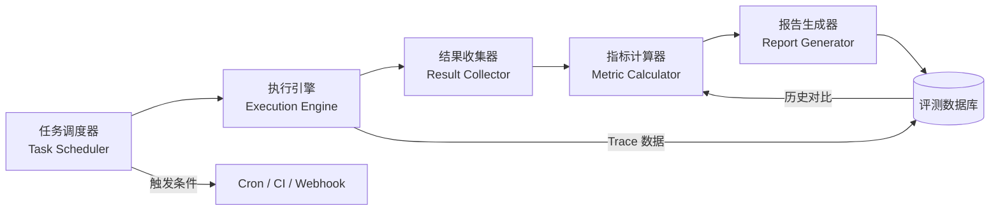
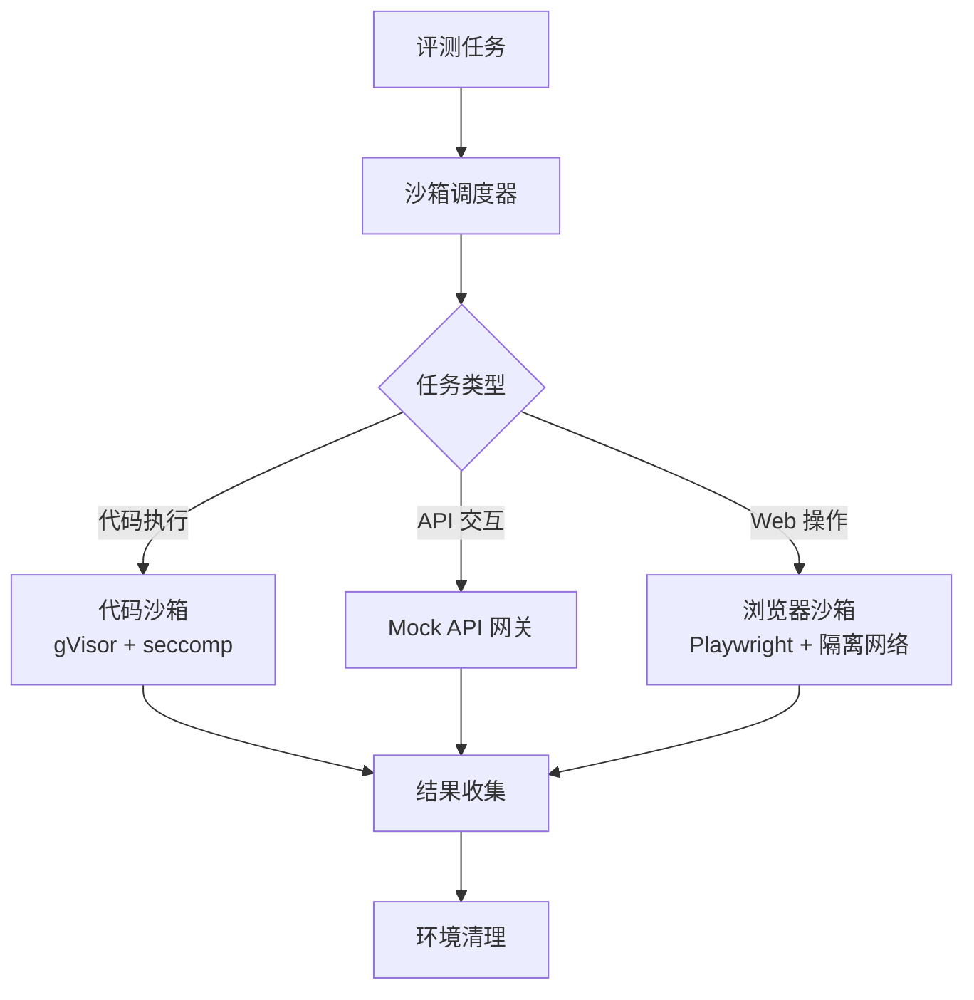
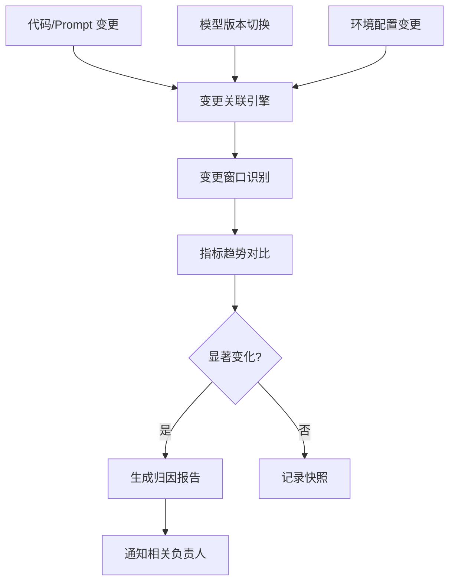
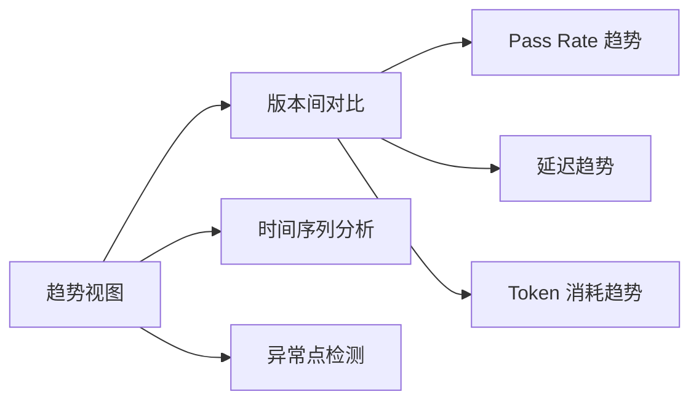
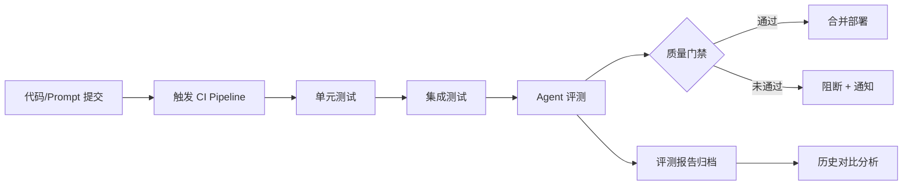
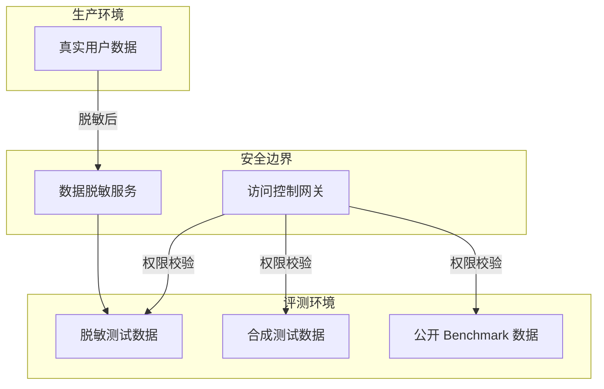

## 为什么需要评测平台

在 [Agent 评测方法论](../Agent评测方法论：维度设计、指标体系与评测框架/) 中，我们建立了评测维度与指标体系的抽象框架；在 [LLM-as-Judge](../LLM-as-Judge：原理、偏差分析与实战配置/) 中，我们掌握了自动化评判的技术手段。然而，当这些方法论和工具要真正落地到生产环境中，一个系统化的**评测平台**是不可或缺的基础设施。

评测平台解决的核心问题是**评测工程化**——将手工的、一次性的评测活动转化为自动化的、可重复的、可追踪的持续质量保障体系。具体而言，评测平台需要回答以下问题：

- **如何规模化执行**：数百个测试用例、多个模型版本、不同评测维度的排列组合，如何高效调度？
- **如何保证可重复性**：非确定性输出下，如何让评测结果可比较、可追踪？
- **如何快速定位问题**：当某次评测指标下降时，是哪个模块、哪个环节出了问题？
- **如何持续运转**：如何将评测嵌入开发流水线，而非每次手动触发？

本文将围绕评测平台的核心架构设计，从模块拆解、执行模式、Trace 回放、归因分析到可视化设计，构建一个完整的技术方案。

---

## 评测平台核心模块

一个生产级的评测平台通常由四个核心模块组成，它们通过数据流串联形成完整的评测闭环：



### 任务调度器（Task Scheduler）

任务调度器是评测平台的"大脑"，负责评测任务的编排、排队和分发。其核心职责包括：

**任务定义**：将评测需求抽象为结构化的任务描述。一个评测任务通常包含以下字段：

```python
class EvalTask:
    task_id: str
    eval_suite: str          # 评测集名称，如 "swe_bench_verified"
    model_config: dict       # 模型配置（模型名、temperature、max_tokens 等）
    agent_config: dict       # Agent 配置（prompt、tools、max_steps 等）
    environment: dict        # 运行环境配置（Docker 镜像、环境变量等）
    evaluator: str           # 评测器类型（exact_match / llm_judge / custom）
    priority: int            # 优先级（用于调度排序）
    created_at: datetime
    status: str              # pending / running / completed / failed
```

**调度策略**：根据资源约束和业务需求，调度器需要实现合理的任务编排：

| 策略 | 适用场景 | 实现方式 |
|------|---------|---------|
| **FIFO** | 开发调试阶段 | 简单队列，先进先出 |
| **优先级调度** | CI/CD 集成 | 优先级队列，高优先级任务优先执行 |
| **资源感知调度** | 大规模批量评测 | 根据 GPU/API 配额动态分配 |
| **去重合并** | 重复触发的相同评测 | Hash 去重，合并相同任务 |

**并发控制**：评测任务通常涉及大量 LLM API 调用，必须控制并发度以避免触发限流。一个典型的实现是使用 Token Bucket 算法控制 API 调用速率：

```python
class RateLimiter:
    def __init__(self, rpm: int, tpm: int):
        self.rpm_bucket = TokenBucket(capacity=rpm, refill_rate=rpm / 60)
        self.tpm_bucket = TokenBucket(capacity=tpm, refill_rate=tpm / 60)

    async def acquire(self, estimated_tokens: int = 1000):
        await self.rpm_bucket.consume(1)
        await self.tpm_bucket.consume(estimated_tokens)

    async def __aenter__(self):
        await self.acquire()
        return self

    async def __aexit__(self, *args):
        pass
```

### 结果收集器（Result Collector）

结果收集器负责在评测执行过程中和执行完成后，收集、校验和持久化评测结果。对于 Agent 评测，结果收集不仅包含最终输出，还包含执行过程中的 Trace 数据。

```python
class ResultCollector:
    def __init__(self, db: EvalDatabase):
        self.db = db

    async def collect(self, task: EvalTask, result: EvalResult):
        await self.db.save_result({
            "task_id": task.task_id,
            "eval_suite": task.eval_suite,
            "model": task.model_config["model"],
            "final_output": result.output,
            "trace": result.trace,           # 完整的执行 Trace
            "tool_calls": result.tool_calls,  # 工具调用记录
            "metrics": result.metrics,         # 初步计算的指标
            "latency_ms": result.latency_ms,
            "token_usage": result.token_usage,
            "status": result.status,
            "error": result.error,
            "completed_at": datetime.utcnow()
        })
```

### 指标计算器（Metric Calculator）

指标计算器基于收集到的原始结果，计算多维度的评测指标。它支持多种评测模式的组合：

- **精确匹配（Exact Match）**：输出与标准答案的逐字对比
- **语义相似度（Semantic Similarity）**：基于 Embedding 的向量相似度
- **LLM-as-Judge**：调用更强的模型进行质量评判
- **自定义函数（Custom Evaluator）**：针对特定任务的业务逻辑验证

### 报告生成器（Report Generator）

报告生成器将指标数据转化为可读的评测报告，支持单次评测报告和跨版本趋势报告。它同时负责将报告推送到通知渠道（Slack、邮件、飞书等）。

---

## 执行式评测（Execution-based Eval）

执行式评测是 Agent 评测最直接的模式——让 Agent 在真实或模拟环境中完成任务，然后验证执行结果的正确性。

### 环境搭建策略

Agent 的执行依赖外部环境（数据库、文件系统、Web 服务等），环境的一致性直接决定评测的可重复性。工程实践中常见的环境隔离方案：

| 方案 | 隔离级别 | 启动时间 | 适用场景 |
|------|---------|---------|---------|
| **Docker 容器** | 进程+文件系统 | 5-30s | 标准化评测环境 |
| **快照恢复（Snapshot）** | 完整系统状态 | 1-5s | 需要复杂环境状态 |
| **沙箱（Sandbox）** | 进程隔离 | <1s | 轻量级代码执行 |
| **Mock 服务** | API 层 | <1s | 依赖外部 API 的评测 |

一个典型的 Docker 化评测环境定义如下：

```yaml
# eval_environment.yaml
name: swe_bench_eval
docker_image: swe_bench/py:3.11
setup:
  - pip install -r requirements.txt
  - python scripts/prepare_data.py
environment:
  MAX_STEPS: 50
  TOOL_TIMEOUT: 30
  API_ENDPOINT: http://mock-server:8080
cleanup:
  - docker compose down -v
```

### 结果验证机制

执行式评测的核心挑战在于**如何验证结果的正确性**。对于不同类型的 Agent 任务，验证策略差异显著：

```python
class ResultVerifier:
    def verify(self, task: EvalTask, output: dict, env: Environment) -> dict:
        if task.task_type == "code_generation":
            return self._verify_code(output["code"], task.test_cases)
        elif task.task_type == "data_extraction":
            return self._verify_extraction(output["data"], task.expected)
        elif task.task_type == "web_navigation":
            return self._verify_state(env.get_state(), task.target_state)
        elif task.task_type == "multi_step_reasoning":
            return self._verify_chain(output["trace"], task.evaluation_rubric)
        else:
            return self._verify_with_llm_judge(output, task)

    def _verify_code(self, code: str, test_cases: list) -> dict:
        exec_result = sandbox.run(code, test_cases)
        return {
            "passed": exec_result.all_passed,
            "pass_rate": exec_result.pass_rate,
            "details": exec_result.test_details
        }
```

### 评测沙箱设计

安全是评测环境设计中容易被忽视的维度。Agent 在评测过程中可能执行任意代码、访问网络、修改文件系统，必须将其限制在沙箱内。评测沙箱的设计需要平衡**隔离性**（安全性）和**保真度**（评测真实性）：



---

## Trace 式评测（Trace-based Eval）

Trace 式评测是近年来兴起的一种更精细化的评测模式。与执行式评测关注最终结果不同，Trace 式评测记录 Agent 的完整执行轨迹，支持事后回放、逐步分析和差异对比。

### Trace 记录格式

一个标准化的 Trace 格式需要捕获 Agent 执行过程中的所有关键事件。以下是经过工程验证的 Trace Schema：

```json
{
  "trace_id": "tr_20250601_abc123",
  "task_id": "task_swe_001",
  "model": "claude-3.5-sonnet",
  "started_at": "2025-06-01T10:00:00Z",
  "completed_at": "2025-06-01T10:03:42Z",
  "total_tokens": 15234,
  "events": [
    {
      "step": 0,
      "type": "system_message",
      "content": "You are a code assistant...",
      "timestamp": "2025-06-01T10:00:00Z"
    },
    {
      "step": 1,
      "type": "user_message",
      "content": "Fix the bug in auth.py...",
      "timestamp": "2025-06-01T10:00:01Z"
    },
    {
      "step": 2,
      "type": "tool_call",
      "tool_name": "read_file",
      "arguments": {"path": "src/auth.py"},
      "result": {"content": "...", "status": "success"},
      "timestamp": "2025-06-01T10:00:03Z",
      "latency_ms": 1847
    },
    {
      "step": 3,
      "type": "reasoning",
      "content": "I can see the issue at line 42...",
      "timestamp": "2025-06-01T10:00:05Z"
    },
    {
      "step": 4,
      "type": "tool_call",
      "tool_name": "edit_file",
      "arguments": {"path": "src/auth.py", "old": "...", "new": "..."},
      "result": {"status": "success", "diff": "..."},
      "timestamp": "2025-06-01T10:00:08Z",
      "latency_ms": 523
    }
  ],
  "final_output": "Fixed the authentication bug...",
  "result": {
    "status": "passed",
    "metrics": {"accuracy": 1.0, "efficiency": 0.85}
  }
}
```

### Trace 回放机制

Trace 回放是 Trace 式评测的核心能力——在不重新执行 LLM 推理的情况下，通过回放历史 Trace 来验证评测逻辑的正确性或进行对比分析。回放机制的关键设计点在于**状态恢复**和**分支模拟**。

**状态恢复**：Agent 执行过程中的每一步都会产生状态变化（文件修改、数据库变更、API 状态等）。回放时需要能够恢复到任意步骤的状态快照。

```python
class TraceReplayer:
    def __init__(self, trace: dict, env: Environment):
        self.trace = trace
        self.env = env
        self.snapshots: dict[int, EnvironmentState] = {}

    def take_snapshot(self, step: int):
        self.snapshots[step] = self.env.capture_state()

    def replay_to_step(self, target_step: int) -> EnvironmentState:
        if target_step in self.snapshots:
            return self.snapshots[target_step]

        self.env.reset()
        for event in self.trace["events"]:
            if event["step"] > target_step:
                break
            if event["type"] == "tool_call":
                self.env.execute_tool(event["tool_name"], event["arguments"])
            self.take_snapshot(event["step"])

        return self.snapshots[target_step]

    def replay_with_modification(self, step: int, modification: dict):
        state = self.replay_to_step(step)
        self.env.restore_state(state)
        self.env.apply_modification(modification)
```

**分支模拟**：在 Trace 回放过程中，可以在任意步骤"截断"，替换后续的 Agent 决策，观察不同的执行路径是否会导致不同的结果。这对于分析 Agent 决策的关键转折点非常有价值。

```python
class BranchSimulator:
    def __init__(self, trace_replayer: TraceReplayer):
        self.replayer = trace_replayer

    def simulate_branch(self, fork_step: int, new_action: dict) -> dict:
        state = self.replayer.replay_to_step(fork_step)
        self.replayer.env.restore_state(state)
        self.replayer.env.execute_tool(
            new_action["tool_name"],
            new_action["arguments"]
        )
        return self.replayer.env.get_current_state()
```

### Trace 对比分析

Trace 对比是 Trace 式评测的高价值应用——将同一任务在不同模型、不同 Prompt、不同配置下的执行 Trace 进行结构化对比，快速定位性能差异的根源。

| 对比维度 | 分析方法 | 产出 |
|---------|---------|------|
| **步骤数差异** | 逐步骤对齐 | 冗余步骤识别 |
| **工具选择差异** | 工具调用序列 Diff | 工具选择优化建议 |
| **推理路径差异** | 语义相似度 + 关键节点对齐 | 推理链优化方向 |
| **Token 消耗差异** | 逐步骤 Token 拆解 | 成本优化建议 |
| **延迟分布差异** | P50/P90/P99 对比 | 性能瓶颈定位 |

---

## 归因分析

归因分析是评测平台的高阶能力——当评测指标出现波动时，能够自动定位问题根因并分配责任。这在多组件协作的 Agent 系统中尤为关键。

### 指标分解框架

Agent 系统的最终评测指标通常是多个子指标的复合函数。归因分析的第一步是建立指标分解树：

```
                    任务成功率 (Pass Rate)
                          │
            ┌─────────────┼─────────────┐
            │             │             │
      推理正确性      工具调用质量     输出格式合规
    (Reasoning)     (Tool Quality)   (Format)
         │              │              │
    ┌────┼────┐    ┌────┼────┐    ┌───┼───┐
    │    │    │    │    │    │    │       │
  理解  推断  总结  选择  参数  结果  Schema  长度
  能力  能力  能力  准确  正确  解读  校验    校验
```

基于分解树，当最终指标下降时，可以通过逐层下钻快速定位问题所在的子模块。

### 自动归因算法

```python
class AttributionAnalyzer:
    def __init__(self, historical_data: pd.DataFrame):
        self.history = historical_data

    def decompose(self, current_metrics: dict, baseline_metrics: dict) -> dict:
        attribution = {}
        total_delta = current_metrics["pass_rate"] - baseline_metrics["pass_rate"]

        for component, sub_metrics in METRIC_TREE.items():
            component_delta = sum(
                current_metrics[m] - baseline_metrics[m]
                for m in sub_metrics
            )
            attribution[component] = {
                "delta": component_delta,
                "weight": component_delta / total_delta if total_delta != 0 else 0,
                "sub_metrics": {
                    m: current_metrics[m] - baseline_metrics[m]
                    for m in sub_metrics
                }
            }

        return sorted(attribution.items(), key=lambda x: abs(x[1]["delta"]), reverse=True)

    def blame_assignment(self, task_results: list[dict]) -> dict:
        blame = {"reasoning": 0, "tool_call": 0, "format": 0, "env": 0}
        for result in task_results:
            if result["status"] == "failed":
                root_cause = self._classify_failure(result)
                blame[root_cause] += 1

        total_failures = sum(blame.values())
        return {
            k: {"count": v, "ratio": v / total_failures if total_failures > 0 else 0}
            for k, v in blame.items()
        }

    def _classify_failure(self, result: dict) -> str:
        trace = result["trace"]
        for event in reversed(trace["events"]):
            if event["type"] == "tool_call" and event["result"]["status"] == "error":
                return "tool_call"
            if event["type"] == "reasoning" and self._has_reasoning_error(event):
                return "reasoning"
        if not self._validate_output_format(result["final_output"]):
            return "format"
        return "env"
```

### 变更关联分析

归因分析的另一个重要维度是将评测指标变化与系统变更（代码提交、模型版本切换、Prompt 修改）关联起来。这需要评测平台与版本管理系统联动：



归因报告的核心内容包括：

| 报告项 | 描述 |
|-------|------|
| **变更摘要** | 在评测指标变化窗口内发生的所有系统变更 |
| **指标变化** | 各维度指标的具体变化幅度和统计显著性 |
| **关联度评分** | 每个变更与指标变化的关联度（基于时间窗口和影响范围） |
| **置信度** | 归因结论的统计置信度（考虑样本量和噪声） |
| **建议操作** | 基于归因结果的建议（回滚、修复、进一步调查） |

---

## 可视化设计

评测数据的价值最终需要通过可视化来传递给开发者和决策者。一个优秀的评测可视化系统需要支持多层级、多视角的数据呈现。

### 核心视图设计

**趋势视图（Trend View）**

展示核心指标随时间的变化趋势，支持按模型版本、评测集、任务类型等维度筛选。这是评测仪表盘最基础也最重要的视图。



**对比视图（Comparison View）**

横向对比不同模型或配置在同一评测集上的表现。支持并排对比和雷达图对比两种模式：

| 对比模式 | 适用场景 | 可视化形式 |
|---------|---------|-----------|
| **并排对比** | 两个模型/配置的直接比较 | 双列柱状图 + 差异高亮 |
| **雷达图对比** | 多维度综合对比 | 多边形叠加雷达图 |
| **排名视图** | 多个模型的综合排名 | 带排序的表格 + 热力色 |

**归因热力图（Attribution Heatmap）**

将评测指标的归因分析结果以热力图形式呈现，直观展示各组件对整体指标变化的贡献度。

```python
def render_attribution_heatmap(attribution_data: dict) -> dict:
    matrix = []
    components = ["reasoning", "tool_call", "format", "env"]
    metrics = ["pass_rate", "accuracy", "latency", "cost"]

    for comp in components:
        row = []
        for metric in metrics:
            contribution = attribution_data.get(comp, {}).get(metric, 0)
            row.append(round(contribution, 3))
        matrix.append(row)

    return {
        "type": "heatmap",
        "x_labels": metrics,
        "y_labels": components,
        "data": matrix,
        "color_scale": ["#2ecc71", "#f1c40f", "#e74c3c"]
    }
```

### Dashboard 布局设计

一个完整的评测 Dashboard 建议采用以下布局：

```
┌─────────────────────────────────────────────────────────┐
│                    评测平台 Dashboard                     │
├──────────────────────┬──────────────────────────────────┤
│   核心指标卡片        │     趋势图 (折线图)               │
│   Pass Rate │ Cost   │     最近 30 天指标趋势             │
│   Latency   │ Tokens │     支持版本/模型筛选              │
├──────────────────────┼──────────────────────────────────┤
│   模型对比 (雷达图)   │     归因热力图                    │
│   当前版本 vs 基线    │     组件贡献度可视化               │
├──────────────────────┴──────────────────────────────────┤
│                    评测任务列表                           │
│   任务ID │ 模型 │ 状态 │ 通过率 │ 耗时 │ 操作             │
├─────────────────────────────────────────────────────────┤
│                    最新评测报告                           │
│   完整报告查看 │ 下载 │ 分享                               │
└─────────────────────────────────────────────────────────┘
```

---

## 离线 + 在线联动

评测平台的终极目标是建立**离线评测驱动开发、在线评测保障生产**的持续质量闭环。

### 离线评测管线

离线评测服务于开发阶段，在每次代码提交或模型更新后自动触发。典型的离线评测管线如下：



离线评测的关键设计原则：

- **速度优先**：精选核心评测子集，确保评测在 10 分钟内完成，不影响开发节奏
- **质量门禁**：设定 Pass Rate 阈值，低于阈值的提交自动阻断合并
- **增量评测**：只评测受变更影响的用例，避免全量评测的资源浪费
- **结果可追溯**：每次评测结果与代码版本强绑定，支持任意版本的回溯对比

### 在线 A/B 评测

在线评测在生产环境中对真实用户流量进行 A/B 测试，验证 Agent 改进的实际效果。与离线评测相比，在线评测需要额外关注以下方面：

| 维度 | 离线评测 | 在线评测 |
|------|---------|---------|
| **数据来源** | 固定测试集 | 真实用户请求 |
| **评估指标** | Pass Rate、Accuracy | 用户满意度、任务完成率、留存率 |
| **反馈延迟** | 即时 | 小时到天级 |
| **安全风险** | 低（隔离环境） | 高（影响真实用户） |
| **样本量** | 可控 | 需要统计显著性 |

在线评测的流量分配策略需要特别谨慎。一个安全的做法是渐进式放量：

```
阶段 1: 1% 流量 → 验证无明显异常
阶段 2: 5% 流量 → 收集核心指标数据
阶段 3: 20% 流量 → 验证统计显著性
阶段 4: 50% 流量 → 全量发布前的最终验证
阶段 5: 100% 流量 → 全量切换
```

### 持续评测管线

将离线和在线评测串联为统一的持续评测管线：

```python
class ContinuousEvalPipeline:
    def __init__(self, config: dict):
        self.offline_eval = OfflineEvaluator(config["offline"])
        self.online_eval = OnlineEvaluator(config["online"])
        self.gate = QualityGate(config["gate_rules"])

    async def on_code_change(self, change: CodeChange):
        offline_result = await self.offline_eval.run(change)
        gate_result = self.gate.evaluate(offline_result)

        if gate_result.passed:
            await self.deploy_to_staging(change)
            online_result = await self.online_eval.run_canary(change)
            if online_result.is_significant_improvement():
                await self.promote_to_production(change)
            else:
                await self.rollback(change)
        else:
            await self.notify_failure(change, gate_result)
```

---

## 安全视角

评测平台在安全方面有独特的考量，因为它同时涉及**模型 API 密钥管理**、**评测数据隔离**和**测试数据隐私**三个敏感领域。

### 模型 API Key 管理

评测过程需要频繁调用模型 API，API Key 的安全管理至关重要：

| 风险 | 防护措施 |
|------|---------|
| Key 泄露到评测报告 | 报告生成时过滤所有 API 调用日志中的 Key 片段 |
| Key 被滥用产生高额费用 | 设置每小时/每天的 API 调用预算上限 |
| 多团队共享 Key 缺乏审计 | 基于角色的 Key 分配 + 完整的调用审计日志 |
| Key 存储在配置文件中 | 使用 Vault/KMS 运行时注入，禁止持久化存储 |

```python
class SecureAPIKeyManager:
    def __init__(self, vault_client):
        self.vault = vault_client
        self.usage_tracker = UsageTracker()

    async def get_key(self, eval_task: EvalTask) -> str:
        budget = await self.usage_tracker.get_remaining_budget(
            team=eval_task.team,
            model=eval_task.model_config["model"]
        )
        if budget <= 0:
            raise BudgetExceededError(eval_task.team)

        key = await self.vault.get_secret(
            path=f"eval/keys/{eval_task.model_config['model']}",
            version="latest"
        )
        return key

    async def track_usage(self, eval_task: EvalTask, usage: TokenUsage):
        await self.usage_tracker.record(
            team=eval_task.team,
            model=eval_task.model_config["model"],
            tokens=usage.total_tokens,
            cost=usage.estimated_cost
        )
```

### 评测数据隔离

评测数据可能包含敏感的业务数据（如用户查询、内部文档内容），必须实施严格的数据隔离：



评测数据管理的关键原则：

- **最小权限**：评测工程师只能访问其负责的评测集数据
- **数据脱敏**：使用生产数据构建评测集时，必须经过脱敏处理
- **访问审计**：所有评测数据的访问操作记录审计日志
- **生命周期管理**：评测数据设置过期策略，定期清理

### 测试数据隐私

对于涉及个人信息的评测场景（如客服 Agent、医疗 Agent），需要特别关注数据隐私合规：

| 合规要求 | 实施措施 |
|---------|---------|
| **数据最小化** | 评测集仅包含评测必需的数据字段 |
| **匿名化** | 个人信息通过 Hash 或替换进行匿名化处理 |
| **存储加密** | 评测数据静态存储时使用 AES-256 加密 |
| **传输加密** | 评测数据传输全程使用 TLS 1.3 |
| **审计追踪** | 记录数据的完整生命周期（创建→使用→销毁） |

---

## 延伸阅读

- [Agent 评测方法论：维度设计、指标体系与评测框架](../Agent评测方法论：维度设计、指标体系与评测框架/) — 评测维度设计与指标体系构建的完整方法论
- [LLM-as-Judge：原理、偏差分析与实战配置](../LLM-as-Judge：原理、偏差分析与实战配置/) — 自动化评判的技术实现与偏差控制
- [Agent Benchmark 生态：AgentBench/SWE-Bench/τ-Bench/BFCL 解读](../Agent Benchmark生态：AgentBench、SWE-Bench、τ-Bench、BFCL解读/) — 主流评测基准的系统性对比
- [LangChain 与 LangGraph 技术栈](../../03-Agent架构与框架生态/LangChain与LangGraph技术栈：核心抽象、工作流编排与生产实践/) — Agent 框架中 Trace 记录的实现参考
- [AI Agent 架构全景](../../03-Agent架构与框架生态/AI Agent架构全景：ReAct、Plan-and-Execute、Reflexion和LATS/) — Agent 架构模式对评测设计的影响
- Google Research, *Holistic Evaluation of Language Models* (HELM), 2022
- OpenAI, *Evaluating Large Language Models Trained on Code* (HumanEval), 2021
- Jimenez et al., *SWE-bench: Can Language Models Resolve Real-World GitHub Issues?*, 2024
- Anthropic, *Scaling LLM Test-Time Compute Optimally*, 2024
