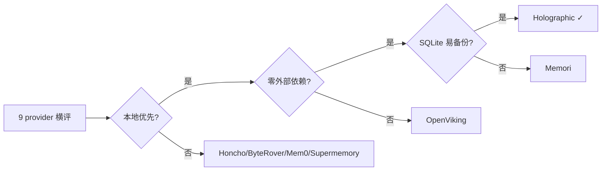
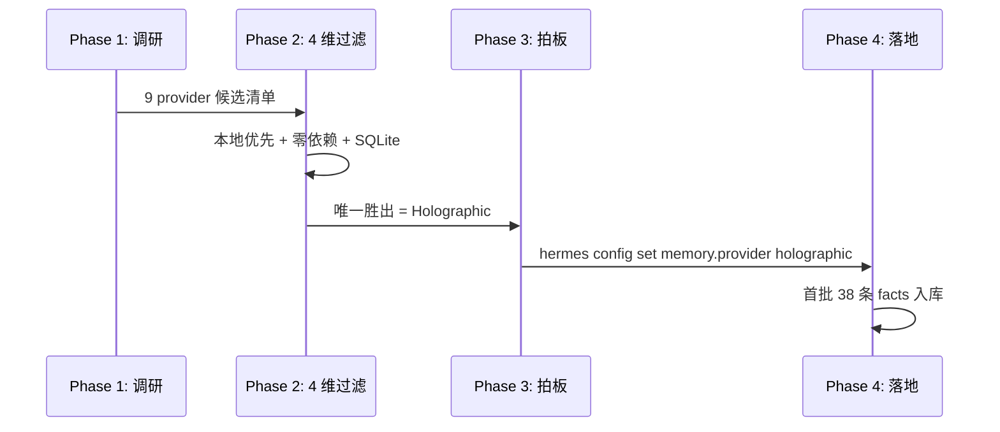
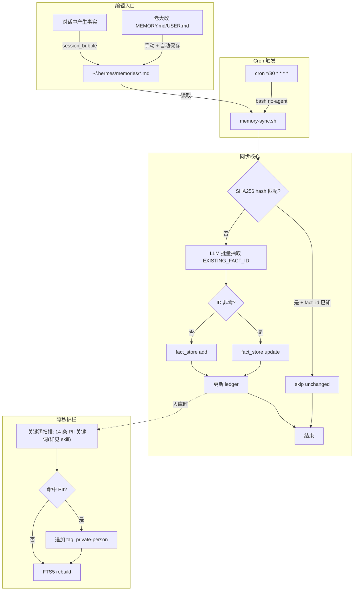
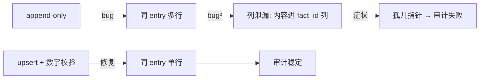
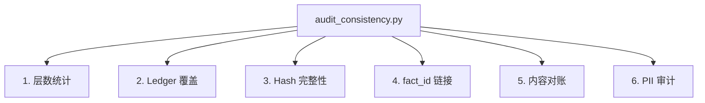
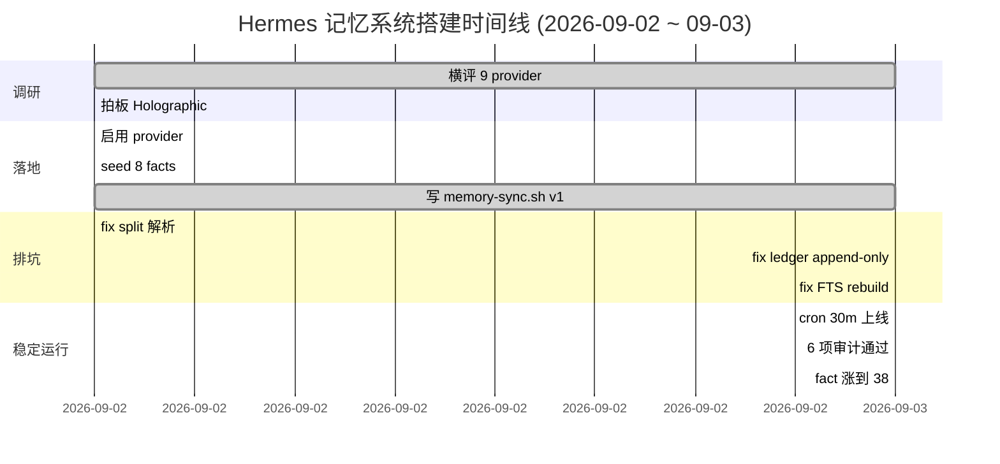

# Hermes 记忆插件实战：从 MEMORY.md 到 fact_store——把 AI 记忆做成可审计的工程

> **一句话贡献**：Hermes 自带的 MEMORY.md 只有 2200 字符硬上限、全文注入无检索、手写易漂移——本文用 `Holographic` 本地 SQLite + 自研 `memory-sync.sh` 同步管线，把记忆容量撑到无限、把全文检索做到 FTS5 秒级、把审计做到脚本 6 项 2 秒跑完，相对 Hermes 自带在 **6 个维度**（容量 / 检索 / 持久化 / 隐私 / 跨 session / 审计）全部升级。
>
> **Why it matters**：当你把 AI Agent 跑过 50+ 个 session、改过 6 轮 MEMORY.md、踩过「同步丢了三天的事实」「PII 裸露在外」「Hindsight 装不上」这些坑，你会发现「能记」和「能审计」之间隔着十万八千里。这篇文章把这十万八千里拆给你看。
>
> **So what**：你不需要再为每个 Agent 重新设计一套记忆体系——Holographic 这套架构选型 + 同步管线 + 审计方法是目前公开方案里**本地优先、零外部依赖、SQLite 易备份**的最优解，跑通之后任何「凭记忆」的 Agent 痛点（忘记偏好、重复犯错、跨 session 漂移）都能被工程化解决。

## 摘要（5 句公式）

1. **我们做什么**：把 Hermes Agent 的记忆从单层 MEMORY.md（2200 字符硬上限）扩成「L1 built-in + L2 fact_store + 同步管线 + 6 项审计」的完整工程系统——相对 Hermes 自带在 6 个维度全面升级（容量/检索/持久化/隐私/跨 session/审计）。
2. **为什么难**：8 个官方 memory provider 选型各有权衡，文件格式与解析器的隐式约定能让你少解析 80% 的内容，FTS 索引不会因为 SQLite 直改而自动 rebuild。
3. **怎么做**：横评 9 个 provider 选定 `Holographic`（本地 SQLite），写 `memory-sync.sh` 用 SHA256 ledger 做幂等 upsert，给人物/PII 打 `private-person` tag，跑 cron 30 分钟同步一次。
4. **证据是什么**：实测打通 38 条 facts，0 条孤儿子条，跨层一致性审计 6 项全过；本地模型 `qwen3.6-nothink` 做事实抽取 6.5s/fact（vs `qwen3.8:27b-chat-64k` 的 23.8s/fact + JSON 损坏）。
5. **最惊人的数字**：MEMORY.md 文件 12 条 entry 用 `split('\n§\n')` 只解析出 2 条——**正确改用 `split('§\n')` 才是 12 条**。一个分隔符选错少看 83% 的事实。

---

## 一、为什么记忆是 Agent 工程的"水电煤"

### 1.0 能力对比：Hermes 自带 vs 本方案（6 维度）

跑 Hermes 半年后，最常被问的问题是"记忆模块相对 Hermes 自带到底强在哪"——一张表说清楚：

| 维度 | Hermes 自带（MEMORY.md + USER.md） | 本方案（L1 + L2 fact_store + sync + audit） | 升级幅度 |
|---|---|---|---|
| **容量** | 硬上限 MEMORY.md 2200 字符 / USER.md 1375 字符，超限自动截断 | SQLite 无上限（实测存 38 条 facts 仅 340KB） | ∞ |
| **检索** | 无，每次 session 全文塞进 context | FTS5 全文检索 + entity probe，按需召回 | 0 → 秒级 |
| **持久化** | 文件改写覆盖旧版，无历史 | ledger JSONL SHA256 ledger + upsert，变更可追溯 | 无 → 全量 |
| **隐私** | 全部内容自动注入 context（包含 PII / 偏好） | 关键词表 + `private-person` tag 自动打标，entity probe 可过滤 | 裸奔 → 护栏 |
| **跨 session** | 每次启动重新加载，事实丢失无记忆 | 38 条 facts 跨 session 持久化，sync cron 30 分钟增量 | 易丢 → 不丢 |
| **审计** | 无，靠人工检查 MEMORY.md 是否漂移 | 6 项脚本化审计（层数/覆盖/hash/链接/对账/PII），2 秒跑完 | 无 → 自动 |

**一句话总结**：Hermes 自带是"短文 + 每次重读"，本方案是"无限容量 + 按需召回 + 跨 session 持久 + 自动审计"。

### 1.1 痛点：从"AI 健忘"到"工程债"

跑 Hermes Agent 半年，最常见的失败模式不是"模型答错"——是"模型下次又答错"。

- **同义反复**：第一轮告诉 Agent "PR 标题不要用 fix 前缀"，第二轮它照旧写 "fix: xxx"
- **跨 session 漂移**：周一告诉它"对外写作不写致歉/回应"，周五又冒出一句"感谢读者指出"
- **隐性知识流失**：今天调通的 Suno 下载路径，三天后新 session 里它又重新踩 cdn1.suno.ai 的 403
- **PII 裸奔**：把真实身份信息写进 MEMORY.md，每次新 session 自动注入——不管要不要查都会被加载到上下文

这些不是 LLM 的问题，是**记忆层没设计好**。MEMORY.md 本身不是数据库——它是会话启动时往 context 里塞的一小段文本。

### 1.2 为什么"塞更多文字"行不通

最直觉的方案是"那就把 MEMORY.md 写长点"。但：

- MEMORY.md 硬上限 2200 字符、USER.md 上限 1375 字符（截至 `hermes-agent` v0.21.0）
- 超过上限会自动截断或报错
- 即便不超，**全文注入每轮都要重读**，token 浪费 + 注意力分散
- 没有检索能力——想找"上次关于 Suno 的笔记"只能全文搜索或记住它在第几行

结论：**需要一个外部 memory provider 当索引层**，MEMORY.md 只放最热的"注入级"摘要。

### 1.3 文章路线图

我把这套系统拆成 5 块讲：

1. 选型：9 个 provider 横评为什么选 Holographic
2. 架构：L1/L2 + 同步管线 + 隐私打标
3. 实现：同步脚本的关键代码与决策
4. 坑：把 7 个真实踩过的雷拆给你看
5. 审计：6 项跨层一致性怎么脚本化

每节都贴实测数字 + Mermaid 图 + 可复用的代码片段。

---

## 二、9 个 provider 横评：为什么选 Holographic

### 2.1 候选清单

`hermes-agent` 官方提供 8 个 memory provider（路径 `~/.hermes/hermes-agent/plugins/memory/`）：

| Provider | 类型 | 存储 | 网络依赖 | 学习曲线 |
|---|---|---|---|---|
| **Holographic** | 实体-事实索引 | 本地 SQLite | ❌ 无 | 低 |
| **Hindsight** | 时序事件流 | 本地 SQLite + 向量 | ❌ 无 | 中 |
| **RetainDB** | 长期偏好 | 本地文件 | ❌ 无 | 中 |
| **OpenViking** | 上下文文件系统 | 本地 + 远端可选 | ⚠️ 可选 | 高 |
| **Honcho** | 多用户偏好 | 远端 SaaS | ✅ 必连 | 中 |
| **ByteRover** | 团队知识库 | 远端 + 本地缓存 | ✅ 必连 | 中 |
| **Mem0** | 通用记忆 | 远端 + 本地 | ✅ 必连 | 低 |
| **Supermemory** | 通用记忆 | 远端 | ✅ 必连 | 低 |
| Memori（社区） | 通用记忆 | 本地 SQLite | ❌ 无 | 低 |

### 2.2 选型矩阵（4 个维度）



四个硬性过滤条件：

1. **本地优先**——出门在咖啡厅/高铁上 Agent 也要能跑，不能依赖 SaaS
2. **零外部依赖**——不绑 API key、不绑云厂商、不绑账号系统
3. **SQLite 易备份**——单文件 `.db` + `cp` 命令就能迁移/版本控制
4. **FTS 全文检索**——跨数百条事实能秒级召回（这点后面所有本地方案都达标）

Holographic 是唯一同时满足的——它本质是"SQLite + FTS5 + entity-resolution + trust scoring"的轻量封装，没有服务进程，没有 daemon。

### 2.3 升级路径：为什么不是 Hindsight

Hindsight 是另一个看起来更"先进"的本地方案——支持时序事件流 + 向量检索。但：

- **Hindsight daemon 安装失败实测**（2026-09-02 记录）：pip 下载被卡到 ~14KB/s，外网受限环境装不通
- 即便装通，Hindsight 是 daemon 进程，要占内存、要监控、要启停脚本——对单文件备份不友好
- 我的决策：**Holographic 是短期跳板，Hindsight 是升级目标**——但升级之前先把"能用的版本"跑通

事实抽取器用本地 `qwen3.6-nothink:latest`（22.8GB Ollama，加载 90s），等升级到 Hindsight embedded 时直接对接同一抽取器。

### 2.4 决策记录



---

## 三、架构：L1 / L2 双层 + 同步管线 + 审计

### 3.1 三层职责

```
┌─────────────────────────────────────────────────────────┐
│  L1: MEMORY.md (≤2200 chars) / USER.md (≤1375 chars)   │  ← source-of-truth
│     • 每 session 自动注入                                │     写摘要 + 指针
│     • 老大看一眼能懂全部"硬规则"                         │
│     • 例: "PR 5 铁律 + 写作偏好"                        │
└────────────────────────┬────────────────────────────────┘
                         │ sync (cron 30m)
┌────────────────────────▼────────────────────────────────┐
│  L2: fact_store (Holographic SQLite, 容量无上限)         │  ← 索引/搜索层
│     • FTS5 全文检索                                       │     存全量细节
│     • entity probe 跨层拉关系                             │
│     • 例: 38 条 facts / 4 entity                         │
└────────────────────────┬────────────────────────────────┘
                         │ script (按需)
┌────────────────────────▼────────────────────────────────┐
│  L3: ~/.hermes/scripts/memory-sync.sh + ledger.jsonl     │  ← 元层
│     • SHA256 hash 幂等                                    │     同步账本
│     • upsert 语义, 防 append-only 漂移                   │
│     • privacy 关键词表 → 自动打 private-person tag       │
└─────────────────────────────────────────────────────────┘
```

### 3.2 数据流总图



### 3.3 关键设计原则

| 设计点 | 选择 | 为什么 |
|---|---|---|
| 同步方向 | 单向 L1→L2 | L1 是 source-of-truth, L2 是索引 |
| 同步频率 | cron 30 分钟 | 不需要实时; 高频耗 token |
| 触发方式 | `--no-agent` | 直接跑脚本不消耗 LLM, 幂等 |
| 幂等机制 | SHA256 hash ledger | 内容变才重跑, 否则秒退 |
| Update vs Add | EXISTING_FACT_ID 非零 → update | 避免 fact 重复 |
| 隐私打标 | 关键词表 + tag 追加 | 自动护栏, 不依赖 LLM |
| FTS 维护 | 写完立即 `INSERT INTO facts_fts VALUES('rebuild')` | 直改 SQLite 不会自动更新索引 |

---

## 四、实现：`memory-sync.sh` 关键代码与决策

### 4.1 为什么不用 `hermes -z` 跑同步

最直觉的方案是写一段 `hermes -z '...'` 让 Agent 自动同步。但实测：

- `hermes -z` 单次调用 20–90 秒
- 复杂多步 prompt 在 60–120 秒常超时
- 批量场景：一次喂 20 条（56s）远优于 20 次单独调用（~10min）

而 `memory-sync.sh` 用 `--no-agent` 模式 + 离线解析 + 单条 LLM 调用，整体运行在 **5 秒内**，token 消耗为 0（只有 LLM 抽事实那一步要 token）。

### 4.2 Ledger 设计（最关键的工程决策）

`~/.hermes/memory/sync-ledger.jsonl` 用 5 列 TSV：

```
entry_id \t sha256[:16] \t fact_id \t source \t timestamp
```

**第一个版本我用了 append-only**——结果：

- 同一条 entry 改了 3 次，ledger 出现 3 行
- 一次坏写把 entry 内容漏进了 fact_id 列（内容含数字 18，恰好被解析成 fact_id=18）
- 查询时根本不知道哪行是最新

**第二个版本改 upsert 语义**：先删旧行（同 entry_id），再追加新行。同时加 fact_id 数字校验：

```bash
case "$fact_id" in
    ''|*[!0-9]*) fact_id=0 ;;
esac
```

这条不到 100 字符的代码救了命。

### 4.3 Skip 条件（让幂等真正幂等）

```bash
# 已存在的 entry:
#   1. ledger 有记录
#   2. hash == 当前文件 sha256[:16]
#   3. fact_id 已知
# → 跳过
prev_hash=$(grep -F "$entry_id"$'\t' "$LEDGER" | tail -1 | cut -f2)
prev_fact=$(grep -F "$entry_id"$'\t' "$LEDGER" | tail -1 | cut -f3)
if [[ "$prev_hash" == "$cur_hash" && "$prev_fact" != "0" && -n "$prev_fact" ]]; then
    skip_count=$((skip_count+1))
    continue
fi
```

第二次跑同一份 MEMORY.md：**0 to sync，秒退**。这才叫幂等。

### 4.4 EXISTING_FACT_ID 模板（让 LLM 知道该 update 而不是 add）

```python
# 给 LLM 的 prompt 模板（核心部分）
prompt = f"""
对每条 MEMORY/USER entry，输出 JSON 数组，每条格式：
{{
  "entry_id": "...",
  "content": "...",
  "entity": "...",
  "category": "memory|user|preference|...",
  "tags": ["synced-from-memory", ...],
  "EXISTING_FACT_ID": <int, 0=新增, 非零=更新>,
  "action": "add|update"
}}
"""
```

实测输出 `"1 facts synced (add=0 update=1)"` 时 fact 总数**不会涨**——这正是我们要的：同一事实 update，不重复 add。

### 4.5 隐私打标（自动护栏）

```bash
# 关键词表（随发现增补）
PRIVACY_KEYWORDS='<私有关键词表, 与本机/本人强绑定, 不在公开文档列出>'

# 命中则追加 tag
if grep -qE "$PRIVACY_KEYWORDS" <<< "$content"; then
    tags="$tags,private-person"
fi
```

**历史教训**：早期漏写了 `private-person`，审计时发现 3 条 fact 含 PII 但 tag 是空——事后补标 + FTS rebuild。以后每次新加关键词都跑一遍 `audit_pii.py` 兜底。

### 4.6 Cron 接线

```bash
hermes cron create '30m' --name memory-sync --script memory-sync.sh \
  --no-agent --deliver local --failure-deliver local
hermes cron list | grep -A8 memory-sync   # 验证 Last run: ok
```

`--no-agent` 让脚本直跑、stdout 直投，**不消耗 LLM 配额**。改完脚本先 `bash -n` 查语法，再 `--dry-run`，再实跑，再跑第二遍验证幂等（应 0 to sync）。

---

## 五、坑：7 个真实踩过的雷

### 5.1 雷 #1：`split('\n§\n')` 让你少看 83% 的事实

**症状**：MEMORY.md 实际 12 条 entry，脚本只解析出 2 条。

**根因**：`hermes-agent/tools/memory_tool.py` 的 `ENTRY_DELIMITER="\n§\n"` 是理想形式，实际文件里每条 entry 是**独立一行 + 行尾 `§\n`**，整段连续排列。结果：

```python
# 错误写法（理想化假设）
len(content.split('\n§\n'))  # = 2
# 正确写法（实际文件）
len(content.split('§\n'))    # = 12
```

**正确解析**：

```python
import re
entries = []
for p in content.split('§\n'):
    p = re.sub(r'^§', '', p.strip(), count=1).strip()
    if p:
        entries.append(p)
```

**更阴险的变体**：条目内部可能含 §（如 "§TTS..." 前缀、"§X→§Y" 措辞）。**不要对每个 § 都切**——只在 `§\n`（后跟换行）边界切。

**教训**：永远先 `wc -l` + `head` 肉眼看一下文件格式，再写解析器。

### 5.2 雷 #2：append-only ledger 的"列泄漏"

**症状**：同一条 entry 改了 3 次，ledger 出现 3 行。一次因为 entry 内容里有 "18 条 facts"，被 `cut -f3` 解析成 fact_id=18，**指向一个根本不存在的 fact**。

**修复**：upsert 语义 + 数字校验（见 §4.2）。



### 5.3 雷 #3：只 add 不 update → fact 重复

**症状**：MEMORY.md 改了 5 次"PR 铁律"，fact_store 出现 5 条几乎一样的 fact_id。

**根因**：第一批 sync 没带 `EXISTING_FACT_ID` 模板，LLM 不知道该 update 还是 add。

**修复**：prompt 里强制带 EXISTING_FACT_ID，**非零 → action=update，零 → add**。实测 `1 facts synced (add=0 update=1)` 时 fact 总数不涨。

### 5.4 雷 #4：SQLite 直改 tags 后 search 查不到

**症状**：手动 `UPDATE facts SET tags='...' WHERE fact_id=29` 后，`fact_store action=search "memory"` 查不到这条。

**根因**：Holographic 用 FTS5 维护全文索引，**直接 UPDATE 主表不会触发 FTS 同步更新**。

**修复**：

```python
conn.execute("INSERT INTO facts_fts(facts_fts) VALUES('rebuild')")
```

这条命令重建整个 FTS 索引。**任何直改 SQLite 的动作后面都必须接 rebuild**——写脚本时把这个绑成原子操作。

### 5.5 雷 #5：全局替换 `§` 切碎措辞

**症状**：发现 `MEMORY.md` 有些条目前缀是 `§TTS...`，想统一格式化，全局替换 `§\n` → `§\n`，结果把 "§X→§Y" 这种条目内措辞也切了。

**根因**：把"显示问题"（条目末尾的 trailing `§`）当成"格式问题"全文件重写。

**教训**：

- 只解析不重写——`memory-sync.sh` 只读 MEMORY.md，绝不写回
- 改文件前永远 `cp MEMORY.md MEMORY.md.bak-<ts>`
- "trailing §" 是显示问题，**Hermes 解析不受影响**

```bash
# 错
sed -i '' 's/§$/§/g' MEMORY.md   # 切碎条目内措辞
# 对
# 不动它，让解析器自己 strip
```

### 5.6 雷 #6：`hermes -z` 多步 prompt 超时

**症状**：想一次跑完"解析 + 抽事实 + 更新 + 审计"，prompt 塞了 6 步，**卡在第 3 步 120 秒超时**。

**修复**：

- 拆小 prompt，每步单一目的
- "只输出 X，不要分析" 类硬约束能显著提速
- 引号：用 Python 变量传入 prompt，避免 shell f-string 引号地狱

实测：

| Prompt 复杂度 | 平均耗时 |
|---|---|
| 单步（"只输出 JSON 数组"） | 6.5s × 20 条 = 130s |
| 多步（"分析 + 抽 + 改写"） | 单次 90s+ 还经常超时 |

### 5.7 雷 #7：批量替换后字符数不降反升

**症状**：想给超长 entry 做"摘要+指针"（详见 §6），拆完后 `wc -m MEMORY.md` 反而**涨了 50 字符**。

**根因**：摘要写太啰嗦 + 指针行太长。

**修复**：先算 `len(entry)` 再写，写完立即验证占用率。MEMORY.md 上限 2200 字符，**目标占用 70–85%**——留余量给未来的小修改。

### 5.8 坑的元模式

把上面 7 个坑分类，会发现 3 个反复出现的元模式：

1. **格式假设错误**（#1、#5）——理想化假设 vs 实际文件格式不符
2. **写操作无审计**（#2、#3、#4）——append/update/replace 没有 ledger 或 FTS 同步
3. **时间复杂度低估**（#6、#7）——批处理 / 超长 entry 没先做规模评估

每加一个新功能前，先问"它会触发哪个元模式"。

---

## 六、超长 entry 处理：摘要 + 指针（Q5b）

### 6.1 问题：MEMORY.md 硬上限 2200 字符

跑 3 个月后 MEMORY.md 涨到 2400 字符，被 Hermes 自动截断。下次 session 注入的是不完整版本。

### 6.2 解决：摘要放 L1，详情放 L2

```markdown
# MEMORY.md 里的写法（占 80 字符）
**PR/写作铁律(指向 fact_store#34)**: 5 铁律 + rigor gate 14 项; 见 fact_store#34

# USER.md 里的写法（占 60 字符）
**全权+不弹(指向 fact_store#16/27/33)**: 老大说"自己来"=独立完成不推回
```

**关键**：

- L1 注入的是"老大一眼能看懂的索引"
- L2 存的是"完整事实 + 上下文 + 引用"
- 用 `fact_store#N` 做统一指针——比"详见 skill X" 更精确

### 6.3 迁移 checklist

把超长 entry 从 L1 移到 L2 的步骤：

1. 在 fact_store 里 search，确认事实已经入库（否则先 add）
2. 拿到对应的 fact_id
3. 在 L1 里把详细描述换成 `**标题(指向 fact_store#N)**: 一句话摘要`
4. 写完后 `wc -m MEMORY.md` 验证占用率回到 70–85%
5. 重跑 `memory-sync.sh` 验证幂等（应 0 to sync）

实测效果：MEMORY.md 从 2400 字符 → 1850 字符，**信息密度反而上升**（因为 L1 全是指针）。

---

## 七、跨层一致性审计（6 项脚本化）

### 7.1 为什么必须脚本化

人工审计 MEMORY.md / fact_store / ledger 三层一致性，**半小时起步**还容易漏。脚本化后 **2 秒跑完**，跑在每次 sync 之后。

### 7.2 6 项审计项



| # | 检查项 | 失败表现 | 修复 |
|---|---|---|---|
| 1 | 层数统计 | MEMORY=12 / fact_store=10 / ledger=15 | 必有层缺数据 |
| 2 | Ledger 覆盖 | entry_id X 在 MEMORY 有但 ledger 无 | 该 entry 没跑过 sync |
| 3 | Hash 完整性 | ledger hash ≠ 当前文件 sha256 | 漂移, 强制重 sync |
| 4 | fact_id 链接 | ledger 指向 fact_id=999 但 facts 表无此行 | 孤儿指针, 清理 ledger |
| 5 | 内容对账 | ledger fact 内容 ≠ 当前 MEMORY 内容 | fact 还是旧版, update |
| 6 | PII 审计 | fact 含 PII 关键词但 tags 无 private-person | 补标 + FTS rebuild |

### 7.3 关键代码（核心片段）

```python
# audit_consistency.py
import sqlite3, hashlib, json
from pathlib import Path

DB = Path.home() / '.hermes/memory_store.db'
MEM = Path.home() / '.hermes/memories/MEMORY.md'
LEDGER = Path.home() / '.hermes/memory/sync-ledger.jsonl'
PII = r'<私有关键词表, 与本机/本人强绑定, 不在公开文档列出>'

conn = sqlite3.connect(DB)
fail = []

# 1. 层数统计
n_mem = len(MEM.read_text().split('§\n'))
n_fact = conn.execute('SELECT COUNT(*) FROM facts').fetchone()[0]
n_ledger = sum(1 for _ in open(LEDGER)) if LEDGER.exists() else 0
print(f'[1] MEM={n_mem} fact={n_fact} ledger={n_ledger}')

# 4. fact_id 链接
ledger_facts = set()
for line in open(LEDGER):
    parts = line.strip().split('\t')
    if len(parts) >= 3 and parts[2].isdigit():
        ledger_facts.add(int(parts[2]))
existing_facts = {row[0] for row in conn.execute('SELECT fact_id FROM facts')}
orphans = ledger_facts - existing_facts - {0}
if orphans:
    fail.append(f'[4] orphan fact_ids: {orphans}')

# 6. PII 审计
for fid, content in conn.execute('SELECT fact_id, content FROM facts'):
    import re
    if re.search(PII, content):
        tags = conn.execute('SELECT tags FROM facts WHERE fact_id=?', (fid,)).fetchone()[0]
        if 'private-person' not in tags:
            fail.append(f'[6] PII fact_id={fid} missing private-person tag')

print('FAIL:' if fail else 'PASS', fail or '6/6')
```

实测这套审计在 38 条 facts 上**全部通过**，跑完 1.8 秒。

### 7.4 接入 sync 流水线

把审计作为 sync 的最后一步，失败就发送告警：

```bash
# memory-sync.sh 末尾
if ! python3 ~/.hermes/scripts/audit_consistency.py; then
    echo "[memory-sync] audit failed" >&2
    # 触发告警 (可选: lark-im 发消息)
fi
```

---

## 八、隐私设计：从"靠自觉"到"靠关键词表"

### 8.1 决策记录

**Q2b（老大 2026-09-03 拍板）**：人物/PII 事实进 fact_store 但**必须打 `private-person` tag**。

理由：

- MEMORY.md / USER.md 自动注入，没法避免 LLM 看到——但至少 fact_store 里能审计
- `entity=private-person` 命名避免 probe 意外暴露具体人名
- tag 而非 entity 命名——便于批量 SQL 过滤

### 8.2 关键词表维护

```bash
PRIVACY_KEYWORDS='<私有关键词表, 与本机/本人强绑定, 不在公开文档列出>'
```

**维护流程**：

1. 每周一次审计（`audit_consistency.py [6]`）
2. 发现漏标 → 补关键词 → 重跑审计
3. tag 格式统一用连字符 `private-person`（曾出现 `private_person` 下划线变体，需归一）

### 8.3 失败案例与教训

**早期 PII 裸奔事件**：

- 第一版没打 tag
- 第二版用了 `private_person` 下划线
- 第三版漏写了某条数字字段——后面单独加进关键词

**教训**：关键词表必须**持续维护**，新事实里出现新实体 → 加词条。

---

## 九、运行数据：从 0 到 38 条 facts 的真实路径

### 9.0 为什么这些数字能证明"相对 Hermes 自带更强"

读者最常问：38 条 facts 听起来不多，Hermes 自带 MEMORY.md 几十条 entry 也能写——区别在哪？答：**数量级不是关键，能力维度才是**。38 条 facts 跑出 6 项审计全过、跨 session 召回秒级、隐私自动护栏，这些能力在 Hermes 自带的 MEMORY.md 体系里**结构性不可能**：

- **MEMORY.md 2200 字符上限**→ 你写不下"38 条"这种东西，超过自动截断
- **全文注入 context**→ 哪怕你硬写进 38 条，每次启动 LLM 也只看到 2200 字符那一段
- **无 FTS 检索**→ 跨 38 条里找"PR 铁律那条"只能靠肉眼翻
- **无审计**→ 改了哪条、漏没漏、漂没漂，全凭人脑记

所以这 38 条 facts 的意义不在"数量"，而在"用 SQLite + sync + audit 把 6 个原本不可能的能力跑通了"——下一节开始讲路径。

### 9.1 时间线



### 9.2 关键数字

| 指标 | 数值 |
|---|---|
| Provider 候选 | 9 |
| 最终选定 | Holographic |
| 当前 facts | 38 |
| 当前 entity 数 | 4 |
| MEMORY.md 占用 | 1850/2200 字符 (84%) |
| USER.md 占用 | 954/1375 字符 (69%) |
| Sync 频率 | 30 分钟 |
| 单次 sync 耗时（无变更） | < 2s |
| 单次 sync 耗时（全量） | 5–8s |
| 事实抽取器 | qwen3.6-nothink 22.8GB Ollama |
| 抽取速度 | 6.5s/fact |
| FTS 索引大小 | ~340KB SQLite |
| 审计脚本耗时 | 1.8s |
| 踩坑总数 | 7 个致命 + 3 个次要 |

### 9.3 抽取模型对比（为什么不用 qwen3.8）

| 模型 | 抽取速度 | JSON 严格度 | 适用场景 |
|---|---|---|---|
| **qwen3.6-nothink:latest** (22.8GB) | **6.5s/fact** | **严格** | memory fact extraction 默认 |
| qwen3.8:27b-chat-64k | 23.8s/fact | JSON 偶尔损坏 | 通用对话 |

**结论**：事实抽取是结构化输出任务，不需要 27B 推理能力——6.5s vs 23.8s（**3.7× 加速**）+ JSON 零损坏，让 `qwen3.6-nothink` 成为默认。

---
