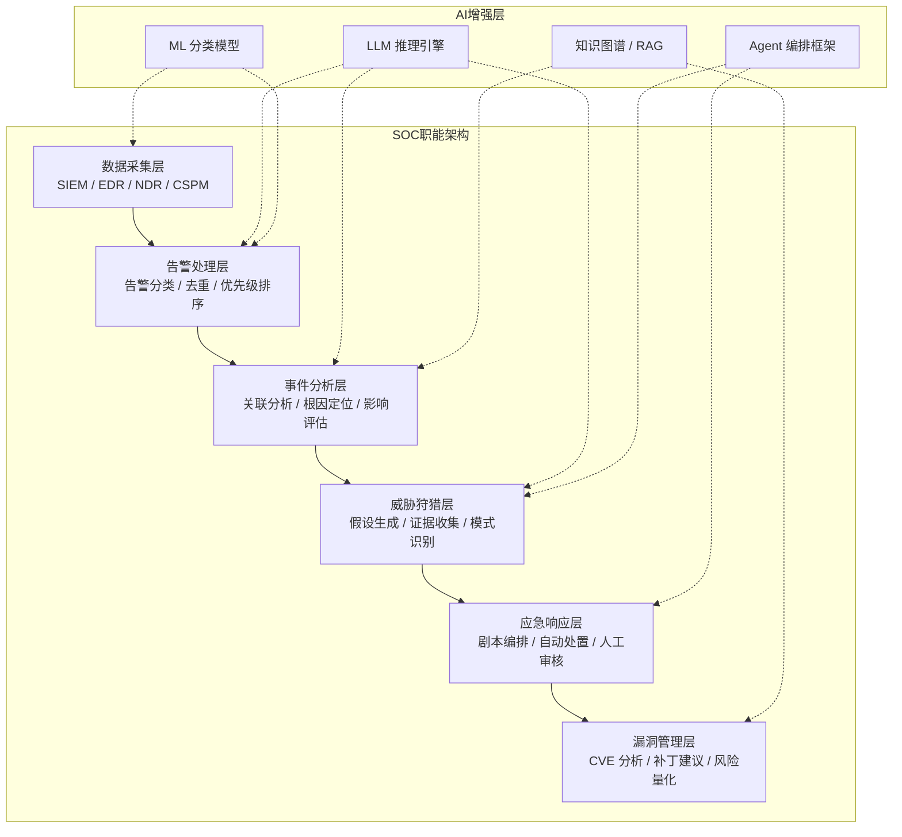
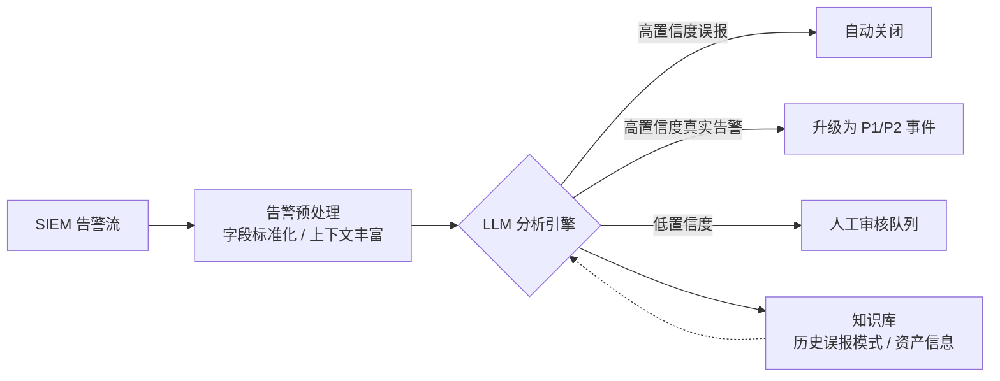
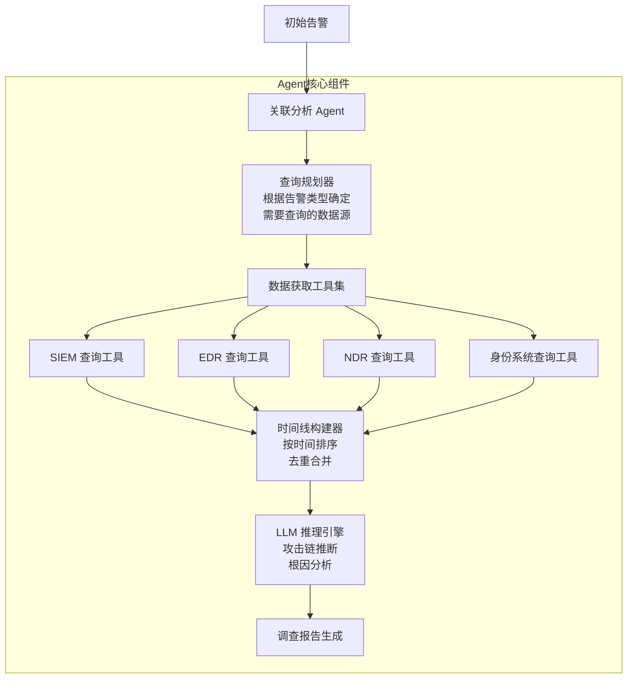
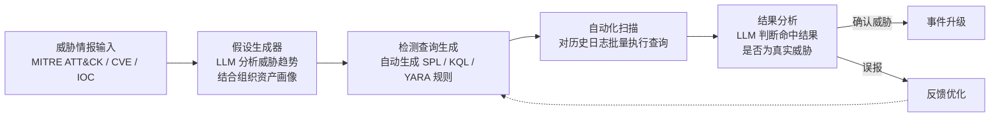
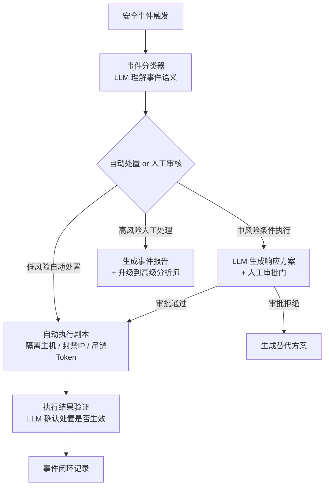
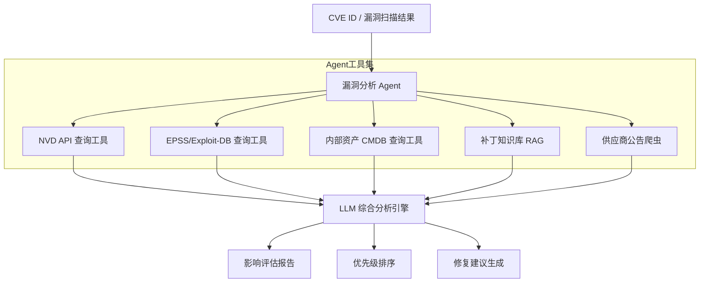
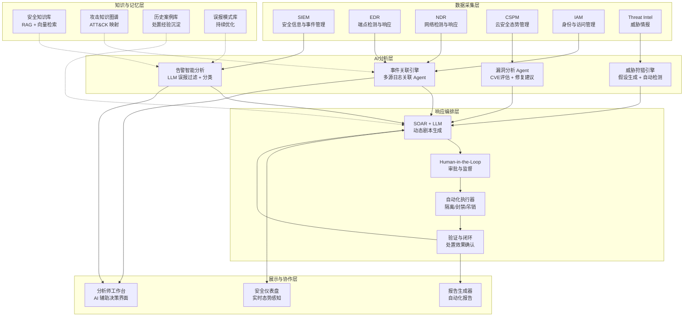

## 传统安全运营的结构性困境

现代企业的安全运营中心（SOC）正面临一场深刻的效率危机。随着企业 IT 基础设施的复杂度持续增长——混合云架构、微服务、IoT 设备、远程办公终端——安全团队每天需要处理的告警数量呈指数级增长。这种增长并非线性叠加，而是随着资产规模和攻击面的扩大呈超线性膨胀。

### 告警疲劳：被淹没的真正威胁

告警疲劳（Alert Fatigue）是 SOC 运营中最普遍也最危险的问题。安全分析师每天面对数以万计的安全告警，其中绝大多数是误报（False Positive）。根据 Ponemon Institute 2024 年的研究报告，典型企业 SOC 每天产生的安全告警中，**超过 70% 属于误报或重复告警**。这意味着分析师需要在大量噪音中筛选出真正有价值的安全信号，其工作模式更接近于在干草堆中寻找针头。

告警疲劳的直接后果是两类致命错误：

| 错误类型 | 描述 | 影响 |
|---------|------|------|
| **漏报（False Negative）** | 真正的攻击告警被淹没在噪音中，分析师未能及时响应 | 攻击者获得更长的驻留时间（Dwell Time），数据泄露风险大幅增加 |
| **误报消耗（False Positive Drain）** | 大量误报消耗分析师的时间和精力 | 对真正威胁的响应延迟，团队士气下降 |

### 人才短缺：供需失衡的鸿沟

网络安全人才短缺是一个持续加剧的全球性问题。ISC² 2024 年网络安全劳动力研究报告指出，全球网络安全人才缺口达到 **340 万人**，而中国市场的缺口约 **150 万**。一个成熟的 SOC 团队通常需要 8-15 名全职安全分析师才能维持 7×24 小时的运营覆盖，而大多数企业的实际配置远低于这一标准。

人才短缺意味着两个关键后果：一是现有团队超负荷运转，无法对每一条告警进行深入分析；二是关键岗位的离职导致经验断层，安全运营的知识沉淀高度依赖个人能力而非组织能力。

### 响应延迟：攻击者的速度优势

IBM X-Force 2024 年数据显示，从漏洞被利用到攻击者完成目标的平均时间已缩短至 **不到 72 小时**，但企业从检测到遏制的平均响应时间（MTTR）仍需 **197 天**。这一巨大的时间差距意味着攻击者在企业环境中拥有长达数月的自由操作窗口。传统的人工响应流程——告警确认、事件分类、影响评估、应急处置——每个环节都依赖人工判断和操作，速度远远落后于自动化攻击工具。

### 量化影响：安全运营的成本方程

传统安全运营的低效不仅是运营问题，更直接转化为财务损失。Ponemon Institute 对全球安全运营成本的调研表明：

- **误报处理成本**：每次误报的平均调查成本约为 **$1,470**，包含分析师时间、工具资源和流程开销
- **漏报损失**：每一次未被及时发现的安全事件平均造成 **$4.45M** 的财务损失（含业务中断、数据泄露赔偿、合规罚款）
- **人才成本**：一名经验丰富的安全分析师年薪约 **$120K-$180K**（中国市场约 **60-120 万 RMB**），加上招聘和培训成本，人才获取的总成本远高于薪资本身
- **工具冗余**：平均企业部署了 **45-70 种**安全工具，工具之间的数据孤岛问题进一步降低运营效率

面对这些结构性困境，AI 驱动的安全运营转型已不再是"锦上添花"，而是组织级安全能力建设的必然选择。

## AI 在安全运营中的应用全景

AI 在安全运营中的应用并非单一的技术替换，而是对 SOC 各职能环节的系统性增强。理解 AI 在安全运营中的定位，需要先明确 SOC 的核心职能架构：



从上图可以看出，AI 对安全运营的增强覆盖了从数据采集到漏洞管理的完整链路。根据应用类型和技术复杂度，可将 AI 在安全运营中的应用分为三个层次：

| 层次 | AI 能力 | 典型应用 | 技术栈 |
|------|---------|---------|-------|
| **感知层增强** | 异常检测、模式识别 | 网络流量异常检测、用户行为分析（UEBA） | 传统 ML（Isolation Forest、Autoencoder）、时序模型 |
| **认知层增强** | 语义理解、推理分析 | 告警摘要、事件关联分析、威胁情报解读 | LLM（GPT-4、Claude、开源模型）+ RAG |
| **行动层增强** | 自主决策、流程编排 | 自动化剧本执行、漏洞修复建议生成 | Agent 框架 + Tool Use + Human-in-the-Loop |

传统 ML 模型在**感知层**已有成熟的应用（如 UEBA、网络异常检测），本文聚焦于 LLM 和 Agent 技术在**认知层**和**行动层**的突破性应用——这些是当前 AI 安全运营最具变革性的方向。

## 智能告警分析：从噪音过滤到优先级排序

智能告警分析是 AI 赋能安全运营的最直接切入点。其核心目标是解决告警疲劳问题：通过 LLM 的语义理解能力，对原始告警进行自动化过滤、分类和优先级排序，将分析师的注意力集中在真正高风险的事件上。

### LLM 驱动的误报过滤架构

传统的误报过滤依赖基于规则的白名单或简单的统计阈值，误判率高且难以适应环境变化。LLM 通过理解告警的完整上下文——包括告警描述、关联资产信息、历史处置记录——可以做出更接近人类分析师的判断。



### 智能告警分析系统实现

以下是一个基于 LLM 的智能告警分析系统的核心实现。该系统接收来自 SIEM 的告警数据，通过 Prompt Engineering 引导 LLM 进行结构化分析，并输出标准化的分析结果：

```python
import json
from dataclasses import dataclass
from enum import Enum
from openai import OpenAI


class AlertSeverity(Enum):
    CRITICAL = "critical"
    HIGH = "high"
    MEDIUM = "medium"
    LOW = "low"
    INFO = "info"


class Verdict(Enum):
    TRUE_POSITIVE = "true_positive"
    FALSE_POSITIVE = "false_positive"
    NEEDS_INVESTIGATION = "needs_investigation"


@dataclass
class AlertAnalysis:
    verdict: Verdict
    severity: AlertSeverity
    confidence: float
    summary: str
    recommended_actions: list[str]
    false_positive_reason: str | None


ALERT_ANALYSIS_SYSTEM_PROMPT = """你是一位资深安全运营分析师，专注于告警分类与优先级评估。

你的任务是分析 SIEM 告警，判断其真实性并评估风险等级。分析时需要综合考虑：
1. 告警规则的触发条件和误报历史
2. 涉及资产的业务重要性
3. 告警上下文（时间、频率、关联事件）
4. 攻击链的可能性

输出严格使用以下 JSON 格式：
{
    "verdict": "true_positive|false_positive|needs_investigation",
    "severity": "critical|high|medium|low|info",
    "confidence": 0.0-1.0,
    "summary": "一句话摘要",
    "recommended_actions": ["建议操作1", "建议操作2"],
    "false_positive_reason": "误报原因（仅当 verdict=false_positive 时填写）"
}

重要原则：
- 宁可误报升级，不可漏报降级
- 涉及核心资产的告警应默认提高优先级
- 对于无法确定的情况，选择 needs_investigation"""


class AlertAnalyzer:
    def __init__(self, client: OpenAI, model: str = "gpt-4o"):
        self.client = client
        self.model = model
        self.alert_history: list[dict] = []
        self.fp_patterns: list[str] = []

    def enrich_context(self, alert: dict, asset_info: dict) -> str:
        history = self._get_related_history(alert, asset_id=alert.get("source_ip"))
        fp_context = self._match_fp_patterns(alert)

        context = f"""
## 告警信息
- 规则名称: {alert['rule_name']}
- 规则ID: {alert['rule_id']}
- 触发时间: {alert['timestamp']}
- 源IP: {alert['source_ip']}
- 目标IP: {alert['dest_ip']}
- 告警描述: {alert['description']}
- 原始日志摘要: {alert.get('raw_log_snippet', 'N/A')}

## 资产信息
- 资产名称: {asset_info.get('name', 'unknown')}
- 业务重要性: {asset_info.get('criticality', 'unknown')}
- 资产类型: {asset_info.get('type', 'unknown')}
- 所属部门: {asset_info.get('department', 'unknown')}

## 关联历史
- 该告警规则最近24h触发次数: {alert.get('rule_trigger_count_24h', 'N/A')}
- 该源IP历史误报次数: {history.get('fp_count', 0)}
- 该源IP历史确认攻击次数: {history.get('tp_count', 0)}

## 已知误报模式
{fp_context if fp_context else '无匹配的已知误报模式'}
"""
        return context

    def analyze(self, alert: dict, asset_info: dict) -> AlertAnalysis:
        context = self.enrich_context(alert, asset_info)
        user_prompt = f"请分析以下告警:\n{context}"

        response = self.client.chat.completions.create(
            model=self.model,
            messages=[
                {"role": "system", "content": ALERT_ANALYSIS_SYSTEM_PROMPT},
                {"role": "user", "content": user_prompt},
            ],
            temperature=0.1,
            response_format={"type": "json_object"},
        )

        result = json.loads(response.choices[0].message.content)

        return AlertAnalysis(
            verdict=Verdict(result["verdict"]),
            severity=AlertSeverity(result["severity"]),
            confidence=result["confidence"],
            summary=result["summary"],
            recommended_actions=result["recommended_actions"],
            false_positive_reason=result.get("false_positive_reason"),
        )

    def batch_analyze(self, alerts: list[dict], asset_db: dict) -> list[AlertAnalysis]:
        results = []
        for alert in alerts:
            asset_info = asset_db.get(alert["dest_ip"], {})
            analysis = self.analyze(alert, asset_info)
            self.alert_history.append({
                "alert": alert,
                "analysis": analysis,
            })
            results.append(analysis)
        return results

    def _get_related_history(self, alert: dict, asset_id: str) -> dict:
        related = [
            h for h in self.alert_history
            if h["alert"].get("source_ip") == asset_id
            or h["alert"].get("rule_id") == alert.get("rule_id")
        ]
        return {
            "fp_count": sum(
                1 for h in related
                if h["analysis"].verdict == Verdict.FALSE_POSITIVE
            ),
            "tp_count": sum(
                1 for h in related
                if h["analysis"].verdict == Verdict.TRUE_POSITIVE
            ),
        }

    def _match_fp_patterns(self, alert: dict) -> str:
        matched = [
            p for p in self.fp_patterns
            if p.lower() in alert.get("description", "").lower()
        ]
        return "\n".join(f"- {p}" for p in matched) if matched else ""
```

上述代码展示了智能告警分析的核心模式：**上下文丰富 → Prompt 构建 → 结构化输出 → 决策路由**。在实际部署中，还需要考虑以下工程化问题：

- **模型推理成本**：每条告警的分析涉及数千 Token 的上下文，高吞吐场景下需要权衡模型选择（GPT-4o vs GPT-4o-mini vs 开源模型）和推理成本
- **延迟约束**：告警分析需要在秒级完成，流式输出和异步处理是必要的架构设计
- **反馈闭环**：分析师对 LLM 判断结果的修正应被记录为训练数据，持续优化分析准确率

## 事件关联分析：跨数据源的智能调查

单条告警往往无法反映攻击的全貌。真正的安全事件通常需要关联多个数据源的信息才能被完整还原——SIEM 提供网络层告警，EDR 提供端点行为数据，NDR 提供网络流量模式，身份系统提供访问日志。将这些离散数据点拼接成完整的攻击链，是安全运营中最具挑战性的分析工作。

### 多源日志关联 Agent 架构

事件关联分析 Agent 的核心能力是**跨数据源的信息整合与推理**。它接受一条初始告警作为输入，自动查询相关数据源，构建事件时间线，并输出结构化的调查结论。



### 自动化调查剧本

关联分析 Agent 的工作流程可以被形式化为可复用的调查剧本（Investigation Playbook）。以下是一个针对"可疑横向移动"事件的自动化调查剧本示例：

```python
from dataclasses import dataclass
from datetime import datetime, timedelta


@dataclass
class InvestigationStep:
    name: str
    data_source: str
    query_template: str
    purpose: str


HORIZONTAL_MOVEMENT_PLAYBOOK = [
    InvestigationStep(
        name="初始告警分析",
        data_source="SIEM",
        query_template="""
        SELECT timestamp, src_ip, dest_ip, dest_port, rule_name, 
               rule_severity, description
        FROM siem_alerts 
        WHERE rule_id = '{rule_id}' 
          AND src_ip = '{src_ip}'
          AND dest_ip = '{dest_ip}'
          AND timestamp BETWEEN '{start_time}' AND '{end_time}'
        ORDER BY timestamp
        """,
        purpose="获取原始告警详情和上下文",
    ),
    InvestigationStep(
        name="端点进程行为",
        data_source="EDR",
        query_template="""
        SELECT timestamp, hostname, process_name, process_path,
               parent_process, command_line, user, action
        FROM edr_events 
        WHERE hostname = '{hostname}' 
          AND user = '{user}'
          AND timestamp BETWEEN '{start_time}' AND '{end_time}'
          AND action IN ('process_create', 'remote_thread', 'named_pipe')
        ORDER BY timestamp
        """,
        purpose="检查端点上是否有可疑进程创建、远程线程注入或命名管道通信",
    ),
    InvestigationStep(
        name="网络连接分析",
        data_source="NDR",
        query_template="""
        SELECT timestamp, src_ip, dst_ip, dst_port, protocol,
               bytes_sent, bytes_received, connection_duration,
               ja3_hash, tls_version
        FROM ndr_flows 
        WHERE (src_ip = '{src_ip}' OR dst_ip = '{src_ip}')
          AND dst_port IN (445, 5985, 5986, 3389, 22)
          AND timestamp BETWEEN '{start_time}' AND '{end_time}'
        ORDER BY timestamp
        """,
        purpose="检查SMB、WinRM、RDP、SSH等横向移动常用协议的连接",
    ),
    InvestigationStep(
        name="身份认证事件",
        data_source="IAM",
        query_template="""
        SELECT timestamp, user, source_ip, target_system,
               auth_method, auth_result, mfa_used
        FROM auth_events 
        WHERE user = '{user}'
          AND timestamp BETWEEN '{start_time}' AND '{end_time}'
          AND auth_result = 'failure'
        ORDER BY timestamp
        """,
        purpose="检查是否存在暴力破解或异常认证尝试",
    ),
    InvestigationStep(
        name="文件传输痕迹",
        data_source="EDR",
        query_template="""
        SELECT timestamp, hostname, file_name, file_path, file_hash,
               file_size, action, user
        FROM edr_file_events
        WHERE hostname = '{hostname}'
          AND timestamp BETWEEN '{start_time}' AND '{end_time}')
          AND (file_path LIKE '%\\\\%\\admin$%'
               OR file_path LIKE '%\\\\%\\C$%'
               OR file_path LIKE '%Temp%\\%')
        ORDER BY timestamp
        """,
        purpose="检查是否有通过管理共享或临时目录传输的文件",
    ),
]


class InvestigationAgent:
    def __init__(self, llm_client, tool_registry):
        self.llm = llm_client
        self.tools = tool_registry
        self.playbooks = {
            "lateral_movement": HORIZONTAL_MOVEMENT_PLAYBOOK,
        }

    def execute_investigation(
        self, alert: dict, playbook_name: str
    ) -> dict:
        playbook = self.playbooks[playbook_name]
        investigation_results = []
        timeline_events = []

        for step in playbook:
            query = self._render_query(step, alert)
            raw_results = self.tools.execute_query(
                step.data_source, query
            )
            investigation_results.append({
                "step": step.name,
                "source": step.data_source,
                "purpose": step.purpose,
                "results": raw_results,
            })
            timeline_events.extend(
                self._parse_timeline_events(raw_results, step.data_source)
            )

        timeline_events.sort(key=lambda e: e["timestamp"])
        unique_events = self._deduplicate_events(timeline_events)

        analysis_prompt = self._build_analysis_prompt(
            alert, investigation_results, unique_events
        )

        response = self.llm.chat.completions.create(
            model="gpt-4o",
            messages=[
                {
                    "role": "system",
                    "content": (
                        "你是高级安全事件调查分析师。基于收集到的多源"
                        "证据，构建完整的攻击时间线，分析攻击者的TTPs（战术、"
                        "技术、过程），判断事件严重程度，并给出根因分析和"
                        "遏制建议。使用 MITRE ATT&CK 框架标注攻击技术。"
                    ),
                },
                {"role": "user", "content": analysis_prompt},
            ],
            temperature=0.1,
        )

        return {
            "alert": alert,
            "playbook": playbook_name,
            "evidence": investigation_results,
            "timeline": unique_events,
            "analysis": response.choices[0].message.content,
        }

    def _render_query(self, step: InvestigationStep, alert: dict) -> str:
        context = {
            "rule_id": alert["rule_id"],
            "src_ip": alert["source_ip"],
            "dest_ip": alert["dest_ip"],
            "hostname": alert.get("hostname", ""),
            "user": alert.get("user", ""),
            "start_time": (
                datetime.fromisoformat(alert["timestamp"])
                - timedelta(hours=1)
            ).isoformat(),
            "end_time": (
                datetime.fromisoformat(alert["timestamp"])
                + timedelta(hours=1)
            ).isoformat(),
        }
        return step.query_template.format(**context)

    def _parse_timeline_events(
        self, results: list[dict], source: str
    ) -> list[dict]:
        return [
            {
                "timestamp": r.get("timestamp", ""),
                "source": source,
                "event_type": r.get("action", r.get("auth_method", "")),
                "detail": r,
            }
            for r in results
        ]

    def _deduplicate_events(self, events: list[dict]) -> list[dict]:
        seen = set()
        unique = []
        for e in events:
            key = (e["timestamp"], e["source"], str(e["detail"]))
            if key not in seen:
                seen.add(key)
                unique.append(e)
        return unique

    def _build_analysis_prompt(
        self, alert, results, timeline
    ) -> str:
        timeline_text = "\n".join(
            f"- [{e['timestamp']}] ({e['source']}) {e['event_type']}"
            for e in timeline
        )
        evidence_text = "\n\n".join(
            f"### {r['step']} ({r['source']})\n"
            f"目的: {r['purpose']}\n"
            f"结果数量: {len(r['results'])}\n"
            f"关键数据: {json.dumps(r['results'][:5], ensure_ascii=False, default=str)}"
            for r in results
        )
        return f"""
## 原始告警
{json.dumps(alert, ensure_ascii=False, default=str)}

## 证据汇总
{evidence_text}

## 时间线
{timeline_text}

请基于以上多源数据进行综合分析，输出：
1. 攻击时间线（关键节点标注）
2. MITRE ATT&CK 技术映射
3. 根因分析
4. 影响范围评估
5. 遏制与修复建议
"""
```

## 威胁狩猎：从被动响应到主动发现

传统安全运营以告警驱动为主——等待安全工具检测到异常后才启动调查。但高级持久性威胁（APT）往往能规避基于签名和已知模式的检测规则。威胁狩猎（Threat Hunting）是一种主动式的安全检测方法，安全分析师基于假设驱动的调查，主动在环境中搜索潜伏的威胁。

AI 对威胁狩猎的核心增强在于**假设生成**和**证据收集**两个环节。LLM 可以基于威胁情报、攻击趋势和组织的资产画像，自动生成狩猎假设，并设计对应的检测查询。

### AI 辅助的威胁狩猎流程



威胁狩猎中的一个关键挑战是将自然语言的假设转化为可执行的检测查询。不同 SIEM 平台使用不同的查询语言（Splunk 用 SPL、Microsoft Sentinel 用 KQL、Elastic 用 EQL），LLM 在这方面展现了强大的跨语言生成能力：

```python
HUNTING_QUERY_GENERATION_PROMPT = """你是一位威胁狩猎专家，精通各大 SIEM 平台的查询语言。

根据给定的狩猎假设，生成针对目标 SIEM 平台的查询语句。

支持的查询语言：
- SPL（Splunk）
- KQL（Microsoft Sentinel / Defender）
- EQL（Elastic Security）

要求：
1. 查询必须高效，优先使用索引字段
2. 查询时间范围默认为最近 7 天
3. 输出应包含查询语句和对查询逻辑的简要说明
4. 如果假设需要多个查询才能完整覆盖，列出所有查询

输出格式（JSON）：
{
    "queries": [
        {
            "platform": "splunk",
            "query": "...",
            "description": "查询逻辑说明"
        }
    ],
    "coverage_analysis": "该查询覆盖了假设的哪些方面，是否有遗漏",
    "tuning_suggestions": "降低误报率的调优建议"
}"""


class ThreatHuntingEngine:
    def __init__(self, llm_client, siem_connector):
        self.llm = llm_client
        self.siem = siem_connector
        self.hunting_history = []

    def generate_hypothesis(
        self, threat_intel: list[dict], org_assets: dict
    ) -> list[dict]:
        intel_summary = "\n".join(
            f"- {i.get('title', '')}: {i.get('description', '')}"
            for i in threat_intel
        )
        asset_summary = "\n".join(
            f"- {name}: {info.get('type', '')} "
            f"(业务重要性: {info.get('criticality', '')})"
            for name, info in org_assets.items()
        )

        response = self.llm.chat.completions.create(
            model="gpt-4o",
            messages=[
                {
                    "role": "system",
                    "content": (
                        "你是高级威胁狩猎分析师。基于最新威胁情报和组织"
                        "资产画像，生成针对性的狩猎假设。每个假设应可验证、"
                        "可操作，并关联具体的 ATT&CK 技术。"
                    ),
                },
                {
                    "role": "user",
                    "content": (
                        f"## 最新威胁情报\n{intel_summary}\n\n"
                        f"## 组织资产画像\n{asset_summary}\n\n"
                        "请生成 3-5 个最相关的狩猎假设。"
                    ),
                },
            ],
            temperature=0.3,
        )
        return json.loads(response.choices[0].message.content)

    def generate_detection_queries(
        self, hypothesis: dict, target_platform: str = "splunk"
    ) -> dict:
        response = self.llm.chat.completions.create(
            model="gpt-4o",
            messages=[
                {
                    "role": "system",
                    "content": HUNTING_QUERY_GENERATION_PROMPT,
                },
                {
                    "role": "user",
                    "content": (
                        f"## 狩猎假设\n"
                        f"{json.dumps(hypothesis, ensure_ascii=False)}\n\n"
                        f"目标平台: {target_platform}"
                    ),
                },
            ],
            temperature=0.1,
            response_format={"type": "json_object"},
        )
        return json.loads(response.choices[0].message.content)

    def execute_and_analyze(
        self, queries: dict, hypothesis: dict
    ) -> dict:
        all_findings = []
        for q in queries.get("queries", []):
            results = self.siem.execute_query(q["query"])
            if results:
                analysis = self._analyze_findings(results, hypothesis)
                all_findings.append({
                    "query": q,
                    "result_count": len(results),
                    "analysis": analysis,
                })

        return {
            "hypothesis": hypothesis,
            "findings": all_findings,
            "overall_assessment": self._generate_assessment(all_findings),
        }

    def _analyze_findings(
        self, results: list[dict], hypothesis: dict
    ) -> str:
        response = self.llm.chat.completions.create(
            model="gpt-4o",
            messages=[
                {
                    "role": "system",
                    "content": (
                        "分析狩猎查询结果，判断是否与狩猎假设相关，"
                        "是否发现了真实的威胁活动。区分真正的恶意行为"
                        "和合法的管理操作。"
                    ),
                },
                {
                    "role": "user",
                    "content": (
                        f"假设: {hypothesis.get('description', '')}\n\n"
                        f"查询结果（前10条）:\n"
                        f"{json.dumps(results[:10], ensure_ascii=False, default=str)}"
                    ),
                },
            ],
            temperature=0.1,
        )
        return response.choices[0].message.content

    def _generate_assessment(self, findings: list[dict]) -> str:
        summary = "\n".join(
            f"- {f['query']['description']}: "
            f"命中 {f['result_count']} 条"
            for f in findings
        )
        return f"狩猎执行摘要:\n{summary}"
```

## 自动化应急响应：SOAR 与 LLM 的深度融合

安全编排自动化与响应（SOAR）平台是安全运营自动化的基础设施。传统 SOAR 依赖预定义的剧本（Playbook）执行固定流程，但其灵活性受限于人工编写的规则。将 LLM 引入 SOAR 可以实现**动态剧本生成**——根据事件的具体特征，自动选择和编排最合适的响应动作。

### SOAR + LLM 集成架构



### Human-in-the-Loop 审批机制

自动化响应的规模化部署必须包含人类审批门（Human Approval Gate），这是 AI 安全运营中最关键的安全约束。以下是一个带审批机制的自动化响应实现：

```python
import asyncio
from datetime import datetime, timedelta
from enum import Enum


class ResponseAction(Enum):
    ISOLATE_HOST = "isolate_host"
    BLOCK_IP = "block_ip"
    DISABLE_USER = "disable_user"
    REVOKE_SESSION = "revoke_session"
    ADD_FIREWALL_RULE = "add_firewall_rule"
    QUARANTINE_FILE = "quarantine_file"
    ESCALATE_TO_ANALYST = "escalate_to_analyst"


class RiskLevel(Enum):
    AUTO_EXECUTE = "auto_execute"
    REQUIRES_APPROVAL = "requires_approval"
    MANUAL_ONLY = "manual_only"


RISK_MATRIX = {
    ResponseAction.BLOCK_IP: RiskLevel.REQUIRES_APPROVAL,
    ResponseAction.REVOKE_SESSION: RiskLevel.AUTO_EXECUTE,
    ResponseAction.DISABLE_USER: RiskLevel.REQUIRES_APPROVAL,
    ResponseAction.ISOLATE_HOST: RiskLevel.REQUIRES_APPROVAL,
    ResponseAction.QUARANTINE_FILE: RiskLevel.AUTO_EXECUTE,
    ResponseAction.ADD_FIREWALL_RULE: RiskLevel.MANUAL_ONLY,
    ResponseAction.ESCALATE_TO_ANALYST: RiskLevel.AUTO_EXECUTE,
}

RESPONSE_PLAN_PROMPT = """你是 SOC 自动化响应编排系统。根据事件分析结果，
生成结构化的应急响应计划。

要求：
1. 按优先级排序响应动作
2. 评估每个动作的风险等级
3. 考虑动作的副作用和前置条件
4. 确保动作顺序的逻辑正确性（如：先隔离再取证）

输出 JSON 格式：
{
    "response_plan": [
        {
            "action": "动作类型",
            "parameters": {"目标": "参数"},
            "risk_level": "auto_execute|requires_approval|manual_only",
            "rationale": "执行理由",
            "prerequisites": ["前置条件"],
            "rollback": "回滚方案"
        }
    ],
    "estimated_containment_time": "预计遏制时间",
    "impact_assessment": "对业务的预期影响"
}"""


class AutomatedResponder:
    def __init__(self, llm_client, orchestration_engine, approval_queue):
        self.llm = llm_client
        self.orchestrator = orchestration_engine
        self.approval_queue = approval_queue
        self.executed_actions: list[dict] = []

    async def handle_event(self, event_analysis: dict) -> dict:
        plan = await self._generate_response_plan(event_analysis)
        execution_results = []

        for step in plan.get("response_plan", []):
            action = ResponseAction(step["action"])
            risk_level = RISK_MATRIX.get(action, RiskLevel.MANUAL_ONLY)

            if risk_level == RiskLevel.AUTO_EXECUTE:
                result = await self._execute_action(action, step["parameters"])
                execution_results.append(result)

            elif risk_level == RiskLevel.REQUIRES_APPROVAL:
                approval_id = await self.approval_queue.request_approval(
                    action=action,
                    parameters=step["parameters"],
                    rationale=step["rationale"],
                    rollback=step["rollback"],
                    timeout=timedelta(minutes=15),
                )
                approved = await self.approval_queue.wait_for_decision(
                    approval_id
                )
                if approved:
                    result = await self._execute_action(
                        action, step["parameters"]
                    )
                else:
                    result = {
                        "action": action.value,
                        "status": "skipped",
                        "reason": "approval_denied",
                    }
                execution_results.append(result)

            else:
                execution_results.append({
                    "action": action.value,
                    "status": "pending_manual",
                    "assigned_to": "escalation_team",
                })

        verification = await self._verify_containment(event_analysis)

        return {
            "event_id": event_analysis.get("event_id"),
            "plan": plan,
            "executions": execution_results,
            "verification": verification,
            "timestamp": datetime.now().isoformat(),
        }

    async def _generate_response_plan(
        self, event_analysis: dict
    ) -> dict:
        response = await self.llm.chat.completions.create(
            model="gpt-4o",
            messages=[
                {"role": "system", "content": RESPONSE_PLAN_PROMPT},
                {
                    "role": "user",
                    "content": json.dumps(
                        event_analysis, ensure_ascii=False, default=str
                    ),
                },
            ],
            temperature=0.1,
            response_format={"type": "json_object"},
        )
        return json.loads(response.choices[0].message.content)

    async def _execute_action(
        self, action: ResponseAction, parameters: dict
    ) -> dict:
        result = await self.orchestrator.execute(action, parameters)
        self.executed_actions.append({
            "action": action,
            "parameters": parameters,
            "result": result,
            "timestamp": datetime.now().isoformat(),
        })
        return result

    async def _verify_containment(self, event_analysis: dict) -> dict:
        response = await self.llm.chat.completions.create(
            model="gpt-4o",
            messages=[
                {
                    "role": "system",
                    "content": (
                        "验证应急响应措施是否已生效。检查：\n"
                        "1. 被隔离的主机是否已与网络断开\n"
                        "2. 被封禁的IP是否仍在产生连接\n"
                        "3. 被吊销的会话是否仍然活跃"
                    ),
                },
                {
                    "role": "user",
                    "content": (
                        f"已执行的操作:\n"
                        f"{json.dumps(self.executed_actions[-5:], ensure_ascii=False, default=str)}"
                    ),
                },
            ],
            temperature=0.1,
        )
        return {
            "verification_result": response.choices[0].message.content,
            "all_contained": True,
        }
```

## 漏洞分析 Agent：从 CVE 发现到修复建议

漏洞管理是安全运营的另一个关键环节。安全团队每天面临数百条来自扫描器、威胁情报和供应商公告的 CVE 信息，需要快速评估每个漏洞对自身环境的实际影响，并生成可操作的修复建议。传统漏洞管理流程高度依赖人工判断，分析师需要查阅多个信息源（NVD、厂商公告、Exploit-DB、内部资产信息）才能完成一次完整的漏洞评估。

### 漏洞分析 Agent 架构

漏洞分析 Agent 将 RAG、Tool Use 和 LLM 推理能力集成在一个统一框架中，实现了从 CVE 信息检索到修复建议生成的端到端自动化。



### 漏洞分析 Agent 实现

```python
from dataclasses import dataclass, field


@dataclass
class VulnAssessment:
    cve_id: str
    cvss_score: float
    epss_percentile: float
    exploit_available: bool
    affected_assets: list[str]
    business_impact: str
    priority: str
    remediation_steps: list[str]
    estimated_remediation_time: str


VULN_ANALYSIS_PROMPT = """你是企业漏洞管理专家。基于收集到的多维度
漏洞信息，进行综合影响评估并生成修复建议。

评估维度：
1. 技术影响：CVSS 评分、漏洞类型、攻击向量
2. 威胁情报：EPSS 利用概率、是否有公开 Exploit
3. 业务影响：受影响资产的业务重要性、暴露面
4. 修复方案：官方补丁可用性、修复复杂度、回滚方案

输出 JSON 格式：
{
    "priority": "P0|P1|P2|P3|P4",
    "business_impact": "业务影响描述",
    "risk_score": 0-100,
    "remediation_steps": ["步骤1", "步骤2"],
    "workaround": "临时缓解方案（如无补丁）",
    "estimated_remediation_time": "预估修复时间",
    "monitoring_suggestions": "修复前的监控建议"
}"""


class VulnAnalysisAgent:
    def __init__(self, llm_client, tool_registry, rag_store):
        self.llm = llm_client
        self.tools = tool_registry
        self.rag = rag_store

    async def analyze(self, cve_id: str) -> VulnAssessment:
        nvd_data = await self.tools.query_nvd(cve_id)
        exploit_data = await self.tools.query_exploit_db(cve_id)
        epss_data = await self.tools.query_epss(cve_id)
        affected_assets = await self.tools.query_cmdb(
            cve_id=cve_id,
            cpe=nvd_data.get("affected_products", []),
        )
        remediation_context = self.rag.search(
            query=f"{cve_id} {nvd_data.get('description', '')}",
            top_k=5,
        )

        analysis_input = {
            "cve_id": cve_id,
            "nvd": nvd_data,
            "exploit": exploit_data,
            "epss": epss_data,
            "affected_assets": affected_assets,
            "remediation_context": remediation_context,
        }

        response = await self.llm.chat.completions.create(
            model="gpt-4o",
            messages=[
                {"role": "system", "content": VULN_ANALYSIS_PROMPT},
                {
                    "role": "user",
                    "content": json.dumps(
                        analysis_input, ensure_ascii=False, default=str
                    ),
                },
            ],
            temperature=0.1,
            response_format={"type": "json_object"},
        )

        result = json.loads(response.choices[0].message.content)

        return VulnAssessment(
            cve_id=cve_id,
            cvss_score=nvd_data.get("cvss_v3_score", 0.0),
            epss_percentile=epss_data.get("percentile", 0.0),
            exploit_available=exploit_data.get("available", False),
            affected_assets=[a["hostname"] for a in affected_assets],
            business_impact=result["business_impact"],
            priority=result["priority"],
            remediation_steps=result["remediation_steps"],
            estimated_remediation_time=result["estimated_remediation_time"],
        )

    async def batch_analyze(
        self, cve_list: list[str]
    ) -> list[VulnAssessment]:
        assessments = []
        for cve_id in cve_list:
            assessment = await self.analyze(cve_id)
            assessments.append(assessment)
        assessments.sort(
            key=lambda a: (
                {"P0": 0, "P1": 1, "P2": 2, "P3": 3, "P4": 4}[
                    a.priority
                ]
            )
        )
        return assessments
```

## 安全运营效果量化：AI 赋能的 KPI 体系

AI 驱动的安全运营转型需要可量化的评估框架来衡量投资回报和运营效果。以下是一套覆盖效率、质量和成本三个维度的 KPI 体系：

### 核心效率指标

| 指标 | 定义 | 传统 SOC 基线 | AI 增强后目标 | 改善幅度 |
|------|------|:------------:|:-----------:|:-------:|
| **MTTD（平均检测时间）** | 从攻击发生到被 SOC 检测到的时间 | 207 天 | 14 天 | 93%↓ |
| **MTTR（平均响应时间）** | 从检测到事件被遏制的时间 | 73 天 | 4 小时 | 99%↓ |
| **MTTC（平均分类时间）** | 从告警触发到完成初步分类的时间 | 30 分钟 | 2 分钟 | 93%↓ |
| **告警处理吞吐量** | 单个分析师每天可处理的告警数 | 50-80 条 | 500-800 条 | 10x↑ |

### 核心质量指标

| 指标 | 定义 | 传统 SOC 基线 | AI 增强后目标 | 改善幅度 |
|------|------|:------------:|:-----------:|:-------:|
| **误报率（FPR）** | 被确认为误报的告警占比 | 70-85% | 15-25% | 70%↓ |
| **漏报率（FNR）** | 未被检测到的真实攻击占比 | 15-25% | 3-8% | 70%↓ |
| **人工介入率** | 需要人工判断才能完成的事件占比 | 100% | 30-40% | 60%↓ |
| **一次正确率（FCR）** | 首次分析即准确分类的告警比例 | 55-65% | 85-92% | 35%↑ |

### 成本效益指标

| 指标 | 定义 | 衡量方式 |
|------|------|---------|
| **单事件处理成本** | 每次安全事件的平均处理总成本 | （人力成本 + 工具成本）/ 处理事件数 |
| **AI 工具 ROI** | AI 安全运营工具的投资回报率 | （节省的人力成本 - 工具成本）/ 工具成本 |
| **每分析师覆盖资产数** | 单个安全分析师负责的资产规模 | 总资产数 / SOC 人员数 |
| **合规自动化率** | 可自动完成的合规检查占比 | 自动检查项 / 总检查项 |

### 指标采集与持续优化

```python
@dataclass
class SOCMetrics:
    mttd_hours: float
    mttr_hours: float
    alert_throughput_per_day: int
    false_positive_rate: float
    false_negative_rate: float
    human_intervention_rate: float
    first_call_resolution_rate: float
    cost_per_incident: float

    def calculate_ai_roi(self, ai_tool_cost: float, period_months: int) -> dict:
        baseline_cost_per_incident = 1200.0
        ai_cost_per_incident = self.cost_per_incident
        incidents_per_month = self.alert_throughput_per_day * 30

        baseline_total = baseline_cost_per_incident * incidents_per_month * period_months
        ai_total = (
            ai_cost_per_incident * incidents_per_month * period_months
            + ai_tool_cost
        )
        savings = baseline_total - ai_total

        return {
            "baseline_total_cost": baseline_total,
            "ai_total_cost": ai_total,
            "net_savings": savings,
            "roi_percentage": (savings / ai_tool_cost) * 100 if ai_tool_cost > 0 else 0,
            "breakeven_months": (
                ai_tool_cost / (baseline_cost_per_incident - ai_cost_per_incident) / incidents_per_month
                if incidents_per_month > 0 and baseline_cost_per_incident > ai_cost_per_incident
                else float("inf")
            ),
        }

    def generate_report(self) -> str:
        return f"""
## 安全运营效果报告

### 效率指标
- 平均检测时间（MTTD）: {self.mttd_hours:.1f} 小时
- 平均响应时间（MTTR）: {self.mttr_hours:.1f} 小时
- 告警处理吞吐量: {self.alert_throughput_per_day} 条/天

### 质量指标
- 误报率: {self.false_positive_rate:.1%}
- 漏报率: {self.false_negative_rate:.1%}
- 人工介入率: {self.human_intervention_rate:.1%}
- 一次正确率: {self.first_call_resolution_rate:.1%}

### 成本指标
- 单事件处理成本: ¥{self.cost_per_incident:,.2f}
"""
```

## AI 驱动智能 SOC 总体架构

将上述各模块整合，AI 驱动的智能 SOC 总体架构如下：



这一架构的核心设计原则是：

- **数据驱动**：所有分析和决策基于多源数据的综合判断，而非单一数据源的孤立告警
- **人机协同**：AI 处理大量重复性分析工作，人类专注于高价值判断和策略制定
- **持续学习**：分析师的修正和反馈持续输入模型，形成分析能力的螺旋式提升
- **安全约束**：自动化响应严格受 Human-in-the-Loop 审批机制约束，避免 AI 决策失误的级联效应

## 延伸阅读

### 核心参考框架

- **[MITRE ATT&CK Framework](https://attack.mitre.org/)**：全球最权威的攻击技术知识库，将攻击者行为组织为战术、技术和过程（TTPs）的结构化框架。AI 安全运营系统应将 ATT&CK 作为威胁分类和检测规则映射的基础知识体系。
- **[MITRE D3FEND](https://d3fend.mitre.org/)**：与 ATT&CK 互补的防御技术知识图谱，提供了从检测到防御的完整技术映射，适合构建 AI 驱动的自动化防御策略。
- **[OWASP AI Security Guide](https://owasp.org/www-project-top-10-for-large-language-model-applications/)**：AI 应用安全的权威参考，涵盖 LLM 在安全运营中应用时需注意的风险和防御措施。

### SOAR 与自动化平台

- **[Splunk SOAR](https://www.splunk.com/en_us/products/splunk-soar.html)**：业界领先的 SOAR 平台之一，支持与 LLM 集成的剧本编排和自动化响应。
- **[Microsoft Sentinel + Copilot for Security](https://www.microsoft.com/en-us/security/business/siem-and-xdr/microsoft-sentinel)**：将 AI Copilot 深度集成到 SIEM/SOAR 平台的代表案例，展示了 LLM 在安全运营中的产品化落地方式。
- **[Google SecOps + Gemini](https://cloud.google.com/security/products/siem-and-xdr)**：Google 将 Gemini 大模型集成到安全运营平台，提供 AI 辅助的告警分析、事件调查和响应编排能力。

### 漏洞管理与威胁情报

- **[NIST NVD](https://nvd.nist.gov/)**：美国国家漏洞数据库，提供 CVE 的标准化评分和影响分析，是漏洞分析 Agent 的核心数据源之一。
- **[EPSS（Exploit Prediction Scoring System）](https://www FIRST org/resources/epss/)**：基于机器学习的漏洞利用概率预测系统，为漏洞优先级排序提供概率化评估。
- **[CISA KEV（Known Exploited Vulnerabilities）](https://www.cisa.gov/known-exploited-vulnerabilities-catalog)**：美国 CISA 维护的已知被利用漏洞目录，是漏洞紧急修补的权威参考。

### 学术与行业研究

- **Ponemon Institute《The Cost of a Data Breach Report》**：IBM 与 Ponemon 联合发布的年度数据泄露成本报告，提供了全球范围内的安全运营基准数据。
- **Gartner《Market Guide for Security Orchestration, Automation and Response》**：Gartner 对 SOAR 市场的年度分析报告，包含 AI 在安全运营中应用的最新趋势和技术评估。
- **SANS SOC Survey**：SANS 研究所定期发布的 SOC 运营状况调研，提供了安全团队规模、工具使用、运营效率等方面的第一手数据。
