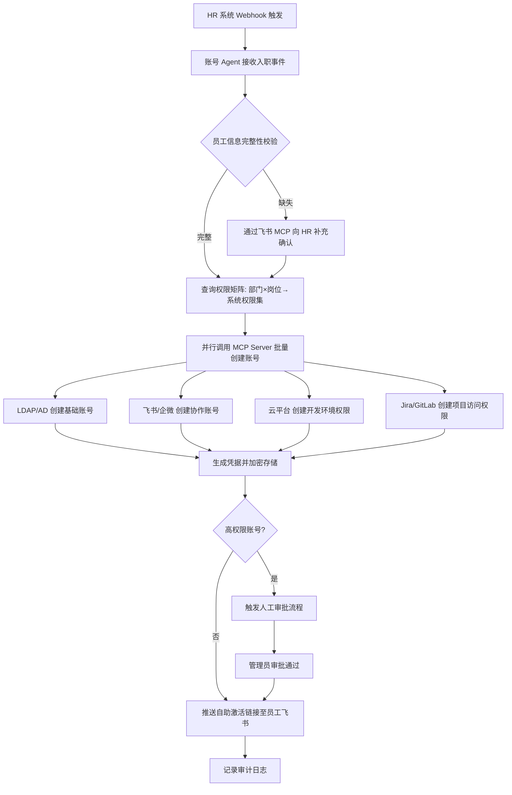

## 传统 IT 运维的结构性困境

企业 IT 运维部门长期面临着一个悖论：随着数字化转型的深入推进，IT 服务的复杂度和用户期望同步攀升，但运维团队的编制和预算几乎停滞不变。这种"需求膨胀、资源锁死"的剪刀差正在将传统 IT 运维推向效率悬崖。

### Ticket-Driven 模式的核心瓶颈

传统 IT 运维的运转完全围绕 **工单系统（Ticketing System）** 展开。用户提交工单 → 运维人员接单 → 分类路由 → 人工处理 → 关单反馈。这一模式在 IT 服务规模较小时尚可运转，但当企业员工规模超过千人、SaaS 应用超过 50 个、云资源实例超过 2000 台时，工单驱动模式的结构性缺陷便暴露无遗：

| 痛点 | 量化影响 | 根因 |
|------|---------|------|
| **工单积压** | 平均待处理工单数 200+，积压周期 3-5 天 | 人工处理能力有限，80% 的工单为重复性操作 |
| **响应延迟** | 首次响应时间（FRT）平均 4.2 小时，解决时间（MTTR）平均 28 小时 | 工单路由依赖人工判断，跨系统信息查找耗时 |
| **误操作率** | 人工操作失误率约 5-8%，严重事件中 30% 源于人为误操作 | 缺乏标准化操作流程，依赖个人经验 |
| **人力成本** | 1 名一线运维工程师年成本 25-40 万 RMB，管理 500 终端 | 大量时间消耗在低价值重复操作上 |
| **知识流失** | 关键运维人员离职后，故障处理时间增加 2-3 倍 | 运维知识沉淀在个人经验中，缺乏结构化知识库 |

### 典型场景量化分析

以一家 2000 人规模的科技企业为例，IT 运维部门的年度运营数据大致如下：

- **账号生命周期管理**：每年处理约 1200 次入职/离职/转岗的账号开通与回收操作，单次操作涉及 8-15 个系统，平均每人次耗时 45 分钟
- **权限申请与审批**：每月约 300 次权限变更请求，审批流转平均 2.5 天，其中 60% 为常规权限申请
- **故障排查**：每月约 150 次 IT 故障报修，其中 40% 为重复性问题（密码重置、VPN 连接、软件安装），每次故障排查平均涉及 3-5 个监控系统的交叉验证
- **资产管理**：管理约 3000 台终端设备、2000+ 云资源实例、150+ SaaS 订阅许可，资产盘点周期为季度，数据准确性仅约 75%

将这些数据汇总，一个 2000 人企业的 IT 运维年度直接人力成本约为 **200-350 万 RMB**，而隐性成本（用户等待时间、业务中断损失、安全合规风险）是直接成本的 **3-5 倍**。

---

## AI-Native IT 架构愿景

AI-Native IT 运维不是简单地在现有运维流程上"叠加一层 AI"，而是以 **AI 为第一公民（AI-First）** 重新设计 IT 服务架构。其核心理念是：**能自动化的绝不手动，能预防的绝不等到发生，能自助的绝不转人工**。

### 架构全景

```
┌───────────────────────────────────────────────────────────────────────┐
│                    AI-Native IT 运维平台架构                           │
│                                                                       │
│  ┌─────────────────────────────────────────────────────────────────┐  │
│  │  用户接入层                                                      │  │
│  │  ┌──────────┐  ┌──────────┐  ┌──────────┐  ┌──────────────┐   │  │
│  │  │ 飞书/企微  │  │ Web 门户  │  │ Slack/钉钉 │  │ 语音/电话接口  │   │  │
│  │  └─────┬────┘  └─────┬────┘  └─────┬────┘  └──────┬───────┘   │  │
│  └────────┼─────────────┼─────────────┼───────────────┼───────────┘  │
│           └─────────────┴─────────────┴───────────────┘              │
│                                     ▼                                 │
│  ┌─────────────────────────────────────────────────────────────────┐  │
│  │  智能路由与编排层                                                │  │
│  │  ┌───────────────┐  ┌───────────────┐  ┌───────────────────┐   │  │
│  │  │ 意图识别引擎    │  │ 路由决策引擎   │  │ 多 Agent 编排器    │   │  │
│  │  │ (NLU + Intent) │  │ (规则+ML+LLM)│  │ (LangGraph/CrewAI)│   │  │
│  │  └───────────────┘  └───────────────┘  └───────────────────┘   │  │
│  └─────────────────────────────────────────────────────────────────┘  │
│                                     ▼                                 │
│  ┌─────────────────────────────────────────────────────────────────┐  │
│  │  Agent 核心能力层                                                │  │
│  │  ┌──────────┐  ┌──────────┐  ┌──────────┐  ┌──────────────┐   │  │
│  │  │ 账号开通   │  │ 权限管理  │  │ 故障排查  │  │  资产管理     │   │  │
│  │  │ Agent     │  │ Agent    │  │ Agent    │  │  Agent       │   │  │
│  │  └──────────┘  └──────────┘  └──────────┘  └──────────────┘   │  │
│  └─────────────────────────────────────────────────────────────────┘  │
│                                     ▼                                 │
│  ┌─────────────────────────────────────────────────────────────────┐  │
│  │  MCP 工具集成层                                                  │  │
│  │  ┌────────┐ ┌────────┐ ┌────────┐ ┌────────┐ ┌────────────┐  │  │
│  │  │ 飞书MCP  │ │ LDAP/  │ │ 云平台  │ │ Jira/  │ │ 监控系统    │  │  │
│  │  │ Server  │ │ AD MCP │ │ MCP    │ │ 工单MCP │ │ MCP Server │  │  │
│  │  └────────┘ └────────┘ └────────┘ └────────┘ └────────────┘  │  │
│  └─────────────────────────────────────────────────────────────────┘  │
│                                     ▼                                 │
│  ┌─────────────────────────────────────────────────────────────────┐  │
│  │  数据与知识层                                                    │  │
│  │  ┌──────────┐  ┌──────────┐  ┌──────────┐  ┌──────────────┐   │  │
│  │  │ IT 资产库  │  │ 权限矩阵  │  │ 运维知识库 │  │ 审计日志库    │   │  │
│  │  │ (CMDB)   │  │ (RBAC)  │  │ (RAG)   │  │ (Audit Log) │   │  │
│  │  └──────────┘  └──────────┘  └──────────┘  └──────────────┘   │  │
│  └─────────────────────────────────────────────────────────────────┘  │
└───────────────────────────────────────────────────────────────────────┘
```

### 关键设计决策

**1. Agent 而非 Bot**

传统 IT 运维自动化大多采用 Bot 模式——基于预定义脚本和规则引擎执行固定流程。AI-Native 架构选择 Agent 模式，核心区别在于：Agent 具备 **推理、规划和自主决策** 能力。面对一个非预定义的故障场景，Bot 会直接报错退出，而 Agent 能够通过多步推理逐步缩小问题范围，甚至组合调用多个工具完成复杂的跨系统操作。

**2. MCP 作为工具集成标准**

企业 IT 环境的最大挑战不是 AI 能力不足，而是系统碎片化。一个典型的中型企业可能同时使用飞书/Lark（沟通协作）、Azure AD/LDAP（身份认证）、AWS/阿里云（基础设施）、Jira（项目管理）、Prometheus/Grafana（监控）等 20-30 个系统。MCP 协议的引入将 N×M 的系统集成问题压缩为 N+M，每个系统只需实现一次 MCP Server，即可被所有 Agent 调用。

**3. 人机协作而非无人化**

IT 运维涉及企业核心基础设施的变更和敏感数据的访问。AI-Native 的设计原则是：AI 处理 80% 的标准化、重复性操作，关键决策和高风险操作保留人工审批。这不是技术能力的限制，而是工程化落地的必然选择。

---

## 核心 Agent 模块

### 账号开通 Agent（Account Provisioning Agent）

账号生命周期管理是 IT 运维中频率最高、最标准化的操作之一，也是 AI-Native 改造 ROI 最高的场景。

**传统流程**：

```
HR 通知入职 → 运维收到邮件 → 手动在 8-15 个系统逐一创建账号 → 邮件通知用户初始密码
⏱️ 耗时: 45-60 分钟/人次
```

**Agent 驱动流程**：

```
HR 系统触发入职事件 → 账号 Agent 接收事件 → 通过 MCP 调用 HR API 获取员工信息
  → 根据部门/岗位自动匹配权限模板 → 并行调用各系统 MCP Server 创建账号
  → 生成初始凭据 → 通过飞书/企微推送自助激活链接
⏱️ 耗时: 3-5 分钟/人次（其中人工审批环节可配置为自动或人工）
```

**核心工作流**：



**离职回收流程**同样由 Agent 自动化处理：接收离职事件 → 锁定所有系统账号 → 交接数据迁移 → 归档操作记录。关键设计点是 **原子性保障**——要么全部系统账号回收成功，要么全部回滚并告警，避免出现"部分回收"的安全漏洞。

### 权限管理 Agent（Permission Management Agent）

权限管理是 IT 安全的核心环节，也是 AI 能够显著提效的领域。传统权限管理面临的核心问题是 **过度授权（Over-provisioning）** 和 **权限蔓延（Permission Creep）**。

**权限最小化原则的落地**：

权限管理 Agent 维护一张动态的 **权限矩阵**，其核心逻辑是：

- **岗位基线权限**：每个岗位定义一组标准权限集（如产品经理默认拥有 Jira 项目访问、Figma 查看权限、测试环境只读权限）
- **动态上下文裁剪**：结合 ABAC 策略，根据时间、地点、设备、风险等级等上下文属性实时调整权限
- **权限过期与续期**：临时权限（如项目周期内的数据库访问）自动设定过期时间，到期前 3 天提醒续期
- **异常权限检测**：当用户请求超出岗位基线的权限时，Agent 自动评估请求合理性并触发增强审批

**权限申请处理流程**：

用户通过飞书发起权限申请 → Agent 解析申请意图 → 查询权限矩阵判断是否在岗位基线内 → 基线内权限自动审批并执行 → 超出基线的权限生成风险评估报告并提交审批 → 审批通过后通过 MCP 执行权限变更 → 记录完整审计日志。

关键设计：Agent 不仅执行权限变更，还会 **周期性审计**——每季度自动扫描全量权限数据，识别 90 天内未使用的权限并建议回收，将权限最小化从一次性动作变为持续性过程。

### 故障排查 Agent（Troubleshooting Agent）

故障排查是 IT 运维中最具挑战性的场景——问题描述模糊、涉及系统多、排查路径非线性。传统模式下，一线运维人员面对复杂故障往往需要升级到二线甚至三线，导致排查周期长、用户等待久。

**Agent 驱动的故障排查架构**：

```
┌─────────────────────────────────────────────────────────────┐
│                  故障排查 Agent 工作流                         │
│                                                              │
│  1. 接收故障描述（自然语言）                                    │
│         ▼                                                    │
│  2. 意图解析 + 历史案例匹配（RAG 检索知识库）                   │
│         ▼                                                    │
│  3. 生成排查计划（Plan-and-Execute 模式）                      │
│     ├── 检查账号状态（LDAP MCP）                               │
│     ├── 检查网络连通性（监控系统 MCP）                           │
│     ├── 检查服务状态（云平台 MCP）                              │
│     └── 检查最近变更记录（Jira/变更管理 MCP）                    │
│         ▼                                                    │
│  4. 执行排查计划，并行调用多个 MCP Server                      │
│         ▼                                                    │
│  5. 分析排查结果，生成诊断结论                                  │
│         ▼                                                    │
│  6. 匹配解决方案 → 自动执行修复 或 生成操作建议                 │
│         ▼                                                    │
│  7. 验证修复结果 → 更新知识库                                  │
└─────────────────────────────────────────────────────────────┘
```

**故障分级与处理策略**：

| 故障等级 | 影响范围 | Agent 处理策略 | 人工参与度 |
|---------|---------|---------------|-----------|
| P1 - 紧急 | 全公司/核心业务不可用 | 立即告警 + 自动排查 + 通知 On-Call | 高（人工决策+执行） |
| P2 - 严重 | 部门级/重要功能受损 | 自动排查 + 生成修复方案 + 提交审批 | 中（人工审批） |
| P3 - 一般 | 个别用户/非核心功能 | 自动排查 + 自动修复 + 记录工单 | 低（事后审查） |
| P4 - 轻微 | 体验优化类 | 自动引导用户自助解决 | 无 |

**知识库的自进化**：每次故障排查完成后，Agent 自动生成故障报告并结构化存储到知识库中，包含：问题描述、根因分析、修复步骤、涉及系统、耗时统计。后续遇到相似问题时，Agent 通过 RAG 检索历史案例，大幅缩短排查时间。随着案例积累，Agent 的首次解决率（FCR）从初始的 40% 逐步提升至 70%+。

---

## MCP 集成层

MCP 集成层是整个平台的 **神经中枢**——它连接上层的 Agent 智能和下层的企业系统。统一的 MCP 工具访问架构确保 Agent 不需要针对每个系统编写定制化适配器。

### 架构设计

```
┌─────────────────────────────────────────────────────────────────┐
│                     MCP 工具集成层架构                            │
│                                                                  │
│  ┌─────────────────────────────────────────────────────────┐    │
│  │  MCP Gateway（统一网关）                                   │    │
│  │  ┌──────────┐ ┌──────────┐ ┌──────────┐ ┌──────────┐   │    │
│  │  │ 认证鉴权   │ │ 限流熔断  │ │ 协议转换  │ │ 审计记录  │   │    │
│  │  │ (OAuth2)  │ │ (令牌桶)  │ │ (适配层)  │ │ (全量日志) │   │    │
│  │  └──────────┘ └──────────┘ └──────────┘ └──────────┘   │    │
│  └────────────────────┬────────────────────────────────────┘    │
│                       │                                          │
│  ┌────────────────────┼────────────────────────────────────┐    │
│  │  MCP Server 池     │                                      │    │
│  │                    ▼                                       │    │
│  │  ┌─────────┐ ┌─────────┐ ┌─────────┐ ┌─────────────┐   │    │
│  │  │ 飞书 MCP  │ │LDAP/AD  │ │ 云平台   │ │ 监控系统     │   │    │
│  │  │ Server   │ │ MCP     │ │ MCP     │ │ MCP Server  │   │    │
│  │  │          │ │ Server  │ │ Server  │ │             │   │    │
│  │  │ ·消息发送 │ │·账号查询 │ │·实例管理 │ │·指标查询    │   │    │
│  │  │ ·日历管理 │ │·密码重置 │ │·权限配置 │ │·告警检索    │   │    │
│  │  │ ·审批流   │ │·组成员   │ │·资源创建 │ │·日志查询    │   │    │
│  │  │ ·通讯录   │ │·属性修改 │ │·成本查询 │ │·拓扑发现    │   │    │
│  │  └─────────┘ └─────────┘ └─────────┘ └─────────────┘   │    │
│  │  ┌─────────┐ ┌─────────┐ ┌─────────┐ ┌─────────────┐   │    │
│  │  │ Jira/   │ │ GitLab/ │ │ VPN/    │ │ 邮件系统     │   │    │
│  │  │ 工单 MCP │ │ 代码MCP │ │ 网络MCP │ │ MCP Server  │   │    │
│  │  └─────────┘ └─────────┘ └─────────┘ └─────────────┘   │    │
│  └─────────────────────────────────────────────────────────┘    │
└─────────────────────────────────────────────────────────────────┘
```

### 关键集成说明

**飞书/Lark MCP 集成**

飞书作为企业协作的核心平台，承载了消息通知、审批流程、日历管理、通讯录查询等 IT 运维的高频交互场景。通过飞书 MCP Server，Agent 可以：

- 向用户推送操作结果和待办提醒
- 发起和处理审批流程（如权限变更、资源申请）
- 查询通讯录获取组织架构和人员信息
- 管理日历事件（如变更窗口安排、维护通知）

**LDAP/AD MCP 集成**

LDAP/Active Directory 是企业身份认证的基础设施。MCP Server 封装了 LDAP 的复杂协议细节，暴露为简洁的 Tool 接口：`create_user`、`reset_password`、`disable_account`、`query_group_membership` 等。Agent 无需了解 LDAP 的底层协议（如 LDAPS 的证书配置、属性映射），只需通过标准 MCP 接口即可完成身份管理操作。

**云平台 MCP 集成**

云平台（AWS/阿里云/Azure）的 API 体系庞杂——一个中等规模的云环境通常涉及 50+ 种资源类型和 200+ 个 API 端点。MCP Server 按运维场景（而非 API 路径）组织工具：`list_instances`、`scale_group`、`query_cost`、`check_security_group`。这种抽象层次确保 Agent 能够以运维语言（而非 API 语言）与云平台交互。

**监控系统 MCP 集成**

Prometheus、Grafana、ELK 等监控系统的 MCP Server 为 Agent 提供了 **可观测性数据的统一访问接口**。Agent 可以跨系统关联指标、日志和链路追踪数据，实现故障的快速定位。例如，当用户报告"应用很慢"时，Agent 可以同时查询应用层 APM 指标、基础设施 CPU/内存指标、网络层延迟指标，在 30 秒内完成传统运维需要 30 分钟才能完成的交叉验证。

---

## 数据层

数据是 AI-Native IT 运维平台的 **燃料**——Agent 的决策质量直接取决于数据的完整性、准确性和时效性。数据层的设计需要平衡数据丰富度与数据治理成本。

### IT 资产管理（CMDB）

**数据模型设计**：

```
┌─────────────────────────────────────────────────────────┐
│  CMDB 数据模型                                           │
│                                                          │
│  ┌──────────────┐       ┌──────────────────┐            │
│  │ 人员 (Person) │       │ 组织 (Org)        │            │
│  │ ·员工ID       │◄──┐   │ ·部门             │            │
│  │ ·姓名         │   │   │ ·成本中心         │            │
│  │ ·岗位         │   │   │ ·负责人           │            │
│  │ ·入职日期     │   │   └──────────────────┘            │
│  └──────────────┘   │                                    │
│         │           │                                    │
│         ▼           ▼                                    │
│  ┌──────────────────────┐    ┌──────────────────┐       │
│  │ 账号 (Account)        │    │ 设备 (Device)     │       │
│  │ ·系统名称             │    │ ·设备类型         │       │
│  │ ·用户名               │    │ ·操作系统         │       │
│  │ ·权限级别             │    │ ·安全状态         │       │
│  │ ·状态(活跃/禁用/过期) │    │ ·最后在线时间     │       │
│  │ ·上次使用时间         │    │ ·资产编号         │       │
│  └──────────────────────┘    └──────────────────┘       │
│         │                          │                     │
│         ▼                          ▼                     │
│  ┌─────────────────────────────────────────────┐        │
│  │ 关系图谱 (Relationship Graph)                  │        │
│  │ 人员 —拥有→ 账号 —归属→ 设备                    │        │
│  │ 设备 —运行于→ 云环境 —属于→ 项目                 │        │
│  │ 项目 —隶属于→ 部门 —管理于→ 成本中心              │        │
│  └─────────────────────────────────────────────┘        │
└─────────────────────────────────────────────────────────┘
```

### 许可证管理

SaaS 许可证管理是企业 IT 支出的隐形黑洞。根据 Zylo 2024 年 SaaS 管理报告，企业平均浪费 **30% 的 SaaS 许可支出**——购买了席位但从未使用的许可证、重复采购的同类工具、离职员工未回收的订阅。

许可证管理 Agent 通过 MCP 连接各 SaaS 应用的管理 API，持续监控：

- **使用率追踪**：记录每个许可证的活跃使用频率，识别 30 天无登录的"僵尸席位"
- **用量基线**：基于历史使用数据建立部门级用量基线，当实际使用偏离基线超过 20% 时触发审查
- **续约预警**：在许可证到期前 60 天自动评估使用情况，生成续约建议（增加/保持/减少/替换）

### 成本分析与优化

Agent 将分散在各云平台的成本数据统一汇聚，提供 **FinOps 级别的成本可见性**：

| 成本维度 | 数据来源 | Agent 分析能力 |
|---------|---------|--------------|
| 云资源成本 | AWS Cost Explorer / 阿里云账单 API | 识别闲置资源、推荐预留实例、分析趋势异常 |
| SaaS 订阅成本 | 各 SaaS 管理后台 MCP | 识别冗余工具、优化席位分配 |
| 人力成本 | HR 系统 + 工单系统 | 计算每工单处理成本、评估自动化 ROI |
| 网络成本 | 云平台网络账单 | 分析带宽使用模式、优化 CDN 配置 |

通过成本分析 Agent，企业可以实现从 **"被动接收账单"到"主动优化支出"** 的转变——典型的优化效果为年度 IT 支出降低 15-25%。

---

## 安全考量

IT 运维平台拥有企业最敏感的系统访问权限——账号管理、权限控制、基础设施操作。AI-Native 架构的安全设计必须比传统运维更加严格，因为 AI Agent 的行为具有非确定性，需要额外的防护机制。

### 操作审批工作流

```
┌──────────────────────────────────────────────────────────────────┐
│                    操作分级审批工作流                                │
│                                                                   │
│  Agent 识别操作 → 风险等级评估 → 路由至对应审批通道                   │
│                                                                   │
│  ┌───────────────────────────────────────────────────────────┐   │
│  │  低风险操作（自动执行）                                      │   │
│  │  ·密码重置（自助流程）  ·标准权限申请  ·IT FAQ 查询            │   │
│  │  执行后记录审计日志，无需人工审批                              │   │
│  └───────────────────────────────────────────────────────────┘   │
│                                                                   │
│  ┌───────────────────────────────────────────────────────────┐   │
│  │  中风险操作（单人审批）                                      │   │
│  │  ·非标权限变更  ·批量账号操作  ·SaaS 订阅变更                 │   │
│  │  Agent 生成操作计划 → 飞书审批流 → 审批人确认 → Agent 执行     │   │
│  └───────────────────────────────────────────────────────────┘   │
│                                                                   │
│  ┌───────────────────────────────────────────────────────────┐   │
│  │  高风险操作（双人审批 + 冻结期）                              │   │
│  │  ·管理员权限授予  ·生产环境变更  ·批量数据删除                  │   │
│  │  Agent 生成风险报告 → 双人审批 → 24h 冻结期 → 执行            │   │
│  └───────────────────────────────────────────────────────────┘   │
└──────────────────────────────────────────────────────────────────┘
```

### 审计日志设计

每一次 Agent 操作都必须生成结构化的审计日志，确保 **全链路可追溯**：

```json
{
  "audit_id": "aud-20250601-142356-001",
  "timestamp": "2025-06-01T14:23:56+08:00",
  "agent_id": "account-provisioning-agent",
  "operation": "create_account",
  "target_system": "LDAP",
  "target_user": "zhang.san",
  "initiated_by": "hr-system-webhook",
  "approved_by": "li.si",
  "risk_level": "MEDIUM",
  "parameters": {
    "department": "engineering",
    "role": "senior_engineer",
    "systems_granted": ["gitlab", "jira", "aws-sandbox", "feishu"]
  },
  "result": "SUCCESS",
  "execution_time_ms": 2340,
  "mcp_calls": [
    {"server": "ldap-mcp", "tool": "create_user", "duration_ms": 890},
    {"server": "gitlab-mcp", "tool": "add_member", "duration_ms": 456},
    {"server": "aws-mcp", "tool": "create_iam_user", "duration_ms": 994}
  ]
}
```

### 最小权限原则

Agent 自身的权限管理遵循 **严格最小权限**：

- 每个 Agent 只被授予完成其职责所需的最小工具集——账号 Agent 不拥有删除文件的权限，故障排查 Agent 不拥有修改权限矩阵的权限
- Agent 的 MCP 调用经过统一 Gateway 的鉴权和限流，异常行为（如短时间内大量调用同一 Tool）自动触发熔断
- Agent 的决策上下文（包含用户信息和系统状态）在传输和存储时加密，防止 Prompt 注入导致的数据泄露

### Human-in-the-Loop 策略

对于以下操作，系统强制要求人工介入，不提供自动执行选项：

- **涉及财务的操作**：SaaS 订阅采购、云资源升配
- **涉及安全的操作**：管理员权限授予、安全组规则变更
- **涉及数据的操作**：批量数据导出、数据库权限变更
- **涉及组织的操作**：高管账号操作、跨部门权限分配

这种设计确保 AI Agent 是 **辅助者** 而非 **替代者**——加速流程、减少重复劳动，但关键决策权始终保留在人类手中。

---

## 前端仪表板

AI-Native IT 运维平台的前端仪表板面向两类用户：**IT 管理者**（关注全局指标和 ROI）和 **一线运维**（关注日常操作和效率工具）。

### 仪表板核心指标

**运营效率看板**：

| 指标 | 定义 | 目标值 |
|------|------|-------|
| 自动化率 | Agent 自动处理的工单占比 | ≥ 65% |
| 首次解决率（FCR） | 无需升级即可解决的工单比例 | ≥ 70% |
| 平均解决时间（MTTR） | 从工单创建到关闭的平均耗时 | ≤ 4 小时 |
| 用户满意度（CSAT） | 服务结束后用户评分 | ≥ 4.2/5.0 |
| 工单积压率 | 超过 SLA 未关闭的工单占比 | ≤ 5% |

**成本节约看板**：

```
┌──────────────────────────────────────────────────────────┐
│  月度成本节约分析                                          │
│                                                           │
│  人力节约          许可证优化         云资源优化            │
│  ┌──────────┐     ┌──────────┐     ┌──────────┐          │
│  │ ¥ 87,500 │     │ ¥ 42,300 │     │ ¥ 156,000│          │
│  │ ↓ 32%    │     │ ↓ 18%    │     │ ↓ 23%    │          │
│  └──────────┘     └──────────┘     └──────────┘          │
│                                                           │
│  月度节约总计: ¥ 285,800                                   │
│  年化 ROI: 4.2x（平台投入 ¥ 82 万/年）                     │
│                                                           │
│  工单处理趋势                    自动化率趋势               │
│  ┌────────────────┐            ┌────────────────┐         │
│  │ 📊 柱状图       │            │ 📈 折线图       │         │
│  │ 总工单 vs 自动  │            │ 月度自动化率    │         │
│  │ 化处理工单      │            │ 从 23% → 68%   │         │
│  └────────────────┘            └────────────────┘         │
└──────────────────────────────────────────────────────────┘
```

**Agent 运行状态看板**：

实时展示各 Agent 的运行健康状态，包括：请求吞吐量（QPS）、平均响应时间、错误率、当前活跃任务数、MCP Server 连接状态。当 Agent 错误率超过阈值或 MCP Server 不可达时，自动触发告警通知运维团队。

### 技术选型建议

- **前端框架**：React + Ant Design Pro 或 Vue + Arco Design，与企业现有技术栈对齐
- **数据可视化**：ECharts 或 Recharts，支持仪表盘、折线图、桑基图等多种图表类型
- **实时数据推送**：WebSocket + Server-Sent Events（SSE），确保仪表板数据的实时性
- **移动端适配**：响应式布局或独立的飞书/企微小程序，支持管理者在移动端查看关键指标

---

## 架构图

### 平台整体架构

```
┌─────────────────────────────────────────────────────────────────────────┐
│                        AI-Native IT 运维平台                             │
│                                                                         │
│  ┌───────────────────────────────────────────────────────────────────┐  │
│  │                       用户接入层                                   │  │
│  │   飞书/Lark    企微/钉钉     Web Portal     语音助手    邮件/短信  │  │
│  └────────────────────────────┬──────────────────────────────────────┘  │
│                               ▼                                         │
│  ┌───────────────────────────────────────────────────────────────────┐  │
│  │                       智能路由与编排层                              │  │
│  │   意图识别 → 路由决策 → 多 Agent 编排 → 会话状态管理                │  │
│  └────────────────────────────┬──────────────────────────────────────┘  │
│                               ▼                                         │
│  ┌───────────────────────────────────────────────────────────────────┐  │
│  │                       Agent 核心能力层                              │  │
│  │   ┌──────────┐ ┌──────────┐ ┌──────────┐ ┌──────────┐           │  │
│  │   │ 账号开通  │ │ 权限管理  │ │ 故障排查  │ │ 资产管理  │           │  │
│  │   │ Agent    │ │ Agent    │ │ Agent    │ │ Agent    │           │  │
│  │   └──────────┘ └──────────┘ └──────────┘ └──────────┘           │  │
│  │   ┌──────────┐ ┌──────────┐                                      │  │
│  │   │ 审批管理  │ │ 知识问答  │  ◄── LLM 推理引擎（GPT-4/Claude）   │  │
│  │   │ Agent    │ │ Agent    │                                      │  │
│  │   └──────────┘ └──────────┘                                      │  │
│  └────────────────────────────┬──────────────────────────────────────┘  │
│                               ▼                                         │
│  ┌───────────────────────────────────────────────────────────────────┐  │
│  │                       MCP 工具集成层                               │  │
│  │   ┌──────────────────────────────────────────────────────────┐   │  │
│  │   │  MCP Gateway: 认证鉴权 | 限流熔断 | 审计日志 | 协议路由  │   │  │
│  │   └──────────────────────────────────────────────────────────┘   │  │
│  │   飞书MCP │ LDAP/AD │ 云平台MCP │ JiraMCP │ 监控MCP │ GitLabMCP│  │
│  └────────────────────────────┬──────────────────────────────────────┘  │
│                               ▼                                         │
│  ┌───────────────────────────────────────────────────────────────────┐  │
│  │                       数据与知识层                                  │  │
│  │   ┌─────────┐ ┌─────────┐ ┌─────────┐ ┌─────────┐ ┌──────────┐ │  │
│  │   │  CMDB   │ │ 权限矩阵 │ │运维知识库│ │审计日志库│ │成本数据库 │ │  │
│  │   │         │ │ (RBAC/  │ │  (RAG)  │ │         │ │          │ │  │
│  │   │         │ │  ABAC)  │ │         │ │         │ │          │ │  │
│  │   └─────────┘ └─────────┘ └─────────┘ └─────────┘ └──────────┘ │  │
│  └───────────────────────────────────────────────────────────────────┘  │
│                                                                         │
│  ┌───────────────────────────────────────────────────────────────────┐  │
│  │                       安全与合规层                                  │  │
│  │   操作审批引擎 | 审计日志 | 权限最小化 | 人机协作策略 | 合规检查     │  │
│  └───────────────────────────────────────────────────────────────────┘  │
└─────────────────────────────────────────────────────────────────────────┘
```

### 项目参考

本架构的参考实现基于以下技术栈：

- **Agent 框架**：LangGraph + LangChain，实现多 Agent 编排和状态管理
- **MCP 集成**：FastMCP（Python）构建各系统 MCP Server
- **LLM 引擎**：GPT-4o / Claude 3.5 Sonnet 用于推理，Embedding 模型用于知识库检索
- **向量数据库**：PGVector 存储运维知识库的向量化内容
- **后端服务**：FastAPI + Celery（异步任务）+ Redis（缓存/消息队列）
- **前端**：React + Ant Design Pro + ECharts
- **基础设施**：Docker + Kubernetes，支持弹性伸缩

> **GitHub 仓库**：`https://github.com/<org>/ai-native-it-ops` <!-- TODO: 替换为实际仓库地址 -->

---

## 延伸阅读

- [MCP 协议与工具生态：Model Context Protocol 架构与实践](/AI/03-Agent架构与框架生态/MCP协议与工具生态：Model Context Protocol架构与实践/) - 深入理解 MCP 协议的设计理念和实现细节
- [AI Agent 安全设计：权限模型、沙箱隔离与审计日志](/AI/08-安全与AI融合/AI Agent安全设计：权限模型、沙箱隔离与审计日志/) - Agent 安全设计的核心原则和实践方案
- [AI 驱动安全运营：智能 SOC、自动化响应与漏洞分析 Agent](/AI/08-安全与AI融合/AI驱动安全运营：智能SOC、自动化响应与漏洞分析Agent/) - AI 在安全运营领域的应用方法论
- [Agent 架构全景：ReAct、Plan-and-Execute、Reflexion 和 LATS](/AI/03-Agent架构与框架生态/AI Agent架构全景：ReAct、Plan-and-Execute、Reflexion和LATS/) - 故障排查 Agent 所采用的 Plan-and-Execute 架构详解
- [LangChain 与 LangGraph 技术栈：核心抽象、工作流编排与生产实践](/AI/03-Agent架构与框架生态/LangChain与LangGraph技术栈：核心抽象、工作流编排与生产实践/) - 本项目 Agent 编排层的技术基础
- [Function Calling 与 Tool Use：工作原理、编排模式与安全考量](/AI/03-Agent架构与框架生态/Function Calling与Tool Use：工作原理、编排模式与安全考量/) - 理解 Agent 如何与 MCP 工具交互
- [企业级 RAG 架构：知识库治理、访问控制与安全管控](/AI/04-RAG与知识库/企业级RAG架构：知识库治理、访问控制与安全管控/) - 运维知识库 RAG 架构的设计参考
- [AI 应用可观测性：链路追踪、成本管控与告警体系](/AI/06-AI工程化/AI应用可观测性：链路追踪、成本管控与告警体系/) - Agent 平台自身的可观测性建设
