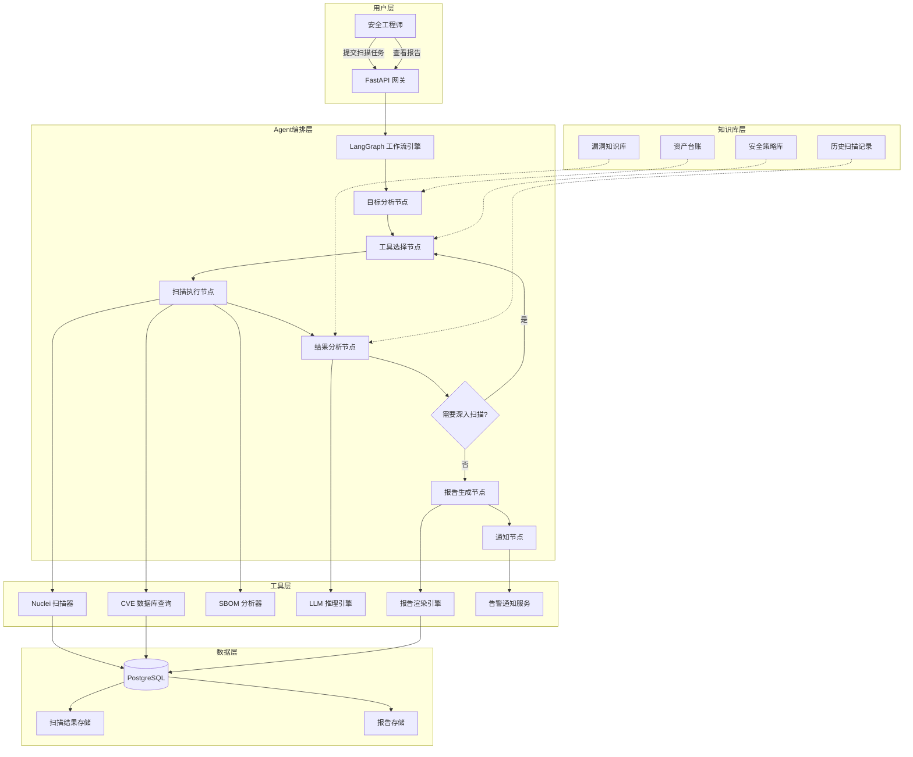
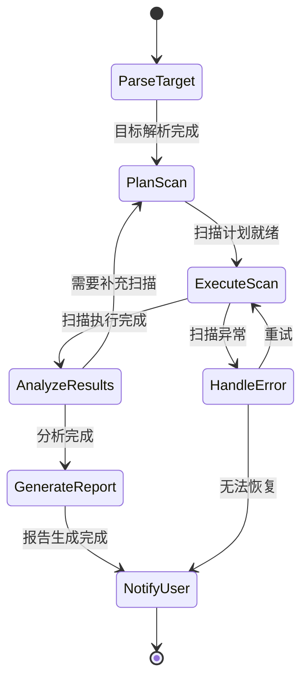
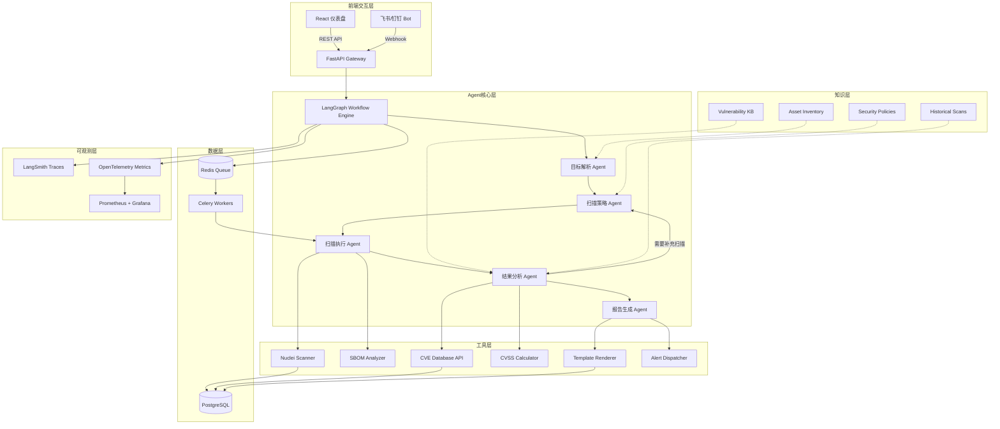

## 需求分析：安全评估的自动化刚需

在企业安全治理的实践中，漏洞扫描与报告生成是两项高频、高价值但极其消耗人力的核心任务。传统的安全评估流程高度依赖安全工程师的手动操作——从目标资产的梳理、扫描策略的配置、扫描结果的判读，到最终安全报告的编写，每一步都需要专业人员投入大量时间和精力。这种模式在资产规模持续膨胀、攻击面不断扩大的今天，已经暴露出显著的效率瓶颈。

### 自动化安全评估的典型场景

现代企业的安全评估需求通常涵盖以下场景：

| 场景 | 频率 | 典型耗时（人工） | 痛点 |
|------|------|------------------|------|
| **新资产上线安全评估** | 每次部署 | 4-8 小时 | 开发与安全流程脱节，上线前评估常被跳过 |
| **定期漏洞扫描** | 每周/每月 | 2-4 小时（不含分析） | 扫描范围更新不及时，模板化报告缺乏深度 |
| **合规审计准备** | 每季度 | 2-3 天 | 多标准交叉检查，报告格式要求各异 |
| **应急响应快速评估** | 事件驱动 | 1-2 小时（不含工具配置） | 时间压力下容易遗漏关键检查项 |
| **第三方组件安全审计** | 每次版本发布 | 3-6 小时 | SBOM 生成与 CVE 关联工作量大 |

### 人工扫描的效率瓶颈

安全工程师手动执行漏洞扫描时，面临的核心瓶颈并非扫描工具本身的运行时间，而是**扫描前的准备工作**和**扫描后的结果处理**：

- **目标分析耗时**：在执行扫描前，工程师需要理解目标系统的技术栈、网络拓扑和业务上下文，以选择合适的扫描模板和配置参数。这一过程需要阅读架构文档、与开发团队沟通，耗时通常占总工时的 20%-30%
- **结果判读依赖经验**：原始扫描结果中充斥着大量需要人工判读的信息——CVE 与实际环境的关联性、漏洞利用的可行性评估、修复建议的优先级排序。这些判断高度依赖安全工程师的个人经验，难以标准化
- **报告生成重复劳动**：每份安全报告的结构虽然相似，但需要根据目标系统的特性和扫描结果进行定制。安全工程师平均需要 2-3 小时将原始数据转化为结构化的可读报告

### 报告生成的额外开销

安全报告不仅是扫描结果的汇总，更是一份面向不同受众的技术文档。一份完整的漏洞扫描报告通常包含执行摘要（面向管理层）、技术详情（面向开发团队）、修复建议（面向运维团队）和风险评估矩阵（面向安全团队）。这种多视角的文档结构要求报告撰写者同时具备安全技术能力和文档表达能力，进一步加剧了人力瓶颈。

更关键的是，报告的时效性直接影响漏洞修复的效率。如果从扫描完成到报告交付需要 1-2 天，那么高危漏洞的修复窗口期就被不必要地拉长了。

---

## Agent 架构：ReAct 模式与 LangGraph 工作流

安全 Agent 的核心设计目标是将上述人工流程中的决策环节自动化，同时保留人类在关键节点的审核权。我们选择 **ReAct（Reasoning + Acting）模式** 作为 Agent 的推理范式，结合 **LangGraph** 实现工作流编排，构建一个端到端的自动化漏洞评估系统。

### ReAct 模式在安全场景的适配

ReAct 模式的核心是 **Thought → Action → Observation** 的循环迭代。在安全扫描场景中，这个循环被映射为：

- **Thought（推理）**：分析目标系统特征，判断应使用哪种扫描策略，评估当前扫描结果的风险等级
- **Action（行动）**：调用扫描工具、查询 CVE 数据库、生成报告片段
- **Observation（观察）**：接收工具返回结果，更新对目标系统的安全认知

### 系统架构全景



### LangGraph 状态机设计

LangGraph 的核心优势在于将 Agent 工作流建模为**有向图**，每个节点代表一个处理步骤，边代表状态转移条件。以下是我们为安全 Agent 定义的状态图：



在 LangGraph 中，这一状态机被定义为节点和边的拓扑结构：

```python
from langgraph.graph import StateGraph, END
from typing import TypedDict, Annotated
import operator


class SecurityScanState(TypedDict):
    target: dict
    scan_plan: list[dict]
    raw_results: Annotated[list[dict], operator.add]
    analyzed_findings: Annotated[list[dict], operator.add]
    report: dict | None
    iteration_count: int
    max_iterations: int


workflow = StateGraph(SecurityScanState)

workflow.add_node("parse_target", parse_target_node)
workflow.add_node("plan_scan", plan_scan_node)
workflow.add_node("execute_scan", execute_scan_node)
workflow.add_node("analyze_results", analyze_results_node)
workflow.add_node("generate_report", generate_report_node)
workflow.add_node("notify_user", notify_user_node)

workflow.set_entry_point("parse_target")
workflow.add_edge("parse_target", "plan_scan")
workflow.add_edge("plan_scan", "execute_scan")
workflow.add_edge("execute_scan", "analyze_results")
workflow.add_conditional_edges(
    "analyze_results",
    should_continue_scanning,
    {
        "continue": "plan_scan",
        "complete": "generate_report",
    },
)
workflow.add_edge("generate_report", "notify_user")
workflow.add_edge("notify_user", END)

graph = workflow.compile()
```

---

## 工具层设计：四大核心工具接口

工具层是安全 Agent 与外部世界交互的桥梁。每个工具都遵循统一的接口契约，确保 Agent 可以透明地调用和组合不同工具。

### 工具接口抽象

所有安全工具遵循统一的 `SecurityTool` 抽象接口，确保 Agent 层的工具选择逻辑与具体实现解耦：

```python
from abc import ABC, abstractmethod
from dataclasses import dataclass, field
from enum import Enum


class ToolCategory(Enum):
    SCANNER = "scanner"
    QUERY = "query"
    REPORT = "report"
    NOTIFICATION = "notification"


@dataclass
class ToolResult:
    success: bool
    data: dict
    metadata: dict = field(default_factory=dict)
    error: str | None = None


class SecurityTool(ABC):
    name: str
    category: ToolCategory
    description: str
    required_permissions: list[str]

    @abstractmethod
    async def execute(self, params: dict, context: dict) -> ToolResult:
        ...

    @abstractmethod
    def validate_params(self, params: dict) -> bool:
        ...

    def get_schema(self) -> dict:
        return {
            "name": self.name,
            "category": self.category.value,
            "description": self.description,
            "required_permissions": self.required_permissions,
        }
```

### Nuclei 扫描器封装

Nuclei 是 ProjectDiscovery 开源的基于模板的漏洞扫描器，拥有超过 9,000 个社区维护的检测模板。我们将 Nuclei 封装为 Agent 的核心扫描工具：

```python
import asyncio
import json
from pathlib import Path


class NucleiScanner(SecurityTool):
    name = "nuclei_scanner"
    category = ToolCategory.SCANNER
    description = "基于 Nuclei 模板的漏洞扫描器"
    required_permissions = ["network:scan"]

    def __init__(self, nuclei_bin: str = "nuclei"):
        self.nuclei_bin = nuclei_bin

    def validate_params(self, params: dict) -> bool:
        required = ["target"]
        return all(k in params for k in required)

    async def execute(self, params: dict, context: dict) -> ToolResult:
        target = params["target"]
        templates = params.get("templates", "")
        severity = params.get("severity", "low,medium,high,critical")
        rate_limit = params.get("rate_limit", 100)

        cmd = [
            self.nuclei_bin,
            "-target", target,
            "-severity", severity,
            "-rate-limit", str(rate_limit),
            "-json",
            "-silent",
        ]
        if templates:
            cmd.extend(["-t", templates])

        try:
            proc = await asyncio.create_subprocess_exec(
                *cmd,
                stdout=asyncio.subprocess.PIPE,
                stderr=asyncio.subprocess.PIPE,
            )
            stdout, stderr = await asyncio.wait_for(
                proc.communicate(), timeout=3600
            )

            findings = []
            for line in stdout.decode().strip().split("\n"):
                if line:
                    findings.append(json.loads(line))

            return ToolResult(
                success=proc.returncode == 0,
                data={"findings": findings, "count": len(findings)},
                metadata={"target": target, "templates_used": templates},
            )
        except asyncio.TimeoutError:
            return ToolResult(
                success=False, data={},
                error="扫描超时（超过 1 小时限制）",
            )
```

### CVE 数据库查询工具

该工具对接 NVD（National Vulnerability Database）和 CNA（CVE Numbering Authority）数据源，提供 CVE 详情查询、影响范围评估和修复建议检索：

```python
import httpx
from datetime import datetime


class CVEDatabaseQuery(SecurityTool):
    name = "cve_query"
    category = ToolCategory.QUERY
    description = "查询 CVE 漏洞详情、CVSS 评分和修复建议"
    required_permissions = ["cve:read"]

    def __init__(self, nvd_api_key: str | None = None):
        self.base_url = "https://services.nvd.nist.gov/rest/json/cves/2.0"
        self.api_key = nvd_api_key
        self.cache: dict[str, dict] = {}

    def validate_params(self, params: dict) -> bool:
        return "cve_id" in params

    async def execute(self, params: dict, context: dict) -> ToolResult:
        cve_id = params["cve_id"]

        if cve_id in self.cache:
            return ToolResult(success=True, data=self.cache[cve_id])

        headers = {}
        if self.api_key:
            headers["apiKey"] = self.api_key

        async with httpx.AsyncClient() as client:
            resp = await client.get(
                f"{self.base_url}",
                params={"cveId": cve_id},
                headers=headers,
                timeout=30,
            )

            if resp.status_code != 200:
                return ToolResult(
                    success=False, data={},
                    error=f"NVD API 返回 {resp.status_code}",
                )

            data = resp.json()
            if not data.get("vulnerabilities"):
                return ToolResult(
                    success=False, data={},
                    error=f"未找到 CVE: {cve_id}",
                )

            vuln = data["vulnerabilities"][0]["cve"]
            result = {
                "cve_id": cve_id,
                "description": vuln.get("descriptions", [{}])[0].get("value", ""),
                "published": vuln.get("published", ""),
                "last_modified": vuln.get("lastModified", ""),
                "severity": self._extract_severity(vuln),
                "references": [
                    ref.get("url", "")
                    for ref in vuln.get("references", [])
                ],
            }
            self.cache[cve_id] = result
            return ToolResult(success=True, data=result)

    def _extract_severity(self, vuln: dict) -> str:
        metrics = vuln.get("metrics", {})
        for key in ["cvssMetricV31", "cvssMetricV30", "cvssMetricV2"]:
            if key in metrics and metrics[key]:
                return metrics[key][0].get("cvssData", {}).get("baseSeverity", "UNKNOWN")
        return "UNKNOWN"
```

### 报告生成工具

报告生成工具负责将扫描结果和分析结论转化为结构化的安全报告，支持 Markdown 和 HTML 两种输出格式：

```python
from jinja2 import Template


class ReportGenerator(SecurityTool):
    name = "report_generator"
    category = ToolCategory.REPORT
    description = "生成结构化的安全扫描报告"
    required_permissions = ["report:write"]

    REPORT_TEMPLATE = Template("""# {{ title }}

## 执行摘要

| 项目 | 内容 |
|------|------|
| 扫描目标 | {{ target }} |
| 扫描时间 | {{ scan_time }} |
| 发现漏洞总数 | {{ total_findings }} |
| 高危漏洞 | {{ critical_count }} |
| 中危漏洞 | {{ high_count }} |
| 低危漏洞 | {{ medium_count }} |

## 风险评估

{{ risk_summary }}

## 漏洞详情


### {{ finding.severity }}: {{ finding.title }}

- **CVE 编号**: {{ finding.cve_id }}
- **CVSS 评分**: {{ finding.cvss_score }}
- **影响组件**: {{ finding.affected_component }}
- **描述**: {{ finding.description }}

**修复建议**: {{ finding.remediation }}

---


## 修复优先级建议

{{ remediation_priorities }}
""")

    def validate_params(self, params: dict) -> bool:
        return all(k in params for k in ["findings", "target", "scan_time"])

    async def execute(self, params: dict, context: dict) -> ToolResult:
        findings = params["findings"]
        severity_order = {"CRITICAL": 0, "HIGH": 1, "MEDIUM": 2, "LOW": 3}
        sorted_findings = sorted(
            findings,
            key=lambda f: severity_order.get(f.get("severity", "LOW"), 4),
        )

        counts = {"CRITICAL": 0, "HIGH": 0, "MEDIUM": 0, "LOW": 0}
        for f in findings:
            sev = f.get("severity", "LOW").upper()
            counts[sev] = counts.get(sev, 0) + 1

        rendered = self.REPORT_TEMPLATE.render(
            title=f"安全扫描报告 - {params['target']}",
            target=params["target"],
            scan_time=params["scan_time"],
            total_findings=len(findings),
            critical_count=counts.get("CRITICAL", 0),
            high_count=counts.get("HIGH", 0),
            medium_count=counts.get("MEDIUM", 0),
            findings=sorted_findings,
            risk_summary=self._generate_risk_summary(counts),
            remediation_priorities=self._prioritize_remediation(findings),
        )

        return ToolResult(
            success=True,
            data={"report_markdown": rendered, "finding_counts": counts},
        )
```

### 告警通知工具

告警通知工具负责在扫描完成后将关键发现推送到指定渠道，支持飞书、钉钉、Slack 和邮件：

```python
import httpx


class AlertNotifier(SecurityTool):
    name = "alert_notifier"
    category = ToolCategory.NOTIFICATION
    description = "发送扫描结果告警通知"
    required_permissions = ["notify:send"]

    def __init__(self):
        self.channels: dict[str, str] = {}

    def register_channel(self, name: str, webhook_url: str):
        self.channels[name] = webhook_url

    def validate_params(self, params: dict) -> bool:
        return all(k in params for k in ["channel", "message", "severity"])

    async def execute(self, params: dict, context: dict) -> ToolResult:
        channel = params["channel"]
        if channel not in self.channels:
            return ToolResult(
                success=False, data={},
                error=f"未注册的通知渠道: {channel}",
            )

        payload = self._build_payload(
            params["message"],
            params["severity"],
            params.get("findings_summary", {}),
        )

        async with httpx.AsyncClient() as client:
            resp = await client.post(
                self.channels[channel],
                json=payload,
                timeout=10,
            )
            return ToolResult(
                success=resp.status_code == 200,
                data={"status_code": resp.status_code},
            )

    def _build_payload(self, message: str, severity: str, summary: dict) -> dict:
        color_map = {
            "CRITICAL": "red",
            "HIGH": "orange",
            "MEDIUM": "yellow",
            "LOW": "green",
        }
        return {
            "msg_type": "interactive",
            "card": {
                "header": {
                    "title": {"tag": "plain_text", "content": f"安全扫描告警 [{severity}]"},
                    "template": color_map.get(severity, "blue"),
                },
                "elements": [
                    {"tag": "markdown", "content": message},
                    {"tag": "markdown", "content": f"**漏洞统计**: {summary}"},
                ],
            },
        }
```

---

## 推理链路：从目标分析到报告交付

安全 Agent 的推理链路是整个系统的"大脑"。它决定了扫描策略的选择、结果的解读和报告的生成质量。以下是一次完整扫描任务的执行追踪（Execution Trace）。

### 示例执行追踪

```
[用户输入] 扫描 https://api.example.com 的安全性

[Step 1 - 目标分析]
  Thought: 目标是一个 HTTPS API 端点，我需要先确认其技术栈和开放端口
  Action: 调用目标解析工具，识别技术指纹
  Observation: Nginx 1.24, Python 3.11, REST API, 开放端口 443

[Step 2 - 扫描计划]
  Thought: 基于技术栈信息，需要使用 Web 漏洞模板、API 安全模板和 SSL 配置模板
  Action: 生成扫描计划
    - Phase 1: SSL/TLS 配置检查 (nuclei-templates/ssl/)
    - Phase 2: Web 漏洞扫描 (nuclei-templates/http/)
    - Phase 3: API 安全评估 (nuclei-templates/http/api/)

[Step 3 - 扫描执行]
  Action: 执行 Nuclei 扫描，使用选定模板
  Observation: 发现 12 个漏洞
    - CRITICAL: 1 (SQL Injection in /api/users)
    - HIGH: 3 (CORS misconfig, Missing Rate Limiting, Verbose Error)
    - MEDIUM: 4 (X-Frame-Options missing, etc.)
    - LOW: 4 (Information disclosure, etc.)

[Step 4 - 结果分析]
  Thought: SQL Injection 是最严重的发现，需要深入验证其可利用性
  Action: 对 SQL Injection 进行深度分析，查询 CVE 关联
  Observation: 该漏洞与 CVE-2024-XXXX 关联，CVSS 9.8，已有公开 PoC

[Step 5 - 报告生成]
  Thought: 所有分析完成，生成结构化报告
  Action: 调用报告生成工具，整合所有发现
  Observation: 报告生成成功，包含执行摘要、详细发现和修复建议

[Step 6 - 通知推送]
  Action: 发送告警通知到安全团队飞书群
  Observation: 通知发送成功
```

### 推理链的 Prompt 工程

Agent 的推理质量取决于系统提示词的设计。以下是安全 Agent 系统提示词的核心结构：

```python
SECURITY_AGENT_SYSTEM_PROMPT = """你是一个专业的安全评估 Agent，负责自动化漏洞扫描和报告生成。

## 核心原则
1. 始终将扫描范围限制在用户明确授权的目标内
2. 不执行任何破坏性操作（如 DoS、数据删除）
3. 扫描频率必须遵守 rate_limit 约束
4. 对于高危漏洞，必须进行二次验证以排除误报

## 推理框架
每次决策前，按以下步骤思考：
1. 当前目标系统的特征是什么？
2. 哪些扫描策略最匹配当前场景？
3. 上一步的结果揭示了什么新信息？
4. 是否需要调整后续扫描计划？

## 输出规范
- 漏洞描述必须包含：影响范围、利用条件、修复建议
- 报告需区分技术详情和管理层摘要
- 所有判断必须有工具返回数据支撑，禁止臆测
"""
```

---

## 安全考量：Agent 自身的安全边界

安全 Agent 的特殊性在于：它操作的是安全敏感工具，处理的是安全敏感数据，因此 Agent 自身的安全设计至关重要。

### 扫描范围限制

```python
class ScanScopeGuard:
    def __init__(self, allowed_cidrs: list[str], allowed_domains: list[str]):
        self.allowed_networks = [ipaddress.ip_network(c) for c in allowed_cidrs]
        self.allowed_domains = allowed_domains

    def validate_target(self, target: str) -> bool:
        parsed = urlparse(target)
        hostname = parsed.hostname or ""

        if hostname in self.allowed_domains:
            return True

        try:
            ip = ipaddress.ip_address(hostname)
            return any(ip in net for net in self.allowed_networks)
        except ValueError:
            resolved = socket.getaddrinfo(hostname, None)
            for _, _, _, _, addr in resolved:
                try:
                    ip = ipaddress.ip_address(addr[0])
                    if any(ip in net for net in self.allowed_networks):
                        return True
                except ValueError:
                    continue

        return False
```

### 权限控制与结果脱敏

Agent 每次工具调用都需要通过权限引擎的校验。扫描结果在存储和传输前，必须经过脱敏处理——移除可能暴露的凭证信息、内部 IP、业务逻辑细节：

```python
class ResultSanitizer:
    SENSITIVE_PATTERNS = [
        (r'password["\s:=]+\S+', 'password=***'),
        (r'api[_-]?key["\s:=]+\S+', 'api_key=***'),
        (r'token["\s:=]+\S+', 'token=***'),
        (r'\b(?:10|172\.(?:1[6-9]|2\d|3[01])|192\.168)\.\d{1,3}\.\d{1,3}\b',
         '[INTERNAL_IP]'),
    ]

    def sanitize(self, data: dict) -> dict:
        import re
        import json

        text = json.dumps(data)
        for pattern, replacement in self.SENSITIVE_PATTERNS:
            text = re.sub(pattern, replacement, text, flags=re.IGNORECASE)
        return json.loads(text)
```

### 速率限制

为了防止 Agent 在扫描过程中对目标系统造成过大压力，所有扫描操作都受到全局和单目标的速率限制：

| 限制维度 | 默认值 | 说明 |
|---------|--------|------|
| 全局并发扫描数 | 3 | 同时运行的扫描任务上限 |
| 单目标 QPS | 100 req/s | Nuclei 的 rate-limit 参数 |
| API 调用频率 | 50 次/分钟 | CVE 查询等外部 API 的限制 |
| 报告生成并发 | 5 | 避免 LLM API 过载 |

---

## 评测体系：量化 Agent 的安全评估质量

安全 Agent 的评测不能仅依赖漏洞发现数量，而需要建立多维度的质量保障体系。

### 核心评测指标

| 指标 | 定义 | 目标值 | 计算方式 |
|------|------|--------|---------|
| **漏洞覆盖率（Coverage）** | 已知漏洞被发现的比例 | ≥ 95% | 发现数 / 基准集总数 |
| **误报率（False Positive Rate）** | 被错误报告为漏洞的比例 | ≤ 5% | 误报数 / 报告总数 |
| **漏报率（False Negative Rate）** | 未被发现的真实漏洞比例 | ≤ 3% | 漏报数 / 基准集总数 |
| **报告完整性** | 报告包含必要字段的完整度 | 100% | 完整字段数 / 必要字段总数 |
| **修复建议准确性** | 建议的可执行性和正确性 | ≥ 90% | 专家评审通过率 |
| **端到端耗时** | 从任务提交到报告交付的总时间 | ≤ 30 分钟 | 时间戳差值 |
| **用户满意度** | 安全工程师对报告质量的评分 | ≥ 4.0/5.0 | NPS 问卷 |

### 评测框架实现

```python
from dataclasses import dataclass
from datetime import datetime


@dataclass
class EvaluationResult:
    coverage: float
    false_positive_rate: float
    false_negative_rate: float
    report_completeness: float
    remediation_accuracy: float
    end_to_end_time: float
    overall_score: float


class SecurityAgentEvaluator:
    REQUIRED_REPORT_FIELDS = [
        "executive_summary", "scope", "methodology",
        "findings", "risk_matrix", "remediation_plan",
    ]

    def evaluate(
        self,
        scan_results: list[dict],
        ground_truth: list[dict],
        report: dict,
        start_time: datetime,
        end_time: datetime,
    ) -> EvaluationResult:
        detected_ids = {f.get("vuln_id") for f in scan_results}
        truth_ids = {f.get("vuln_id") for f in ground_truth}

        true_positives = detected_ids & truth_ids
        false_positives = detected_ids - truth_ids
        false_negatives = truth_ids - detected_ids

        total_reported = len(detected_ids)
        coverage = len(true_positives) / len(truth_ids) if truth_ids else 1.0
        fp_rate = len(false_positives) / total_reported if total_reported else 0.0
        fn_rate = len(false_negatives) / len(truth_ids) if truth_ids else 0.0

        completeness = sum(
            1 for field in self.REQUIRED_REPORT_FIELDS if field in report
        ) / len(self.REQUIRED_REPORT_FIELDS)

        e2e_time = (end_time - start_time).total_seconds()

        overall = (
            coverage * 0.3
            + (1 - fp_rate) * 0.25
            + (1 - fn_rate) * 0.25
            + completeness * 0.1
            + (1 - min(e2e_time / 3600, 1.0)) * 0.1
        )

        return EvaluationResult(
            coverage=coverage,
            false_positive_rate=fp_rate,
            false_negative_rate=fn_rate,
            report_completeness=completeness,
            remediation_accuracy=0.0,
            end_to_end_time=e2e_time,
            overall_score=overall,
        )
```

---

## 技术栈：为什么选择这些组件

安全 Agent 的技术栈选择遵循"**成熟可靠、社区活跃、生产验证**"的原则。

| 组件 | 选型 | 选型理由 |
|------|------|---------|
| **Agent 编排** | LangGraph | 基于图的状态机模型天然适合安全扫描的多阶段决策流程；支持人机协作节点（Human-in-the-Loop），满足安全审核需求 |
| **漏洞扫描** | Nuclei | 9,000+ 社区模板覆盖主流 CVE；模板化设计便于定制；Go 语言编写，单机扫描性能优异 |
| **数据库** | PostgreSQL + pgvector | 扫描结果的结构化存储；pgvector 支持语义化漏洞检索；成熟的事务支持确保数据一致性 |
| **API 网关** | FastAPI | 异步原生支持，适合 I/O 密集型的扫描任务管理；自动生成 OpenAPI 文档，便于前端集成 |
| **前端** | React + Recharts | 仪表盘可视化扫描结果和趋势分析；组件化架构便于迭代报告展示形式 |
| **LLM 推理** | GPT-4o / Claude 3.5 | 用于结果分析和报告生成；长上下文窗口支持完整扫描结果的分析；结构化输出能力确保报告格式一致 |
| **任务队列** | Redis + Celery | 长时间扫描任务的异步执行；任务状态追踪和重试机制 |
| **可观测性** | LangSmith + OpenTelemetry | Agent 推理链路的完整追踪；工具调用的延迟和成功率监控 |

选择 LangGraph 而非 AutoGen 或 CrewAI 的关键考量在于：安全扫描是一个**结构化程度较高**的流程，各阶段之间的转换逻辑明确，不需要过度的自主协商能力。LangGraph 的有向图模型能够精确表达这种流程，同时保留足够的灵活性来应对扫描过程中的动态调整（如发现高危漏洞时触发深度扫描）。

Nuclei 相较于 Nessus、OpenVAS 等商业/开源扫描器的核心优势在于其**模板化架构**——社区持续维护的模板库使得新漏洞的检测能力能够快速更新，无需等待工具本身的版本发布。同时，Nuclei 的 JSON 输出格式便于 Agent 的程序化解析。

---

## 架构图：完整安全 Agent 系统



### GitHub 仓库

> **项目地址**: [github.com/your-org/security-agent](https://github.com/your-org/security-agent)
>
> 仓库包含完整的项目代码、部署脚本、评测数据集和使用文档。欢迎 Star 和 PR。

### 部署架构

生产环境推荐使用 Docker Compose 进行本地部署，或使用 Kubernetes 进行集群化部署：

```yaml
services:
  api:
    build: ./api
    ports:
      - "8000:8000"
    environment:
      - DATABASE_URL=postgresql://user:pass@db:5432/security_agent
      - REDIS_URL=redis://redis:6379/0
      - OPENAI_API_KEY=${OPENAI_API_KEY}
    depends_on:
      - db
      - redis

  worker:
    build: ./worker
    environment:
      - DATABASE_URL=postgresql://user:pass@db:5432/security_agent
      - REDIS_URL=redis://redis:6379/0
    depends_on:
      - db
      - redis

  db:
    image: pgvector/pgvector:pg16
    volumes:
      - pgdata:/var/lib/postgresql/data
    environment:
      - POSTGRES_DB=security_agent
      - POSTGRES_USER=user
      - POSTGRES_PASSWORD=pass

  redis:
    image: redis:7-alpine

volumes:
  pgdata:
```

---

## 延伸阅读

- **[ReAct: Synergizing Reasoning and Acting in Language Models](https://arxiv.org/abs/2210.03629)** - ReAct 模式的原始论文，定义了 Thought-Action-Observation 循环的理论基础
- **[LangGraph 官方文档](https://langchain-ai.github.io/langgraph/)** - 本文工作流编排所依赖的框架文档，包含状态管理和人机协作的详细指南
- **[Nuclei 项目](https://github.com/projectdiscovery/nuclei)** - 基于模板的快速漏洞扫描器，拥有 9,000+ 社区维护的检测模板
- **[NIST NVD API](https://nvd.nist.gov/developers/vulnerabilities)** - 国家漏洞数据库的官方 API，提供 CVE 详情、CVSS 评分和 CPE 匹配
- **[OWASP Top 10 2024](https://owasp.org/www-project-top-ten/)** - Web 应用安全风险的权威分类，可作为扫描模板设计的参考框架
- **[CIS Benchmarks](https://www.cisecurity.org/cis-benchmarks)** - 安全配置基线标准，可用于生成合规性检查模板
- **[AI Agent 安全设计：权限模型、沙箱隔离与审计日志](../../08-安全与AI融合/AI Agent安全设计：权限模型、沙箱隔离与审计日志/_index.md)** - 本系列中关于 Agent 自身安全架构的详细论述
- **[AI 驱动安全运营：智能 SOC、自动化响应与漏洞分析 Agent](../../08-安全与AI融合/AI驱动安全运营：智能SOC、自动化响应与漏洞分析Agent/_index.md)** - 从 SOC 运营视角理解 AI 在安全领域的全景应用
