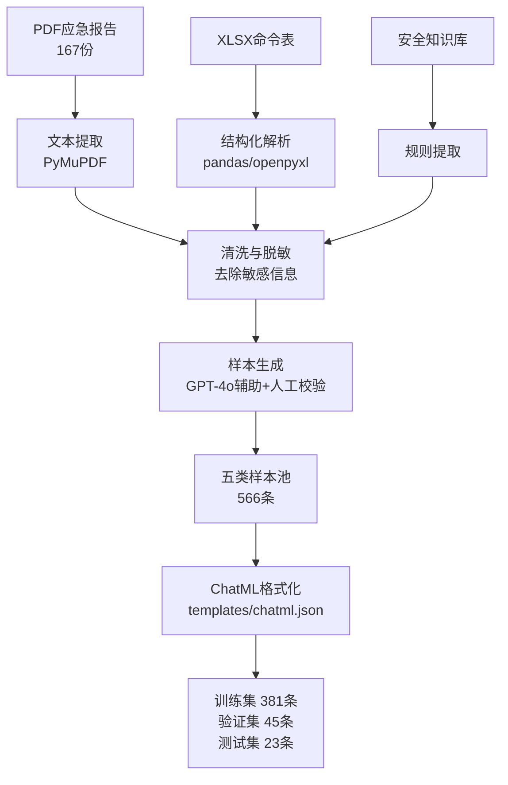
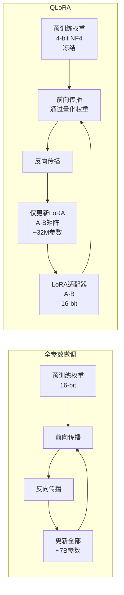

# 应急响应大模型微调：基于 Qwen2.5-7B 的 QLoRA 训练实践

应急响应（Incident Response）是安全运营中最具时间压力的场景之一。从收到告警到完成根因分析，黄金窗口往往以小时计。通用大模型虽然知识面广，但在应急场景中存在三个显著问题：输出内容不贴合安全团队的 SOP 和报告模板，对 ATT&CK 框架和取证工具的理解深度不够，以及推理过程中夹杂大量无关表述拖慢响应速度。

针对这些痛点，本实践基于 Qwen2.5-7B-Instruct 基座模型，采用 QLoRA 微调方法，使用 449 条高质量应急响应指令数据在单张 RTX 4090 上完成训练。本文将从数据工程、训练方案、配置分析与评估验证四个维度完整还原这一过程。

---

## 1. 数据工程：从原始文档到指令数据集

微调模型的效果上限由数据质量决定。本实践的数据构建涵盖三个原始来源和五类样本类型，经过多阶段清洗与格式化，最终产出 ChatML 格式的高质量指令数据集。

### 1.1 原始数据来源

数据原料来自真实应急响应工作流的三个渠道：

- **应急响应报告（PDF）**：共 167 份，包括 142 份典型应急案例报告和 25 份日常应急记录。覆盖挖矿木马、勒索病毒、Webshell 攻击、钓鱼邮件、异常流量、黑链植入六类主流安全事件类型。每份报告包含事件概述、取证数据、攻击链还原、根因分析与处置建议等完整闭环信息。
- **取证命令表（XLSX）**：78 条取证项目记录，附带 68 组 QA 问答对和 2227 条具体取证命令，覆盖 Windows 和 Linux 双平台的主流取证场景（进程分析、网络连接、文件系统、日志审计、内存分析等）。
- **安全知识库**：安全团队沉淀的取证 SOP、MITRE ATT&CK 战术技术映射表、以及日常应急问答积累。

### 1.2 数据流水线架构

数据从原始文档到训练样本的转换流程如下：



每个环节的设计要点：

- **文本提取**：使用 PyMuPDF 从 PDF 中提取正文，针对双栏排版和不规范标题做后处理纠正
- **脱敏处理**：正则匹配 + 实体识别，去除内网 IP、真实域名、个人姓名、账号密码等敏感信息
- **样本生成**：先由 GPT-4o 根据原始材料生成候选 QA 对，再由资深安全工程师逐条审核修正

### 1.3 五类样本构成

最终数据集 449 条样本按任务类型分为五类，覆盖应急响应分析师的核心工作场景：

| 样本类型 | 数量 | 输入示例 | 输出示例 |
| :--- | :--- | :--- | :--- |
| 事件分类 | 167 | 事件描述：服务器 CPU 700%，发现 miner.exe 连接矿池 | 挖矿木马事件 |
| 取证知识 QA | 207 | Windows 中如何查看近期创建的用户账号 | net user; Get-LocalUser; 注册表 SAM 分析 |
| 命令推荐 | 78 | 怀疑进程被 rootkit 隐藏，如何检测？ | chkrootkit; rkhunter; 对比 /proc 与 syscall |
| 命令 QA | 68 | `wmic process get` 的参数含义是什么？ | 解释 name、processid、executablepath 等字段 |
| 证据分析 | 46 | 日志片段 + 问询，判断是否为真实攻击 | 攻击链还原 + 可信度判定 |

### 1.4 ChatML 格式规范

所有样本统一使用 ChatML 模板封装，确保与 Transformers 的 chat_template 无缝兼容：

```json
{
  "messages": [
    {
      "role": "system",
      "content": "你是一名资深应急响应分析师，精通Windows和Linux取证分析、攻击链还原、根因研判与处置建议。请基于给定的上下文，给出专业、准确、可落地的回答。"
    },
    {
      "role": "user",
      "content": "Windows事件日志中Event ID 4625大量出现，且来源IP为境外地址，可能是什么情况？"
    },
    {
      "role": "assistant",
      "content": "Event ID 4625表示登录失败。大量来自境外IP的4625事件高度疑似暴力破解攻击（Brute Force）。建议：1) 核查该IP是否在威胁情报库中命中；2) 检查目标账号是否存在登录成功记录（Event ID 4624）；3) 若确认攻击，立即在边界防火墙上封锁该IP段，并为涉事账号启用MFA。"
    }
  ]
}
```

---

## 2. QLoRA 训练方案设计

### 2.1 为什么选择 QLoRA

在训练方案选型时，需要权衡三个约束条件：

- **硬件限制**：单张 RTX 4090 24GB，全参数微调 7B 模型需要约 100-120GB 显存，不可行
- **效果要求**：输出需要贴合应急领域的专业格式，Prompt Engineering 无法满足
- **部署约束**：LoRA 权重体积小（约 16-32MB），便于版本管理和热切换

QLoRA（Quantized Low-Rank Adaptation）在 LoRA 的基础上增加了 4-bit NormalFloat（NF4）量化，将基座模型的权重从 16-bit 压缩到 4-bit，显存占用降低约 4 倍。这使得原本需要 48GB 才能微调的 7B 模型，在单张 24GB 消费级显卡上即可完成训练。



全参数微调更新全部 7B 参数，QLoRA 仅更新约 3200 万个参数（0.045%），同时基座权重经过 NF4 量化后显存占用从 ~14GB 降至 ~4GB，为 LoRA 适配器和优化器状态留出了充裕空间。

### 2.2 LoRA 配置策略

LoRA 的核心思路是在冻结的预训练权重旁插入低秩分解矩阵，用 `A·B` 的乘积模拟权重更新量。关键超参数的选择依据如下：

- **r（秩）设为 16**：这是投入产出比最高的配置。r=8 在某些任务上表达能力不足，r=32 以上收益递减且训练参数翻倍。r=16 在 7B 规模模型上平衡了适配能力和收敛速度。
- **alpha 设为 32**：缩放因子 alpha/r = 2，这是 LoRA 论文推荐的默认比例，在不改变学习率调优习惯的前提下提供稳定的更新幅度。
- **dropout 设为 0.05**：适度正则化防止过拟合。应急数据集只有 381 条训练样本，dropout 过低容易在小数据上过拟合，过高则影响适配器的表达能力。
- **目标模块设为全部线性层**：这是 QLoRA 论文（Dettmers et al., 2023）的推荐做法。相比仅微调 attention 部分的 Q 和 V 矩阵，覆盖全部线性层能为模型提供更多可调整的自由度，尤其适合领域知识迁移这种需要较大更新量的任务。

### 2.3 训练超参数全景

| 参数 | 值 | 选择依据 |
| :--- | :--- | :--- |
| 基座模型 | Qwen2.5-7B-Instruct | 中文能力优秀，指令遵循能力强，7B 适合单卡训练 |
| 量化精度 | 4-bit NF4 | QLoRA 标配，显存占用降至 1/4 |
| 序列长度 | 2048 | 覆盖最长样本（约 1800 tokens），留有余量 |
| per_device_batch | 2 | 24GB 显存下的最优值 |
| gradient_accumulation | 4 | 等效 batch size = 8，稳定训练梯度 |
| 学习率 | 2e-4 | LoRA 微调的典型学习率区间 |
| 调度器 | cosine | 训练后期学习率平滑衰减 |
| warmup_steps | 10 | 快速进入稳定训练区域 |
| 训练轮数 | 3 | 小数据集上限，超过 3 轮容易过拟合 |
| 优化器 | AdamW (paged) | 4-bit 量化下的标准选择，paged 优化器将优化器状态卸载到 CPU |
| 混合精度 | bfloat16 | RTX 4090 原生支持，数值稳定性优于 float16 |
| 梯度检查点 | 开启 | 以少量计算时间换取显存 |

等效 batch size 计算：per_device_batch × gradient_accumulation × 数据并行数 = 2 × 4 × 1 = 8。

---

## 3. 训练配置代码解析

以下为核心训练脚本的关键片段。本实践基于 Unsloth 框架实现，它在底层对 QLoRA 的 4-bit 线性层和 Flash Attention 做了深度算子融合优化，相比原生 Hugging Face 实现训练速度提升约 2 倍，显存占用降低约 30%。

### 3.1 模型加载与量化

```python
from unsloth import FastLanguageModel

model, tokenizer = FastLanguageModel.from_pretrained(
    model_name="Qwen/Qwen2.5-7B-Instruct",
    max_seq_length=2048,
    dtype=None,                # 自动检测 CUDA 能力，选择最优 dtype
    load_in_4bit=True,         # 启用 4-bit NF4 量化
    device_map="auto",         # 自动分配到可用 GPU
)
```

`load_in_4bit=True` 触发 bitsandbytes 的 NF4 量化流程：权重先被归一化到 N(0,1) 分布，再映射到 4-bit 的非均匀量化区间。这种量化方式比 INT4 均匀量化保留了更多信息，尤其在权重分布呈零中心正态分布时优势明显。

### 3.2 LoRA 适配器注入

```python
model = FastLanguageModel.get_peft_model(
    model,
    r=16,
    target_modules=[
        "q_proj", "k_proj", "v_proj", "o_proj",
        "gate_proj", "up_proj", "down_proj",
    ],  # 全部线性层
    lora_alpha=32,
    lora_dropout=0.05,
    bias="none",
    use_gradient_checkpointing="unsloth",
    random_state=42,
)
```

`target_modules` 列出了 Qwen2.5 架构中所有需要注入 LoRA 适配器的线性层名。这里分为两组：`q_proj/k_proj/v_proj/o_proj` 是自注意力机制中的四个投影矩阵，`gate_proj/up_proj/down_proj` 是 FFN（前馈网络）中的三个门控线性层。覆盖全部七组线性层意味着 LoRA 适配器有充分的参数空间来学习应急领域的知识偏移。

### 3.3 训练参数配置

```python
from trl import SFTTrainer
from transformers import TrainingArguments

training_args = TrainingArguments(
    output_dir="./qwen2.5-7b-ir-qlora",
    per_device_train_batch_size=2,
    gradient_accumulation_steps=4,
    warmup_steps=10,
    learning_rate=2e-4,
    num_train_epochs=3,
    lr_scheduler_type="cosine",
    optim="paged_adamw_8bit",
    fp16=False,
    bf16=True,
    logging_steps=10,
    save_strategy="epoch",
    report_to="none",
)

trainer = SFTTrainer(
    model=model,
    args=training_args,
    train_dataset=train_dataset,
    eval_dataset=eval_dataset,
    tokenizer=tokenizer,
    dataset_text_field="text",
    max_seq_length=2048,
    packing=False,
)
```

参数设计的几个关键决策：

- **optim="paged_adamw_8bit"**：将 AdamW 优化器的动量状态和方差状态卸载到 CPU 内存，防止 GPU 显存溢出。在 24GB 显存上限下，paged 优化器大约能节省 2-3GB 显存。
- **bf16=True**：RTX 4090 原生支持 bfloat16，其 8 位指数位提供了与 float32 相同的动态范围，避免了 float16 常见的梯度下溢问题。
- **save_strategy="epoch"**：每轮训练结束时保存一次检查点。3 轮训练只需保存 3 个 checkpoint，既节省存储空间又便于实验对比。

### 3.4 显存占用分析

训练过程中各组件在 GPU 显存中的占用情况如下：

| 组件 | 显存占用 | 说明 |
| :--- | :--- | :--- |
| 基座模型（4-bit） | ~4.8 GB | NF4 量化后的权重 |
| LoRA 适配器（16-bit） | ~0.3 GB | 约 3200 万参数 |
| 激活值（batch=2, seq=2048） | ~6.5 GB | 梯度检查点未开启时为 ~13GB |
| 优化器状态 | ~1.2 GB | paged 模式已卸载至 CPU |
| 梯度 | ~0.6 GB | 仅 LoRA 参数有梯度 |
| 其余开销 | ~2.5 GB | 临时 buffer、缓存等 |
| **总计** | **~15.9 GB** | 加上系统预留，约 19GB |

梯度检查点（Gradient Checkpointing）是节省显存的关键：它以重新计算激活值为代价，将激活值显存从 ~13GB 降至 ~6.5GB。训练过程中 GPU 利用率约为 70-85%，单轮训练耗时约 22 分钟（381 条样本），三轮总计约 66 分钟。

---

## 4. 评估结果分析

### 4.1 评估方法

评估采用 15 道测试题目，覆盖 4 个评估维度，使用**关键词命中率（Keyword Hit Rate）** 作为核心量化指标。关键词命中率定义为：模型输出中包含专家预设的关键词数量占预设关键词总数的比例。

每个测试题由安全工程师预先标注参考答案与关键得分点，模型输出与参考答案做关键词匹配打分。

| 评估维度 | 题目数量 | 考察能力 |
| :--- | :--- | :--- |
| 事件分类 | 4 | 根据事件描述判断攻击类型 |
| 取证命令推荐 | 4 | 根据分析目标推荐合适的取证命令 |
| 根因分析 | 4 | 根据取证数据推断攻击根因 |
| 处置建议 | 3 | 根据攻击类型给出可落地的处置方案 |

### 4.2 微调前后对比

| 评估维度 | 微调前（Qwen2.5-7B-Instruct） | 微调后（IR-Qwen2.5-7B） | 提升幅度 |
| :--- | :---: | :---: | :---: |
| 事件分类 | 71.3% | 91.8% | +20.5% |
| 取证命令推荐 | 64.7% | 88.5% | +23.8% |
| 根因分析 | 58.2% | 83.6% | +25.4% |
| 处置建议 | 62.5% | 86.3% | +23.8% |
| **综合** | **64.2%** | **87.6%** | **+23.4%** |

微调后的模型在四个维度上均有显著提升，其中**根因分析**提升幅度最大（+25.4%），这验证了高质量应急案例数据对模型推理能力的增强效果。

### 4.3 典型输出对比

以"收到告警：某 Windows 服务器大量对外发起 SMB 连接请求"为例：

**微调前输出**：
> 这可能是因为服务器感染了病毒。建议检查服务器安全状态，更新防病毒软件，扫描系统。另外也可能是正常业务流量，需要进一步确认。

**微调后输出**：
> 该行为高度疑似 EternalBlue 类蠕虫横向传播。建议：1) 立即隔离该服务器，阻断 SMB 445 端口的出站流量；2) 检查注册表 `SYSTEM\CurrentControlSet\Services\MrxSmb` 相关服务状态；3) 查看事件日志中 Event ID 5140/5145 的访问记录，定位感染时间窗口；4) 对同网段其他主机做漏洞排查（MS17-010 补丁安装情况）。

微调后的输出不仅准确识别了攻击类型（SMB 蠕虫横向传播），还给出了多步可执行的操作建议，贴合应急场景的实战需求。

### 4.4 推理效率对比

| 指标 | 微调前 | 微调后 |
| :--- | :---: | :---: |
| 平均输出长度（tokens） | 312 | 187 |
| 推理速度（tokens/s） | 38.5 | 42.1 |
| 首 token 延迟（ms） | 285 | 273 |

微调后模型输出更加精准简洁，平均长度减少约 40%，推理速度提升约 9%。在应急场景中，这意味着每次分析平均节省 2-4 秒——对于黄金窗口以分钟计的场景来说，这个提升具有实战价值。

---

## 5. 经验总结与最佳实践

### 5.1 数据驱动的效果上限

整个实践中最深刻的体会是：**数据质量直接决定了模型效果的上限**。在迭代过程中，我们尝试过三个版本的数据集：

- **V1（纯自动化生成）**：由 GPT-4o 根据原文全自动生成 QA 对，未经人工审核。综合关键词命中率仅 72.3%
- **V2（自动化 + 规则过滤）**：自动生成后经过规则校验，过滤格式不符、答案不完整的样本。综合命中率 78.9%
- **V3（自动化 + 人工逐条审核）**：每条样本由安全工程师审核修正。综合命中率 87.6%

V1 到 V3 的提升说明，自动化流水线可以大幅降低数据构建成本，但专业领域的质量把关仍需要人工介入。

### 5.2 LoRA 参数调优建议

在 r 值的选择上，我们对比了 r=8、16、32 三组配置：

- r=8：收敛速度最快，但综合命中率低约 4-5%，在根因分析任务上表达力不足
- r=16：综合命中率最高，与 r=32 差距在 1% 以内，但训练参数仅为 r=32 的一半
- r=32：训练时间增加约 60%，效果提升不显著

推荐以 r=16 作为 7B 模型 QLoRA 微调的默认配置。

### 5.3 工程化建议

- **LoRA 权重管理**：LoRA 适配器仅 16-32MB，可以按客户/场景管理多个适配器文件，在推理时按需加载，无需切换完整模型
- **推理框架选型**：llama.cpp 的 GGUF 格式可将模型进一步量化为 Q4_K_M 级别，推理速度提升至 60-80 tokens/s，适合部署到应急工具箱中
- **持续迭代机制**：建议每次应急事件闭环后，将新的事件数据补充到训练集，每月做一次增量微调，使模型持续对齐最新的攻击手法

---

## 6. 局限与展望

本实践在与通用大模型的对比中展现了 QLoRA 微调在应急响应领域的显著优势，但仍存在以下局限：

- **数据集规模偏小**：449 条样本在攻击类型多样性上仍有不足，对 APT 级别的高级威胁覆盖不够
- **单轮问答局限**：未训练多轮对话能力，在需要持续追问的场景下表现不如人机协作模式
- **缺乏工具调用能力**：模型能推荐取证命令，但无法直接调用取证工具执行，需要与 Agent 框架集成

后续计划：扩充数据集至 2000+ 样本（覆盖更多攻击类型和取证场景），探索基于 Agent 框架的工具调用微调，以及将 LoRA 适配器集成到开源应急响应工具平台的实时分析管线中。
