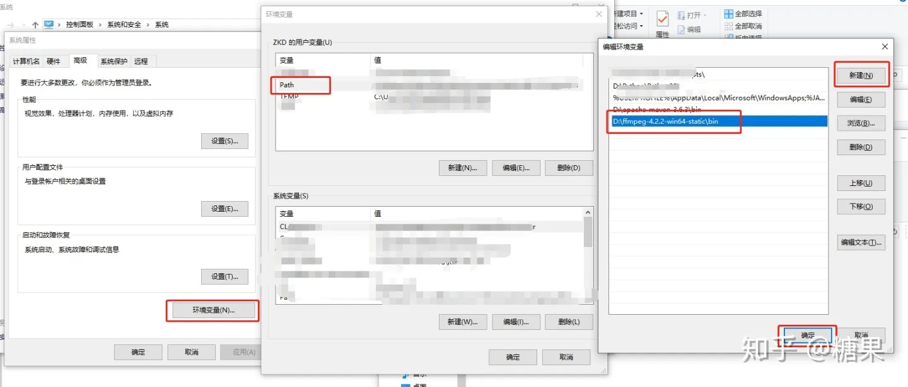

# chatgpt对接微信服务搭建

背景，这里有个需求就是我希望在日常微信的某个群中使用chatgpt回答群里的日常问题。如果你也想搭建一个对接微信的chatgpt问答机器人那么可以参考本文。

这里使用chatgpt-on-wechat项目进行搭建，项目地址：
https://github.com/zhayujie/chatgpt-on-wechat

## 安装过程
1. git config --global --unset http.proxy
2. git clone https://github.com/zhayujie/chatgpt-on-wechat.git
3. pip3 install -r requirements.txt
4. pip3 install -r requirements-optional.txt
5. pip3 install azure-cognitiveservices-speech
6. 修改config.json配置
7. windows: pip3 install SpeechRecognition
   windows注意：在执行的时候要使用git bash类linux的命令行防止unicode报错
8. ffmpeg安装
http://ffmpeg.org/

配置
https://zhuanlan.zhihu.com/p/118362010
1. 运行python3 app.py


## bug
1. 编码问题
   Q: UnicodeEncodeError: 'gbk' codec can't encode character '\u2580' in position 0: illegal multibyte sequence
   A: 在app.py文件中加入
    ```
    import io
    sys.stdout = io.TextIOWrapper(sys.stdout.buffer,encoding='utf8') #改变标准输出的默认编码
    ```


目前启动的时候每次都要手动登录才行，不定期会自动退出登录需要重新登录，尝试解决。


