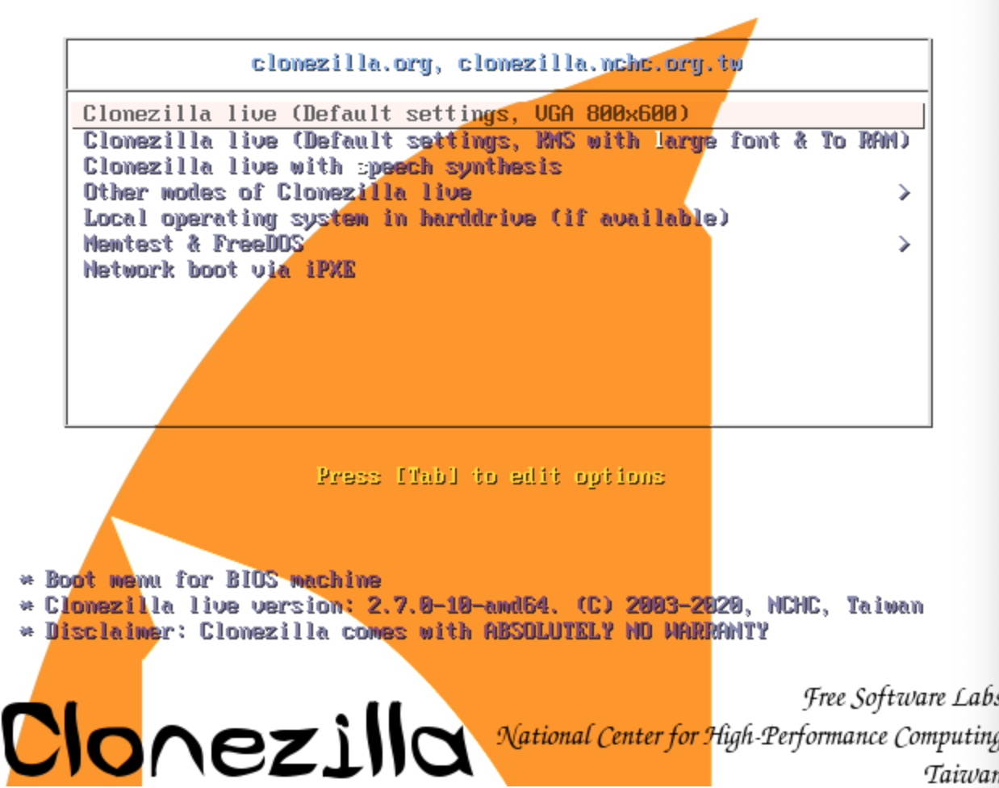
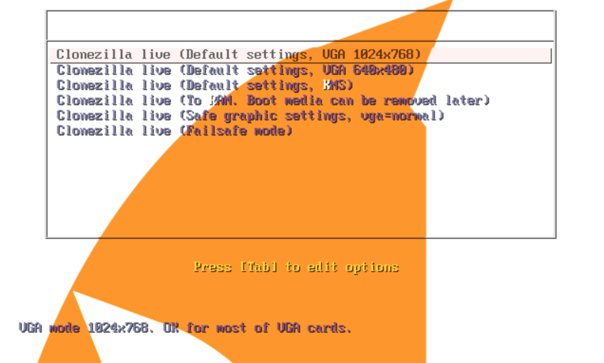
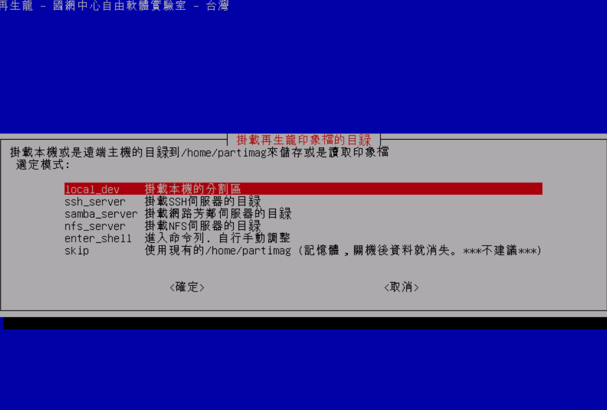
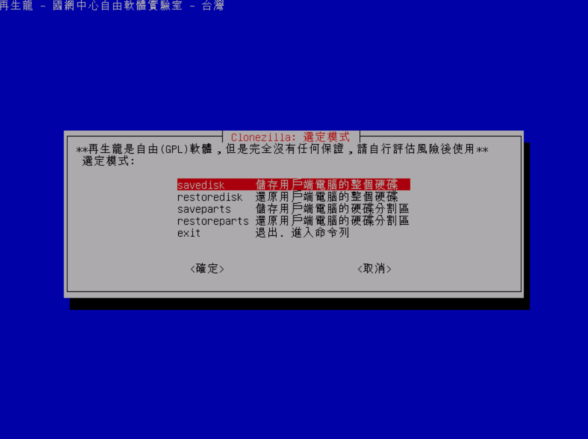

Clonezilla：https://clonezilla.org/ 多平台的分区和磁盘克隆程序。


Clonezilla是一个分区和磁盘成像/克隆程序，类似于True Image®或Norton Ghost®。帮助您进行系统部署、裸金属备份和恢复。Clonezilla有三种类型:Clonezilla live、Clonezilla lite server和Clonezilla SE(服务器版)。Clonezilla live适用于单机备份和恢复。虽然Clonezilla lite server或SE是用于大规模部署的，但它可以同时克隆许多(40多台!)计算机。Clonezilla只保存和恢复硬盘中使用过的块。这提高了克隆效率。在42节点集群中的一些高端硬件中，理论可达8gb/min速率恢复速率。

<!--more-->

## 特性

- 支持许多文件系统:

- - (1)ext2、ext3, ext4, reiserfs, reiser4, xfs、jfs, btrfs, f2fs nilfs2 GNU / Linux, 
  - (2) FAT12, FAT16, FAT32, NTFS Windows,
  - (3)HFS + Mac OS, 
  - (4) UFS FreeBSD, NetBSD, OpenBSD, 
  - (5) minix minix, 
  - (6) VMFS3 VMFS5 VMWare ESX。


因此，无论32位(x86)操作系统还是64位(x86-64)操作系统，都可以克隆GNU/Linux、MS windows、intel Mac OS、FreeBSD、NetBSD、OpenBSD、Minix、VMWare ESX、Chrome OS/Chromium操作系统。对于这些文件系统，**Partclone只保存和恢复分区中使用过的块。对于不支持的文件系统，在Clonezilla中，扇区到扇区的复制是由dd完成的。**


- 支持GNU/Linux下的LVM2 (LVM版本1不支持)。
- 可以重新安装引导加载程序，包括grub(版本1和版本2)和syslinux。
- 支持MBR和GPT分区格式的硬盘驱动器。Clonezilla live也可以在BIOS或uEFI机器上启动。
- 支持无人值守模式。几乎所有的步骤都可以通过命令和选项来完成。您还可以使用许多引导参数来定制您自己的映像和克隆。
- 支持一个映像恢复到多个本地设备。
- 镜像可以被加密。这是通过ecryptfs完成的，这是一种符合posix的企业加密堆叠文件系统。
- Clonezilla SE支持多播，适合大规模克隆。如果您的客户端支持PXE和局域网唤醒，您也可以远程使用它来保存或恢复一堆计算机。
- Clonezilla lite服务器支持BT (Bittorrent)，适合大规模部署。BT模式的工作由Ezio完成。
- 映像文件可以在本地磁盘、ssh服务器、samba服务器、NFS服务器或WebDAV服务器上。
- AES-256加密可用于保护数据的访问、存储和传输。
- 基于Partclone(默认)、Partimage(可选)、ntfsclone(可选)、dd对分区进行镜像或克隆。然而，包含其他一些程序的Clonezilla不仅可以保存和恢复分区，还可以保存和恢复整个磁盘。
- 通过使用我们自己开发的另一款免费软件drbl-winroll，可以自动更改克隆的MS windows机器的主机名、组名和SID。


## 最小运行环境

Clonezilla live所需最小系统环境：

处理器为X86或X86 -64

196mb系统内存(RAM)

启动设备，如CD/DVD驱动器、USB端口、PXE或硬盘驱动器

## 局限性

- 目标分区必须等于或大于源分区。
- 差异/增量备份尚未实现。
- 在线成像/克隆还没有实现。必须卸载要映像或克隆的分区。
- 由于图像格式的限制，无法探索或装入图像。您可以从映像中恢复单个文件。但是，您仍然有办法做到这一点，请阅读本文。
- 恢复Clonezilla live与多个cd或dvd还没有实现。现在，如果你选择创建恢复iso文件，所有的文件都必须在一个CD或DVD中。


## Clonezilla版本

- **Clonezilla Live:** Clonezilla Live允许你使用CD/DVD或USB闪存驱动器引导和运行Clonezilla(仅提供单播)
- **Clonezilla lite服务器:**Clonezilla lite服务器允许你使用Clonezilla live进行大规模克隆(支持单播，广播，多播，bt)
- **Clonezilla SE:** DRBL包含了Clonezilla SE，因此为了使用Clonezilla进行大规模克隆(支持单播、广播和组播)，必须首先建立DRBL服务器。


这里因为日常使用的clonezille live会比较多这里主要介绍live。


## Clonezilla Live及其使用

https://clonezilla.org/clonezilla-live.php


Clonezilla Live是一个针对x86/amd64 (x86-64)计算机的小型可引导GNU/Linux发行版。Clonezilla SE(服务器版)从2004年开始开发，用于同时部署多台计算机。这是一个非常有用的工具，但是它也有一些限制。为了使用它，您必须首先准备一个DRBL服务器，并且要部署的机器必须从网络启动(例如PXE/iPXE)。


### 如何安装Clonezilla Live

要安装Clonezilla live，基本步骤是下载预构建的Clonezilla live，然后将其放入引导介质(CD、USB闪存驱动器或USB硬盘驱动器)。有两种类型的文件可用，iso和zip。前者用于CD，后者用于USB闪存驱动器。此外，您还可以将Clonezilla放在硬盘驱动器或PXE服务器上。


- CD / DVD:

[下载一个ISO文件光盘/DVD](https://clonezilla.org/downloads.php)。然后你可以烧录文件CD / DVD与任何烧程序,这种K3b GNU / Linux或InfraRecorder女士的窗户,和记得选择“烧录镜像”的燃录到CD, 该CD可以用来引导机器启动镜像或克隆。在这里可以找到关于使用InfraRecorder[创建Clonezilla live CD的分步文档](https://clonezilla.org/fine-print-live-doc.php?path=./clonezilla-live/doc/09_Burn_Clonezilla_live_CD/00-create-clonezilla-live-cd.doc#00-create-clonezilla-live-cd.doc)。

- USB闪存驱动器或USB硬盘:

要把Clonezilla放到u盘或u盘上，请查看[这个文档](https://clonezilla.org/liveusb.php)。

- 硬盘:

要将Clonezilla安装在已经安装了操作系统的硬盘上，请检查[这个文档](https://clonezilla.org/livehd.php)。

- PXE服务器:

要将Clonezilla运行在PXE服务器上并通过PXE引导您的客户机，请检查[这个文档](https://clonezilla.org/livepxe.php)。

如果您有兴趣从头创建Clonezilla live iso或zip文件，请检查[这个文档](https://clonezilla.org/create_clonezilla_live_from_scratch.php)。//创建Clonezilla live 2.x!


### 如何使用Clonezilla Live

> Please refer to [this doc](https://clonezilla.org/clonezilla-usage/clonezilla-live-usage.php) for more details. 官方文档


下面是官方手册（已翻译）：

下面是Clonezilla Live启动的菜单：




第一个页面是Clonezilla Live默认的模式界面，它将默认为分辨率为1024x768的帧缓冲模式。


在第二选项“Other modes of Clonezilla live”中还有更多的模式可供选择，如:800X600或640x480，如果你愿意，如下图所示:




- 选择“Clonezilla live (To RAM。引导介质可以稍后删除)，与第一个相同的功能，不同的是当Clonezilla live引导完成时，所有必要的文件被复制到内存，可以移除启动介质(CD或u盘)。
- 如果您不需要中文或日文版环境，或者您的计算机在帧缓冲模式下遇到问题，您可以选择“Clonezilla Live (no framebuffer)”在英文环境中克隆。
- 选择“Clonezilla live(故障安全模式)”，是为了当你不能启动你的机器时出现问题，比如你的机器的ACPI在内核中不受支持。
- 如果你想在你的硬盘上启动本地操作系统，你可以选择“本地操作系统在硬盘(如果可用)”。这是引导介质中的一个额外功能，与Clonezilla Live没有任何关系。
- 选择“FreeDOS”，可以让你引导你的机器进入自由 DOS。这是引导介质中的一个额外功能，与Clonezilla Live没有任何关系。
- 选择“使用Memtest86+进行内存测试”是为了使用Memtest86+进行内存测试。这是引导介质中的一个额外功能，与Clonezilla Live没有任何关系。
- 选择“通过etherboot进行网络引导”或“通过gpxe进行网络引导”，可以通过etherboot或gpxe进行网络引导。如果您的计算机没有PXE网络，您可以使用它从网络引导。这是引导介质中的一个额外功能，与Clonezilla Live没有任何关系。

- - 在选择语言和键映射之后，首先会提示您分配映像存储库，它可以是本地磁盘、ssh服务器、nfs服务器、samba服务器(网络邻居)或任何可以作为/home/ partimag挂载的文件系统。一旦存储库就绪，您就可以继续保存或恢复映像。请按照屏幕上的说明操作。关于Clonezilla live的两个主要截图:



///注意/// **Clonezilla镜像名实际上就是目录名**。例如，如果你将镜像名命为2007-05-NOVISTA，所有的信息将会被保存在/home/partimag/2007-05-NOVISTA/目录中。MBR引导,切分表以及以及切分文件都会被储存。因此当你想要还原镜像的时候，应挂载/home/partimag到对应磁盘和路径，/home/partimag/这个目录下，并且还要有2007-05-NOVISTA目录。

Clonezilla Live prepare ocsroot菜单


[专家模式]如果你想手动挂载clonezilla image home (/home/partimag)，遵循以下步骤:


1. 运行“sudo su -”成为root。
2. 您必须准备另一个可写的设备或空间，并将其挂载为/home/partimag(注意!如果你的引导媒体是可写的,如USB闪存驱动器或您选择使用内存选项,已有/home/partimag与/live_media /home /partimag,你必须删除该文件,并创建一个目录/home/partimag作为挂载点“rm - f /home/partimag;mkdir - p /home/partimag)。例如，如果你想使用Clonezilla来保存/dev/hda，并将映像放在/dev/hdb1中，那么你必须通过“mount -t auto /dev/hdb1 /home/partimag”将/dev/hdb1挂载为/home/partimag。


如果/dev/hdb1的文件系统是ntfs，你必须使用"ntfs-3g /dev/hdb1 /home/partimag"来挂载它，这样它就可以写了。请记住，还支持sshfs和smbfs。例如，使用sshfs，你可以挂载你的远程ssh服务器:


```
sshfs ACCOUNT@SSH_SERVER: / ABSOLUTE_PATH /home/partimag
```


例如，如果你想挂载你的ssh服务器192.168.100.254目录/work/pool，像这样运行:


```
/home/partimag sshfs root@192.168.100.254: /home/partimag
```


如果你想用目录/work/smb挂载你的samba服务器192.168.200.254，像这样运行:


```
mount -t cifs -o user=your_user_name //192.168.200.254/work/smb /home/partimag . conf . mount -t cifs -o user=your_user_name //192.168.200.254/work/smb /home/partimag . conf
```


如果您想用目录/work/smb挂载samba服务器192.168.200.254，用户名为“administrator”，密码为“pass”，请像这样运行:


```
mount -t cifs -o user=administrator,password=pass //192.168.200.254/work/smb /home/partimag . mount -t cifs -o user=administrator,password=pass
```


///说明///上述命令中，**Linux下不使用smbfs，****LINUX下****使用cifs协议，cifs协议对windows MS文件共享的兼容性更好****。当您使用smbfs时，Clonezilla live将无法保存正确的镜像!**

1. 运行“clonezilla”来使用clonezilla，然后按照屏幕上的说明操作。


### 更多文章示例

http://clonezilla.nchc.org.tw/related_article/


### 通过视频学习了解clonezilla使用

通过视频学习如何使用clonezilla：

https://www.youtube.com/watch?v=cEE_vn8E0Kk

https://www.youtube.com/results?search_query=clonezilla

相关视频链接

- [Backup with Clonezilla | LAS | s25e10](http://www.youtube.com/watch?v=mipCOMqirF0)
- [How To Backup AND Restore you Computer with CloneZilla! (BEST HD Tutorial!!)](http://www.youtube.com/watch?v=LS6VhLDw-io)
- [Disk to Disk Copy with Clonezilla](http://www.youtube.com/watch?v=YzxL95GmmYk)
- [How to Do a System Backup Using Clonezilla](http://www.youtube.com/watch?v=raYLbjQVCy4)
- [How to use CloneZilla Tutorial (Making an image file and copying it to another computer)](http://www.youtube.com/watch?v=kTc1x5DFfig)
- [Clonezilla - Backup Linux/Ubuntu System](http://www.youtube.com/watch?v=gJKv6NSKMAU)
- [Clonezilla video tutorial (italian)](https://youtu.be/-4eGUynyEvI)