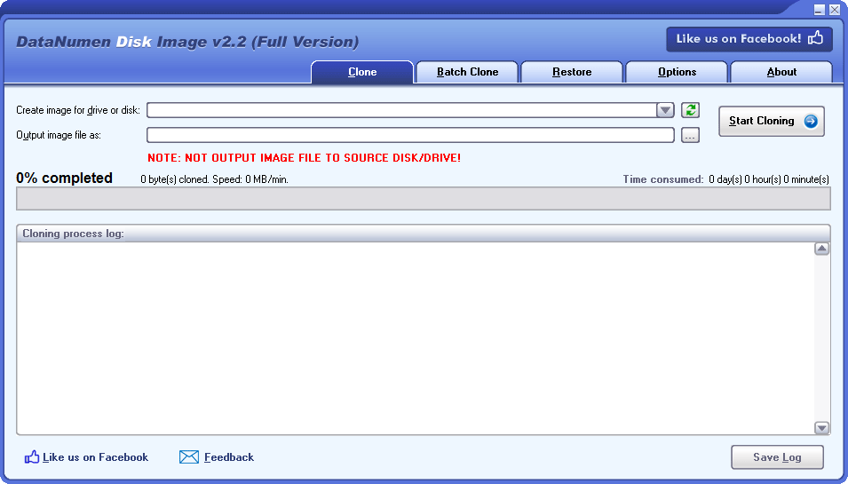
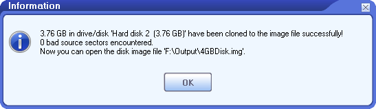

Datanumen disk image：

https://www.datanumen.com/disk-image/免费管理磁盘驱动器镜像创建制作和恢复的软件

## 简介

DataNumen Disk Image是一个强大的工具来克隆和恢复磁盘或驱动器。它可以一个字节一个字节地创建和恢复磁盘映像或驱动器映像。实用的数据备份和恢复，磁盘/驱动器复制和克隆，和取证。

## 特性

支持各种磁盘和驱动器。

支持Windows 95/98/ME/NT/2000/XP/Visa/7/8/8.1/10和Windows Server 2003/2008/2012/2016/2019。

支持恢复图像数据回驱动器。

支持从损坏的媒体克隆数据。

支持用指定的数据替换损坏的扇区。

支持批量克隆多个磁盘和驱动器。

理想用作计算机取证工具和电子发现(或e-discovery, eDiscovery)工具。

## 使用

使用DataNumen Disk Image为驱动器和磁盘创建映像

视频教程：https://youtu.be/idTwljaqOWQ

### 打开DataNumen Disk Image

注意:在使用DataNumen磁盘映像创建驱动器或磁盘映像之前，请关闭任何其他应用程序。

### 选择需要创建镜像的驱动器或磁盘

如果您插入了USB驱动器，但在驱动器或磁盘列表中看不到它。您可以单击刷新按钮，然后重试。

### 接下来，设置输出镜像文件名

您可以直接输入图像文件名，也可以单击“浏览”按钮浏览并选择图像文件。

### 开始镜像

单击“开始克隆”按钮，DataNumen Disk Image将开始克隆指定驱动器或磁盘中的数据，并将其保存到输出镜像文件中。进度条：

### 镜像结束

在克隆过程之后，如果镜像文件创建成功，您将看到这样的消息框:

现在你可以将磁盘映像用于不同的目的，包括:

- 使用它作为原始驱动器或磁盘的备份。
- 将映像恢复到原始驱动器或磁盘，或另一个驱动器或磁盘。
- 从图像中恢复数据。
- 对图像进行法医数据分析。