EnCase Forensic Imager(win)

EnCase V8是美国Guidance Software推出的最新计算机取证软件，全新的操作界面，采用全新的取证分析的工作流，让新版更加简单易用，提供了更加强大灵活的报告功能（可模板定制），此外EnCase V8将原有EnCase v7所有模块(VFS/PDE/EDS/FastBloc SE/CD-DVD)及Neutrino手机取证功能全部集成，成为业界首先将计算机取证、手机取证综合一体的电子数据取证分析软件。

Guidance Software Inc.是全球知名的计算机取证厂商，成立于1997年，在纳斯达克上市(NASDAQ: GUID)，总部设立在美国。其EnCase计算机取证系列产品在美国、欧洲等地的执法部门、司法机关及世界五百强（Fortune 500)广泛使用，在美国联邦法院、地方法院收到认可，已成为业界标准。目前已销售超过40000套EnCase产品，每年培训的取证专业人员超过6000人

当时间很短，您需要获取整个卷或选定的个人文件夹或文件，EnCase®法医Imager是您的选择工具。基于可靠的行业标准EnCase®取证采集技术，EnCase取证成像仪:

## 特性

- 允许获取本地驱动器
- 可以免费下载和使用吗
- 不需要安装
- 一个独立的产品不需要装箱取证许可证吗
- 允许浏览和查看潜在的证据文件，包括文件夹结构和文件元数据
- 使用强AES 256位加密保护Lx01和Ex01文件
- 可以通过USB部署，并用于执行获取一个实时设备

## 支持源数据格式

EnCase Imager支持处理常见的各种数据类型：

- 镜像文件（包括E01、L01、Ex01、Lx01、dd、vmdk、vhd等格式）
- 本地连接的各种磁盘、存储卡
- 内存数据
- 远程数据（需要配合LinEn使用）

其中支持镜像文件，主要用来转换格式，以减小原镜像体积，以及添加证据编号、备注信息等各种元数据。

## 支持镜像文件格式

EnCase Imager可以生成四种格式的镜像，分别是现行的

- EnCase证据文件（.Ex01）
- 现行的EnCase逻辑证据文件（.Lx01）
- 传统的EnCase证据文件（.E01）
- 传统的EnCase逻辑证据文件（L01）

**如果需要处理的对象是整个存储设备或整个分区，应该保存成E01或Ex01格式；如果仅仅对源数据中的部分文件制作镜像，应该选择L01或Lx01格式。**

**
**

Ex01及Lx01格式是EnCase V7引进的新格式，该格式最大的变化是支持数据加密，设置密码后若不知道密码，无法读取镜像中的数据。E01及L01文件虽然也支持添加密码，但是密码仅用来限制镜像文件的打开，数据部分并未真正加密，很多取证工具可以直接忽略E01及L01文件的密码。

**如果工作中要使用其他取证工具进行分析，为了保证兼容性，建议选择E01及L01格式，否则可以使用Ex01及Lx01格式。**

## 使用EnCase Imager镜像

这里找到了一篇非常详尽的文章直接作为参考来自胡壮的个人博客：[https://www.hustrong.com/2018/%E4%BD%BF%E7%94%A8EnCase-Imager%E5%88%B6%E4%BD%9C%E9%95%9C%E5%83%8F.html](https://www.hustrong.com/2018/使用EnCase-Imager制作镜像.html)

### 使用EnCase Imager制作证据文件

接下来以一个实际案例来来介绍EnCase Imager的主要功能——制作磁盘镜像。实验选用了一个朗科32G优盘，序列号为AA00000000007275。

#### 添加设备

在主界面点击“Add Local Device”，弹出添加本地设备的窗口，串口左边有6个可勾选项，点击某个选项，右边会出现对应的说明。如下图所示。

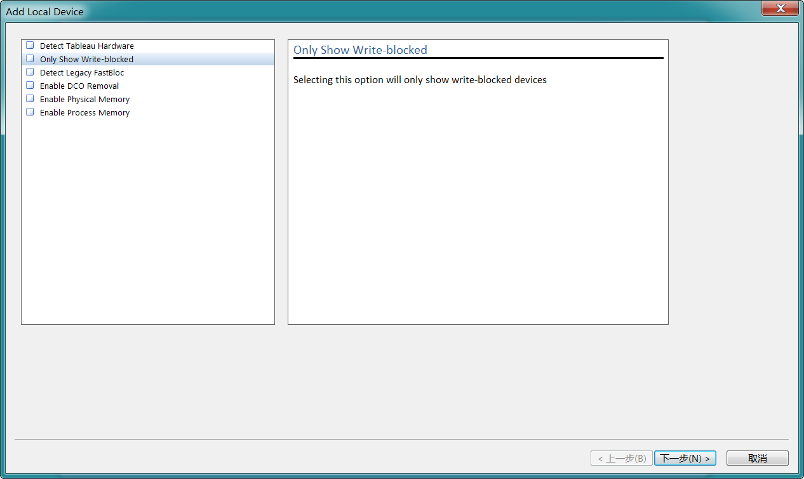

添加本地设备选项

六个勾选项的含义如下：

- **Detect Tableau hardware**
  检测Tableau硬件。如果没有连接Tableau设备，建议不要勾选。
- **Only show Write-blocked**
  只显示只读设备。勾选后后续的设备列表中仅显示只读设备。
- **Detect leagacy FastBloc**
  检测传统的FastBloc设备。如果没有连接FastBloc设备，建议不要勾选。
- **Enable DCO Removal**
  解除DCO限制。勾选后会忽略一些硬盘的DCO设置，可处理隐藏空间。
- **Enable Physical Memory**
  物理内存获取。勾选后后续的设备列表中会出现物理内存，如果需要制作内存镜像则必须勾选。
- **Enable Process Memory**
  进程内存获取。勾选后后续的设备列表中会出现各进程的列表，如果需要制作各进程内存镜像则必须勾选。

我们直接点击“下一步”，并且勾选序号为29、磁盘序号为14的优盘。注意不要勾选成了序号为30的那一项，否则只会加载优盘中的整个分区内容，卷引导记录等信息将不被包括。如下图所示。

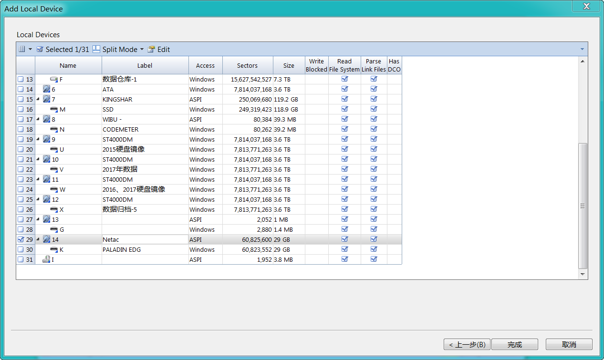

设备列表

点击“完成”后，会自动打开“Evidence”标签页，可以看到磁盘14已经添加到证据列表中。如下图所示。

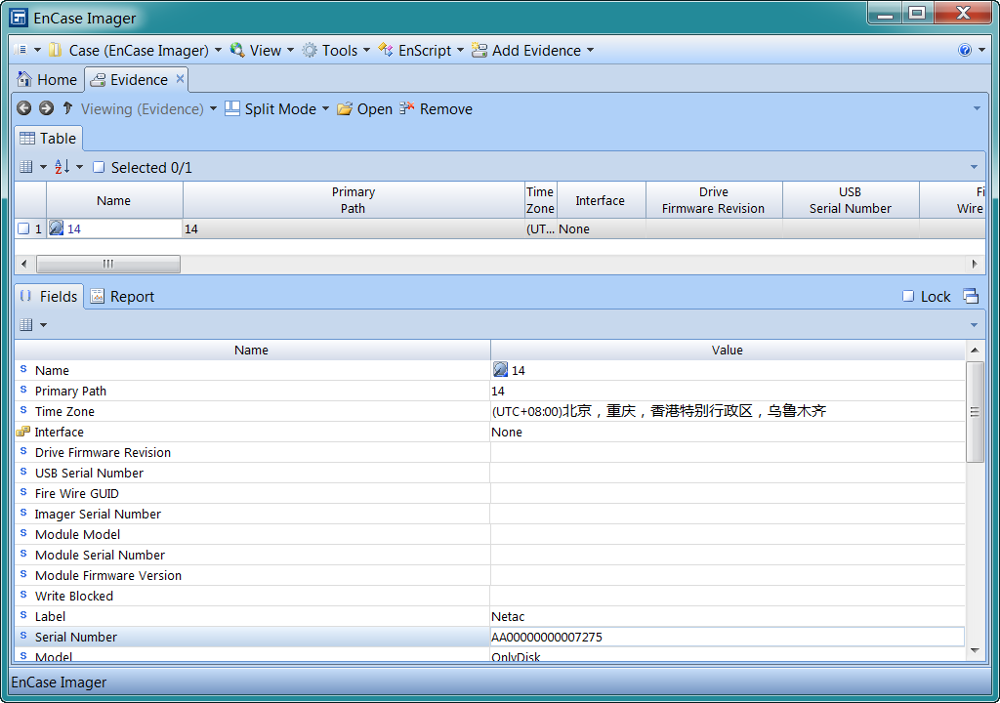

证据列表

#### 开始制作镜像

双击证据列表中的设备名“14”，或选中该项，点击“OPEN”，即可打开并浏览优盘中的数据。

打开该证据后，点击菜单栏的“Acquire”→“Acquire”即可开始制作镜像。需要注意的是，如果要制作整个优盘的镜像，树形面板中选中的必须是整个设备，对于本案例来说，选中的必须是“Entry”或“14”，否则接下来默认制作的仅仅是分区部分的镜像。

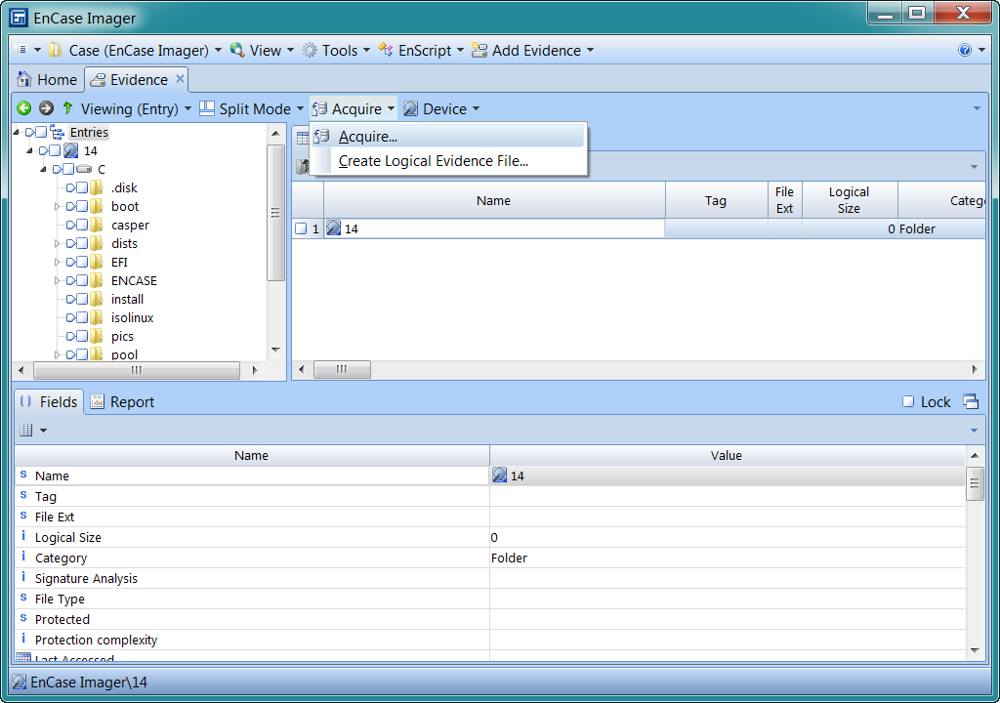

开始制作镜像

#### 设置证据文件参数

接下来需要设置证据文件的参数等信息，弹出的页面中包括“Location”、“Format” 及“Advanced”三部分设置选项。这些设置项是制作证据文件的关键。

**保存位置等设置项**

**
**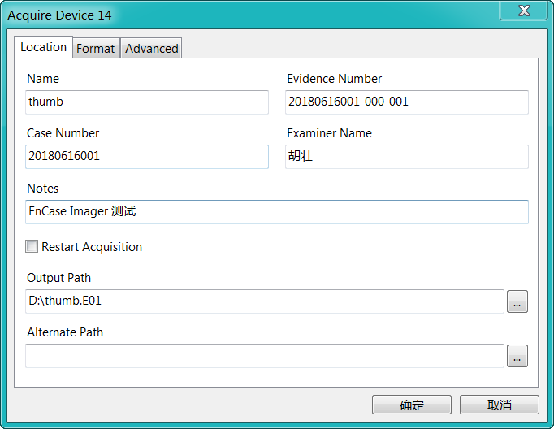

保存位置等设置项

- **Name**
  设备名。默认也是镜像文件名。
- **Case Number**
  案件编号。
- **Evidence Number**
  证据编号。
- **Examiner Name**
  检验人员姓名。这一项是必填项。
- **Note**
  备注信息。
- **Output Path**
  输出路径。证据文件保存路径。
- **Alternate Path**
  备用路径。当镜像保存路径空间不够时，会保存到此位置。

**证据文件格式等设置项**

**
**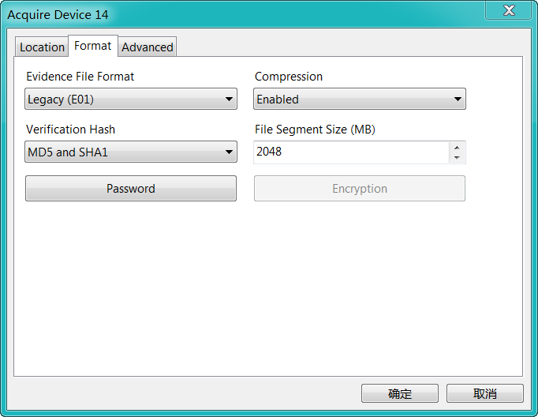

证据文件格式等设置项

- **Evidence File Format**
  证据文件格式。可以选择E01或Ex01格式。
- **Compression**
  压缩。可以选择启用或不启用数据压缩。
- **Verification**
  校验哈希。用于计算数据区域的哈希值并保存在镜像文件的元数据中，可选择不校验或或MD5校验、SHA-1校验、MD5及SHA-1同时校验。
- **File Segment Size(MB)**
  分段大小。设置单个证据文件大小，大于此值则自动生成E02、E03或Ex02、Ex03等文件。此值默认为2048(MB)，最小值为30(MB)。
- **Password**
  密码。此选项仅对E01格式有效，设置后，后续使用EnCase加载镜像文件需要此密码。
- **EnCryption**
  加密。此选项仅针对Ex01格式有效，可以对生成的镜像进行加密。

**高级设置选项**

**
**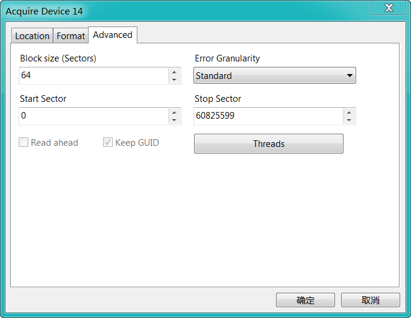

高级设置选项

- **Block size(Sectors)**
  块大小。生成镜像文件时候的分块大小，保持默认即可。
- **Error Granularity**
  错误粒度。当设备遇到坏道、坏块时记录这些区域的精细程度，可以选择标准（standard）或精细（Exhaustive），保持默认即可。
- **Start Sector**
  起始扇区。如果制作的是整个设备的镜像，此值为“0”。
- **Stop Sector**
  结束扇区。
- **Read ahead**
  预读取。本人使用过程中一直不可选，暂时不知道使用场景。
- **keep GUID**
  极路GUID，暂时没有找到相关资料。
- **Threads**
  线程。可以设置读取线程和工作线程，读取线程默认为1，工作线程默认为5，一般保持默认。

本案例中，镜像格式选择了兼容性比较好的E01，名称填写了“thumb”，案件编号填写了“20180616001”，证据编号填写了“20180616001-000-001”，操作人员填写了我的名字“胡壮”，备注信息填写了“EnCase Imager测试”，镜像保存路径选择了D盘根目录。

和FTK Imager等其他工具不同，EnCase Imager不允许操作人员字段留空。虽然其他字段可以留空，但是为了后续工作方便，强烈建议大家在制作镜像时尽量将所有字段按照实际情况填写完整。

一切设置好后，点击“确认”即可开始制作镜像，此时EnCase Imager窗口右下角会显示剩余时间。制作完成后，EnCase Imager会对镜像进行校验并替换掉证据列表中的源设备，后续的浏览操作全部基于镜像文件，校验时EnCase Imager窗口右下角同样会显示剩余时间。如下图所示。

#### 

镜像中

校验中

#### EnCase Imager证据文件中包含的数据

镜像制作完毕后，在EnCase Imager窗口的证据列表中，可以查看镜像中的详细信息。如下图所示。

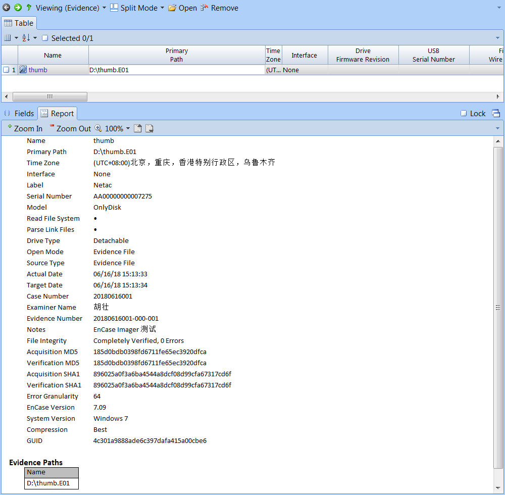

镜像中包含的信息

镜像中记录的一些信息如下：

- **证据名称**：thumb
- **优盘名称**：Netac
- **优盘序列号**：AA00000000007275
- **优盘型号**：OnlyDisk
- **案件编号**：20180616001
- **操作人员**：胡壮
- **证据编号**：20180616001-000-001
- **备注信息**：EnCase Imager 测试
- **源数据MD5**：185d0bdb0398fd6711fe65ec3920dfca
- **源数据SHA-1**：896025a0f3a6ba4544a8dcf08d99cfa67317cd6f
- **制作镜像的EnCase版本**：7.09
- **制作镜像时候操作系统版本**：Windows 7
- **压缩级别**：最好

### 制作逻辑证据文件

#### 选择需要的文件

制作逻辑证据文件，步骤与制作证据文件镜像比较相似，将所在磁盘或分区添加到证据列表，并打开证据进行浏览。和EnCase不同，EnCase Imager不允许直接将单个文件添加作为证据。

勾选需要的文件，点击菜单栏的“Acquire”→“Create Logical Evidence file”或列表面板右击选择“Acquire”→“Create Logical Evidence file”即可开始制作逻辑证据文件。本案例中勾选了“.disk”目录下的5个文件制作逻辑证据文件。如下图所示。

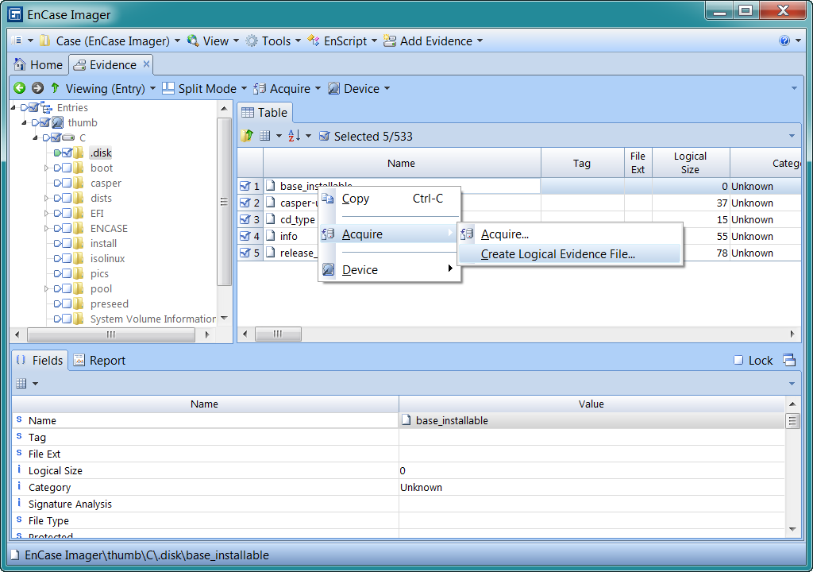

制作逻辑证据文件

#### 设置逻辑证据参数

制作逻辑证据文件，需要设置的参数比制作证据文件稍微少一些，但这些参数比制作证据文件时更难理解。

**保存位置等设置项**

**
**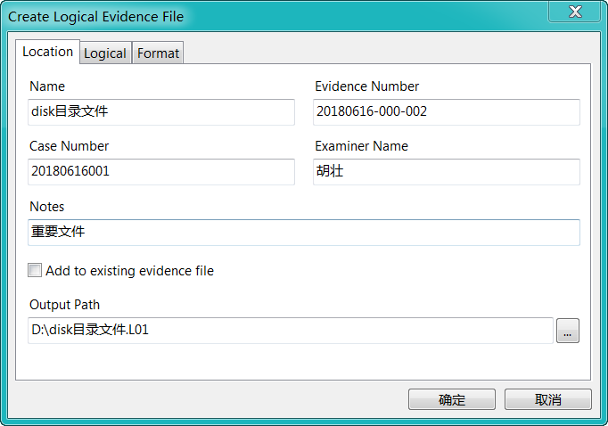

保存位置等设置项

- **Name**
  设备名。默认也是逻辑证据文件文件名。
- **Case Number**
  案件编号。
- **Evidence Number**
  证据编号。
- **Examiner Name**
  检验人员姓名。这是必填项。
- **Note**
  备注信息。
- **Add to existing evidence file**
  追加到现有证据文件。将选中的文件添加都现存的某个逻辑证据文件，勾选此项后上面的信息无法填写。
- **Output Path**
  输出路径。逻辑证据文件保存路径。

**文件信息**

**
**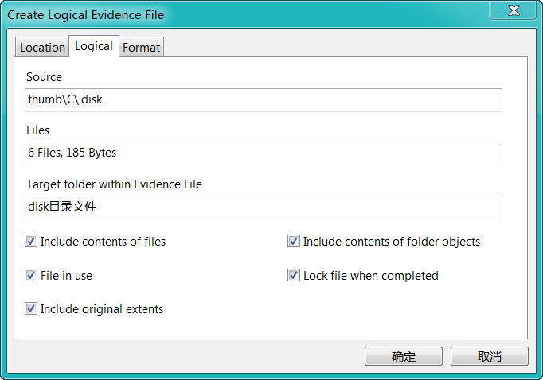

文件信息

- **Source**
  数据源。显示将要制作逻辑证据文件的文件的来源。
- **Files**
  文件。显示将要制作逻辑证据文件的文件的数量及总大小。
- **Target folder within Evidence File**
  证据文件中的目标文件夹。可选项，未填写时，所有文件直接保存在逻辑证据文件中，填写后，文件保存在逻辑证据文件中的对应文件夹中。
- **Include contents of files**
  包括文件内容。如果不勾选，创建的逻辑证据文件中不包括文件内容部分，只包括属性等部分内容，适用于大文件且不关心文件内容本身。
- **Include contents of folder objects**
  包括文件夹内容。
- **File in use**
  被占用的文件。
- **Lock file when completed**
  完成后锁定文件。勾选后生成的逻辑证据文件不可追加新内容。
- **Include original extents**
  包括原始位置信息。勾选后，生成的记录文件中会包含文件的物理位置、物理扇区等信息。

上面这部分选项可以根据实际需要勾选。

**逻辑证据格式**

**
**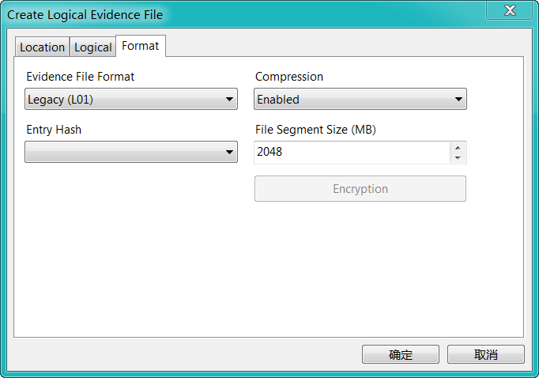

逻辑证据格式

- **Evidence File Format**
  逻辑证据文件格式。可以选择L01或Lx01。
- **Entry Hash**
  文件哈希。可以选择是否计算机勾选文件（或文件夹）的MD5值。
- **Compression**
  压缩。可以选择镜像文件是否压缩。
- **File Segment Size(MB)**
  分段大小。和制作证据文件时候的用法一致。
- **Encryption**
  加密。仅对Lx01格式有效，可以对数据部分进行加密。

本案例中，逻辑证据格式选择了L01，名称填写了“disk目录文件”，案件编号填写了“20180616001”，证据编号填写了“20180616001-000-002”，操作人员填写了我的名字“胡壮”，备注信息填写了“重要文件”，“Target folder within Evidence File”填写了“disk目录文件”，镜像保存路径选择了D盘根目录，文件相关的设置全部勾选。

#### 逻辑证据文件包含的内容

制作好了逻辑证据文件，回到EnCase Imager的证据列表界面，将D盘的“disk目录文件.L01”拖到EnCase Imager窗口然松开鼠标，即可将将制作的逻辑证据文件添加到EnCase Imager。为了方便待会进行对比，才次将测试优盘添加到证据列表（制作完证据文件后最初添加进证据列表中的优盘已经被证据文件thumb.E01替代了）。如下图所示。

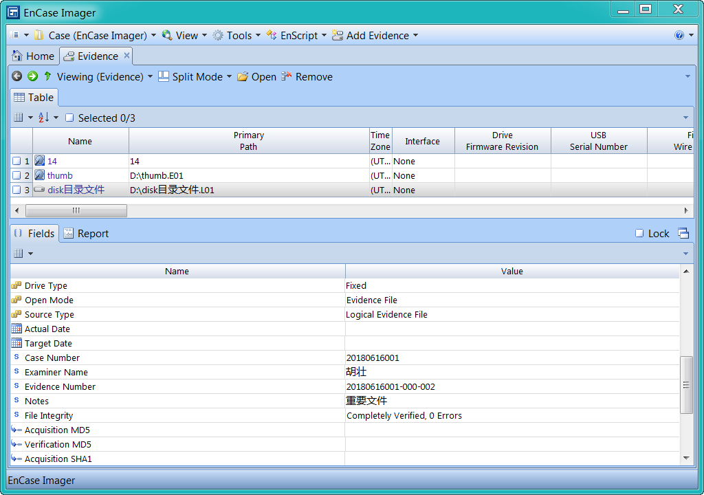

添加逻辑证据文件到EnCase Imager

通过观察，对比上文中加载的证据文件截图，可以发现逻辑证据文件是没有整个数据部分的哈希值的，也无法无法记录诸如原始设备的序列号等信息。

同时勾选证据列表中的证据文件“thumb”、逻辑证据文件“disk目录文件”及磁盘编号为“14”的优盘，然后点击“OPEN”按钮，同时加载三个证据项目进行浏览。如下图所示。

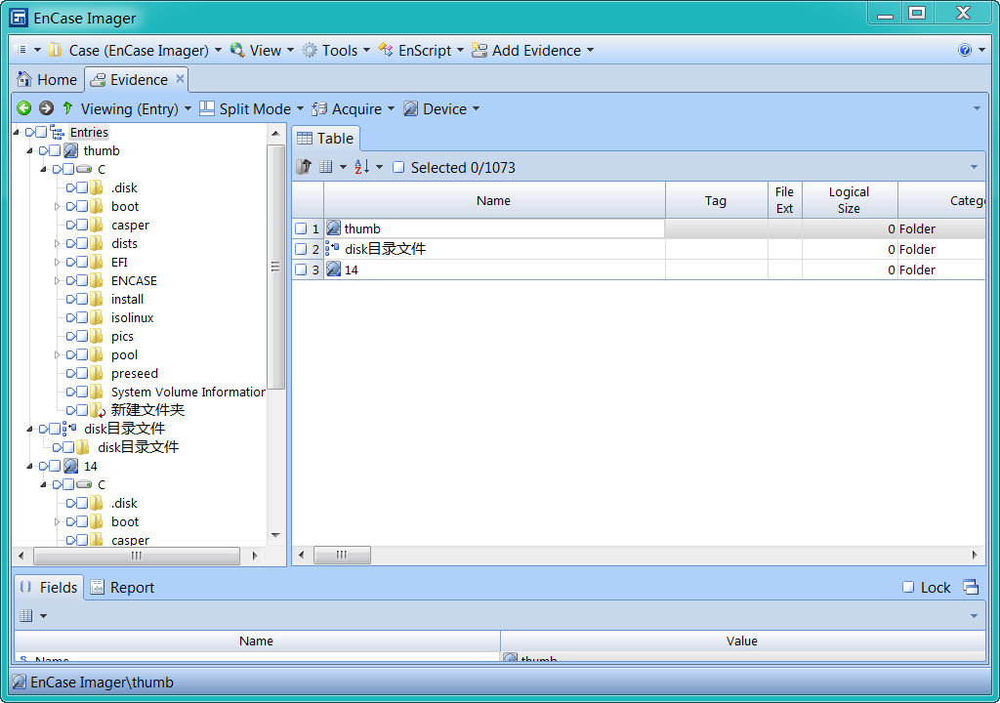

同时打开多个证据

点击证据“thumb”第一分区的“.disk”目录左边的遍历按钮（正方形勾选框左边的五边形），然后按住Ctrl键不放，接下来点击证据“disk目录文件”的“disk目录文件”和证据“14”第一分区“.disk”目录录左边的遍历按钮，同时在右边的列表面板列出三个目录中的文件。如下图所示。

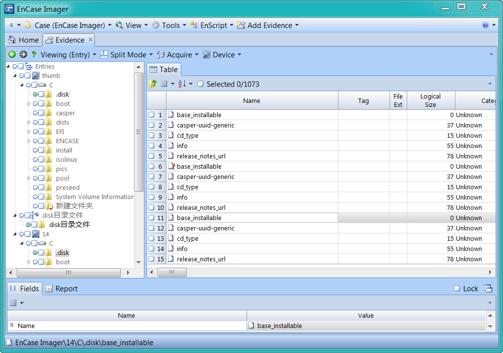

同时浏览多个目录文件

接下来分别比较“thumb\C\.disk\casper-uuid-generic”、“disk目录文件\disk目录文件\casper-uuid-generic”及“14\C\.disk\casper-uuid-generic”三个文件。如下图所示。

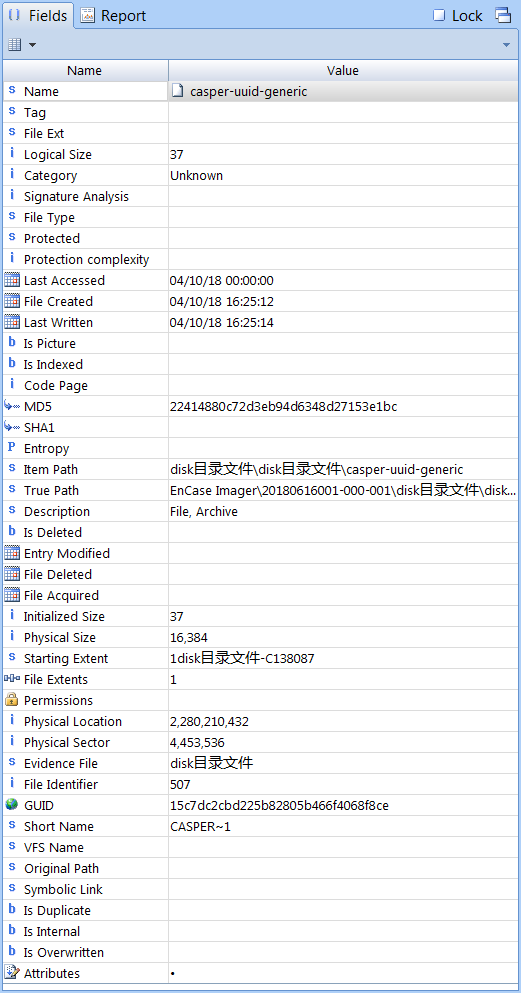

disk目录文件\disk目录文件\casper-uuid-generic

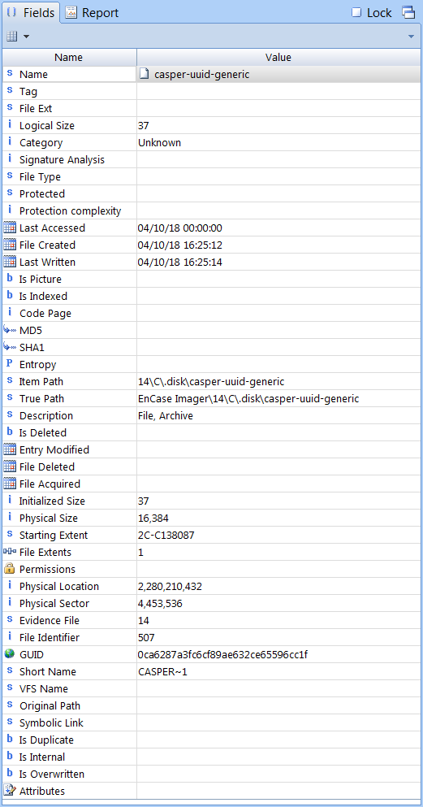

14\C\.disk\casper-uuid-generic

通过对比，证据文件中的“casper-uuid-generic”和另外两个证据中的对应文件相比多了File Acquired时间，而逻辑证据文件中的“casper-uuid-generic”和另外两个证据中的对应文件相比则多了MD5值。另外一个出不明显的地方是，逻辑证据文件中保存的文件无法查看文件在文件系统的路径，而证据文件则不存在此问题。

### 总结

EnCase Imager的功能基本相当于没有插加密狗或导入授权证书文件的EnCase，但是EnCase可以使用条件及过滤器对文件进行筛选。和其他镜像工具不不同，EnCase Imager虽然支持浏览本地磁盘会镜像文件中的文件，且浏览的时候可以直接显示部分删除的文件，但EnCase Imager仅支持查看文件的目录结构及各项属性，不支持对文件进行任何操作，包括文件的预览及导出。

EnCase Imager制作的镜像文件中，保存的元数据比其他镜像工具要多，例如磁盘的型号、序列号，包括FTK Imager在内的大部分镜像工具制作镜像时都不会保存。

本文仅仅是蜻蜓点水般地介绍了EnCase Imager的基本功能，算是抛砖引玉，诸如内存镜像、镜像还原、哈希计算、EnScript等功能，大家可以自己去摸索。

## 参考文章

https://www.yidianzixun.com/article/0JUs8BhG

https://security.opentext.com/document/product-brief/encase-forensic-imager