官网 http://www.forensicimager.com/

基于windows程序，文件格式取证转换工具

Forensic Explorer (FEX) 是用户保存、分析和展示电子证据的软件。该软件的主要用户是执法机构、政府、军队和企业调查机构。

# 主要特点

## 特点

- 获取物理，逻辑，文件夹和文件。
- 重新获取现有的取证图像文件。
- 支持使用GetData Forensics Servlet从远程设备进行获取。
- 使用MD5，SHA1或SHA256采集哈希值获取.E01或DD格式。
- 使用完整的MD5，SHA1或SHA256文件哈希获取L01格式的文件夹和文件。
- 创建后自动验证采集哈希。
- 对整个设备成像或设置开始和结束扇区位置。
- 将图像文件分割成没有段大小限制的自定义段。
- 设置设备扇区大小以获取512、2048或4096扇区大小的选项。
- 强制将Windows兼容文件名与Magnet Forensics产品一起使用的选项。

## 压缩格式

支持E01和L01格式的EnCase None，Fast，Good，Best压缩设置。包括E01和L01格式写入采集信息。

## 日志

记录详细的日志文件，包括设备详细信息以及源和验证哈希信息。

# FEX imager官方使用手册（已翻译）

[📎FEX Imager User Guide.en.pdf](https://www.yuque.com/attachments/yuque/0/2021/pdf/1093585/1615817539019-c9250e8c-868f-456e-a442-ff37881f79cb.pdf) 

Published: 14-Jul-20at 15:37:58

## 运行FEX imager

### 写块

计算机取证的一个公认原则是，在可能的情况下，在调查中获取数据不得被研究者更改。

如果物理介质，如硬盘驱动器，USB驱动器，相机卡等是一个潜在的证据来源，它是当存储媒体连接到取证工作站时，建议使用取证写块设备(写块工具)。写块工具通常是一个物理硬件设备，它位于目标媒体设备和调查人员工作站。它确保调查员不可能在无意中改变被检查设备的内容。它允许对目标设备的只读访问而不损害数据的完整性。市面上有各种各样的法医写阻塞装置。鼓励调查人员了解他们所选择的设备、及其功能、局限性。

### 源窗口

FEX Imager是通过运行FEX Imager启动的。在程序安装文件夹中，或从已安装的桌面图标。

当FEX Imageris运行时，就会看到Sourcewindow:

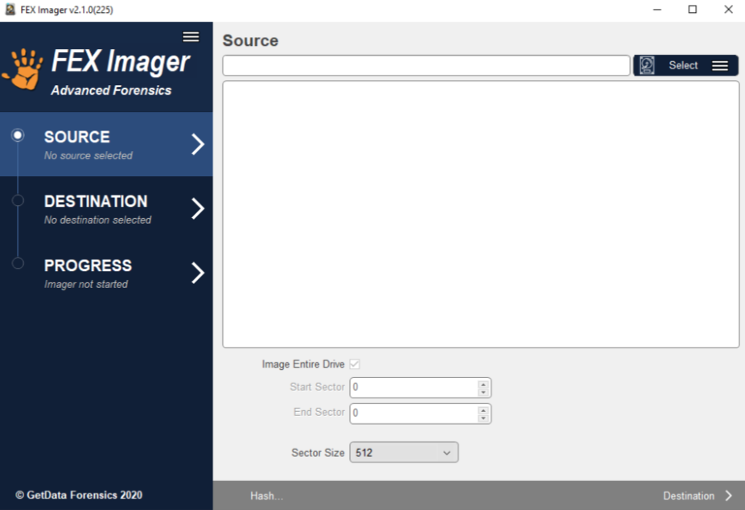

来源指的是要获取的数据。来源可以是:

• 物理驱动器(即物理硬盘)。

• 一个逻辑驱动器(即一个分区，如C:\或D:\)。

• 位于分区上的文件夹或文件。

• 现有的法医图像(即E01或DD图像文件)。

• 使用Forensic Explorer servlet访问的远程驱动器。

要选择源代码，请单击“选择”按钮，并从下拉菜单中选择所需的选项:

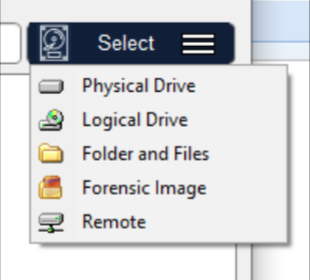

#### 物理和逻辑盘

在大多数情况下，等待符合任何压倒一切的案件特定的法律要求，一个调查员将对一个实物设备进行取证镜像。对物理设备进行镜像可以访问整个媒体的内容，例如分区之间的空间。Carrier,2005年,说:“经验法则是我们认为在最低层数据采集会有证据。为大多数情况下，调查人员获得磁盘的每个扇区”。(48页)

注意:如果物理驱动器没有显示在这个窗口，这通常是因为FEX Imager没有使用管理员身份启动，它没有足够的权限访问物理驱动器。重新启动FEX Imager，右键单击桌面图标，并选择以管理员身份运行从下拉菜单。

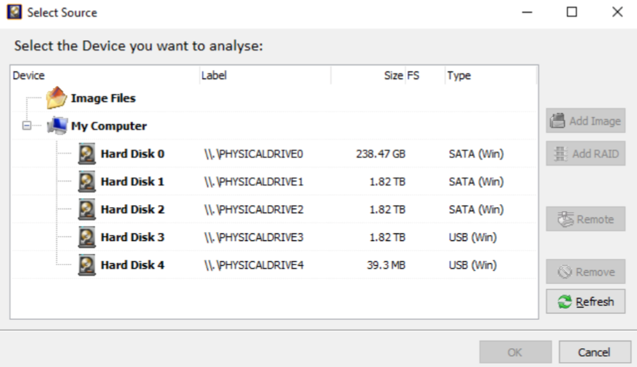

设备选择窗口包含以下信息:

- 标签:列出物理驱动器及其Windows设备号。编号从0开始。逻辑驱动器显示驱动器标签(如果没有标签，则使用"{no label}")。图像文件显示图像的路径。
- Size: Size列包含物理或逻辑设备的大小，或者映像文件的大小。(注意，报告的驱动器大小通常小于驱动器标签上打印的大小。这是因为制造商在操作时以十进制字节数报告大小系统以1024块为每个KB报告大小)。
- FS:磁盘上的文件系统，如FAT、NTFS、HFS、APFS。
- 类型:描述驱动器连接到计算机的方式。图像文件将显示图像类型(如EnCase®或RAW)。

#### 添加远程设备

FEX Imager拥有使用UDP协议检查远程设备跨网络的能力

[https://en.wikipedia.org/wiki/User_Datagram_Protocol](https://en.wikipedia.org/wiki/User_Datagram_Protocol))

要是用远程设备需要，在接收端开启UDP服务，并有必要部署GetData UDP网络服务。它可以在FEX Imagerinstallation文件夹GetDataNetworkServer.exe中找到。部署了GetData UDP网络服务器后，运行命令，显示如下界面:

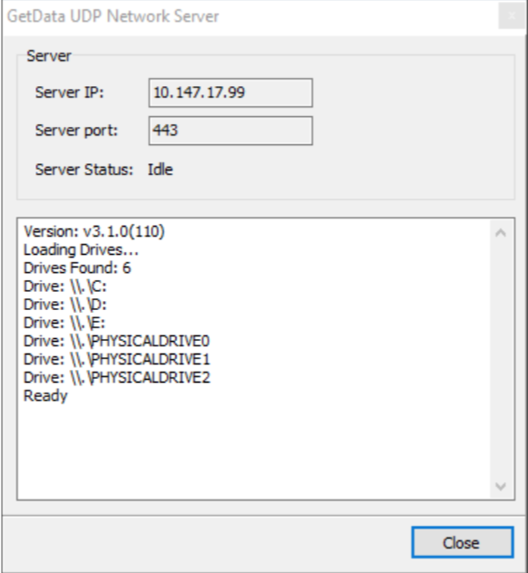

服务器IP:运行网络服务器的计算机的IP地址。重要的是:在排除故障时，使用CMD行“IPCONFIG”重复检查IP地址。命令以确保正确的机器地址。

服务器端口:通信端口。

服务器状态:服务器进入“等待”模式，等待来自取证资源管理器的连接。

请注意，可能需要配置本地和远程计算机上的防火墙设置以启用远程访问GetData UDP网络服务器。

**网络服务器命令行选项**

GetData UDP网络服务器可以从CMD行部署在远程计算机上

以下开关:

• /Q       安静模式(没有GUI);

• /P: XXXX  指定端口号。

重要提示:在静默模式下部署时:

- 在Windows任务中，GetData UDP网络服务器将显示为一个正在运行的进程管理。进程的名称是可执行文件的名称(即重命名为“GetData UDP”)

网络服务器”根据需要)。

- GetData UDP网络服务器只能在Windows环境下通过结束进程来终止任务管理器。

**将GETDATA UDP网络服务器部署为WINDOWS服务**

GetDataNetworkServer可以作为Windows服务部署。

要安装为服务，使用以下命令行开关:

• GetDataNetworkServer /install /silent

要卸载该服务，请使用以下开关:

• GetDataNetworkServer /uninstall /silent

如果需要非默认端口(即443以外的端口)，则必须将以下键值添加到注册表指定端口号:

HKEY_LOCAL_MACHINE\SYSTEM\CurrentControlSet\Services\GDStreamService\UDPPort(DWORD)=443

**连接GETDATA UDP网络服务器**

要连接到GetData UDP网络服务器，运行Forensic Imager并在Sourcewindow中单击

select>Remote:

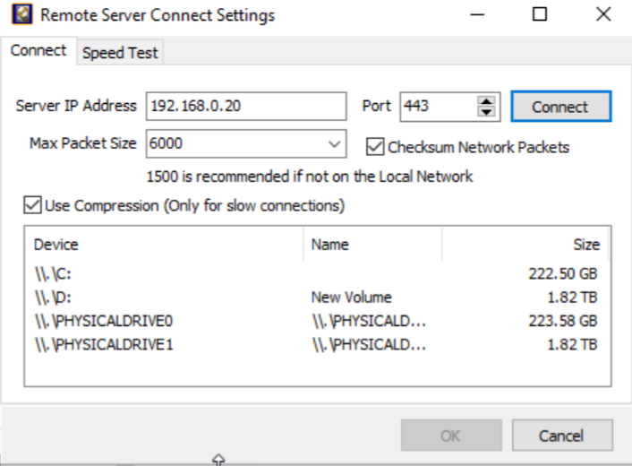

**“服务器IP地址”:**  在“服务器IP地址”中输入远程计算机的IP地址GetData UDP网络服务器字段。

**最大数据包大小:**  设置通过UDP传递的最大数据包大小。在当地可靠网络设置可以更高，这可以使连接更多非常高效。如果不是本地网络，则最大数据包大小为1500推荐(如果可能，测试以确定最佳设置)。

**校验和网络包:**  checksum字段用于UDP报头和数据的错误检查。虽然这会增加开销，但建议应用此设置。

**端口:**  端口号与GetData UDP网络使用的端口号保持一致服务器(默认为443端口)。

**连接:**  connect按钮激活到IP地址和端口的连接并列出远程上可用的物理和逻辑设备电脑。

**速度测试:**  “速度测试”页签测试指定设备的网络连接速度。在Connect选项卡中，选择所需的设备，然后更改为速度测试选项卡。单击Start启动测试。

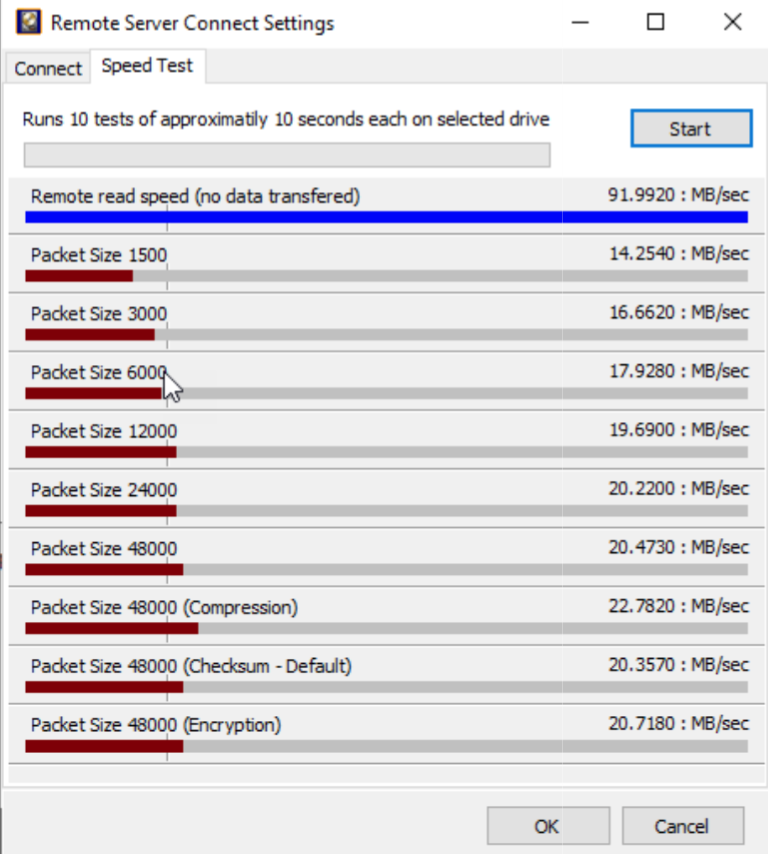

在Connect选项卡中选择所需的设备后，单击ok按钮连接到远程设备设备。选择的设备现在应该出现在设备选择的网络部分窗口，如下图7所示:

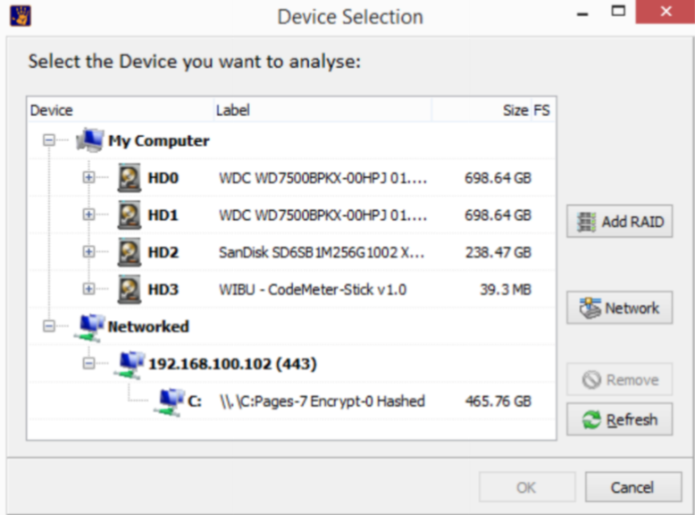

选择ok即可。

#### 选择扇区

在特定情况下，调查人员可能需要从设备获取一系列扇区。在这个在源文件底部的扇区范围字段中输入的扇区名称、扇区起始和结束信息选择窗口。

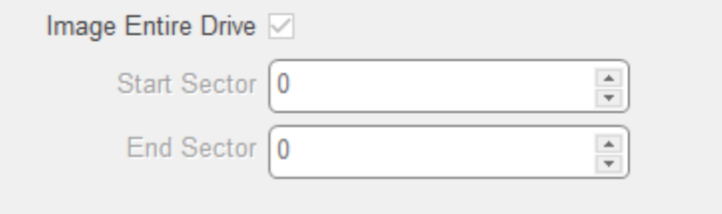

当源设备被选中时，源选择窗口将填充设备信息:

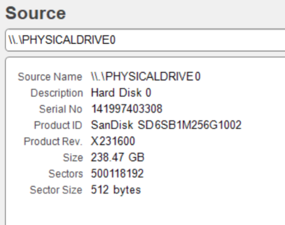

#### 获取hash

一旦一个源被选中，在源窗口的底部有两个选项:

##### hash

当用户只想为设备计算哈希值时(例如，验证现有电子取证镜像文件的哈希值)。

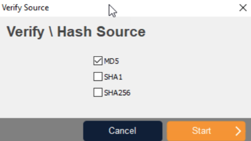

##### 目的地

选择Destination按钮以获取一个电子取证镜像文件。下面将对此进行更详细的描述。

### 目标窗口

如图所示，图像目标屏幕是图像文件的参数所在设置，包括类型、压缩、名称、位置等。

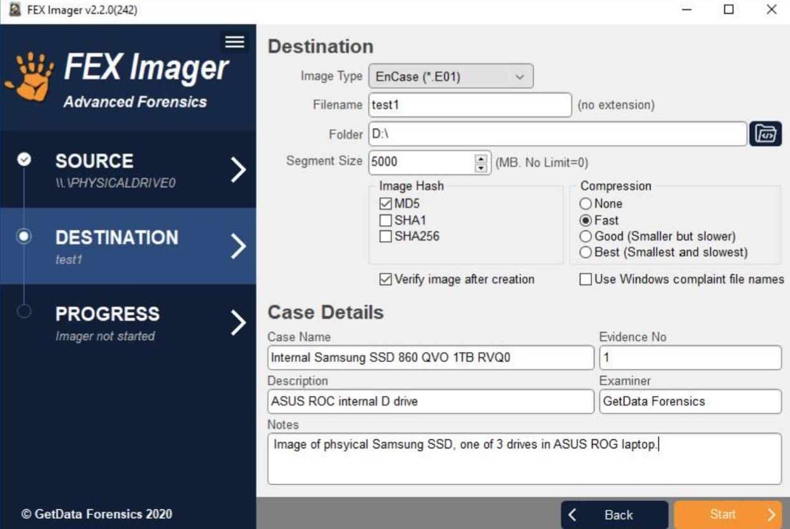

#### 镜像类型

调查人员可以选择在下列任何一个电子取证文件中创建取证镜像格式:

##### DD/RAW

DD/RAW格式源自UNIX命令行环境。创建一个DD/RAW映像从输入源读取数据块并直接写入图像文件。简单的DD图像可以将图像数据与源数据进行比较，但格式缺乏一些在更现代的格式中发现的功能，包括错误纠正和压缩。

##### ENCASE®.E01

EnCase®E01证据文件格式由Guidance Software Inc.创建。它被广泛接受法医社区作为镜像文件的标准。更多资料请浏览www.guidancesoftware.com。EnCase®E01的结构。E01格式允许大小写和验证存储在镜像文件中的信息(CRC和MD5)。EnCase®文件格式的结构

如下所示:

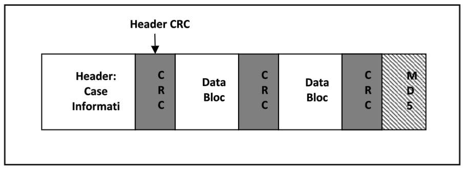

> CRC [循环冗余校验](https://baike.baidu.com/item/循环冗余校验/3219009)（Cyclic Redundancy Check， CRC）是一种根据网络数据包或计算机文件等数据产生简短固定位数校验码的一种信道编码技术，主要用来检测或校验数据传输或者保存后可能出现的错误。

#### 文件名和文件夹

filename和Folderfields为映像文件设置目标路径和文件名。输出文件“名称”是将被写入调查员法医工作站的电子取证镜像文件的名称。单击文件夹图标以浏览目标文件夹。

#### 分割大小

Segment Size设置创建的取证镜像文件的段大小。设置图像段大小为主要用于法医图像文件以后将存储在固定长度的媒体，如CD或DVD。E01image格式，FEX Imager使用EnCase®v6标准，不限于2GB段的大小。然而，如果调查人员计划使用更大的文件段，他们应该考虑处理图像文件的系统的限制(RAM等)。

#### 镜像hash

为镜像数据选择并计算一个或多个哈希值:MD5、SHA1、SHA256。哈希值为一种用于识别、验证和验证文件数据的数学计算。一个在获取设备期间，FEX imager计算的哈希值(“获取哈希”)使能调查员，通过重新计算哈希以后(“验证哈希”)，以确认真实性图像文件，即文件没有改变。对所获取图像的任何改变都会导致对的散列值。

在采集过程中计算哈希值需要CPU时间，并且会增加计算持续时间。然而，根据公认的最佳法医实践，我们建议，在获取具有潜在证据价值的数据时，总是包含一个获取哈希。这也是建议调查人员在调查过程中定期重新计算验证散列以确认镜像的真实性。FEXImager有三个独立的哈希计算选项:MD5、SHA1和SHA256。研究者应该选择最适合的哈希选项:

##### MD5（消息摘要算法5 )

MD5是RSA (Ron Rivest, Adi Shamir和Len)于1991年设计的一种广泛使用的密码算法Alderman)。它是一个128位的散列值，唯一标识一个文件或数据流。它已经被自二十世纪九十年代后期开始广泛应用于电脑取证。1996年，密码分析研究发现了MD5算法的一个弱点。2008年在美国计算机应急准备小组(USCERT)发布了漏洞说明VU#836068，声明MD5散列:“……应被认为密码已被破解，不适合进一步使用”。

##### SHA1

1995年，联邦信息处理标准发布了SHA1哈希标准，在MD5的支持下被一些取证工具所采用。然而，在2005年2月，有人宣布在SHA1中发现了一个理论缺陷，这表明它在该领域的应用可能很短暂。(3) (4)

##### sha-256

从2011年开始，SHA-256有望成为计算机取证领域新的哈希验证标准。sha-2是一组加密哈希函数(SHA-224、SHA-256、SHA-384和SHA-512)，由美国国家安全局(NSA)，并由美国国家标准协会和美国国家安全局发布技术。

有关散列以及如何将散列值的强度应用于取证的详细信息研究者建议阅读的内容包括:“The Hash Algorithm Dilemma–Hash Value Collisions哈希算法困境-哈希值冲突”，刘易斯，2009年,法医杂志。(5)

#### 压缩

EnCase®。E01file格式支持在采集过程中压缩镜像文件。在采集过程中压缩法医镜像文件需要较长的时间，但文件大小调查员工作站的法医镜像会变小。达到的压缩量将取决于被成像的数据。例如，使用已经压缩的数据，如音乐或视频，很少额外的压缩将实现。DD/RAW镜像格式不支持压缩。

#### 创建镜像后的确认

在获取设备的过程中，获取的哈希值(MD5和/或SHA1和/或SHA256)当从源磁盘读取数据时，计算调查员选择)。一旦收购成功完成后，获取哈希将以格式在事件日志中报告:

Acquisition[hash type] Hash : 94ED73DA0856F2BAD16C1D6CC320DBFA（采集[哈希类型]哈希）

EnCase®。MD5获取哈希嵌入在镜像文件的头中。

当选择“创建后验证镜像”框时，完成镜像文件FEX的写入Imager从取证工作站读取文件并重新计算散列。验证散列在事件日志中报告的格式:

Verification[hash type] Hash:94 ed73da0856f2bad16c1d6cc320dbfa （验证(哈希类型)散列）

验证过程完成后，将在源哈希和验证哈希之间进行比较。一个精确的源磁盘镜像到镜像文件的结果应该“匹配”:

[hash type]hashes:Match (哈希类型)散列:匹配

如果获取哈希和验证哈希不匹配，则表明出现了问题，而且这个设备应该被重新制作镜像。

#### 细节

EnCase®。E01文件，详细信息字段的值被写入镜像文件头。DD不把这些信息作为映像的一部分来存储;但是，它仍然必须被输入，以便信息可以包含在FEX Imager事件日志中。

### 进程窗口

进度屏幕显示源信息(正在获取的驱动器)和目标信息(正在写入法医图像文件的位置)。进度信息，包括运行时间，显示剩余时间和传输速度。进度窗口如下图12所示:

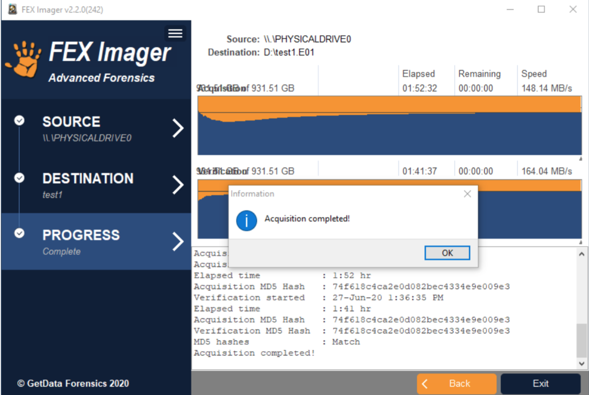

进度窗口的下半部分提供了关于获取过程的摘要信息，包括散列信息。

如果选择了E01镜像格式，则采集散列存储在取证镜像中。如果验证镜像创建后，在FEX Imager目标窗口中选择了选项，进度窗口将包括:

**采集[哈希类型]哈希:**采集数据的哈希值，存储在E01中。

**验证[哈希类型]哈希:**法医镜像文件中的数据的哈希值。

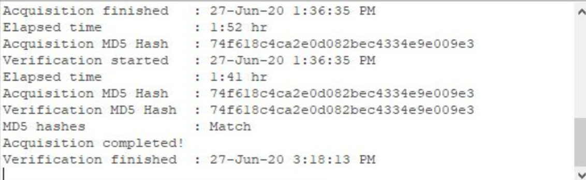

注意，如果选择了DD镜像格式，那么散列值就不会存储在DD镜像文件中。

#### 日志文件

每次获取的事件日志都会自动保存到与镜像文件/s相同的文件夹中。

#### 错误的扇区和错误报告

由于整个驱动器的问题或问题，在映像处理过程中可能会出现磁盘错误孤立于特定扇区。如果一个坏扇区被识别，FEXImager会为不能被识别的数据写0读取并记录事件日志中发现的坏扇区的位置。

# FEX相关课程

Level One 

**Forensic Explorer Overview and Introduction** 

• Installation and wworkstation configuration 

• Case management 

• Dongle activation and maintenance 

• Advanced WiBu key and network configuration 

**Forensic Acquisition** 

• Write blocking v Write protection 

• Network examinations and analysis 

• GetData Forensic Imager 

**Creating a Digital Case** 

• Adding and removing evidence within FEX • Assessment and preview of evidence 

• Creating, converting previews and saving a case 

• Creating and managing investigators profiles 

• Understanding the evidence processor 

Level Two 

**Forensic Explorer Interface** 

• Module data interpretation 

• Customizing layouts 

• Process logging and prioritization 

• Date and time verification 

• Digital forensics date and time analysis 

• FAT, NTFS, HFS, HFS+, APFS, CDFS file systems 

• Handling, Bitlocker and File vault encrypted containers 

• Date and time information in the Windows registry 

**Case Investigation and Analysis** 

• Module structure and overviews 

• Folder tree structure 

• Categories filters 

• Data Views 

▪ File list, Gallery, Disk, Category Graph 

• File Views 

▪ Hex and text 

▪ Bookmark 

▪ Byte plot and character distribution 

▪ Display– (Native interpretation) ▪ File system record 

▪ Metadata 

▪ File extent 

▪ Property viewer (Email Module) 

**Data M****anagement** 

• Filters 

• Data and file view internal searching **Keyword and Index Searching** 

• Keyword Search – Management 

▪ Text, Hex, Regular Expressions (PCRE) 

• dtSearch analysis and searching techniques

**Bookmarking – Investigator’s Notes and Observations** 

• Relationship between bookmarks and reports. 

• Manual and automated bookmarking 

• Modification of bookmarks 

Level Three 

**Examining Shadow Copy** 

• Shadow copy identification 

• Shadow copy file carving 

• Shadow copy forensic analysis 

• Recreating historic restore points 

**Live Boot / Mount Image Pro / Virtual Machine** 

• Live Boot virtualization of subject evidence 

• Password bypass / recovery of user accounts 

• Deployable Live Boot for VirtualBox 

**Hash Analysis** 

• Hash values and algorithms 

• Creating and using hash sets 

**Signature Analysis and File Carving** 

• File signature analysis 

• Signature/File header and footer identification 

• Recovering Deleted Partitions 

**Email Module** 

• Microsoft Outlook .PST email analysis 

• Identifying and analysis of email attachments 

**Registry Module** 

• Automated registry analysis 

• Deleted registry keys 

**Introduction to FEX Scripting Functionality** 

• Script functionality behind the FEX Interface 

• Using automated scripts 

Level Four 

Report Writing and Management 

• Creating manual reports 

• Creating and modifying templates 

• Saving and exporting templates 

• Exporting reports FEX Viewer 

• Review of case using dongle free viewer Final Hands-on Practical 

• Practical assessment covering all aspects of the previous four day’s activities 

• Award ‘Forensic Explorer Certified Examiner (FEXCE)” certification upon successful completion

# 参考文章

https://www.champlain.edu/Documents/LCDI/Tool_Comparison_(1).pdf

[http://download.getdata.com/support/documents/user-guides/FEX%20Imager%20User%20Guide.en.pdf](http://download.getdata.com/support/documents/user-guides/FEX Imager User Guide.en.pdf)