官网：https://guymager.sourceforge.io/

下载：https://sourceforge.net/projects/

版本更新订阅：https://sourceforge.net/p/activity/feed


## 简介

Guymager[ˈgɪmɪdʒər]是一款免费的媒体采集取证成像仪。它的主要特点是:

•简单的用户界面在不同的语言

•在Linux下运行

•非常快，由于多线程，流水线设计和多线程数据压缩

•充分利用多处理器机器

•生成平面(dd)， EWF (E01)和AFF映像，支持磁盘克隆

•免费，完全开源

最新版本是0.8.12。


## 界面

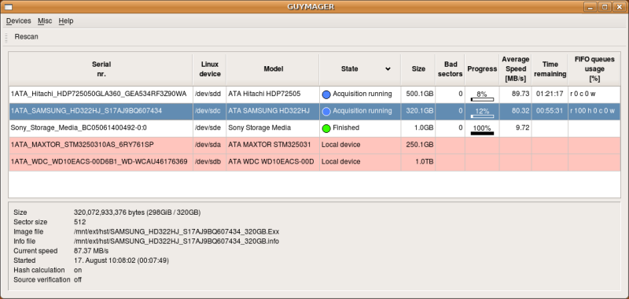解释:

• 连接的存储设备列表在上方。新设备可以在任何时候连接-按下重新扫描按钮显示他们。

• 浅红色标识的设备为本地硬盘。它们不能被获取，从而防止获取错误的磁盘。本地硬盘可以通过输入配置文件中的序列号来识别。

• 下方显示了蓝色光标当前所选择的收购的更详细信息。[

[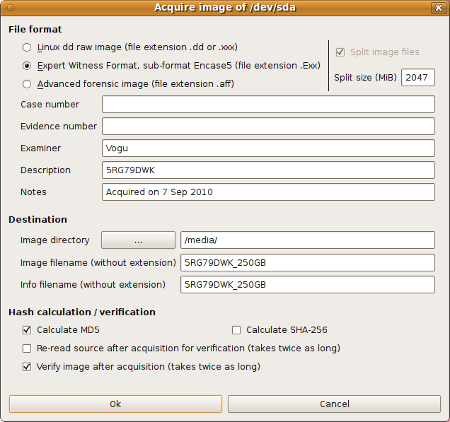](https://guymager.sourceforge.io/acquisitiondialog_big.png)

上面的截图显示了默认的获取对话框。存在另一个用于克隆磁盘的对话框。两者都可以很容易地适应您的需求。您可以添加或删除字段。您可以静态(文本)和动态(当前日期，磁盘大小，序列号，…)设置它们的默认值。看一下 /etc/guymager.cfg**.**

## 安装

### Debian和Ubuntu


Guymager包含在几个发行版的标准存储库中，例如Debian(紧凑版或更高版本)和Ubuntu(10.04或更高版本)。在Ubuntu中，需要保持更新。

安装可以通过一个图形工具来完成，比如Ubuntu软件中心或者Synaptic: 

sudo apt-get update

sudo apt-get install guymager


### 使用pinguin APT服务器

**Daniel's pinguin**服务器总是包含Guymager的最新版本。它是安装Guymager并保持其最新的推荐存储库。在您的Ubuntu、Debian和基于Debian的Linux系统中使用这个存储库,遵循以下步骤:

1. 通过以下命令添加pininguin服务器及其公钥:

`sudo wget -nH -rP /etc/apt/sources.list.d/ `[`http://deb.pinguin.lu/pinguin.lu.list`](http://deb.pinguin.lu/pinguin.lu.list)

```
wget -q `[`http://deb.pinguin.lu/debsign_public.key`](http://deb.pinguin.lu/debsign_public.key)` -O- | sudo apt-key add -
```

目前，支持i386和amd64系统，powerpc包可根据请求提供。

1. 执行如下命令:

```
 sudo apt-get update
 sudo apt-get install guymager-beta
```

1. 以下方式启动程序

```
guymager
```


尽管这个包被命名为guymager-beta，但它经过了密集的测试，是绝对稳定的软件。只是它还没有找到分销渠道。


### RPM packages

RPM包可以在pkgs.org上获得。非常感谢拉里罗杰斯的包装!

### 手动下载和安装Debian软件包

如果你不喜欢永久地添加pinguin库，你可以手动下载并安装这些包:

1. 浏览器访问deb.pinguin.lu，并选择与您的处理器架构(i386或amd64)相对应的目录。备注:amd64指的是架构，而不是处理器。因此，amd64适用于AMD和英特尔的64位处理器。
2. 下载guymager测试版包。


从命令行安装:

1. 打开shell并获得根权限
2. 切换到包含下载文件的目录。
3. 使用如下命令进行安装:

  sudo apt-get update

  sudo dpkg -i guymager-beta_xxx_amd64.deb

  sudo apt-get -f install

xxx表示版本号。如果你有一个32位系统，用i386替换amd64。

1. 第二个命令很可能返回一些丢失包的错误消息。它们通过执行第三个命令来安装。
2. 有2个推荐的包，你应该安装:

sudo apt-get install smartmontools hdparm

1. 用以下方式启动程序

guymager


## 配置和日志

Guymager使用两个配置文件:

- /etc/guymager.cfg

主配置文件。你不要更改它，因为你的更改会在安装新版本的guymager时导致丢失配置。

- /etc/local.cfg

将此文件用于本地更改。这里调整的参数优先于guymager.cfg中的参数。guymager.cfg在其末尾包含local.cfg。如果一个参数被多次设置，guymager会保留最后的设置。

如果您想在不编辑local.cfg的情况下快速尝试一个参数，你可以尝试一下内容。例如:

```
guymager EwfCompression =BEST
```


命令行位于两个配置文件的前面。有2个参数只能在命令行中设置:

```
cfg        要使用的配置文件。默认为/etc/guymager.cfg。
log        要使用的日志文件。默认为/var/log/guymager.log。
```

例子:

```
guymager cfg="/tests/g_special.cfg" log="/mylogs/guymager.log”
```


配置参数很好地记录在/etc/guymager.cfg中。记住不要做任何改变。


如果有任何问题，请查看日志文件/var/log/guymager.log。当报告问题时，请附加日志文件。

## 手动编译源码

对于Debian和Ubuntu用户: 需要安装**build-essential, qtbase5-dev and libparted-dev**包。


详情见 https://guymager.sourceforge.io/


## Live CD使用Guymager

在很多现有的CD或VM系统版本中都已收纳了guymager。

- [CAINE](https://www.caine-live.net/)
- [TSURUGI](https://tsurugi-linux.org/)
- [BACKBOX](https://www.backbox.org/)
- [KALI](https://www.kali.org/)
- [GRML](https://grml.org/)
- [ForLEx](http://www.forlex.it/)
- [SANS SIFT (Vmware image)](https://computer-forensics.sans.org/community/downloads)
- [BitCurator (Live CD and VirtualBox image)](http://www.bitcurator.net/)


## 使用Guymager

由于guymager使用方法官方并未给出详细的使用说明，目前根据已有的一些网友的使用经验归纳总结。

https://confluence.educopia.org/display/BC/Creating+a+Disk+Image+Using+Guymager

https://www.secpulse.com/archives/138600.html


### 在kali下创建磁盘镜像

#### 启动到Live模式下

1、首先启动进入取证模式；

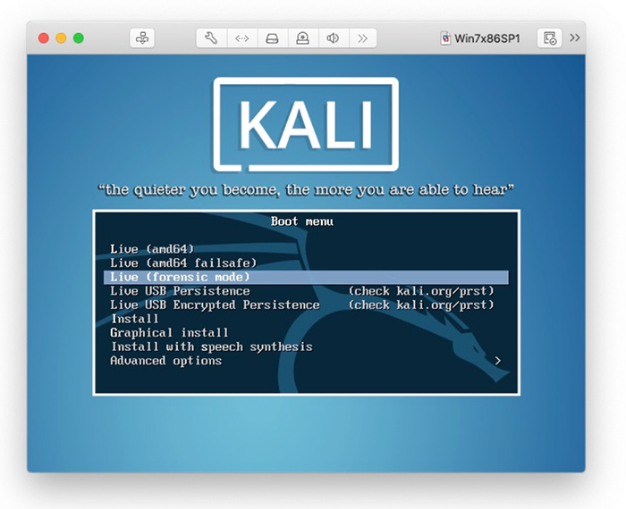

2、接入移动硬盘，fdisk -l 确定移动硬盘的设备名为/dev/sdb1；

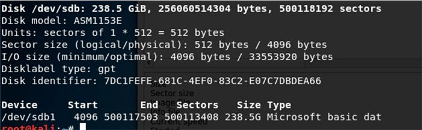

3、挂载移动硬盘。

cd /mnt 

mkdir udisk 

mount /dev/sdb1 /mnt/udisk 

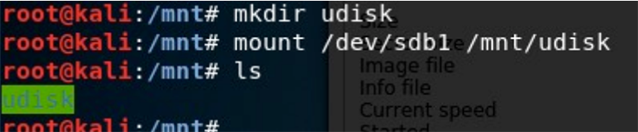

#### 使用Guymager

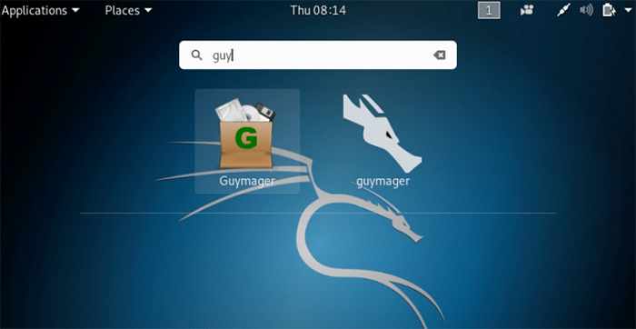

1、在目标硬盘上右键 Acquire image， 

设置相关信息、保存路径、文件名，开始获取磁盘镜像。 

下面的hash校验我勾掉了，是为了让速度更快一些。 

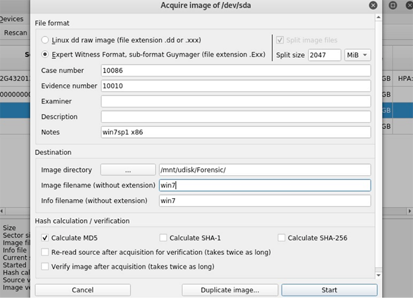

2、Start开始后，需要一段时间，由磁盘容量、速度与电脑性能决定。 

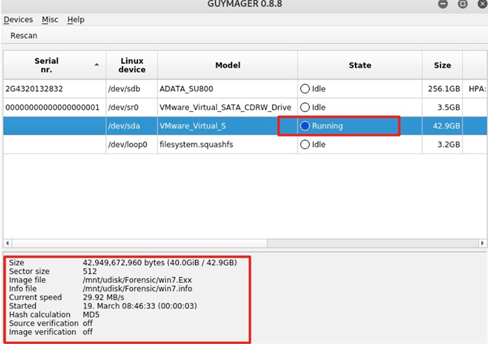

3、镜像制作完成。 

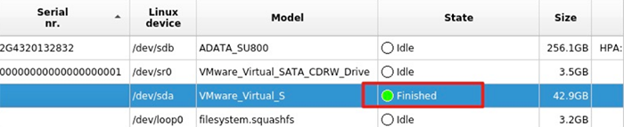

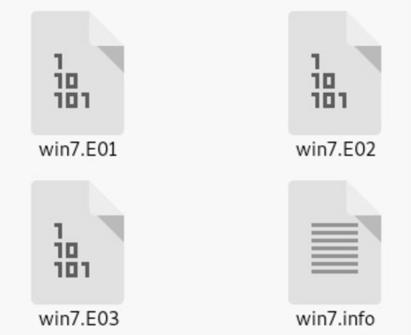

全磁盘镜像文件大小共4.7GB。

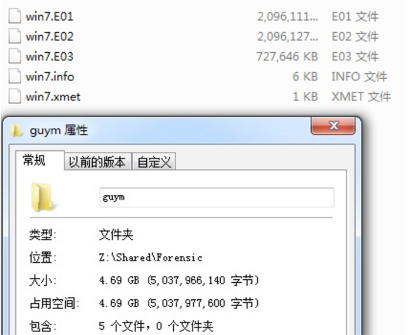

磁盘实际使用大小是这样的。

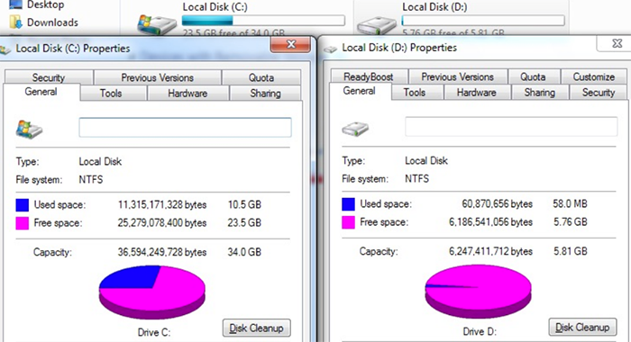


### BitCurator下使用Guymager

官方wiki：https://github.com/BitCurator/bitcurator-access/wiki

BitCurator Access项目开发了工具，以帮助图书馆，档案馆和博物馆提供基于Web的本地访问磁盘映像上保存的数字资料的途径。BitCurator访问工具简化了对原始和经过法医打包的磁盘映像的访问，使用户可以将这些对象合并到访问环境中，同时保留原始顺序和相关的环境上下文。这些工具使用开源数字取证软件库，可以对文件和文件系统的出处，文件的质量和可访问性，文件和文件系统中的元数据以及残留或隐藏的数据进行详细分析。

BitCurator Access专注于与访问出生数字馆藏相关的四个感兴趣的领域：

- 基于Web的对原始和经过司法鉴定打包的磁盘映像的访问
- 删除磁盘映像中的文件项，元数据和隐藏数据
- 用于旧磁盘映像的操作系统和可执行虚拟化
- 在收集环境中转换和使用数字取证元数据


> 其中就包含了部分关于Guymager工具的使用相关操作说明。


原文：https://confluence.educopia.org/display/BC/Creating+a+Disk+Image+Using+Guymager

BitCurator包含了一个开源的图形应用程序，用于创建磁盘映像——Guymager。Guymager支持原始dd图像，EO1和AFF图像格式。后两种图像格式通常在数字取证社区中使用，它们能够将关于原始媒体的元数据合并到磁盘映像本身中。


#### 按步指导

1. 通过打开Nautilus(屏幕左上角的“Home”文件夹)，并在白色背景上的任何地方单击右键，创建一个用于存储磁盘图像的目录。从下拉菜单中选择“创建新文件夹”。按您认为合适的方式命名文件夹;在本例中，我们将使用文件夹名称“diskimages”。
2. 请确保安全挂载设备，启用只读强制，和/或使用写阻塞程序，以防止无意中将数据写回磁盘。默认情况下，bitCurator环境被设置为强制只读访问。

将您想要映像的设备连接到您的计算机(USB闪存驱动器、CD-ROM、硬盘驱动器或软盘驱动器)。


注意:Guymager不需要挂载设备，bitCurator不会自动挂载设备(在Unity栏左边出现的图标表示设备已挂载，而不是挂载)。如果需要在创建磁盘映像之前检查磁盘内容，可以安全地挂载设备。只需单击设备图标就可以安全地将可读文件系统(以只读模式)挂载到该设备上。

1. 右键单击桌面“成像工具”文件夹中的图标，打开Guymager。在上下文菜单中，选择“打开”。

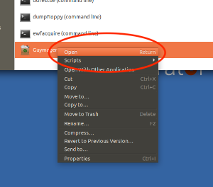

1. Guymager将要求以root权限运行。当提示时，输入与bit策库用户帐户相关的密码(通常为'bcadmin')。

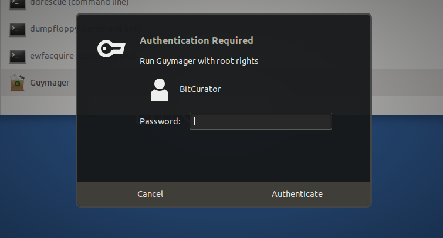

1. 启动Guymager时，它将显示系统上所有挂载的磁盘的列表。再次识别你想要图像的磁盘，右键单击它的列表，并选择“获取图像”。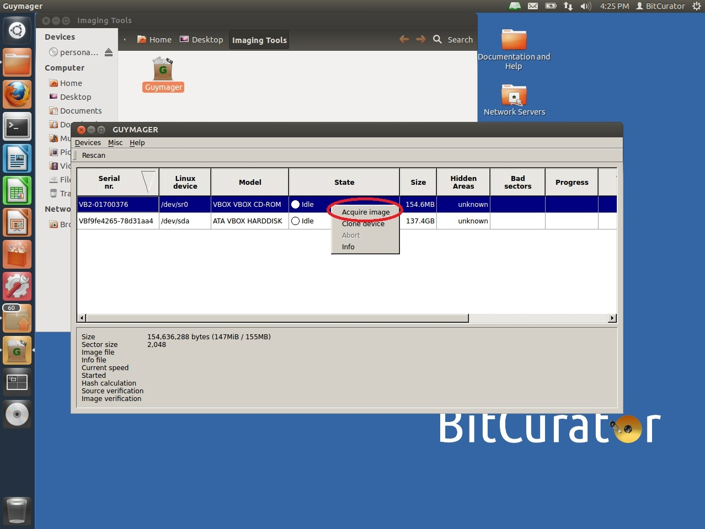
2. 点击获取图像将打开获取图像窗口。在此窗口中，您将首先选择您想要使用的磁盘映像格式。选项包括Linux dd原始镜像、专家取证格式(.E01)和高级取证镜像格式(.AFF）;专家取证或AFF镜像将在法医打包的镜像中存储用户添加的元数据。

注意:如果您选择Linux dd或Expert Witness格式，您可以选择将图像分割成多个文件，从而使其更容易转移。因此，例如，一个4GB的映像可以被分割成四个1GB的文件，或者两个2GB的文件，等等。

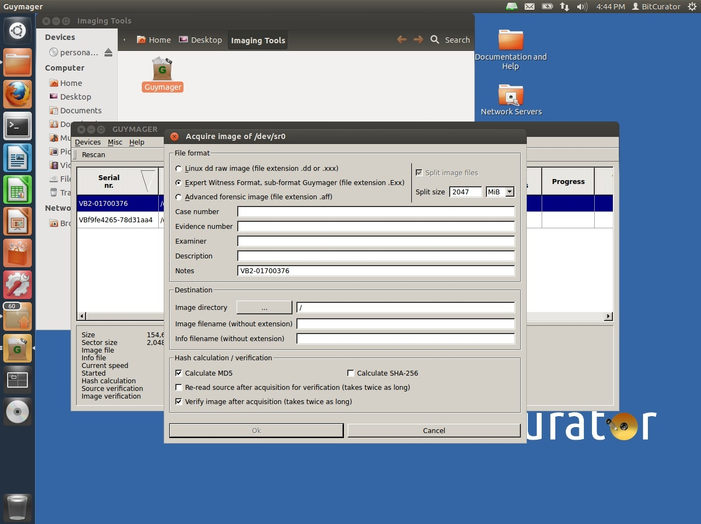

1. 选择镜像格式类型后，根据需要填写元数据。E01和AFF镜像是为数字取证社区设计的，因此字段被标记为刑事调查。然而，这些字段可以很容易地重新使用，以满足档案管理员和策展人的需要。例如，档案管理员可以使用“案例号”字段来记录登录号。
2. 接下来选择镜像目录，在本例中为“/home/bcadmin/diskimages”。注意:Guymager是作为根用户运行的，所以您要避免直接通过Guymager创建新的目录(因此第1步)。
3. 最后，命名磁盘映像并选择Guymager要执行的验证选项。点击“确定”开始成像过程。
4. 一旦成像过程开始，您将被带回到图4中的Guymager主屏幕，该屏幕现在将显示一个进度条。
5. Guymager完成磁盘映像的创建后，关闭Guymager并通过导航到步骤#1中创建的目录来验证映像。注意，这里有两个文件，图像本身和一个信息文件(参见图3)。信息文件包括我们在步骤7中输入的元数据以及在获取过程中收集的附加元数据。现在，成像过程已经完成。

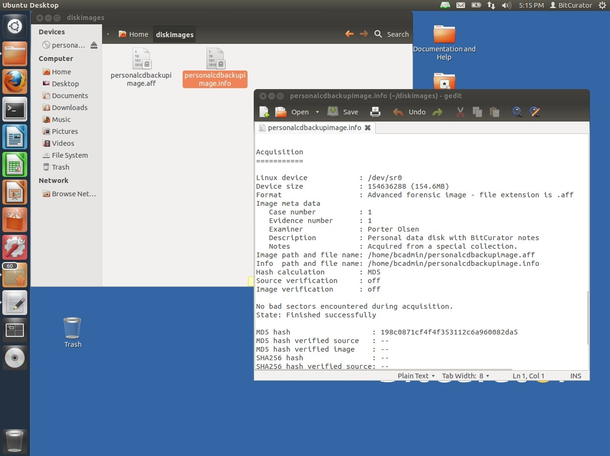


## 相关链接

http://sourceforge.net/projects/  

linux下免费镜像取证工具（相关文章：https://blog.forensix.cn/2014/03/guymager-intro/）

https://www.secpulse.com/archives/138600.html