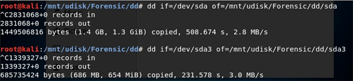
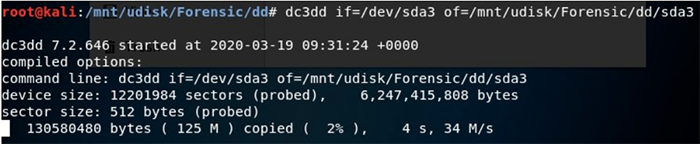
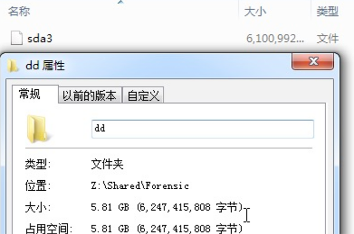

dd镜像取证

在一些无法使用工具的特殊情况下可以考虑dd做镜像，注意不要将镜像保存到被取证硬盘中，覆盖磁盘造成证据现场破坏。

## 使用dd做磁盘镜像

### dd一般镜像方式

1、fdisk -l 判断目标磁盘编号：

\#if=指定需要制作映像设备，-of=指定保存的位置。

2、dd if=/dev/sda

of=/mnt/udisk/Forensic/dd/sda 

dd速度非常慢，且在备份过程中没有任何进度提示，直接放弃换用增强版dd------dc3dd。

### dd镜像+压缩

由于dd格式的镜像被取证盘大小就是dd镜像大小，因此一般镜像时还可以带上压缩命令如下

dd if=/dev/sda3 | gzip > /bak/172_28_179_126/dev_sda3.gz //直接压缩

### dd镜像+压缩+分片

dd if=/dev/mapper/vg_local_root-lv_home | gzip | split -b 1G -d -a 3 - /bak/172_28_179_126/dev_mapper_vg_local_root-lv_home.dd.gz //分片压缩

## 使用dc3dd做磁盘镜像

dc3dd和dd参数使用是一样的，它们一样是完整备份，对备份盘容量需求比较大，这里只备份sda3（D盘），可以看到备份了约6GB大小。

dc3dd if=/dev/sda

of=/mnt/udisk/Forensic/dd/sda 

最终D盘分区镜像大小5.81GB。

## 参考文章

https://www.secpulse.com/archives/138600.html