> 分子实验室 https://molecule-labs.com/

官网：https://arsenalrecon.com/

工具源码：https://github.com/ArsenalRecon/Arsenal-Image-Mounter

Arsenal Image Mounter(AIM)包含了一个虚拟SCSI适配器（通过独特的Storport miniport驱动程序），使用户可以从Windows中对挂载的镜像启动虚拟机（然后绕过Windows身份验证）、管理BitLocker -受保护的卷、安装/访问“卷影副本”、“磁盘管理器”等功能。

## 特性

- 完成安装在Windows上将原始、检查和虚拟机磁盘映像的内容挂载为完整或“真实”磁盘
- 临时写支持、“假”磁盘签名、CLI版本、虚拟机启动、Windows身份验证旁路、BitLocker管理等等
- 在磁盘映像中快速挂载所有卷影副本(VSCs)
- 假设已安装适当的Windows文件系统驱动程序，则磁盘映像中包含的许多类型的文件系统都可以安装在运行AIM的取证工作站上。阿森纳安装的文件系统包括NTFS，FAT32，ReFS，exFAT，HFS +，UFS和EXT3。
- AIM还支持绕过Windows文件系统驱动程序，并通过“ Windows文件系统驱动程序绕过”安装选项使用DiscUtils文件系统驱动程序。该挂载选项支持的文件系统包括FAT 12/16/32和NTFS，具有对Btrfs，Ext2 / 3/4的实验性支持（某些最新Linux发行版使用64位头字段除外），ExFAT，HFS +，SquashFs ，UDF和XFS。

## 支持挂载的镜像类型

- 原始（dd）
- 高级取证格式4（AFF4）
- Encase（E01和Ex01）（如果libewf可用）
- 如果DiscUtils可用，则虚拟机磁盘文件（VHD，VDI，XVA，VMDK，OVA）和检查点（AVHD，AVHDX）

## 运行要求

Arsenal Image Mounter设计为（理想情况）在Windows 10（和Server 2016/2019）x64上运行，以便所有功能（例如，启动虚拟机和与BitLocker相关的功能）都能按预期工作。在上述推荐的操作系统之外，大多数（如果不是全部）AIM的核心功能仅在Windows 7和Server 2012/2012 R2 x64上才可在Windows系统上使用。

Arsenal Image Mounter需要Hyper-V才能启动虚拟机。如果您尚未安装Hyper-V，请按照以下链接中提供的说明启用它：

[https://docs.microsoft.com/zh-cn/virtualization/hyper-v-on-windows/quick-start/enable-hyper-v](https://docs.microsoft.com/en-us/virtualization/hyper-v-on-windows/quick-start/enable-hyper-v)

另外，请确保已启用工作站BIOS或UEFI中的虚拟化技术设置。还建议您在防病毒应用程序中排除Arsenal Image Mounter的文件夹和/或可执行文件。

## 安装

### 安装流程

官网下载地址：https://arsenalrecon.com/downloads/

下载AIM后，将“ Arsenal-Image-Mounter…” ZIP文件的内容提取到您选择的文件夹中。AIM文件夹的内容包括可执行文件“ ArsenalImageMounter.exe”（GUI版本），“ aim_cli.exe”（CLI版本）以及AIM的GUI和CLI版本的自述文件。

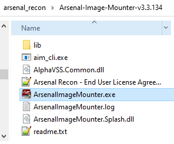

自述文件包含有关AIM功能和产品使用的详细说明。强烈建议数字法医从业人员查看并了解“ readme.txt”和“ readme_cli.txt”中提供的信息。

双击“ ArsenalImageMounter.exe”打开AIM将启动AIM并安装AIM驱动程序。如果您看到以下与安装更新的驱动程序有关的窗口，请选择“是”。

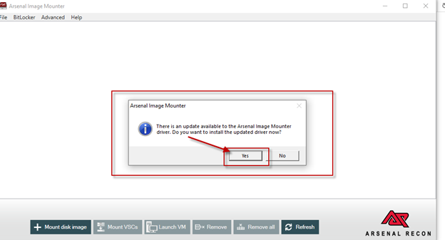

将会出现“正在安装驱动程序”消息窗口。

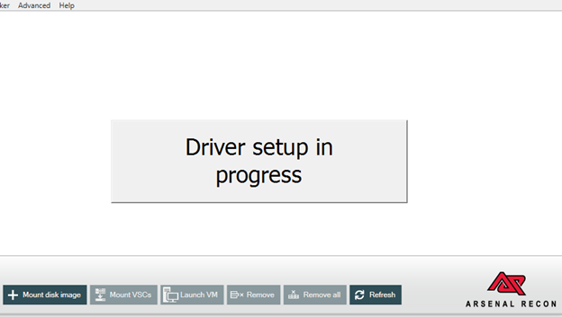

驱动程序设置完成后，将显示“驱动程序已成功安装”消息窗口。 

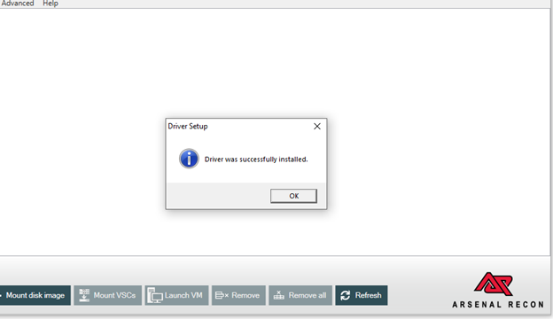

1、下载的是压缩包文件，解压后运行；

2、支持32位、64位运行环境；

3、需要**Microsoft .Net Framework 4.0**环境

4、如果软件无法正常打开，请以“**管理员**”身份运行；

### **启用AIM的专业模式**

通过在AIM首次启动时激活许可证或通过“帮助”->“关于”，可以在连接Internet的工作站上启用AIM的“专业模式”。

要在有气隙的工作站上启用AIM的“专业模式”，请：

- 打开Arsenal Image Mounter并输入获得的许可证代码
- 意识到没有可用的Internet连接后，Arsenal Image Mounter会将一个“ .LIC”文件保存到您的ProgramData\ArsenalRecon文件夹中
- 在可访问Internet的工作站上，转到https://www.softworkz.com/offline/offline.aspx上的“脱机激活”页面，然后上传“ .LIC”文件。
- 将收到的CDM文件复制到ProgramData\ArsenalRecon文件夹
- 打开Arsenal Image Mounter并确认它现在正在专业模式下运行

### 免费版和专业版区别

**自由模式**

- 在Windows上将原始，取证和虚拟机磁盘映像挂载为“真实”磁盘
- 对所有受支持的磁盘映像格式的可重复播放delta 文件提供临时写入支持
- 将“物理”安装的对象保存为各种磁盘映像格式
- 虚拟挂载镜像
- 创建RAM磁盘
- 命令行界面（CLI）可执行文件
- MBR注入，“假”磁盘签名，可移动磁盘仿真等

**专业模式**

- 提供所有免费模式功能，以及：
- 轻松启动（并经常登录）虚拟机
- 通过可选的Windows NTFS驱动程序绕过卷影复制安装
- Windows文件系统驱动程序绕过对磁盘映像安装的支持
- 虚拟安装档案和目录
- 使用完全解密的BitLocker卷保存磁盘映像

## 磁盘挂载

这里由于已有老师进行了相关教程的介绍，这里做了引用和整合，感谢老师们的前沿探索。

### 快速上手教程-在Win中挂载映像为磁盘

参考文章：https://blog.csdn.net/NDASH/article/details/110292699

1、软件运行后，提示启动信息，点击“ok”

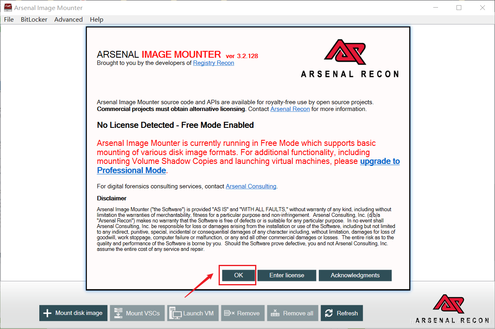

2、选择磁盘镜像

路径：File->Mount disk image File

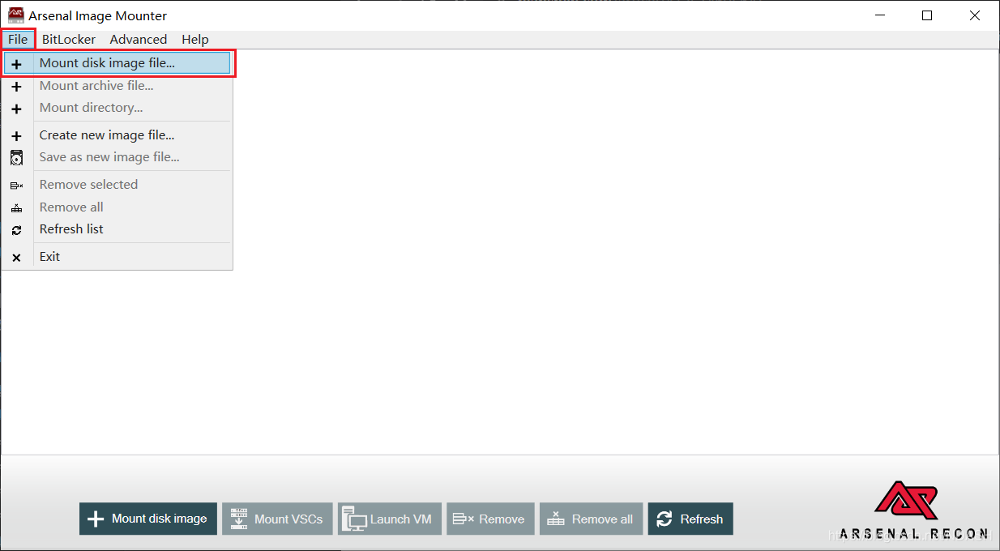

3、镜像模式设置

〇只读磁盘设备

将磁盘映像作为只读磁盘设备挂载。不允许写操作。

〇写入临时磁盘设备

将磁盘映像作为可写磁盘设备挂载。修改将被写入一个写-覆盖差异文件，原始磁盘映像将不会被改变。有时也称为写覆盖或写复制模式。

 指定另一个不同的文件位置

仿真镜像的话就需要设置读写模式才行。

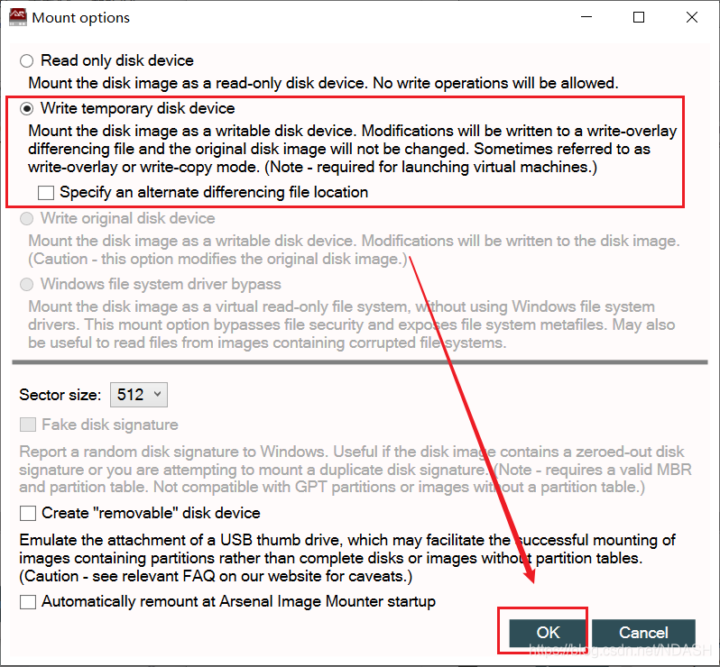

4、磁盘信息

挂载成功后，在软件的界面上会显示出每个挂载的设备信息，包括ID、磁盘状态（联机或脱机）、驱动器号、分区类型、磁盘签名信息、大小，模式（只读或读写），驱动器类型（固定或移动）。

您还可以在界面的下半部分中选择继续添加镜像、启动虚拟机和删除镜像等其他功能选项。

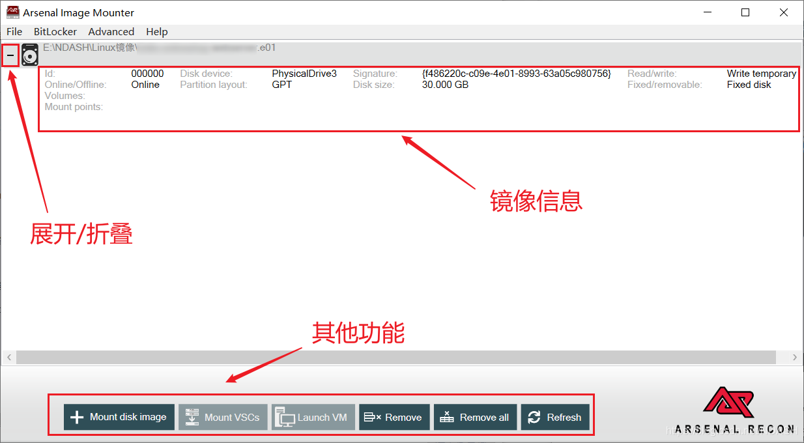

5、挂载之后在磁盘管理显示

可在磁盘管理中查看挂载好的磁盘。

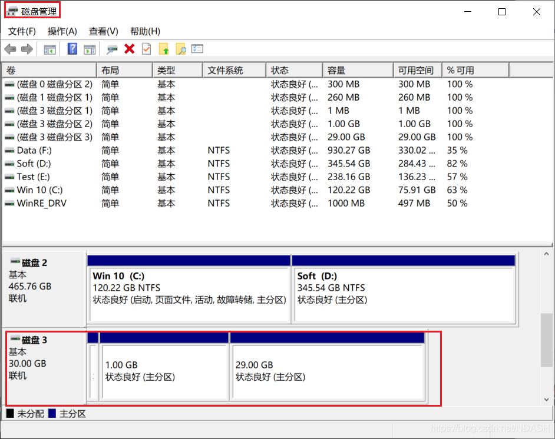

高级功能-更改磁盘挂载模式

特别方便的一点是，Arsenal Image Mounter可以直接对已经挂载的镜像在“高级功能”再设置就可以更改模式，不需要像FTK Imager需要重新再挂载镜像，而且速度很快。

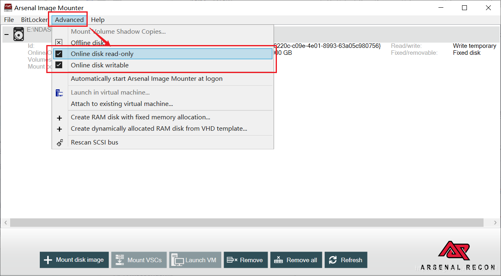

点击只读设置，磁盘管理查看磁盘就会变成只读模式。

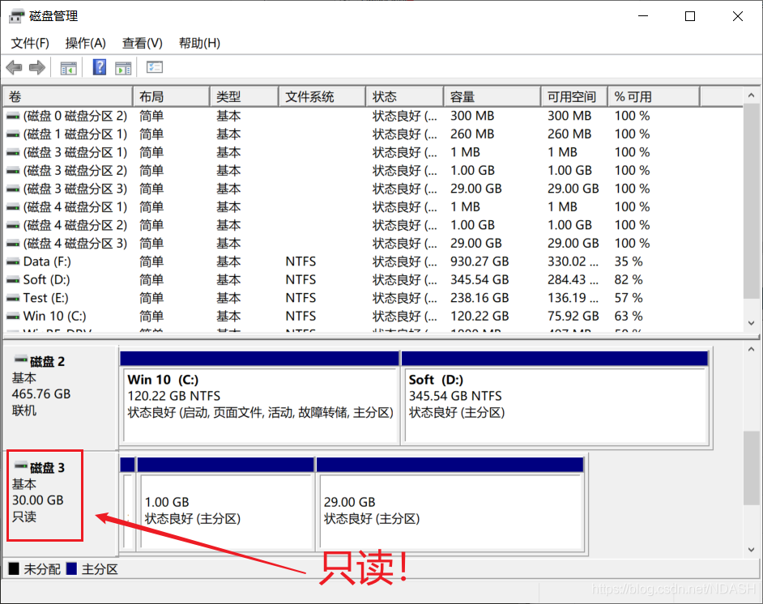

### 官方教程-挂载磁盘映像

https://arsenalrecon.com/2020/12/arsenal-image-mounter-aim-walkthrough/

**
**

1. 双击“ ArsenalImageMounter.exe”启动AIM，然后从“文件”菜单中选择“文件”->“挂载磁盘映像文件”。

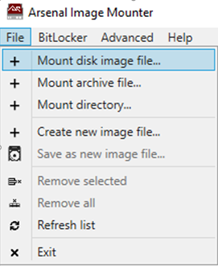

1. 选择AIM挂载的磁盘映像类型。

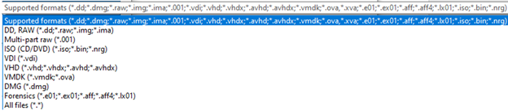

1. 选择磁盘映像后，将出现“挂载选项”窗口，并选择了“只读磁盘设备”安装选项。在本文中，我们将重点介绍“写入临时磁盘设备”安装选项，因此我们将选择“写入临时磁盘设备”，然后按“确定”。在AIM安装选项窗口中描述了写入临时安装选项的效果。

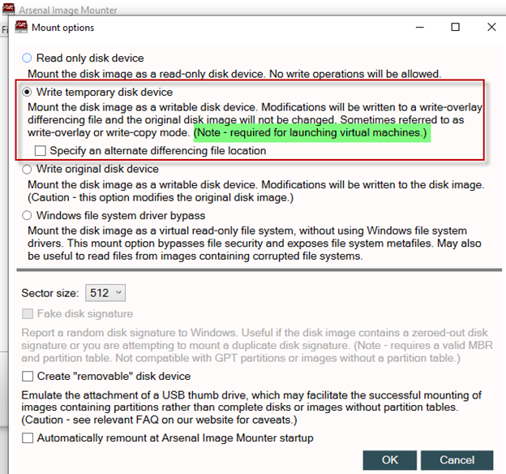

装入磁盘映像文件后，将在AIM的主界面中标识运行AIM的取证工作站上的挂载点。在这种情况下，具有临时读/写功能的'c16-Hunter.dd'被安装为'H:\'。您还可以看到该磁盘映像包含两个卷影副本（VSC）。

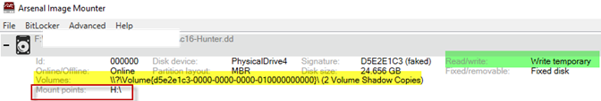

在Windows资源管理器中，您可以浏览到“本地磁盘（H :)”，如下所示。

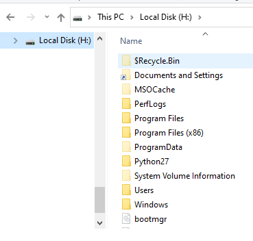

上述步骤提供了使用AIM挂载磁盘映像的快速介绍。在下一节中，我们将介绍如何将AIM安装的磁盘映像启动到虚拟机中。

### 官方教程-（专业版）在虚拟机中挂载镜像

本节将介绍如何将AIM安装的磁盘映像启动到虚拟机中。接下来的三段直接从“ readme.txt”文件中引用，解释了AIM如何将磁盘映像启动到虚拟机中。启动VM – 使用选定的AIM安装磁盘启动Hyper-V虚拟机。在使用此功能之前，应先以写临时模式挂载磁盘映像，该功能旨在使在虚拟机中引导磁盘映像的内容比其他方法更高效，可靠和有用。AIM将确定是将磁盘映像作为第一代虚拟机还是第二代虚拟机启动–请参阅https://docs.microsoft.com/en-us/windows-server/virtualization/hyper-v/plan/should-i-create-a-generation-1-or-2-virtual-machine-in-hyper-v 有关两代的更多详细信息。该虚拟机由2个CPU，一半宿主机可用RAM（最大4GB），两个网络适配器（默认情况下未连接），一个DVD-ROM（不带任何附件映像）和AIM挂载磁盘作为主要IDE或SCSI HD。AIM在Windows 8.1 / 10（和Server 2012 R2 / 2016）x64上可用全部功能，并且要求Hyper-V角色在物理硬件上运行，而不是在虚拟机中运行。可以从[https://docs.microsoft.com/zh-cn/virtualization/hyper-v-on-windows/quick-start/enable-hyper-v](https://docs.microsoft.com/en-us/virtualization/hyper-v-on-windows/quick-start/enable-hyper-v)获得Microsoft有关在Windows 10上安装Hyper-V的信息。AIM在安装Hyper-V方面的配置是“使用CMD和DISM启用Hyper-V”方法。如果不确定Hyper-V是否正在运行，则在命令提示符下“ sc query HvService”的输出可能会有所帮助。 

1. 确保已使用安装选项“写入临时磁盘设备”在AIM中挂载了磁盘映像，如上文“挂载磁盘映像”部分所述。

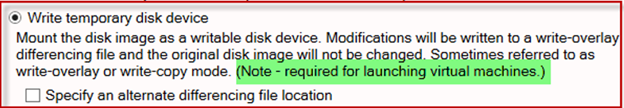

1. 以写临时模式挂载磁盘映像后，有两种方法可以启动虚拟机：

在AIM主界面的底部，有一组快速访问按钮，其中一个是“启动VM”。单击/按“启动VM”以启动虚拟机启动过程。

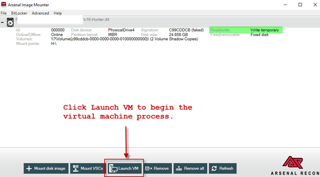

或者从“高级->在虚拟机中启动...”下的“ AIM”菜单中选择。

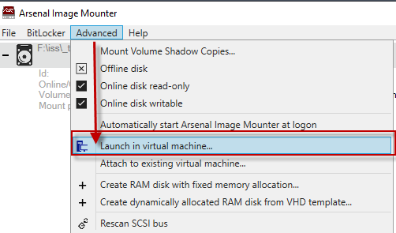

1. 将显示“作为虚拟机启动”窗口，其中选中了多个默认选项（取决于所选的特定磁盘映像），如下面的屏幕快照所示。根据您的特定需求调整选项。在这种情况下，我们将使用默认值。 

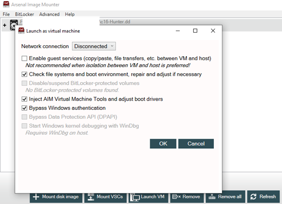

以下是直接从“ readme.txt”文件中更详细描述的“启动VM”选项。

- 选择启动虚拟机后，AIM将提供与启动虚拟机有关的各种选项。
- 配置网络连接，以使其断开连接（即完全隔离），在VM之间共享，在VM与主机之间共享或设置为具有外部NAT的默认交换机。
- 启用来宾服务以在VM和主机之间提供复制/粘贴和其他功能。当虚拟机和主机之间的隔离是首选时，不建议这样做。
- 检查文件系统和引导环境，必要时进行修复和调整。如果此选项可用（未显示为灰色），则建议您不要取消选择它。
- 禁用/挂起受BitLocker保护的卷，以便在VM运行后无需再次将其解锁。
- 注入AIM虚拟机工具并调整启动驱动程序。某些磁盘映像可能很难直接引导到虚拟机中，因此AIM可以将* 1小型应用程序注入运行Windows * 2虚拟机中。AIM虚拟机工具可以显示帐户列表（没有明显的文件夹结构或没有重要注册表信息的帐户未在AIM虚拟机工具中列出，因为实际上没有什么可登录和/或无法这样做的），并且可以还可以从登录屏幕打开管理命令提示符。AIM虚拟机工具将在Windows XP上自动启动，并且可以通过Windows Vista / 7/8 / 8.1 / 10 * 3上的“轻松访问”图标进行访问。
- 使用包括策略调整在内的多种技术绕过Windows身份验证* 4，以便任何密码输入都可以使用。支持使用多种身份验证（包括密码，PIN，生物识别，图像和智能卡）的本地，Microsoft（云），Active Directory和Azure Active Directory帐户。如果要求或原始特权不可用，将为帐户提供管理特权。请注意，要访问Windows中的某些内容（例如EFS加密的文件和文件夹以及缓存的登录凭据），您将需要破解而不是绕过帐户身份验证* 5。
- 绕过数据保护API（DPAPI），它提供对上次登录用户的受DPAPI保护的内容（例如网站，网络共享和应用程序凭据以及受保护的文件和文件夹）的无缝访问（特别是与AIM的Windows身份验证旁路配合使用）通过加密文件系统（EFS）。通常，在用户成功登录Windows后，才可以使用受DPAPI保护的内容，但是AIM的DPAPI绕过功能使其在没有用户凭据的情况下就可用。在某些情况下，当AIM首次将具有本地或Microsoft（云）帐户的Windows 10 x64系统启动到虚拟机中时，此选项将可用。请注意，此选项当前最适合单用户系统，并且不会在重新启动后持续存在。
- 使用WinDbg启动Windows内核调试。

- - *1AIM将在虚拟机内执行防病毒规避，以确保AIM虚拟机工具正常运行。*
  - *2名为“ AIM_MODIFIED.txt”的文件将放置在AIM虚拟机工具已进行调整的每个Windows卷的根目录上。这些调整是设计临时的，基于“写入临时…”安装。*
  - *3根据您的防病毒软件和设置，您可能需要将AIM的文件夹和/或可执行文件（ArsenalImageMounter.exe和aim_cli.exe）排除/白名单和/或暂时禁用实时保护，以确保AIM虚拟机工具将被正确注入。您可能还需要指示防病毒软件在VM启动时忽略/允许“ utilman.exe”威胁。*
  - *4并非总是可以为某些状态下的缓存域帐户标识权威的DOMAIN \ USER组合，因此AIM可以创建DOMAIN \ USER组合以方便访问那些帐户。AIM虚拟机工具将以红色显示AIM创建的DOMAIN \ USER组合。*
  - *5对于Active Directory帐户，如果有域控制器可用，则很容易在它与客户端之间建立虚拟网络（所有网络都在AIM启动的虚拟机中运行），这将允许您重置帐户密码从域控制器。以这种方式重置密码将使您能够访问客户端上以前无法访问的项目，例如缓存的登录凭据以及EFS加密的文件和文件夹。*

*
*

**启动虚拟机失败消息**

如果看到错误消息“虚拟机发生故障”，则可能您未安装Hyper-V或它无法正常运行。如果未安装Hyper-V，请删除AIM中当前安装的所有磁盘映像，关闭AIM，然后安装Hyper-V。成功安装Hyper-V之后，重复前面的步骤，以写临时模式安装磁盘映像，然后启动虚拟机。

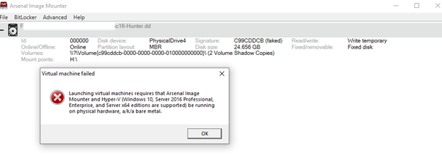

1. 继续经过“作为虚拟机启动”窗口之后，在虚拟机准备过程中将出现几个窗口。

- 如果AIM确定需要修复文件系统，则将显示命令提示符窗口。在此阶段，无需您进行任何交互。

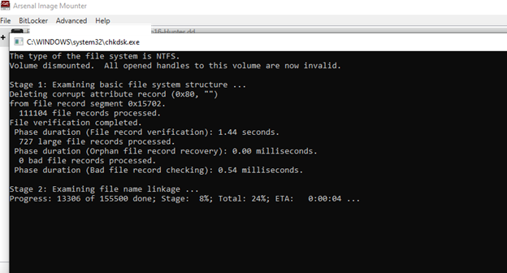

命令提示符窗口消失后，将出现“磁盘未脱机”消息窗口。选择“是”。磁盘必须置于离线模式才能与虚拟机一起使用。

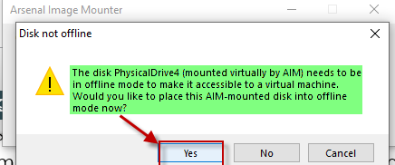

1. 磁盘脱机后，将显示“虚拟机连接”窗口。现在可以通过单击“开始”来启动虚拟机。

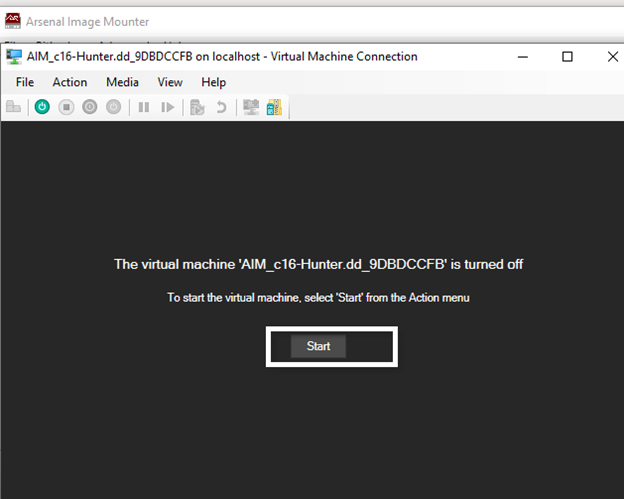

启动后，虚拟机将开始引导至Windows（或其他操作系统，具体取决于已安装的磁盘映像中包含的操作系统）。

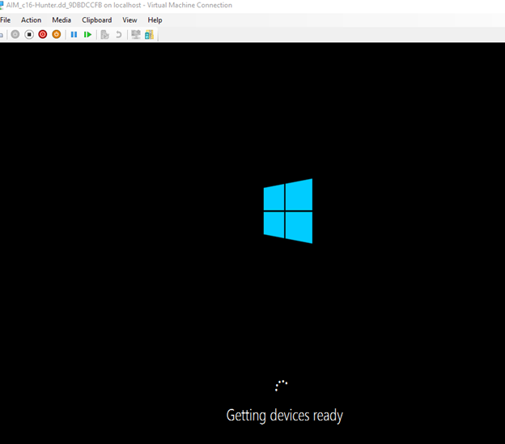

1. 我们已经启动了虚拟机，现在处于Windows登录屏幕，该屏幕似乎要求用户'Hunter'拥有密码。您可能不知道该帐户的密码。

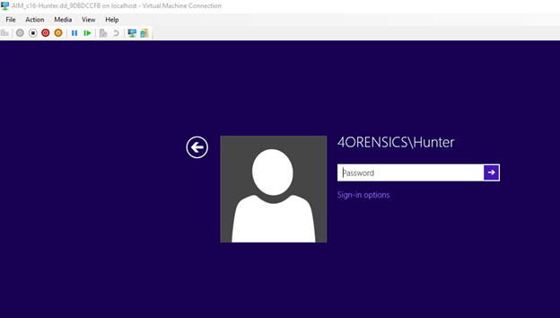

1. 在尝试登录默认用户帐户之前，让我们首先检查一下Hunter磁盘映像中有多少个用户帐户（以及类型！）。这可以通过在Windows登录屏幕上选择“轻松访问”图标来完成，以显示“ AIM虚拟机工具”窗口。标识了一个用户帐户，其UTC时间，帐户类型，用户帐户配置文件路径和Windows SID值具有“上次登录”的日期和时间。下面的屏幕快照显示了“ AIM虚拟机工具”窗口中的默认选项。请注意，“ AIM虚拟机工具”窗口底部的两个单选按钮显示为灰色。

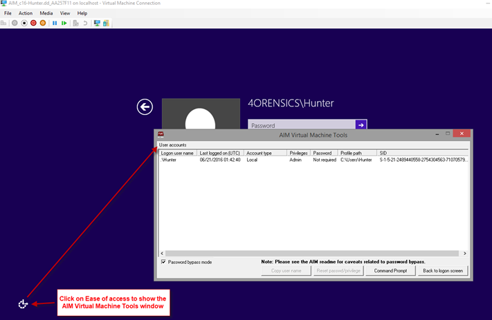

1. 如果选择显示用户帐户信息的行，则将激活下面显示为灰色的按钮，如下面的屏幕截图所示。现在，我们已经使用AIM虚拟机工具标识了用户帐户，我们可以单击“返回登录屏幕”或单击右上角的“ X”关闭窗口。

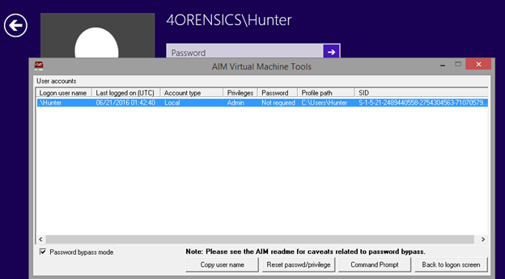

1. 使用AIM的“绕过Windows身份验证”（如果之前选中此选项，则无需知道用户帐户的密码）。单击“密码”字段中的向右箭头，或按键盘上的“ Enter”。

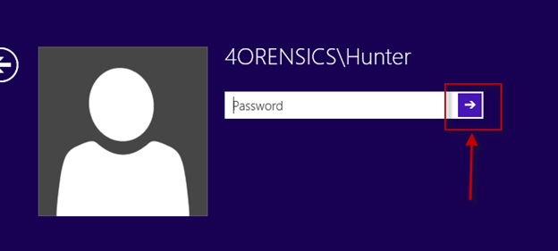

接下来的两个屏幕快照演示了Windows身份验证被绕过然后访问用户的桌面的情况。

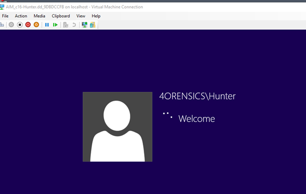

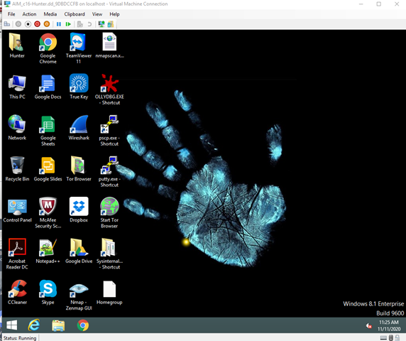

### 官方教程-挂载卷镜像副本（VSC）

数字取证从业人员可以通过启用来宾服务来在虚拟机中运行第三方工具，这将允许VM和主机之间进行文件传输，或者使用其他方法（例如将磁盘连接到虚拟机或利用PowerShell Direct）。有关这些选项的更多详细信息，请参见AIM自述文件。

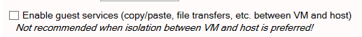

接下来，我们将演示VSC的安装（从AIM安装的磁盘映像中）。

卷影副本（VSC）对数字取证从业者尤其有用。它们可能包含有价值的数据，这些数据存在于文件系统的先前版本中，而不再存在于当前文件系统中。

1. 我们将首先以写入临时模式挂载收集的磁盘映像。
2. 挂载磁盘映像后，我们转到**“高级->卷卷影副本…”。**

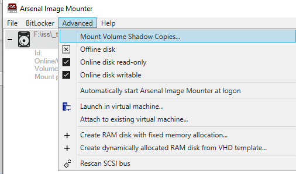

1. 这将打开“卷影复制选项”窗口。默认情况下，“标准卷影副本安装”和所有VSC被选中。仔细阅读每个选项的说明，以确保按预期方式装入卷影副本。

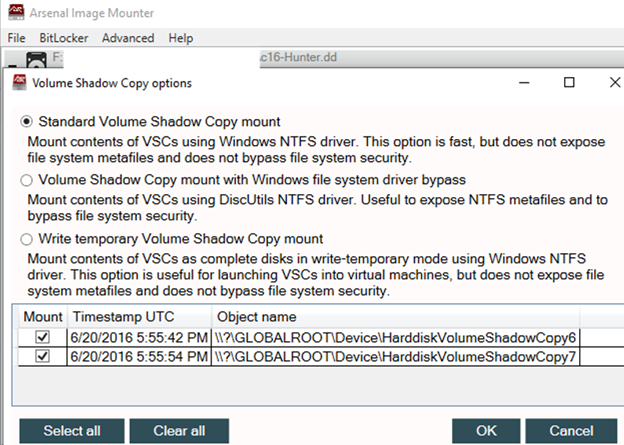

1. 无论选择了一个还是多个VSC，AIM都会请求一个文件夹，用于安装VSC。在“浏览文件夹”窗口中，确定要将VSC挂载的位置，然后按OK。

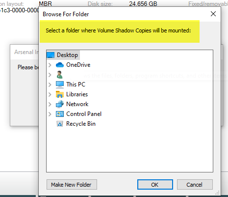

1. 在这种情况下，选择了收集的磁盘映像中的两个VSC，并且选择安装它们的位置是Desktop。现在可以将VSC作为一系列文件夹进行浏览，并且可以使用第三方工具来分析或镜像已安装的VSC。

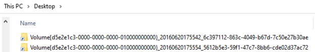

1. 选择“标准卷影副本装载”将快速装载VSC，但不会公开Windows文件系统图元文件（例如$MFT，$LogFile，$UsnJrnl等），并且不会绕过文件系统安全性。在下面显示的屏幕快照中对此进行了演示，该屏幕快照显示两个VSC中均不存在NTFS图元文件。

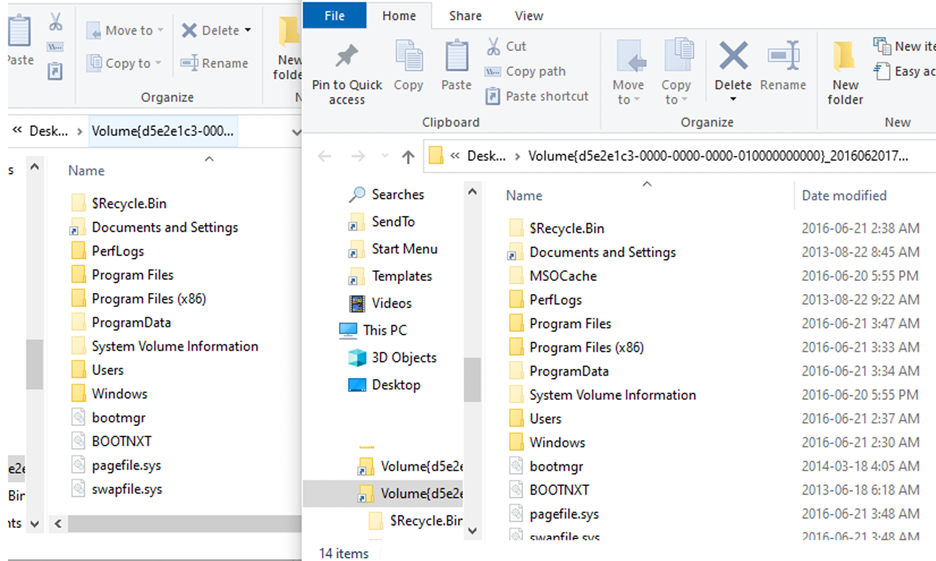

1. 如果要访问NTFS图元文件以进行分析和成像，请选择选项“使用Windows文件系统驱动程序旁路进行卷影复制安装”。使用此选项，VSC会与DiscUtils NTFS驱动程序（而不是Windows NTFS驱动程序）一起安装，并且会显示NTFS图元文件。请记住，AIM会提示您输入用于安装VSC的文件夹位置。

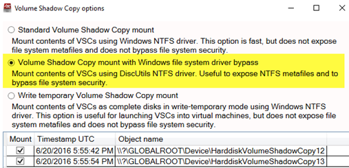

“使用Windows文件系统驱动程序旁路安装卷影副本”选项将使AIM开始缓存目录结构的过程。这不如“标准卷影副本安装”那样快。您将看到在缓存目录结构时，AIM非常忙。

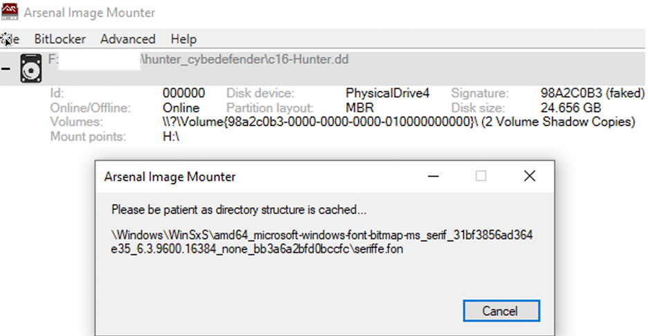

1. 如果决定使用“写入临时卷影复制装载”选项，则将装载VSC，就像它们都是“真实”磁盘一样，并且清楚地标识了它们的装载点。

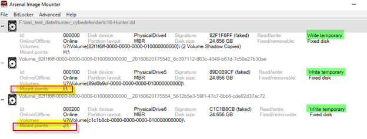

挂载的VSC将出现在Windows资源管理器中，在这种情况下为驱动器号“ I”和“ J”。可以使用您选择的映像工具对安装的这些VSC进行物理或逻辑映像，甚至可以将其启动到虚拟机中，我们将在后面讨论。

1. 可以通过突出显示相关的AIM安装的磁盘映像并选择“删除”或选择“全部删除”来删除已安装的VSC。

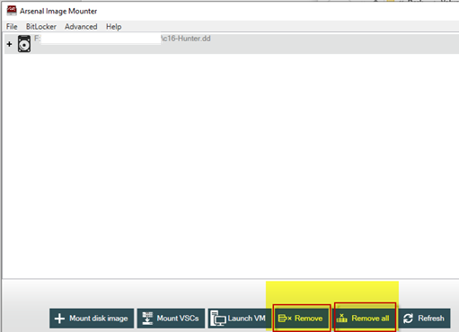

到此，对VSC安装选项进行了简要回顾。在下一部分中，我们将演示如何将VSC从虚拟机启动AIM安装的磁盘映像。

### 官方教程-（专业版）作为虚拟机启动卷镜像副本（VSC）

本节将介绍如何从安装了AIM的磁盘映像作为虚拟机启动VSC。我们在本演练的“安装磁盘映像”和“安装卷影复制”部分中介绍的步骤是相关的。

1. 首先，我们以写临时模式挂载获取的磁盘映像。

1. 接下来，我们使用“卷影复制”选项“写入临时卷影复制安装”来挂载VSC。

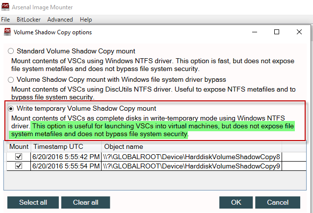

1. 在AIM界面中，请记住首先选择要作为虚拟机启动的VSC，然后使用“启动VM”功能。在“作为虚拟机启动”窗口中，接受选中的默认值，然后选择“确定”。

磁盘映像安装选项：临时写入

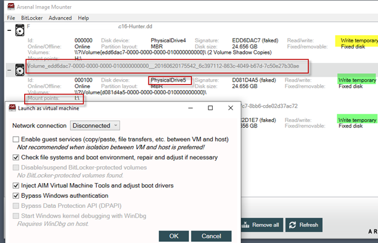

1. 已安装的VSC出于启动VM的目的而处于脱机状态。

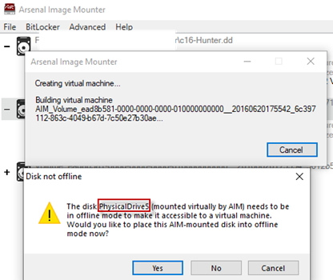

1. 现在，VSC已启动到虚拟机中，并且我们已经使用AIM的Windows身份验证旁路访问了用户的桌面。

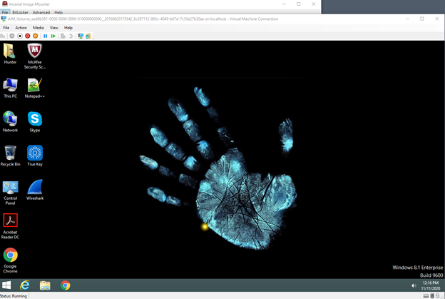

### **官方教程-（专业版）BitLocker管理**

AIM的BitLocker菜单（专业模式）允许数字取证从业人员解锁受BitLocker保护的卷，挂起受BitLocker保护的卷，禁用（完全解密）受BitLocker保护的卷以及完全解密受BitLocker保护的卷，然后保存完全解密的磁盘映像…，以便可以在其他（商业或开源）数字取证工具中轻松使用该映像。

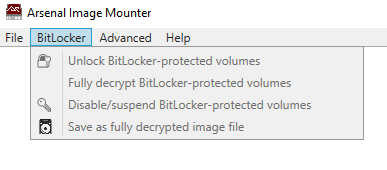

### **官方教程-（专业版）****启动虚拟机以解锁或删除完整磁盘加密**

AIM可用于将包含各种全盘加密（尤其是流行的数字取证工具不支持的加密）的磁盘映像启动到虚拟机，从而使您可以与全盘加密的“预启动环境”进行交互-换句话说，是一种小型操作系统，由全磁盘加密使用，在主操作系统之前运行。然后，根据全盘加密的类型，您可能会具有一些选项，其中包括解锁和删除全盘加密以及各种密钥恢复方法。

### **官方教程-（专业版）****分流**

使用AIM的启动VM功能（专业模式），研究人员或数字取证从业人员可以从用户的角度查看操作系统。使用取证工作站，研究人员或数字取证从业人员可以对磁盘图像进行分类，并确定是否存在轻松实现的目标。这种方法面临的挑战是，例如，无法轻松查看已删除的工件和NTFS图元文件。这种方法应与数字取证分析工具的使用相平衡，该工具可以更全面地查看文件系统。

分流用例背后的目的是通过允许调查人员协助案例审查来协助机构或公司解决积压的案件。这不一定是解决案件积压的最佳解决方案，而是一个值得考虑的想法。Humbly指出，对于不断增加的案件积压，没有单一的解决方案。

### **官方教程-（专业版）****实时系统分析**

将AIM安装的磁盘映像或VSC启动到虚拟机（专业模式）的功能对于检查实时系统非常有用。实时系统上的监视过程，文件系统和网络活动可能非常有价值，尤其是在涉及恶意软件的情况下。

### **官方教程-（专业版）**[**在没有用户凭据的情况下访问DPAPI保护的内容**](https://arsenalrecon.com/2020/10/introducing-arsenal-image-mounter-v3-3-134-and-dpapi-bypass)

什么是DPAPI（数据保护API）保护的内容？从另一则 [见解文章中](https://arsenalrecon.com/2020/10/introducing-arsenal-image-mounter-v3-3-134-and-dpapi-bypass)：

> “ Microsoft在Windows 2000中发布了DPAPI，因此第三方开发人员（以及Microsoft本身）将拥有可靠，灵活且易于使用的方法来加密和解密数据。DPAPI加密可以基于特定用户（要求使用该用户的Windows登录凭据）或特定系统（要求使用任何用户的Windows登录凭据）。受DPAPI保护的数据可以在Windows计算机的许多位置找到，例如注册表和各种应用程序数据库。在某些情况下，数字取证从业人员很容易确定应用程序如何使用受DPAPI保护的数据，但在其他情况下（例如Dropbox数据库）则更具挑战性，因为DPAPI是保护特定类型数据的较大系统的一部分。 ”

既然您知道受DPAPI保护的内容的价值，那么您也将知道在没有用户凭据的情况下访问该内容的价值。请查看前面提到的“见解”文章，以了解有关AIM的DPAPI旁路的更多信息。

### **官方教程-（专业版）****作为虚拟机启动的非Windows磁盘映像**

如果您在本演练的前面提到了您，则将获得有关支持安装多个非Windows文件系统的支持。AIM不仅限于将Windows启动到虚拟机中，还可以将诸如Linux之类的操作系统启动到虚拟机中。如果您要处理的是运行Linux的可疑设备，或者是运行嵌入式Linux的设备（如某些DVR），则这可能非常有用。

可以在https://cyberdefenders.org/labs/32上找到Hunter磁盘映像。

您可以在Arsenal的“[推荐”](https://arsenalrecon.com/testimonials)页面上阅读有关数字取证从业人员如何使用AIM的信息。

您可以在Vimeo Arsenal Image Mounter频道的https://vimeo.com/channels/1544872/videos上观看一些AIM培训视频。

## 视频教程

https://www.youtube.com/watch?v=VDu8ZYgKeho