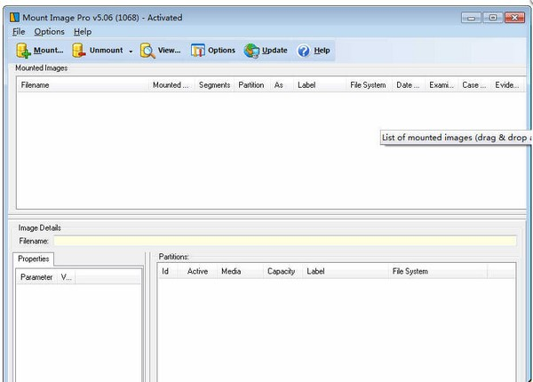
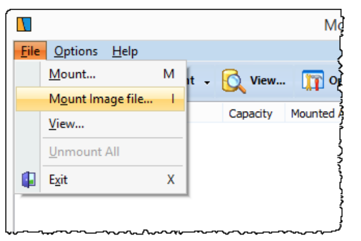
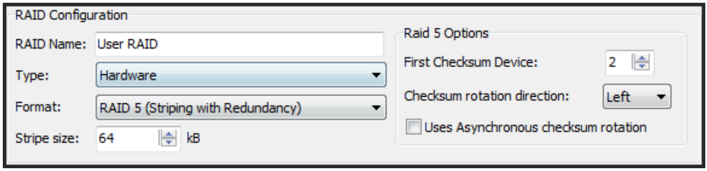
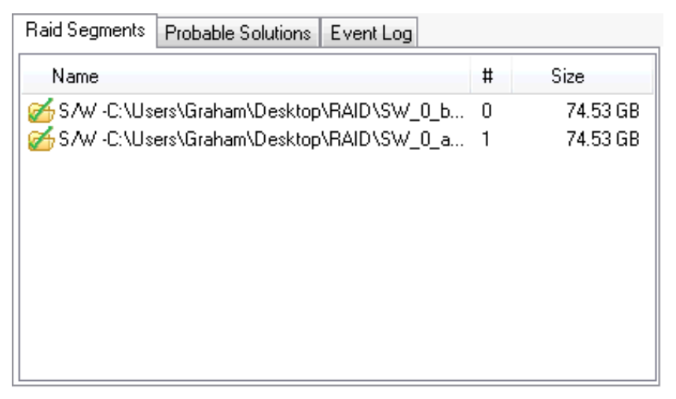
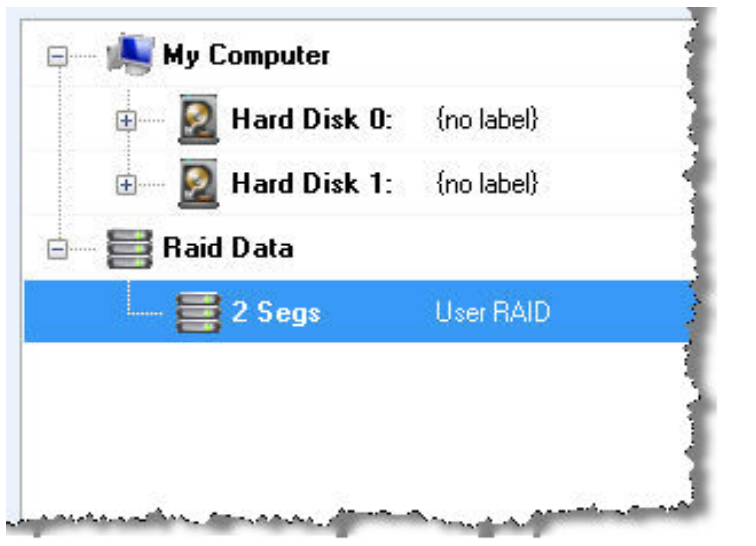
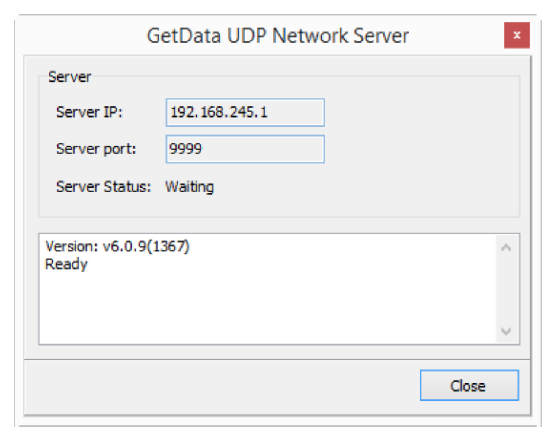
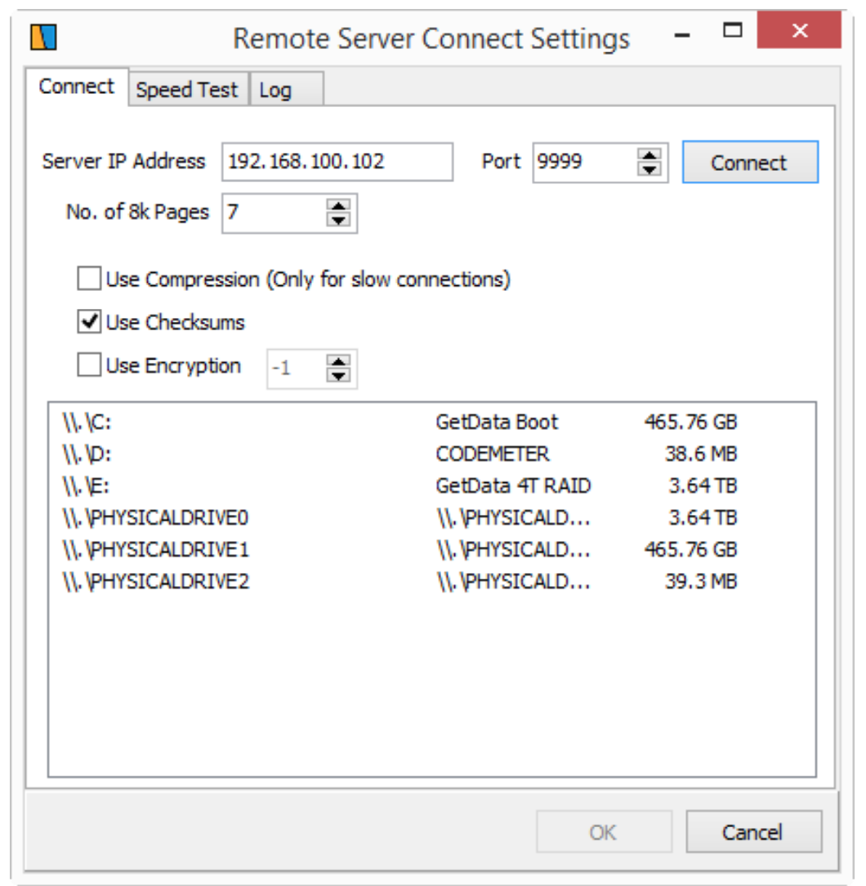
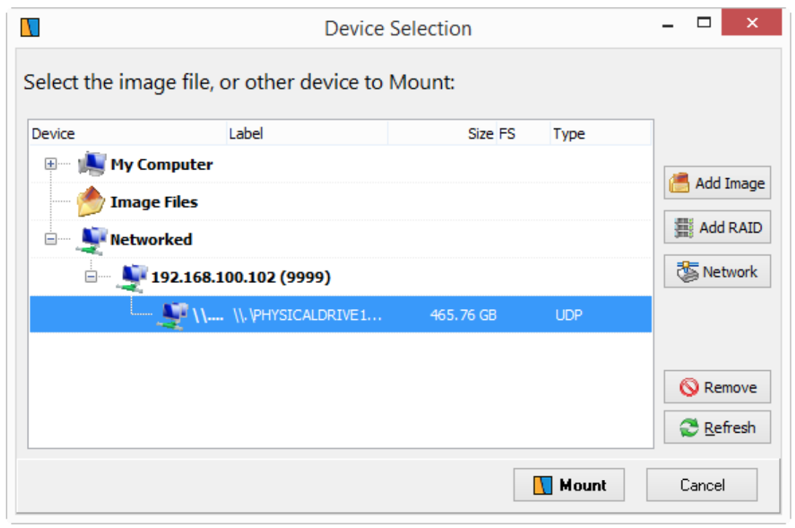
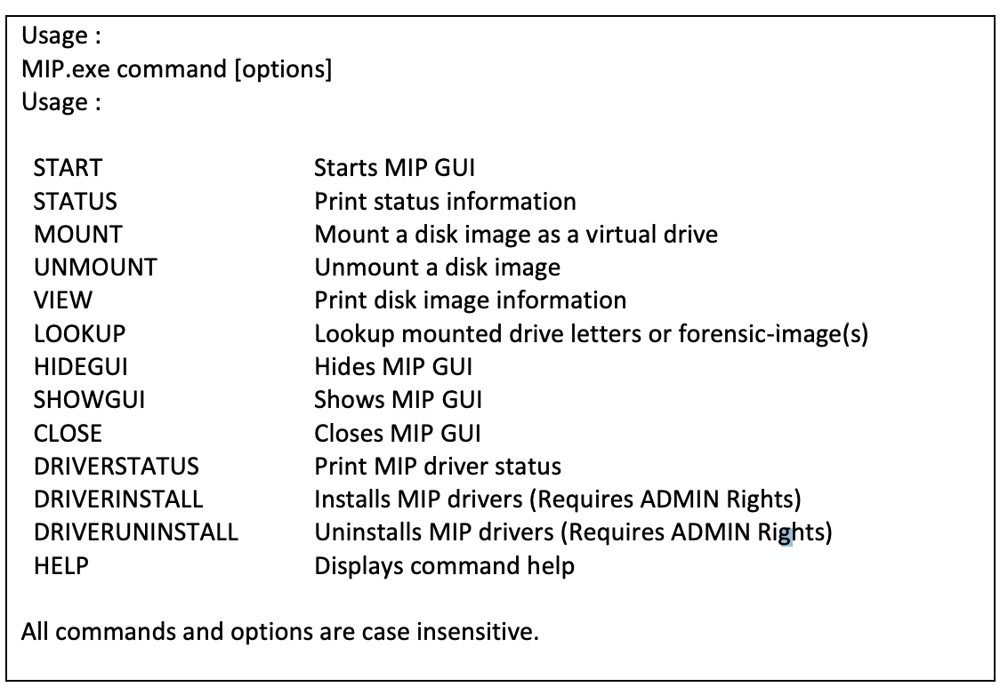

>  分子实验室 https://molecule-labs.com/

**官网：**https://getdataforensics.com/product/mount-image-pro/

## 介绍：

**GetData Mount Image Pro镜像文件虚拟工具**是一款非常优秀的讲镜像文件虚拟成硬盘的工具软件。简单易操作，程序可以帮助你将.e01、.s01、.raw、.dd、.iso等镜像文件模拟成一个硬盘的分区，比如“F盘”，从而方便你进行读取和访问


GetData Mount Image Pro是来自国外的一款功能强大的镜像文件虚拟工具，可帮助用户将.e01、.s01、.raw、.dd、.iso等镜像文件虚拟成硬盘分区，通俗将就是把一个iso这类的文件虚拟成你电脑你的一个盘符，如g:盘，既方便了文件管理，同时，还可帮助用户在安装系统时，直接利用虚拟的磁盘分区执行系统的安装操作，从而免去了需要U盘或者光驱的安装方式。




Mount Image Pro将电子取证镜像文件作为驱动器号挂载在Windows下，包括e01、Ex01、.l01、Lx01和.ad1镜像格式。这样可以访问整个镜像文件的内容，允许用户:


- 使用标准的Windows程序浏览和打开内容，如Windows Explorer和Microsoft Word。
- 在挂载的文件系统上运行第三方应用程序。
- 出口文件。

挂载的数据保留在一个安全的环境中，其中镜像文件的内容不会被更改。


Mount Image Pro包含专有驱动程序，允许访问所有映像内容，包括系统文件、已删除的文件和未分配的集群。


Mount image Pro拥有完整的命令行功能，经常作为第三方应用程序访问取证数据的引擎使用。


## 特性

挂载以下镜像文件类型:

- 访问数据.AD1
- 苹果DMG
- 框。e01, Ex01, l01, Lx01
- 取证文件格式.aff
- ISO (CD及DVD影像)
- 微软VHD .VHDX
- NUIX MFS01
- ProDiscover
- SMART
- Unix/Linux DD和原始映像
- VMWare
- Xways容器文件


支持访问Bitlocker或FileVault驱动器(必须知道密码)。

电子取证相关特性:

- 作为只读挂载或模拟磁盘写入缓存文件。
- 显示或隐藏删除的文件和系统文件(包括未分配的集群)。
- 没有Windows安全权限挂载文件。

完全的命令行支持与能力批处理。

挂载所有常见的文件系统，包括:

- NTFS, FAT, FAT16, FAT32, HFS, APFS, EXT2/3/4;
- 可以与HFS和Linux EXT2/3/4的第三方文件系统驱动一起使用。

挂载物理和逻辑磁盘。与GetData servlet MIP一起使用，可以挂载远程物理或逻辑磁盘(使用UDP通过ip地址访问)，可以通过FEX Imager或FTK Imager镜像。

## 下载

官方下载：https://getdataforensics.com/product/mount-image-pro/download/

官网有很多商业化工具：GetData Mount Image Pro


## 安装：

**GetData Mount Image Pro镜像文件虚拟工具安装教程：**

1、下载Mount Image Pro软件并解压缩;

2、双击MIP-Setup.exe运行安装包进入安装向导;

3、默认中文，然后点击“OK”;

4、默认位置C:\Program Files\Mount Image Pro;

5、你也可以点击浏览更改安装位置并点击“下一步”;

6、最后点击“安装”即可安装完成。


## 操作说明：

官方在产品页面有操作手册

https://getdataforensics.com/product/mount-image-pro/

v7 版的操作手册下载：

[http://download.getdata.com/support/fex/documents/Mount%20Image%20Pro%20v7%20User%20Guide.en.pdf](http://download.getdata.com/support/fex/documents/Mount Image Pro v7 User Guide.en.pdf)


从操作手册中可以了解到，其正常流程

### 挂载类型-汇总

Mount Image Pro提供不同的挂载方式：

- 硬盘方式
- 文件系统方式


| **挂载**                                    | **磁盘** | **文件系统** |
| ------------------------------------------- | -------- | ------------ |
| 应用现有的Windows安全设置                   | y        | n            |
| 26取证图像限制(可用驱动器号)                | y        | n            |
| 使用第三方工具访问整个物理驱动器            | y        | n            |
| 磁盘显示在“Windows磁盘管理”中(*带有PNP选项) | y        | n            |
| 显示被删除的文件                            | n        | y            |
| 以文件的形式显示未分配的集群                | n        | y            |
| 显示Windows系统文件(MFT, FAT, VBR等)        | n        | y            |


### 快速开始

#### 在开始前

**写保护物理设备:**

计算机取证的一个公认原则是，只要有可能源数据可被分析那么调查人员就不得随意修改调查取证内容。如果物理介质，如硬盘驱动器，USB驱动器，相机卡等是一个潜在的证据来源，建议当媒体连接到取证工作站它是这样做的使用写块设备。参见附录2 -写阻塞了解更多信息

信息。

**病毒和恶意软件**

调查员应该意识到在法医工作站安装第三方数据的固有风险。任何时候都应该使用适当的病毒和恶意软件保护。


#### 开始挂载

通过图形界面挂载取证镜像：

1. 安装Mount Image Pro
2. 激活产品
3. 挂载镜像：

1. 1. 选择File > Mount Image File 选择需要挂载的镜像
   2. 在工具栏中的按钮，点击Mount > Add Image导航栏将会打开一个对话框选择所需的镜像。该镜像将会被添加到已选择磁盘窗口。选择完毕，点击mount挂载。

1. 在mount（挂载）窗口，选择作为磁盘挂载或者作为文件系统挂载
2. 然后，映像将被挂载到Windows文件系统上，并可以通过Windows资源管理器访问


### 挂载dd磁盘镜像

可以使用GUI或命令行接口正常挂载单个RAW或DD取证图像。

通常使用GUI或命令行界面可以挂载以扩展名.001、.002、.003等结尾的分段RAW或DD取证映像。


**使用描述符文件挂载分段的DD映像**

如果图像段没有.001，.002，.003等扩展，请遵循以下说明:

创建描述符文件

描述符文件是一个文本文件，它包含组成完整图像的所有原始取证图像的列表描述符文件的文件扩展名应该总是'.RAW'，即使它是一个文本文件。文本中的file是组成整个图像的各个文件的文件名的有序列表。


如何创建描述符文件

描述符文件是一种纯文本文件，它只列出取证图像的名称。空行和开头/末尾允许空格，以#开头的行作为注释行被忽略。任何回车的组合允许换行作为新的行分隔符。

描述符文件中的相对路径首先从当前目录解析，然后从描述符文件解析的位置。


如果所描述的取证图像的大小不是512的倍数，则该文件的容量向下舍入为512的倍数，未使用超过面积。例如，如果一个文件是5200字节，它将被视为5120字节的文件:


描述符文件的示例:


\#这是一个注释行

image01.dat

image02.dat

image03.dat


该文件应保存为" description-file.raw"。该文件可以保存在驱动器上的任何位置。确保它包含到图像段位置的有效路径。然后运行Mount Image Pro并选择描述符文件作为要挂载的文件。


### 挂载RAID

Mount Image Pro支持分析以下类型的RAID:

**JBOD**

JBOD(仅仅是一堆磁盘)是一个术语，用来描述将奇数大小的驱动器分组为一个更大的有用驱动器。例如，JBOD可以将3gb、15gb、5.5 GB和12gb驱动器组合成35.5 GB的逻辑驱动器通常比单独驱动更有用。

**RAID 0**

RAID 0(也称为Stripe或Striping)它代表了所有RAID级别中最高的存储性能。实现RAID 0至少需要两块以上硬盘，它将两块以上的硬盘合并成一块，数据同时分散在每块[硬盘](https://baike.baidu.com/item/硬盘/159825)中。由于带宽加倍，读/写速度也加倍。这种数据上的并行操作可以充分利用总线的[带宽](https://baike.baidu.com/item/带宽/266879)，显著提高磁盘整体存取性能，但同时忽略了数据的可靠性，其中的任何一个硬盘失效或故障则影响到所有的数据。因此，RAID 0不能应用于数据安全性要求高的场合。下图所示数据分散在每个硬盘当中，三块硬盘的并行操作使得同一时间内磁盘读/写的速度提升4倍。

**RAID 1**

RAID 1是一个带有奇偶校验的镜像集。通常，它由两个物理驱动器组成，其中一个是其他。只要至少有一个驱动器在工作，RAID阵列就会继续运行。使用RAID 1为每个磁盘单独的控制器有时被称为双工。RAID1是将一个两块硬盘所构成RAID磁盘阵列，其容量仅等于一块硬盘的容量，因为另一块只是当作数据“[镜像](https://baike.baidu.com/item/镜像)”。RAID 1[磁盘阵列](https://baike.baidu.com/item/磁盘阵列)显然是最可靠的一种阵列，因为它总是保持一份完整的数据备份。它的性能自然没有RAID 0[磁盘阵列](https://baike.baidu.com/item/磁盘阵列)那样好，但其数据读取确实较单一硬盘来的快，因为数据会从两块硬盘中较快的一块中读出。RAID 1[磁盘阵列](https://baike.baidu.com/item/磁盘阵列)的写入速度通常较慢，因为数据得分别写入两块硬盘中并做比较。RAID 1[磁盘阵列](https://baike.baidu.com/item/磁盘阵列)一般支持“热交换”，就是说阵列中硬盘的移除或替换可以在系统运行时进行，无须中断退出系统。RAID 1[磁盘阵列](https://baike.baidu.com/item/磁盘阵列)是十分安全的，不过也是较贵一种RAID磁盘阵列解决方案，因为两块硬盘仅能提供一块硬盘的容量。RAID 1[磁盘阵列](https://baike.baidu.com/item/磁盘阵列)主要用在数据安全性很高，而且要求能够快速恢复被破坏的数据的场合。

**RAID 5**

RAID5和[RAID4](https://baike.baidu.com/item/RAID4)一样，数据以块为单位分布到各个硬盘上。RAID 5不对数据进行备份，而是把数据和与其相对应的[奇偶校验](https://baike.baidu.com/item/奇偶校验)信息存储到组成RAID5的各个磁盘上，并且奇偶校验信息和相对应的数据分别存储于不同的磁盘上。当RAID5的一个磁盘数据损坏后，利用剩下的数据和相应的[奇偶校验](https://baike.baidu.com/item/奇偶校验)信息去恢复被损坏的数据。


#### 准备工作

在处理RAID驱动器时，应在取证获取阶段小心记录尽可能多的内容尽可能多的RAID配置信息。


Mount Image Pro中的RAID设置将通过以下知识来帮助成功:

- 是硬件RAID还是软件RAID?(硬件RAID通常有单独的RAID控制卡);
- 什么RAID格式，JBOD, RAID 0, 1, 5, other?(raid中的驱动器大小和能力?此信息可从系统管理员或安装文档中获得)。
- RAID条大小是多少?(该信息可以从RAID控制器确定)
- 有多少物理磁盘组成RAID?
- RAID中物理磁盘的顺序是什么?(注意或拍摄RAID控制器端口号可以帮助确定驱动器顺序)。
- RAID是否完整且正常?有没有丢失的硬盘?


#### 挂载RAID

一个RAID可以构建和添加到Mount Image Pro使用:

\1. 物理磁盘(注意:使用物理磁盘时，建议使用硬件写阻塞设备保持法医完整性);

\2. 法医Forensic-images;或者,

3.物理磁盘和法医取证图像的组合。

在case中添加RAID。

\1. 单击此按钮可将设备添加到当前案例。

\2. 在设备选择窗口中，单击按钮。这开启了突袭配置窗口。


#### 硬件RAID，已知配置

输入RAID配置信息:



并按照说明添加和测试RAID:


硬件RAID，未知配置:

如果您不知道您的硬件RAID驱动器的参数，Mount Image Pro将尝试

识别RAID的配置方式。要做到这一点:

1. RAID种类选择“hardware”硬件
2. 按照正确的顺序添加驱动器(或取证图像)，或者如果未知的顺序则将它们按预定的规则匹配最正确的顺序添加;
3. 点击“查找布局”按钮来查找建议的配置。建议的配置是

在每个新增驱动器旁边的绿色勾号表示。


重要的是:

建议的配置是基于驱动器中可用的信息。然而，由于

由于RAID结构的复杂性，可能会有多个配置返回此结果。一个建议应该通过将图像添加到案例中来测试配置，以确定是否可以访问单个文件和预览。

如果“查找布局”没有返回建议的配置，或建议的配置没有导致成功的恢复;

如果查找布局按钮没有为每个添加的驱动器返回绿色勾号，或者建议的配置不工作，尝试以下:

\1. 单击“Probable Solutions”选项卡查看RAID的建议配置;

\2. 按照建议更改“磁盘大小”、RAID选项和驱动器顺序;

3.点击“测试布局”按钮，测试修改后的配置;

\4. 添加RAID盘


#### 软件RAID

如果是软件RAID:

\1. 设置RAID类型为“software”。

\2. 确认软件RAID是否有效。一个有效的软件RAID将显示为绿色添加驱动器(或取证镜像)上的标记:




#### 一旦确定了正确的RAID布局

识别出正确的RAID布局后，单击OK将配置的RAID驱动器添加到设备选择窗口。



选择需要添加的RAID盘，单击“OK”，将其添加到案例中。

一旦RAID驱动器被添加，选择和预览个别文件，以确保RAID驱动器是正确的，此时应该已成功配置并可以访问RAID中的所有文件。


### 挂载网络硬盘

#### 挂载远程网络设备

Mount image Pro能够通过UDP协议挂载远程设备。挂载网络硬盘的步骤：

1. 在远程计算机上运行GetDataNetworkServer.exe(该文件位于挂载映像中专业安装文件夹)。出现如下画面;
2. 服务器进入“等待”模式来连接Mount Image Pro。注意:可能需要在远程计算机上配置防火墙设置以启用remote访问GetData UDP网络服务器。
3. 在“设备选择”窗口中，单击“网络”按钮以打开远程服务器连接设置窗口:

**服务器IP地址:**

在GetData UDP的Server IP字段中输入远程计算机的IP地址网络服务器。

**端口:**

请确保端口号与GetData使用相同的端口号UDP网络服务器。

1. 单击“连接”按钮，可以查看远程计算机上可用的物理和逻辑设备。选择需要的设备，单击“确定”。所选设备现在应该出现在网络下部分设备选择窗口，如下图所示:

选择网络设备，单击Mount按钮。

### 使用命令行挂载

#### windows系统环境变量

设置PATH环境变量将简化Mount Image Pro的命令行使用。设置路径变量意味着你可以在任何DOS文件夹的命令行中执行“MIP”命令，而不必从MIP安装文件夹发出命令。


不需要特别的设置，只需要添加工具根目录 C:\Program Files\GetData\Mount Image Pro v7\ 到系统变量即可。


#### 命令行函数

##### MIP HELP



##### 1. START

打开MIP图形界面。

```
> MIP HELP START
Usage :
 MIP.exe START
 Starts MIP GUI
```

如果在MIP GUI已经打开的情况下执行该命令，则返回如下信息:

C:\MIP START GUI Status: RUNNING

##### 2. STATUS

STATUS命令用来显示MIP的运行状态信息。

help命令:C:\MIP help STATUS提供了以下信息:

```
C:\>MIP HELP STATUS
Usage :
 MIP.exe STATUS
 Print status information
 This command prints the following information:
 Driver running state
 Driver start type (AUTO/MANUAL)
 Driver start/stop permission
 Driver file path
 Driver file version
 Number of disk devices
 Service running state
 Service start type (AUTO/MANUAL)
 Service start/stop permission
```

C:\MIP STATUS

```
C:\>MIP STATUS
Driver File : C:\Windows\system32\DRIVERS\MIPDISKPNP.v7.sys
Driver Version : 0.6.0.0
Number of Disks : 0
Start Type : AUTO
Start/Stop : Administrators, Power Users
Driver Status : RUNNING
Helper Service : RUNNING
Start Type : DISABLED
Start/Stop : Administrators, Power Users
```

##### 3. MOUNT

```
C:\>MIP HELP MOUNT
Usage :
 MIP.exe MOUNT imagefile
 Mount a disk image as a virtual drive
Options :
 /D:# PhysicalDrive Number
 By default, the first available drive number above 10 is used
 /L:a Drive letters to use
 By default, the first available drive letter is used
 /P:# Partition number to assign drive letter
 By default, drive letters are assigned to all mountable partitions
 /S:# Disk sector size (default is 512)
 /A:T Access method: ReadOnly [T or RO] (default)
 Read/Write emulation [F or RW]
 /MT:# or /T:# Mount type:
 1 or MD = Disk (default)
 2 or FS = File System
 3 or MP = Disk PNP
 /E File System to be mounted to an Existing File System disk (/L)
 /PNP or /B Use Plug-and-Play
 /O:a Multiple mounting options
 P = Mounts physical drive only
 S = Show System files in file system
 U = Show Unallocated files in file system
 D = Show Deleted files in file system.
 /W:# Time to wait for the mounting process (in seconds)
 /XML Format the output in XML
```

挂载-磁盘案例：

- 使用默认配置挂载E01

```
C:\MIP MOUNT IMAGE1.E01
No switches used.
```

- 指定挂载磁盘并且只读挂载E01

```
C:\MIP MOUNT IMAGE1.E01 /MT:MD /L:T /A:RO
Switches used:
/MT:MD = Mount Type is Mount Disk
/L:T = Logical drive use starts at T:
/A:RO = Access is Read Only
```

挂载-文件系统案例：

- 文件系统挂载-挂载L01或AD1到相同磁盘下

```
E:\>MIP MOUNT /L:T /T:2 "E:\1406JT2.L01"
E:\>MIP MOUNT /L:T /T:2 /E "E:\AD1-FTK-GetData4GSD-C.ad1"
Switches used:
/L:T = Logical drive use starts at T:
/T:2 = File System mount type
/E = Mounts the second image to the existing drive
CMD line output shown below:
E:\>MIP MOUNT /L:T /T:2 "E:\1406JT2.L01"
Mounting in progress, wait...
Image "E:\1406JT2.L01" contains no partition(s).
Access Mode: Block Mode
-----------------------------------
PhysDrive Not bootable
 Capacity is: 11.84 GB
 Is HardDisk: False
 Is Optical: False
 Label is:
 Type is:
 
 
 E:\>MIP MOUNT /L:T /T:2 /E "E:\AD1-FTK-GetData4GSD-C.ad1"
Mounting in progress, wait...
Image "E:\AD1-FTK-GetData4GSD-C.ad1" contains no partition(s).
Access Mode: Block Mode
-----------------------------------
PhysDrive Not bootable
 Capacity is: 896.2 MB
 Is HardDisk: False
 Is Optical: False
 Label is:
 Type is:
```


##### 4. UNMOUNT取消挂载

```
C:\> MIP HELP UNMOUNT
Usage :
 MIP.exe UNMOUNT /D:# or /L:a or /ALL
 Unmount a disk image
Options :
 /D:# Physical drive number which can be obtained using LOOKUP command
 Use '*' to unmount all existing disks
 /L:a Partition drive letter
 /ALL Unmount all existing disks
 /F or /Q Suppress prompting and force all images to close.
 /W:# Time to wait for the unmounting process (in seconds)
Drives cannot be dismounted while they are used by any other programs. Although
you can force to close the image by answering to do so when asked or by using the /F
option, you should be aware that to forcibly closing an image may lead to loss of data
or unexpected behavior of the operating system.
```

##### 5. VIEW

```
C:\>MIP HELP VIEW
Usage :
 MIP.exe VIEW imagefile or /D:# or /L:a or /ALL
 Print disk image information
Options :
 /D:# Physical drive number which can be obtained using LOOKUP command
 /L:a Partition drive letter
 /ALL Display information about all mounted images. (Default)
 /XML Format the output in XML
 
```

##### 6. LOOKUP

```
C:\>MIP HELP LOOKUP
Usage :
 MIP.exe LOOKUP imagefile or /L:a
 Lookup mounted drive letters or forensic-image(s)
Options :
 /D:# Physical drive number which can be obtained using LOOKUP command
 /L:a Partition drive letter
 /XML Format the output in XML
Print the following information for the image or drive letter:
 Mounted Forensic-image Names
 Drive Letters and Partition Numbers List
```

##### 7. HIDEGUI / SHOWGUI 显示和隐藏图形界面

```
C:\>MIP HIDEGUI
GUI Status: RUNNING
C:\>MIP MOUNT IMAGE1.E01
Mounting in progress, wait...
Image "C:\IMAGE1.E01" contains no partition(s).
Access Mode: Block Mode
-----------------------------------
PhysDrive Not bootable
 Capacity is: 7.47 GB
 Drive Letter: \\.\PHYSICALDRIVE4
 Is HardDisk: True
 Is Optical: False
 Label is:
 Type is: Physical
C:\>
```

##### 8. CLOSE

关闭图形界面

```
C:\>MIP HELP CLOSE
Usage :
 MIP.exe CLOSE
 Closes MIP GUI
C:\>MIP UNMOUNT /ALL
Closing all mounted images...
The image(s) is closed.
C:\>MIP CLOSE
GUI Status: CLOSED
```

##### 9. DRIVE STATUS磁盘状态

```
C:\>MIP DRIVERSTATUS
===============================
Fetching 64bit PNP Status...
===============================
Installed Modules: 1
ServicePath: C:\Windows\system32\DRIVERS\MIPDISKPNP.v6.sys
FileVersion: 6.0.7.10
ServiceStatus: Started
MarkedForDeletion: False
RebootRequired: False
InfPath: C:\Windows\inf\oem135.inf
InfValues:
 ServiceName: MIPDISKPNP.v7
 HardwareId: root\mipdisk_storlib_bus_v6
 ClassName: MIPDiskStorageLib
 ClassGuid: {803821A4-46BF-4D3D-9916-32FA68EC74BA}
PNP DevicePresent: True
===============================
Fetching 64bit FileSys Status...
===============================
Installed Modules: 1
ServicePath: C:\Windows\system32\DRIVERS\MIPFS.v6.sys
FileVersion: 6.0.2.21
ServiceStatus: Started
MarkedForDeletion: False
RebootRequired: False
InfPath: C:\Windows\inf\oem136.inf
InfValues:
 ServiceName: MIPFS.v7
 HardwareId: root\mipfs_storlib_bus_v7
ClassName: MIPFSStorageLib
 ClassGuid: {DC7F5B75-7C53-42AE-8611-9C2B5A46530F}
PNP DevicePresent: True
```

##### 10. 驱动安装和卸载DRIVERINSTALL/DRIVERUNISNTALL

安装需要管理员身份。
