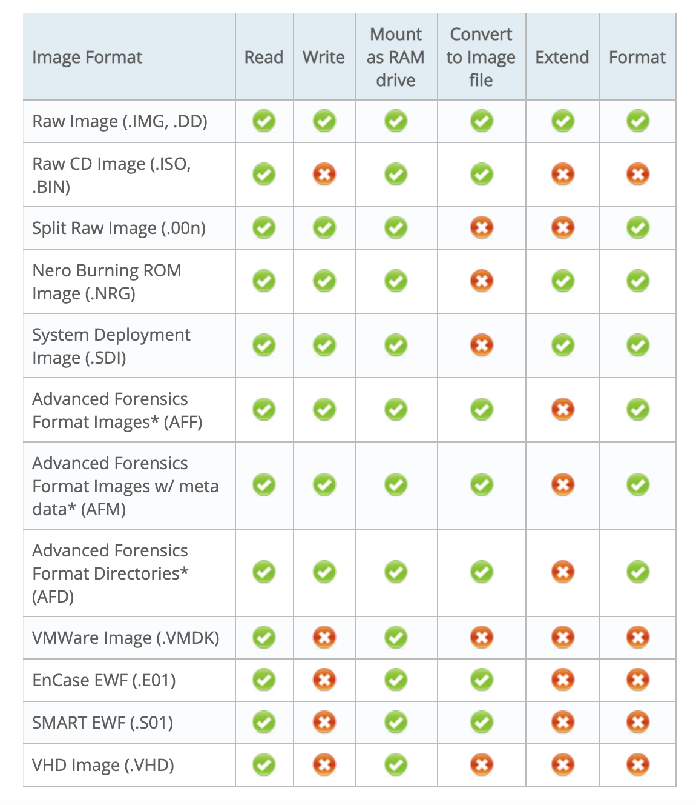
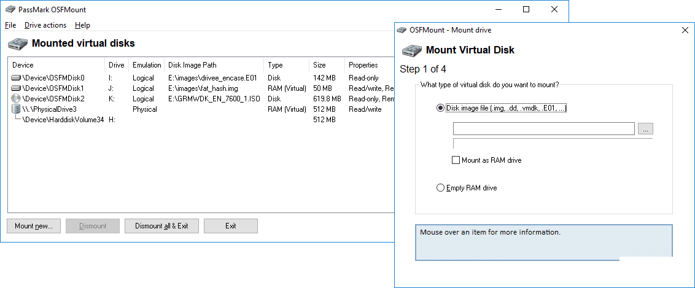
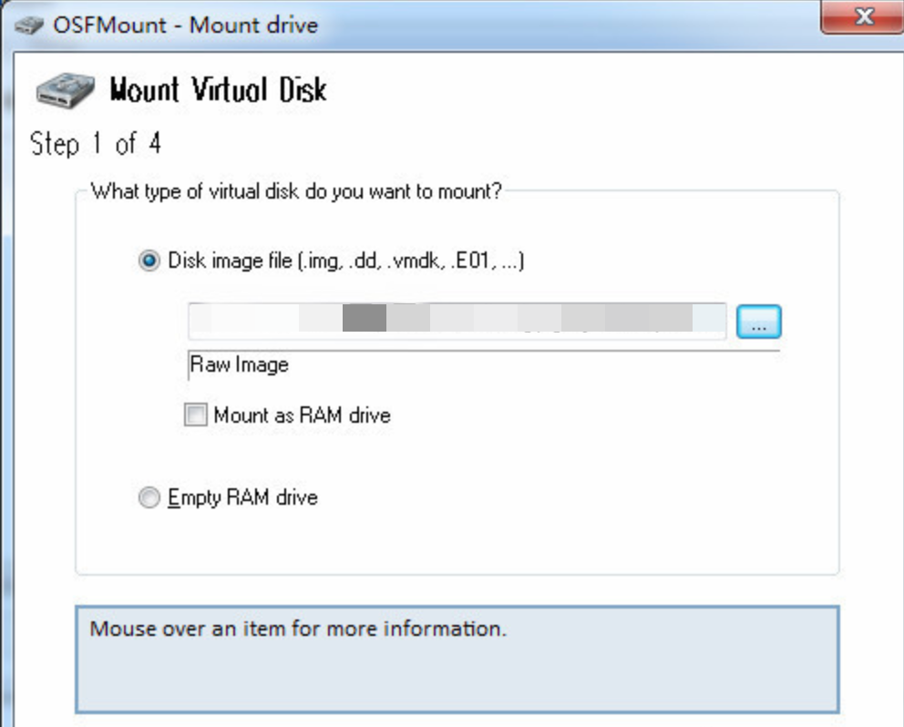
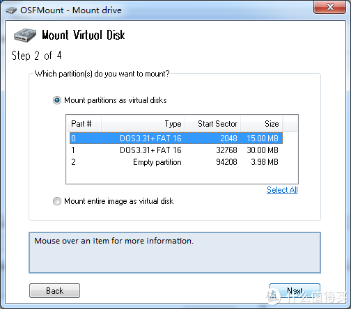
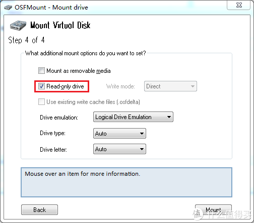
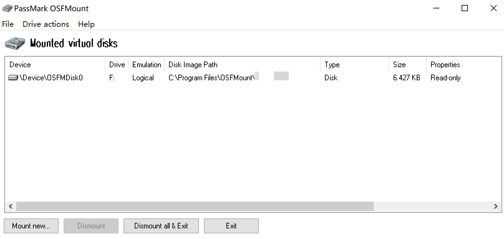

# 概况：

OSFMount允许将Windows中的本地磁盘镜像文件(整个磁盘或磁盘分区的逐位拷贝)作为物理磁盘或逻辑驱动器号挂载。然后，您可以使用PassMark OSForensics™来分析磁盘映像文件，方法是使用PassMark OSForensics™指定物理磁盘名称(例如，\\.\PhysicalDrive1)或逻辑驱动器号(例如:Z:)。

默认情况下，映像文件被挂载为只读，因此原始映像文件不会被更改。

OSFMount支持在“写缓存”模式下以读写方式挂载磁盘镜像文件。它将所有的写操作存储到一个“写缓存”(或“增量”)文件中，该文件保存了原始磁盘映像文件的完整性。

OSFMount还支持创建RAM磁盘，基本上就是挂载到RAM中的磁盘。这通常比使用硬盘有很大的速度优势。因此，这对于需要高速磁盘访问的应用程序非常有用，比如数据库应用程序、游戏(如游戏缓存文件)和浏览器(缓存文件)。第二个好处是安全性，因为磁盘内容不是存储在物理硬盘上(而是存储在RAM中)，并且在系统关闭时，磁盘内容不是持久的。在撰写本文时，我们相信这是目前最快的RAM驱动软件。

OSFMount支持以.iso格式挂载CD的映像，当经常使用特定的CD并且访问速度很重要时这很有用。  

# 特性

- 支持的高级取证格式的版本是AFFv3与zlib压缩支持。不支持加密和签名。

# 下载

官方下载地址https://www.osforensics.com/tools/mount-disk-images.html

# 运行环境

Win 7 SP1, Win 8, Win 10

Windows Server 2008, 2012 (Windows Server 2016有问题)

64位支持(对于32位支持，请使用OSFMount v2)

用户必须具有管理员权限。

RAM: 1GB(挂载大磁盘映像时，RAM越多越好)

硬盘空间:15mb可用硬盘空间用于安装文件。

# 支持镜像

- 原始RAM镜像如dd
- CD镜像如iso

Ø 这里尝试E01镜像，注意耐心等待镜像制作完成（测试中发现存在后台延迟完成，前端显示完成情况），并且使用OSFMount挂载打开。（20200415验证发现当镜像制作中断或因磁盘空间不足导致中断都将，导致E01镜像无法挂载，并且E01的镜像是分很多小块保存的，测试中使用accessData FTK Imager无法挂载，但是OSFMount挂载成功）

# 使用

## 使用OSFMount挂载镜像

点击mount now

选择镜像挂载

这里选择选择readonly

点击mount即可

