官网 https://www.diskgenius.cn/

DiskGenius有免费版、标准版与专业版三个版本状态（[功能对比](https://www.diskgenius.cn/pro/details.php)）。三个版本共用同一个发行包，不必分别下载。

下载后，即可立即使用免费版DiskGenius；注册后，可自动升级为标准版或专业版。

# 下载

https://www.diskgenius.cn/download.php

# 软件教程

https://www.diskgenius.cn/help/

帮助手册离线版[https://www.diskgenius.cn/help/DiskGenius%20%E7%94%A8%E6%88%B7%E4%BD%BF%E7%94%A8%E6%89%8B%E5%86%8C.pdf](https://www.diskgenius.cn/help/DiskGenius 用户使用手册.pdf)

# 使用方法

## 使用DiskGenius恢复数据

当计算机内的文件被有意无意的删除、或遭到病毒破坏、分区被格式化后，若想恢复这些已丢 失的文件，均可使用本功能。实际上，操作系统在删除文件时，只是将被删除文件打上了“删除标 记”，并将文件数据占用的磁盘空间标记为“空闲”。文件数据并没有被清除，还静静地“躺”在 磁盘上。只要删除文件后没有建立新的文件，操作系统没有写入新的数据，这些被删除的文件数据 就不会被破坏，就有机会通过一定的技术手段将它们“抢救”出来。 

格式化操作执行时并不会考虑磁盘上原来的数据内容，也不会先删除旧文件。不同的文件系统 类型，格式化的具体操作内容也不同。对于 FAT32、FAT16、FAT12 等文件系统，格式化时会清除 文件分配表(简称 FAT，固定位于分区的开始部分，含有文件数据的定位信息)及根目录。文件数据 一般不会被清除。对于 NTFS 文件系统，格式化时新写入的数据没有固定位置要求，但正常情况下 每次格式化时的写入位置不会变化。因此旧文件数据大多不会被覆盖，仍存在大量残余信息供我们 找到丢失的文件。

本功能就是通过分析残留在磁盘上的文件的部分信息来重新找到文件数据及文件夹的层次结 构，从而达到恢复文件数据的目的。 

对于整个分区已经丢失的情况，请首先参阅“搜索已丢失分区(重建分区表)”功能，先搜索到 丢失的分区。然后可以在保存分区表后、或在不保存分区表的情况下再利用“文件恢复”功能恢复 分区内的文件。 

分区被破坏的表现有：在“我的电脑”中打开分区时系统提示“未格式化”“需要格式化”， 分区属性显示为“RAW”，打开分区后看不到任何文件。遇到这些情况时，都可以通过“误格式化 后的文件恢复”功能来恢复文件。

本功能支持 NTFS、exFAT、FAT32、FAT16、FAT12、EXT4、EXT3、EXT2 等文件系统类型 的磁盘分区、支持使用这些文件系统格式的硬盘、移动硬盘、RAID 卷、U 盘、存储卡(如数码相机 中的 SD 卡、XD 卡等等)、虚拟磁盘。 

为保护正在恢复的分区不被再次破坏，本软件在搜索分区内的文件时，会采用只读模式，不会 向分区写入任何数据。 

要开始恢复文件，首先选择丢失文件所在的分区，然后点击工具栏“恢复文件”按钮，或点击 主菜单“工具”中的“已删除或格式化后的文件恢复”菜单项，以打开文件恢复对话框。如下图：

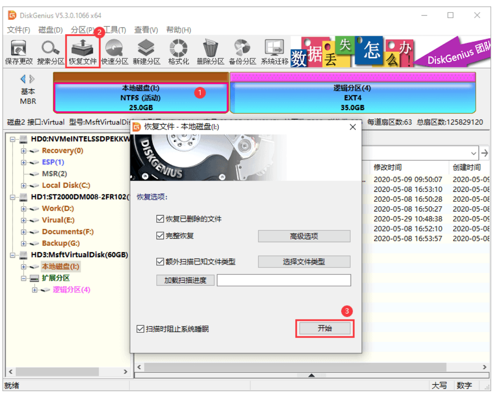

由于格式化后的文件恢复与文件正常删除后的恢复过程不同，我们将这两种情况分别处理。下 面是具体的操作方法：

### 一、恢复已删除的文件： 

如果确定文件是删除的，在恢复文件对话框中选择“恢复已删除的文件”。 如果在文件被删除之后，文件所在的分区有写入操作，则最好同时勾选“额外扫描已知文件类 型”选项，并点击“选择文件类型”按钮设置要恢复的文件类型。勾选这个选项后，软件会扫描分 区中的所有空闲空间，如果发现了要搜索类型的文件，软件会将这些类型的文件在“所有类型”文 件夹中列出。这样，如果在删除之前的正常目录中找不到删除过的文件，就可以根据文件扩展名在 “所有类型”里面找一下。

很多情况下，即使刚刚删除的文件，通过普通的删除恢复功能也无法找回。这是因为已删除文 件的重要信息被操作系统或用户的误操作破坏了。这种导致二次破坏的操作往往是在不经意间发生 的。比如在误删除了一些照片文件后，马上打开“资源管理器”在各个目录中找寻刚刚删除的文件 并使用了Windows的缩略图预览功能。恰恰是这样的操作就足矣破坏已删除文件的大量重要信息。 因为缩略图预览功能会在文件夹下面生成缩略图缓存文件。类似的不经意操作有很多。在这种情况 下，必须通过“扫描文件类型”的方式来恢复文件。虽然通过这种方式找到的文件，文件名是用序 号来命名的，但仍然可以通过预览功能、或者复制出来后打开确认。特别是对于恢复照片及 Office 文档时非常有效。 

由于扫描文件类型时速度较慢(需要扫描所有空闲扇区)，建议先不使用这个选项，用普通的方 式搜索一次。如果找不到要恢复的文件，再用这种方式重新扫描。 

点击“开始”按钮以开始搜索过程：

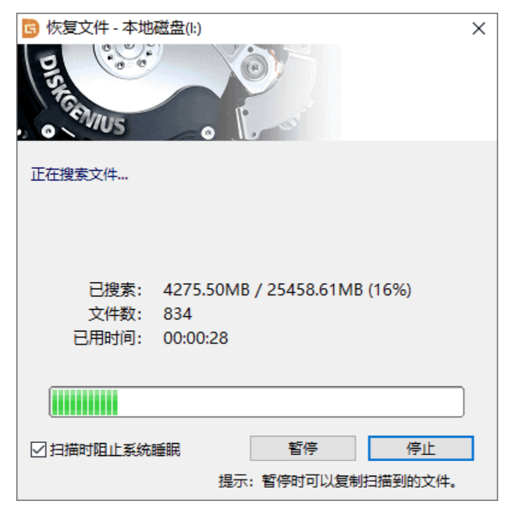

搜索完成后，恢复文件对话框自动关闭。程序主界面将显示搜索到的文件，每个丢失的文件或 文件夹前面都有一个复选框，左侧的文件夹层次图中的条目也加上了复选框。见下图。

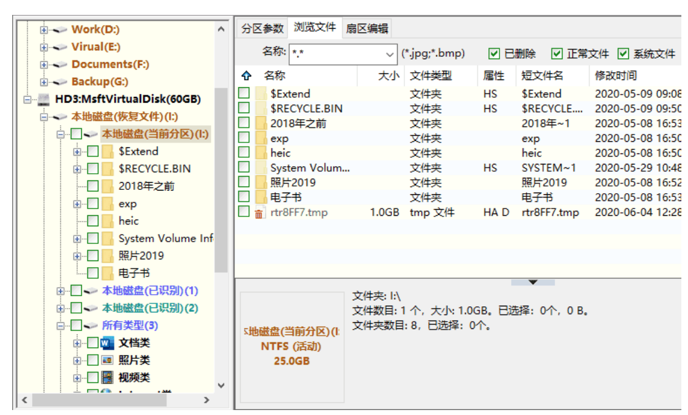

对于不能确定归属的文件及文件夹，程序将它们统一放到一个叫做“孤立的文件”的内存文件 夹中。如果在原位置找不到要恢复的文件，可以尝试在“孤立的文件”文件夹中查找文件。恢复后 查找文件时不要忘了这个文件夹，很可能要恢复的重要文件就在这里。

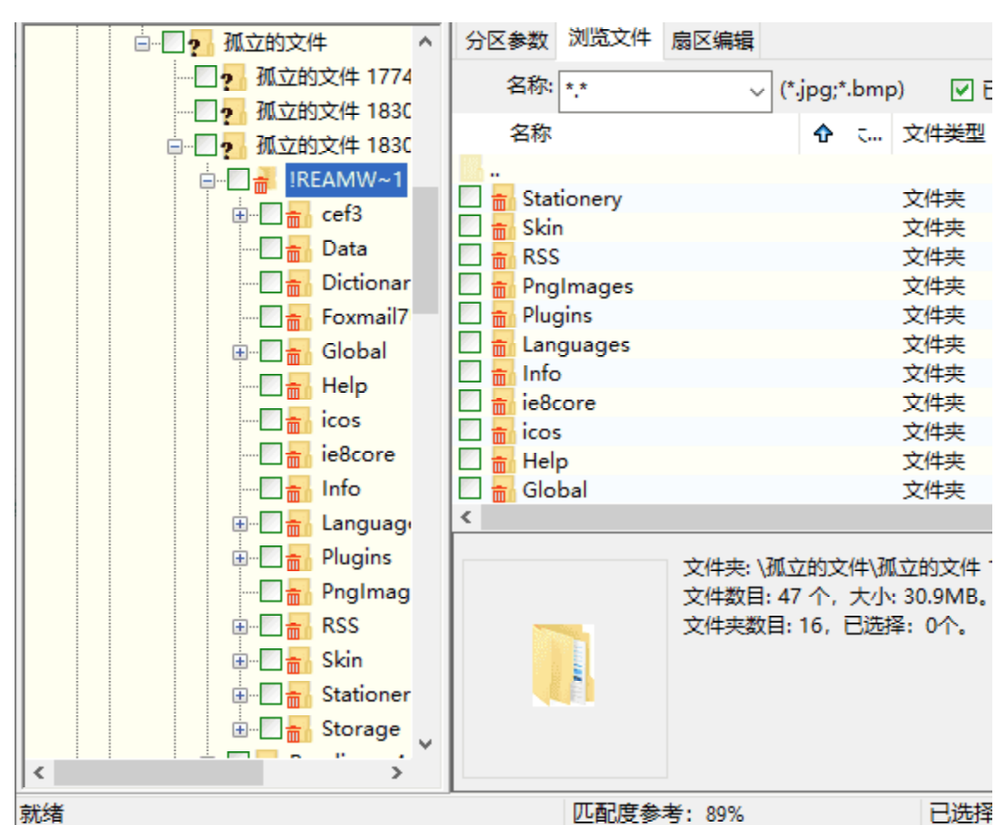

在恢复文件的状态下，文件列表中的“属性”栏将给已删除文件增加两个标记“D”和“X”。 “D”表示这是一个已删除的文件。“X”表示这个文件的数据可能已被部分或全部覆盖，文件数据 完全恢复的可能性较小。

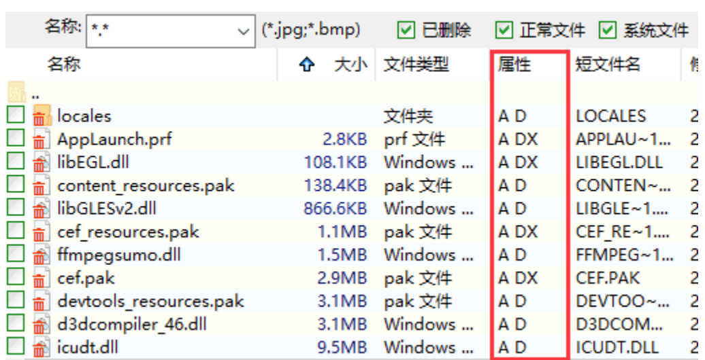

在扫描完成的界面中，会出现“红色删除标志”与“绿色删除标志”。“红色删除标志”表示 文件或文件夹是被删除的，“绿色删除标志”表示文件夹中含有删除的文件或文件夹。如下图所示：

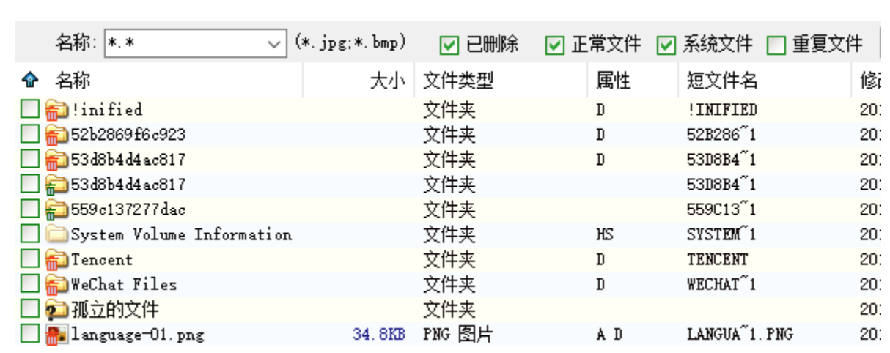

为方便用户识别搜索到的文件，软件默认情况下也会显示未被删除的正常文件，只是正常文件 没有复选框，不可选择。

要恢复搜索到的文件，请通过复选框选择要恢复的文件。然后在文件列表中点击鼠标右键，或 打开“文件”主菜单，选择“复制到指定文件夹”菜单项。

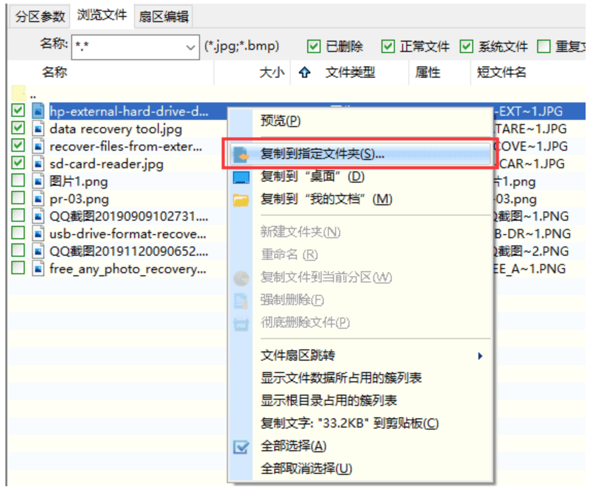

接下来选择存放恢复后文件的文件夹，点击“选择文件夹”按钮，程序会将当前选择的文件复 制到指定的文件夹中。为防止复制操作对正在恢复的分区造成二次破坏，本软件不允许将文件恢复 到原分区。

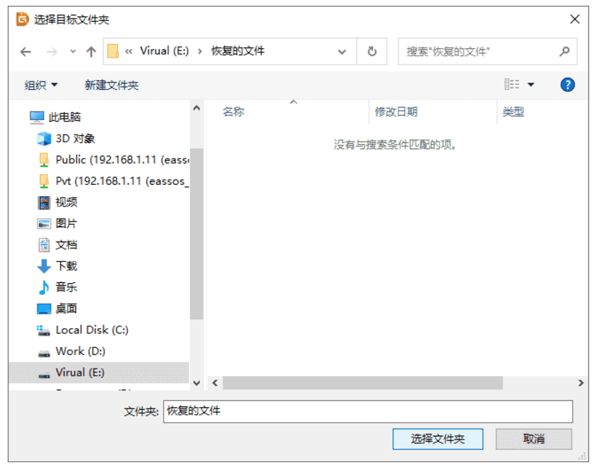

点击“完成”按钮，关闭文件复制对话框，程序自动清除已复制的文件的选择状态。以准备选 择其它文件。

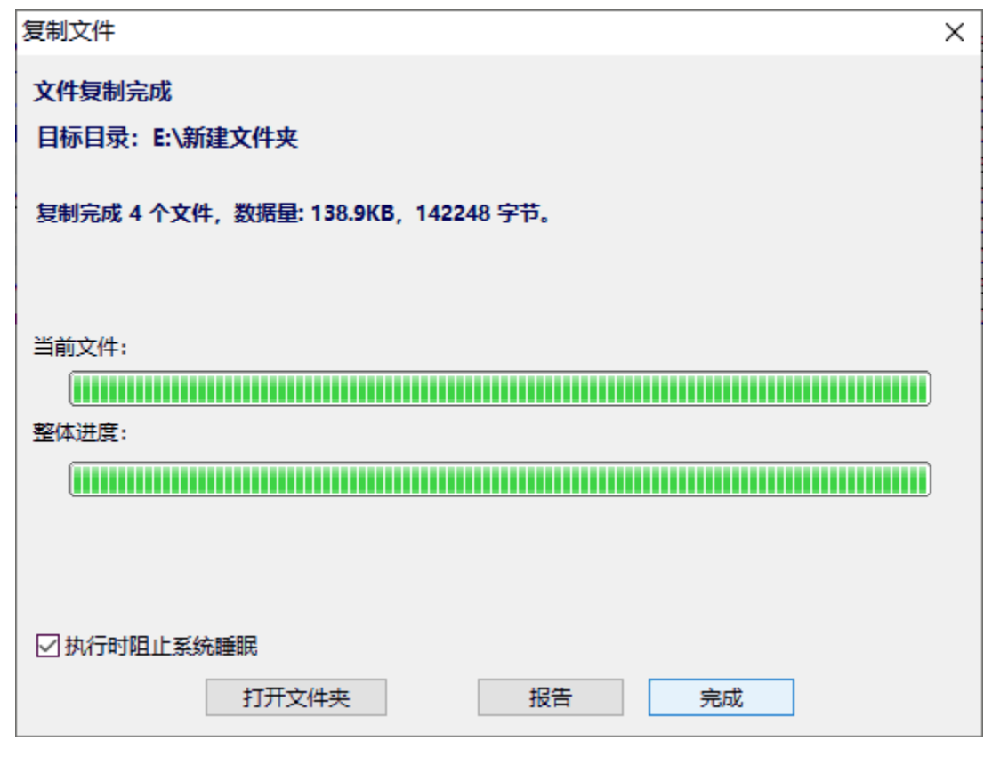

当所有要恢复的文件都复制出来后。可以通过“分区 - 重新加载当前分区”菜单项释放当前 分区在内存中的暂存数据，并从磁盘加载当前分区，显示分区的当前状态。

### 二、完整恢复： 

适用于分区被格式化，或是分区被破坏打不开的情况，如：在“我的电脑”中打开分区时系统 提示“未格式化”、“需要格式化”，分区属性显示变为“RAW”，打开分区后看不到任何文件。 这时软件会默认选择选择“完整恢复”，而“恢复已删除的文件”默认为不勾选的状态。用“完整 恢复”的同时建议勾选“额外扫描已知文件类型”选项，并点击“选择文件类型”按钮设置要恢复 的文件类。勾选这个选项后，软件会在正常扫描的同时根据特定文件类型的文件头数据恢复指定类 型的文件。恢复完成后，将所有找到的文件类型，按类型扩展名划分目录，整理到一个单独的虚拟 “分区”中。除搜索速度稍慢外，不影响正常恢复，但能恢复更多的文件。

### 三、恢复已删除的文件 与 完整恢复 同时选择： 

打开“恢复文件”功能默认情况下是两个功能都选择，如果自己不确定文件丢失的情况下，建 议两个都勾选。这个功能是先扫描删除的文件再扫描全盘。扫描的同时最好勾选“额外扫描已知文 件类型”选项，并点击“选择文件类型”按钮设置要恢复的文件类型。勾选这个选项后，软件会在 正常扫描的同时，根据特定文件类型的文件头数据恢复指定类型的文件。恢复完成后，将所有找到 的文件类型，按类型扩展名划分目录，整理到一个单独的虚拟“分区”中。除搜索速度稍慢外，不 影响正常恢复，但能恢复更多的文。 

点击“开始”按钮以开始搜索过程。该恢复方式的搜索时间较长。接下来的操作步骤和“恢复 误删除文件”过程相同。参照上面的方法选择与复制文件即可。

## 保存文件恢复进度

在恢复数据的时候，如果丢失数据的分区或硬盘空间很大，通常会需要比较长的时间进行扫描。

用户可以将扫描进度进行保存，这样如果软件被关闭了，可以加载之前的恢复进度，无需再从头开

始扫描，节约时间。

本软件在搜索文件的时候会自动保存进度，但是，如果本软件位于扫描范围内，软件将不会

自动保存扫描进度，以免产生不必要的写入操作。遇到这种情况，用户可以手动保存恢复进度。

### 一、保存文件恢复进度

1. 扫描结束后，点击“工具”菜单，然后选择“保存文件恢复进度”选项。

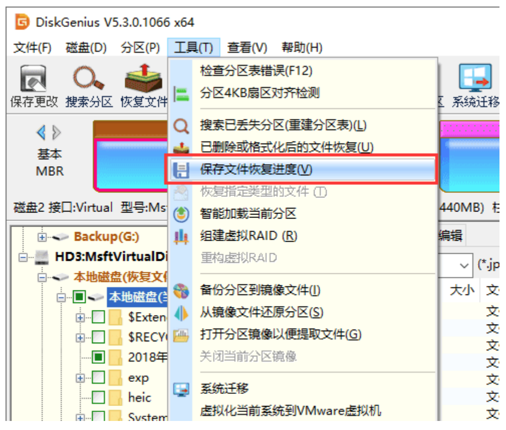

1. 选择保存路径并为文件命名，然后点击“保存”按钮。
   提醒：扫描进度文件的扩展名是“.dgrp”，软件自动保存的进度文件是存放在软件所在的文
   件中。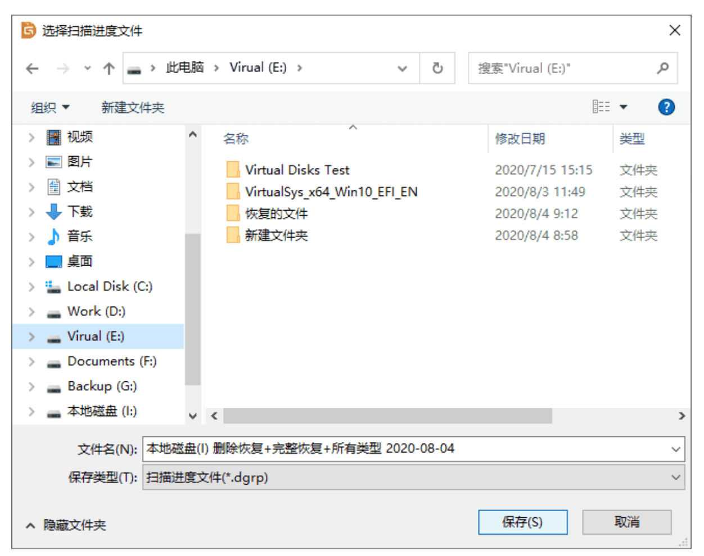

### 二、加载恢复进度

1. 选中之前扫描并保存过恢复进度的分区，然后点击“恢复文件”按钮。
2. 在恢复文件窗口上点击“加载扫描进度”按钮。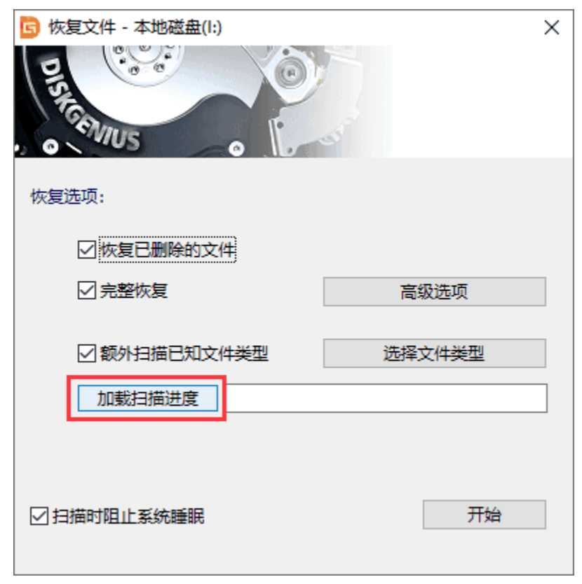
3. 选中自己保存的扫描进度文件，然后点击“打开”按钮。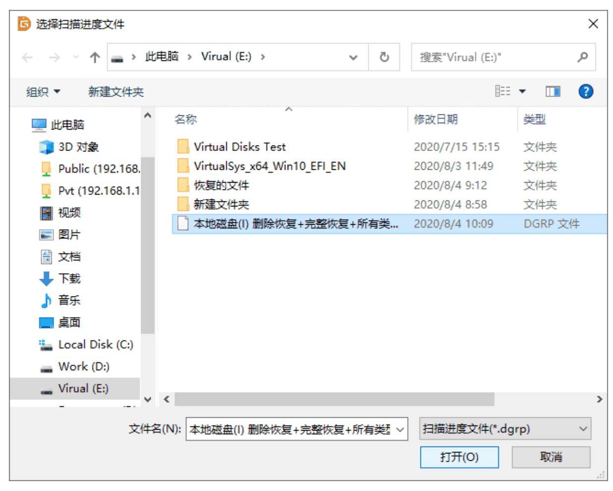
4. 点击文件恢复窗口上的“开始”按钮，软件开始加载之前的扫描进度。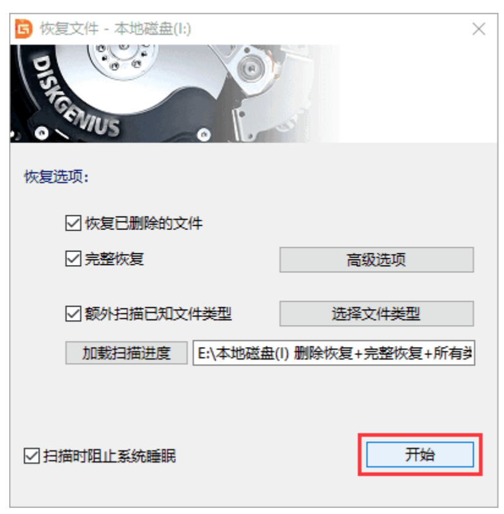

## 按指定文件类型恢复文件 

有时，分区内数据毁坏的比较严重，按普通的恢复模式，效果不好。这时可以尝试按指定文件 类型恢复文件。 

DiskGenius 按指定文件类型恢复文件的功能非常强大，支持的文件类型有 100 多种，恢复的 效果好，使用起来也非常方便。 

DiskGenius 有两种按指定文件类型恢复文件的方式，在误删除或误格式化后的文件恢复恢复 模式中，DiskGenius 已经提供了附加的按文件类型搜索文件的功能，并在搜索结果中，显示了按文 件类型搜索出来的文件列表；此外，DiskGenius 专门提供了一种直接输出文件的按类型恢复文件的 模式，这种恢复模式，比前一种，更加灵活。比如可以搜索空闲区域，可以指定文件数据的对齐位 置等。

1. 使用按指定文件类型恢复模式恢复文件，从主菜单中选择 "工具" - "恢复指定类型的文件"

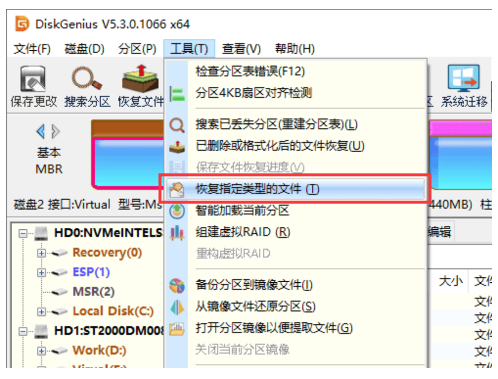

1. 在接下来的弹出窗口中，用户可以对恢复模式的一些参数进行设置。比如可以只恢复空闲簇，适用于误删除、或分区被部分覆盖等情况。

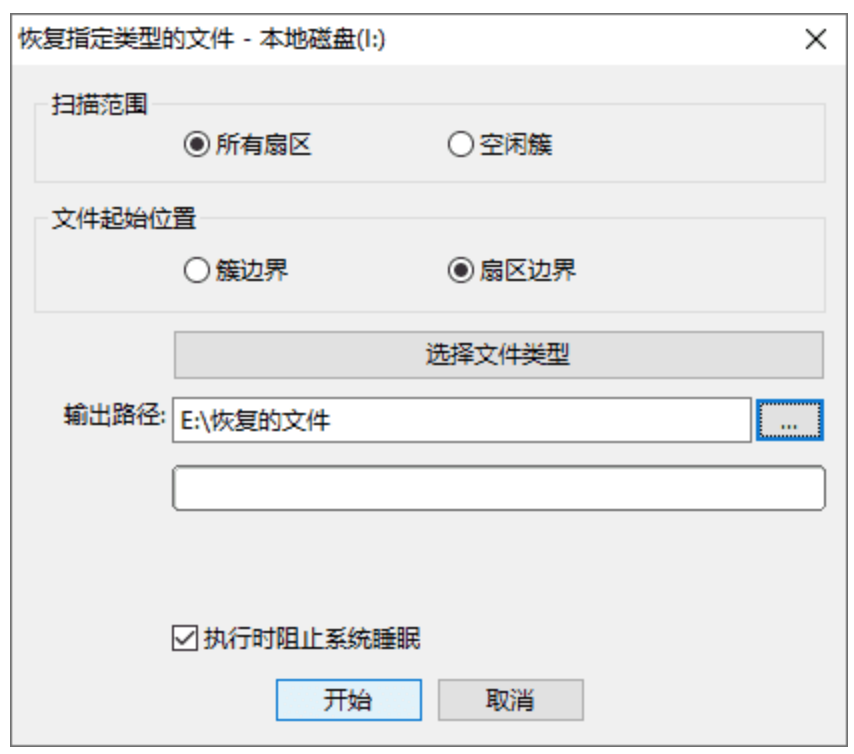

1. 点击"选择文件类型"按钮，可以设置本次搜索的特定文件类型，默认是搜索所有的文件类型，可以设置为只搜索一部分文件类型。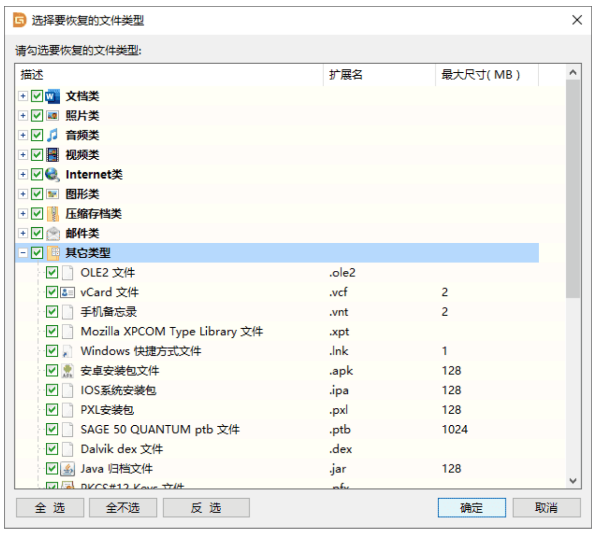
2. 搜索完毕后，被搜索到的文件按文件类型分类，每种文件类型有一个或多个以该文件类型 名命名的文件夹，每个文件夹中的文件数最大为 1000。 用这种模式搜索出来的文件，其文件名会丢失，DiskGenius 是按顺序号为这些文件命名的， 要想判断这里面有没有您需要的文件，您可以通过文件大小等方面，结合文件预览功能，逐一打开 预览来判断。