近期在应急数据恢复场景，客户使用Hyper-V运行业务系统，由于没有设置快照，在误操作下恢复了虚拟机，导致数据丢失，因此客户需求需要将数据恢复。用过很多方式最后这个好用，这里作为记录归档。

R-studio network官网https://www.r-studio.com/

破解版：https://www.52pojie.cn/forum.php?mod=viewthread&tid=1431679&highlight=R-studio%2Bnetwork

# 软件使用

## 使用R-STUDIO查找删除的文件

这里使用的是parallels虚拟机环境，对win10虚拟机进行的文件恢复扫描。

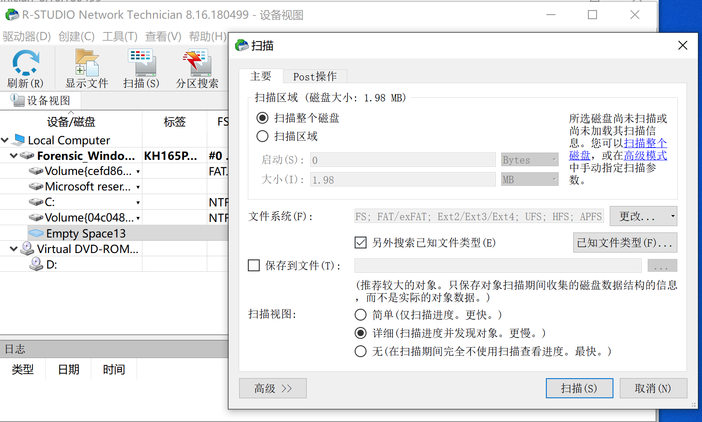

可以看到扫描结束，整个60G扫描用了2分钟。

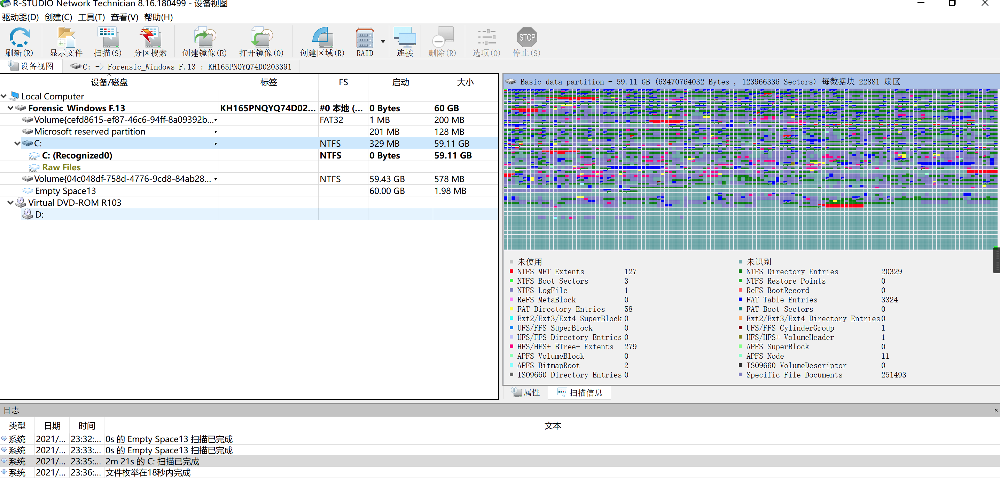

查看发现的文件，基本上和DS、360数据恢复类似的操作，根据需要选择恢复即可，恢复机会代表一定的准确性，可以尝试恢复想恢复的文件。

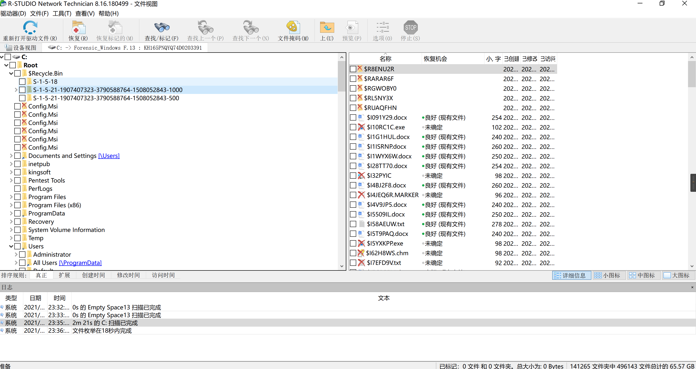

最后这里尝试使用破解版的远程恢复功能，这里有个前情，下面的软件介绍里也可以看到，正版软件原则是带有agent放在被恢复主机中的，agent部署需要序列号，但是我们下载的破解版没有agent，但是看到有等待从远程计算机链接的功能。那么我们有没有可能host和远程主机都打开RSTUDIO，host选择指定IP连接，远程主机选择监听，实现host到远程主机的连接？

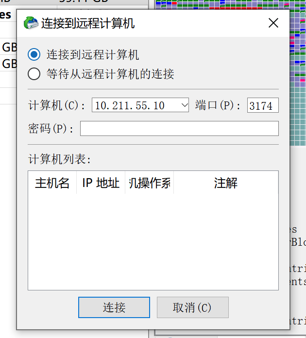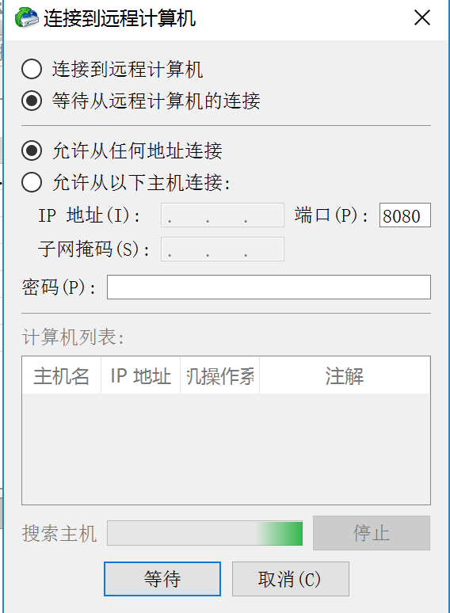

测试发现未成功，所以这个远程恢复功能还有待发掘。

# 软件介绍

1.采用Windows资源管理器操作界面；通过网络恢复远程数据（远程计算机可运行Win95/98/ME/NT/2000/XP、Linux、UNIX系统）
2.支持FAT12/16/32、NTFS、NTFS5和Ext2FS文件系统；能够重建损毁的RAID阵列；为磁盘、分区、目录生成镜像文件
3.恢复删除分区上的文件、加密文件（NTFS5）、数据流（NTFS、NTFS5）
4.恢复FDISK或其它磁盘工具删除过得数据、病毒破坏的数据、MBR破坏后的数据
5.识别特定文件名；把数据保存到任何磁盘；浏览、编辑文件或磁盘内容等等！

通过网络进行数据恢复是 R-Studio 最强大、最有用的功能之一。通常，数据恢复需要物理移除硬件或本地安装已注册的数据恢复软件包。使用 R-Studio 网络数据恢复，您可以放弃这两个要求。使用安装了 R-Studio 的本地计算机和安装了 R-Studio Agent 的远程计算机，您可以通过网络连接在目标计算机上执行完整的数据恢复。

这两个程序通过任何网络连接进行交互——无论是全球公司网络、小型局域网，还是直接连接两台计算机的以太网电缆。连接后，可以恢复来自远程计算机的数据，就像磁盘直接连接到本地计算机一样。您可以在远程计算机上执行文件恢复、磁盘映像，甚至数据编辑。大文件数据集的处理可以完全在远程计算机上完成，无需通过网络传输。例如，可以将恢复的文件和磁盘映像保存到远程计算机的磁盘上，而无需将它们传输到本地计算机。

R-Studio 网络软件包专为在企业环境中频繁使用网络数据恢复功能集而设计。但是在演示版中可以使用某种程度的网络数据恢复功能，并且也可以使用单个 R-Studio 许可证。升级到 R-Studio Network 许可证的价值取决于您的特定需求。

通过网络进行数据恢复在以下情况下最有效：

1. 当计算机位于远程或难以访问的地方，并且访问其文件的唯一方法是通过网络连接到它时。
2. 当本地计算机具有不常见的硬件或软件配置，并且很难或不可能在本地安装 R-Studio 或使用 R-Studio Emergency 时。

1. 当很难或不可能从计算机中取出磁盘并将其直接连接到安装了 R-Studio 的计算机时。

在所有情况下，目标计算机的硬件都应该是可操作的，并且操作系统应该可以正常运行且可启动。如果计算机无法启动，但硬件未损坏，则可以使用 R-Studio Agent Emergency。R-Studio Agent Emergency 允许您访问无法启动计算机的硬盘，前提是没有潜在的物理硬件问题。有关在无法启动的计算机上执行网络数据恢复的更多信息，请参阅我们的文章[“通过网络进行紧急数据恢复”。](https://www.r-studio.com/emergency-data-recovery-over-network.html); （对于本地紧急恢复，请阅读我们的文章[“使用 R-Studio Emergency 进行紧急文件恢复”](https://www.r-studio.com/Emergency_File_Recovery.shtml)）。

**充分利用您的 R-Studio 许可**
R-Studio 和 R-Studio Agent 提供多种不同的许可包：R-Studio、R-Studio Network 和 R-Studio Technician。这些软件包旨在为您提供适当数量的 R-Studio 许可证，同时保持经济实惠。对于任何 R-Studio 软件包，如果您决定稍后升级，您可以将初始许可费用用于 R-Studio 网络或 R-Studio 技术人员许可。

R-Studio 和 R-Studio Agent 可用于所有主要操作系统：Windows、Mac OS X 和 Linux。无论安装的操作系统如何，R-Studio Agent Emergency 都在预引导环境中工作。

|                        | 创建图像文件 | 扫描磁盘和预览文件 | 保存恢复的文件 | 网络数据恢复 | 可转让许可和商业用途 |
| ---------------------- | ------------ | ------------------ | -------------- | ------------ | -------------------- |
| R-Studio 演示版        | 是的         | 是的               | 不             | 不           | 不                   |
| R-Studio（单一许可证） | 是的         | 是的               | 是的           | 不           | 不                   |
| R-Studio 网络          | 是的         | 是的               | 是的           | 是的         | 不                   |
| R-Studio 技术员        | 是的         | 是的               | 是的           | 是的         | 是的                 |

## R-STUDIO

基本且最实惠的 R-Studio 软件包用于 R-Studio 的单个本地副本。

独立的 R-Studio 许可证对于家庭用户、一次性数据恢复方案或小型企业来说最具有经济意义。通常，购买单个 R-Studio 许可证以在一台机器上执行本地数据恢复操作。但如果与演示版 R-Studio Agent 结合使用，即使您没有购买 R-Studio 网络许可证，您也可以通过网络执行数据恢复。

在演示模式下，R-Studio 和 R-Studio Agent 都允许您执行所有数据恢复操作；唯一的限制是不能通过网络保存超过 256KB 的文件。要执行完整的数据恢复，您可以将注册的 R-Studio 副本与安装在远程计算机上的演示版 R-Studio Agent 结合使用。使用 R-Studio，您可以在演示模式下连接到运行 R-Studio Agent 的远程计算机，并创建远程计算机的磁盘映像并将其保存到连接到远程计算机的外部驱动器。然后，您可以将磁盘映像传输到安装了 R-Studio 注册副本的计算机，并对磁盘映像执行完整的数据恢复。

虽然这不是真正的网络数据恢复，但这将允许您从联网计算机恢复数据，而无需购买 R-Studio 网络许可证。尽管创建和传输磁盘映像不如通过网络恢复文件方便，但这种方法对于偶尔或孤立的数据恢复方案来说已经足够了。

请注意，单个 R-Studio 许可证不允许您使用此方法执行商业数据恢复服务。您只能将 R-Studio 用于您自己的家庭或企业。

## R-STUDIO NETWORK

R-Studio Network 许可包在公司或企业环境中最为有用。首先，企业级IT系统的计算机和服务器较多，因此数据丢失的风险较高。其次，较大的公司通常拥有具有不常见硬件配置或服务协议的计算机和系统，这使得在技术或逻辑上难以访问机箱内的硬盘驱动器。第三，企业 IT 部门经常管理多个地理位置的计算机，远程办公地点的计算机可能需要数据恢复。

这些因素相结合，证明对 R-Studio 网络许可证进行额外投资是合理的。R-Studio Network 允许您在发生数据丢失之前制定数据恢复策略，并允许您快速有效地响应每个事件，同时最大限度地减少（或消除）站点到站点的旅行量。

使用 R-Studio 网络包，除了 R-Studio 的许可证之外，您还可以获得 R-Studio Agent 或 R-Studio Agent Emergency 的五个许可证。R-Studio Agent 和 R-Studio Agent Emergency 许可证不可在机器之间转让。当您在计算机上注册 R-Studio Agent 的副本时，它会绑定到该设备 - 您无法在恢复数据后从该机器卸载它，然后将其安装在另一台机器上。但是，您可以在同一台机器上的 R-Studio Agent、R-Studio Agent Portable 和 R-Studio Agent Emergency 之间传输许可证。例如，您可以在无法启动的机器上临时使用 R-Studio Emergency，然后在该机器再次运行时在该机器上安装 R-Studio Agent 的注册副本。

使用五个许可证的最有效方法是在网络上最关键的计算机上预安装 R-Studio Agent。物理或地理上难以访问或具有独特硬件配置的计算机是预安装 R-Studio Agent 副本的理想选择。这使您可以在机器上执行完整的网络数据恢复，而无需在其上安装新软件，否则可能会覆盖未恢复的数据。

剩余的许可证可以根据需要保留用于部署在设备上，或者安装在指定用于网络上数据恢复的计算机上。可以使用 R-Studio 的未注册副本对目标计算机进行映像，然后可以使用另一台计算机上的注册副本分析和恢复数据。

以下是如何部署 R-Studio 网络许可证的两个示例：

示例 1. 公司网络中的服务器和计算机。
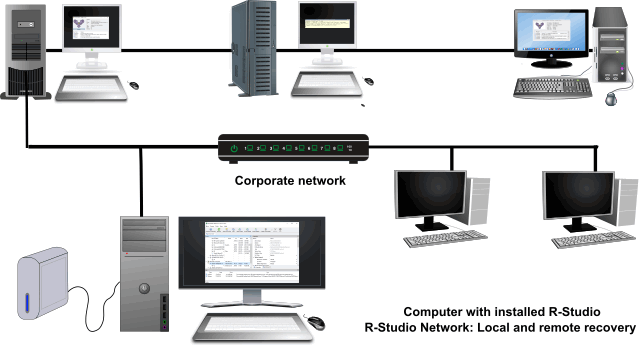

例如，R-Studio 安装在系统管理员工作站上。R-Studio Agent 预装在最关键的服务器上；R-Studio Agent Portable 可用于其余计算机。当发生数据丢失时，R-Studio 会立即连接到必要的计算机，并开始数据恢复过程。无需安装程序、重新启动计算机等。因此，覆盖丢失数据的风险最小。

在[“如何使用R-Studio的网络包”](https://www.r-studio.com/RStudio_Network_Package.shtml)。文章更详细地描述了 R-Studio 如何在企业网络中工作。

例 2. 从难以访问的计算机进行网络数据恢复（常规和紧急恢复）
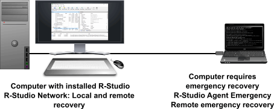

在某些情况下，由于无法轻松物理访问硬件，或者计算机可能处于服务状态，因此无法移除计算机的硬盘驱动器PC外壳密封且用户无法访问的协议。R-Studio Agent Portable 可以在目标机器上运行和注册，并且 R-Studio 可以连接到计算机以远程恢复数据，而无需物理访问其硬件。

请注意，尽管 R-Studio Network 包含更多许可证，但仍可能无法用于为客户执行商业数据恢复服务。R-Studio Network 只能用于您自己的组织。

## R-STUDIO TECHNICIAN

[R-Studio Technician](https://www.r-studio.com/Data_Recovery_Technician.shtml)专为向第三方客户提供服务的专业数据恢复公司而设计。但是，R-Studio 技术员许可证包也有利于内部使用。与 R-Studio Network 不同，R-Studio Technician 许可证可在组织内的计算机之间转移，只要同时安装注册副本的计算机数量不超过购买的许可证数量。这允许您在组织内部或外部的任何机器上临时安装注册副本。如果您为大量计算机提供服务或需要通过 Internet 执行数据恢复，这将特别有用。

通过网络进行
数据恢复的工作原理 要了解数据恢复网络如何与每个软件包的允许许可一起工作，有助于了解整个过程。

使用 R-Studio 通过网络恢复数据是一个三步过程：

1. 在远程计算机上启动和配置 R-Studio Agent。
2. 通过网络在 R-Studio 和 R-Studio Agent 之间建立连接。

1. 从远程计算机恢复数据，就像在该计算机上安装了 R-Studio 一样。

让我们来看看这个过程是如何与 R-Studio/R-Studio Agent 一起工作的。在整个过程中，您可以使用 R-Studio Agent、R-Studio Agent Portable 或 R-Studio Agent Emergency。我们将为每个应用程序提供详细信息。

### 1. 在远程计算机上启动并配置 R-Studio Agent。

启动 R-Studio Agent、R-Studio Agent Portable 或 R-Studio Agent Emergency

如果您使用的是 R-Studio Agent，请执行以下操作：

在远程计算机上安装并运行 R-Studio Agent。当 R-Studio Agent 启动时，其图标会出现在系统托盘中：

当 R-Studio Agent 启动时，它首先要求您输入注册号。您可以输入它或单击演示按钮继续。如果您选择演示模式，您可以稍后从安装了 R-Studio 的计算机上输入注册号。

如果您使用的是 R-Studio Agent Portable，您会将可执行文件复制到闪存设备并在远程计算机上运行。无需安装。如果远程计算机无法启动，请创建 R-Studio Agent 启动盘并使用 R-Studio Agent Emergency 启动您的计算机。（有关更多详细信息，请参阅 R-Studio 帮助：[使用 R-Studio Agent 紧急启动盘启动计算机](https://www.r-studio.com/Unformat_Help/bootingacomputerwithther-.html)）。

配置 R-Studio Agent/R-Studio Agent Portable
如果您使用 R-Studio Agent 或 R-Studio Agent Portable：
右键单击 R-Studio Agent 系统托盘图标并选择配置。输入此 R-Studio Agent 的密码和安装 R-Studio 的计算机的 IP 地址：
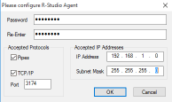

然后 R-Studio Agent 显示其主面板：
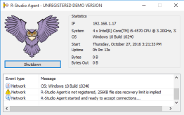

配置 R-Studio Agent Emergency：
如果您使用 R-Studio Agent Emergency，您可能需要输入 IP 地址和网络掩码。
如果您在网络上使用 DHCP，R-Studio Agent Emergency 会自动接收其 IP 地址。您将需要此地址才能将 R-Studio 连接到 R-Studio Agent Emergency。如果没有 DHCP，您必须手动输入 IP 地址和网络掩码。

### 2. 通过网络在 R-Studio 和 R-Studio Agent 之间建立连接。

在 R-Studio 主面板上，单击连接到远程按钮。选择网络上运行 R-Studio Agent 的计算机：
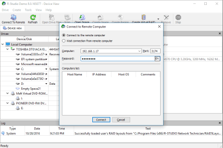

如果您要连接到 R-Studio Agent Emergency，您必须在计算机字段中输入该计算机的 IP 地址，将密码字段留空。如果远程计算机上的 R-Studio Agent 在演示模式下运行，则会出现一个对话框，要求您输入 R-Studio Agent 的注册码。您可以输入注册码以访问完整的数据恢复功能集，或单击演示按钮以继续在演示模式下运行 R-Studio Agent。在此模式下，R-Studio 可以执行除实际数据恢复外的任何操作（文件枚举和预览、磁盘扫描等）；恢复的文件无法保存到磁盘。

当 R-Studio 和 R-Studio Agent 连接时，远程计算机的驱动器和磁盘出现在 R-Studio 驱动器面板上：
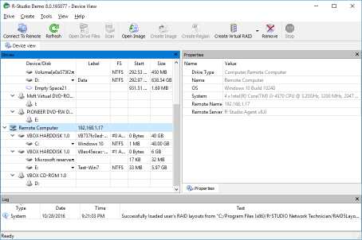

注意：如果您将 R-Studio 连接到 R-Studio Agent Emergency，驱动器面板将有不同的外观：
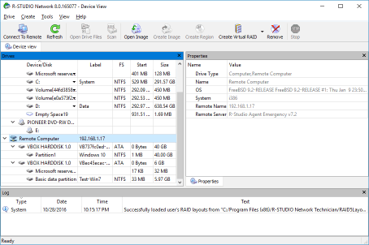

### 3. 从远程计算机恢复数据，就像在该计算机上安装了 R-Studio 一样。

从 R-Studio 计算机，您可以执行所有硬盘恢复操作，例如文件枚举和文件恢复：
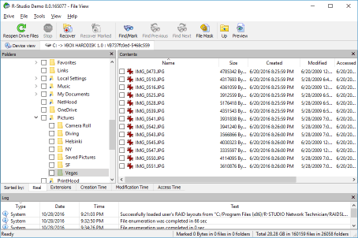

当“恢复”对话框出现时，您可以选择是要将恢复的文件保存在本地还是远程计算机上。通常，您不应将恢复的数据保存到正在从中恢复数据的同一个磁盘上。将新数据写入磁盘可能会在文件恢复之前覆盖文件。但是，如果您有另一个连接到远程计算机的健康磁盘（例如，外部 USB 硬盘驱动器），则将恢复的文件保存到该磁盘会非常有用。将恢复的文件保存到远程计算机上的磁盘可以使您不必通过网络传输大型文件集。它还有助于保护个人信息，因为数据永远不必离开用户的计算机。

预览文件以估计文件恢复机会：
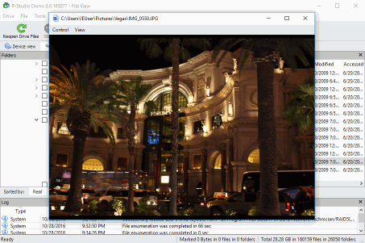

扫描远程计算机上的磁盘：
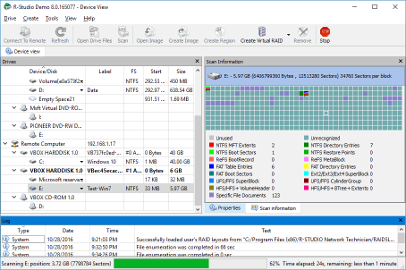

查看/编辑对象，在灾难恢复的情况下，例如：
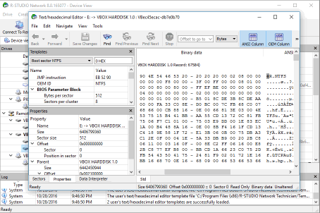

要与远程计算机断开连接，请在“驱动器”面板上选择远程计算机，然后单击“删除”按钮。
