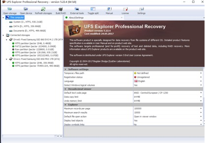
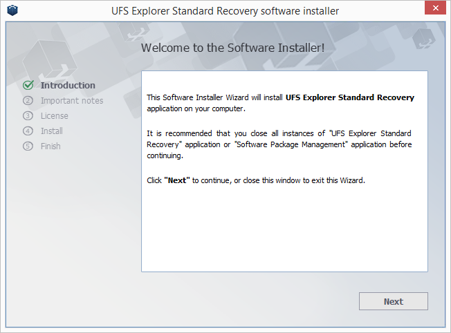
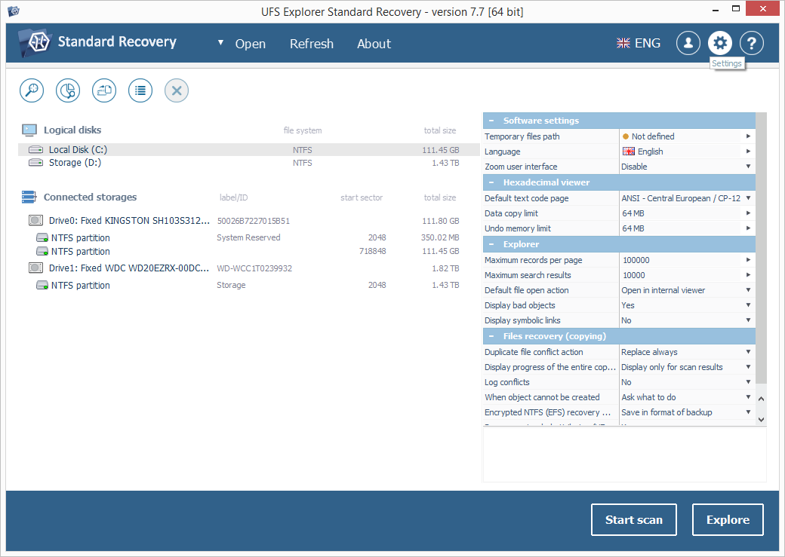
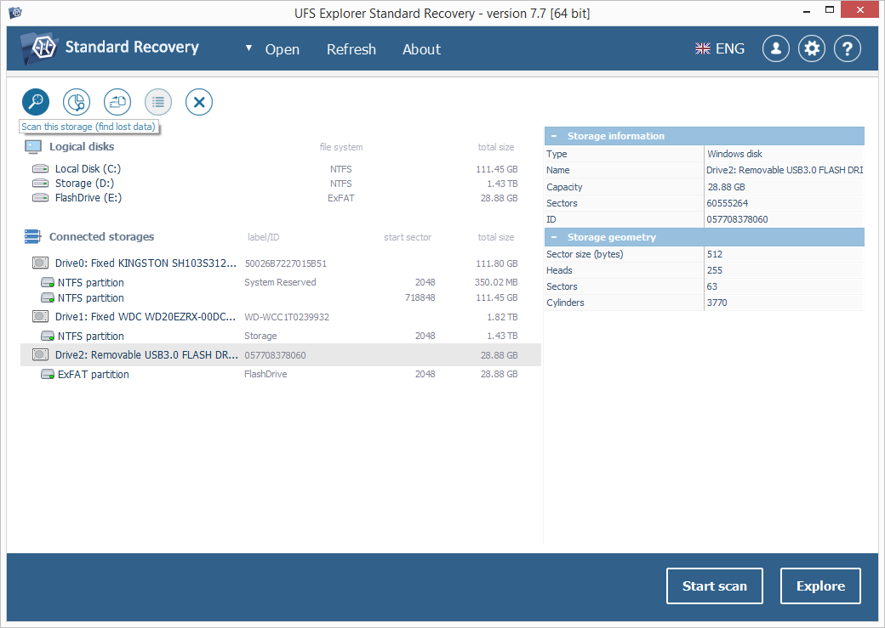
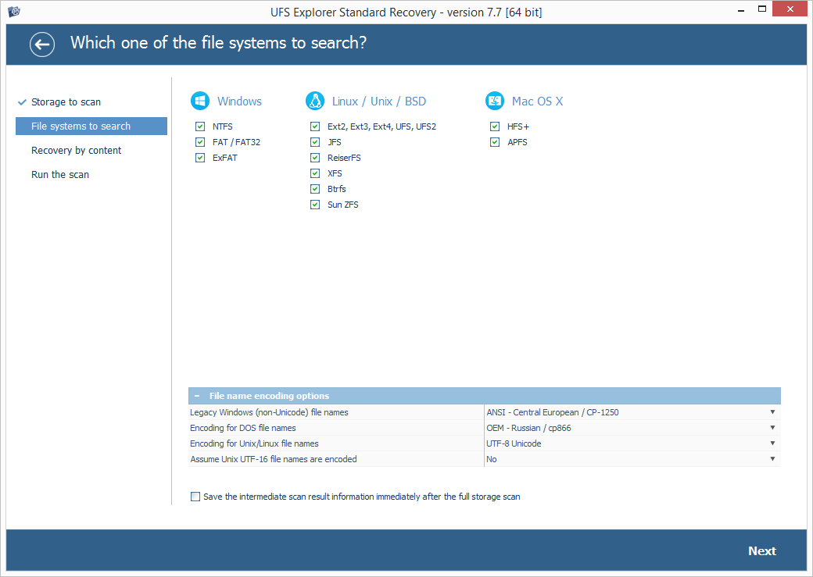
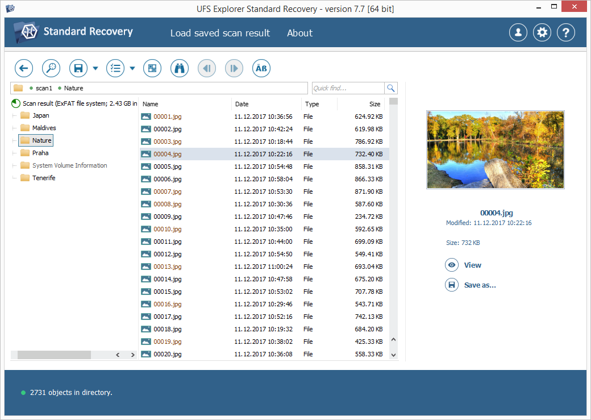
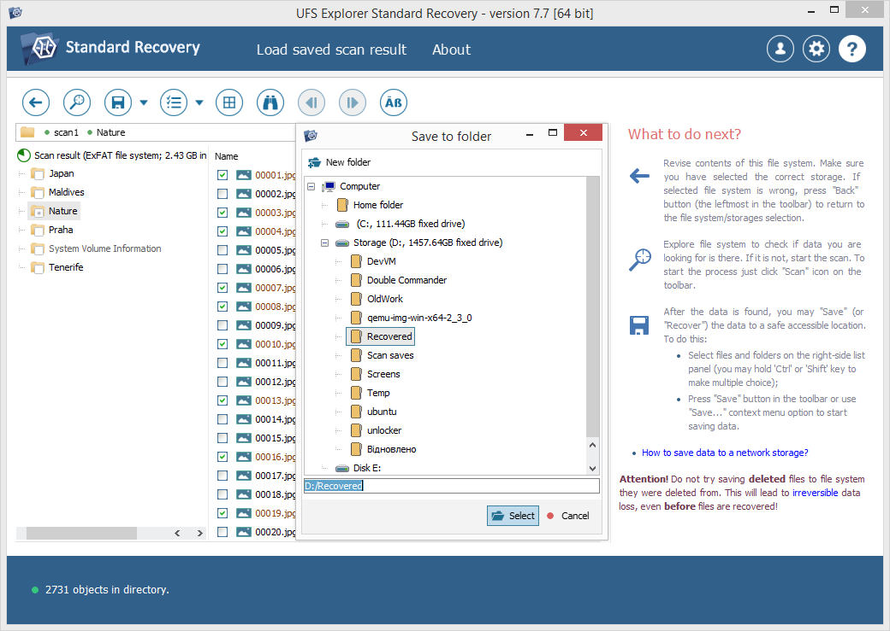

官网 https://www.ufsexplorer.com/ufs-explorer-professional-recovery.php

国内常见的支持E01镜像文件访问的软件主要有GetData Mount Image Pro、AccessData FTK Imager和OSFMount等。我们使用GetData Mount Image Pro将镜像文件映射为本地磁盘驱动，然后再将镜像文件中的操作系统加载到虚拟机上运行。

推荐使用ufs explorer professional recovery.( https://www.ufsexplorer.com/ufs-explorer-professional-recovery.php) 实测好用。

## 自述

UFS Explorer Professional Recovery是一款专家级软件工具，旨在解决高度复杂的数据恢复挑战。

除了线性电子媒体，如硬盘、u盘和存储卡，该程序处理基于RAID的各种布局的存储，包括标准的、嵌套的、自定义的和特定的配置- Drobo BeyondRAID、Synology Hybrid RAID、Btrfs-RAID和ZFS RAID-z。集成的解密算法可以打开用BitLocker、LUKS、FileVault 2和APFS加密的卷，而不必在操作系统中解锁它们。软件还支持许多文件系统用于Windows, Linux, macOS BSD,提供直接访问其内容,以及各种存储技术,包括Windows动态磁盘,存储空间和重复数据删除,苹果软件RAID,核心存储和时间机器,Linux mdadm和自动精简配置LVM。此外，该应用程序允许使用各种虚拟化系统，如VMware、Hyper-V、VirtualBox、QEMU、XEN和许多格式的磁盘映像。

此外，UFS Explorer专业恢复功能扩展了有效处理存储设备的可能性，特别是那些显示出某些硬件问题的设备。该软件提供了一个先进的程序，可以打开带有使用参数的存储，并有机会用处理后的数据保存稀疏图像文件。与DeepSpar磁盘成像仪连接的驱动器可以通过局域网进行操作，并由软件控制，而不需要任何第三方解决方案。在嵌入式成像功能的帮助下，还可以创建磁盘的完整或部分映像，该功能具有用于磁盘读取和删除损坏块的各种设置。具有缺陷区域的映射可以在成像过程中生成，或通过将已使用/空闲文件系统空间转换为掩模，并在恢复过程中使用。文件和存储的原始内容可以在软件中通过广泛的辅助工具直接分析和编辑。

## 特性

增强的存储读取机制

创建磁盘映像的高级可能性

支持多种存储技术

内置磁盘解密技术

支持不同RAID类型的自动重构

带有嵌入式脚本处理程序的可调RAID生成器

综合工具包的工作与缺陷存储

有效分析和编辑二进制数据的多种手段

## 支持的系统环境

软件可以安装在Windows, Apple macOS and Linux

### 操作系统：

**Microsoft Windows ®:** Windows ® XP with Service Pack 3 and later

**Apple macOS:** version 10.9 and above

**Linux:** Debian Linux 6.0 (or compatible) and above

### 支持的cpu架构

**Intel Architecture,** 32-bit (IA-32, x86)

**AMD64** (x86-64)

### 支持的文件系统

- **内容访问和数据恢复**

**Data access and advanced recovery:**

Windows: NTFS, FAT, FAT32, exFAT, ReFS/ReFS3;

macOS: HFS+, APFS;

Linux: Ext2, Ext3, Ext4, XFS, Extended format XFS, JFS, ReiserFS, UFS, UFS2, Adaptec UFS, big-endian UFS, Btrfs, F2FS;

BSD/Solaris: ZFS volumes;

VMware: VMFS, VMFS6.

- **仅支持数据访问**

macOS: HFS;

Novell: NWFS, NSS, NSS64;

IBM/Microsoft: HPFS.

- **支持虚拟构建、读取和恢复数据**

自动识别已知的RAID元数据，保存和编辑RAID配置。

自动重构LVM, Apple Software RAID, Intel Matrix等。

支持最流行的RAID模式，如RAID 0, RAID 1E, RAID 3, RAID 5, RAID 6, RAID 7等。

RAID-on-RAID支持:RAID级别10,50,60,50e等。

通过RDL或Runtime VIM支持自定义RAID模式支持带ZFS和RAID-Z的“stripe”卷(RAID-Z, RAID-Z2, RAID-Z3)利用坏扇区映射，在出现缺陷(读取错误)时，可自适应重构RAID 5、RAID 6、RAID 5E、RAID 1、RAID 10、RAID0+1和嵌套RAID(级别50、51、60、61等)虚拟磁盘的RAID组件

支持Drobo BeyondRAID, Synology Hybrid RAID, Btrfs-RAID从降级RAID 5、RAID 10等的Dell EqualLogic存储阵列恢复到双降级RAID 6、RAID 60;卷数据恢复(使用外部数据映射)

- **支持软件加密存储**

全盘加密

LUKS（卢卡斯）加密

Apple FileVault 2加密

Apple APFS卷的加密

文件系统转换(ecryptf)

BitLocker和BitLocker加密

- **支持虚拟技术:**

VMware VMDK, Hyper-V VHD/VHDX, QEMU/XEN QCOW/QCOW2, VirtualBox VDI, Apple DMG, parallels, EnCase E01和Ex01非加密文件，简单磁盘镜像

内部稀疏格式

支持驱动器作为磁盘映像(适用于XEN和其他类型)

Synology稀疏iSCSI

以虚拟磁盘的形式在存储器中打开分区/文件

支持分裂DeepSpar DDI图像

自定义运行时软件的“虚拟映像”文件

R-Studio图像文件(RDR文件格式)

使用外部映射或识别给定模式在磁盘映像上动态定义虚拟坏块

使用MRT数据恢复工具创建的磁盘映像(将文件映像块排序并组合到一个映像文件中)

## 使用手册：

### 基本使用

https://www.ufsexplorer.com/solutions/recover-deleted-files.php

此通用方法将帮助您轻松执行该过程并恢复意外删除的文件：

1. 将UFS资源管理器下载并安装到磁盘上，而不要保留要恢复的一个已删除文件。确保程序的下载版本与将在其上运行的操作系统平台相对应。
   
2. 如果需要，请运行该应用程序并在设置表中调整软件设置。
   
3. 连接包含您需要取回的已删除数据的存储设备。您可以选择对您的设备类型有效的任何直接连接类型。
4. 在UFS Explorer的左窗格中的已连接存储列表中选择有问题的设备或逻辑卷，然后使用相应的按钮或存储上下文菜单选项对其进行扫描以查找丢失的数据。
   
5. 设置所需的扫描参数。如果您希望更快地完成该过程，则可以禁用InelliRAW。按下“开始扫描”按钮，然后等待结果。
   
6. 浏览该程序找到的文件，然后选择要恢复的文件。您可以按名称，日期，类型对它们进行排序，使用快速和高级搜索选项，也可以在内部查看器中预览它们。
   
7. 将所选文件保存到备用驱动器，外部存储器或网络位置。目标存储必须不同于从中恢复已删除数据的磁盘。
   

其他详细信息将取决于您使用的操作系统，设备的类型，或者在某些情况下取决于已删除文件的格式，这些信息在相应的文章中提供。

## 参考

https://www.ufsexplorer.com/solutions/recover-deleted-files-windows.php