https://www.jianshu.com/p/f14a41e8cfbe

官网 http://www.x-ways.com/index-c.html

winhex http://www.x-ways.com/winhex/index-m.html

WinHex：计算机取证和数据恢复软件，

十六进制编辑器和磁盘编辑器

Windows XP / 2003 / Vista / 2008/7/8 / 8.1 / 2012/10 / 2016，32位/ 64位*

# 特性

WinHex的核心是通用的十六进制编辑器，在[计算机取证](http://www.x-ways.com/winhex/forensics.html)，[数据恢复](http://www.x-ways.com/winhex/allfeatures.html#DataRecovery)，低级数据处理和IT安全领域特别有用。日常和紧急使用的高级工具：检查和编辑所有类型的文件，从文件系统损坏的硬盘驱动器或[数码相机](http://www.winhex.com/winhex/forum/messages/174/56.html)卡中恢复已删除的文件或丢失的数据。功能*取决于许可证类型*（**[许可证类型比较](http://www.x-ways.com/winhex/comparison.html)**），其中： 

- 硬盘，软盘，CD-ROM和DVD，ZIP，智能媒体，紧凑型闪存等的[磁盘编辑器](http://www.x-ways.com/pics/Disk_Editor.gif)...
- 对于FAT12 / 16/32，exFAT的，NTFS和Ext2 / 3/4，本机支持[Next3](http://www.ctera.com/next3) ® ，CDFS，UDF
- RAID系统和动态磁盘的内置解释
- 各种数据恢复技术
- [RAM编辑器](http://www.x-ways.com/pics/RAM_Editor.gif)，提供对物理RAM和其他进程的虚拟内存的访问
- [数据解释器](http://www.x-ways.com/winhex/interpreter.html)，了解20种数据类型
- 使用[模板](http://www.x-ways.com/winhex/templates.html)编辑数据结构 （例如，修复分区表/引导扇区）
- 串联和分割文件，统一和分割奇数和偶数字节/字
- [分析](http://www.x-ways.com/winhex/analysis.html)和比较文件
- 特别灵活的搜索和替换功能
- [磁盘克隆](http://www.x-ways.com/winhex/forensics.html#Cloning/Imaging) （在DOS下使用[X-Ways副本](http://www.x-ways.com/replica.html)）
- 驱动器映像和备份（可选压缩或拆分为650 MB存档）
- [编程接口](http://www.x-ways.com/winhex/api/)（API）和[脚本](http://www.x-ways.com/winhex/scripting.html)
- 256位AES加密，校验和，CRC32，哈希（MD5，SHA-1等）
- 安全擦除（擦除）机密文件，[清理](http://www.winhex.com/cgi-bin/discus/show.cgi?6/12.html)硬盘 以保护您的隐私
- 导入所有剪贴板格式，包括 ASCII十六进制值
- 在二进制，十六进制ASCII，Intel十六进制和Motorola S之间进行转换
- 字符集：ANSI ASCII，IBM ASCII，EBCDIC，（Unicode）
- 即时窗口切换。印刷。随机数生成器。
- 支持任何大小的文件。非常快。易于使用。广泛的程序帮助。
- **[更多的](http://www.x-ways.com/winhex/allfeatures.html)**

**
**

# 下载

http://www.x-ways.net/winhex.zip

# 用户手册

http://www.x-ways.com/winhex/manual.pdf

### 关于数据恢复部分

#### 使用目录浏览器进行文件恢复

最明显的是，目录浏览器中列出的已删除文件和目录可以通过目录浏览器的上下文菜单轻松、有选择地恢复。导航到一个目录（或递归地浏览根目录），选择要恢复的文件，然后使用上下文菜单中的recover/Copy命令。参见“目录浏览器”一章。理想情况下，首先优化卷快照，以便在目录浏览器中找到并列出更多以前存在的文件。

#### 按类型/文件头签名搜索的文件恢复

磁盘工具菜单中的数据恢复功能，以及查找以前存在的文件的策略（作为优化卷快照命令的一部分）。这种恢复方法也被称为“文件雕刻”。它搜索可由特征文件头签名（特定的字节值序列）识别的文件。由于这种方法，文件雕刻不依赖于功能文件系统结构的存在。

 

按类型恢复文件：根据文件头签名找到的文件将被雕刻并存储在您自己的驱动器上指定的输出文件夹中。（可选）将每种类型的恢复文件放入各自的子文件夹（…\JPEG，…\HTML等）。文件的假定内容实际上是复制的。

文件头签名搜索：根据文件头签名找到的文件不会存储在任何位置，而只是列在卷快照的专用虚拟目录中。只存储对文件的引用（人工生成的名称、假定大小、起始偏移量…）。当需要查看/复制文件时，可以动态地从原始磁盘/图像中读取文件内容。或者，您可以将文件从单独的文件头签名搜索操作输出到单独的子目录中，以便在需要时更容易区分它们。

 

请注意，文件雕刻通常假定连续的文件簇，因此如果文件最初以碎片方式存储，则会生成损坏的文件。存在以下例外情况：如果在具有除Ext2/Ext3以外的受支持文件系统的卷中进行文件头签名搜索时，在可用空间中的群集边界处发现文件的开头，则默认情况下，假定数据可能在文件系统标记为正在使用的群集之后流动。这将正确地重建在其他文件之后创建并存储在其他文件周围的文件，然后删除这些文件，只要发布的集群没有被重复使用并随后被覆盖。要防止文件以这种方式完全在可用空间中雕刻（即假定为连续簇），可以取消选择“围绕已用簇在可用簇中雕刻文件”选项。

 

选项“Ext2/Ext3块逻辑”使这种恢复方法也偏离了没有碎片的标准假设，因为它将遵循典型的Ext块模式，例如，文件头的第13块被认为是引用以下数据块的间接块。当应用于WinHex知道有Ext2和Ext3以外的文件系统的分区时，或者当发现头没有块对齐时，此选项不起作用。

 

日志文件“文件恢复方式”类型.log“有关所选参数和恢复结果的信息将写入输出文件夹以进行验证。

 

只需单击相应的按钮，即可在此对话框窗口中展开或折叠整个文件类型树。这很有用，因为展开时只需键入文件类型描述的前几个字符，即可自动跳转到树中的第一个匹配项。

 

由于不使用可能存在的（一致或损坏的）文件系统，因此此恢复方法基本上不知道原始文件大小，原始文件名也不知道。这就是为什么生成的文件通常按照以下模式进行命名：Prefix######.ext.“Prefix”是您提供的可选前缀。#####“是每个证据对象的递增数字。”ext”是根据文件类型定义对应于文件头签名的文件扩展名。输出文件名前缀可以选择包含占位符“%d”，该占位符将被驱动器名替换。如果您一次将文件恢复按类型应用于多个驱动器，并且希望能够轻松区分不同驱动器中的文件，则此功能非常有用。

 

如果有专家许可证或更高版本，“智能命名”选项将导致Exif JPEG文件以创建它们的数码相机型号及其内部时间戳（如果可用）命名。许多Windows注册表配置单元文件都有其原始名称，还有一些JPEG文件的元数据Photoshop中嵌入了一个名称。没有已知名称且没有Exif元数据的JPEG文件是由已知库创建的，它们会在括号中的人工名称中接收一些附加信息（请参见生成器签名）。拇指.db文件始终命名为拇指.db, 索引.dat总是索引.dat. 上述前缀不能与原始文件名一起使用。

 

各种算法在内部工作，试图确定许多不同类型文件的原始大小（其中包括JPEG、GIF、PNG、BMP、TIFF、尼康NEF、佳能CR2 raw、PSD、CDR、AVI、WAV、MOV、MPEG、MP3、MP4、3GP、M4V、M4A、ASF、WMV、WMA、ZIP、GZIP、RAR、7Z、TAR、MS Word、MS Excel、MS PowerPoint、RTF、PDF、HTML、XML、XSD、DTD、PST、，DBX，AOL PFC，Windows注册表，索引.dat，预取，SPL，EVTX，EML）通过检查它们的数据结构。这适用于文件类型定义数据库中页脚列中有“~”的条目。为了使大小和类型检测对这些文件类型起作用，不应更改这些条目。或者，页脚签名也可以帮助查找文件的结尾。对于既不存在内部算法也不存在页脚签名定义的文件，或可用内部算法不知道其原始大小的文件，以及实际找不到页脚签名的文件，将恢复为文件类型定义数据库中指定的默认大小（以字节为单位）。在指定这样的大小时要大方，因为恢复的文件“太大”仍然可以由其关联的应用程序打开，而过早截断的文件通常无法打开，因为它们是不完整的。通过搜索页脚来检测某些类型文件的原始大小的尝试受到大小检测限制，该限制也可以在数据库中指定，位于默认大小和正斜杠之后。这样的限制对于避免在整个卷内搜索给定文件的页脚是必要的，如果卷很大，这将非常耗时。此外，如果右页脚不在页眉附近，则越来越不可能找到右页脚，即使找到的页脚相距很远，这样的文件也可能是碎片或部分被覆盖等。标准默认大小（如果未指定）为1 MB。标准最大大小（如果未指定）是默认文件大小的64倍。

 

文件头通常位于集群边界，因为这是文件系统主要放置文件开头的地方。但是，搜索与扇区对齐的文件头更彻底（而不是更慢），因为这样还可以从以前存在的分区中找到具有不同群集布局的文件，因此在扇区边界处搜索是默认行为。如果在没有定义集群布局的物理介质或原始文件上执行，WinHex必须在扇区边界进行搜索。还有另一种可能性，彻底的字节级搜索。当您试图查找在任何扇区边界上没有可靠对齐的文件（例如，备份文件或磁带映像中的文件或嵌入其他文件中的文件）或试图查找条目/记录/微格式/内存工件等（即不完整的普通文件）时，这是必需的。这是以可能增加误报次数为代价的，但是，错误识别的文件签名随机出现在媒体上，并不表示文件的开头。文件类型定义数据库中的单个标志可以帮助确定在每个文件类型的基础上搜索哪些文件的群集、扇区或字节边界。

 

卷快照已知的文件的起始扇区始终从文件雕刻中排除是可选的。当然，X-Ways取证通常仍然试图防止重复，但是如果文件头签名定义或内部文件大小检测足够强，表明已知删除的文件被新文件覆盖，那么新文件将被雕刻，尽管它与已知文件共享相同的起始扇区。另一个例外是，在文件头签名搜索中不会忽略完全未初始化文件（有效数据长度=0）的第一个扇区。

 

如果您有意中止文件头签名搜索，或者如果文件头签名搜索导致X-Ways Forensics崩溃，则下次在同一证据对象中启动文件头签名搜索时，您将找到一个选项，可以在中断的位置或上次保存卷快照时的位置恢复该搜索发生崩溃（取决于案例的自动保存间隔）。

 

如果需要，可以将恢复范围限制为当前选定的块和/或已分配或未分配的空间（逻辑驱动器或卷上提供的选项）。例如，要恢复已删除的文件，请选择仅从未分配的空间恢复。由于文件系统错误而无法访问的文件可能仍存储在被视为正在使用的集群中。

 

NTFS压缩对文件数据的影响可以选择在文件头签名搜索（仅限法医许可证）中进行补偿，在许多情况下是成功的。如果找到NTFS压缩文件的签名，则该文件将被标记为已压缩，并且在需要时将尝试“动态”解压缩该文件，该算法甚至可以解压缩由多个压缩单元组成的文件。

#### 文件类型定义

“文件类型签名*.txt”是以制表符分隔的文本文件，用作优化卷快照和按类型恢复文件命令的文件类型定义数据库。

 

WinHex附带了各种预设的文件类型签名。您可以在“文件类型签名”中完全自定义文件类型定义并添加自己的定义搜索.txt“或任何其他格式相同的文件名为“文件类型签名*.txt”，它也将被加载，并且可能有这样的好处：如果它们与默认文件的名称不同，那么在安装下一个更新时它们不会被覆盖。只有当文件名包含单词“search”时，文件类型才可用于文件头签名搜索。否则，它们仅用于已是卷快照一部分的文件的文件类型验证（仅限取证许可证）。总共支持多达4096个条目（1024个用于搜索）。

 

单击“自定义”按钮编辑“文件类型签名”文件时搜索.txt，默认情况下，WinHex在MS Excel中打开文件。这很方便，因为该文件包含由制表符分隔的列。如果使用文本编辑器编辑文件，请确保保留这些选项卡，因为WinHex依赖它们的存在来正确解释文件类型定义。MS Excel会自动保留它们。编辑文件类型定义后，需要退出对话框窗口并再次调用“按类型恢复文件”或“优化卷快照”菜单命令，以查看文件类型列表中的更改。

 

##### 第1列：文件类型

 

一种可读的文件类型名称，例如“JPEG”。超过前19个字符的所有内容都将被忽略。

 

##### 第2列：扩展

 

通常用于此文件类型的一个或多个文件类型扩展名。例如“jpg；jpeg；jpe”。首先指定最常用的扩展名，因为默认情况下，该扩展名将用于命名恢复的文件。如果第一个扩展名是用大写字符指定的，则文件类型验证将使用该扩展名填充文件的类型列，即使该文件有一个可选的合理的文件扩展名。支持超过255个字符。

 

##### 第3列：标题

 

唯一的头签名，通过它可以识别此文件类型的文件。它是用GREP语法指定的（请参阅搜索选项以获取解释），因此可以匹配可变字节值（例如，[\xE1\xE2]表示“字节值可以是0xE1或0xE2”）或未定义区域（.）。表示的签名的最大长度为48字节。要首先找出特征文件头签名，请在WinHex中打开几个特定类型的现有文件，并在文件开头附近的相同偏移量处查找公共字节值。

 

##### 第4列：偏移

 

文件中签名出现的相对偏移量。通常只是0。签名必须包含在前512字节中。

 

##### 第5列：页脚

 

可选。用GREP语法指定的一种可靠地表示文件结尾的签名（字节序列）。表示可变大小数据的GREP表达式可能无法按预期工作。页脚签名可能有助于实现具有正确文件大小的恢复。恢复算法不会从页眉开始搜索超过指定为最大文件大小的字节数的页脚。

 

甚至比页脚更好的是，XWays Forensics内部实现的算法的潜在可用性，该算法非常了解文件格式，如果文件没有碎片、不完整或损坏，通常可以找出正确的文件大小。这种算法在页脚列中用波浪号（~）和算法ID号表示。

 

##### 第6列：默认大小

 

可选。1或2个值。如果有两个值，则第二个值是特定于文件类型的大小检测限制，并用正斜杠与默认大小分隔。

 

##### 第7列：旗帜

 

可选。可以进一步定制特定文件类型的文件雕刻，是另一个如何复杂和强大的文件雕刻在X-Ways取证指标。

 

答：这意味着一个定义严重依赖于相关的算法（用~字符定义的算法），没有它就太通用了。

 

b（小写）：在给定选项时，在字节级搜索签名。特别适用于通常不在任何扇区或集群边界对齐的条目/记录/微格式/内存工件（即不完整的普通文件）。

 

B（大写）：出于性能原因，阻止对特定签名进行字节级搜索。

 

c（小写）：如果考虑（取决于用户界面设置），则忽略在集群边界处未对齐的头签名。对于某些文件类型可能很有用，以避免许多误报。

 

C（大写）：表示不应用于搜索NTFS压缩文件的文件类型签名（如果NTFS压缩补偿处于活动状态），因为它们太弱，会产生太多误报，或者实际上不会存储为压缩文件。

 

d（小写，表示“direct”）：签名将按字面解释，而不是按GREP表达式，逐字符解释，字节值根据Windows系统中的活动代码页。例如，如果您对GREP表示法不是很熟悉，或者不需要GREP，只想根据Windows系统中活动的代码页对所有字符进行逐字解释，而不必考虑字符在GREP中是否被视为特殊字符，那么这将非常有用。例如，<？xml version=“1”是某些xml文件的有效签名，但它仅与direct标志一起使用，因为问号在GREP中有特殊的含义，如果整个表达式被解释为GREP，则会在内部为签名生成不同的字节值序列；如果GREP解释处于活动状态，则不会生成任何匹配项。

 

e:代表“嵌入式”。如果某个文件类型在页脚列中具有波浪号（~）算法，并用此标志进行了标记，则在卷快照优化期间，在“在上面未处理的所有文件中搜索文件头签名”部分中，将预先选择该文件类型以搜索某些其他文件中的嵌入数据。“e”标志仅帮助初始化此选项的记号。最终，用户可以在用户界面中更改该操作的选定文件类型。此外，将搜索嵌入到不存在内部提取算法的类型文件中的标有“e”标志的类型。

 

E:从不在其他文件中作为嵌入文件进行雕刻。

 

f（小写）：表示指定的页脚签名用于查找不再属于文件的一部分且应排除的数据。普通的页脚包含在雕刻文件中。对于没有良好定义的页脚的文件格式非常有用，在这种格式中，可以通过出现不再属于该文件的数据来检测文件的结尾。这可以是与头相同的签名（如果该类型的文件通常以组的形式出现，则是背对背的），也可以是\x00（对于不包含零值字节的文本文件等文件格式，其中\x00在RAM slack中的可能性很高）。此类页脚签名应标记为独占，因为与其匹配的数据不是文件本身的一部分。

 

F（大写）：如果在定义中指定了页脚签名，则如果找不到相应的页脚，则使X-Ways取证放弃对文件头签名搜索的命中。有助于减少或完全避免误报。

 

代表“贪婪”。贪婪地分配所有的部门。文件类型签名搜索仅在假定的文件结束后继续搜索其他文件头。如果有一个内部实现的算法可以确保雕刻的文件包含所有有效的数据，这样就不必在先前雕刻的文件的边界内搜索其他文件，那么这个算法将非常有用。只有在扇区边界处找到文件头签名时，该标志才有效。如果空闲空间中的文件是围绕分配的集群划分的，则在搜索进一步的文件头签名时，只跳过文件的第一个片段。

 

g（小写）：同一标志的较弱版本。只有当文件类型存在内部文件大小检测算法，并且具有相同起始扇区号的文件已经存在，并且具有与检测到的相同的文件大小时，“g”标志才会导致X-Ways取证跳过受影响的扇区。这有助于防止zip文件重叠，从而避免可能包含许多重复文件。

 

h：表示指定的头签名用于查找不属于文件本身的数据。这意味着头签名将从雕刻文件中排除。雕刻文件将在头签名后开始。此外，此标志防止在为此类文件分配的群集周围的可用空间中进行文件雕刻。

 

H:该定义仅用于签名突出显示功能，不用于常规的文件头签名搜索或文件类型验证。这样的定义只需要三条信息：关键字或GREP表达式、相对偏移量（通常为0）和标志“H”。行开头的描述是可选的，但建议使用，因为颜色取决于描述，对于不同的描述，您可能会看到不同的颜色。您甚至可以创建一个专用的文本文件，例如名为“文件类型签名搜索”突出显示.txt，它定义了各种您始终感兴趣的关键字或GREP表达式，并希望在每次运行适当的搜索之前立即突出显示这些关键字或表达式。如果您分析或逆向工程文件格式，例如记录没有固定长度（因此WinHex中的记录表示选项不适用），但可以通过签名来识别，也很有用。

 

L:标识仅链接到其他定义的链接。例如，有一个OpenOffice文件条目很有用，但有些用户没有该条目，如果缺少该条目，可能会导致错误的想法，即无法雕刻OpenOffice文件。如果选择了OpenOffice的条目进行雕刻，则会在内部自动选择zip存档进行雕刻，这是有意义的，因为从技术上讲，OpenOffice文件是zip文件，可以这样雕刻。缺点是其他不是OpenOffice文件的zip文件也会被雕刻。

但是，由于内部文件类型检测（例如基于自动分配的文件扩展名），这些文件将是可区分的。

 

S：标记足以用于文件头签名搜索（可能与雕刻算法结合使用）的签名，但由于偶尔的错误识别而不能用于文件类型验证。这个旗子应该很少需要。

 

t:防止X-Ways取证人员在确认后立即呈现雕刻文件的类型。例如，对于XML等文件格式族非常有用，可以在以后的文件类型验证过程中确定确切的子类型。

 

u（小写）：表示“未使用”。允许雕刻文件只在集群是免费的，根据文件系统。

 

U（大写）：仅允许在集群中雕刻文件，这些集群根据文件系统是免费的，并且卷快照中包含的以前存在的文件也不使用这些集群。

 

W（大写）：标识头签名，这些头签名太弱，无法新检测文件的类型，仅用于确认文件扩展名建议的类型。

 

x:标识实际文件扩展名不是该文件类型的标准扩展名这一相对正常的文件类型，这样在文件类型验证后，这些类型的文件不会突出显示为“检测到不匹配”，而只是显示为“新标识”，以免引起人们对这些文件的过分关注。

 

y：标识已知在内部使用加密的文件类型，允许在Attr中标记这些类型的雕刻文件。立即用“e！”列。

#### 手动数据恢复

可以恢复丢失或逻辑删除的文件（或更一般的：数据），这些文件在文件系统中仅标记为已删除，但尚未被物理擦除（或覆盖）。

 

使用磁盘编辑器打开已删除文件所在的逻辑驱动器。基本上，您可以通过选择分配给文件的磁盘扇区作为当前块并使用菜单命令“编辑|复制块|保存到新文件”来重新创建这样的文件。但要找到文件仍然存储的扇区可能很困难。通常有两种方法来实现这一点：

 

\1.  如果您知道要查找的文件的某个片段（例如JPEG文件头中的特征签名或MS Word文档中的“亲爱的史密斯先生”），请使用其中一个搜索命令（例如“查找文本”或“查找十六进制值”）在磁盘上搜索它。这是一个非常简单和可靠的方法。

 

\2.  如果您只知道文件名，则需要了解磁盘上的文件系统（FAT16、FAT32、NTFS…），以便找到以前的目录条目或定义文件的其他数据结构的痕迹，从而确定分配给文件的第一个群集的数目。

 

您可能会遇到这样的问题：要恢复的文件是碎片化的，即没有存储在后续连续的集群中。在FAT文件系统中，可以在驱动器开头的文件分配表中查找文件的下一个群集，但删除文件时会删除此信息。

### 手工数据恢复案例

这里我们参考https://www.jianshu.com/p/88a9ea4055c7

#### FAT32

##### FAT32逻辑磁盘基本信息描述

用winhex打开一个FAT32分区格式的逻辑盘F盘，查看该逻辑盘的根目录区。

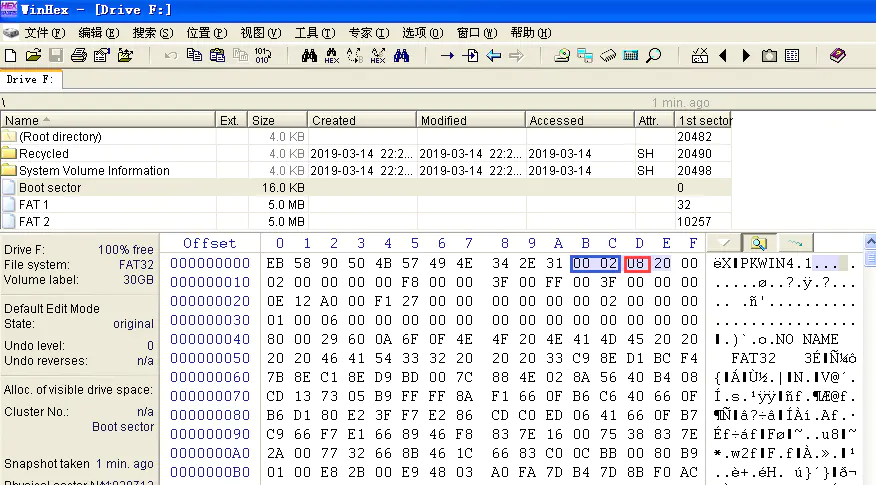

逻辑盘BPB

其中0200（蓝框）表示一个扇区512个字节，08（红框）表示每簇8个扇区，即每簇4kb。（查阅资料可得，FAT32分区当分区大小在260MB-8GB时，簇大小为4KB，符合事实）这里由F盘大小5GB及在FAT表中每簇占4个字节的记录可计算得每个FAT（FAT2为FAT1的备份）大小为5MB，与实际相同。

在F盘根目录下创建一个大概60kb的文本文档。

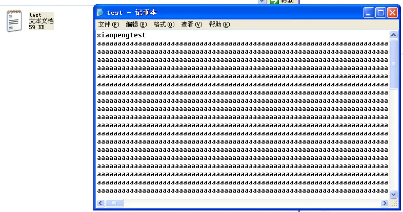

创建文件

在winhex找到该文件位置，查看目录项的信息。

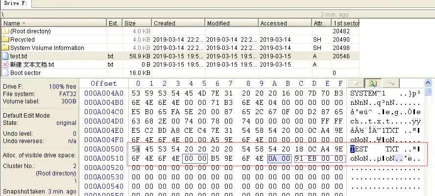

文件目录项

由红框内目录项信息可分别知道首簇号高四位和第四位进而求得首簇号为10号，以及文件大小。经计算可得文件大小为58.9kb近似为文件大小。又因为每簇4kb，故共需15簇。

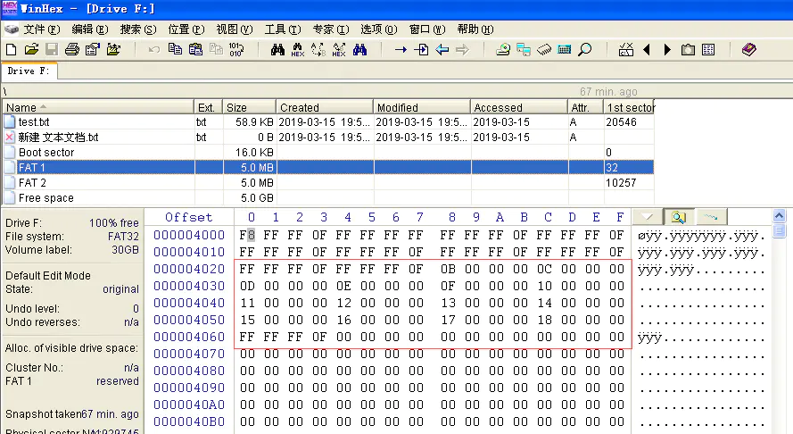

fat1（正常）

从第10号开始，形成一个簇链，直到FFFFFF0F结束。

##### FAT32数据恢复过程

将刚才的test.txt文件永久删除。

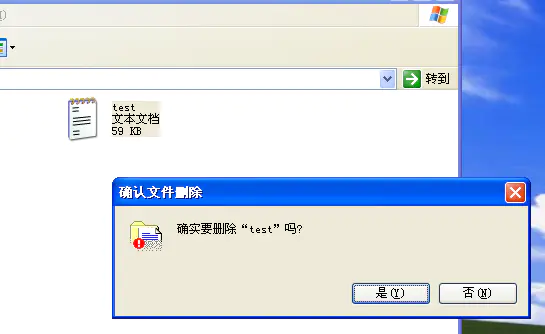

删除文件

找到文件目录项，修改对应第一位信息，并由目录项簇号信息及文件大小计算出首簇号为10，簇数为15。

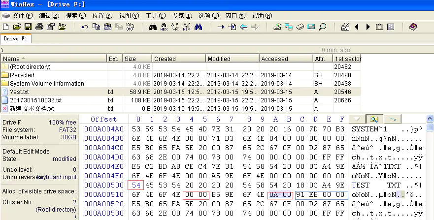

修改第一位

分别将FAT1和FAT2的信息进行修改，从10号开始填补簇链到15个簇被填满，其中最后一个以FFFFFF0F结尾。

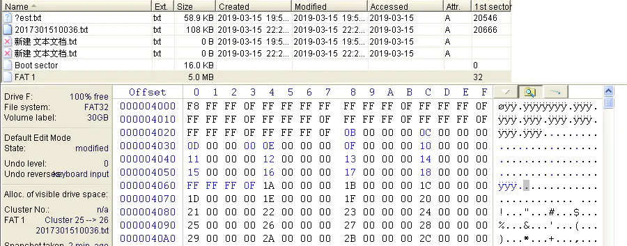

fat1（恢复）

保存后发现文件已恢复，内容完整。

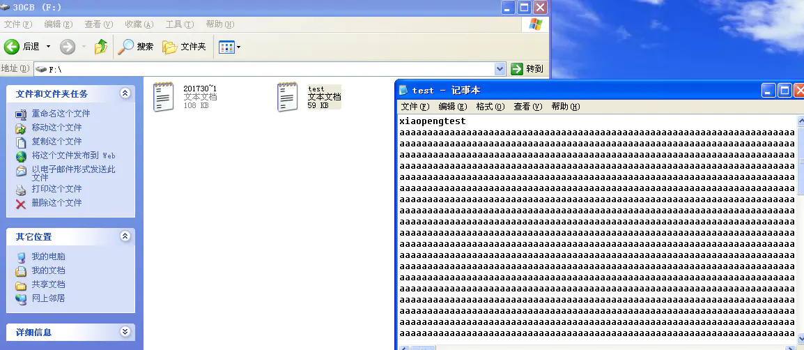

恢复成功

至此，FAT32文件恢复已完成。

#### NTFS

##### NTFS数据恢复过程

同样，先在NTFS格式的E盘创建一个文本文档，再使用shift+delete进行删除。

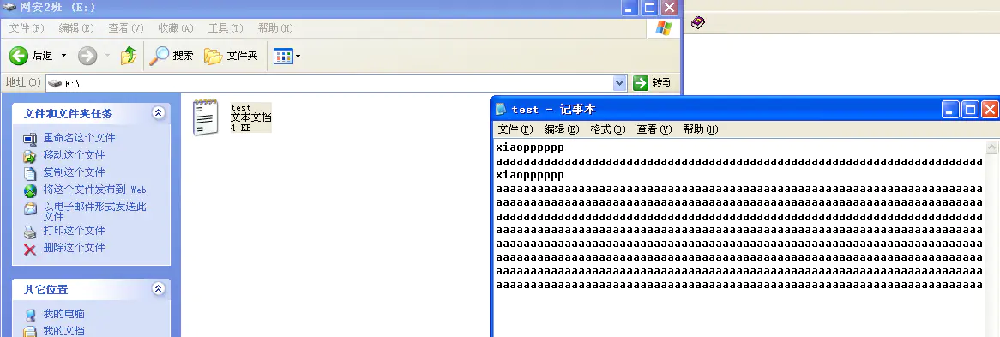

创建文件.png

打开$MFT元文件。

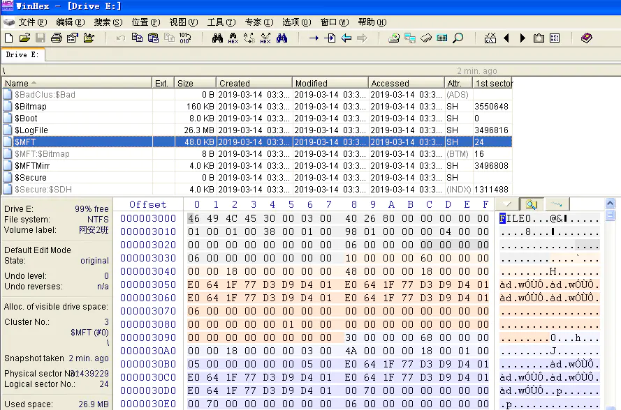

查找文件名test的位置（MFT文件名是unicode形式），找到对应的MFT。

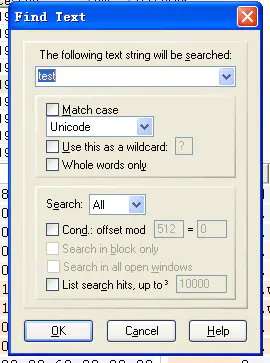

查找.png

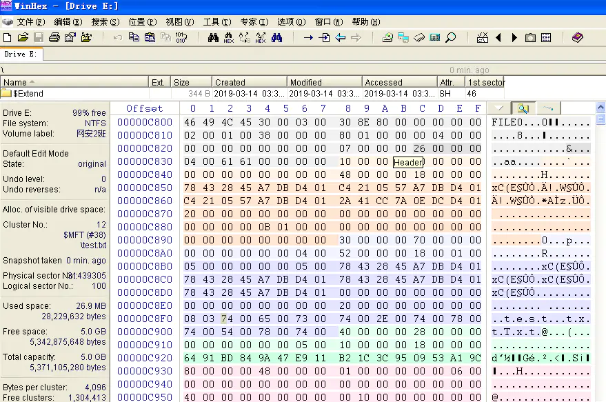

文件MFT.png

16H为00H说明该文件被删除，系统根据这个标志来决定建立新文件时是否覆盖这个MFT而创建自己的MFT。

再向下找到80H处，往后八个字节为01，则找到相对80H处30H的EE0D00即0DEE为文件大小，经计算为3.48kb基本符合。再向后偏移10H，31表示往后一个字节01H为簇数1，再后三个字节638002即28063H为首簇号，换算成十进制为163939。

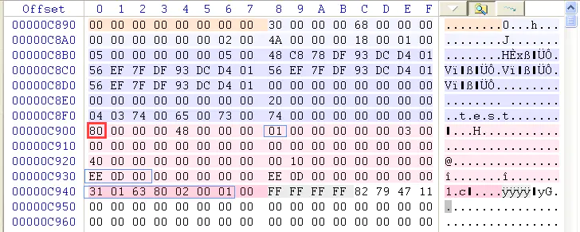

文件属性.png

选中$MFT元文件，根据刚才得到的簇号转到文件数据存储扇区。

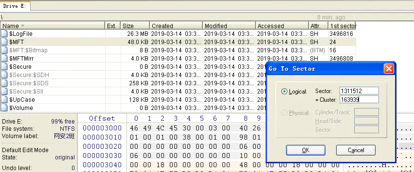

转到扇区1.png

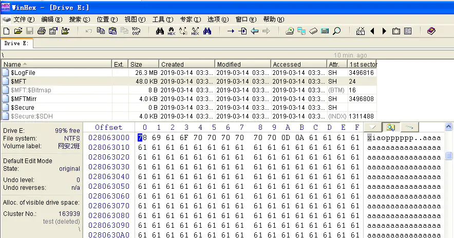

转到扇区2.png

将起始位置设为起始点，根据文件大小0DEE算出数据结尾处转到当前位置偏移，再设为终止点，即可选中所有数据。

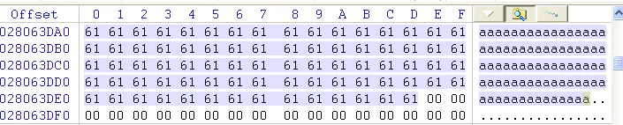

选中数据区域.png

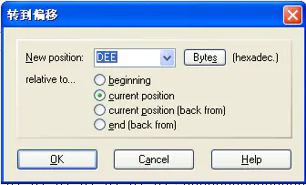

转到终止点.png

选中数据选择复制导入到新文件，我们选择恢复到E盘（其实最好不应选择恢复到原文件盘，但因无其他数据，经试验此次无影响），即可完成文件恢复。

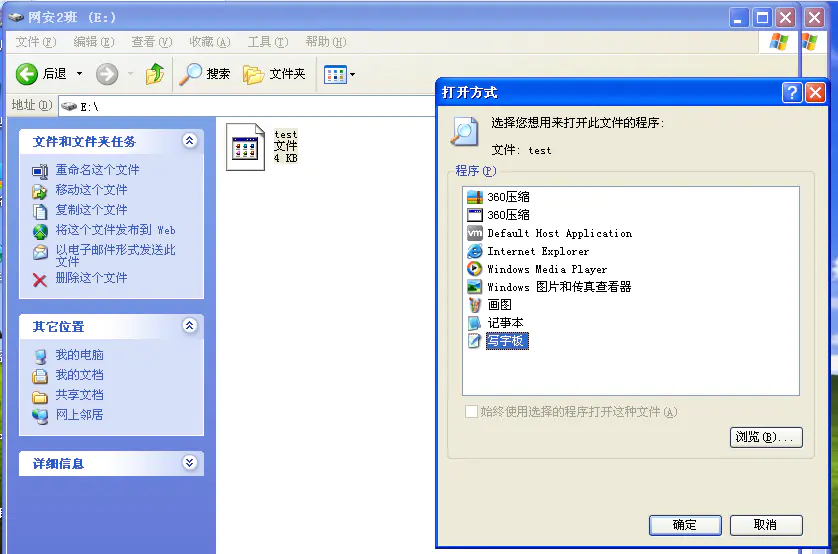

生成文件.png

使用记事本打开发现数据已恢复无误。

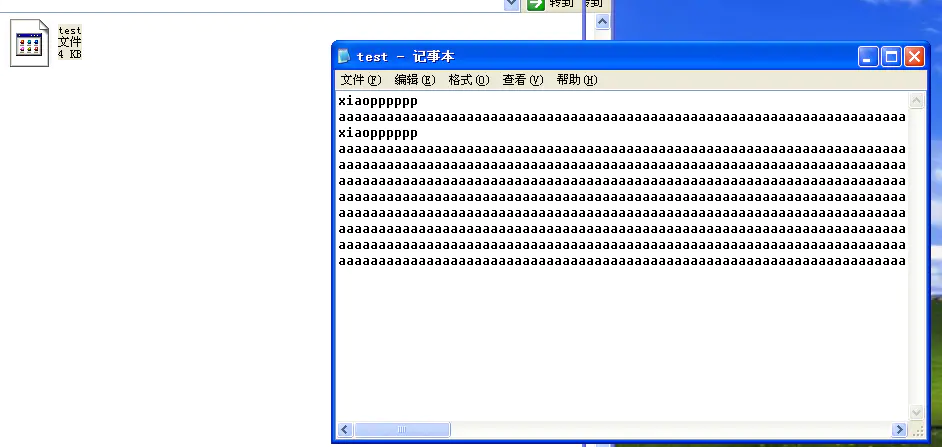

恢复成功.png

至此，NTFS文件删除后恢复已完成。

参考资料：

(NTFS部分）

http://www.webkaka.com/info/archives/system/2015/05/282147/

http://www.webkaka.com/info/archives/system/2015/05/282148/