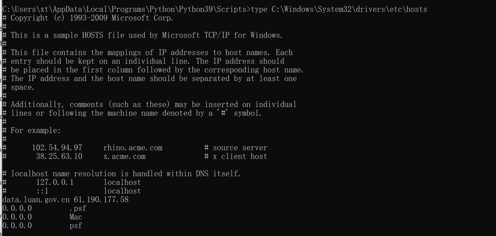
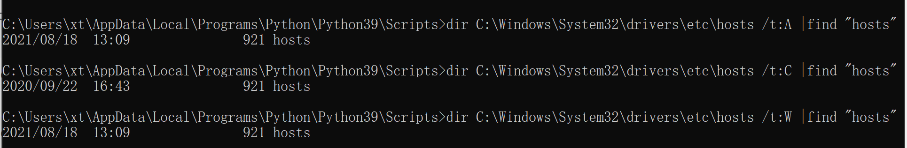
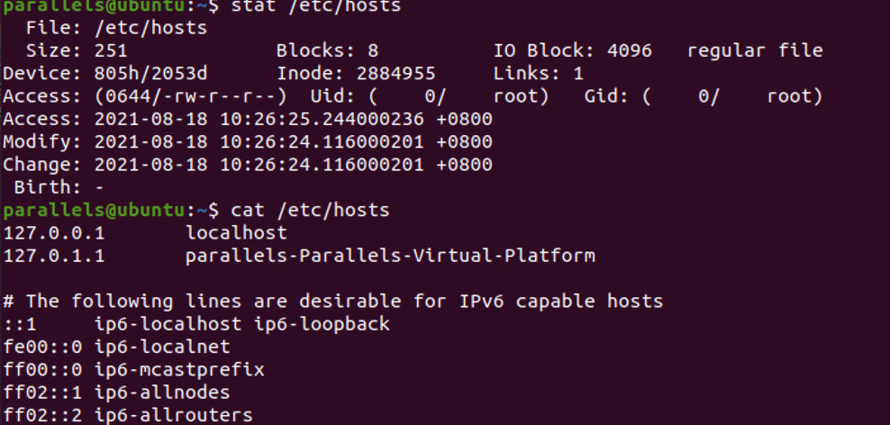

# windows下host文件检查


windows下hosts目录位置是在C:\Windows\System32\drivers\etc下hosts文件

```
type C:\Windows\System32\drivers\etc\hosts
# 创建时间
dir C:\Windows\System32\drivers\etc\hosts /t:C |find "hosts"
# 修改时间
dir C:\Windows\System32\drivers\etc\hosts /t:W |find "hosts"
# 被访问时间
dir C:\Windows\System32\drivers\etc\hosts /t:A |find "hosts"
```






# linux下host文件检查

linux下host文件位置在/etc/文件下hosts文件

```
cat /etc/hosts
stat /etc/hosts
```


