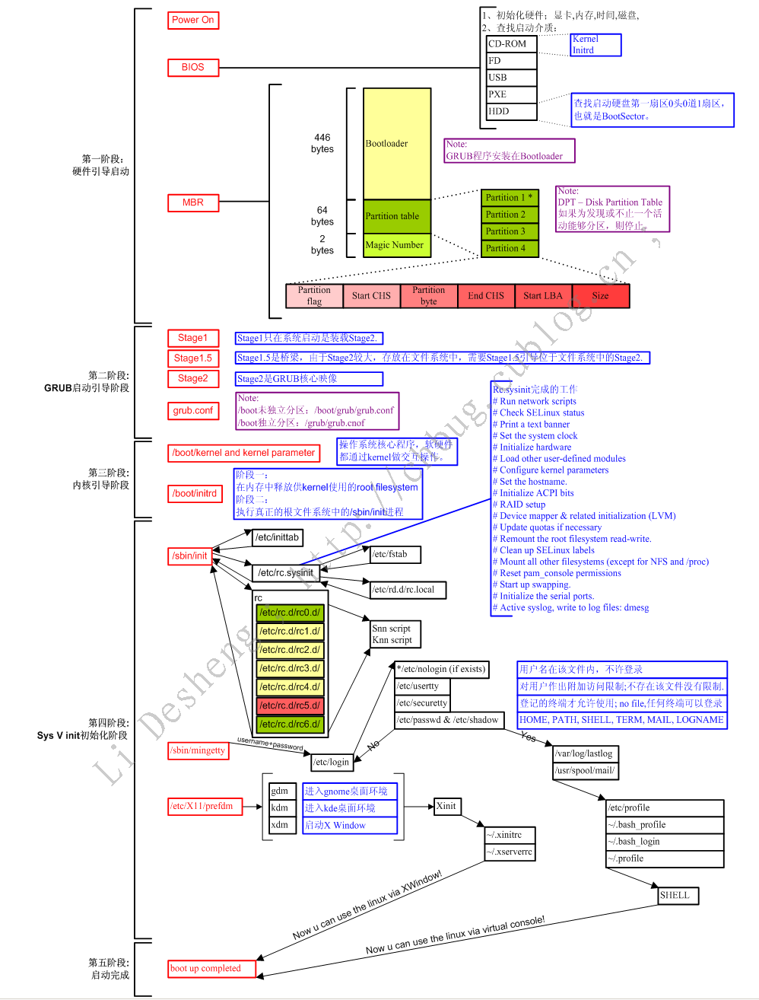
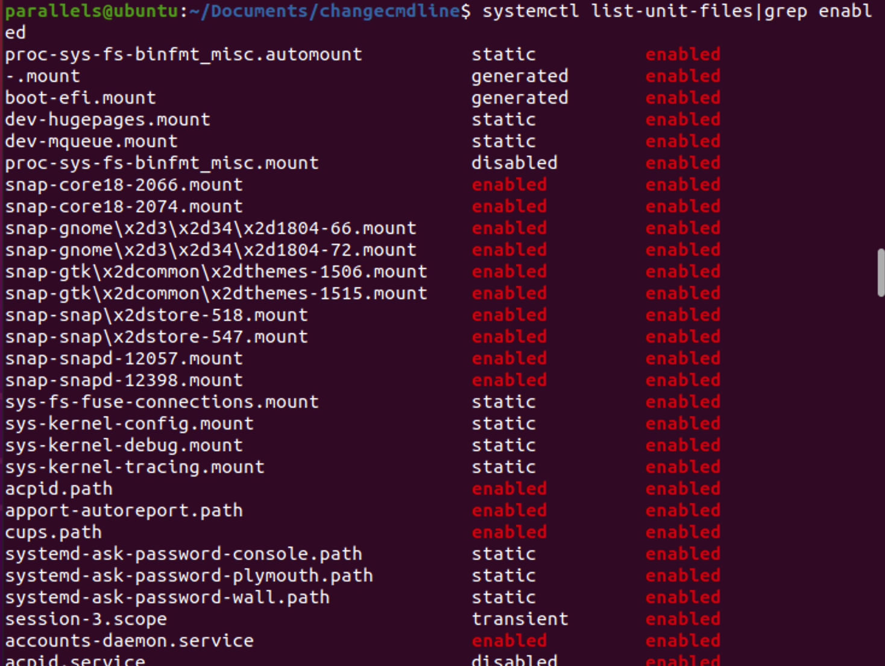
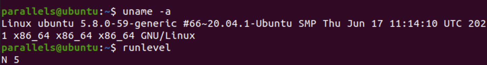
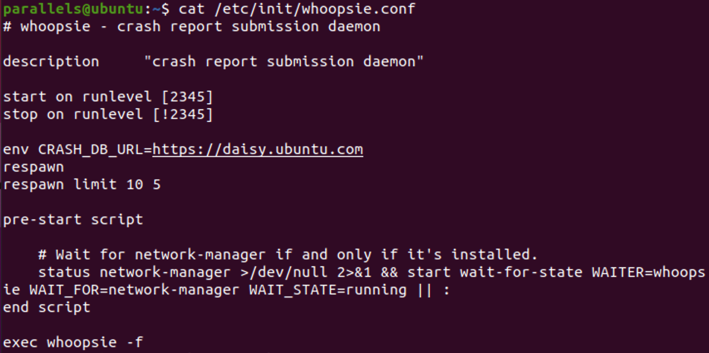
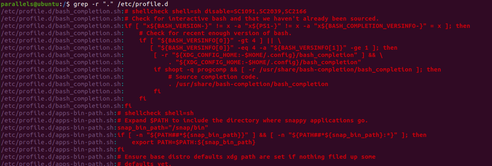
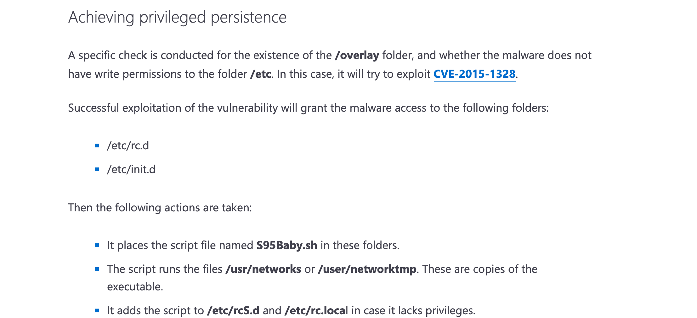
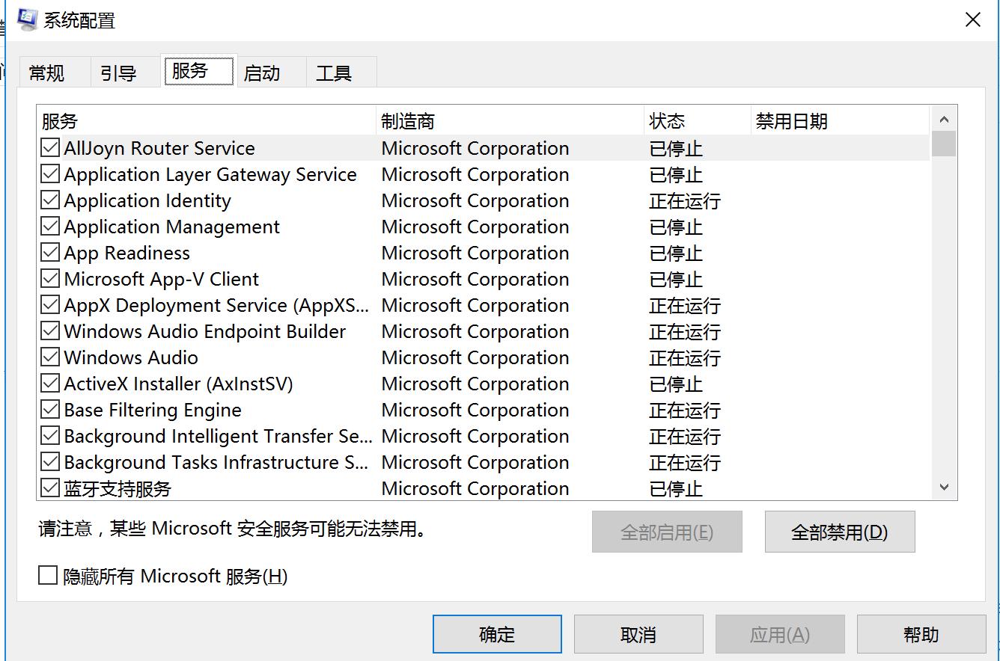
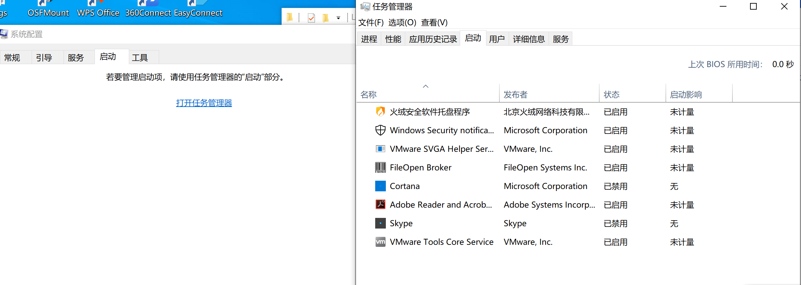
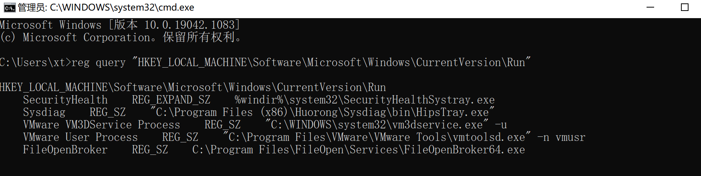
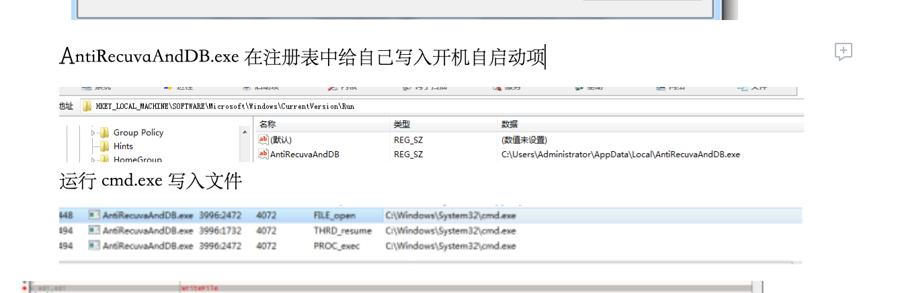

在日常应急的过程中，攻击者常常通过恶意软件或自定义脚本插入启动项，利用系统自启实现恶意程序/远控程序/脚本延缓执行，达到持续控制的目的。因此有必要在日常应急场景中，针对启动项检查。本文就是为了记录对linux和windows的启动项检查简要方式梳理，对于linux还根据启动过程进行了额外的分析。
## Linux下启动项检查


### linux启动过程

https://www.cnblogs.com/sysk/p/4778976.html

#### 启动第一步－－加载BIOS

当你打开计算机电源，计算机会首先加载BIOS信息，BIOS信息是如此的重要，以至于计算机必须在最开始就找到它。这是因为BIOS中包含了CPU的相关信息、设备启动顺序信息、硬盘信息、内存信息、时钟信息、PnP特性等等。在此之后，计算机心里就有谱了，知道应该去读取哪个硬件设备了。

#### 启动第二步－－读取MBR

众所周知，硬盘上第0磁道第一个扇区被称为MBR，也就是Master Boot Record，即主引导记录，它的大小是512字节，别看地方不大，可里面却存放了预启动信息、分区表信息。

系统找到BIOS所指定的硬盘的MBR后，就会将其复制到0x7c00地址所在的物理内存中。其实被复制到物理内存的内容就是Boot Loader，而具体到你的电脑，那就是lilo或者grub了。

#### 启动第三步－－Boot Loader / Grup引导加载程序

Boot Loader 就是在操作系统内核运行之前运行的一段小程序。通过这段小程序，我们可以初始化硬件设备、建立内存空间的映射图，从而将系统的软硬件环境带到一个合适的状态，以便为最终调用操作系统内核做好一切准备。

Boot Loader有若干种，其中Grub、Lilo和spfdisk是常见的Loader。

我们以Grub为例来讲解吧，毕竟用lilo和spfdisk的人并不多。

系统读取内存中的grub配置信息（一般为menu.lst或grub.lst），并依照此配置信息来启动不同的操作系统。


**grup引导过程：**

1. 系统启动计划装载grub核心镜像
2. 引导grub区域，由于grub核心镜像较大，因此需要本区域引导到grub核心
3. grub核心镜像，位于文件系统中


**grup引导相关文件系统：**

/boot/未独立分区：/boot/grub/grub.conf

/boot/独立分区：/grub/grub.conf


#### 启动第四步－－加载/引导内核kernel

根据grub设定的内核映像所在路径，系统读取内存映像，并进行解压缩操作。此时，屏幕一般会输出“Uncompressing Linux”的提示。当解压缩内核完成后，屏幕输出“OK, booting the kernel”。

系统将解压后的内核放置在内存之中，并调用start_kernel()函数来启动一系列的初始化函数并初始化各种设备，完成Linux核心环境的建立。至此，Linux内核已经建立起来了，基于Linux的程序应该可以正常运行了。


**加载kernel相关文件系统：**

/boot/*

/boot/initrd (ubuntu: initrd.img)

/boot/grub


#### 启动第五步－－用户层init依据inittab文件来设定运行等级

内核被加载后，第一个运行的程序便是/sbin/init，该文件会读取/etc/inittab文件，并依据此文件来进行初始化工作。

其实/etc/inittab文件最主要的作用就是设定Linux的运行等级，其设定形式是“：id:5:initdefault:”，这就表明Linux需要运行在等级5上。Linux的运行等级设定如下：

0：关机

1：单用户模式

2：无网络支持的多用户模式

3：有网络支持的多用户模式

4：保留，未使用

5：有网络支持有X-Window支持的多用户模式

6：重新引导系统，即重启

关于/etc/inittab文件的学问，其实还有很多。


**initrd初始化的过程**

```
/sbin/init：（/etc/inittab）
 upstart: ubuntu, d-bus, event-driven  # （比传统init速度快）
 systemd: #（并行启动多个进程）
```


**initrd相关文件系统：**

/sbin/init（/etc/inittab 或/etc/init/）

在ubuntu20.04下我只找到了/etc/init/whoopsie.conf ,崩溃问题

```
parallels@ubuntu:/etc/X11$ cat /etc/init/whoopsie.conf 
# whoopsie - crash report submission daemon

description "crash report submission daemon"

start on runlevel [2345]
stop on runlevel [!2345]

env CRASH_DB_URL=https://daisy.ubuntu.com
respawn
respawn limit 10 5

pre-start script

    # Wait for network-manager if and only if it's installed.
    status network-manager >/dev/null 2>&1 && start wait-for-state WAITER=whoopsie WAIT_FOR=network-manager WAIT_STATE=running || :
end script

exec whoopsie -f
```

**
**

**Kernel初始化的过程：**

1、设备探测

2、驱动初始化（可能会从initrd（initramfs）文件中装载驱动模块）

3、以只读挂载根文件系统；

4、装载第一个进程init（PID：1） （rw重新挂载rootfs）


#### 启动第六步－－init进程执行rc.sysinit

在设定了运行等级后，Linux系统执行的第一个用户层文件就是/etc/rc.d/rc.sysinit脚本程序，它做的工作非常多，包括设定PATH、设定网络配置（/etc/sysconfig/network）、启动swap分区、设定/proc等等。如果你有兴趣，可以到/etc/rc.d中查看一下rc.sysinit文件，里面的脚本够你看几天的。

#### 启动第七步－－启动内核模块

具体是依据/etc/modules.conf文件或/etc/modules.d目录下的文件来装载内核模块。

#### 启动第八步－－执行不同运行级别的脚本程序（/etc/rc.d/rc $RUNLEVEL   # $RUNLEVEL为缺省的运行模式 ）

根据运行级别的不同，系统会运行rc0.d到rc6.d中的相应的脚本程序，来完成相应的初始化工作和启动相应的服务。

#### 启动第九步－－执行/etc/rc.d/rc.local

你如果打开了此文件，里面有一句话，读过之后，你就会对此命令的作用一目了然：

> \# This script will be executed *after* all the other init scripts.
>
> \# You can put your own initialization stuff in here if you don’t
>
> \# want to do the full Sys V style init stuff.

rc.local就是在一切初始化工作后，Linux留给用户进行个性化的地方。你可以把你想设置和启动的东西放到这里。

#### 启动第十步－－执行/bin/login程序，进入登录状态

此时，系统已经进入到了等待用户输入username和password的时候了，你已经可以用自己的帐号登入系统了。


参考：

华为的一个文章：https://www.huaweicloud.com/articles/b6afbca589602a38904374accf3dc2bb.html

```
POST-->BIOS(Boot Sequence)-->MBR(bootloader,446)-->Kernel-->initrd-->(ROOTFS)/sbin/init(/etc/inittab)
```

较详细的一个文章：

https://www.cnblogs.com/unicode/archive/2010/06/12/1756755.html

 


### 开机启动服务检查

#### systemctl list-unit-files 

开机启动服务项

systemctl list-unit-files

常用语法

systemctl list-unit-files |grep enabled

systemctl list-unit-files|grep enabled|cat > ~/enabled_services.txt




### 开机启动项检查

#### chkconfig （第9步）

chkconfig 在没有参数运行时，显示用法。如果加上服务名，那么就检查这个服务是否在当前运行级启动。如果是，返回true，否则返回false。如果在服务名后面指 定了on，off或者reset，那么chkconfi 会改变指定服务的启动信息。on和off分别指服务被启动和停止，reset指重置服务的启动信息，无论有问题的初始化脚本指定了什么。on和off开 关，系统默认只对运行级3，4，5有效，但是reset可以对所有运行级有效。


##### 参数用法：

–add 　增加所指定的系统服务，让chkconfig指令得以管理它，并同时在系统启动的叙述文件内增加相关数据。

–del 　删除所指定的系统服务，不再由chkconfig指令管理，并同时在系统启动的叙述文件内删除相关数据。

–level<等级代号> 　指定读系统服务要在哪一个执行等级中开启或关毕。

等级0表示：表示关机

等级1表示：单用户模式

等级2表示：无网络连接的多用户命令行模式

等级3表示：有网络连接的多用户命令行模式

等级4表示：不可用

等级5表示：带图形界面的多用户模式

等级6表示：重新启动

需要说明的是，level选项可以指定要查看的运行级而不一定是当前运行级。对于每个运行级，只能有一个启动脚本或者停止脚本。当切换运行级时，init不会重新启动已经启动的服务，也不会再次去停止已经停止的服务。

 

chkconfig –list [name]：显示所有运行级系统服务的运行状态信息（on或off）。如果指定了name，那么只显示指定的服务在不同运行级的状态。

chkconfig –add name：增加一项新的服务。chkconfig确保每个运行级有一项启动(S)或者杀死(K)入口。如有缺少，则会从缺省的init脚本自动建立。

chkconfig –del name：删除服务，并把相关符号连接从/etc/rc[0-6].d删除。

chkconfig [--level levels] name：设置某一服务在指定的运行级是被启动，停止还是重置。


**有的版本没有chkconfig，安装方法：**

1.sudo apt install sysv-rc-conf安装该软件

2.sudo cp /usr/sbin/sysv-rc-conf /usr/sbin/chkconfig


**ERROR：Unable to locate package sysv-rc-conf** 

解决办法：deb http://archive.ubuntu.com/ubuntu/ trusty main universe restricted multiverse


用法

```
chkconfig –list        #列出所有的系统服务
chkconfig –add httpd        #增加httpd服务
chkconfig –del httpd        #删除httpd服务
chkconfig –level httpd 2345 on        #设置httpd在运行级别为2、3、4、5的情况下都是on（开启）的状态
chkconfig –list        #列出系统所有的服务启动情况
chkconfig –list mysqld        #列出mysqld服务设置情况
chkconfig –level 35 mysqld on        #设定mysqld在等级3和5为开机运行服务，–level 35表示操作只在等级3和5执行，on表示启动，off表示关闭
chkconfig mysqld on        #设定mysqld在各等级为on，“各等级”包括2、3、4、5等级
```

**
**

**参考：**

chkconfig 原理部分 https://www.cnblogs.com/yujianadu/p/10973896.html


### 启动设置手动检查

#### /etc/inittab（第5步）

开机后系统级别runlevel 

系统运行级别示意图：

| 运行级别 |                           含义                            |
| :------: | :-------------------------------------------------------: |
|    0     |                           关机                            |
|    1     | 单用户模式，可以想象为windows的安全模式，主要用于系统修复 |
|    2     |              不完全的命令行模式，不含NFS服务              |
|    3     |            完全的命令行模式，就是标准字符界面             |
|    4     |                         系统保留                          |
|    5     |                         图形模式                          |
|    6     |                          重启动                           |


查看运行级别命令

```
runlevel
```


系统默认允许级别

```
vi  /etc/inittab
id=3：initdefault  系统开机后直接进入哪个运行级别
```


由于不同的版本不同对应不同的启动和运行级别，Linux 内核启动 init ，init进程ID是1，是所有进程的父进程，所有进程由它控制；在ubuntu环境下Ubuntu 的启动由**upstart**控制，自9.10后不再使用/etc/event.d目录的配置文件，改为/etc/init。查看当前的运行级别，我的Ubuntu 20.04.1桌面是5。




参考：https://blog.csdn.net/heqiyu34/article/details/18793857


#### /etc/rc.d/rc.sysinit（第6步）

本参数环境是红帽版linux，在ununtu中没有此文件。这个脚本是linux初始化脚本

/etc/rc.d/rc.sysinit，下面是该脚本初始化的任务：


1. 如果devfs（设备文件系统）被使用，开启 devfs 驻留程序
2. 挂在 /proc 文件系统
3. 屏幕打印 "welcome" 终端信息
4. 设置终端日志级别 console log level
5. 卸载初始化initrd
6. 设置系统时钟Set the system clock
7. 设置hostname
8. 初始化 USB (通用串行总线) 控制器和HID (人机界面设备) 组建
9. 如果非正常关机, 在根分区运行fsck
10. 重新可读写挂载root文件系统
11. 初始化LVM (Logical Volume Manager逻辑盘卷管理器)
12. 激活swap交换分区
13. 清理和重新初始化/etc/mtab
14. 如果存在则运行 /etc/rc.modules 加载模块
15. 如果VxVM (VERITAS Volume Manager 逻辑盘卷管理器) 安装了，则启动它
16. 检查非root文件系统
17. 挂载其他文件系统
18. 启动图形启动显示程序信息
19. 检查文件系统限额
20. 运行多个初始化脚本，如果存在的话

1. 1. /usr/sbin/kbdconfig
   2. /usr/sbin/passwd
   3. /usr/sbin/netconfig
   4. [/usr/sbin/timeconfig](http://glennastory.net/boot/timeconfig)
   5. /usr/sbin/authconfig
   6. /usr/sbin/ntsysv

1. 删除一些锁文件 some lock files
2. 初始化一些端口
3. 处理SCSI磁带/磁盘
4. 加载 USB 存储
5. 开启防火墙


参考：http://glennastory.net/boot/sysinit.html


#### /etc/rc.d/rc[0~6].d (第9步)

查看自定义的开机程序开机启动配置文件

```
cat /etc/init.d/rc.local (cat /etc/init.d/rc)
/etc/rc.d/rc[0~6].d

ls -alt /etc/init.d
```


例子:当我们需要开机启动自己的脚本时，只需要将可执行脚本丢在/etc/init.d目录下，然后在/etc/rc.d/rc*.d中建立软链接即可


```
root@localhost ~]# ln -s /etc/init.d/sshd /etc/rc.d/rc3.d/S100ssh
```


此处sshd是具体服务的脚本文件，S100ssh是其软链接，S开头代表加载时自启动；如果是K开头的脚本文件，代表运行级别加载时需要关闭的。

**入侵排查：**


启动项文件：

more /etc/rc.local

/etc/rc.d/rc[0~6].d

ls -l /etc/rc.d/rc3.d/




#### /etc/profile.d（第10步之前）

登录自动执行程序

- 目录中存放的是一些应用程序所需的启动脚本，其中包括了颜色、语言、less、vim及which等命令的一些附加设置。
- 当一个用户登录Linux系统或使用su -命令切换到另一个用户时，也就是Login shell 启动时，首先要确保执行的启动脚本就是 `/etc/profile.d` 。（只有`Login shell`启动时才会运行 `/etc/profile.d` 这个脚本，也就是**需要输入账号和密码**的时候，而`Non-login shell` 不会调用这个脚本）
- 这些脚本文件之所以能够 被自动执行，是因为在`/etc/profile.d`中使用一个for循环语句来调用这些脚本。而这些脚本文件是用来设置一些变量和运行一些初始化过程的。


**常用语句：**

cd /etc/profile.d

grep -r "." /etc/profile.d

### 样本举例
2021年8月19日微软披露的mozi样本细节中，我们可以看到通过CVE-2015-1328获取写权限后，mozi样本就可以在/etc/rc.d以及/etc/init.d中写入脚本，进一步加固持久化在/etc/rcS.d 和/etc/rc.local中添加自启动。



## Windows下启动项检查

### 开机启动项 msconfig

**进入系统配置查看**

****




### 注册表查看

（1）HKEY_CLASSES_ROOT（HKCR）：此处存储的信息可确保在Windows资源管理器中执行时打开正确的程序。它还包含有关拖放规则、快捷方法和用户界面信息的更多详细信息。（2）HKEY_CURRENT_USER（HKCU）：包含当前登录系统的用户的配置信息，有用户的文件夹、屏幕颜色和控制面板设置。

（3）HKEY_LOCAL_MACHINE（HKLM）：包含运行操作系统的计算机硬件特定信息，有系统上安装的驱动器列表及已安装硬件和应用程序的通用配置。

（4）HKEY_USERS（HKU）：包含系统上所有用户配置文件的配置信息，有应用程序配置和可视设置。（5）HKEY_CURRENT_CONFIG（HCU）：存储有关系统当前配置的信息。


reg或者运行“regedit”

```
reg query "HKEY_LOCAL_MACHINE\Software\Microsoft\Windows\CurrentVersion\Run"
```





### 恶意样本示例：

我们在分析Geerban勒索病毒样本17425e830d17ca6709237cb8a02f8ed1的时候，可以看到，在注册表中恶意样本添加了启动项，正是HKEY_LOCAL_MACHINE\Software\Microsoft\Windows\CurrentVersion\Run，通过注册表查询即可查询到异常


