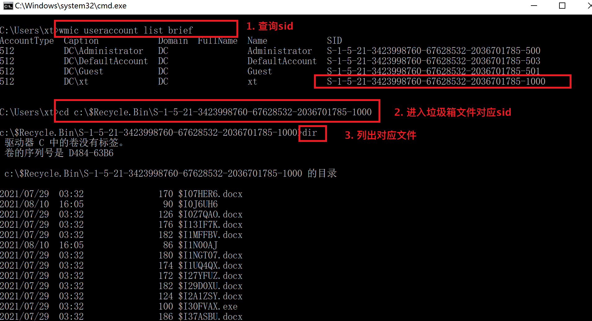

# windows下回收站文件

## 查询回收站内容

通过$RECYCLE.BIN+sid查询回收站内容。可以看到查到的文件名称展示都非原始文件名。



通过dir /s /a c:\$Recycle.Bin列出所有回收站中的文件，这里测试发现，当前用户的这个回收站展示的文件名并非原始文件名，而是经过重命名的文件。


快速打开回收站：

start shell:RecycleBinFolder


# linux下回收站文件


linux下回收站的位置 ~/.local/share/Trash/

```
sudo ls -l ~/.local/share/Trash/file*  # 列出所有回收站的文件
sudo rm -rf ~/.local/share/Trash/* # 删除回收站的文件
```
