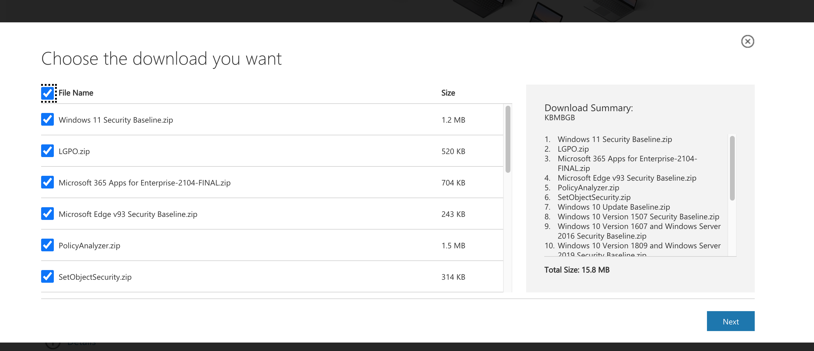
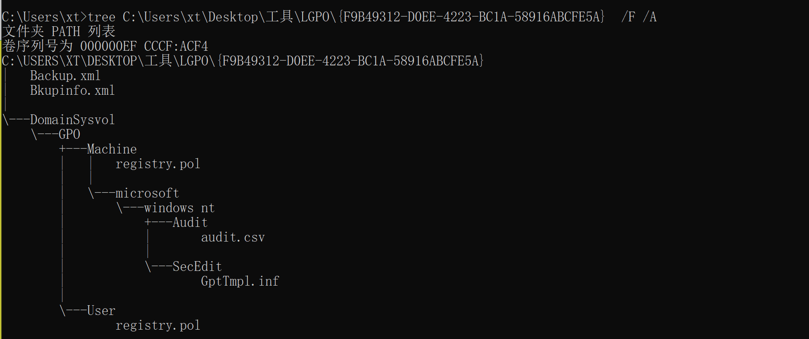
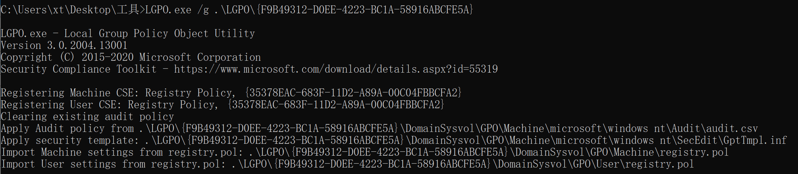
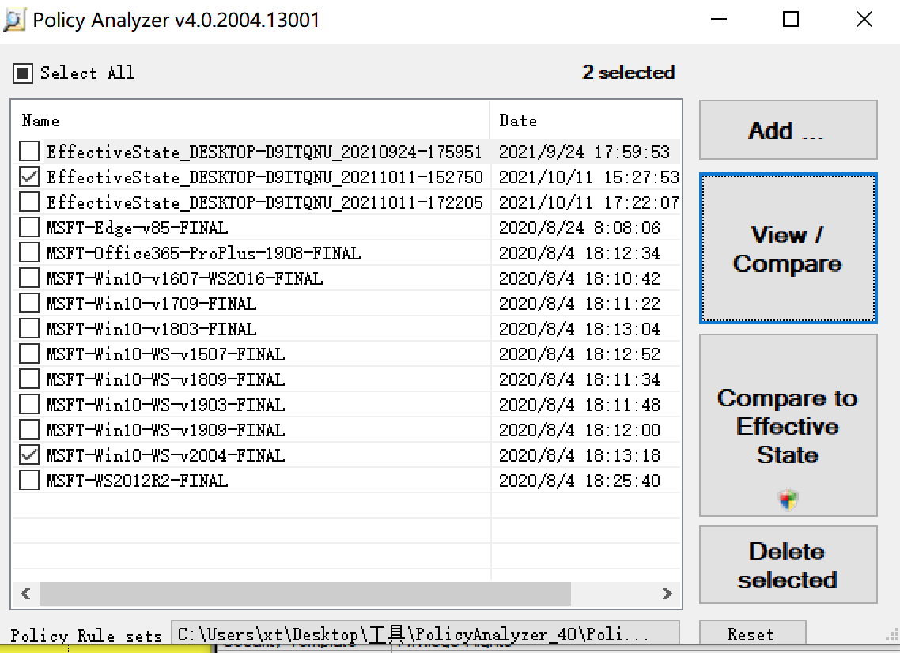
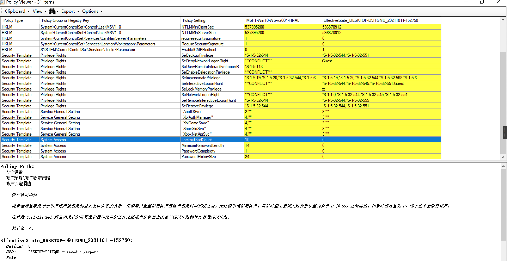
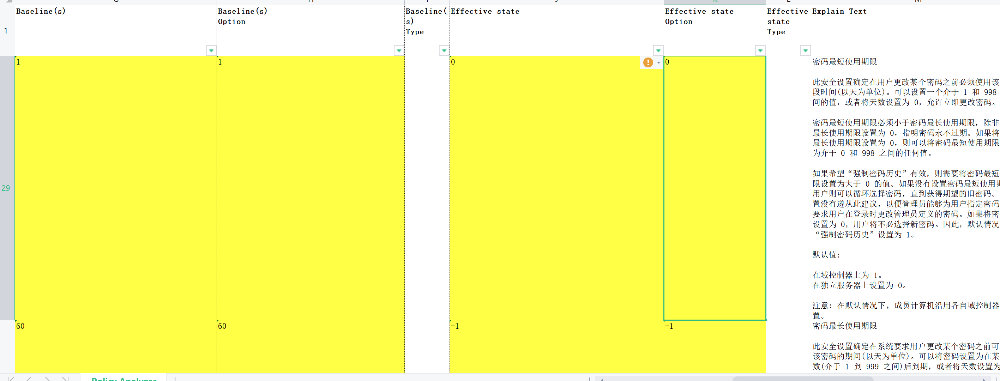
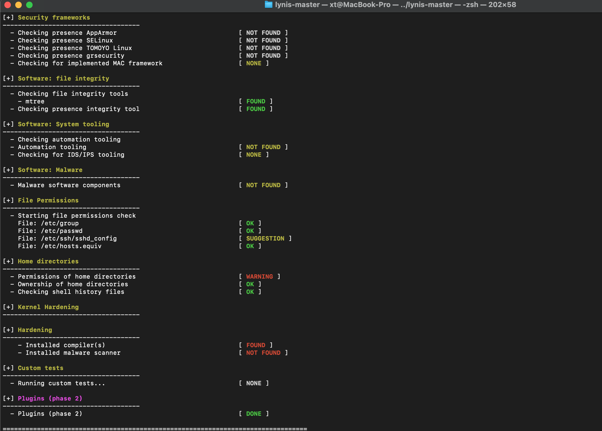

安全策略的检测更倾向与合规检测，这里我们希望的是根据合规的标准发现尽可能多的非合规问题。


# Windows安全策略检查

windows官网操作系统技术文件中的有很多关于windows安全信息的内容，组策略安全扩展协议、安全策略、威胁和对策指南、windows安全基线等等。我们在应急场景下不会过在现场进行策略内容的研究，尤其是安全策略有4800条（3000系统安全配置策略、1800是IE的安全配置策略），更多的是需要取相关策略，并与安全基线进行对比核查，找到可能的弱点所在，协助现场安全分析。这里我们可以使用微软官方的策略检测工具LGPO.exe进行策略的导出，然后通过PolicyAnalyzer对策略和基线进行对比分析，最终得到我们想要了解的安全策略上的问题。


## windows安全基线


有几种获取和使用安全基线的方法：

1. 可以从 [Microsoft 下载中心](https://www.microsoft.com/download/details.aspx?id=55319)下载安全基线。 这是 Security Compliance Toolkit (SCT) 的下载页面，其中包含可帮助管理员管理安全基线以及其他基线的各种工具。 安全基线包含在 [Security Compliance Toolkit (SCT)](https://docs.microsoft.com/zh-cn/windows/security/threat-protection/windows-security-configuration-framework/security-compliance-toolkit-10)中，可从 Microsoft 下载中心进行下载。 SCT 还包含帮助管理员管理安全基线的工具。 还可以获取 [对安全基线的支持](https://docs.microsoft.com/zh-cn/windows/security/threat-protection/windows-security-configuration-framework/get-support-for-security-baselines)
2. [MDM (移动设备管理)](https://docs.microsoft.com/zh-cn/windows/client-management/mdm/#mdm-security-baseline.md)安全基线功能，如基于 Microsoft 组策略的安全基线，并且可以轻松地将其集成到现有 MDM 管理工具中。

1. MDM 安全基线可以在运行 Microsoft Endpoint Manager 11 的设备上轻松Windows 10配置。 以下文章提供了详细信息步骤：Windows [MDM](https://docs.microsoft.com/zh-cn/mem/intune/protect/security-baseline-settings-mdm-all.md) (移动设备) 基线。

 

原文可以在Windows 安全基准（https://docs.microsoft.com/zh-cn/windows/security/threat-protection/windows-security-configuration-framework/windows-security-baselines）找到。


这里用到的工具有LGPO、PolicyAnalyzer你都可以通过 https://www.microsoft.com/en-us/download/details.aspx?id=55319 进行下载。这个下载链接中的其他内容就是windows基线标准，也建议一起下载，用于后续分析对比基线使用。




### LGPO.exe


```
C:\Users\xt>C:\Users\xt\Desktop\工具\LGPO.exe

LGPO.exe - Local Group Policy Object Utility
Version 3.0.2004.13001
Copyright (C) 2015-2020 Microsoft Corporation
Security Compliance Toolkit - https://www.microsoft.com/download/details.aspx?id=55319

LGPO.exe has four modes:
  * Import and apply policy settings;
  * Export local policy to a GPO backup;
  * Parse a registry.pol file to "LGPO text" format;
  * Build a registry.pol file from "LGPO text".

To apply policy settings:

    LGPO.exe command [...]

    where "command" is one or more of the following (each of which can be repeated):

    /g path                   import settings from one or more GPO backups under "path" # 从“path”路径下导入一条或多条GPO备份
    /p path\lgpo.PolicyRules  import settings from a Policy Analyzer .PolicyRules file  # 从Policy Analyzer的.policyrules文件中导入
    /m path\registry.pol      import settings from registry.pol into machine config     # 从registry.pol导入机器配置
    /u path\registry.pol      import settings from registry.pol into user config        # 从registry.pol导入用户配置
    /ua path\registry.pol     import settings from registry.pol into user config for Administrators       # 从registry.pol导入Administrators配置
    /un path\registry.pol     import settings from registry.pol into user config for Non-Administrators   # 从registry.pol导入非Administrators用户配置
    /u:username path\registry.pol
                              import settings from registry.pol into user config for local user           # 从registry.pol导入本地用户配置
    /u:username path\registry.pol
                              specified by "username"                                           # 通过用户名指定
    /s path\GptTmpl.inf       apply security template                                           # 应用安全模版
    /a[c] path\Audit.csv      apply advanced auditing settings; /ac to clear policy first       # 应用高级设计设置；/ac 先清理策略再应用
    /t path\lgpo.txt          apply registry commands from LGPO text                            # 从LGPO文本应用注册表命令
    /e <name>|<guid>          enable GP extension for local policy processing; specify a        # 启用本地策略处理的GP扩展;指定一个GUID，或以下名称之一:
                              GUID, or one of these names:                                         
                              * "zone" for IE zone mapping extension                               # "zone" 代表IE区域映射扩展
                              * "mitigation" for mitigation options, including font blocking       # "mitigation" 代表缓解选项，包括字体阻塞
                              * "audit" for advanced audit policy configuration                    # "audit" 代表用于高级审计策略配置
                              * "LAPS" for Local Administrator Password Solution                   # "LAPS" 代表本地管理员密码解决方案
                              * "DGVBS" for Device Guard virtualization-based security             # "DGVBS" 代表基于虚拟化的安全
                              * "DGCI" for Device Guard code integrity policy                      # "DGCI" 代表设备保护代码完整性策略
    /ef path\backup.xml       enable GP extensions referenced in backup.xml from a GPO backup   # 从GPO备份中启用backup.xml中引用的GP扩展
    /boot                     reboot after applying policies                                    # 应用策略后重新启动
    /v                        verbose output                                                    # 详细输出
    /q                        quiet output (no headers)                                         # 安静输出(没有标头)

To create a GPO backup from local policy: # 从本地策略创建GPO备份

    LGPO.exe /b path [/n GPO-name]

    /b path               Create GPO backup in "path"                                   # 在路径中创建GPO备份
    /n GPO-name           Optional GPO display name (use quotes if it contains spaces)  # 可选的GPO显示名称(如果包含空格，使用引号)

To parse a Registry.pol file to LGPO text (stdout): # 解析注册表。pol文件到LGPO文本(stdout):

    LGPO.exe /parse [/q] {/m|/u|/ua|/un|/u:username} path\registry.pol

    /m path\registry.pol   parse registry.pol as machine config commands
    /u path\registry.pol   parse registry.pol as user config commands
    /ua path\registry.pol  parse registry.pol as user config for Administrators
    /un path\registry.pol  parse registry.pol as user config for Non-Administrators
    /u:username path\registry.pol
                           parse registry.pol as user config for local user
                           specified by "username"
    /q                     quiet output (no headers)

To build a Registry.pol file from LGPO text: # 建立注册表。pol文件从LGPO文本:

    LGPO.exe /r path\lgpo.txt /w path\registry.pol [/v]

    /r path\lgpo.txt      Read input from LGPO text file
    /w path\registry.pol  Write new registry.pol file

(See the documentation for more information and examples.)

C:\Users\xt>C:\Users\xt\Desktop\工具\LGPO.exe
```

#### 使用LGPO导出策略。

1. 使用管理员身份在LGPO.exe所在目录处运行cmd。
2. 导出本地组策略

 LGPO.exe /b path [/n GPO-name]

```
C:\Users\xt>C:\Users\xt\Desktop\工具\LGPO.exe /b C:\Users\xt\Desktop\工具\LGPO /n "backup"

LGPO.exe - Local Group Policy Object Utility
Version 3.0.2004.13001
Copyright (C) 2015-2020 Microsoft Corporation
Security Compliance Toolkit - https://www.microsoft.com/download/details.aspx?id=55319

Creating LGPO backup in "C:\Users\xt\Desktop\    

    
    
    
C:\Users\xt>tree C:\Users\xt\Desktop\工具\LGPO\{F9B49312-D0EE-4223-BC1A-58916ABCFE5A}  /F /A
文件夹 PATH 列表
卷序列号为 000000EF CCCF:ACF4
C:\USERS\XT\DESKTOP\工具\LGPO\{F9B49312-D0EE-4223-BC1A-58916ABCFE5A}
|   Backup.xml
|   Bkupinfo.xml
|
\---DomainSysvol
    \---GPO
        +---Machine
        |   |   registry.pol
        |   |
        |   \---microsoft
        |       \---windows nt
        |           +---Audit
        |           |       audit.csv
        |           |
        |           \---SecEdit
        |                   GptTmpl.inf
        |
        \---User
                registry.pol
    
```





#### 使用LGPO导入策略

导入备份的LGPO策略

```
C:\Users\xt\Desktop\工具>LGPO.exe /g .\LGPO\{F9B49312-D0EE-4223-BC1A-58916ABCFE5A}

LGPO.exe - Local Group Policy Object Utility
Version 3.0.2004.13001
Copyright (C) 2015-2020 Microsoft Corporation
Security Compliance Toolkit - https://www.microsoft.com/download/details.aspx?id=55319

Registering Machine CSE: Registry Policy, {35378EAC-683F-11D2-A89A-00C04FBBCFA2}
Registering User CSE: Registry Policy, {35378EAC-683F-11D2-A89A-00C04FBBCFA2}
Clearing existing audit policy
Apply Audit policy from .\LGPO\{F9B49312-D0EE-4223-BC1A-58916ABCFE5A}\DomainSysvol\GPO\Machine\microsoft\windows nt\Audit\audit.csv
Apply security template: .\LGPO\{F9B49312-D0EE-4223-BC1A-58916ABCFE5A}\DomainSysvol\GPO\Machine\microsoft\windows nt\SecEdit\GptTmpl.inf
Import Machine settings from registry.pol: .\LGPO\{F9B49312-D0EE-4223-BC1A-58916ABCFE5A}\DomainSysvol\GPO\Machine\registry.pol
Import User settings from registry.pol: .\LGPO\{F9B49312-D0EE-4223-BC1A-58916ABCFE5A}\DomainSysvol\GPO\User\registry.pol
```




#### 导出的策略与windows基线对比

将基线和导出的pol文件导入Policy Anylize程序中。然后同时勾选对比即可。





还可以导出结果




## 参考：

[[MS-GPSB\] 组策略安全扩展协议](https://docs.microsoft.com/zh-cn/openspecs/windows_protocols/ms-gpsb/6a07a06b-e628-4765-9d91-0d63ba47fdc0)

[威胁和对策指南：Windows Server 2008 R2 和 Windows 7 中的安全设置](https://docs.microsoft.com/zh-cn/previous-versions/windows/it-pro/windows-server-2008-R2-and-2008/hh125921(v=ws.10))

安全审核https://docs.microsoft.com/zh-cn/windows/security/threat-protection/auditing/security-auditing-overview

Windows 安全基准 https://docs.microsoft.com/zh-cn/windows/security/threat-protection/windows-security-configuration-framework/windows-security-baselines


# Linux安全策略检查


## linux安全基线

### lynis

Lynis 是一个开源安全工具。它有助于审核运行类 UNIX 系统（Linux、macOS、BSD）的系统，并为系统强化和合规性测试提供指导。本文档包含使用该软件的基础知识。


官网地址：https://cisofy.com/documentation/lynis/

项目地址：https://github.com/CISOfy/Lynis

下载地址：https://cisofy.com/downloads/lynis/

安装方式：https://cisofy.com/documentation/lynis/get-started/


#### 使用lynis安全检测

运行

```
╭─xt@MacBook-Pro ~/Documents/hack/baseline/lynis-master 
╰─$ ./lynis 
[ Lynis 3.0.7 ]

################################################################################
  Lynis comes with ABSOLUTELY NO WARRANTY. This is free software, and you are
  welcome to redistribute it under the terms of the GNU General Public License.
  See the LICENSE file for details about using this software.

  2007-2021, CISOfy - https://cisofy.com/lynis/
  Enterprise support available (compliance, plugins, interface and tools)
################################################################################


[+] Initializing program
------------------------------------


  Usage: lynis command [options]


  Command:

    audit
        audit system                  : Perform local security scan
        audit system remote <host>    : Remote security scan
        audit dockerfile <file>       : Analyze Dockerfile

    show
        show                          : Show all commands
        show version                  : Show Lynis version
        show help                     : Show help

    update
        update info                   : Show update details


  Options:

    Alternative system audit modes
    --forensics                       : Perform forensics on a running or mounted system
    --pentest                         : Non-privileged, show points of interest for pentesting

    Layout options
    --no-colors                       : Don't use colors in output
    --quiet (-q)                      : No output
    --reverse-colors                  : Optimize color display for light backgrounds
    --reverse-colours                 : Optimize colour display for light backgrounds

    Misc options
    --debug                           : Debug logging to screen
    --no-log                          : Don't create a log file
    --profile <profile>               : Scan the system with the given profile file
    --view-manpage (--man)            : View man page
    --verbose                         : Show more details on screen
    --version (-V)                    : Display version number and quit
    --wait                            : Wait between a set of tests
    --slow-warning <seconds>  : Threshold for slow test warning in seconds (default 10)

    Enterprise options
    --plugindir <path>                : Define path of available plugins
    --upload                          : Upload data to central node

    More options available. Run './lynis show options', or use the man page.
```

##### 无配置运行

Lynis 无需任何预配置即可运行。配置和微调是可能的，将在后面的部分中介绍。现在我们将运行基本扫描：

```
 lynis audit system
```




##### 快速模式

默认情况下，Lynis 在第一节之后开始和暂停。使用 CTRL+C 可以停止程序。使用 ENTER 它将继续进行下一组测试。如果我们想在没有任何停顿的情况下运行 Lynis，我们可以给它一个额外的参数：-- **quick**。这将启用“快速”选项，非常适合在您做其他事情时运行 Lynis。


##### 命令举例

| **Command**   | **Description**                        |
| ------------- | -------------------------------------- |
| audit system  | Perform a system audit                 |
| show commands | Show available Lynis commands          |
| show help     | Provide a help screen                  |
| show profiles | Display discovered profiles            |
| show settings | List all active settings from profiles |
| show version  | Display current Lynis version          |

##### 配置

| **Option**                     | **Abbreviated** | **Description**                                              |
| ------------------------------ | --------------- | ------------------------------------------------------------ |
| --auditor "Given name Surname" |                 | Assign an auditor name to the audit (report)                 |
| --cronjob                      |                 | Run Lynis as cronjob (includes -c -Q)                        |
| --debug                        |                 | Show debug information, useful for troubleshooting and development |
| --help                         | -h              | Shows valid parameters                                       |
| --man-page                     |                 | View man page                                                |
| --no-colors                    |                 | Do not use any colors                                        |
| --pentest                      |                 | Perform a penetration test scan (non-privileged)             |
| --quick                        | -Q              | Don't wait for user input, except on errors                  |
| --quiet                        | -q              | Only show warnings (includes --quick, but doesn't wait)      |
| --reverse-colors               |                 | Use a different color scheme for lighter backgrounds         |
| --verbose                      |                 | Show more screen output                                      |


参考：

德克萨斯州立大学 linux安全checklist https://gato-docs.its.txstate.edu/vpit-security/training/server-security/sans-linux-checklist/SANS_Linux_checklist.pdf

SANS 研究所 linux安全checklisthttps://www.sans.org/media/score/checklists/LinuxCheatsheet_2.pdf

https://security.uconn.edu/baseline-configuration-standard-linux/#

检查表 [https://www.ucd.ie/t4cms/UCD%20Linux%20Security%20Checklist.pdf](https://www.ucd.ie/t4cms/UCD Linux Security Checklist.pdf)

https://github.com/trimstray/the-practical-linux-hardening-guide

云基线：

https://github.com/Cloudneeti/Cloudneeti_SaaS_Docs/tree/62c8ec6b7d3b3a6a980277f58afba50bcb61b298
