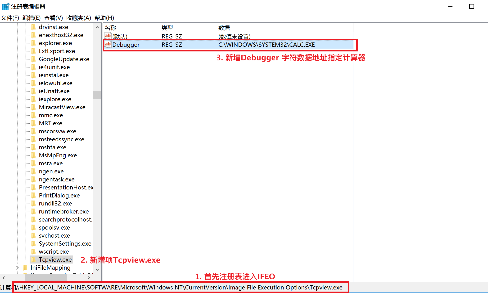
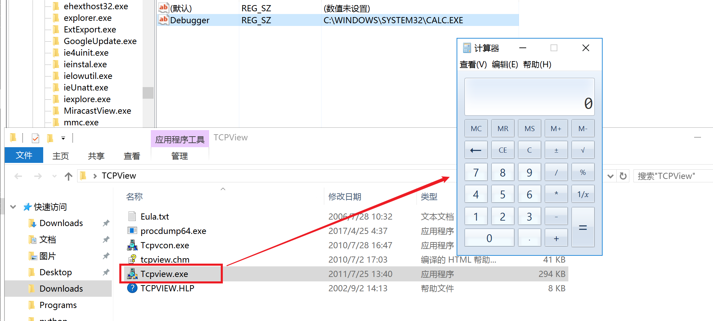
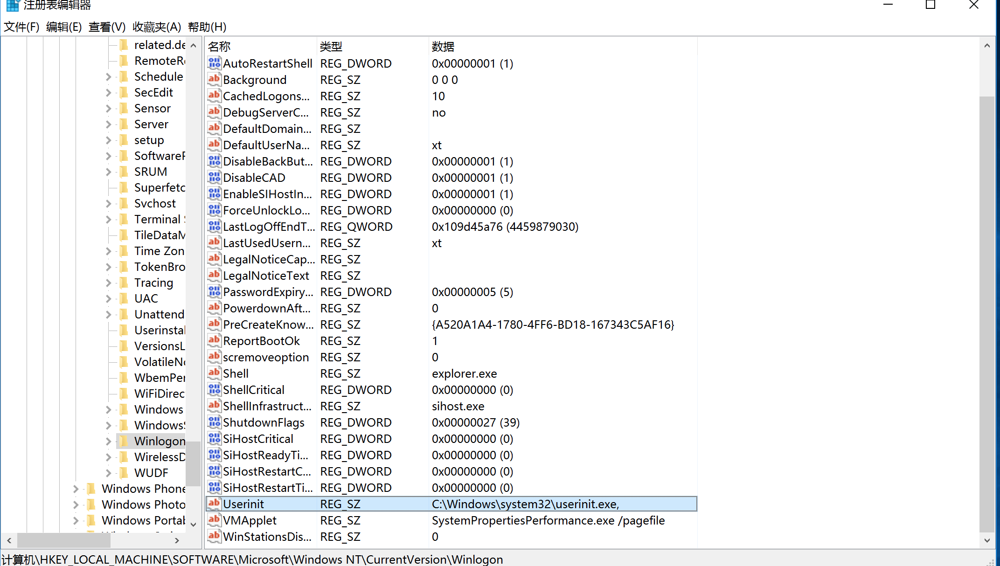
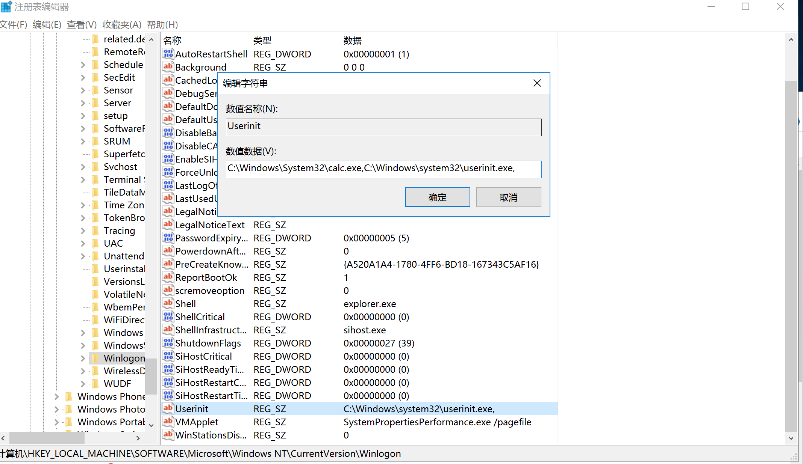
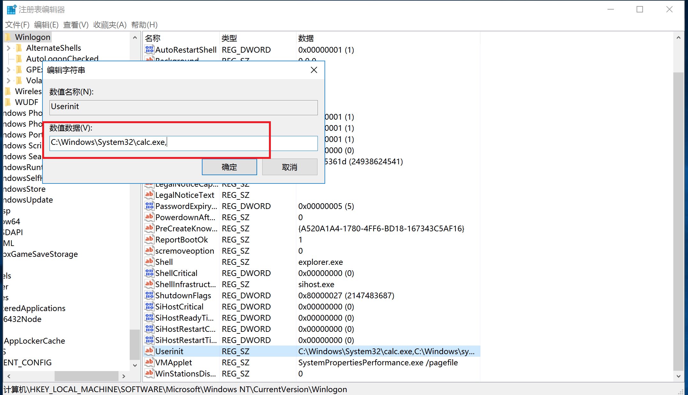
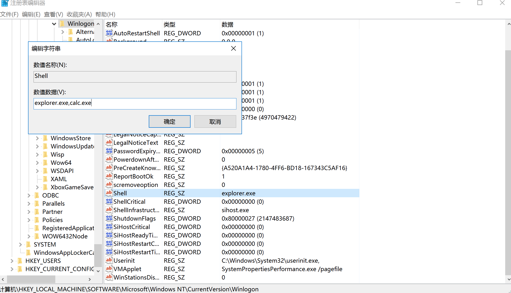
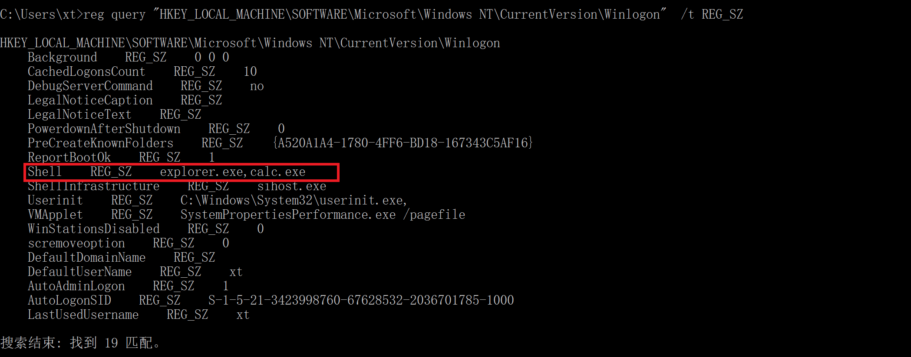

# 镜像劫持

映像劫持的定义 所谓的映像劫持（IFEO）就是Image File Execution Options/或字面直译 Image Hijack，

### 劫持点1 Image File Execution Options镜像劫持

位于注册表的HKEY_LOCAL_MACHINE\SOFTWARE\Microsoft\Windows NT\CurrentVersion\Image File Execution Options里面exe被进行修改进行重定向的一个过程






### 劫持点2 userinit镜像劫持

参考：https://blog.csdn.net/u013761036/article/details/53527490


通过了解劫持过程可以知道这个劫持点利用的是windows系统服务启动用户初始化加载程序配置替换或插入自定义程序造成劫持

HKEY_LOCAL_MACHINE\SOFTWARE\Microsoft\Windows NT\CurrentVersion\Winlogon\userinit.exe




这里阅读下[userinit的官方释义](https://docs.microsoft.com/en-us/previous-versions/windows/it-pro/windows-2000-server/cc939862(v=technet.10)?redirectedfrom=MSDN)可知，userinit.exe的作用为：

1. 运行系统登录脚本
2. 重新建立网络连接

1. 当userinit.exe所指向的程序无法运行的时候，启动配置的HKEY_LOCAL_MACHINE\SOFTWARE\Microsoft\Windows NT\CurrentVersion\Winlogon\shell中设定的值，默认是explorer.exe




这里有个提示：在修改HKEY_LOCAL_MACHINE\SOFTWARE\Microsoft\Windows NT\CurrentVersion\Winlogon\userinit.exe的时候，应包含userinit.exe



但我们去掉c:\windows\system32\userinit.exe，重启则会引起异常，所以这里一般都还会带上userinit.exe或者包含启动userinit.exe的脚本。通过运行启动userinit进入系统即可。


### 劫持点3 shell镜像劫持




# 镜像劫持检查

## 针对IFEO劫持点检查

HKEY_LOCAL_MACHINE\SOFTWARE\Microsoft\Windows NT\CurrentVersion\Image File Execution Options  对注册表进行检查，检查不一致的项目即可判断是否存在劫持。


这里查看IFEO的值，我们直接一句话全读，然后一次审核每一项即可。通过阅读[reg query语法](https://docs.microsoft.com/en-us/previous-versions/windows/it-pro/windows-server-2012-r2-and-2012/cc742028(v=ws.11))可知/s递归查询,/t REG_SZ指定字符。

```
reg query "HKEY_LOCAL_MACHINE\SOFTWARE\Microsoft\Windows NT\CurrentVersion\Image File Execution Options" /s /t REG_SZ
```


## 针对userinit和shell劫持点检查

这里由于userinit劫持点位于HKEY_LOCAL_MACHINE\SOFTWARE\Microsoft\Windows NT\CurrentVersion\Winlogon根目录的属性中，因此不需要/s递归。

```
reg query "HKEY_LOCAL_MACHINE\SOFTWARE\Microsoft\Windows NT\CurrentVersion\Winlogon" /t REG_SZ
```




