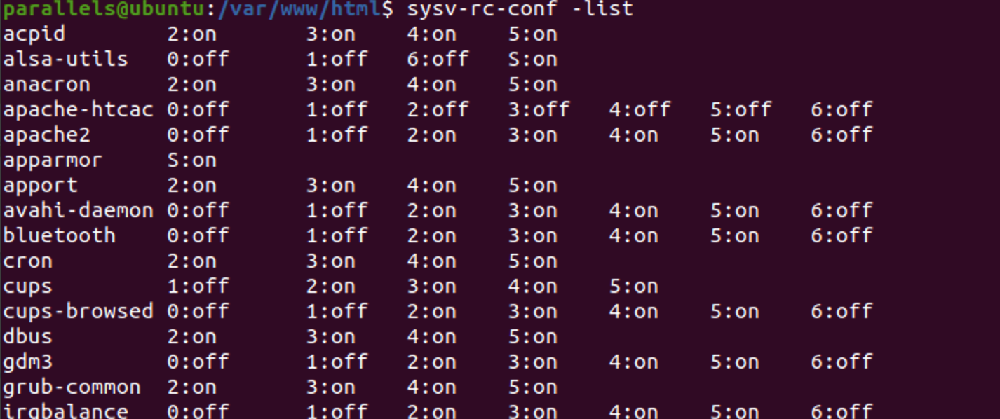
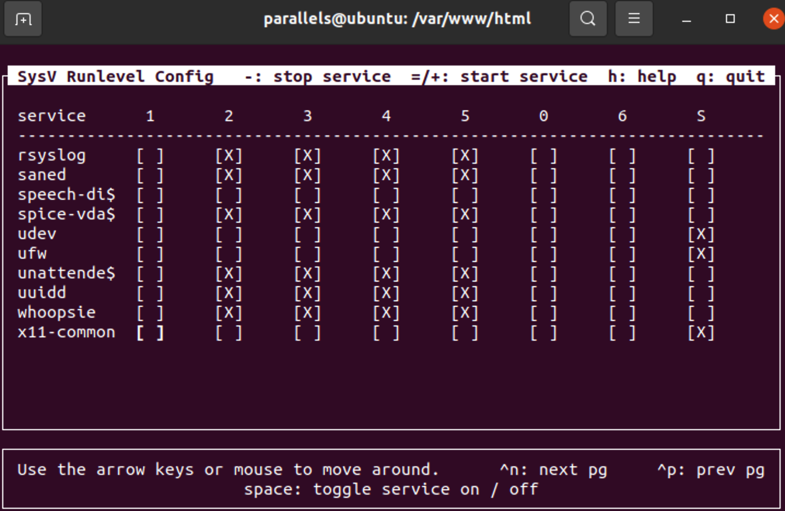
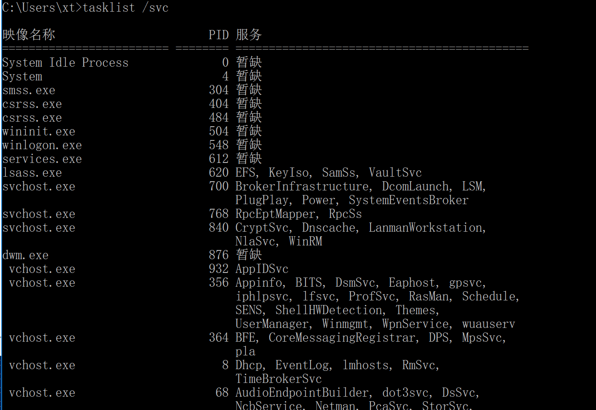
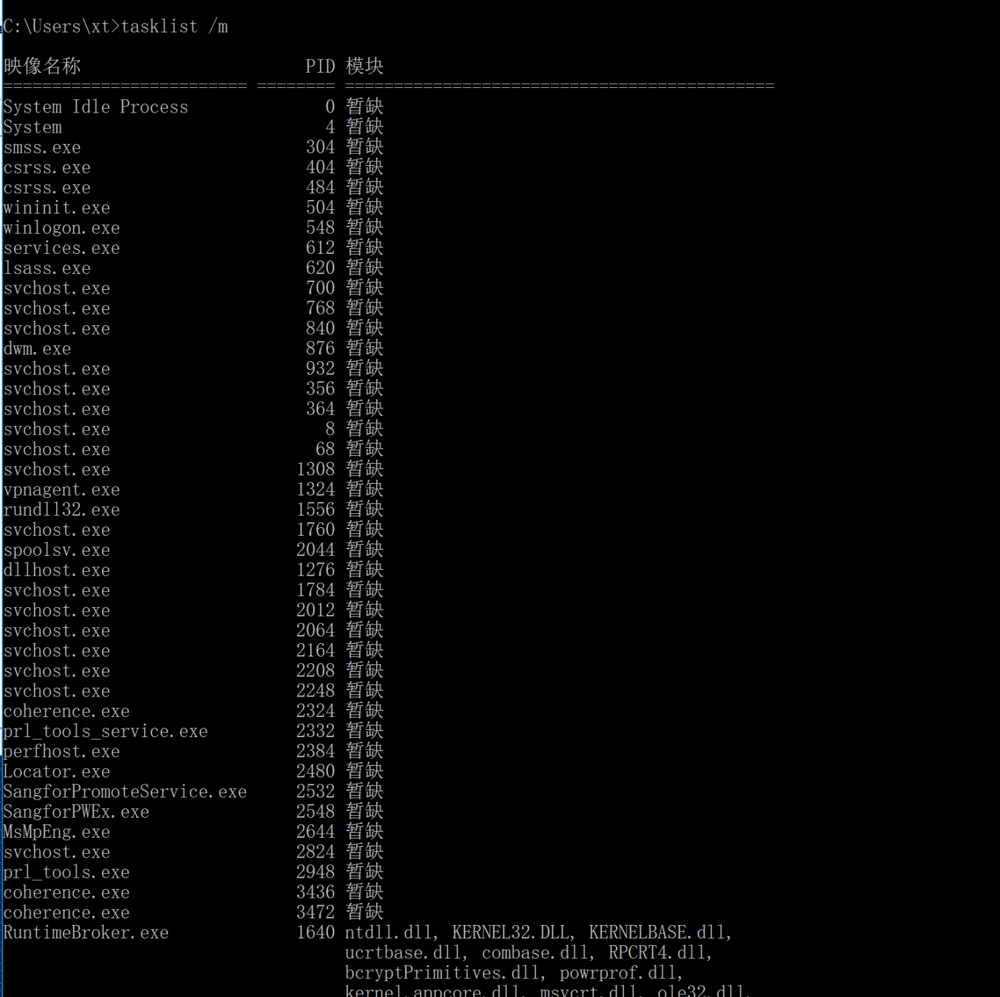
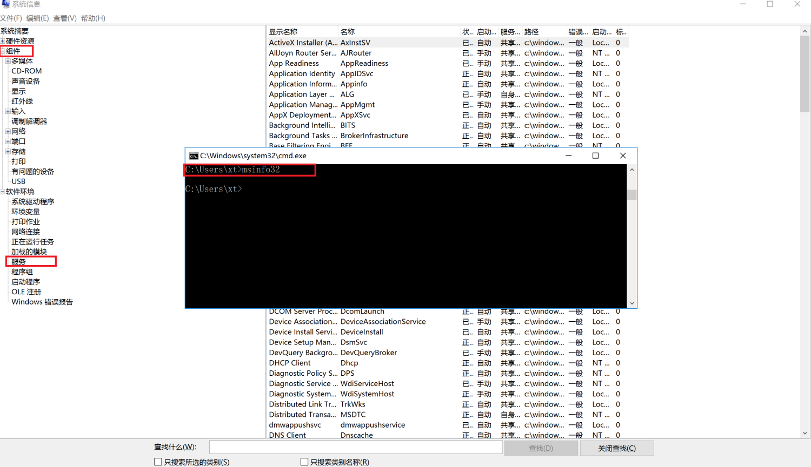

# Linux下服务信息检查

## chkconfig（linux）

redhat中常用

### 基本命令

```
chkconfig [--add][--del][--list][系统服务] 或 chkconfig [--level <等级代号>][系统服务][on/off/reset]
--add 　增加所指定的系统服务，让 chkconfig 指令得以管理它，并同时在系统启动的叙述文件内增加相关数据。chkconfig确保每个运行级有一项启动(S)或者杀死(K)入口。如有缺少，则会从缺省的init脚本自动建立。
--del 　删除所指定的系统服务，不再由 chkconfig 指令管理，并同时在系统启动的叙述文件内删除相关数据。删除服务，并把相关符号连接从/etc/rc[0-6].d删除。
--level<等级代号> 　指定读系统服务要在哪一个执行等级中开启或关毕。设置某一服务在指定的运行级是被启动，停止还是重置。
```

列出chkconfig 所知道的所有命令。

```
chkconfig --list
```

开启服务。

```
chkconfig xxx on/off  //开启/关闭xxx服务
```

### 使用范例

```
chkconfig –list        #列出所有的系统服务
chkconfig –add httpd        #增加httpd服务
chkconfig –del httpd        #删除httpd服务
chkconfig –level httpd 2345 on        #设置httpd在运行级别为2、3、4、5的情况下都是on（开启）的状态
chkconfig –list        #列出系统所有的服务启动情况
chkconfig –list mysqld        #列出mysqld服务设置情况
chkconfig –level 35 mysqld on        #设定mysqld在等级3和5为开机运行服务，–level 35表示操作只在等级3和5执行，on表示启动，off表示关闭
chkconfig mysqld on        #设定mysqld在各等级为on，“各等级”包括2、3、4、5等级
```

##  

## ntsysv（linux）

redhat特有类图形界面管理模式来设置开机启动

### ntsysv基本命令

```
ntsysv [--back][--level <等级代号>]
--back 　在互动式界面里，显示Back钮，而非Cancel钮。
--level <等级代号> 　在指定的执行等级中，决定要开启或关闭哪些系统服务。
```

使用ntsysv命令管理自启动，可以管理独立服务和xinetd服务。


## sysv-rc-conf（ubuntu）

**Chkcofig不再适用于Ubuntu系统，可用类似的软件sysv-rc-conf进行替换**

### 安装sysv-rc-conf

```
sudo apt-get install sysv-rc-conf
```

### 基本命令

```
Usage:
    sysv-rc-conf [ options ]
    sysv-rc-conf --list [ service ]
    sysv-rc-conf [ --level levels ] service <on|off>
```

操作界面十分简洁，你可以用鼠标点击，也可以用键盘方向键定位，用[空格键](https://baike.baidu.com/item/空格键)选择，用Ctrl+N翻下一页，用Ctrl+P翻上一页，用Q退出。其中，“X”表示开启该服务。






​      init 进程读取 /etc/inittab 文件中的信息,并进入预设的运行级别，按顺序运行该运行级别对应文件夹下的脚本。脚本通常以 start 参数启动,并指向一个系统中的程序。

​    通常情况下, /etc/rcS.d/ 目录下的启动脚本首先被执行,然后是/etc/rcN.d/ 目录。例如您设定的运行级别为 3,那么它对应的启动目录为 /etc/rc3.d/ 。


参考：https://blog.csdn.net/u013554213/article/details/86584705


**部分系统服务详解**

```
acpi-support 这个是关于电源支持的默认是1,2,3,4,5下启动，我认为你可以把它调整到s级别。
acpid acpi的守护程序，默认是2－5开启，我认为可以不用管。
alsa alsa声音子系统，应该不用开启它。
alsa-utils 这个服务似乎取代了alsa，所以开启这个就可以了，我在S级别开启它。
anacron 这是一个用于执行到时间没有执行的程序的服务，我认为它无所谓，所以关了它，这个可以随便。
apmd 也是一种电源管理，我认为电脑如果不是很老，它就没有开启的必要了。
atd 和anacron类似，我把它关了。
bluez-utiles 传说中的蓝牙服务，然后遗憾我没有，所以关了。
bootlogd 似乎使用来写log的，安全期间开着他也许比较好。
cron 指定时间运行程序的服务，所以开着比较好的。
cupsys 打印机服务，所以如果你有，就开启吧。
dbus 消息总线系统，非常重要，一定要开。
dns-clean 拨号连接用的，如果不用，就关了它。
evms 企业卷管理系统，由于我并不明白什么叫做企业卷，所以我关了它。
fetchmail 用于邮件守护，我关了它。
gdm gnome桌面管理器，我关了它，然后用startx启动gnome。
halt 关机用的，不要更改
hdparm 这个我刚才有讲，如果没有ide硬盘也就不用开启它了。
hotkey-setup 这个是给某些品牌笔记本设计的热键映射，台式机用户请关了它
hotplug 这个是用于热插拔的，我已经测试过了，在某些电脑上关闭它会使声卡无效，请在S级别开启它。
hplip hp打印机专用的，应该可以关了它。
ifrename 网络接口重命名，好像没用，关了。
ifupdown 这个使用来打开网络的，开着它。
ifupdown-clean 同上。
klogd linux守护程序，接受来自内核和发送信息到syslogd的记录，并记录为一个文件，所以请开着它。
linux-restricted-modules-common 这个使用来使用受限制的模块的，你可以从/lib/linux-restricted-modules下查看，如果没有什么，你可以关掉它。
lvm 逻辑卷管理器，如果你没有请关了它。
makedev 用来创建设备到/dev/请不要动他。
mdamd 管理raid用，如果你没有请关闭它。
module-init-tools 从/etc/modules 加在扩展模块的，这个一般开着。
networking 增加网络接口和配置dns用，将它开启。
ntp-server 与ubuntu时间服务器进行同步的，关了。
pcmcia 激活pcmica设备，遗憾我有生以来都没有见过这样的设备，关了它。
powernowd 用于管理cpu的客户端程序，如果有变频功能，比如amd的quite' cool 那么就开启它吧。
ppp 拨号用的，我关了它。
ppp-dns 一样，也关了。
readahead 预加载服务，让我想起了win的预读，当然他们不同，它会使启动变慢3－4妙，所以我关了它。
reboot 重启用的，不要动。
rmnologin 如果发现nologin，就去除它，在笔记本上不用开启。
rsync rsync协议守护，请视情况而定。
screen-cleanup 一个清除开机屏幕的脚本，随便。
sendsigs 重启和关机时向所有进程发送消息。所以不要管它。
single 激活但用户模式，不用管它。
stop-bootlogd 从2,3,4,5级别停止bootlogd,不用管它。
sudo 这个不用说吧，不用管它。
sysklogd 用于记录系统日志信息，不用管它。
udev 用户空间dev文件系统，不用管它。
udev-mab 同上。
umountfs 用来卸载文件卷的，不用管它。
urandom 生成随即数的，不知道怎么用，不用管它。
usplash 那个漂亮的启动画面，但是我关了它，它也存在，所以想关他需要把内核起动参数中的splash一句删掉。
vbesave 显卡bios配置工具，不用管它。
xorg-common 设置x服务ice socket。不用管它。
```

## service（ubuntu）

service命令用于对系统服务进行管理，比如启动（start）、停止（stop）、重启（restart）、查看状态（status）等。
相关的命令还包括chkconfig、ntsysv等，chkconfig用于查看、设置服务的运行级别，ntsysv用于直观方便的设置各个服务是否自动启动。
service命令本身是一个shell脚本，它在/etc/init.d/目录查找指定的服务脚本，然后调用该服务脚本来完成任务。

```
Usage: service < option > | --status-all | [ service_name [ command | --full-restart ] ]
```

service --status-all


在man手册中可以看到描述 “The SCRIPT parameter specifies a System V init script, located in /etc/init.d/SCRIPT. ”也就是说这里service所列出的服务都是在 /etc/init.d/目录下。


## 入侵排查

```
chkconfig（sysv-rc-conf）  --list  查看服务自启动状态，可以看到所有的RPM包安装的服务
ps aux | grep crond 查看当前服务
service --status-all 可选的查询当前服务的方式

基本的过滤：
中文环境
chkconfig（sysv-rc-conf） --list | grep "3:启用\|5:启用"
英文环境
chkconfig（sysv-rc-conf） --list | grep "3:on\|5:on"
```


# windows下服务信息检查

## services.msc

打开运行，输入services.msc命令，可打开服务窗口，查看所有的服务项，包括服务的名称、描述、状态等。


## tasklist

### tasklist基本用法

```
C:\Users\xt>tasklist /?

TASKLIST [/S system [/U username [/P [password]]]]
         [/M [module] | /SVC | /V] [/FI filter] [/FO format] [/NH]

描述:
    该工具显示在本地或远程机器上当前运行的进程列表。


参数列表:
   /S     system           指定连接到的远程系统。

   /U     [domain\]user    指定应该在哪个用户上下文执行这个命令。

   /P     [password]       为提供的用户上下文指定密码。如果省略，则
                           提示输入。

   /M     [module]         列出当前使用所给 exe/dll 名称的所有任务。
                           如果没有指定模块名称，显示所有加载的模块。

   /SVC                    显示每个进程中主持的服务。

   /APPS 显示应用商店应用及其关联的进程。

   /V                      显示详细任务信息。

   /FI    filter           显示一系列符合筛选器
                           指定条件的任务。

   /FO    format           指定输出格式。
                           有效值: "TABLE"、"LIST"、"CSV"。

   /NH                     指定列标题不应该
                           在输出中显示。
                           只对 "TABLE" 和 "CSV" 格式有效。

   /?                      显示此帮助消息。

筛选器:
    筛选器名称     有效运算符           有效值
    -----------     ---------------           --------------------------
    STATUS          eq, ne                    RUNNING | SUSPENDED
                                              NOT RESPONDING | UNKNOWN
    IMAGENAME       eq, ne                    映像名称
    PID             eq, ne, gt, lt, ge, le    PID 值
    SESSION         eq, ne, gt, lt, ge, le    会话编号
    SESSIONNAME     eq, ne                    会话名称
    CPUTIME         eq, ne, gt, lt, ge, le    CPU 时间，格式为
                                              hh:mm:ss。
                                              hh - 小时，
                                              mm - 分钟，ss - 秒
    MEMUSAGE        eq, ne, gt, lt, ge, le    内存使用(以 KB 为单位)
    USERNAME        eq, ne                    用户名，格式为
                                              [域\]用户
    SERVICES        eq, ne                    服务名称
    WINDOWTITLE     eq, ne                    窗口标题
    模块         eq, ne                    DLL 名称

注意: 当查询远程计算机时，不支持 "WINDOWTITLE" 和 "STATUS"
      筛选器。

Examples:
    TASKLIST
    TASKLIST /M
    TASKLIST /V /FO CSV
    TASKLIST /SVC /FO LIST
    TASKLIST /APPS /FI "STATUS eq RUNNING"
    TASKLIST /M wbem*
    TASKLIST /S system /FO LIST
    TASKLIST /S system /U 域\用户名 /FO CSV /NH
    TASKLIST /S system /U username /P password /FO TABLE /NH
    TASKLIST /FI "USERNAME ne NT AUTHORITY\SYSTEM" /FI "STATUS eq running"
```


参考：https://blog.csdn.net/bcbobo21cn/article/details/51759521


### tasklist查询服务

```
tasklist /svc
```



对于某些加载DLL的恶意进程，可以通过输入tasklist /m命令进行查询

```
tasklist /m [xxx.dll]
```



## msinfo32系统自带诊断工具




## 入侵排查

```
tasklist /svc
tasklist /m |more
tasklist /v /fi "pid gt 10000"              列出pid大于10000的进程
tasklist /v /fi "pid gt 10000" /fo csv      列出pid大于10000的进程,并且导出csv格式
tasklist /fi "username ne nt autority\system" /fi "status eq running"   列出系统中正在运行的非“SYSTEM”状态的所有进程
也可以使用工具
msinfo32
```
