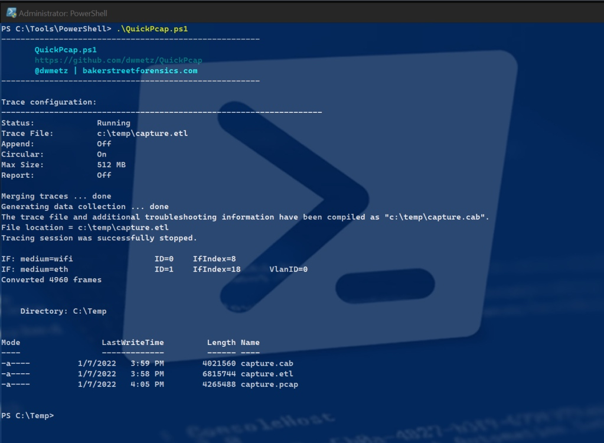

# [译]快速pcap-使用powershell抓取pacp包
---
title: [译]快速pcap-使用powershell抓取pacp包
date: 2023-02-02 12:03:49
tags: 应急响应;调查取证;抓包
---

原文：https://bakerstreetforensics.com/2022/01/07/quickpcap-capturing-a-pcap-with-powershell/

今天早些时候我被要求一个“快速并且简单”的powershell在windows环境中抓包。我手头上什么都没有，因此我出发去google并且找到了必要的材料。

开始是使用window内置的netsh trace。如果我们想要抓包90秒，使用trace开始，等待90秒，然后停止，那么他的语法是：
```
netsh trace start capture=yes IPv4.Address=192.168.1.167 tracefile=c:\temp\capture.etl
Start-Sleep 90
netsh trace stop
```
* 注意这里有3行（第一行抓包的大小可能受限于windows的硬盘大小）

像wireshark一样，你需要指定你想要抓包的网卡。在这个例子中在活动的网卡中我想抓包IP为192.168.1.167的IP。但是如果我事先不知道IP地址的话我该如何自动化使用此方法？

我们可以获取本地ipv4地址然后保存为一个变量。

```
#Get the local IPv4 address
$env:HostIP = (
    Get-NetIPConfiguration |
    Where-Object {
        $_.IPv4DefaultGateway -ne $null -and
        $_.NetAdapter.Status -ne "Disconnected"
    }
).IPv4Address.IPAddress
```
现在将两者结合：
```
$env:HostIP = (
    Get-NetIPConfiguration |
    Where-Object {
        $_.IPv4DefaultGateway -ne $null -and
        $_.NetAdapter.Status -ne "Disconnected"
    }
).IPv4Address.IPAddress
netsh trace start capture=yes IPv4.Address=$env:HostIP tracefile=c:\temp\capture.etl
Start-Sleep 90
netsh trace stop
```
很好。自动抓包并且不用安装wireshark在宿主机上。只有抓包的时间需要自己按照需求进行调试一下。修改start-sleep后的参数即可。

但是稍等，需求是得到一个pcap文件。而不是.elt。幸运的是对于我们来说有一个简单的转换的实用工具etl2pacpng(https://github.com/microsoft/etl2pcapng/releases)。执行也很简单只需要给定源文件路径和目标文件路径即可。

```
./etl2pcapng.exe c:\temp\capture.etl c:\temp\capture.pcap
```
就是这样。我们现在能够在windows宿主机上在不添加任何额外的工具的情况下抓包了。我们可以很方便的将他们收集和转换共享给任何喜欢数据包分析的人了。

我已经打包了所有的东西到Quickpacp.ps1(https://github.com/dwmetz/QuickPcap)中，在我的github里。

QuickPacp.ps1

在本文的案例中，抓包和转换都运行在一个连续的恒旭中，但是容易将他们想象成由不同进程通过脚本处理的独立自动元素。毕竟，我们制作乐高积木的方式各不相同，不是吗?
