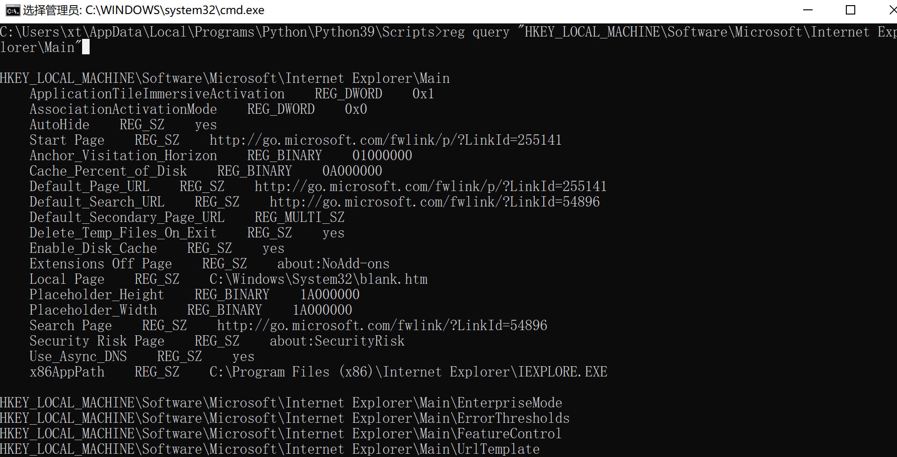
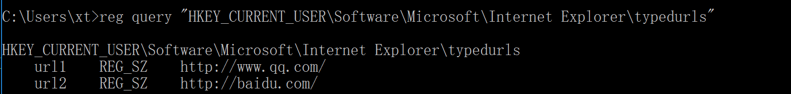

# windows下浏览器相关检查

通常HKEY_LOCAL_MACHINE（计算机配置）配置权限大于HKEY_CURRENT_USER（当前用户）。这	里尝试使用命令行查询所有IE浏览器相关的主页信息、搜索引擎信息、浏览历史等信息。

## 计算机IE注册表配置查询

包括开始页面，默认页面，默认搜索，首页，搜索页，以及32位软件地址等。

```
reg query "HKEY_LOCAL_MACHINE\Software\Microsoft\Internet Explorer\Main"  
    ApplicationTileImmersiveActivation    REG_DWORD    0x1
    AssociationActivationMode    REG_DWORD    0x0
    AutoHide    REG_SZ    yes
    Start Page    REG_SZ    http://go.microsoft.com/fwlink/p/?LinkId=255141  # 开始页面
    Anchor_Visitation_Horizon    REG_BINARY    01000000
    Cache_Percent_of_Disk    REG_BINARY    0A000000
    Default_Page_URL    REG_SZ    http://go.microsoft.com/fwlink/p/?LinkId=255141  # 默认页面
    Default_Search_URL    REG_SZ    http://go.microsoft.com/fwlink/?LinkId=54896  # 默认搜索连接
    Default_Secondary_Page_URL    REG_MULTI_SZ
    Delete_Temp_Files_On_Exit    REG_SZ    yes
    Enable_Disk_Cache    REG_SZ    yes
    Extensions Off Page    REG_SZ    about:NoAdd-ons
    Local Page    REG_SZ    C:\Windows\System32\blank.htm 
    Placeholder_Height    REG_BINARY    1A000000
    Placeholder_Width    REG_BINARY    1A000000
    Search Page    REG_SZ    http://go.microsoft.com/fwlink/?LinkId=54896
    Security Risk Page    REG_SZ    about:SecurityRisk
    Use_Async_DNS    REG_SZ    yes
    x86AppPath    REG_SZ    C:\Program Files (x86)\Internet Explorer\IEXPLORE.EXE
    
    
  # 独立查询，可以使用/v + 值，如搜索main中的search page的值则可以这样搜索：
  reg query "HKEY_LOCAL_MACHINE\Software\Microsoft\Internet Explorer\Main" /V "Search Page"
  # 如果要遍历main下面的所有键值则可以/s递归查询。
  reg query "HKEY_LOCAL_MACHINE\Software\Microsoft\Internet Explorer\Main" /s
```



## 当前用户IE注册表配置查询


```
reg query "HKEY_CURRENT_USER\Software\Microsoft\Internet Explorer\Main"

HKEY_CURRENT_USER\Software\Microsoft\Internet Explorer\Main
    Anchor Underline    REG_SZ    yes
    Disable Script Debugger    REG_SZ    yes
    DisableScriptDebuggerIE    REG_SZ    yes
    Display Inline Images    REG_SZ    yes
    Do404Search    REG_BINARY    01000000
    Save_Session_History_On_Exit    REG_SZ    no
    Search Page    REG_SZ    http://go.microsoft.com/fwlink/?LinkId=54896
    Show_FullURL    REG_SZ    no
    Show_StatusBar    REG_SZ    yes
    Show_ToolBar    REG_SZ    yes
    Show_URLinStatusBar    REG_SZ    yes
    Show_URLToolBar    REG_SZ    yes
    Use_DlgBox_Colors    REG_SZ    yes
    UseClearType    REG_SZ    no
    XMLHTTP    REG_DWORD    0x1
    Cache_Update_Frequency    REG_SZ    Once_Per_Session
    Local Page    REG_SZ    C:\Windows\system32\blank.htm
    Enable Browser Extensions    REG_SZ    no
    Play_Background_Sounds    REG_SZ    yes
    Play_Animations    REG_SZ    yes
    Start Page    REG_SZ    http://go.microsoft.com/fwlink/?LinkId=625115
    ImageStoreRandomFolder    REG_SZ    bxh3g4d
    OperationalData    REG_QWORD    0x20d
    CompatibilityFlags    REG_DWORD    0x0
    SearchBandMigrationVersion    REG_DWORD    0x1
    FullScreen    REG_SZ    no
    Window_Placement    REG_BINARY    2C0000000000000001000000FFFFFFFFFFFFFFFFFFFFFFFFFFFFFFFF3A040000250200007A0A00000D060000
    IE10RunOncePerInstallCompleted    REG_DWORD    0x1
    IE10RunOnceCompletionTime    REG_BINARY    A1D359E1A039D701
    IE10TourShown    REG_DWORD    0x1
    IE10TourShownTime    REG_BINARY    A1D359E1A039D701
    News Feed First Run Experience    REG_DWORD    0x0
    DownloadWindowPlacement    REG_BINARY    2C0000000000000000000000FFFFFFFFFFFFFFFFFFFFFFFFFFFFFFFF2E020000A30000002E07000063040000
    IE11EdgeNotifyTime    REG_BINARY    1F473383CF8DD701
    EdgeReminderRemainingCount    REG_DWORD    0x4
    IE11DefaultsFREConfigUpdateTimestamp    REG_BINARY    00000000
    Isolation    REG_SZ    PMIL
    SuppressScriptDebuggerDialog    REG_DWORD    0x0
    AllowSavingHistory    REG_DWORD    0x1
    ScriptDebugger_EnableHiddenTabs    REG_DWORD    0x0
    ApplicationTileImmersiveActivation    REG_DWORD    0x1
    AssociationActivationMode    REG_DWORD    0x0
    StatusBarWeb    REG_DWORD    0x1
    HideNewEdgeButton    REG_DWORD    0x1
    HideOpenWithEdgeInContextMenu    REG_DWORD    0x0
    ShowApplicationGuardFirstRunExperienceFromIE    REG_DWORD    0x1
    ForceGDIPlus    REG_DWORD    0x0
    AlwaysShowMenus    REG_DWORD    0x0
    ShutdownWaitForOnUnload    REG_DWORD    0x0
    DNSPreresolution    REG_DWORD    0x8
    SpellChecking    REG_DWORD    0x1
    LangToolsBroker    REG_SZ    {5bbd58bb-993e-4c17-8af6-3af8e908fca8}
    DisablePasswordReveal    REG_DWORD    0x0
    EnableLeakDetectionInEdge    REG_DWORD    0x0
    LastClosedWidth    REG_DWORD    0x320
    LastClosedHeight    REG_DWORD    0x258
    AllowPrinting    REG_DWORD    0x1
    AllowMixedModePrintingInPDF    REG_DWORD    0x0
    DisableRequiresActiveXPrompt    REG_SZ
    EnableGetHostEnvironmentValue    REG_DWORD    0x1
    IE11DefaultsFRECompletionTime    REG_BINARY    00000000
    IE11DefaultsFREGPOCheckTimestamp    REG_BINARY    00000000
    PredictedViewExpansion    REG_DWORD    0x64
    PredictedViewChangeThreshold    REG_DWORD    0xa
    PredictedViewChangeThresholdPaint    REG_DWORD    0xa
    ContentLayerCacheExpansion    REG_DWORD    0x12c
    RenderingLoopMaxTime    REG_DWORD    0xfa
    NscSingleExpand    REG_DWORD    0x0
    Error Dlg Displayed On Every Error    REG_SZ    no
    Friendly http errors    REG_SZ    yes
    CSS_Compat    REG_SZ    doctype
    Expand Alt Text    REG_SZ    no
    Display Inline Videos    REG_DWORD    0x1
    Use Stylesheets    REG_DWORD    0x1
    SmoothScroll    REG_DWORD    0x1
    Show image placeholders    REG_DWORD    0x0
    Disable Diagnostics Mode    REG_SZ    no
    Move System Caret    REG_SZ    no
    Enable AutoImageResize    REG_SZ    yes
    UseThemes    REG_DWORD    0x1
    UseHR    REG_DWORD    0x0
    Q300829    REG_DWORD    0x0
    Cleanup HTCs    REG_DWORD    0x0
    XDomainRequest    REG_DWORD    0x1
    DOMStorage    REG_DWORD    0x1
    EnableAlternativeCodec    REG_SZ    yes
    JScriptProfileCacheEventDelay    REG_DWORD    0x1388
    HideLocalHostIP    REG_DWORD    0x0
    CrossfadeMinTimeoutInMS    REG_DWORD    0x7530
    CrossfadeMaxTimeoutInMS    REG_DWORD    0x7530
    CrossfadeCurrentTimeoutInMS    REG_DWORD    0x7530
    ScrollTimeoutInMS    REG_DWORD    0x1770
    IsDrtTestRunning    REG_SZ    no
    DisableFirstRunCustomize    REG_DWORD    0x0
    IE10RunOnceLastShown    REG_DWORD    0x0
    IE10RunOnceLastShown_TIMESTAMP    REG_BINARY    1FEC0438A693D601
    IE10RecommendedSettingsNo    REG_DWORD    0x0
    EdgeReminderURL    REG_SZ    http://go.microsoft.com/fwlink/?LinkId=838604
    EdgeReminderDuration    REG_DWORD    0x1f
    FrameTabWindow    REG_DWORD    0x1
    AdminTabProcs    REG_DWORD    0x1
    SessionMerging    REG_DWORD    0x1
    FrameMerging    REG_DWORD    0x1
    CPLaunch    REG_DWORD    0x0
    HangRecovery    REG_DWORD    0x1
    DesktopTransparentCoverWindowTime    REG_DWORD    0x8
    TSEnable    REG_DWORD    0x1
    Isolation64Bit    REG_DWORD    0x0
    IsolationImmersive    REG_SZ    PMEM
    NoUpdateCheck    REG_DWORD    0x1
    Search Bar    REG_SZ    Preserve
    MinIEEnabled    REG_DWORD    0x1
    RefcountTracker    REG_DWORD    0x0
    TabDragOnSingleProc    REG_DWORD    0x0
    ForceBFCacheCandidacyPass    REG_DWORD    0x0
    Fasterback    REG_DWORD    0x1
    BackForwardInstrumentation    REG_DWORD    0x0
    FormSuggest PW Ask    REG_SZ    yes
    IsDRTRunning    REG_SZ    no
    SyncHomePage    REG_BINARY
    Use FormSuggest    REG_SZ    no

HKEY_CURRENT_USER\Software\Microsoft\Internet Explorer\Main\ApplicationGuard
HKEY_CURRENT_USER\Software\Microsoft\Internet Explorer\Main\FeatureControl
HKEY_CURRENT_USER\Software\Microsoft\Internet Explorer\Main\Touch
HKEY_CURRENT_USER\Software\Microsoft\Internet Explorer\Main\WindowsSearch
```

## 查询IE历史记录

```
reg query "HKEY_CURRENT_USER\Software\Microsoft\Internet Explorer\typedurls"
```



## inetcpl.cpl

偶尔遇到ie存在问题时，可以利用inetcpl.cpl快速打开internet管理页面

### 利用InetCpl.cpl快速打开相关internet页面

Internet   属性，可有ItemNo参数     
“常规”属性页     
WinExec('RunDLL32.exe   Shell32.dll,Control_RunDLL   InetCpl.cpl,,0',   SW_SHOWNORMAL);  

RunDLL32.exe   Shell32.dll,Control_RunDLL   InetCpl.cpl,,0   
“安全”属性页     
WinExec('RunDLL32.exe   Shell32.dll,Control_RunDLL   InetCpl.cpl,,1',   SW_SHOWNORMAL);  

RunDLL32.exe   Shell32.dll,Control_RunDLL   InetCpl.cpl,,1   
“内容”属性页     
WinExec('RunDLL32.exe   Shell32.dll,Control_RunDLL   InetCpl.cpl,,2',   SW_SHOWNORMAL);  

RunDLL32.exe   Shell32.dll,Control_RunDLL   InetCpl.cpl,,2   
“连接”属性页     
WinExec('RunDLL32.exe   Shell32.dll,Control_RunDLL   InetCpl.cpl,,3',   SW_SHOWNORMAL);   

RunDLL32.exe   Shell32.dll,Control_RunDLL   InetCpl.cpl,,3  
“程序”属性页     
WinExec('RunDLL32.exe   Shell32.dll,Control_RunDLL   InetCpl.cpl,,4',   SW_SHOWNORMAL);    RunDLL32.exe   Shell32.dll,Control_RunDLL   InetCpl.cpl,,4
“高级”属性页     
WinExec('RunDLL32.exe   Shell32.dll,Control_RunDLL   InetCpl.cpl,,5',   SW_SHOWNORMAL);   

RunDLL32.exe   Shell32.dll,Control_RunDLL   InetCpl.cpl,,5


### 利用InetCpl.cpl删除IE痕迹

清除临时文件emporary Internet Files

RunDll32.exe InetCpl.cpl,ClearMyTracksByProcess 8

清除Cookies

RunDll32.exe InetCpl.cpl,ClearMyTracksByProcess 2

清除历史History

RunDll32.exe InetCpl.cpl,ClearMyTracksByProcess 1

清除表单Form Data

RunDll32.exe InetCpl.cpl,ClearMyTracksByProcess 16

清除密码Passwords

RunDll32.exe InetCpl.cpl,ClearMyTracksByProcess 32

清除所有Delete All

RunDll32.exe InetCpl.cpl,ClearMyTracksByProcess 255

清除所有+所有插件Delete All – “Also delete files and settings stored by add-ons”

RunDll32.exe InetCpl.cpl,ClearMyTracksByProcess 4351

#
