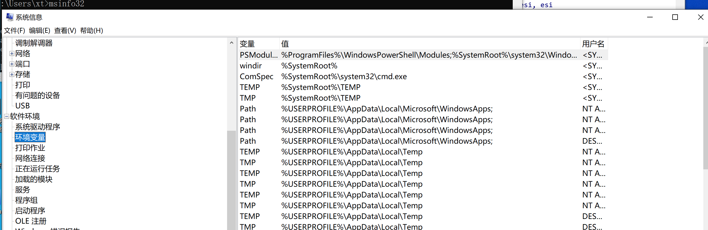
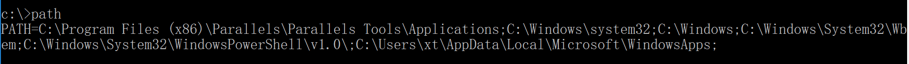
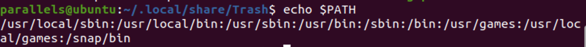

环境变量一般用于命令行快速执行命令，快速执行程序使用。恶意软件或黑客通常会通过一些环境变量设置，隐藏恶意程序，或添加恶意程序在环境变量中，用于实现对主机的控制。

# windows环境变量检查

## 利用msinfo32

使用



Linux环境变量文件介绍https://blog.csdn.net/pengjunlee/article/details/81585726

## windows命令行提取环境变量

```
path
```



# linux环境变量检查

## linux命令行提取环境变量

```
echo $PATH 
```


