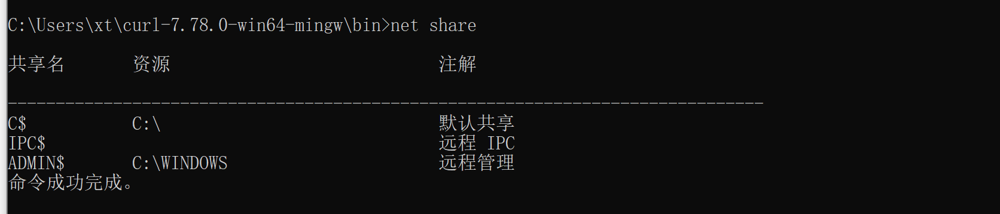
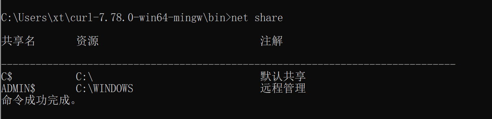
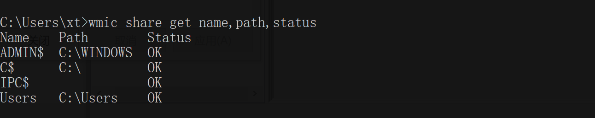
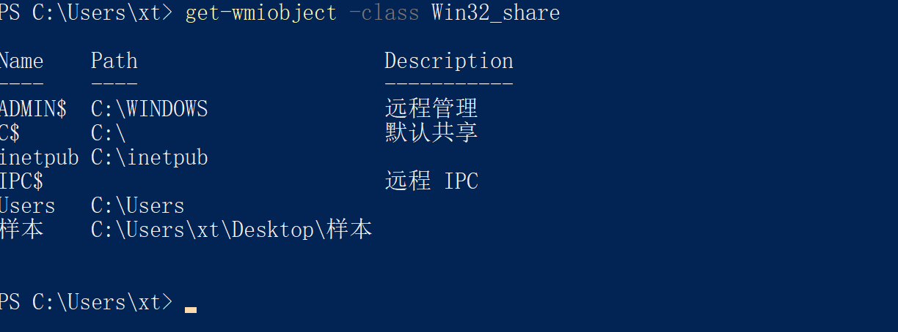
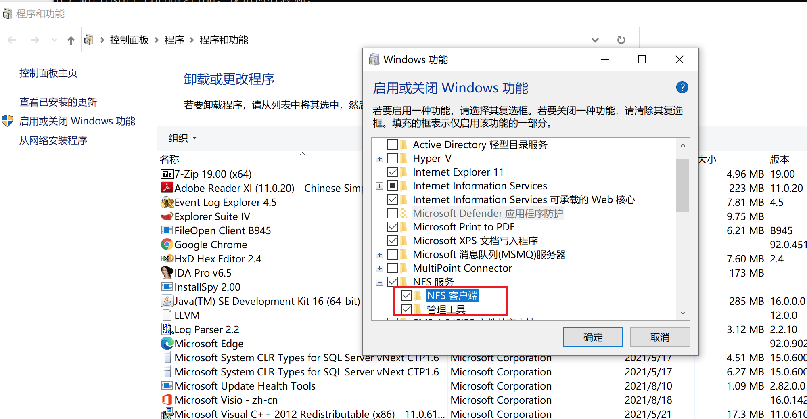
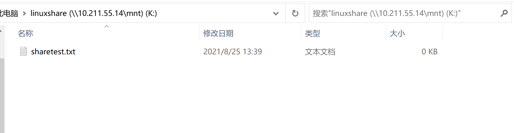
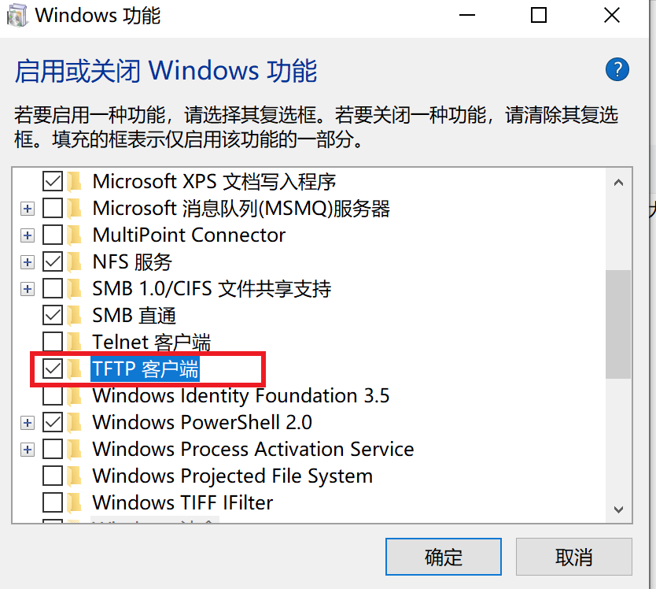
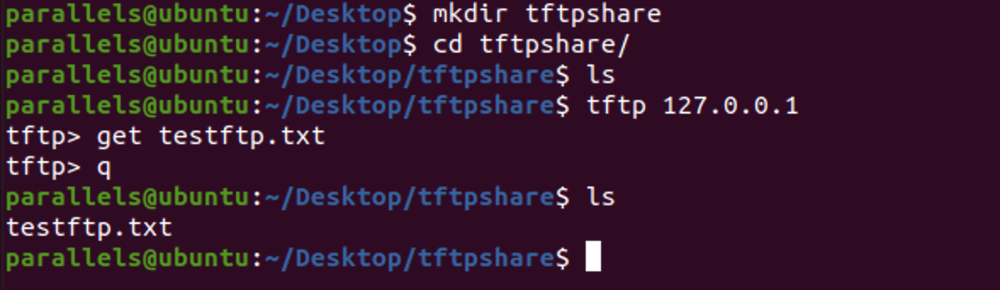
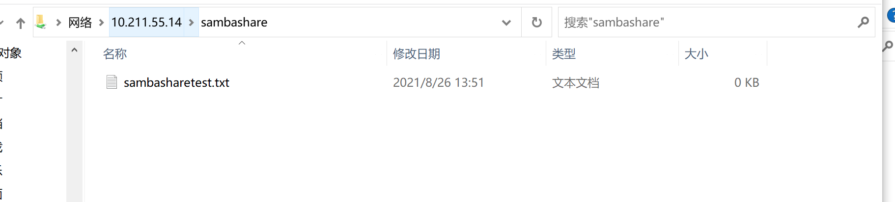

# windows系统共享


## net share 查询

查看系统中所有共享

```
net share
```



通过命令看到所有盘符都是默认共享 IPC$空连接尤为不安全,所以我们要关闭默认共享

删除共享命令

```
net share 共享名 /del
```





## wmic share查询

```
C:\Users\xt>wmic share get name,path,status
Name    Path        Status
ADMIN$  C:\WINDOWS  OK
C$      C:\         OK
IPC$                OK
Users   C:\Users    OK
```




## get-wmiobject查询（powershell）

```
get-wmiobject -class Win32_share
```



## 注册表查询

目前找到的资料只知道在创建自定义的共享文件的时候，下面这个注册表内容会有变化

DelegateFolders

\>reg query "HKEY_LOCAL_MACHINE\SOFTWARE\Microsoft\Windows\CurrentVersion\Explorer\MyComputer\NameSpace\DelegateFolders" /s

实测确实会有变化，从注册表方式查询共享文件内容方式暂时无法继续。


### 开启系统默认共享


开启系统的默认共享（Admin$、C$）的方法

```
# 默认共享开启自动开启，在系统重启的时候自动打开
reg add "HKEY_LOCAL_MACHINE\System\CurrentControlSet\Services\LanmanServer\Parameters" /v AutoShareServer /t REG_DWORD /d 0x01
reg add "HKEY_LOCAL_MACHINE\System\CurrentControlSet\Services\LanmanServer\Parameters" /v AutoShareWks /t REG_DWORD /d 0x01
# IPC$共享开启，设置命名管道设置为0，不限制
reg add "HKEY_LOCAL_MACHINE\SYSTEM\ControlSet001\Control\Lsa" /v restrictanonymous /t REG_DWORD /d 0x00
reg add "HKEY_LOCAL_MACHINE\SYSTEM\CurrentControlSet\Control\Lsa" /v restrictanonymous /t REG_DWORD /d 0x00
reg add "HKEY_LOCAL_MACHINE\SYSTEM\CurrentControlSet\Control\Lsa" /v restrictanonymous /t REG_DWORD /d 0x00
```


4.重启。通常Win2003、Win2000\XP会在启动时自动创建。
5.启动后，可以通过运行CMD命令进入命令行模式，再运行net share，再共享列表中会看到Admin$、C$等默认共享。


三：也可以在开始菜单的运行中输入CMD，然后输入以下的命令
net share c$=c:
net share d$=d:
net share ipc$


### 关闭系统共享


清除系统默认共享（Admin$、C$）：

```
# 默认共享（c$、admin$）关闭（2003取消ipc$方式也是这个）
reg add "HKEY_LOCAL_MACHINE\System\CurrentControlSet\Services\LanmanServer\Parameters" /v AutoShareServer /t REG_DWORD /d 0x00  
reg add "HKEY_LOCAL_MACHINE\System\CurrentControlSet\Services\LanmanServer\Parameters" /v AutoShareWks /t REG_DWORD /d 0x00   
```

### 限制ipc$共享

#### 通过限制命名空间限制ipc$共享

IPC$限制使用关闭有些服务，必须要求启动IPC$共享命名管道，特别是一些微软出品的应用软件。如微软的SQL Server数据库，必须要启用IPC$共享命名管道。否则的话，数据库就无法正常运行。IPC$共享命名管道，也是SQL Server数据库与微软服务器操作系统无缝集成的一个通道。“HKEY_LOCAL_MACHINE\SYSTEM\CurrentControlSet\Control\Lsa”。在这一项内容中，有一个叫做restrictanonymous的键值。如果设置为"1"，一个匿名用户仍然可以连接到IPC$共享，但无法通过这种连接得到列举SAM帐号和共享信息的权限；在Windows 2000 中增加了"2"，未取得匿名权的用户将不能进行ipc$空连接。建议设置为1。如果上面所说的主键不存在，就新建一个再改键值。

```
reg add "HKEY_LOCAL_MACHINE\SYSTEM\ControlSet001\Control\Lsa" /v restrictanonymous /t REG_DWORD /d 0x01
reg add "HKEY_LOCAL_MACHINE\SYSTEM\CurrentControlSet\Control\Lsa" /v restrictanonymous /t REG_DWORD /d 0x01
reg add "HKEY_LOCAL_MACHINE\SYSTEM\CurrentControlSet\Control\Lsa" /v restrictanonymous /t REG_DWORD /d 0x01
以上注册表关闭IPC$的方式并不能清除共享，只能限制匿名用户枚举sam用户
```

#### 通过临时关闭服务或删除服务对本次启动的服务进行限制

限制ipc$共享/停止ipc$共享基于的服务server，**但是重启仍然会自动开启，根据资料将**HKEY_LOCAL_MACHINE/SYSTEM/CurrentControlSet/Services/LanmanServer/Parameters其中的AutoShareWks和AutoShareServer的值都改成0，只能在重启后禁止自动打开**默认共享**，对于IPC$共享并不会起作用。

```
net share ipc$  /delete 
net stop server
```


原理参考：

https://blog.csdn.net/shenshaojun/article/details/111280025

[https://blog.csdn.net/wudibaobei8/article/details/2898754?utm_medium=distribute.pc_relevant.none-task-blog-2%7Edefault%7EBlogCommendFromMachineLearnPai2%7Edefault-2.base&depth_1-utm_source=distribute.pc_relevant.none-task-blog-2%7Edefault%7EBlogCommendFromMachineLearnPai2%7Edefault-2.base](https://blog.csdn.net/wudibaobei8/article/details/2898754?utm_medium=distribute.pc_relevant.none-task-blog-2~default~BlogCommendFromMachineLearnPai2~default-2.base&depth_1-utm_source=distribute.pc_relevant.none-task-blog-2~default~BlogCommendFromMachineLearnPai2~default-2.base)


## net view查询（远程）


net view \\<computername>

net view /workgroup:<workgroupname>

```
其中 <workgroupname> 是要查看其共享资源的工作组名。除了不能查看工作组列表外，可以使用 NET VIEW 命令执行“网上邻居”或“我的电脑”中的大部分可用浏览功能。如果不带命令行参数，或者带 /WORKGROUP 开关参数使用 NET VIEW 命令，可以看到一组计算机列表，其中左列是计算机名，右列是标记。除使用 Microsoft 网络用户之外，如果还使用 NetWare 网络用户，可以在“其它服务器”下看到 NetWare (NCP) 服务器列表。
如果使用 NET VIEW 命令和计算机名，可以看到该计算机上的可用资源列表。如果使用 Microsoft Client for Microsoft Networks 和 Microsoft Client for NetWare Networks，计算机名可以是 SMB (Microsoft) 或 NCP (NetWare) 计算机名。
如果使用 NET VIEW 命令和您的计算机名，可以看到您计算机上的共享资源列表。
如果使用 NET USE 命令，可以看到网络连接状态、连接的本地名（映射的驱动器号）和连接的远程名（UNC 服务器位置）。
```


NET VIEW命令使用格式如下:

```
1.NET VIEW　[\\computername [/CACHE] | /DOMAIN[:domainname]]
2.NET VIEW /NETWORK:NW [\\computername]
/domain[:domainname] 指定要查看其可用计算机的域或工作组。如果省略 DomainName，/domain 将显示网络上的所有域或工作组名。
/network:nw 显示 NetWare 网络上所有可用的服务器。如果指定计算机名，/network:nw 将通过 NetWare 网络显示该计算机上的可用资源。也可以指定添加到系统中的其他网络。
```


下面是一些net view命令的使用范例:

```
1.查看由 \\Production 计算机共享的资源列表
net view \\production
2.查看 NetWare 服务器 \\Marketing 上的可用资源
net view /network:nw \\marketing
3.查看sale域或工作组中的计算机列表
net view /domain:sales
4.查看 NetWare 网络中的所有服务器
net view /network:nw
```


# linux系统共享

## 

## NFS服务

网络文件系统（NFS，Network File System）是一种将远程主机上的分区（目录）经网络挂载到本地系统的一种机制，通过对网络文件系统的支持，用户可以在本地系统上像操作本地分区一样来对远程主机的共享分区（目录）进行操作。


### 安装nfs服务端

```
sudo apt install nfs-kernel-server
```

#### 配置

创建导出目录（共享的目录成为导出目录）。这里新建一个共享文件用于测试共享文件/mnt/linuxshare目录下创建个sharetest.txt

```
# 创建共享文件目录
sudo mkdir -p /mnt/linuxshare
sudo touch /mnt/linuxshare/sharetest.txt
# 修改文件夹权限
sudo chown nobody:nogroup /mnt/linuxshare
sudo chmod 777 /mnt/linuxshare
```


修改nfs配置文件/etc/exports，添加如下一行

/home/yourname/sharedir 10.1.60.34(rw,sync,no_root_squash)


/mnt/linuxshare 10.211.55/24(rw,sync,no_subtree_check)


注意，上面的主机IP不能使用＊来通配，在客户机上会导致出现拒绝访问，使用子网掩码例如：10.1.60.0/255.255.254.0即可让10.1.60.*和10.1.61.*都可以访问,还可以使用10.1.60/23这种方式类确定子网。


#### 启动服务

测试配置文件

$sudo  exportfs  -r

$sudo /etc/init.d/portmap start

$sudo /etc/init.d/nfs-kernel-server start

#### 打开防火墙限制

```
sudo ufw allow from 10.211.55.0/24 to any port nfs
```


#### 其他情况

启动nfs出现以下错误，前提防火墙已经关闭，其他机器有mount要先umount

Starting NFS daemon: **[FAILED]**

**然后重启nfs**

**/etc/init.d/portmap stop**

**/etc/init.d/nfs stop**

如果仍然存在nfsd进程则需要手动全部kill

**ps -ef | grep nfs**


参考：

https://developer.aliyun.com/article/459761

nfs原理https://blog.csdn.net/qq_38265137/article/details/83146421


### 安装nfs客户端


#### 安装客户端

linux

```
sudo apt-get install nfs-common
```

windows

在功能处



#### 连接共享

```
mount \\10.211.55.14\mnt\linuxshare k:\
```





### showmount查看共享（只能查nfs）

只能查询到nfs共享

```
showmount -e 
```


## TFTP服务

TFTP（Trivial File Transfer Protocol，简单文件传输协议），是一个基于UDP 协议实现的用于在客户机和服务器之间进行简单文件传输的协议，适合于开销不大、不复杂的应用场合。TFTP 协议专门为小文件传输而设计，只能从服务器上获取文件，或者向服务器写入文件，不能列出目录，也不能进行认证。


参考链接：https://blog.csdn.net/zhuisaozhang1292/article/details/83047365

### 服务端搭建

#### 安装

安装tftp-hpa,tftpd-hpa,前面的是客户端，后面的是服务程序, 安装好xinetd

```
sudo apt-get install tftp-hpa tftpd-hpa
sudo apt-get install xinetd
```


#### 配置

1. 配置/etc/xinetd.conf 

```
vim /etc/xinetd.conf 
```

配置服务器相关配置/etc/default/tftpd-hpa，可以看到默认配置tftp的服务端目录为/srv/tftp（默认随程序安装目录就已经创建）

```
# /etc/default/tftpd-hpa

TFTP_USERNAME="tftp"
TFTP_DIRECTORY="/srv/tftp"
TFTP_ADDRESS=":69"
TFTP_OPTIONS="--secure"
```

1. 配置/etc/xinetd.d/tftp

如果文件不存在就创建一个，需要注意修改的是server_args项目改成本地tftp配置中的TFTP_DIRECTORY中的值，这里是“/srv/tftp”。

```
service tftp

{     socket_type            =dgram
       protocol                  =udp
       wait                        =yes
       user                        =root
       server                     =/usr/sbin/in.tftpd
       server_args             =-s /srv/tftp -c
       disable                    =no
       per_source             =11
       cps                         =100 2
       flags                       =IPv4
}
```


#### 启动服务

```
sudo service tftpd-hpa restart
sudo /etc/init.d/xinetd reload
sudo /etc/init.d/xinetd restart
```


### 客户端配置：

#### 客户端安装

linux

```
sudo apt-get install tftp-hpa
```

windows

```
# 命令行安装
pkgmgr /iu:"TFTP"
```



#### 连接tftp

在tftp服务器的tftp的根目录创建testftp.txt作为测试文件。因为tftp无法列出文件目录的文件列，因此需要指定文件下载。


windows下连接下载文件

```
tftp 10.211.55.14 get testftp.txt
```


[
](https://developer.aliyun.com/article/459761)

[
](https://developer.aliyun.com/article/459761)linux下连接下载文件

```
tftp 127.0.0.1
tftp> get testftp.txt	
```




参考：

https://www.cnblogs.com/andriod-html5/archive/2012/05/07/2539224.html

https://blog.csdn.net/liruishen79/article/details/19035319

## samba服务

Samba是用来实现SMB的一种软件，SMB(全称是Server Message Block)是一个协议名，它能被用于Web连接和客户端与服务器之间的信息沟通。Samba服务可用于将linux文件系统作为CIFS/SMB网络文件共享进行共享，并将linux打印机作为CIFS/SMB打印机共享进行共享。


参考：https://blog.csdn.net/zxy15771771622/article/details/78734299


### 安装samba服务端


#### 安装

```
sudo apt-get install samba
安装完执行，samba确认已完成安装
samba
```

#### 配置

主要配置文件：

```
/etc/samba/smb.conf
NetBIOS名与主机的对应关系：
/etc/samba/lmhosts
```

#### 共享

直接将需要共享的目录写入/etc/samba/smb.conf即可。


将文件中的内容做如下相应修改：
\#security=user 后面添加：
security=share
在文件结尾添加如下行：

```
[sambashare] 
    comment = samba home directory 
    path = /home/sambashare
    public = yes 
    browseable = yes 
    public = yes 
    writeable = yes 
    read only = no
    valid users = parallels
    create mask = 0777
    directory mask = 0777 
    #force user = nobody
    #force group = nogroup
    available = yes 
```

注意：[sambashare] 这个地方不能有空格，客户端在定位服务器中目录的位置就通过这个[]中间的值进行定位，形如```\\ip\[值]```来进行访问，中括号中不能带有空格，否则windows下会有问题，

保存退出，启动Samba服务：

```
/etc/init.d/samba-ad-dc start
```

### samba客户端

#### 连接共享

为了测试在home下创建sambashare目录匹配配置中的path内容，用于作为sambashare的目录，并创建sambasharetest.txt文件作为测试文件


windows下文件资源管理器中\\10.211.55.14\sambashare即可




参考：

https://blog.csdn.net/littesss/article/details/85222601


## df查询（无法查询上面的3中服务）

df命令用来查看系统的space和inode使用情况,也是常用命令之一

-a 显示所有的文件系统,包括本地的和挂载的网络文件系统

-h 显示大小的时候,以人性化的方式来显示,以更适合的方式来显示

-T 现实文件系统类型

-t 显示指定的文件系统

-l 只显示本地文件系统

-k 以KB为单位显示

-x 不显示指定的文件系统

-i 显示inode使用情况


# 综上：

通过对windows和linux共享服务的过程查询可知：

windows下查询共享通过net share、wmic share、get-wmiobject方式查询，linux下查询共享只能通过先判断启用了那种共享服务然后根据配置文件定位共享目录判断共享内容。
