## windows查看用户
### whoami
查看当前用户


### net user

#### 命令释义
[查阅官网文档](https://docs.microsoft.com/en-us/previous-versions/windows/it-pro/windows-server-2012-r2-and-2012/cc771865)
```
net user [<UserName> {<Password> | *} [<Options>]] [/domain]
net user [<UserName> {<Password> | *} /add [<Options>] [/domain]]
net user [<UserName> [/delete] [/domain]]
```

| 参数         | 描述                                                   |
| ----- | ----- |
| ```<UserName>``` | 指定用户账户名字用于添加/删除/修改/查看。账户名称最多20字符。 |
| ```<Password>``` | 分配/修改用户账户密码。password参数输入*，会产生一个前端的提示，“请输入密码 ： ”，这时输入的密码均不会出现原文，密码输入均以不可见方式输入，并且系统会要求两次输入确保输入无误。 |
| ```/domain```  | 在计算机的主域的域控制器上执行操作。 |
| ```<Options> ```  | 指定命令行选项。关于命令行选项语法的描述请参见下表。 |
| ```net help <Command>``` | 显示指定net命令的帮助。 |


| **命令行选项语法**                                           | **描述**                                                     |
| ------------------------------------------------------------ | ------------------------------------------------------------ |
| /active: {no \| yes}                                          | 启用或禁用用户帐户。如果该用户帐户未激活，则该用户无法访问计算机上的资源。默认为yes(即活动)。 |
| ```/comment: "<Text>"  ```                                          | 提供关于用户帐户的描述性注释。这个注释最多可以有48个字符。将文本用引号括起来。 |
| /countrycode: ```<NNN> ```                                          | 使用操作系统国家/地区代码实现用户帮助和错误消息的指定语言文件。0表示默认的国家/地区代码。 |
| ```expires: <MM\/DD\/YYYY> \| <DD/MM/YYYY> \| <mmm,dd,YYYY> \| never ```| 如果指定日期，则导致用户帐户过期。根据国家/地区代码的不同，过期日期的格式可以是[MM\/DD\/YYYY]、[DD/MM/YYYY]或[mmm, DD,YYYY]。请注意，帐户将在指定日期开始时过期。对于月份值，您可以使用数字，拼写出来，或者使用三个字母的缩写(即，Jan, Feb, Mar, Apr, May, Jun, Jul, Aug, Sep, Oct, Nov, Dec)。可以使用两个或四个数字作为年份值。使用逗号或斜杠来分隔日期。不要使用空格。如果忽略```<YYYY>```，则假定该日期(即，根据您计算机的日期和时间)的下一个出现。例如，以下条目在1994年1月10日和1995年1月8日之间输入是等价的: jan,91/9/95january,9,19951/9 |
| /fullname: "```<Name>```"                                           | 指定用户的全名而不是用户名。将名称用引号括起来。             |
| /homedir: ```<Path>```                                           | 设置用户的主目录的路径。该路径必须已经存在。                 |
| /passwordchg: {yes \| no}                                     | 指定用户是否可以修改自己的密码。默认为yes。                  |
| /passwordreq: {yes \| no}                                     | 指定用户帐户是否必须有密码。默认为yes。                      |
| /profilepath: [```<Path>```]                                        | 设置用户登录配置文件的路径。这个路径指向一个注册表配置文件。 |
| /scriptpath: ```<Path>  ```                                         | 设置用户登录脚本的路径。<路径>不能是绝对路径。```<Path>```相对于%systemroot%\System32\Repl\Import\Scripts。 |
|``` /times: {<Day>[<-Day>][,<Day>[-<Day>]],<Time>[-<Time>][,<Time>[-<Time>]][;] \| all} ```| 指定允许用户使用计算机的次数。< >时间限制为1小时递增。对于```<Day>```值，您可以拼写出日期的名称或使用缩写(即M、T、W、Th、F、Sa、Su)。您可以使用12小时或24小时表示法表示小时。如果您使用12小时表示法，请使用AM和PM，或A.M.和P.M.值all表示用户始终可以登录。空值(空白)意味着用户永远不能登录。用逗号分隔日和时间，用分号分隔日和时间的单位(例如，M,4AM-5PM;T,1PM-3PM)。在指定的时间不要使用空格。 |
| ```/usercomment: "<Text>"  ```                                      | 指定管理员可以为该帐户添加或更改“用户评论”。将文本用引号括起来。 |
| ```/workstations: {<ComputerName>[,...] \| *} ```                   | 列出用户可以从其中登录到网络的至多8个工作站。列表中的多个条目用逗号分隔。如果/工作站没有列表或列表是星号(*)，则用户可以从任何计算机登录。 |


#### 常用语句

```
以下示例显示本地计算机的所有用户帐户列表: 
net user

显示用户账号tommyh的信息，示例如下: 
net user tommyh

下面的示例为一个用户添加了一个用户帐户，该用户的全名是Jay Jamison，用户名是jayj，拥有从周一到周五上午8点到下午5点的登录权限(时间指定中没有空格)，一个强制密码(Cyk4^g3B)和用户的全名: 
net user jayj Cyk4^g3B /add /passwordreq: yes /times: monday-friday,8am-5pm /fullname: "Jay Jamison"

下面的示例使用24小时表示法设置miked的登录时间(8 A.M.到5 P.M.): 
net user miked /time: M-F,08: 00-17: 00

下面的示例使用12小时表示法设置miked的登录时间(8 A.M.到5 P.M.): 
net user miked /time: M-F,8AM-5PM

以下示例指定的登录时间为: 星期一早上4点到下午5点，星期二下午1点到下午3点，星期三到星期五上午8点到下午5点。
net user anibals /time: M,4AM-5PM;T,1PM-3PM;W-F,8: 00-17: 00
```

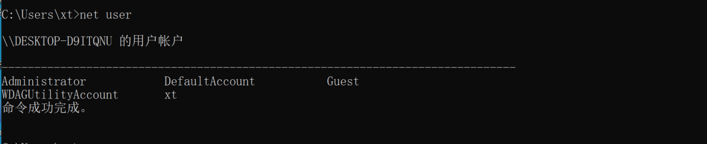

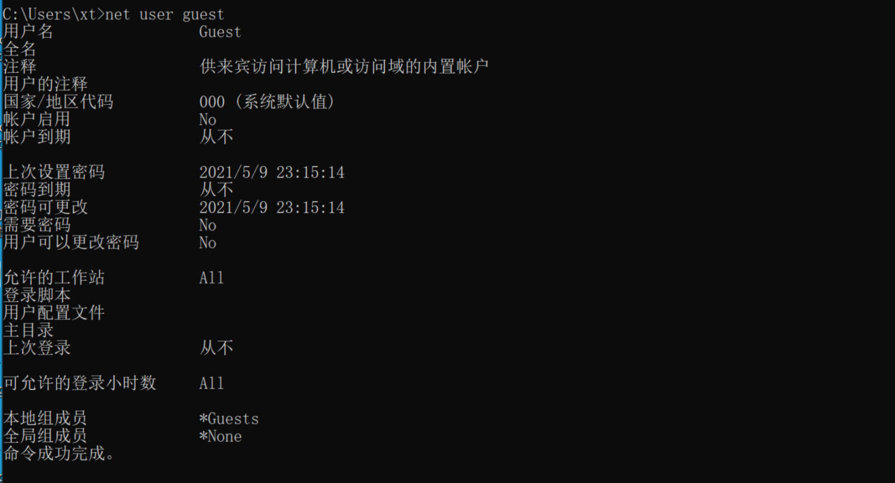

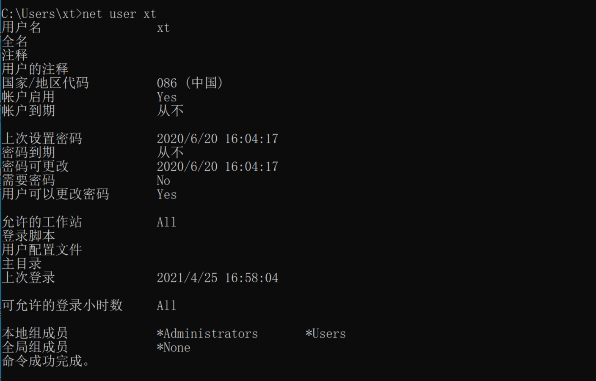


### net localgroup 用户组

这里也同样到官方查看相关用法，可以在这里找到：https://docs.microsoft.com/en-us/previous-versions/windows/it-pro/windows-server-2012-r2-and-2012/cc725622(v=ws.11)

#### 命令释义

```
net localgroup [<GroupName> [/comment: "<Text>"]] [/domain]
net localgroup [<GroupName> {/add [/comment: "<Text>"] | /delete} [/domain]
net localgroup [<GroupName> <Name> […] {/add |  /delete} [/domain]
<GroupName>
指定要添加、展开或删除的本地组的名称。net localgroup <GroupName>显示本地组中用户或全局组的列表，无需附加参数。

/comment: "<Text>"
为新组或现有组添加注释。备注最多256个字符。将文本用引号括起来。

/domain
在当前域的主域控制器上执行该操作。否则，操作将在本地执行。

<Name>[ ...]
列出要从本地组中添加或删除的一个或多个用户名或组名。

/add
将全局组名或用户名添加到本地组。在使用此命令将用户或全局组添加到本地组之前，必须先为用户或全局组建立帐户。

/delete
从本地组中移除组名或用户名。

net help <Command>
显示指定net命令的帮助。
```

#### 常用语句

```
以下示例将名为Exec的本地组添加到本地用户帐户数据库，输入: 

Net localgroup exec /add . Net

以下示例将名为Exec的本地组添加到域用户帐户数据库，输入: 

Net localgroup exec /add /domain

以下示例将现有用户帐户stevev、ralphr(来自Sales域)和jennyt添加到本地计算机上的Exec本地组，输入: 

Net localgroup exec stevev sales\ralphr jennyt /add

以下示例将现有用户帐户stevev、ralphr和jennyt添加到域的Exec组中，输入: 

Net localgroup exec stevev ralphr jennyt /add /domain

以下示例显示Exec本地组中的用户，输入: 

net localgroup exec

以下示例向Exec本地组记录添加注释，输入: 

net localgroup exec /comment: “行政人员。”
```


### wmic useraccount（可审影子账户）

wmic 也常被用于后渗透阶段系统快速信息收集，我们仍然先从基本命令入手

```
command </parameter>
```


| 子命令         | 描述                                                |
| -------------- | --------------------------------------------------- |
| class          | 转义WMIC的默认别名模式，以直接访问WMI模式中的类。   |
| path           | 转义WMIC的默认别名模式，以直接访问WMI模式中的实例。 |
| context        | 显示所有全局开关的当前值。                          |
| [quit \| exit] | 退出WMIC命令shell。                                 |


| 参数         | 描述                           |
| ------------ | ------------------------------ |
|``` </parameter> ```| <简明描述，以动词>开头         |
| ```</param2>  ```  | <另一个简明的描述，以动词>开头 |


```
> wmic /?

[全局开关] <命令>

可以使用以下全局开关: 
/NAMESPACE           别名在其上操作的命名空间的路径。
/ROLE                包含别名定义的角色的路径。
/NODE                别名在其上操作的服务器。
/IMPLEVEL            客户端模拟级别。
/AUTHLEVEL           客户端身份验证级别。
/LOCALE              客户端应使用的语言 ID。
/PRIVILEGES          启用或禁用所有权限。
/TRACE               将调试信息输出到 stderr。
/RECORD              记录所有输入命令和输出内容。
/INTERACTIVE         设置或重置交互模式。
/FAILFAST            设置或重置 FailFast 模式。
/USER                会话期间要使用的用户。
/PASSWORD            登录会话时要使用的密码。
/OUTPUT              指定输出重定向模式。
/APPEND              指定输出重定向模式。
/AGGREGATE           设置或重置聚合模式。
/AUTHORITY           指定连接的 <授权类型>。
/?[: <BRIEF|FULL>]    用法信息。

有关特定全局开关的详细信息，请键入:  switch-name /?


当前角色中可以使用以下别名: 
ALIAS                    - 对本地系统上可用别名的访问
BASEBOARD                - 基板(也称为主板或系统板)管理。
BIOS                     - 基本输入/输出服务(BIOS)管理。
BOOTCONFIG               - 启动配置管理。
CDROM                    - CD-ROM 管理。
COMPUTERSYSTEM           - 计算机系统管理。
CPU                      - CPU 管理。
CSPRODUCT                - SMBIOS 中的计算机系统产品信息。
DATAFILE                 - 数据文件管理。
DCOMAPP                  - DCOM 应用程序管理。
DESKTOP                  - 用户的桌面管理。
DESKTOPMONITOR           - 桌面监视器管理。
DEVICEMEMORYADDRESS      - 设备内存地址管理。
DISKDRIVE                - 物理磁盘驱动器管理。
DISKQUOTA                - 用于 NTFS 卷的磁盘空间使用量。
DMACHANNEL               - 直接内存访问(DMA)通道管理。
ENVIRONMENT              - 系统环境设置管理。
FSDIR                    - 文件系统目录项管理。
GROUP                    - 组帐户管理。
IDECONTROLLER            - IDE 控制器管理。
IRQ                      - 中断请求线路(IRQ)管理。
JOB                      - 提供对使用计划服务安排的作业的访问。
LOADORDER                - 定义执行依赖关系的系统服务的管理。
LOGICALDISK              - 本地存储设备管理。
LOGON                    - 登录会话。
MEMCACHE                 - 缓存内存管理。
MEMORYCHIP               - 内存芯片信息。
MEMPHYSICAL              - 计算机系统的物理内存管理。
NETCLIENT                - 网络客户端管理。
NETLOGIN                 - 网络登录信息(属于特定用户)管理。
NETPROTOCOL              - 协议(及其网络特征)管理。
NETUSE                   - 活动网络连接管理。
NIC                      - 网络接口控制器(NIC)管理。
NICCONFIG                - 网络适配器管理。
NTDOMAIN                 - NT 域管理。
NTEVENT                  - NT 事件日志中的项目。
NTEVENTLOG               - NT 事件日志文件管理。
ONBOARDDEVICE            - 主板(系统板)中内置的通用适配器设备的管理。
OS                       - 已安装操作系统的管理。
PAGEFILE                 - 虚拟内存文件交换管理。
PAGEFILESET              - 页面文件设置管理。
PARTITION                - 物理磁盘的已分区区域的管理。
PORT                     - I/O 端口管理。
PORTCONNECTOR            - 物理连接端口管理。
PRINTER                  - 打印机设备管理。
PRINTERCONFIG            - 打印机设备配置管理。
PRINTJOB                 - 打印作业管理。
PROCESS                  - 进程管理。
PRODUCT                  - 安装程序包任务管理。
QFE                      - 快速修复工程。
QUOTASETTING             - 卷上的磁盘配额设置信息。
RDACCOUNT                - 远程桌面连接权限管理。
RDNIC                    - 对特定网络适配器的远程桌面连接管理。
RDPERMISSIONS            - 特定远程桌面连接的权限。
RDTOGGLE                 - 远程打开或关闭远程桌面侦听程序。
RECOVEROS                - 操作系统出现故障时将从内存收集的信息。
REGISTRY                 - 计算机系统注册表管理。
SCSICONTROLLER           - SCSI 控制器管理。
SERVER                   - 服务器信息管理。
SERVICE                  - 服务应用程序管理。
SHADOWCOPY               - 卷影副本管理。
SHADOWSTORAGE            - 卷影副本存储区域管理。
SHARE                    - 共享资源管理。
SOFTWAREELEMENT          - 系统上安装的软件产品元素的管理。
SOFTWAREFEATURE          - SoftwareElement 的软件产品子集的管理。
SOUNDDEV                 - 声音设备管理。
STARTUP                  - 当用户登录到计算机系统时自动运行的命令的管理。
SYSACCOUNT               - 系统帐户管理。
SYSDRIVER                - 基本服务的系统驱动程序管理。
SYSTEMENCLOSURE          - 物理系统外壳管理。
SYSTEMSLOT               - 物理连接点(包括端口、插槽和外设以及专用连接点)的管理。
TAPEDRIVE                - 磁带驱动器管理。
TEMPERATURE              - 温度传感器(电子温度计)数据管理。
TIMEZONE                 - 时区数据管理。
UPS                      - 不间断电源(UPS)管理。
USERACCOUNT              - 用户帐户管理。
VOLTAGE                  - 电压传感器(电子电压表)数据管理。
VOLUME                   - 本地存储卷管理。
VOLUMEQUOTASETTING       - 将磁盘配额设置与特定磁盘卷相关联。
VOLUMEUSERQUOTA          - 每用户存储卷配额管理。
WMISET                   - WMI 服务操作参数管理。

有关特定别名的详细信息，请键入:  alias /?

CLASS     - 按 Esc 键可获取完整 WMI 架构。
PATH      - 按 Esc 键可获取完整 WMI 对象路径。
CONTEXT   - 显示所有全局开关的状态。
QUIT/EXIT - 退出程序。

有关 CLASS/PATH/CONTEXT 的详细信息，请键入:  (CLASS | PATH | CONTEXT) /?
```


#### 常用语句

```
> wmic useraccount
- 用户帐户管理（可审影子账户）

wmic SYSACCOUNT
- 系统帐户管理

wmic GROUP
- 组帐户管理

wmic NETLOGIN 
- 网络登录信息(属于特定用户)管理

wmic VOLUMEUSERQUOTA
- 每用户存储卷配额管理。
```

如下所示：

```
C: \Users\xt>wmic useraccount
AccountType  Caption                             Description                                                     Disabled  Domain           FullName  InstallDate  LocalAccount  Lockout  Name                PasswordChangeable  PasswordExpires  PasswordRequired  SID                                             SIDType  Status
512          DESKTOP-D9ITQNU\Administrator       管理计算机(域)的内置帐户                                        TRUE      DESKTOP-D9ITQNU                         TRUE          FALSE    Administrator       TRUE                FALSE            TRUE              S-1-5-21-1907407323-3790588764-1508052843-500   1        Degraded
512          DESKTOP-D9ITQNU\DefaultAccount      系统管理的用户帐户。                                            TRUE      DESKTOP-D9ITQNU                         TRUE          FALSE    DefaultAccount      TRUE                FALSE            FALSE             S-1-5-21-1907407323-3790588764-1508052843-503   1        Degraded
512          DESKTOP-D9ITQNU\Guest               供来宾访问计算机或访问域的内置帐户                              TRUE      DESKTOP-D9ITQNU                         TRUE          FALSE    Guest               FALSE               FALSE            FALSE             S-1-5-21-1907407323-3790588764-1508052843-501   1        Degraded
512          DESKTOP-D9ITQNU\WDAGUtilityAccount  系统为 Windows Defender 应用程序防护方案管理和使用的用户帐户。  TRUE      DESKTOP-D9ITQNU                         TRUE          FALSE    WDAGUtilityAccount  TRUE                TRUE             TRUE              S-1-5-21-1907407323-3790588764-1508052843-504   1        Degraded
512          DESKTOP-D9ITQNU\xt                                                                                  FALSE     DESKTOP-D9ITQNU                         TRUE          FALSE    xt                  TRUE                TRUE             FALSE             S-1-5-21-1907407323-3790588764-1508052843-1000  1        OK


C: \Users\xt>wmic SYSACCOUNT
Caption                                        Description                                    Domain           InstallDate  LocalAccount  Name                           SID       SIDType  Status
DESKTOP-D9ITQNU\Everyone                       DESKTOP-D9ITQNU\Everyone                       DESKTOP-D9ITQNU               TRUE          Everyone                       S-1-1-0   5        OK
DESKTOP-D9ITQNU\LOCAL                          DESKTOP-D9ITQNU\LOCAL                          DESKTOP-D9ITQNU               TRUE          LOCAL                          S-1-2-0   5        OK
DESKTOP-D9ITQNU\CREATOR OWNER                  DESKTOP-D9ITQNU\CREATOR OWNER                  DESKTOP-D9ITQNU               TRUE          CREATOR OWNER                  S-1-3-0   5        OK
DESKTOP-D9ITQNU\CREATOR GROUP                  DESKTOP-D9ITQNU\CREATOR GROUP                  DESKTOP-D9ITQNU               TRUE          CREATOR GROUP                  S-1-3-1   5        OK
DESKTOP-D9ITQNU\CREATOR OWNER SERVER           DESKTOP-D9ITQNU\CREATOR OWNER SERVER           DESKTOP-D9ITQNU               TRUE          CREATOR OWNER SERVER           S-1-3-2   5        OK
DESKTOP-D9ITQNU\CREATOR GROUP SERVER           DESKTOP-D9ITQNU\CREATOR GROUP SERVER           DESKTOP-D9ITQNU               TRUE          CREATOR GROUP SERVER           S-1-3-3   5        OK
DESKTOP-D9ITQNU\OWNER RIGHTS                   DESKTOP-D9ITQNU\OWNER RIGHTS                   DESKTOP-D9ITQNU               TRUE          OWNER RIGHTS                   S-1-3-4   5        OK
DESKTOP-D9ITQNU\DIALUP                         DESKTOP-D9ITQNU\DIALUP                         DESKTOP-D9ITQNU               TRUE          DIALUP                         S-1-5-1   5        OK
DESKTOP-D9ITQNU\NETWORK                        DESKTOP-D9ITQNU\NETWORK                        DESKTOP-D9ITQNU               TRUE          NETWORK                        S-1-5-2   5        OK
DESKTOP-D9ITQNU\BATCH                          DESKTOP-D9ITQNU\BATCH                          DESKTOP-D9ITQNU               TRUE          BATCH                          S-1-5-3   5        OK
DESKTOP-D9ITQNU\INTERACTIVE                    DESKTOP-D9ITQNU\INTERACTIVE                    DESKTOP-D9ITQNU               TRUE          INTERACTIVE                    S-1-5-4   5        OK
DESKTOP-D9ITQNU\SERVICE                        DESKTOP-D9ITQNU\SERVICE                        DESKTOP-D9ITQNU               TRUE          SERVICE                        S-1-5-6   5        OK
DESKTOP-D9ITQNU\ANONYMOUS LOGON                DESKTOP-D9ITQNU\ANONYMOUS LOGON                DESKTOP-D9ITQNU               TRUE          ANONYMOUS LOGON                S-1-5-7   5        OK
DESKTOP-D9ITQNU\PROXY                          DESKTOP-D9ITQNU\PROXY                          DESKTOP-D9ITQNU               TRUE          PROXY                          S-1-5-8   5        OK
DESKTOP-D9ITQNU\SYSTEM                         DESKTOP-D9ITQNU\SYSTEM                         DESKTOP-D9ITQNU               TRUE          SYSTEM                         S-1-5-18  5        OK
DESKTOP-D9ITQNU\ENTERPRISE DOMAIN CONTROLLERS  DESKTOP-D9ITQNU\ENTERPRISE DOMAIN CONTROLLERS  DESKTOP-D9ITQNU               TRUE          ENTERPRISE DOMAIN CONTROLLERS  S-1-5-9   5        OK
DESKTOP-D9ITQNU\SELF                           DESKTOP-D9ITQNU\SELF                           DESKTOP-D9ITQNU               TRUE          SELF                           S-1-5-10  5        OK
DESKTOP-D9ITQNU\Authenticated Users            DESKTOP-D9ITQNU\Authenticated Users            DESKTOP-D9ITQNU               TRUE          Authenticated Users            S-1-5-11  5        OK
DESKTOP-D9ITQNU\RESTRICTED                     DESKTOP-D9ITQNU\RESTRICTED                     DESKTOP-D9ITQNU               TRUE          RESTRICTED                     S-1-5-12  5        OK
DESKTOP-D9ITQNU\TERMINAL SERVER USER           DESKTOP-D9ITQNU\TERMINAL SERVER USER           DESKTOP-D9ITQNU               TRUE          TERMINAL SERVER USER           S-1-5-13  5        OK
DESKTOP-D9ITQNU\REMOTE INTERACTIVE LOGON       DESKTOP-D9ITQNU\REMOTE INTERACTIVE LOGON       DESKTOP-D9ITQNU               TRUE          REMOTE INTERACTIVE LOGON       S-1-5-14  5        OK
DESKTOP-D9ITQNU\IUSR                           DESKTOP-D9ITQNU\IUSR                           DESKTOP-D9ITQNU               TRUE          IUSR                           S-1-5-17  5        OK
DESKTOP-D9ITQNU\LOCAL SERVICE                  DESKTOP-D9ITQNU\LOCAL SERVICE                  DESKTOP-D9ITQNU               TRUE          LOCAL SERVICE                  S-1-5-19  5        OK
DESKTOP-D9ITQNU\NETWORK SERVICE                DESKTOP-D9ITQNU\NETWORK SERVICE                DESKTOP-D9ITQNU               TRUE          NETWORK SERVICE                S-1-5-20  5        OK
DESKTOP-D9ITQNU\BUILTIN                        DESKTOP-D9ITQNU\BUILTIN                        DESKTOP-D9ITQNU               TRUE          BUILTIN                        S-1-5-32  3        OK


C: \Users\xt>wmic GROUP
Caption                                              Description                                                                                                                                Domain           InstallDate  LocalAccount  Name                                 SID           SIDType  Status
DESKTOP-D9ITQNU\Access Control Assistance Operators  此组的成员可以远程查询此计算机上资源的授权属性和权限。                                                                                     DESKTOP-D9ITQNU               TRUE          Access Control Assistance Operators  S-1-5-32-579  4        OK
DESKTOP-D9ITQNU\Administrators                       管理员对计算机/域有不受限制的完全访问权                                                                                                    DESKTOP-D9ITQNU               TRUE          Administrators                       S-1-5-32-544  4        OK
DESKTOP-D9ITQNU\Backup Operators                     备份操作员为了备份或还原文件可以替代安全限制                                                                                               DESKTOP-D9ITQNU               TRUE          Backup Operators                     S-1-5-32-551  4        OK
DESKTOP-D9ITQNU\Cryptographic Operators              授权成员执行加密操作。                                                                                                                     DESKTOP-D9ITQNU               TRUE          Cryptographic Operators              S-1-5-32-569  4        OK
DESKTOP-D9ITQNU\Device Owners                        此组的成员可以更改系统范围内的设置。                                                                                                       DESKTOP-D9ITQNU               TRUE          Device Owners                        S-1-5-32-583  4        OK
DESKTOP-D9ITQNU\Distributed COM Users                成员允许启动、激活和使用此计算机上的分布式 COM 对象。                                                                                      DESKTOP-D9ITQNU               TRUE          Distributed COM Users                S-1-5-32-562  4        OK
DESKTOP-D9ITQNU\Event Log Readers                    此组的成员可以从本地计算机中读取事件日志                                                                                                   DESKTOP-D9ITQNU               TRUE          Event Log Readers                    S-1-5-32-573  4        OK
DESKTOP-D9ITQNU\Guests                               按默认值，来宾跟用户组的成员有同等访问权，但来宾帐户的限制更多                                                                             DESKTOP-D9ITQNU               TRUE          Guests                               S-1-5-32-546  4        OK
DESKTOP-D9ITQNU\Hyper-V Administrators               此组的成员拥有对 Hyper-V 所有功能的完全且不受限制的访问权限。                                                                              DESKTOP-D9ITQNU               TRUE          Hyper-V Administrators               S-1-5-32-578  4        OK
DESKTOP-D9ITQNU\IIS_IUSRS                            Internet 信息服务使用的内置组。                                                                                                            DESKTOP-D9ITQNU               TRUE          IIS_IUSRS                            S-1-5-32-568  4        OK
DESKTOP-D9ITQNU\Network Configuration Operators      此组中的成员有部分管理权限来管理网络功能的配置                                                                                             DESKTOP-D9ITQNU               TRUE          Network Configuration Operators      S-1-5-32-556  4        OK
DESKTOP-D9ITQNU\Performance Log Users                该组中的成员可以计划进行性能计数器日志记录、启用跟踪记录提供程序，以及在本地或通过远程访问此计算机来收集事件跟踪记录                       DESKTOP-D9ITQNU               TRUE          Performance Log Users                S-1-5-32-559  4        OK
DESKTOP-D9ITQNU\Performance Monitor Users            此组的成员可以从本地和远程访问性能计数器数据                                                                                               DESKTOP-D9ITQNU               TRUE          Performance Monitor Users            S-1-5-32-558  4        OK
DESKTOP-D9ITQNU\Power Users                          包括高级用户以向下兼容，高级用户拥有有限的管理权限                                                                                         DESKTOP-D9ITQNU               TRUE          Power Users                          S-1-5-32-547  4        OK
DESKTOP-D9ITQNU\Remote Desktop Users                 此组中的成员被授予远程登录的权限                                                                                                           DESKTOP-D9ITQNU               TRUE          Remote Desktop Users                 S-1-5-32-555  4        OK
DESKTOP-D9ITQNU\Remote Management Users              此组的成员可以通过管理协议(例如，通过 Windows 远程管理服务实现的 WS-Management)访问 WMI 资源。这仅适用于授予用户访问权限的 WMI 命名空间。  DESKTOP-D9ITQNU               TRUE          Remote Management Users              S-1-5-32-580  4        OK
DESKTOP-D9ITQNU\Replicator                           支持域中的文件复制                                                                                                                         DESKTOP-D9ITQNU               TRUE          Replicator                           S-1-5-32-552  4        OK
DESKTOP-D9ITQNU\System Managed Accounts Group        此组的成员由系统管理。                                                                                                                     DESKTOP-D9ITQNU               TRUE          System Managed Accounts Group        S-1-5-32-581  4        OK
DESKTOP-D9ITQNU\Users                                防止用户进行有意或无意的系统范围的更改，但是可以运行大部分应用程序                                                                         DESKTOP-D9ITQNU               TRUE          Users                                S-1-5-32-545  4        OK


C: \Users\xt>wmic NETLOGIN
AccountExpires  AuthorizationFlags  BadPasswordCount  Caption                       CodePage  Comment  CountryCode  Description                                                         Flags  FullName  HomeDirectory  HomeDirectoryDrive  LastLogoff                 LastLogon                  LogonHours                                                                                                                                        LogonServer  MaximumStorage  Name                          NumberOfLogons  Parameters  PasswordAge                PasswordExpires  PrimaryGroupId  Privileges  Profile  ScriptPath  SettingID  UnitsPerWeek  UserComment  UserId  UserType        Workstations
                                                      NT AUTHORITY\SYSTEM                                           Network login profile settings for SYSTEM on NT AUTHORITY                                                                                                                                                                                                                                                                                                    NT AUTHORITY\SYSTEM                                               
                                                      NT AUTHORITY\LOCAL SERVICE                                    Network login profile settings for LOCAL SERVICE on NT AUTHORITY                                                                                                                                                                                                                                                                                             NT AUTHORITY\LOCAL SERVICE                                        
                                                      NT AUTHORITY\NETWORK SERVICE                                  Network login profile settings for NETWORK SERVICE on NT AUTHORITY                                                                                                                                                                                                                                                                                           NT AUTHORITY\NETWORK SERVICE                                      
                0                   0                 xt                            936                86           Network login profile settings for  on DESKTOP-D9ITQNU              545                                                 **************.******+***  20210425165804.000000+480  Sunday:  No Limit -- Monday:  No Limit -- Tuesday:  No Limit -- Wednesday:  No Limit -- Thursday:  No Limit -- Friday:  No Limit -- Saturday:  No Limit  \\*          4294967295      DESKTOP-D9ITQNU\xt            35                          00000324025454.000000: 000                   513             2                                           168                        1000    Normal Account


C: \Users\xt>wmic VOLUMEUSERQUOTA
Account                                                       DiskSpaceUsed  Limit                 Status  Volume                                                                     WarningLimit
Win32_Account.Domain="DESKTOP-D9ITQNU",Name="Administrators"  0              18446744073709551615  0       Win32_Volume.DeviceID="\\?\Volume{04c048df-758d-4776-9cd8-84ab287e5ec5}\"  18446744073709551615
Win32_Account.Domain="DESKTOP-D9ITQNU",Name="Administrators"  0              18446744073709551615  0       Win32_Volume.DeviceID="\\?\Volume{5ee0bcd2-e04a-4324-afc6-29f338e1551e}\"  18446744073709551615
```

#### 渗透常用查询语句

后渗透中常用一句话查询

```
wmic computersystem get Name, Domain, Manufacturer, Model, Username, Roles/format: list
获取系统角色、用户名和制造商

wmic group get Caption, InstallDate, LocalAccount, Domain, SID, Status
账户名、域名、本地组成员状态、SID以及相应的状态
C: \Users\xt>wmic group get Caption, InstallDate, LocalAccount, Domain, SID, Status
Caption                                              Domain           InstallDate  LocalAccount  SID           Status
DESKTOP-D9ITQNU\Access Control Assistance Operators  DESKTOP-D9ITQNU               TRUE          S-1-5-32-579  OK
DESKTOP-D9ITQNU\Administrators                       DESKTOP-D9ITQNU               TRUE          S-1-5-32-544  OK
DESKTOP-D9ITQNU\Backup Operators                     DESKTOP-D9ITQNU               TRUE          S-1-5-32-551  OK
DESKTOP-D9ITQNU\Cryptographic Operators              DESKTOP-D9ITQNU               TRUE          S-1-5-32-569  OK
DESKTOP-D9ITQNU\Device Owners                        DESKTOP-D9ITQNU               TRUE          S-1-5-32-583  OK
DESKTOP-D9ITQNU\Distributed COM Users                DESKTOP-D9ITQNU               TRUE          S-1-5-32-562  OK
DESKTOP-D9ITQNU\Event Log Readers                    DESKTOP-D9ITQNU               TRUE          S-1-5-32-573  OK
DESKTOP-D9ITQNU\Guests                               DESKTOP-D9ITQNU               TRUE          S-1-5-32-546  OK
DESKTOP-D9ITQNU\Hyper-V Administrators               DESKTOP-D9ITQNU               TRUE          S-1-5-32-578  OK
DESKTOP-D9ITQNU\IIS_IUSRS                            DESKTOP-D9ITQNU               TRUE          S-1-5-32-568  OK
DESKTOP-D9ITQNU\Network Configuration Operators      DESKTOP-D9ITQNU               TRUE          S-1-5-32-556  OK
DESKTOP-D9ITQNU\Performance Log Users                DESKTOP-D9ITQNU               TRUE          S-1-5-32-559  OK
DESKTOP-D9ITQNU\Performance Monitor Users            DESKTOP-D9ITQNU               TRUE          S-1-5-32-558  OK
DESKTOP-D9ITQNU\Power Users                          DESKTOP-D9ITQNU               TRUE          S-1-5-32-547  OK
DESKTOP-D9ITQNU\Remote Desktop Users                 DESKTOP-D9ITQNU               TRUE          S-1-5-32-555  OK
DESKTOP-D9ITQNU\Remote Management Users              DESKTOP-D9ITQNU               TRUE          S-1-5-32-580  OK
DESKTOP-D9ITQNU\Replicator                           DESKTOP-D9ITQNU               TRUE          S-1-5-32-552  OK
DESKTOP-D9ITQNU\System Managed Accounts Group        DESKTOP-D9ITQNU               TRUE          S-1-5-32-581  OK
DESKTOP-D9ITQNU\Users                                DESKTOP-D9ITQNU               TRUE          S-1-5-32-545  OK
```


### 注册表（可审影子账户） 

点击“开始”→“运行”，输入“regedt32.exe”后回车,需要到“HKEY_LOCAL_MACHINE\SAM\SAM


这里为了搜索注册表中所有关于我们影子账户的信息，还可以通过这个软件regscanner

https://www.nirsoft.net/utils/regscanner.html

借助工具我们可以针对影子账户关键字，反查所有注册表中的关键字、键值中的值中是否包含影子账户关键字Administrat0r$，这里我门看到一共查处了8项包含有该关键字的注册表这里一次分析总结

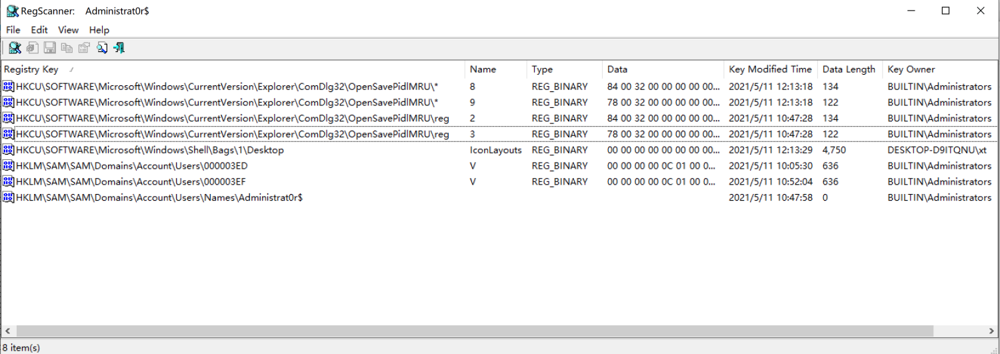

- 计算机文件操作记录


```
计算机\HKEY_CURRENT_USER\SOFTWARE\Microsoft\Windows\CurrentVersion\Explorer\ComDlg32\OpenSavePidlMRU\reg
```


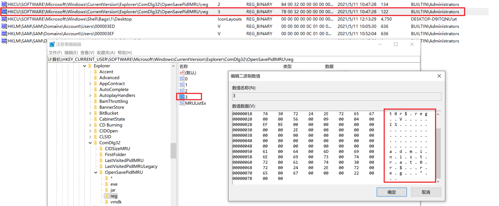

文件操作记录中包含有关键字，可以看到.reg，大致可以判断是我们之前保存在桌面上的导出的注册表命名的。通过文件操作记录查看工具针对此注册表可以清晰的看出，这里的确展示的是保存在桌面的注册表导出文件。一共四项与上面4项对应。

工具可以在这里下载：https://www.nirsoft.net/utils/open_save_files_view.html

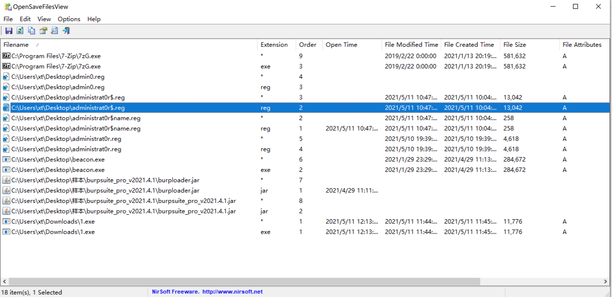

- 桌面缓存

```
计算机\HKEY_CURRENT_USER\SOFTWARE\Microsoft\Windows\Shell\Bags\1\Desktop
```

桌面所有图标名称等情况，这里也包含的是reg导出文件包含的影子关键字

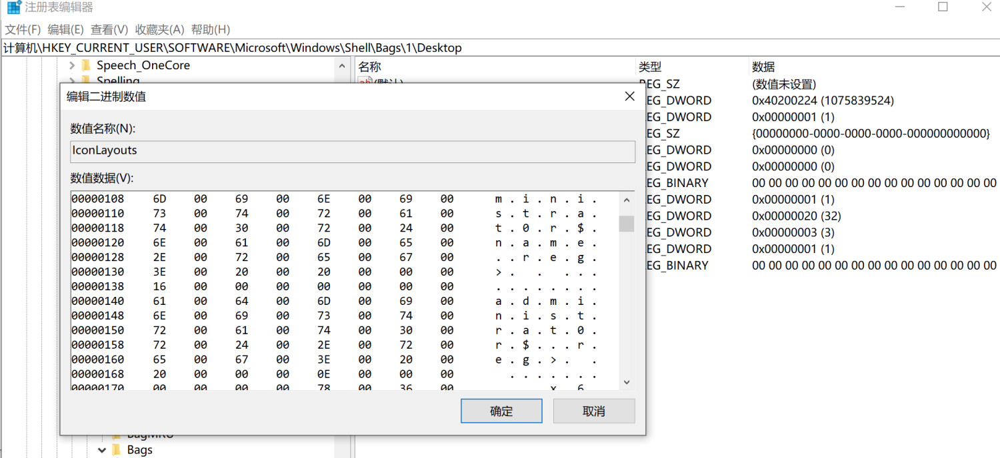


### NetUserEnum win32API函数（可审影子账户）

这里还是通过官方理解函数，地址如下：https://docs.microsoft.com/en-us/windows/win32/api/lmaccess/nf-lmaccess-netuserenum


NetUserEnum功能检索服务器上所有用户帐户的信息。这里可以用于检查系统账户信息。

```
NET_API_STATUS NET_API_FUNCTION NetUserEnum(
  LPCWSTR servername,
  DWORD   level,
  DWORD   filter,
  LPBYTE  *bufptr,
  DWORD   prefmaxlen,
  LPDWORD entriesread,
  LPDWORD totalentries,
  PDWORD  resume_handle
);
```


#### 参数详解

** servername**

一个指向常量字符串的指针，该字符串指定要执行该函数的远程服务器的DNS或NetBIOS名称。如果该参数为NULL，表示使用本地计算机。


** level**

指定数据的信息级别。此参数可以是以下值之一。

PARAMETERS

| Value  | Meaning                                                      |
| ------ | ------------------------------------------------------------ |
| **0**  | 返回用户帐号名称。bufptr参数指向[USER_INFO_0](https://docs.microsoft.com/en-us/windows/desktop/api/lmaccess/ns-lmaccess-user_info_0)结构的数组。 |
| **1**  | 返回有关用户帐户的详细信息。bufptr参数指向[USER_INFO_1](https://docs.microsoft.com/en-us/windows/desktop/api/lmaccess/ns-lmaccess-user_info_1)结构的数组。 |
| **2**  | 返回有关用户帐户的详细信息，包括授权级别和登录信息。bufptr参数指向[USER_INFO_2](https://docs.microsoft.com/en-us/windows/desktop/api/lmaccess/ns-lmaccess-user_info_2)结构的数组。 |
| **3**  | 返回有关用户帐户的详细信息，包括授权级别、登录信息、用户和主组的rid以及配置文件信息。bufptr参数指向[USER_INFO_3](https://docs.microsoft.com/en-us/windows/desktop/api/lmaccess/ns-lmaccess-user_info_3)结构的数组。 |
| **10** | 返回用户名和帐户名以及评论。bufptr参数指向[USER_INFO_10](https://docs.microsoft.com/en-us/windows/desktop/api/lmaccess/ns-lmaccess-user_info_10)结构的数组。 |
| **11** | 返回有关用户帐户的详细信息。bufptr参数指向[USER_INFO_11](https://docs.microsoft.com/en-us/windows/desktop/api/lmaccess/ns-lmaccess-user_info_11)结构的数组。 |
| **20** | 返回用户名和标识符以及各种帐户属性。bufptr参数指向[USER_INFO_20](https://docs.microsoft.com/en-us/windows/desktop/api/lmaccess/ns-lmaccess-user_info_20)结构的数组。注意，在Windows XP和更高版本上，建议您使用[USER_INFO_23](https://docs.microsoft.com/en-us/windows/desktop/api/lmaccess/ns-lmaccess-user_info_23)代替。 |


**filter**

指定要包含在枚举中的用户帐户类型的值。值为0表示应该包括所有正常的用户、信任数据和机器帐户数据。

此参数也可以是以下值的组合。

| Value                                | Meaning                                                      |
| ------------------------------------ | ------------------------------------------------------------ |
| **FILTER_TEMP_DUPLICATE_ACCOUNT**    | 枚举主帐户位于另一个域中的用户的帐户数据。此帐户类型提供对此域的用户访问，但不提供对信任此域的任何域的访问。用户管理器将此帐户类型称为本地用户帐户。 |
| **FILTER_NORMAL_ACCOUNT**            | 枚举普通用户帐户数据。此帐户类型与一个典型的用户相关联。     |
| **FILTER_INTERDOMAIN_TRUST_ACCOUNT** | 枚举域间信任帐户数据。此帐户类型与信任其他域的域的信任帐户相关联。 |
| **FILTER_WORKSTATION_TRUST_ACCOUNT** | 枚举工作站或成员服务器信任帐户数据。此帐户类型与域成员计算机的计算机帐户相关联。 |
| **FILTER_SERVER_TRUST_ACCOUNT**      | 枚举成员服务器计算机帐户数据。此帐户类型与属于该域成员的备份域控制器的计算机帐户相关联。 |

**bufptr**


一个指向接收数据的缓冲区的指针。该数据的格式取决于level参数的值。


该数据的缓冲区由系统分配，应用程序必须调用NetApiBufferFree函数来释放已分配的内存，当返回的数据不再需要时。注意，即使NetUserEnum函数以ERROR_MORE_DATA失败，也必须释放缓冲区。


**prefmaxlen**


返回数据的首选最大长度(以字节为单位)。如果指定了MAX_PREFERRED_LENGTH, NetUserEnum函数将为数据分配所需的内存。如果在此参数中指定另一个值，则可以限制函数返回的字节数。如果缓冲区大小不足以容纳所有表项，则函数返回ERROR_MORE_DATA。有关更多信息，请参见网络管理功能缓冲区和网络管理功能缓冲区长度。


**entriesread**


一个指向值的指针，该值接收实际枚举的元素计数。


**totalentries**


一个指向一个值的指针，该值接收可以从当前恢复位置枚举的条目总数。请注意，应用程序应该只将此值视为一种提示。如果您的应用程序正在与Windows 2000或更高版本的域控制器通信，您应该考虑使用ADSI LDAP Provider更有效地检索这种类型的数据。ADSI LDAP Provider实现了一组支持各种ADSI接口的ADSI对象。有关更多信息，请参见ADSI服务提供商。


LAN管理器: 如果呼叫是对一台正在运行LAN管理器2的计算机。， totalentries参数将始终反映数据库中条目的总数，而不管条目在恢复序列中的位置。


**resume_handle**


一个指向包含简历句柄的值的指针，该句柄用于继续现有的用户搜索。句柄在第一次调用时应该为零，在后续调用时保持不变。如果此参数为NULL，则不存储resume句柄。


#### 返回值详解

如果函数成功，返回值为NERR_Success。

如果函数失败，返回值可以是以下错误码之一。

| 返回代码                 | 描述                                                         |
| ------------------------ | ------------------------------------------------------------ |
| **ERROR_ACCESS_DENIED**  | 用户无法访问所请求的信息。                                   |
| **ERROR_INVALID_LEVEL**  | 系统调用级别不正确。如果level参数设置为不支持的值，则返回此错误。 |
| **NERR_BufTooSmall**     | 缓冲区太小，不能包含一个条目。没有任何信息被写入缓冲区。     |
| **NERR_InvalidComputer** | 计算机名无效。                                               |
| **ERROR_MORE_DATA**      | 更多的条目是可用的。指定一个足够大的缓冲区来接收所有条目。   |


NetUserEnum功能检索关于指定远程服务器或本地计算机上的所有用户帐户的信息。


NetQueryDisplayInformation功能可用于快速枚举用户、计算机或全局组帐户信息，以便在用户界面中显示。


如果您正在为Active Directory编程，您可能能够调用某些Active Directory服务接口(ADSI)方法来实现与调用网络管理用户函数相同的功能。有关更多信息，请参见IADsUser和IADsComputer。


如果在运行Active Directory的域控制器上调用NetUserEnum函数，将根据安全对象的ACL (access control list)允许或拒绝访问。默认ACL允许所有经过认证的用户和“windows 2000兼容前访问”组的成员查看这些信息。如果在成员服务器或工作站上调用此函数，则所有经过身份验证的用户都可以查看该信息。有关匿名访问和在这些平台上限制匿名访问的信息，请参见网络管理功能的安全要求。有关acl、ACEs和访问令牌的更多信息，请参见访问控制模型。


NetUserEnum函数只返回调用者具有Read访问权限的信息。调用者必须具有对域对象的列表内容访问权，并枚举位于系统容器中的SAM服务器对象的整个SAM域访问权。


可以使用LsaEnumerateTrustedDomains或LsaEnumerateTrustedDomainsEx函数来检索被LSA (Local Security Authority)策略对象信任的域的名称和sid。


NetUserEnum函数不返回所有系统用户。它只返回那些通过调用NetUserAdd函数添加的用户。不能保证用户列表将按顺序返回。


如果调用NetUserEnum函数并为level参数指定信息级别1、2或3，则检索到的每个结构的密码成员都设置为NULL，以保证密码安全。


用户名长度限制为20个字符，用户组名长度限制为256个字符。另外，帐户名不能以句点结尾，不能包含逗号或以下可打印字符: "，/，，[，]，: ，|，<，>，+，=，;，?，*。名称也不能包括1-31范围内的字符，这是不可打印的。


NetUserEnum函数不支持级别为4的参数，也不支持USER_INFO_4结构。NetUserGetInfo函数支持4级参数和USER_INFO_4结构。


#### 使用netuserenum编译程序

这里可以参考yangsir的工具也可以用官方的用例自己调整。

https://www.cnblogs.com/Yang34/p/14242026.html


### 各命令行语句的能力对比

为了对影子账户的检出能力对比研究，这里需要首先需要创建隐藏账号/影子账号。之后我们用之前的各个命令尝试查询影子账号，并对影子账号结果进行跟踪

#### 创建影子账户

环境：首先确定administrator已经配置了密码，如果没有可以在计算机管理中找到本地用户和组，用户，如下修改密码。如果后面需要远程登陆或者登陆桌面的话需要保证需要复制的账户的已经配置了密码，这里是计划复制administrator账户权限的。

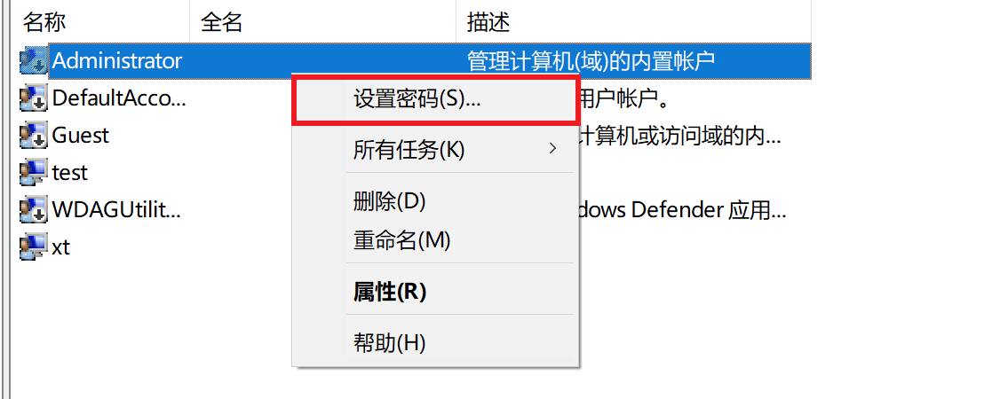

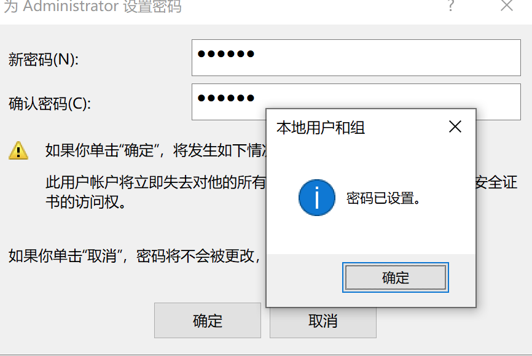


首先，新建个影子账户

```
C: \Users\xt>net user Administrat0r 123 /add
命令成功完成。
```

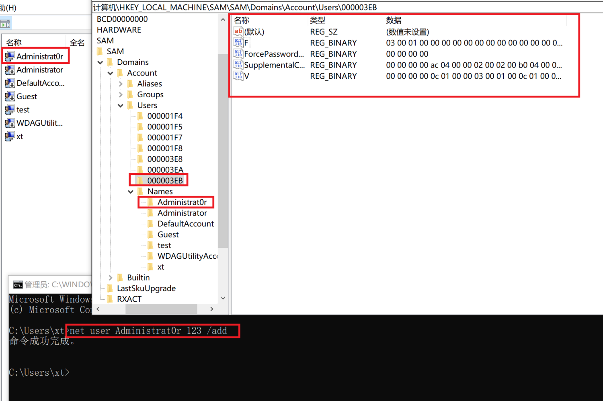

regedit进入注册表

计算机\HKEY_LOCAL_MACHINE\SAM\SAM

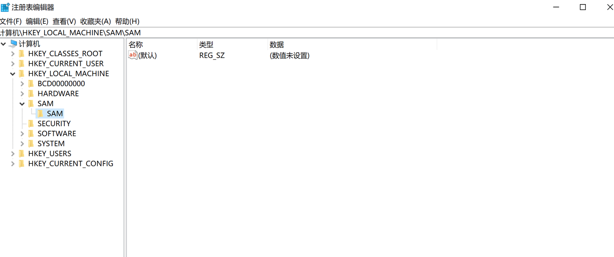

给予sam权限

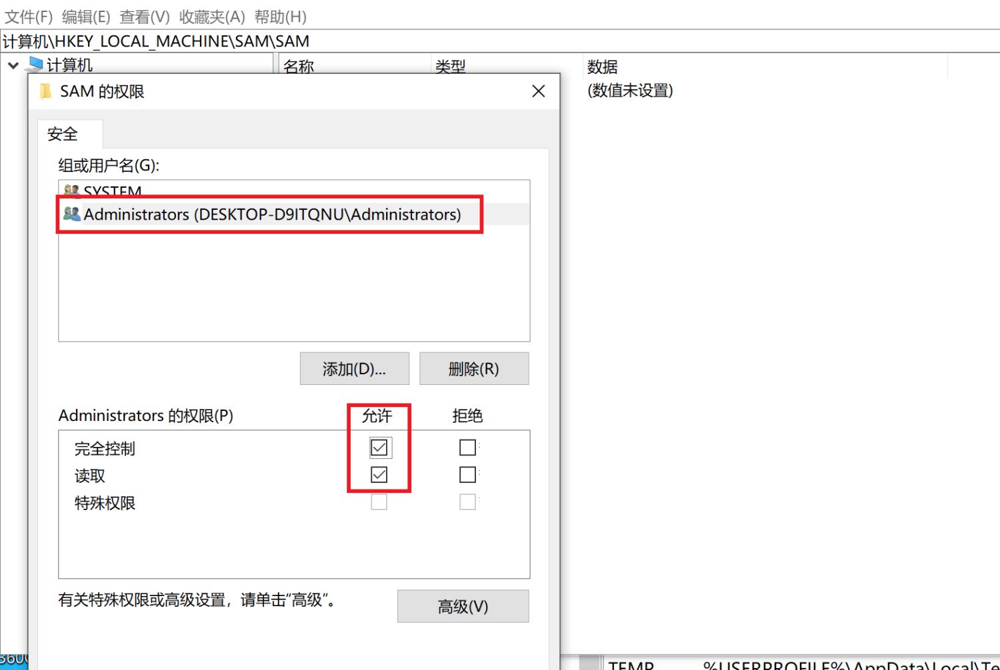

显示如下

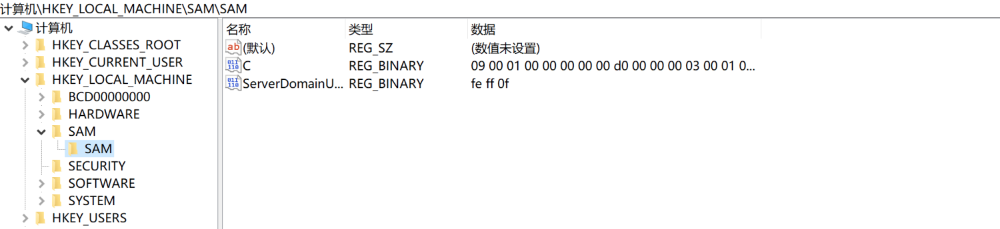

刷新F5，展开找到administrator账户的键值0x1f4

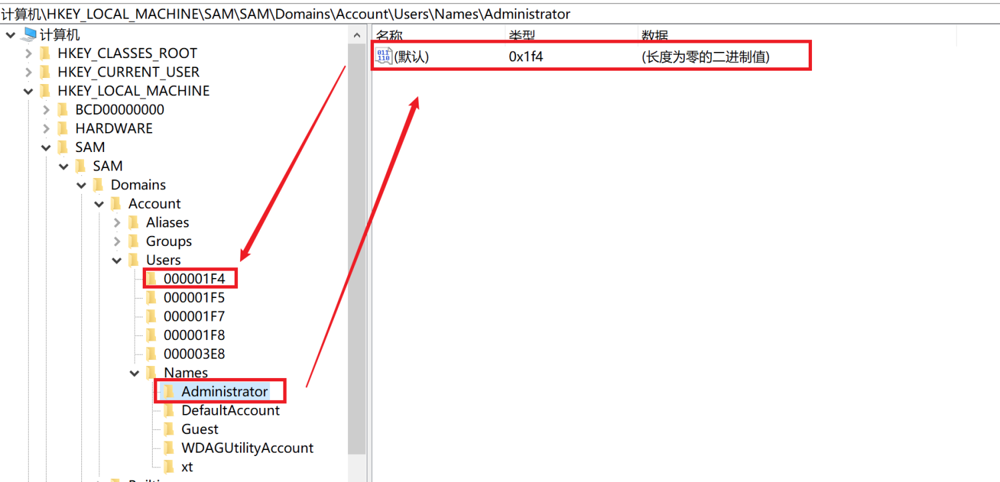

打开0x1f4中F对应的十六进制值，复制并替换掉，我们新建的Administrat0r账户对应的F数值数据

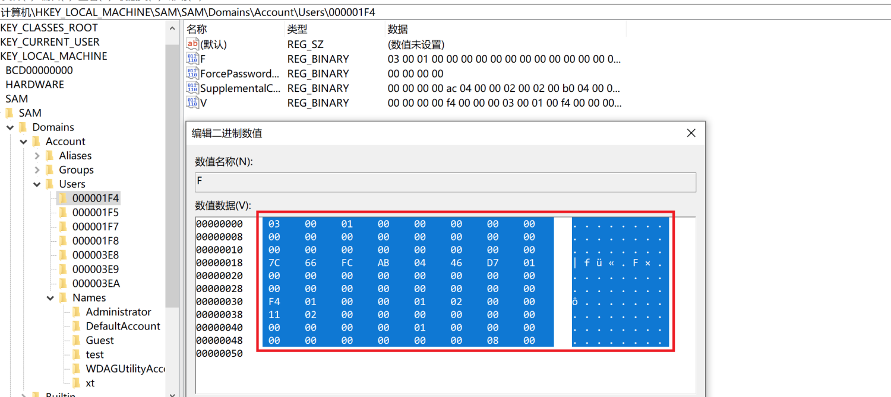

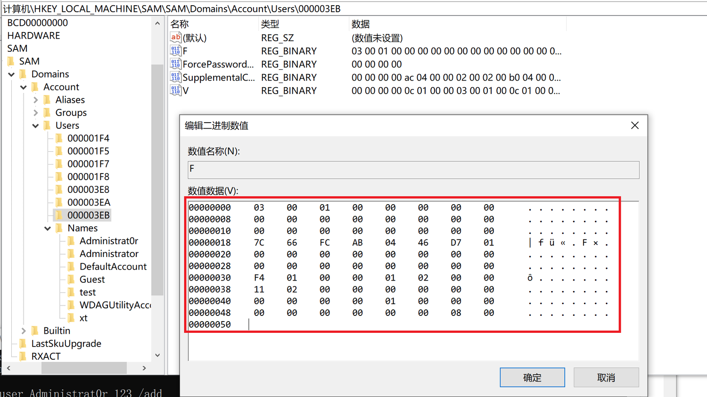

导出0x3E9对应的注册表为reg格式文档，然后在计算机管理中删除Administrat0r账户

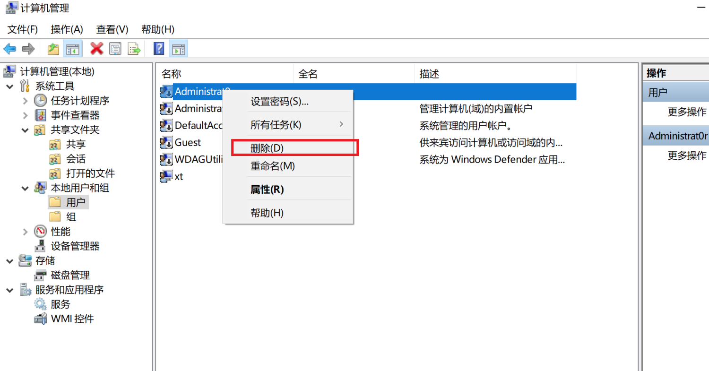

此时注册表已没有相关注册信息

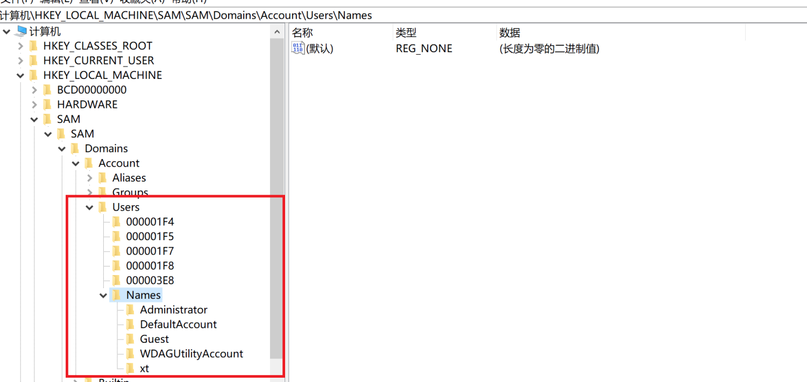

这时使用导出的reg导入

administra...

注册表编辑器

CusersxtDesktopladministratoreg中包含的项和值已成功添加到注册表中

确定

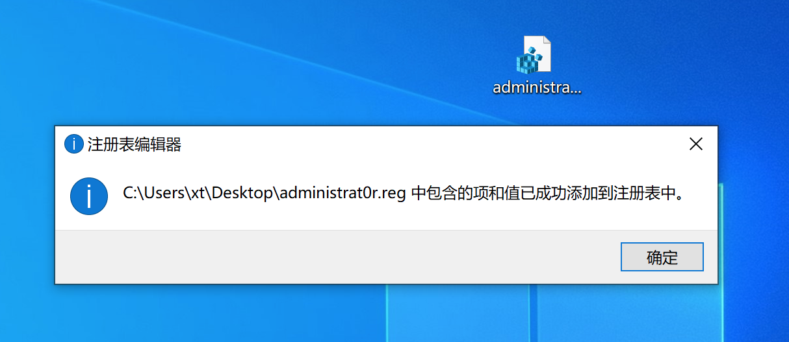

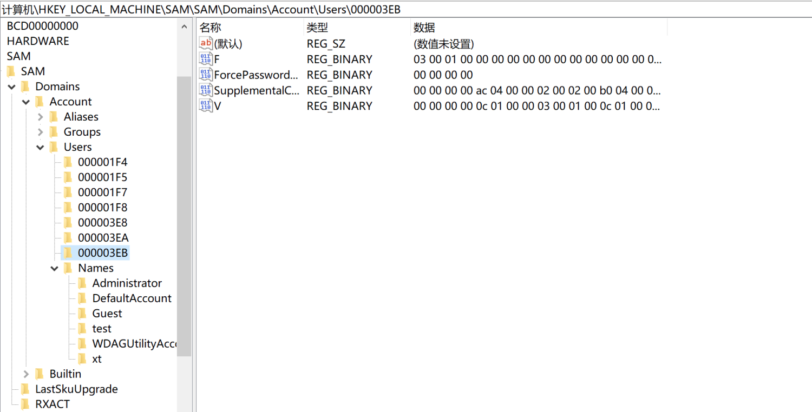

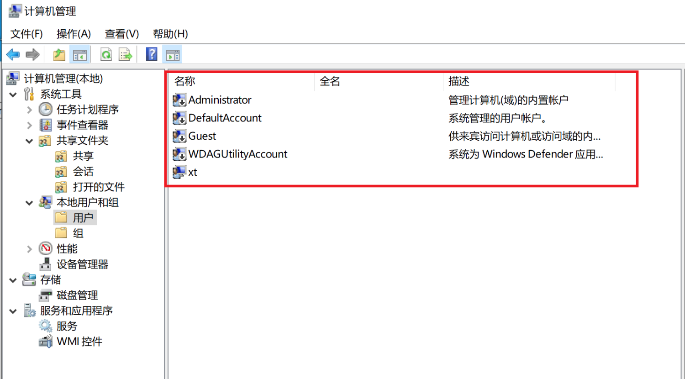

登陆测试成功，影子账户添加成功。

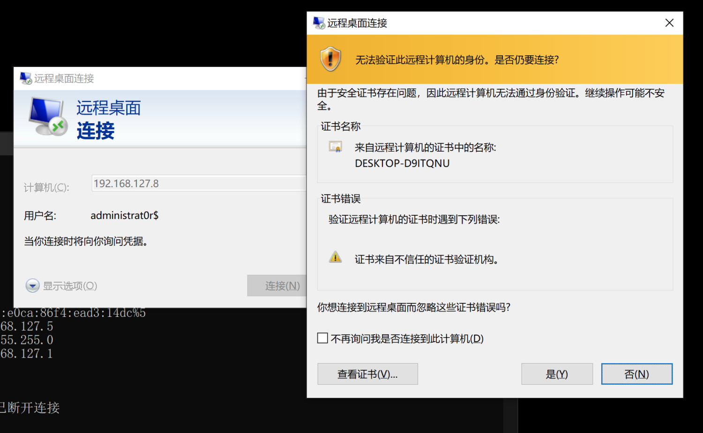

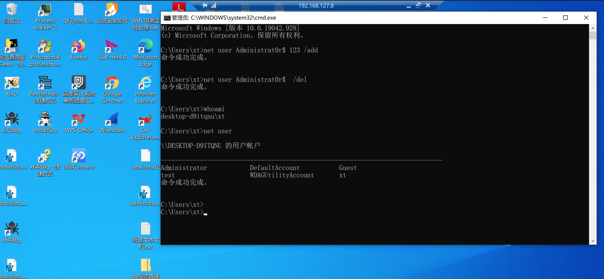

此时还无法直接登陆，因为无法自定义输入用户名，这里需要修改本地策略

**进入经典登录模式的设置方法：**

- **win+R——secpol.msc**
- **本地策略——安全选项 交互式登录——不显示上次的用户名——已启用**
- **交互式登录——不需要按下Ctrl+Alt+Del——已禁用**
- **重启登录——Ctrl+Alt+Del**


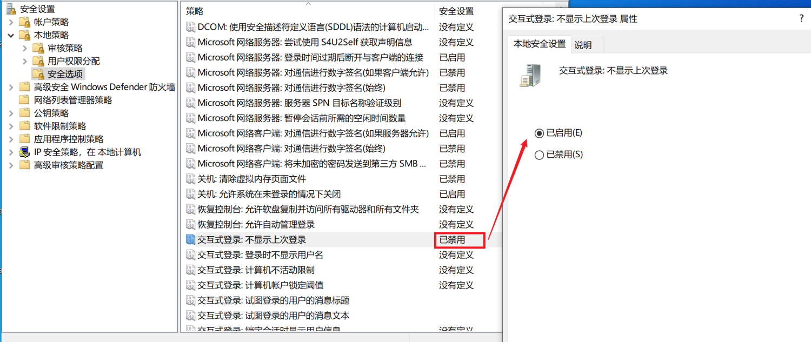


实验步骤总结: 

1. administrator添加密码，新增administrat0r用户
2. 复制xt（管理员权限）的F值到administrat0r的对应F值中，导出administrat0r对应Names中账户注册表以及Users中对应的对应注册表，只导出一个注册表最终会导致无法正常登陆
3. 删除administrat0r账户
4. 导入保存的2个注册表
5. 尝试使用administrat0r用户名远程登陆登陆，成功登陆xt账户中


#### 查询影子账户查询能力测试

```
C: \Users\xt>net user

\\DESKTOP-D9ITQNU 的用户帐户

-------------------------------------------------------------------------------
Administrator            DefaultAccount           Guest
test                     WDAGUtilityAccount       xt
命令成功完成。


C: \Users\xt>net localgroup administrators
别名     administrators
注释     管理员对计算机/域有不受限制的完全访问权

成员

-------------------------------------------------------------------------------
Administrator
xt
命令成功完成。


C: \Users\xt>C: \Users\xt\Downloads\1.exe

User account on (null): 
        -- Administrat0r$
        -- Administrator
        -- DefaultAccount
        -- Guest
        -- test
        -- WDAGUtilityAccount
        -- xt

Total of 7 entries enumerated


C: \Users\xt>wmic useraccount get name
Name
Administrat0r$
Administrator
DefaultAccount
Guest
test
WDAGUtilityAccount
xt
```

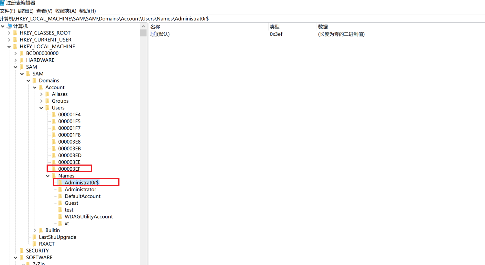

| **查询方法**                      | **结果**     |
| --------------------------------- | ------------ |
| net user                          |              |
| Net localgroup                    |              |
| wmic useraccount                  | 可查影子账号 |
| 注册表                            | 可查影子账号 |
| NetUserEnum函数（编译的程序查询） | 可查影子账号 |

#### 清理影子账户

删除```计算机\HKEY_LOCAL_MACHINE\SAM\SAM```中对应影子账号的键值即可。


## linux查看系统用户

linux因为目前未出现隐藏账号的手段，目前审计用户只需要针对两个文件下的账户做审计即可。

### 用户信息文件/etc/passwd

root: x: 0: 0: root: /root: /bin/bash

account: password: UID: GID: GECOS: directory: shell

用户名：密码：用户ID：组ID：用户说明：家目录：登陆之后shell

注意：无密码只允许本机登陆，远程不允许登陆


####  

### 影子文件/etc/shadow

root: $6$oGs1PqhL2p3ZetrE$X7o7bzoouHQVSEmSgsYN5UD4.kMHx6qgbTqwNVC5oOAouXvcjQSt.Ft7ql1WpkopY0UV9ajBwUt1DpYxTCVvI/: 16809: 0: 99999: 7: : : 

用户名：加密密码：密码最后一次修改日期：两次密码的修改时间间隔：密码有效期：密码修改到期到的警告天数：密码过期之后的宽限天数：账号失效时间：保留


#### 用户名

用户名称

#### 加密密码

如果格式为"$id$salt$hashed"，则表示该用户密码正常。这里保存的是真正加密的密码。


目前 Linux 的密码采用的是 SHA512 散列加密算法，原来采用的是 MD5 或 DES 加密算法。SHA512 散列加密算法的加密等级更高，也更加安全。

```
留空 开头的表示用户没有密码
!    表明用户被锁，被锁账户无法登陆，但可能使用其他方式登陆如私钥认证ssh或su
*  表明用户被锁，
!! 表明用户从来没设置过密码
$6$开头的，表明是用SHA-512加密的，
$1$ 表明是用MD5加密的
$2$ 是用Blowfish加密的
$5$ 是用 SHA-256加密的。
```


注意，这串密码产生的乱码不能手工修改，如果手工修改，系统将无法识别密码，导致密码失效。很多软件透过这个功能，在密码串前加上 "!"、"*" 或 "x" 使密码暂时失效。

所有伪用户的密码都是 "!!" 或 "*"，代表没有密码是不能登录的。当然，新创建的用户如果不设定密码，那么它的密码项也是 "!!"，代表这个用户没有密码，不能登录。


#### 最后一次修改时间

最后一次修改密码的时间“16809”的理解。


这是因为，Linux 计算日期的时间是以 1970 年 1 月 1 日作为 1 不断累加得到的时间，到 1971 年 1 月 1 日，则为 366 天。这里显示 16809天，也就是说，此 root 账号在 1970 年 1 月 1 日之后的第 16809 天修改的 root 用户密码。


可以使用如下命令进行换算：

```
┌──(x7㉿x7)-[~]
└─$ date -d "1970-01-01 16809 day"     
2016年 01月 09日 星期六 00: 00: 00 CST
```

#### 最小修改时间间隔

最小修改间隔时间，也就是说，该字段规定了从第 3 字段（最后一次修改密码的日期）起，多长时间之内不能修改密码。如果是 0，则密码可以随时修改；如果是 10，则代表密码修改后 10 天之内不能再次修改密码。


#### 密码有效期

经常变更密码是个好习惯，为了强制要求用户变更密码，这个字段可以指定距离第 3 字段（最后一次更改密码）多长时间内需要再次变更密码，否则该账户密码进行过期阶段。

该字段的默认值为 99999，也就是 273 年，可认为是永久生效。如果改为 90，则表示密码被修改 90 天之后必须再次修改，否则该用户即将过期。管理服务器时，通过这个字段强制用户定期修改密码。

#### 密码需要变更前的警告天数

与第 5 字段相比较，当账户密码有效期快到时，系统会发出警告信息给此账户，提醒用户 "再过 n 天你的密码就要过期了，请尽快重新设置你的密码！"。


该字段的默认值是 7，也就是说，距离密码有效期的第 7 天开始，每次登录系统都会向该账户发出 "修改密码" 的警告信息。

#### 密码过期后的宽限天数

也称为“口令失效日”，简单理解就是，在密码过期后，用户如果还是没有修改密码，则在此字段规定的宽限天数内，用户还是可以登录系统的；如果过了宽限天数，系统将不再让此账户登陆，也不会提示账户过期，是完全禁用。


比如说，此字段规定的宽限天数是 10，则代表密码过期 10 天后失效；如果是 0，则代表密码过期后立即失效；如果是 -1，则代表密码永远不会失效。

#### 账号失效时间

同第 3 个字段一样，使用自 1970 年 1 月 1 日以来的总天数作为账户的失效时间。该字段表示，账号在此字段规定的时间之外，不论你的密码是否过期，都将无法使用！


该字段通常被使用在具有收费服务的系统中。


### who 

```
who     查看当前登录用户（tty本地登陆  pts远程登录）
```

**who**命令能够打印 **当前都有谁****登录到系统中** 的相关信息 。who命令只会显示真正登录到系统中的用户。它不会显示那些通过**su**命令切换用户的登录者，**也就是说who不会枚举出所有用户，只是列出正在登陆的用户相关信息**。

```
root@cheerful-push-1: ~# who
root     pts/0        2021-05-17 03: 54 (ip地址)
root     pts/1        2021-05-17 03: 54 (ip地址)
```


- 第一列显示用户名
- 第二列显示用户连接方式。tty代表用户直接连接到服务器，pts代表远程登录。
- 第三、四列分别显示日期和时间
- 第五列显示用户登录IP地址。


| -a , --all       | 与使用选项-b -d --login -p -r -t -T -u相同。                 |
| ---------------- | ------------------------------------------------------------ |
| -b , --boot      | 显示上次系统引导的时间。                                     |
| -d , --dead      | 显示死进程。                                                 |
| -H , --heading   | 打印一行列标题。                                             |
| --ips            | 打印IP地址而不是主机名。 使用--lookup，基于存储的IP（如果可用）进行规范化，而不是存储的主机名。 |
| -l , --login     | 打印系统登录过程。                                           |
| --lookup         | 尝试通过DNS规范化主机名。                                    |
| -m               | 仅打印有关与标准输入（发出命令的终端）关联的用户和主机的信息。 此方法符合POSIX标准。 |
| -p , --process   | 打印由init生成的活动进程。                                   |
| -q , --count     | 显示所有**当前登陆的**登录名，以及所有当前**正在登陆的**用户数计数。注意：这里不应理解为列出所有登陆过的用户数，而是此命令只能显示正在登陆的用户。 |
| -r , --runlevel  | 打印当前运行级别。                                           |
| -s , --short     | 仅打印名称，行和时间字段，这是默认值。                       |
| -t , --time      | 如果信息可用，则打印上次更改系统时钟的时间。                 |
| -T , -w , --mesg | 添加一个字符，该字符指示终端的状态: “+”如果终端是可写的，“-”如果终端不是可写的，或“?” |
| -u , --users     | 打印每个用户的空闲时间和进程ID。                             |
| --message        | 与-T相同。                                                   |
| --writable       | 与-T相同。                                                   |
| --help           | 显示帮助消息，然后退出。                                     |
| --version        | 显示版本信息，然后退出。                                     |


### w

**w[命令](https://www.linuxcool.com/)用于显示已经登陆系统的用户列表，并显示用户正在执行的指令。执行这个[命令](https://www.linuxcool.com/)可得知目前登入系统的用户有那些人，以及他们正在执行的程序。单独执行w命令会显示所有的用户，您也可指定用户名称，仅显示某位用户的相关信息。****下面让我们详细讲解一下w命令的使用方法。**

```
w(选项)(参数)

-f 　开启或关闭显示用户从何处登入系统。
-h 　不显示各栏位的标题信息列。
-l 　使用详细格式列表，此为预设值。
-s 　使用简洁格式列表，不显示用户登入时间，终端机阶段作业和程序所耗费的CPU时间。
-u 　忽略执行程序的名称，以及该程序耗费CPU时间的信息。
-V 　显示版本信息。
```

### uptime

系统中的uptime命令主要用于获取主机运行时间和查询linux系统负载等信息。uptime命令可以显示系统已经运行了多长时间，信息显示依次为：现在时间、系统已经运行了多长时间、目前有多少登陆用户、系统在过去的1分钟、5分钟和15分钟内的平均负载。

```
uptime  查看登陆多久、多少用户，负载
10: 19: 04 //系统当前时间
up 257 days, 18: 56 //主机已运行时间，时间越大，说明你的机器越稳定。
12 user  //用户连接数，是总连接数而不是用户数
load average   // 系统平均负载，统计最近1，5，15分钟的系统平均负载那么什么是系统平均负载呢？ 系统平均负载是指在特定时间间隔内运行队列中的平均进程数。
```

### 入侵排查：


```
1、查询特权用户特权用户(uid 为0)
[root@localhost ~]# awk -F:  '$3==0{print $1}' /etc/passwd
2、查询可以远程登录的帐号信息
[root@localhost ~]# awk '/\$1|\$6/{print $1}' /etc/shadow
3、除root帐号外，其他帐号是否存在sudo权限。如非管理需要，普通帐号应删除sudo权限
[root@localhost ~]# more /etc/sudoers | grep -v "^#\|^$" | grep "ALL=(ALL)"
```


### 清理/限制账户：

```
禁用或删除多余及可疑的帐号
  usermod -L user    禁用帐号，帐号无法登录，/etc/shadow第二栏为!开头
    userdel user       删除user用户
    userdel -r user    将删除user用户，并且将/home目录下的user目录一并删除
```


## 本文参考

https://blog.csdn.net/discover2210212455/article/details/82711930

https://bypass007.github.io/Emergency-Response-Notes/ 应急响应实战笔记

http://c.biancheng.net/view/840.html

https://linux.cn/article-2437-1.html

https://www.runoob.com/linux/linux-comm-w.html
