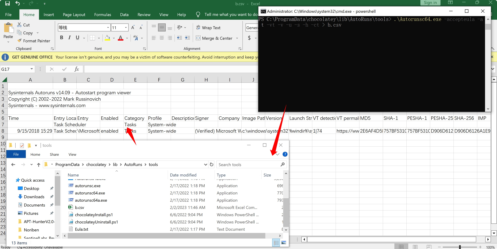
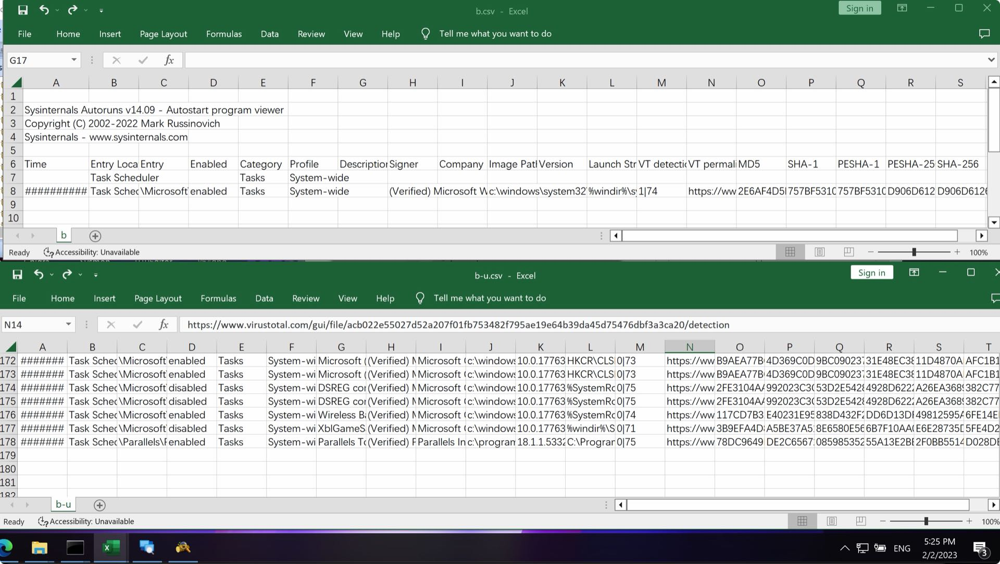
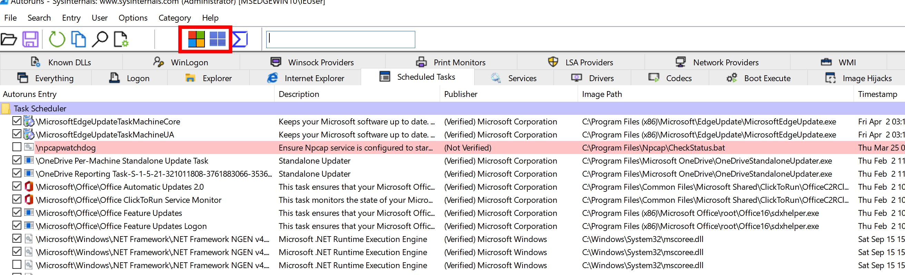

# Autoruns
在微软的Sysinternals实用工具（故障诊断工具套装）中，可运行于 Windows XP、Windows Server 2003 和更高版本的 Windows 操作系统。该软件还包括一个相同功能的命令行版本Autorunsc，可以把结果报表以 CSV 格式输出。

## 简介
Autorunsc 是自动运行的命令行版本。 它的用法语法为：
```
用法：autorunsc [-a <*|bdeghiklmoprsw>] [-c|-ct] [-h] [-m] [-s] [-u] [-vt] [[-z] |[user]]]

参数	说明
-a	自动启动条目选择：
*	全部。
b	启动执行。
d	Appinit DLL。
e	资源管理器加载项。
g	(Vista 和更高) 的边栏小工具
h	图像劫持。
i	Internet Explorer 加载项。
k	已知 DLL。
l	登录启动 (这是默认) 。
m	WMI 条目。
n	Winsock 协议和网络提供程序。
o	编 解码 器。
p	打印机监视器 DLL。
r	LSA 安全提供程序。
s	自动启动服务和未禁用的驱动程序。
t	计划的任务。
w	Winlogon 条目。
-c	将输出打印为 CSV。
-ct	将输出打印为制表符分隔的值。
-h	显示文件哈希。
-m	如果与 -v) 一起使用，则隐藏 Microsoft 条目 (签名条目。
-s	验证数字签名。
-t	在规范化 UTC (YYYYMMDD-hhmmss) 中显示时间戳。
-u	如果已启用 VirusTotal 检查，则显示由 VirusTotal 未知或未检测的文件，否则仅显示未签名的文件。（有的有签名的文件不一定是安全的所以如果是安服分析建议去掉-u）
-x	将输出打印为 XML。
-v[rs]	基于文件哈希查询恶意软件的 VirusTotal 。 添加“r”以打开包含非零检测的文件的报表。 如果指定了“s”选项，则报告为以前未扫描的文件将上传到 VirusTotal。 请注意，扫描结果可能不可用 5 分钟或更多分钟。
-vt	在使用 VirusTotal 功能之前，必须接受 VirusTotal 服务条款。 如果尚未接受条款，并且省略此选项，系统会以交互方式提示你。
-z	指定要扫描的脱机Windows系统。
user	指定将显示自动运行项的用户帐户的名称。 指定“*”以扫描所有用户配置文件。
```
## 下载
https://learn.microsoft.com/zh-cn/sysinternals/downloads/autoruns
https://download.sysinternals.com/files/Autoruns.zip

## 目录结构
微软官方下载的Autoruns.zip以及类似应急框架中安装Autoruns都是类似。主体包含：Autoruns.exe、Autoruns64.exe、Autorunsc.exe、Autorunsc64.exe等等，其中```Autoruns*```是图形界面程序，而```Autorunsc*```是命令行执行的版本。
## 一个实际应用的例子
上午同事收到客户的需求，希望提供个能够批量执行计划任务检查的程序或者脚本。在查找了些材料后，我们锁定到了autoruns上，因为autoruns一来是微软官方推荐工具之一，另一方面因为其有命令行功能，实际使用的时候可以根据需求一个命令来输出结果，根据前文我们知道，使用autoruns我们可以做到使用-a t指定查询计划任务，然后通过-vt或者-v功能针对所有计划任务中的程序进行vt的杀毒软件信息查询。

那么思路有了我们来探究下如何实现。
```
 .\Autorunsc64.exe -accepteula -a t -vt -v -u -s -h -ct > b.csv
```
其中-accepteula是必须的，意为自动接受微软的软件的协议license，想要实现无人干预执行就需要带上此参数配置。
-a t则指定对计划任务进行检查
-vt 接受vt条款
-v 是使用virustotal进行文件hash查询文件结果
-h 显示文件hash
-ct 导出csv格式表格，并且加入分隔符，阅读方便。
-u 有的有签名的文件不一定是安全的所以如果是安服分析建议去掉-u,加上-u显示的就只有未签名的项目，和不加-u相比会差很多内容

最后结果如下。



注意：
加上-u显示的就只有未签名的项目，和不加-u相比会差很多内容



## autoruns行为或原理的研究
参考文章[autoruns-pearson](https://www.microsoftpressstore.com/articles/article.aspx?p=2762082&seqNum=2)，在对autoruns的研究中，《Windows Sysinternals Tools进行故障排除(第二版)》（对应翻译书籍《Windows Sysinternals实战指南》）的示例章节中，还可以学习到Autoruns的基础知识，以及如何管理系统权限相关的内容。

当你第一次执行Autoruns时，所有的系统信息都会自动显示在Everything标签中。
### Logon
logon中列出系统自启动和用户登陆时运行的标准的自启动程序，也可能包含了用户安装的程序自启动的项目。以下的列为系统自启动相关的路径，Autoruns检查windows10系统的特定实例：
```

Autoruns
2/17/2017
Contents
 Like us on Facebook
 Follow us on Twitter
Back Page 2 of 5 Next
Autostart categories
When you launch Autoruns for the first time, all autostart entries on the system are displayed in one long list on the Everything tab. As Figure 4-8 shows, the display includes up to 19 other tabs that break down the complete list into categories.

FIGURE 4-8
FIGURE 4-8 Autostart categories are displayed on up to 20 different tabs.

Logon
This tab lists the “standard” autostart entries that are processed when Windows starts up and a user logs on, and it includes the ASEPs that are probably the most commonly used by applications. They include the various Run and RunOnce keys in the registry, the Startup directories in the Start menu, computer startup and shutdown scripts, and logon and logoff scripts. It also lists the initial user session processes, such as the Userinit process and the desktop shell. These ASEPs include both per-user and systemwide locations, and entries designed for control through Group Policy. Finally, it lists the Active Setup\Installed Components keys, which although never publicly documented or supported for third-party use have been reverse-engineered and repurposed both for good and for ill.

The following lists the Logon ASEP locations that Autoruns inspects on a particular instance of an x64 version of Windows 10.

The Startup directory in the “all users” Start menu

%ALLUSERSPROFILE%\Microsoft\Windows\Start Menu\Programs\Startup
The Startup directory in the user’s Start menu

%APPDATA%\Microsoft\Windows\Start Menu\Programs\Startup
Per-user ASEPs under HKCU\Software

HKCU\Software\Microsoft\Windows\CurrentVersion\Run
HKCU\Software\Microsoft\Windows\CurrentVersion\RunOnce
HKCU\Software\Microsoft\Windows NT\CurrentVersion\Terminal Server\Install\Software\Microsoft\Windows\CurrentVersion\Run
HKCU\Software\Microsoft\Windows NT\CurrentVersion\Terminal Server\Install\Software\Microsoft\Windows\CurrentVersion\Runonce
HKCU\Software\Microsoft\Windows NT\CurrentVersion\Terminal Server\Install\Software\Microsoft\Windows\CurrentVersion\RunonceEx
HKCU\Software\Microsoft\Windows NT\CurrentVersion\Windows\Load
HKCU\Software\Microsoft\Windows NT\CurrentVersion\Windows\Run
HKCU\Software\Microsoft\Windows NT\CurrentVersion\Winlogon\Shell
Per-user ASEPs under HKCU\Software—64-bit only

HKCU\Software\Wow6432Node\Microsoft\Windows\CurrentVersion\Run
HKCU\Software\Wow6432Node\Microsoft\Windows\CurrentVersion\RunOnc
Per-user ASEPs under HKCU\Software intended to be controlled through Group Policy

HKCU\Software\Microsoft\Windows\CurrentVersion\Policies\Explorer\Run
HKCU\Software\Microsoft\Windows\CurrentVersion\Policies\System\Shell
HKCU\Software\Policies\Microsoft\Windows\System\Scripts\Logon
HKCU\Software\Policies\Microsoft\Windows\System\Scripts\Logoff
Systemwide ASEPs in the registry

HKLM\Software\Microsoft\Windows\CurrentVersion\Run
HKLM\Software\Microsoft\Windows\CurrentVersion\RunOnce
HKLM\Software\Microsoft\Windows\CurrentVersion\RunOnceEx
HKLM\Software\Microsoft\Active Setup\Installed Components
HKLM\Software\Microsoft\Windows NT\CurrentVersion\Terminal Server\Install\Software\Microsoft\Windows\CurrentVersion\Run
HKLM\Software\Microsoft\Windows NT\CurrentVersion\Terminal Server\Install\Software\Microsoft\Windows\CurrentVersion\Runonce
HKLM\Software\Microsoft\Windows NT\CurrentVersion\Terminal Server\Install\Software\Microsoft\Windows\CurrentVersion\RunonceEx
HKLM\Software\Microsoft\Windows NT\CurrentVersion\Winlogon\IconServiceLib
HKLM\Software\Microsoft\Windows NT\CurrentVersion\Winlogon\AlternateShells\AvailableShells
HKLM\Software\Microsoft\Windows NT\CurrentVersion\Winlogon\AppSetup
HKLM\Software\Microsoft\Windows NT\CurrentVersion\Winlogon\Shell
HKLM\Software\Microsoft\Windows NT\CurrentVersion\Winlogon\Taskman
HKLM\Software\Microsoft\Windows NT\CurrentVersion\Winlogon\Userinit
HKLM\Software\Microsoft\Windows NT\CurrentVersion\Winlogon\VmApplet
HKLM\System\CurrentControlSet\Control\SafeBoot\AlternateShell
HKLM\System\CurrentControlSet\Control\Terminal Server\Wds\rdpwd\StartupPrograms
HKLM\System\CurrentControlSet\Control\Terminal Server\WinStations\RDP-Tcp\InitialProgram
Systemwide ASEPs in the registry, intended to be controlled through Group Policy

HKLM\Software\Microsoft\Windows\CurrentVersion\Policies\Explorer\Run
HKLM\Software\Microsoft\Windows\CurrentVersion\Policies\System\Shell
HKLM\Software\Policies\Microsoft\Windows\System\Scripts\Logon
HKLM\Software\Policies\Microsoft\Windows\System\Scripts\Logoff
HKLM\Software\Policies\Microsoft\Windows\System\Scripts\Startup
HKLM\Software\Policies\Microsoft\Windows\System\Scripts\Shutdown
HKLM\Software\Microsoft\Windows\CurrentVersion\Group Policy\Scripts\Startup
HKLM\Software\Microsoft\Windows\CurrentVersion\Group Policy\Scripts\Shutdown
Systemwide ASEPs in the registry—64-bit only

HKLM\Software\Wow6432Node\Microsoft\Windows\CurrentVersion\Run
HKLM\Software\Wow6432Node\Microsoft\Windows\CurrentVersion\RunOnce
HKLM\Software\Wow6432Node\Microsoft\Windows\CurrentVersion\RunOnceEx
HKLM\Software\Wow6432Node\Microsoft\Active Setup\Installed Components
Systemwide ActiveSync ASEPs in the registry

HKLM\Software\Microsoft\Windows CE Services\AutoStartOnConnect
HKLM\Software\Microsoft\Windows CE Services\AutoStartOnDisconnect
Systemwide ActiveSync ASEPs in the registry—64-bit only

HKLM\Software\Wow6432Node\Microsoft\Windows CE Services\AutoStartOnConnect
HKLM\Software\Wow6432Node\Microsoft\Windows CE Services\AutoStartOnDisconnect
```
### Explorer
资源管理器标签列出常见直接hook windows资源管理器的以及运行在Explorer.exe下的程序。其中关键的条目有：
- 用于在文件夹窗口中添加上下文菜单项、修改属性页和控制列显示的Shell扩展
- 桌面、控制面板、回收站等命名空间扩展，以及第三方命名空间扩展
- 可插入的名称空间处理程序，它处理标准协议(如http、ftp和mailto)，以及Microsoft或第三方扩展(如about、mk和res)
- 可插入的MIME过滤器

在64位版本的Windows上，像dll这样的进程内组件只能加载到为相同CPU架构构建的进程中。例如，实现为32位dll的shell扩展只能加载到32位版本的Windows资源管理器中，而64位Windows默认使用64位资源管理器。因此，这些扩展在64位Windows上可能根本不起作用。

下面列出了Autoruns在x64版本的Windows 10的特定实例上检查的Explorer ASEP位置。

**Per-user ASEPs under HKCU\Software**
```
HKCU\Software\Classes\*\ShellEx\ContextMenuHandlers
HKCU\Software\Classes\*\ShellEx\PropertySheetHandlers
HKCU\Software\Classes\AllFileSystemObjects\ShellEx\ContextMenuHandlers
HKCU\Software\Classes\AllFileSystemObjects\ShellEx\DragDropHandlers
HKCU\Software\Classes\AllFileSystemObjects\ShellEx\PropertySheetHandlers
HKCU\Software\Classes\Clsid\{AB8902B4-09CA-4bb6-B78D-A8F59079A8D5}\Inprocserver32
HKCU\Software\Classes\Directory\Background\ShellEx\ContextMenuHandlers
HKCU\Software\Classes\Directory\ShellEx\ContextMenuHandlers
HKCU\Software\Classes\Directory\Shellex\CopyHookHandlers
HKCU\Software\Classes\Directory\Shellex\DragDropHandlers
HKCU\Software\Classes\Directory\Shellex\PropertySheetHandlers
HKCU\Software\Classes\Drive\ShellEx\ContextMenuHandlers
HKCU\Software\Classes\Folder\Shellex\ColumnHandlers
HKCU\Software\Classes\Folder\ShellEx\ContextMenuHandlers
HKCU\Software\Classes\Folder\ShellEx\DragDropHandlers
HKCU\Software\Classes\Folder\ShellEx\ExtShellFolderViews
HKCU\Software\Classes\Folder\ShellEx\PropertySheetHandlers
HKCU\Software\Classes\Protocols\Filter
HKCU\Software\Classes\Protocols\Handler
HKCU\Software\Microsoft\Ctf\LangBarAddin
HKCU\Software\Microsoft\Internet Explorer\Desktop\Components
HKCU\Software\Microsoft\Windows\CurrentVersion\Explorer\ShellIconOverlayIdentifiers
HKCU\Software\Microsoft\Windows\CurrentVersion\Explorer\ShellServiceObjects
HKCU\Software\Microsoft\Windows\CurrentVersion\ShellServiceObjectDelayLoad
```
**Systemwide ASEPs in the registry**
```
HKLM\Software\Classes\*\ShellEx\ContextMenuHandlers
HKLM\Software\Classes\*\ShellEx\PropertySheetHandlers
HKLM\Software\Classes\AllFileSystemObjects\ShellEx\ContextMenuHandlers
HKLM\Software\Classes\AllFileSystemObjects\ShellEx\DragDropHandlers
HKLM\Software\Classes\AllFileSystemObjects\ShellEx\PropertySheetHandlers
HKLM\Software\Classes\Directory\Background\ShellEx\ContextMenuHandlers
HKLM\Software\Classes\Directory\ShellEx\ContextMenuHandlers
HKLM\Software\Classes\Directory\Shellex\CopyHookHandlers
HKLM\Software\Classes\Directory\Shellex\DragDropHandlers
HKLM\Software\Classes\Directory\Shellex\PropertySheetHandlers
HKLM\Software\Classes\Drive\ShellEx\ContextMenuHandlers
HKLM\Software\Classes\Folder\Shellex\ColumnHandlers
HKLM\Software\Classes\Folder\ShellEx\ContextMenuHandlers
HKLM\Software\Classes\Folder\ShellEx\DragDropHandlers
HKLM\Software\Classes\Folder\ShellEx\ExtShellFolderViews
HKLM\Software\Classes\Folder\ShellEx\PropertySheetHandlers
HKLM\Software\Classes\Protocols\Filter
HKLM\Software\Classes\Protocols\Handler

HKLM\Software\Microsoft\Ctf\LangBarAddin
HKLM\Software\Microsoft\Windows\CurrentVersion\Explorer\SharedTaskScheduler
HKLM\Software\Microsoft\Windows\CurrentVersion\Explorer\ShellExecuteHooks
HKLM\Software\Microsoft\Windows\CurrentVersion\Explorer\ShellIconOverlayIdentifiers
HKLM\Software\Microsoft\Windows\CurrentVersion\Explorer\ShellServiceObjects
HKLM\Software\Microsoft\Windows\CurrentVersion\ShellServiceObjectDelayLoad
```
**Systemwide ASEPs in the registry—64-bit only**
```
HKLM\Software\Wow6432Node\Classes\*\ShellEx\ContextMenuHandlers
HKLM\Software\Wow6432Node\Classes\*\ShellEx\PropertySheetHandlers
HKLM\Software\Wow6432Node\Classes\AllFileSystemObjects\ShellEx\ContextMenuHandlers
HKLM\Software\Wow6432Node\Classes\AllFileSystemObjects\ShellEx\DragDropHandlers
HKLM\Software\Wow6432Node\Classes\AllFileSystemObjects\ShellEx\PropertySheetHandlers
HKLM\Software\Wow6432Node\Classes\Directory\Background\ShellEx\ContextMenuHandlers
HKLM\Software\Wow6432Node\Classes\Directory\ShellEx\ContextMenuHandlers
HKLM\Software\Wow6432Node\Classes\Directory\Shellex\CopyHookHandlers
HKLM\Software\Wow6432Node\Classes\Directory\Shellex\DragDropHandlers
HKLM\Software\Wow6432Node\Classes\Directory\Shellex\PropertySheetHandlers
HKLM\Software\Wow6432Node\Classes\Drive\ShellEx\ContextMenuHandlers
HKLM\Software\Wow6432Node\Classes\Folder\Shellex\ColumnHandlers
HKLM\Software\Wow6432Node\Classes\Folder\ShellEx\ContextMenuHandlers
HKLM\Software\Wow6432Node\Classes\Folder\ShellEx\DragDropHandlers
HKLM\Software\Wow6432Node\Classes\Folder\ShellEx\ExtShellFolderViews
HKLM\Software\Wow6432Node\Classes\Folder\ShellEx\PropertySheetHandlers
HKLM\Software\Wow6432Node\Microsoft\Windows\CurrentVersion\Explorer\SharedTaskScheduler
HKLM\Software\Wow6432Node\Microsoft\Windows\CurrentVersion\Explorer\ShellExecuteHooks
HKLM\Software\Wow6432Node\Microsoft\Windows\CurrentVersion\Explorer\ShellIconOverlayIdentifiers
HKLM\Software\Wow6432Node\Microsoft\Windows\CurrentVersion\Explorer\ShellServiceObjects
HKLM\Software\Wow6432Node\Microsoft\Windows\CurrentVersion\ShellServiceObjectDelayLoad
```

### Internet Explorer
"Internet Explorer"是为可扩展性而设计的，其接口专门用于启用常用功能例如检查扩展插件例如收藏、访问历史、扩展工具、用户菜单栏和工具栏按钮。由于用户的很多高价值信息（密码和信用卡填写记录）都在浏览器中进行，因此浏览器也常常为攻击者攻击的主要目标。与第三方阅读器和即时消息集成的接口也常常被间谍软件、广告软件和其他恶意软件所使用。

下面列出了Autoruns在x64版本的Windows 10的特定实例上检查的Internet Explorer ASEP位置。
**Per-user ASEPs under HKCU\Software**
```
HKCU\Software\Microsoft\Internet Explorer\Explorer Bars
HKCU\Software\Microsoft\Internet Explorer\Extensions
HKCU\Software\Microsoft\Internet Explorer\UrlSearchHooks
```
**Systemwide ASEPs in the registry**
```
HKLM\Software\Microsoft\Internet Explorer\Explorer Bars
HKLM\Software\Microsoft\Internet Explorer\Extensions
HKLM\Software\Microsoft\Internet Explorer\Toolbar
HKLM\Software\Microsoft\Windows\CurrentVersion\Explorer\Browser Helper Objects
```
**Per-user and systemwide ASEPs in the registry—64-bit only**
```
HKCU\Software\Wow6432Node\Microsoft\Internet Explorer\Explorer Bars
HKCU\Software\Wow6432Node\Microsoft\Internet Explorer\Extensions
HKLM\Software\Wow6432Node\Microsoft\Internet Explorer\Explorer Bars
HKLM\Software\Wow6432Node\Microsoft\Internet Explorer\Extensions
HKLM\Software\Wow6432Node\Microsoft\Internet Explorer\Toolbar
HKLM\Software\Wow6432Node\Microsoft\Windows\CurrentVersion\Explorer\Browser Helper Objects
```
### Scheduled Tasks
计划任务”选项卡显示配置为由Windows任务计划程序启动的项。使用at.exe调度的命令也会出现在列表中，如果不隐藏已验证数字签名的计划任务则会有很多显示出来。


### Services
windows系统的服务在非交互式的用户模式进程中，可以配置为独立于用户登陆启动，并可以通过与服务控制管理器的标准接口进行控制。多个服务可以共享单个进程，常见的例子是svchost.exe，它专门用托管在单独的dll中实现多个服务。

在配置HKLM\System\CurrentControlSet\Services的子健中，每个子健的start值决定服务是否启动以及如何启动。

autoruns的service标签列出了未被禁用的服务，在禁用和删除服务时一定要知道自己在做什么，否则有可能导致系统服务不正常，导致系统性能下降、不稳定或无法启动。

恶意软件技术是一种服务，它看起来应该是windows的一部分，但实际上不是，例如在Windows目录中而不是在System32中有一个名为svchost.exe的文件。另一种技术是使合法服务依赖于恶意软件服务;在不修复依赖关系的情况下删除或禁用服务可能导致系统无法启动。Autoruns的跳转到入口功能可以方便地验证注册表中的服务配置是否包含一个DependOnService值，以便在进行更改之前检查依赖关系。

### Drivers
和服务一样，驱动程序也在HKLM\System\CurrentControlSet\services以及HKLM\Software\Microsoft\Windows NT\CurrentVersion\Font drivers中的子健配置。和服务不同的是，驱动程序以内核模式运行，因此作为操作系统核心的一部分。大多数安装在System32\Drivers中，文件扩展名为.sys。驱动程序使Windows能够与各种类型的硬件进行交互，包括显示器、存储器、智能卡阅读器和人工输入设备。它们还被防病毒软件(以及Procmon和Procexp等Sysinternals实用程序)用于监视网络流量和文件I/O。当然，它们也被恶意软件使用，尤其是rootkit。

您可以使用Autoruns禁用或删除有问题的驱动程序。这样做通常会在重新启动后生效。与服务一样，在禁用或删除驱动程序配置时，一定要绝对确定自己在做什么。其中许多对操作系统至关重要，任何错误配置都可能导致Windows无法正常工作。

### Codecs
Codecs标签列出可由媒体回放应用加载的可执行代码。有错误或者配置错误的编码器会导致系统运行缓慢或其他问题，这些也容易被恶意软件滥用。下面列出了Codecs所显示的列。

**Keys inspected under both HKLM and HKCU**
```
\Software\Classes\CLSID\{083863F1-70DE-11d0-BD40-00A0C911CE86}\Instance
\Software\Classes\CLSID\{7ED96837-96F0-4812-B211-F13C24117ED3}\Instance
\Software\Classes\CLSID\{ABE3B9A4-257D-4B97-BD1A-294AF496222E}\Instance
\Software\Classes\CLSID\{AC757296-3522-4E11-9862-C17BE5A1767E}\Instance
\Software\Classes\Filter
\Software\Microsoft\Windows NT\CurrentVersion\Drivers32
```
**Keys inspected under both HKLM and HKCU on 64-bit Windows**
```
\Software\Wow6432Node\Classes\CLSID\{083863F1-70DE-11d0-BD40-00A0C911CE86}\Instance
\Software\Wow6432Node\Classes\CLSID\{7ED96837-96F0-4812-B211-F13C24117ED3}\Instance
\Software\Wow6432Node\Classes\CLSID\{ABE3B9A4-257D-4B97-BD1A-294AF496222E}\Instance
\Software\Wow6432Node\Classes\CLSID\{AC757296-3522-4E11-9862-C17BE5A1767E}\Instance
\Software\Wow6432Node\Microsoft\Windows NT\CurrentVersion\Drivers32
```

### Boot Execute
引导执行选项卡显示了系统在引导期间由会话管理器（smss.exe）启动的windows本机模式可执行文件。启动引导通常包含windows运行时无法执行的任务，例如硬盘验证和修复（autochk.exe）。在windows安装后，Execute、S0InitialCommand和SetupExecute条目永远不应该被修改。下面列出了Boot Execute选项卡上显示的键。
**Keys that are displayed on the Boot Execute tab**
```
HKLM\System\CurrentControlSet\Control\ServiceControlManagerExtension
HKLM\System\CurrentControlSet\Control\Session Manager\BootExecute
HKLM\System\CurrentControlSet\Control\Session Manager\Execute
HKLM\System\CurrentControlSet\Control\Session Manager\S0InitialCommand
HKLM\System\CurrentControlSet\Control\Session Manager\SetupExecute
```

### image hijacks
镜像劫持选项卡中显示了4种类型的重定向：
- exefile 修改.exe或.cmd文件类型的执行命令的关联。为没空啊吗改吗；windows中文件关联用户界面从未暴露过更改.exe或.cmd文件类型的关联的方式，但可以从注册表修改。
- html 修改.html或.htm文件类型的执行命令的关联。当打开一个HTML文件时，恶意软件就可以通过此方式劫持。验证执行命令是否是合法的浏览器。
- 命令处理器、Autorun 每当一个cmd.exe实例执行时就会执行命令。该命令在这个cmd.exe中执行。在在不同的用户和不同的操作系统下都需要单独的cmd版本。
- 镜像文件执行选项（IFEO）这个注册表的子健位置（它64为版本的windows）用于widnows系统内部使用。其中一个目的就是IFEO子健可以再启动特定程序时指定备用程序。通过创建以源程序名相同的文件名的注册表项，以及一个指向备用程序地址“Debug”子健，备用程序就可以代替源程序。
下面的列表显示了映像劫持选项卡上显示的与这些ASEPS对应的注册表项。

**Registry locations inspected for EXE file hijacks**
```
HKCU\Software\Classes\Exefile\Shell\Open\Command\(Default)
HKCU\Software\Classes\.exe
HKCU\Software\Classes\.cmd
HKLM\Software\Classes\Exefile\Shell\Open\Command\(Default)
HKLM\Software\Classes\.exe
HKLM\Software\Classes\.cmd
```
**Registry locations inspected for htmlfile hijacks**
```
HKCU\Software\Classes\Htmlfile\Shell\Open\Command\(Default)
HKLM\Software\Classes\Htmlfile\Shell\Open\Command\(Default)
```
**Command processor autorun keys**
```
HKCU\Software\Microsoft\Command Processor\Autorun
HKLM\Software\Microsoft\Command Processor\Autorun
HKLM\Software\Wow6432Node\Microsoft\Command Processor\Autorun
```
**Keys inspected for Image File Execution Options hijacks**
```
HKLM\Software\Microsoft\Windows NT\CurrentVersion\Image File Execution Options
HKLM\Software\Wow6432Node\Microsoft\Windows NT\CurrentVersion\Image File Execution Options
```
### AppInit
AppInit DLL的思路看起来是是一个对于开发工程师更正Windows NT3.1的不错的思路。在Appinit_Dlls键值设置一个或多个DLL，这些DLL将加载到每个加载User32.dll的进程中。

* AppInit DLL 在User32初始化的时候会加载DLL。开发人员被明确告知不要在DllMain中加载dll，因为其会导致死锁和应用程序崩溃。
* 如果你在编写恶意软件，那么自动加载到计算机上的每个进程中的DLL都是一个成功。虽然AppInit已经在合法软件使用，但它经常被恶意软件使用。

由于这些问题，AppInit在windows vista和更新版本中默认禁用。

**Registry values inspected for AppInit Entries**
```
HKLM\Software\Microsoft\Windows NT\CurrentVersion\Windows\Appinit_Dlls
HKLM\Software\Wow6432Node\Microsoft\Windows NT\CurrentVersion\Windows\Appinit_Dlls
HKLM\System\CurrentControlSet\Control\Session Manager\AppCertDlls
```
### KnowDlls
KnowsDlls通过确保所有windows进程使用相同版本的特定dll帮助系统提高性能，而不是从不同的文件位置中选择自己的dll。在启动期间，会话管理器将HKLM\System\CurrentControlSet\Control\Session Manager\KnownDlls中列出的dll映射到内存中作为命名的节对象。当加载一个新进程并需要映射这些DLL时，它使用现有的节，而不是在文件系统中搜索另一个版本的DLL。

Autoruns KnownDll标签包含可验证的Windows DLL。在64为版本的windows上，knowndlls标签中列出了一个ASEP，但是对于32位和64位版本的dll，文件条目都是重复的，在注册表项中的DllDirectory和DllDirectory32值指定的目录中。请注意，Windows-On-Windows-64 (WOW64)支持的dll仅存在于System32目录中，并且Autoruns将为相应的SysWOW64目录条目报告“文件未找到”。这很正常。

为了验证恶意软件没有从这个键中删除条目，以便它可以加载自己版本的系统DLL，保存来自可疑系统的Autoruns结果，并将其与来自同一操作系统的已知良好实例的结果进行比较。

### Winlogon
Winlogon标签显示与winlogon.exe挂钩的的条目，winlogon.exe管理windows交互登陆用户界面。在windows vista中引入凭据提供者接口管理用户身份验证接口。今天，windows包括很多凭证提供程序，处理密码、PIN、图片密码、智能卡和生物识别登陆。如果你禁用“Hide Windows Entry Option”选项才会显示其中大部分内容。第三方也可以提供进一步交互式用户登陆凭证。

**Per-user specification of the screen saver**
```
HKCU\Control Panel\Desktop\Scrnsave.exe
```
**Per-user specification of the screen saver, controlled by Group Policy**
```
HKCU\Software\Policies\Microsoft\Windows\Control Panel\Desktop\Scrnsave.exe
```
**Group Policy Client-Side Extensions (CSEs)**
```
HKLM\Software\Microsoft\Windows NT\CurrentVersion\Winlogon\GPExtensions
HKLM\Software\Wow6432Node\Microsoft\Windows NT\CurrentVersion\Winlogon\GPExtensions
```
**Credential provider ASEPs**
```
HKLM\Software\Microsoft\Windows\CurrentVersion\Authentication\Credential Provider Filters
HKLM\Software\Microsoft\Windows\CurrentVersion\Authentication\Credential Providers
HKLM\Software\Microsoft\Windows\CurrentVersion\Authentication\PLAP Providers
```
**Systemwide identification of a program to verify successful boot**
```
HKLM\System\CurrentControlSet\Control\BootVerificationProgram\ImagePath
```
**ASEP for custom setup and deployment tasks**
```
HKLM\System\Setup\CmdLine
```
### Winsock providers
windows套接字（winsock）是windows上的一个可扩展API，因为第三方可以添加传输服务，将winsock与现有协议之上的其他协议或层连接起来，以提供代理等功能。服务提供者通过使用winsock服务提供的接口（SPI）插入winsock。当传输服务被注册到winsock时，winsock使用传输服务提供程序来实现套接字函数，例如连接和接受，用于提供程序指示它实现的地址类型。传输服务提供者没有限制如何实现这些功能，到那时实现通常涉及在内核模式下与传输驱动程序通信。

winsock标签列出了在系统上注册的提供商，包括内置在windows中的提供商，您可以通过启用“隐藏Windows条目”和“验证代码签名”来隐藏后一组，以集中于更有可能导致问题的条目。

**Keys inspected for Winsock Provider Entries**
```
HKLM\System\CurrentControlSet\Services\WinSock2\Parameters\NameSpace_Catalog5\Catalog_Entries
HKLM\System\CurrentControlSet\Services\WinSock2\Parameters\NameSpace_Catalog5\Catalog_Entries64
HKLM\System\CurrentControlSet\Services\WinSock2\Parameters\Protocol_Catalog9\Catalog_Entries
HKLM\System\CurrentControlSet\Services\WinSock2\Parameters\Protocol_Catalog9\Catalog_Entries64
```
### Print monitors
打印监视器标签上列出的条目在HKLM\System\CurrentControlSet\Control\Print\Monitors。这些dll被加载到假脱机程序服务中国呢，该服务作为本地系统运行。
注意：
其中一个做常见的导致打印后台处理程序问题的是第三方端口监控不正常的行为以及糟糕的编码导致。排除打印程序问题的第一步是禁用掉第三方端口监视，以查看问题是否存在。

### LSA 提供商
这类自启动包括通过本地安全授权（LSA）为windows定义或扩展用户身份验证的包。除非您已经安装了第三方身份验证包或密码过滤器，否则此列表应该只包含windows可验证的条目。这些条目中列出的dll由Lsass.exe或Winlogon.exe加载，并作为本地系统运行。

此选项卡上还显示的SecurityProviders ASEP列出了已注册的加密提供者。此ASEP中列出的dll被加载到许多特权和标准用户进程中，因此此ASEP已成为恶意软件持久性载体的目标。(这个ASEP与LSA并没有真正的关联，除了，像LSA一样，它表示与安全相关的功能。)
**Keys inspected for Authentication Providers**
```
HKLM\System\CurrentControlSet\Control\Lsa\Authentication Packages
HKLM\System\CurrentControlSet\Control\Lsa\Notification Packages
HKLM\System\CurrentControlSet\Control\Lsa\Security Packages
HKLM\System\CurrentControlSet\Control\Lsa\OSConfig\Security Packages
```
**Keys inspected for Registered Cryptographic Providers**
```
HKLM\System\CurrentControlSet\Control\SecurityProviders\SecurityProviders
```
### Network providers
网络提供者选项卡列出了已安装的处理网络通信的提供者，这些提供者在HKLM\System\CurrentControlSet\Control\NetworkProvider\Order中配置。例如，在Windows桌面操作系统上，此选项卡包括提供对SMB(文件和打印)服务器、Microsoft RDP(终端服务/远程桌面)服务器和对WebDAV服务器访问的默认提供程序。如果您有一个更加异构的网络或Windows需要连接到的其他类型的服务器，则通常可以在此列表中看到其他提供商。该列表中的所有条目都应该是可验证的。

### WMI
WMI选项卡列出了已注册的WMI事件使用者，可以将其配置为在特定事件发生时运行任意脚本或命令行。当您在WMI选项卡上选择一个条目时，下面的面板将报告有关目标文件、事件使用者的完整命令行以及将触发事件使用者执行的条件(例如WQL查询)的信息。

当您禁用一个WMI条目时，Autoruns将该条目替换为具有相同名称但附加了“_disabled”的克隆条目。这将破坏到事件筛选器的绑定，这样它就不会执行。通过重新启用，将重新建立原来的名称和事件绑定。

这些事件和绑定存储在WMI存储库中的ROOT\subscription 名称空间中。

### Sidebar gadgets
在Windows Vista和Windows 7上，这个选项卡列出了侧栏小工具(在Windows 7上称为“桌面小工具”)，这些工具被配置为显示在用户的桌面上。虽然小工具软件通常(但不总是)安装在系统范围内的位置，如%ProgramFiles%，但要运行的小工具的配置在%LOCALAPPDATA%\Microsoft\Windows Sidebar\Settings.ini中，该配置是针对每个用户的，并且是非漫游的。使用Autoruns禁用或删除gadget会操作Settings.ini文件中的条目。

图像路径通常指向一个XML文件。Windows Vista和Windows 7附带的小工具都有目录签名，可以进行验证。小工具在Windows 7之后就停产了。

### office
Office选项卡列出了注册到Access、Excel、Outlook、PowerPoint和Word文档接口的外接程序和插件。在64位Windows上，可以将Office外接程序注册为在32位或64位Office版本中运行。32位外接程序在64位Windows上的Wow6432Node子密钥中注册。

**Keys inspected under both HKLM and HKCU**
```
\Software\Microsoft\Office\Access\Addins
\Software\Microsoft\Office\Excel\Addins
\Software\Microsoft\Office\Outlook\Addins
\Software\Microsoft\Office\PowerPoint\Addins
\Software\Microsoft\Office\Word\Addins
```
**Keys inspected under both HKLM and HKCU on 64-bit Windows**
```
\Software\Wow6432Node\Microsoft\Office\Access\Addins
\Software\Wow6432Node\Microsoft\Office\Excel\Addins
\Software\Wow6432Node\Microsoft\Office\Outlook\Addins
\Software\Wow6432Node\Microsoft\Office\PowerPoint\Addins
\Software\Wow6432Node\Microsoft\Office\Word\Addins
```
参考文章：
[windows v14.09 Autoruns](https://learn.microsoft.com/zh-cn/sysinternals/downloads/autoruns)
[蓝队必备技能之-systeminternal工具集使用](https://kevien.github.io/2020/11/05/%E8%93%9D%E9%98%9F%E5%BF%85%E5%A4%87%E6%8A%80%E8%83%BD%E4%B9%8B-systeminternal%E5%B7%A5%E5%85%B7%E9%9B%86%E4%BD%BF%E7%94%A8/)
[autoruns-pearson](https://www.microsoftpressstore.com/articles/article.aspx?p=2762082&seqNum=2)

