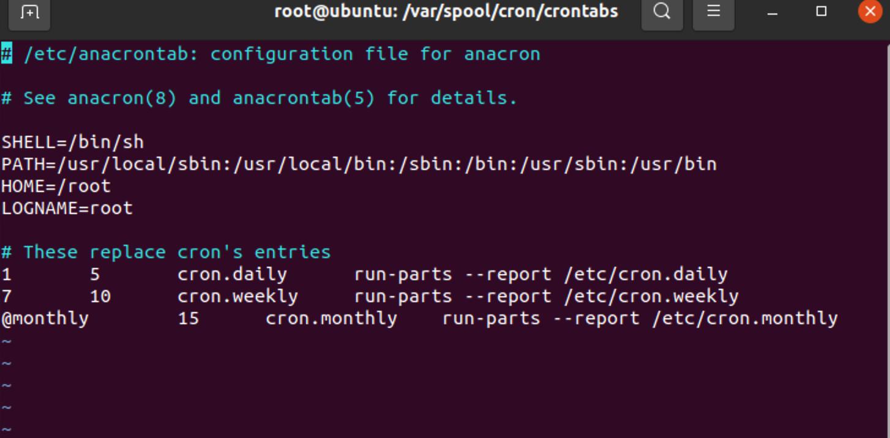
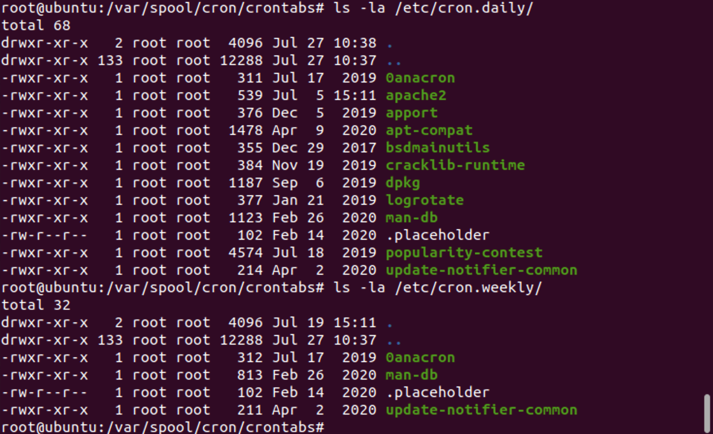
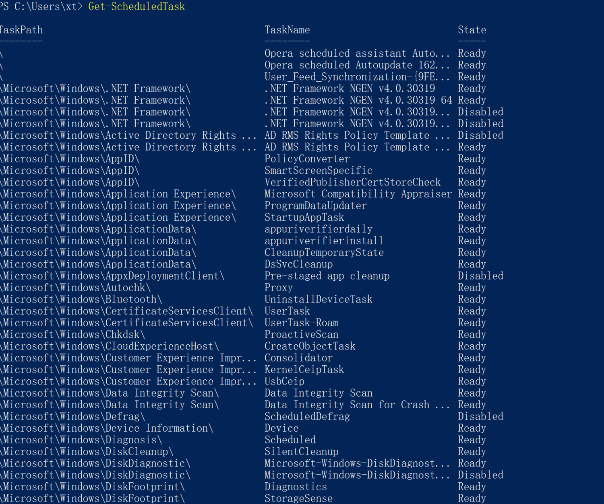
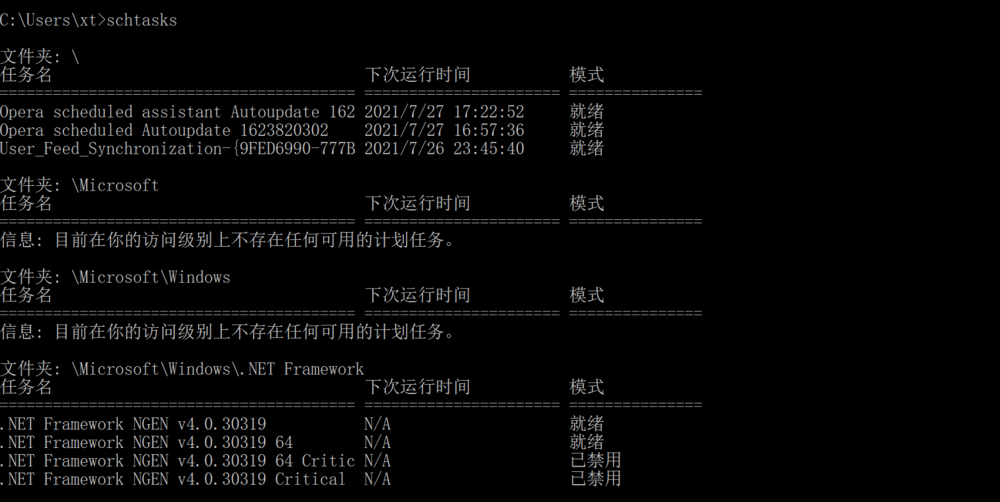
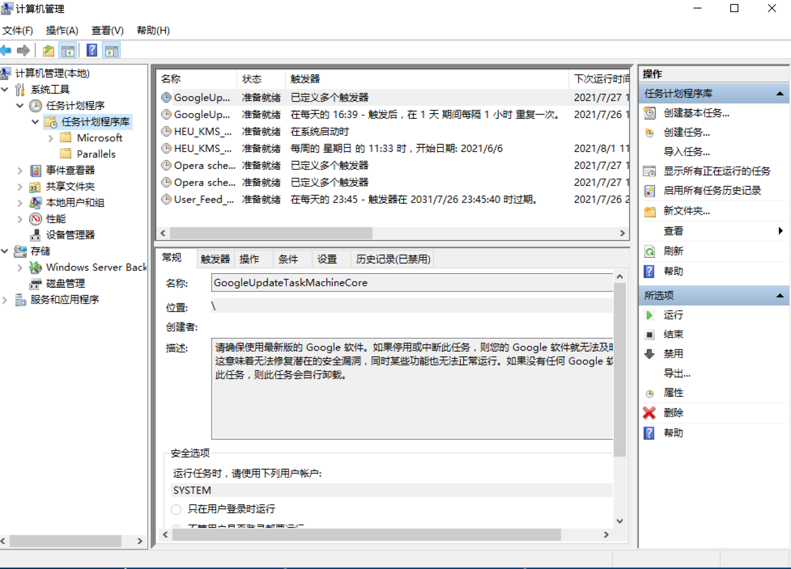

# linux计划任务检查

## crontab

**基本使用**

```
crontab [ -u user ] file
crontab [ -u user ] { -l | -r | -e }
        (default operation is replace, per 1003.2)
    -e  (edit user's crontab) 编辑用户crontab计划任务
    -l  (list user's crontab) 列出所有用户的计划任务
    -r  (delete user's crontab) 删除用户的crontab计划任务
    -i  (prompt before deleting user's crontab) 在删除用户的计划任务之前告警
```


1、利用crontab创建计划任务

- 基本命令

crontab -l  列出某个用户cron服务的详细内容

Tips：默认编写的crontab文件会保存在 (/var/spool/cron/用户名 例如: /var/spool/cron/root

crontab -r  删除每个用户cront任务(谨慎：删除所有的计划任务)

crontab -e  使用编辑器编辑当前的crontab文件

如：*/1*    * echo "hello world" >> /tmp/test.txt 每分钟写入文件


- crontab基本格式

```
# /etc/crontab: system-wide crontab
# Unlike any other crontab you don't have to run the `crontab'
# command to install the new version when you edit this file
# and files in /etc/cron.d. These files also have username fields,
# that none of the other crontabs do.

SHELL=/bin/sh
PATH=/usr/local/sbin:/usr/local/bin:/sbin:/bin:/usr/sbin:/usr/bin

# Example of job definition:
# .---------------- minute (0 - 59)
# |  .------------- hour (0 - 23)
# |  |  .---------- day of month (1 - 31)
# |  |  |  .------- month (1 - 12) OR jan,feb,mar,apr ...
# |  |  |  |  .---- day of week (0 - 6) (Sunday=0 or 7) OR sun,mon,tue,wed,thu,fri,sat
# |  |  |  |  |
# *  *  *  *  * user-name command to be executed
17 *    * * *   root    cd / && run-parts --report /etc/cron.hourly
25 6    * * *   root    test -x /usr/sbin/anacron || ( cd / && run-parts --report /etc/cron.daily )
47 6    * * 7   root    test -x /usr/sbin/anacron || ( cd / && run-parts --report /etc/cron.weekly )
52 6    1 * *   root    test -x /usr/sbin/anacron || ( cd / && run-parts --report /etc/cron.monthly )
```

一些特殊符号：

*： 表示任何时刻

,：　表示分割

-：表示一个段，如第二端里： 1-5，就表示1到5点

/n : 表示每个n的单位执行一次，如第二段里，*/1, 就表示每隔1个小时执行一次命令。也可以写成1-23/1.

**
**

crontab时间示例：

```
43 21 * * * 21:43 执行
15 05 * * * 　　 05:15 执行
0 17 * * * 17:00 执行
0 17 * * 1 每周一的 17:00 执行
0,10 17 * * 0,2,3 每周日,周二,周三的 17:00和 17:10 执行
0-10 17 1 * * 毎月1日从 17:00到7:10 毎隔1分钟 执行
0 0 1,15 * 1 毎月1日和 15日和 一日的 0:00 执行
42 4 1 * * 　 　 毎月1日的 4:42分 执行
0 21 * * 1-6　　 周一到周六 21:00 执行
0,10,20,30,40,50 * * * *　每隔10分 执行
*/10 * * * * 　　　　　　 每隔10分 执行
* 1 * * *　　　　　　　　 从1:0到1:59 每隔1分钟 执行
0 1 * * *　　　　　　　　 1:00 执行
0 */1 * * *　　　　　　　 毎时0分 每隔1小时 执行
0 * * * *　　　　　　　　 毎时0分 每隔1小时 执行
2 8-20/3 * * *　　　　　　8:02,11:02,14:02,17:02,20:02 执行
30 5 1,15 * *　　　　　　 1日 和 15日的 5:30 执行


参考：https://blog.csdn.net/testcs_dn/article/details/77687902
```

## anacron

anacron会按照周期检测是否有定时任务在关机之后没有执行，如果有，则会在特定时间重新执行定时任务。


anacron原理参考：http://c.biancheng.net/view/1095.html


基本命令：

```
root@ubuntu:/var/spool/cron/crontabs# anacron -h
Usage:  anacron [-s] [-f] [-n] [-d] [-q] [-t anacrontab] [-S spooldir] [job] ...
        anacron [-S spooldir] -u [job] ...
        anacron [-V|-h]
        anacron -T [-t anacrontab]

 -s  依据 /etc/anacrontab 文件中设定的延迟时间顺序执行工作，在前一个工作未完成前，不会开始下一个工作。
 -f  强制执行相关操作，忽略时间戳
 -n  立即执行 /etc/anacrontab 中所有的工作，忽略所有的延迟时间。这意味着-s功能。
 -d  Don't fork to the background
 -q  S禁止将信息输出到标准错误，常和 -d 选项合用。
 -u  更新 /var/spool/anacron/cron.{daily，weekly，monthly} 文件中的时间戳为当前日期，但不执行任何工作。
 -t  Use this anacrontab
 -V  Print version information
 -h  Print this message
 -T  Test an anacrontab
 -S  Select a different spool directory

See the manpage for more details.
```


编辑配置文件：

```
vi /etc/anacrontab
```






利用anacron实现异步定时任务调度

- 使用案例

每天运行 /home/backup.sh脚本：

vi /etc/anacrontab

[@daily ](https://www.yuque.com/daily)   10   example.daily  /bin/bash /home/backup.sh 


当机器在 backup.sh 期望被运行时是关机的，anacron会在机器开机十分钟之后运行它，而不用再等待 7天。


## 入侵排查

重点关注以下目录中是否存在恶意脚本

```
/var/spool/cron/* 
/etc/crontab
/etc/cron.d/*
/etc/cron.daily/* 
/etc/cron.hourly/* 
/etc/cron.monthly/*
/etc/cron.weekly/
/etc/anacrontab
/var/spool/anacron/*
```


技巧

```
 more /etc/cron.daily/*  查看目录下所有文件
 grep /etc/cron.*/* -e "查询关键字"
```


# windows计划任务检查

## Get-ScheduledTask

计划任务程序

powershell输入：Get-ScheduledTask



## schtasks

cmd下schtasks



## 任务计划程序

计算机管理》系统工具》任务计划程序


