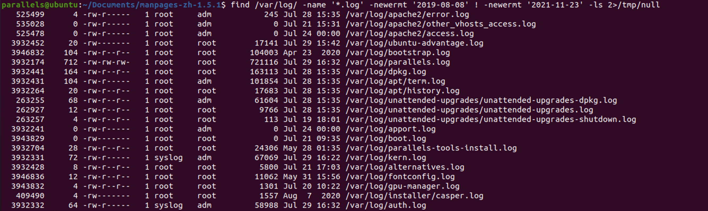
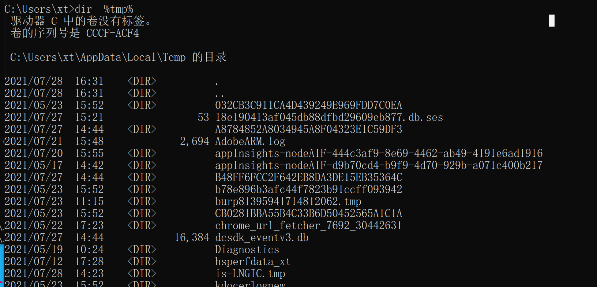
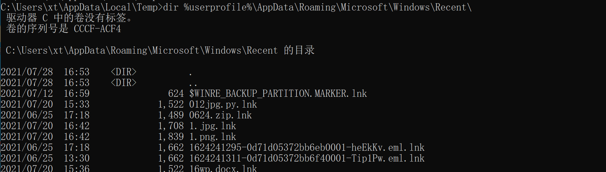
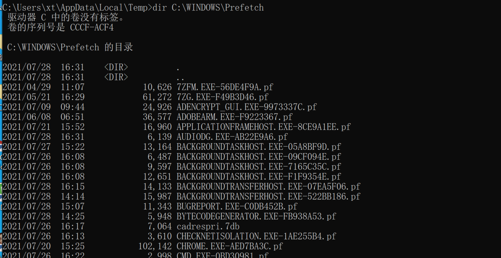
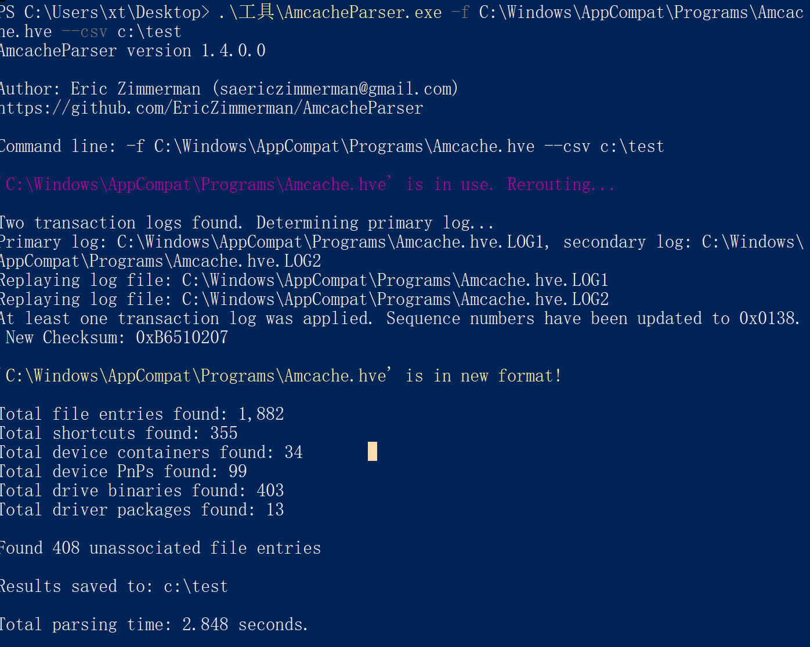
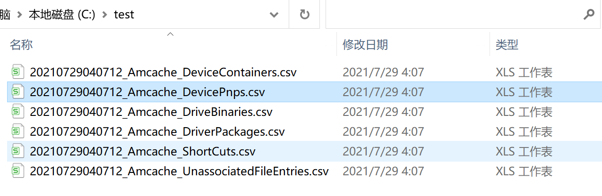

在日常应急下，我们除了针对重要数据检查，还会针对一些重点文件目录进行检查，相关目录或多或少受到黑客攻击的影响留下了痕迹，对相关文件的检查和分析有助于我们还原整个攻击链。本文则注重相关目录基本的实用查看查询方式技巧展开。

# Linux下常见重点文件目录检查

## 临时目录检查

/tmp

查看敏感目录，如/tmp目录下的文件，同时注意隐藏文件夹，以“..”为名的文件夹具有隐藏属性


## 最近访问的文件

### find

#### 基本用法

为了方便查阅这里放一下汉化版find的man手册

```
总览
       find [path...] [expression]
描述
       这个文档是GNU版本  find 命令的使用手册。  find  搜索目录树上的每一个文件名，它从左至右运算给定的表达式，按照优先规则(见运  算符OPERATORS一节)进行匹配，直到得出结果（左边运算在 '与'
       操作中得出假， 在'或' 操作中得出真），然后 find 移向下一个文件名。
       第一个以    '-'    ,    '('    ,    ')'    ,    ','    或    '!'     这些字符起始的参数是表达式的开始;      在它之前的任何参数是要搜索的路径，在它之后的任何参数都是表达式的余下部分。
       如果没有路径参数，缺省用当前目录。如果没有表达式，缺省表达式 用 '-print'.
       当所有文件都成功处理时 find 退出并返回状态值0。如果发生错误则返回一个大于0的值。
表达式
       表达式是由选项(选项总是影响所有的操作,   而不仅仅是一个指定的文件的处    理,    而且总是返回真值)，测试(测试返回一个真值或一个假值)，还有动
       作(动作有side  effects,  返回一个真值或假值)  组成。它们都以运算符分开.忽  略运算符的时候，默认使用  -and  连接.  如果表达式没有包含 -prune
       以外的动 作，当表达式为真时会执行 -print 动作。
   选项
       所有的选项都总是返回真值，它们总会被执行，除非放在表达式中执行不到的地方。 因此，清楚起见，最好把它们放在表达式的开头部分。
       -daystart
          从当日起始时开始而不是从24小时之前，计算时间(for -amin, -atime, -cmin, -ctime, -mmin, and -mtime)。
       -depth 先处理目录的内容再处理目录本身。
       -follow
          不检索符号链接。隐含了 -noleaf。
       -help, --help
          列出 find 的命令行用法的概要，然后退出。
       -maxdepth levels
          进入命令行参数指定的目录下层目录时，最深不超过levels(一个非负整数) 层。`-maxdepth 0' 意味着只在命令行参数指定的目录中执行测试和动作。
       -mindepth levels
          不在levels(一个非负整数)层之内执行任何测试和动作。`-mindepth 1'意 味着处理所有的文件，除了命令行参数指定的目录中的文件。
       -mount 不进入处于其它文件系统之上的目录。可以用-xdev代替，从而和一些其他版本的 find 兼容。
       -noleaf
          不为“目录中子目录数量比硬连接数少2”这种假设做优化。这个选项在搜索那些不遵                循UNIX文件系统链接约定的文件系统时用，比如CD-ROM,MS-DOS文件系统或AFS卷的
          加载点。在普通的UNIX文件系统中,每个目录至少有两个硬连接,它的名字和它  的    '.'       条目。另外，它的子目录(假如有)还会各有一个      '..'      链接到它。在    find
          检索一个目录时，发现子目录数比它的连接数少二时，它就知道目录中的其他条目                  并非目录(而是目录树中的叶(`leaf')节点)。除非需要检索的是这个叶节点，否则
          没必要去处理它。这样可以带来很大的搜索速度提升。
       -version, --version
          打印find的版本号然后退出。
       -xdev  不进入处于其他文件系统之上的目录。
   测试TESTS
       数字参数可以这样给出：
       +n     是比 n 大，
       -n     是比 n 小，
       n      正好是 n 。
       -amin n
          对文件的最近一次访问是在 n 分钟之前。
       -anewer file
          对文件的最近一次访问比 file 修改时间要晚。如果命令行中 -follow 在 -anewer 之前，(也只有在这种情况下) -anewer 会受 -follow 的影响。
       -atime n
          对文件的最近一次访问是在 n*24 小时之前。
       -cmin n
          对文件状态的最近一次修改是在 n 分钟之前。
       -cnewer file
          对文件状态的最近一次修改比 file 修改时间要晚。如果命令行中 -follow 在 -cnewer 之前，(也只有在这种情况下) -cnewer 会受 -follow 的影响。
       -ctime n
          对文件状态的最近一次修改是在 n*24 小时之前。
       -empty 文件是空的普通文件或者空目录。
       -false 总是false。
       -fstype type
          文件处于 type 类型的文件系统之上。有效的文件系统类型在不同版本的Unix中是不同的；一些Unix中的不完全的文件系统类型列表是这样：ufs, 4.2, 4.3, nfs, tmp, mfs, S51K, S52K. 你可以用
          -printf 加上 %F 指令来查看你的文件系统的类型。
       -gid n 文件的数字形式的组ID是 n。
       -group gname
          文件属于 gname (也允许使用数字形式的组ID).
       -ilname pattern
          和 -lname 类似，但是匹配时是不区分大小写的。
       -iname pattern
          和 -name 类似，但是匹配时是不区分大小写的。例如，`fo*' and `F??' 模式与文件名 `Foo', `FOO', `foo', `fOo' 等等相匹配。
       -inum n
          文件的 i 结点数是 n。
       -ipath pattern
          和 -path 类似，但是匹配时是不区分大小写的。
       -iregex pattern
          和 -regex 类似, 但是匹配时是不区分大小写的。
       -links n
          文件有 n 个链接。
       -lname pattern
          文件是一个与pattern 匹配的符号链接。元字符不会对`/' 或 `.' 做特殊处理。
       -mmin n
          对文件数据的最近一次修改是在 n 分钟之前。
       -mtime n
          对文件数据的最近一次修改是在 n*24 小时之前。
       -name pattern
          基本的文件名(将路径去掉了前面的目录)与shell模式pattern相匹配。元字符(`*',  `?',  还有`[]'  )  不会匹配文件名开头的`.'  。使用  -prune  来略过一个目录及其中的文件。查看  -path
          的描述中的范例。
       -newer file
          对文件的最近一次修改比 file 修改时间要晚。如果命令行中 -follow 在 -newer 之前，(也只有在这种情况下) -newer 会受 -follow 的影响。
       -nouser
          没有符合文件的数字形式的用户ID的用户。
       -nogroup
          没有符合文件的数字形式的组ID的组。
       -path pattern
          文件名与shell模式pattern相匹配。元字符不会对`/' 或 `.' 做特殊处理。因此，例如：
            find . -path './sr*sc'
          如果存在      './src/misc'          的话，会将它打印出来。想要忽略一个完整的目录树，应当使用-prune          而不是检查目录树中所有的文件。例如：要跳过  'src/emacs'
          目录和其中所有的文件和子目录，把其他找到的文件打印出来，应当这样：
            find . -path './src/emacs' -prune -o -print
       -perm mode
          文件的权限位恰好是 mode (八进制或符号)。 Symbolic modes use mode 0 as a point of departure.
       -perm -mode
          所有的权限位 mode 都被设置了的文件。
       -perm +mode
          任何权限位 mode 被设置了的文件。
       -regex pattern
          文件名与正则表达式 pattern 匹配。这是对整个路径的匹配，不是搜索文件。例如，要匹配名为`./fubar3' 的文件，可以使用正则表达式 `.*bar.' 或者 `.*b.*3'，但是不能用`b.*r3'。
       -size n[bckw]
          文件使用了  n  单位个存储单元。默认的单位是512字节的块，也可以用n后面加上  `b'  来指定这个值。其他的单位是字节，如果在  n  后面加上  `c' ；千字节(kB)，如果在  n  后面加上`k'
          ；两字节的字，如果在 n 后面加上 `w' 。大小不会计入 indirect blocks，但是会计入没有真正分配空间的疏松文件中的块。
       -true  总是true。
       -type c
          文件是 c 类型的。类型可取值如下：
          b      特殊块文件(缓冲的)
          c      特殊字符文件(不缓冲)
          d      目录
          p      命名管道 (FIFO)
          f      普通文件
          l      符号链接
          s      套接字
          D      门 (Solaris 特有)
       -uid n 文件的数字形式的用户ID是 n 。
       -used n
          文件最后一次存取是在最后一次修改它的状态的 n 天之后。
       -user uname
          文件的所有者是 uname (也可以使用数字形式的用户ID).
       -xtype c
          和   -type   相同，除非文件是一个符号链接。对于符号链接：如果没有给出  -follow  ，如果文件是一个指向  c  类型文件的链接，那么返回true；如果给出了  -follow  ，如果  c  是  `l'
          那么返回true。换句话说，对于符号链接，-xtype 检查那些 -type 不检查的文件。
   动作actions
       -exec command ;
          执行  command；如果命令返回状态值0，那么 exec  返回true。所有  find  其余的命令行参数将作为提供给命令的参数，直到遇到一个由  `;'  组成的参数为止。命令的参数中，字符串 `{}'
          将以正在处理的文件名替换。所有的       `{}'      都会被替换，不仅是在单独的一个参数中。有些版本的      find      不是这样做的。     这些参数可能需要用       `\'      来escape
          或者用括号括住，防止它们被shell展开。命令是从起始目录执行的。
       -fls file
          返回true；类似 -ls 但是像 -fprint 那样写入 file。
       -fprint file
          返回true；将文件全名打印到文件 file    中。如果运行  find     时  file     不存在，那么它将被创建。如果它存在，它将被覆盖。文件名``/dev/stdout''    和``/dev/stderr''
          会作特殊处理；它们分别指的是标准输出和标准错误输出。
       -fprint0 file
          返回true；类似 -print0 但是像 -fprint 那样写入 file。
       -fprintf file format
          返回true；类似 -printf 但是像 -fprint 那样写入 file。
       -ok command ;
          类似 -exec 但是会先向用户询问 (在标准输入); 如果回应不是以 `y' 或 `Y' 起始则不会运行 command 而是返回false。
       -print 返回true；在标准输出打印文件全名，然后是一个换行符。
       -print0
          返回true；在标准输出打印文件全名，然后是一个null字符。这样可以使得处理 find 的输出的程序可以正确地理解带有换行符的文件名。
       -printf format
          返回true；在标准输出打印      format    ,    解释  `\'    escape    还有      `%'    指令。字段宽度和精度可以像C函数    `printf'   那样来指定。与 -print   不同的是,   -printf
          在字符串末端不会添加一个新行。可用的escape 和指令如下：
          \a     警告铃声
          \b     回退
          \c     立即停止以当前格式输出，刷新输出设备。
          \f     表格结束
          \n     新行
          \r     回车
          \t     水平tab
          \v     竖直tab
          \\     输出自身`\'
          \NNN   ASCII编码是NNN(八进制)的字符
          在一个 `\' 字符后面使用任何其他字符会被作为普通的字符，因此它们都会被打印出来。
          %%     输出自身`%'
          %a     文件最后一次存取的时间。格式是C函数 `ctime' 返回值的格式。
          %Ak    文件最后一次存取的时间。格式以 k 指定，可以是 `@' 或者是C函数 `strftime' 的指令格式。下面列出了 k   可用的值；有一些并不是在所有系统上都可用，因为不同系统中  `strftime'
             也不同。
             @      从 Jan. 1, 1970, 00:00 GMT 起的秒数
             时间字段：
             H      小时 (00..23)
             I      小时 (01..12)
             k      小时 ( 0..23)
             l      小时 ( 1..12)
             M      分钟 (00..59)
             p      本地的 AM 或者 PM
             r      12小时格式的时间 (hh:mm:ss [AP]M)
             S      秒 (00..61)
             T      24小时格式的时间 (hh:mm:ss)
             X      本地的时间表示方法 (H:M:S)
             Z      时区(例如，EDT)，如果不能决定时区就是空
             日期字段：
             a      本地一星期中每天的名称的缩写(Sun..Sat)
             A      本地一星期中每天的全名，可变长度 (Sunday..Saturday)
             b      本地每月的名称的缩写 (Jan..Dec)
             B      本地每月的全名，可变长度 (January..December)
             c      本地的日期和时间表示 (Sat Nov 04 12:02:33 EST 1989)
             d      一个月当中的日子 (01..31)
             D      日期 (mm/dd/yy)
             h      与 b 相同
             j      一年当中的日子 (001..366)
             m      月份 (01..12)
             U      以星期日作为每周起始，一年当中的星期 (00..53)
             w      一星期当中的日子 (0..6)
             W      以星期一当作每周起始，一年当中的星期 (00..53)
             x      本地的日期表示 (mm/dd/yy)
             y      年份的最后两位 (00..99)
             Y      年份 (1970...)
          %b     文件大小，以512字节的块为单位 (四舍五入)。
          %c     文件状态最后一次修改的时间。格式是C函数 `ctime' 返回值的格式。
          %Ck    文件状态最后一次修改的时间。格式以 k 指定，类似于%A。
          %d     文件在目录树中的深度；0 意味着文件是一个命令行参数。
          %f     去掉了前面的目录的文件名 (只剩下最后的成分)。
          %F     文件所在文件系统的类型；这个值可以为 -fstype 所用。
          %g     文件的组名，如果组没有名称就是数字形式的组ID。
          %G     文件的数字形式的组ID。
          %h     文件名的前面的目录部分 (仅除去最后的成分)。
          %H     据以找到了文件的命令行参数。
          %i     文件的 i 结点号(16进制)。
          %k     文件大小，以1kB 的块为单位 (四舍五入)。
          %l     符号链接的目标 (如果文件不是一个符号链接，那么结果是空字符串)。
          %m     文件的权限位 (8进制)。
          %n     文件的硬连接数。
          %p     文件名。
          %P     文件名，去掉了据以找到了文件的命令行参数的名称部分。
          %s     文件大小，以字节为单位。
          %t     文件最后一次修改的时间。格式是C函数 `ctime' 返回值的格式。
          %Tk    文件最后一次修改的时间。格式以 k 指定，类似于%A。
          %u     文件的用户名，如果用户没有名称就是数字形式的用户ID。
          %U     文件的数字形式的用户ID。
          在一个 `%' 字符后面使用任何其他字符，`%' 将被忽略 (但是其他字符会被打印出来)。
       -prune 如果没有给出 -depth 则返回 true; 不进入当前目录。
          如果给出了 -depth 则返回false; 没有效果。
       -ls    返回true；以 `ls -dils' 格式在标准输出列出文件。块以1kB 字节为单位计数，除非设置了环境变量POSIXLY_CORRECT，那样的话会使用 512字节的块。
   运算符 OPERATORS
       以优先级高低顺序排列：
       ( expr )
          强制为优先
       ! expr 如果 expr 是false则返回true
       -not expr
          与 ! expr 相同
       expr1 expr2
          与 (隐含的默认运算符)；如果 expr1 为false则不会执行 expr2
       expr1 -a expr2
          与 expr1 expr2 相同
       expr1 -and expr2
          与 expr1 expr2 相同
       expr1 -o expr2
          或；如果 expr1 为true 则不会执行 expr2
       expr1 -or expr2
          与 expr1 -o expr2 相同
       expr1 , expr2
          列表；expr1 和 expr2 都会被执行。expr1 的值被忽略，列表的值是 expr2的值
参考
       locate(1L), locatedb(5L), updatedb(1L), xargs(1L) Finding Files (Info 在线帮助, 或者是打印的版本)
```


参考：

https://www.runoob.com/linux/linux-comm-find.html

https://man7.org/linux/man-pages/man1/find.1.html

官方手册：https://man7.org/linux/man-pages/man1/find.1.html

相关用法：https://www.oracle.com/cn/technical-resources/articles/linux-calish-find.html

5个基本用法：https://cloud.tencent.com/developer/article/1348438

Linux man手册中文汉化 https://www.jianshu.com/p/6d4cafb20618


#### 常用方法

```
find /opt -iname "*" -atime 1 -type f   # 查找/opt下一天内被访问过的文件
find / -iname "*" -cmin 1 -type f       # 查找最近1分钟访问的文件
-type b/d/c/p/l/f：查找块设备、目录、字符设备、管道、符号链接、普通文件。
-mtime -n +n：按文件更改时间来查找文件，n指n天以内，+n指n天前。
-atime -n +n：按文件访问时间来查找文件，n指n天以内，+n指n天前。
-ctime -n +n：按文件创建时间来查找文件，n指n天以内，+n指n天前。
find / -ctime 0 name"*.sh"   # 可查找一天内新增的sh文件
find / -ctime 0 name"*" -ls # 列出一天之内创建的文件并用正常的形式列出
find log/ -name '*.log' -newermt '2019-08-08' ! -newermt '2019-11-23' # 查找2019-08-08到2019-11-23号之间的文件
find /var/log/ -mtime +3 -type f -print  # 找出 3 天”以前”被改动过的文件 72小时之前
find /var/log/ -mtime -3 -type f -print  # 找出 3 天內被改动过的文件 (0 ~ 72 小时內)
find /var/log/ -mtime 3 -type f -print   # 找出前第 3 天被改动过的文件 (72 ~ 96 小时)
find /var/log/ -name '*.log' -newermt '2019-08-08' ! -newermt '2021-11-23' -ls 2>/tmp/null  # 查询/var/log 下2019-08-08到2021-11-23期间所有的.log文件
find /tmp -perm 777 |more # 查找权限为777的文件
find /var/www -name "*.php"| xargs egrep # 查找/var/www下所有.php文件
```



## bin目录


**bin:**

bin为binary的简写，主要放置系统的必备执行文件，例如:

cat、cp、chmod df、dmesg、gzip、kill、ls、mkdir、more、mount、rm、su、tar等。


**/usr/bin:**

主要放置应用程序工具的必备执行文件，例如：

c++、g++、gcc、chdrv、diff、dig、du、eject、elm、free、gnome*、 gzip、htpasswd、kfm、ktop、last、less、locale、m4、make、man、mcopy、ncftp、 newaliases、nslookup passwd、quota、smb*、wget等。


**/sbin:**

主要放置系统管理的必备程序，例如:

cfdisk、dhcpcd、dump、e2fsck、fdisk、halt、ifconfig、ifup、 ifdown、init、insmod、lilo、lsmod、mke2fs、modprobe、quotacheck、reboot、rmmod、 runlevel、shutdown等。


**/usr/sbin:**

主要放置网路管理的必备程序，例如:

dhcpd、httpd、imap、in.*d、inetd、lpd、named、netconfig、nmbd、samba、sendmail、squid、swap、tcpd、tcpdump等


参考：

https://blog.csdn.net/qq_36838191/article/details/83019002

## ssh密钥路径

～/.ssh及/etc/ssh


## 查看文件时间

### stat

针对可疑文件可以使用stat进行创建修改时间。

```
NAME
       stat - 打印信息节点(inode)内容

SYNOPSIS(总览)
       stat filename [filenames ... ]

DESCRIPTION(描述)
       stat 打印出一个信息节点的内容,它们显示为对人可读的格式的stat(2).

       下面是stat的一个示例输出:
       File: “/”
       Size: 1024         Allocated Blocks: 2            Filetype: Directory
       Mode: (0755/drwxr-xr-x)         Uid: (    0/    root)  Gid: (    0/  system)
       Device:  0,0   Inode: 2         Links: 20
       Access: Wed Jan  8 12:40:16 1986(00000.00:00:01)
       Modify: Wed Dec 18 09:32:09 1985(00021.03:08:08)
       Change: Wed Dec 18 09:32:09 1985(00021.03:08:08)

DIAGNOSTICS(诊断)
       “Can't stat file” or “Can't lstat file” 通常意味着它不存在.  “Can't readlink file” 暗示符号链接有错误.
```


# Windows下常见重点文件目录检查

## 临时目录检查


查看当前系统temp配置路径可以通过依次进入系统属性》环境变量》temp和tmp设置查看，也可以通过命令行查看：


c:\windows\temp

在cmd下执行下面的命令直接调环境变量的值可以查看相关的内容：

```
dir %temp% && dir %tmp%  # 列出环境变量中两个临时变量目录中存在的值
```




## 浏览器下载目录

浏览历史记录、下载的文件、浏览器启动方式、cookie信息等排查。


## 最近访问的文件

windows默认会开启最近访问的文件功能，该功能会记录最近访问过的文件，通过访问目录可以查看最近访问的文件清单。

%userprofile%\AppData\Roaming\Microsoft\Windows\Recent\

```
dir %userprofile%\AppData\Roaming\Microsoft\Windows\Recent\
dir C:\Documents and Settings\Administrator\Recent
dir C:\Documents and Settings\DefaultUser\Recent
```

## 

## 预读文件夹

windows系统为增加预读取功能而自动创建的，载入内存中使用，主要用于加快系统启动和程序运行的速度，提升系统性能。


prefetch目录为C:\WINDOWS\Prefetch，

```
dir "%SystemRoot%\Prefetch\"
```




## 兼容相关程序查询

Amcache.hve

### 解析工具(RecentFileCache.bcf)


1. 源代码开源(c#)
   https://github.com/jwhwan9/dumpBCF
2. 源代码开源(python)
   https://github.com/prolsen/recentfilecache-parser


用法示例：


```
rfcparse.py -f C:\Windows\AppCompat\Programs\RecentFileCache.bcf
```


### 解析工具(Amcache.hve)

目前windows8之后都是Amcache.hve

1. 命令行解析
   源代码开源(c#)
   https://github.com/EricZimmerman/AmcacheParser


下载地址 https://f001.backblazeb2.com/file/EricZimmermanTools/AmcacheParser.zip


用法示例：

```
AmcacheParser.exe -f C:\Windows\AppCompat\Programs\Amcache.hve --csv c:\test
```

注：某些情况下会无法导出，提示系统正在占用文件Amcache.hve


1. 源代码开源(python)

https://github.com/williballenthin/python-registry/blob/master/samples/amcache.py


1. 源代码开源(powershell)

https://github.com/yoda66/GetAmCache/blob/master/Get-Amcache.ps1


1. kape

 由于该软件目前官网申请免费版迟迟没有回应，暂时无法进行测试。你可以在[这里](https://raw.githubusercontent.com/EricZimmerman/KapeFiles/ca610573a518121e891750a44537c7164e170a49/kape.exe)下载一个官方的老版本，但经测试功能存在问题。

 kape简单介绍https://binaryforay.blogspot.com/2019/02/introducing-kape.html

```
C:\Users\xt>C:\Users\xt\Downloads\kape.exe

KAPE version 0.8.3.5 Author: Eric Zimmerman (kape@kroll.com)

        tsource         Target source drive to copy files from (C, D:, or F:\ for example)
        target          Target configuration to use
        tdest           Destination directory to copy files to. %d will be expanded to a timestamp (yyyyMMddTHHmmss). If --vhdx, --vhd or --zip is set, files will end up in VHD(X) container or zip file
        tlist           List available targets
        tdetail         Dump target file details
        tflush          Delete all files in 'tdest' prior to collection

        msource         Directory containing files to process. If using targets and this is left blank, it will be set to --tdest automatically
        module          Module configuration to use
        mdest           Destination directory to save output to. %d will be expanded to a timestamp (yyyyMMddTHHmmss)
        mlist           List available modules
        mdetail         Dump module processors details
        mflush          Delete all files in 'mdest' prior to running modules
        mvars           Provide a list of key:value pairs to be used for variable replacement in modules. Ex: --vars foo:bar would allow for using %foo% in a module which is replaced with bar at runtime. Multiple pairs should be separated by a comma. Do not use spaces in keys or values or between commas
        mef             Export format (csv, html, or json). Overrides what is in module config

        vss             Process all Volume Shadow Copies that exist on --tsource. Default is FALSE
        tdd             Deduplicate files from --tsource & VSCs based on SHA-1. First file found wins. Default is TRUE

        vhdx            The base name of the VHDX file to create from --tdest. This should be an identifier, NOT a filename. Use this or --vhd or --zip
        vhd             The base name of the VHD file to create from --tdest. This should be an identifier, NOT a filename. Use this or --vhdx or --zip
        zip             The base name of the ZIP file to create from --tdest. This should be an identifier, NOT a filename. Use this or --vhdx or --vhd

        scs             SFTP server host/IP for transfering *compressed VHD(X)* container
        scp             SFTP server port. Default is 22
        scu             SFTP server username. Required when using --scs
        scpw            SFTP server password
        scc             Comment to include with transfer. Useful to include where a transfer came from. Defaults to the name of the machine where KAPE is running

        zv              If true, the VHD(X) container will be zipped after creation. Default is TRUE
        zm              If true, directories in --mdest will be zipped. Default is FALSE
        zpw             If set, use this password when creating zip files (--zv | --zm | --zip)

        debug           Show debug information during processing
        trace           Show trace information during processing

        gui             If true, KAPE will not close the window it executes in when run from gkape. Default is FALSE

        guids           KAPE will generate 10 GUIDs and exit. Useful when creating new targets/modules. Default is FALSE
        sync            If true, KAPE will download the latest targets and modules from https://github.com/EricZimmerman/KapeFiles prior to running. Default is FALSE
        sow             If true, KAPE will overwrite existing Targets and Modules when using --sync. Default is TRUE

Examples: kape.exe --tsource L: --target RegistryHives --tdest "c:\temp\RegistryOnly"
          kape.exe --tsource H --target !ALL --tdest "c:\temp\default" --debug
          kape.exe --tsource \\server\directory\subdir --target !ALL --tdest "c:\temp\default_%d" --vhdx LocalHost
          kape.exe --msource "c:\temp\default" --module LECmd --mdest "c:\temp\modulesOut" --trace --debug

          Short options (single letter) are prefixed with a single dash. Long commands are prefixed with two dashes
```

 参考：

https://journeyintoir.blogspot.com/2013/12/revealing-recentfilecachebcf-file.html

http://www.swiftforensics.com/2013/12/amcachehve-in-windows-8-goldmine-for.html

https://forensic4cast.com/forensic-4cast-awards/2020-forensic-4cast-awards/


## 按照时间点查找文件

### forfiles

#### 基本用法

```
PS C:\Windows\appcompat\Programs> forfiles /?

FORFILES [/P pathname] [/M searchmask] [/S]
         [/C command] [/D [+ | -] {yyyy/MM/dd | dd}]

描述:
    选择一个文件(或一组文件)并在那个文件上
    执行一个命令。这有助于批处理作业。

参数列表:
    /P    pathname      表示开始搜索的路径。默认文件夹是当前工作的
                        目录 (.)。


    /M    searchmask    根据搜索掩码搜索文件。默认搜索掩码是 '*'。

    /S                  指导 forfiles 递归到子目录。像 "DIR /S"。


    /C    command       表示为每个文件执行的命令。命令字符串应该
                        用双引号括起来。


                        默认命令是 "cmd /c echo @file"。下列变量
                        可以用在命令字符串中:

                        @file    - 返回文件名。
                        @fname   - 返回不带扩展名的文件名。

                        @ext     - 只返回文件的扩展名。

                        @path    - 返回文件的完整路径。
                        @relpath - 返回文件的相对路径。

                        @isdir   - 如果文件类型是目录，返回 "TRUE"；
                                   如果是文件，返回 "FALSE"。
                        @fsize   - 以字节为单位返回文件大小。

                        @fdate   - 返回文件上一次修改的日期。

                        @ftime   - 返回文件上一次修改的时间。


                        要在命令行包括特殊字符，字符请以 0xHH
                        形式使用十六进制代码(例如，0x09 为 tab)。

                        内部 CMD.exe 命令前面应以 "cmd /c" 开始。


    /D    date          选择文件，其上一次修改日期大于或等于 (+)，
                        或者小于或等于 (-) 用 "yyyy/MM/dd" 格式指定的日期;

                        "yyyy/MM/dd" format; or selects files with a
                        当前日期加 "dd" 天，或者小于或等于 (-) 当前

                        日期减 "dd" 天。有效的 "dd" 天数可以是
                        0 - 32768 范围内的任何数字。如果没有指定，

                        "+" 被当作默认符号。

    /?                  显示此帮助消息。

示例:
    FORFILES /?
    FORFILES
    FORFILES /P C:\WINDOWS /S /M DNS*.*
    FORFILES /S /M *.txt /C "cmd /c type @file | more"
    FORFILES /P C:\ /S /M *.bat
    FORFILES /D -30 /M *.exe
             /C "cmd /c echo @path 0x09 在 30 前就被更改。"
    FORFILES /D 2001/01/01
             /C "cmd /c echo @fname 在 2001年1月1日就是新的。"
    FORFILES /D +2021/7/29 /C "cmd /c echo @fname 今天是新的。"
    FORFILES /M *.exe /D +1
    FORFILES /S /M *.doc /C "cmd /c echo @fsize"
    FORFILES /M *.txt /C "cmd /c if @isdir==FALSE notepad.exe @file"
PS C:\Windows\appcompat\Programs>
```

#### 常用方法

```
fofiles /m *.jsp /D +2021/5/1 /s /p c:\ /c "cmd /c echo @path @fdate @ftime" 2>null # 查询2021/5/1之前的c盘目录下所有.jsp文件并输出目录文件名文件时间
forfiles /P c:\ /S /M *.bat /C "cmd /c echo @file is a batch file" # 查询c目录下所有bat文件
forfiles /P c:\ /S /M * /C "cmd /c if @isdir==TRUE echo @file is a directory" # 查询所有目录文件
forfiles /S /M *.* /D -365 /C "cmd /c echo @path @file @fdate @ftime" # 查询超过一年的文件并输出文件名和文件地址以及最近一次修改时间
forfiles /S /M *.* /D -01/01/2007 /C "cmd /c echo @file is outdated." # 查2007年前的所有文件并输出
forfiles /S /M *.* /C "cmd /c echo The extension of @file is 0x09@ext"  # 查询c下所有文件并展示所有文件的种类
```

参考：

https://docs.microsoft.com/en-us/windows-server/administration/windows-commands/forfiles
