Hook分为应用层（Ring3）Hook和内核层（Ring0）Hook，应用层Hook适用于x86和x64，而内核层Hook一般仅在x86平台适用，因为从Windows Vista的64版本开始引入的Patch Guard技术极大地限制了Windows x64内核挂钩的使用。


# windows下应用层和内核钩子检查

## hook

### hook原理部分


HOOK和注入技术经常被恶意代码使用,利用HOOK和注入技术,恶意代码提高了执行隐蔽性,增加了恶意代码分析难度，在某些情况下还能实现提权提升和内存常驻。


钩子(Hook)，是Windows消息处理机制的一个平台,应用程序可以在上面设置子程以监视指定窗口的某种消息，而且所监听的窗口可以是其他进程所创建的。当消息到达后,在目标窗口处理函数之前处理它，钩子机制允许应用程序截获处理Window消息或特定事件。


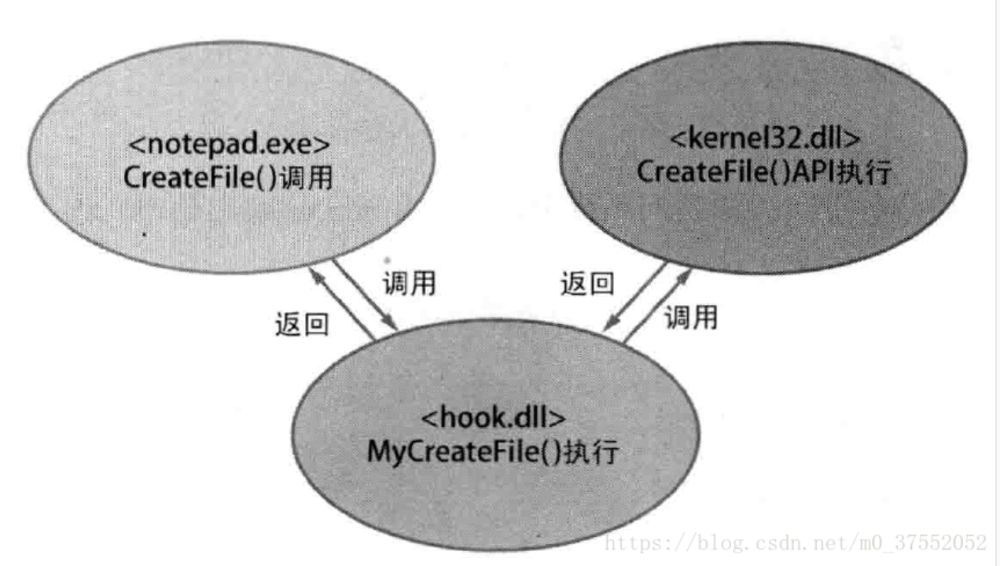


### hook的分类

Hook分为应用层（Ring3）Hook和内核层（Ring0）Hook，应用层Hook适用于x86和x64，而内核层Hook一般仅在x86平台适用，因为从Windows Vista的64版本开始引入的Patch Guard技术极大地限制了Windows x64内核挂钩的使用。

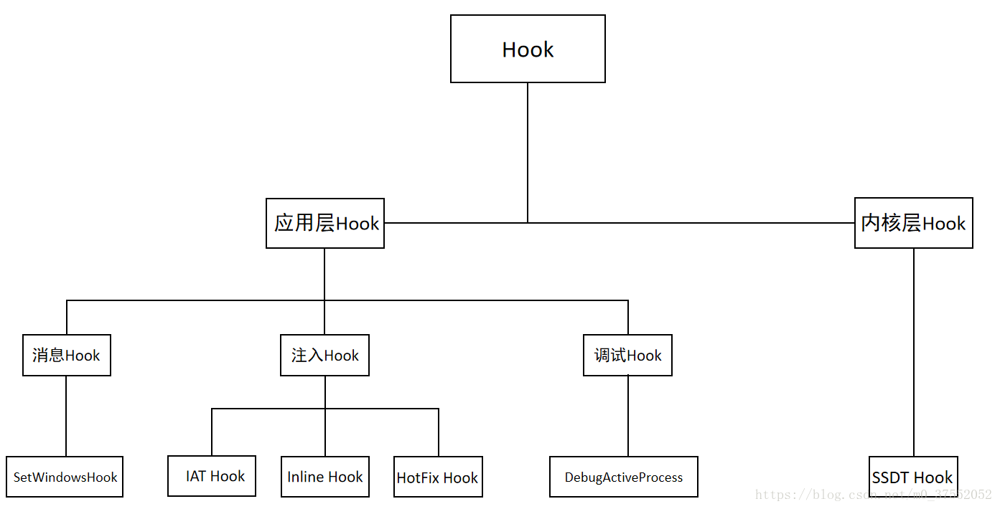


### 消息hook

首先先来了解下常规的Windows消息流：

1. 发生键盘输入事件时，WM_KEYDOWN消息被添加到[OS message queue]系统消息队列。
2. OS判断哪个应用程序中发生了事件，然后从[OS message queue]系统消息队列中取出消息，添加到相应应用程序的[application message queue]应用消息队列中。

1. 应用程序（如记事本）监视自身的[application message queue]应用消息队列，发现新添加的WM_KEYDOWN消息后，调用相应的事件处理程序处理。

所以，我们只需在[OS message queue]和[application message queue]之间安装钩子即可窃取键盘消息，并实现恶意操作。


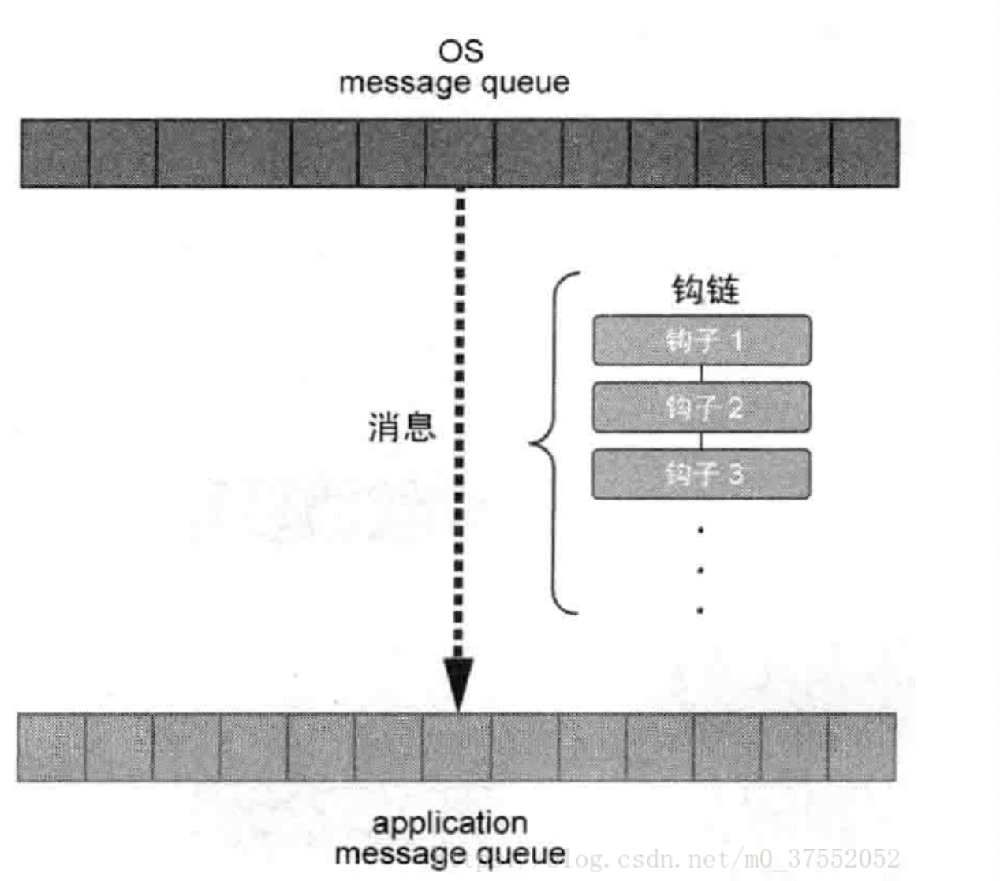


那么我们该如何安装这个消息钩子呢？很简单，Windows提供了一个官方函数SetWindowsHookEx()用于设置消息Hook，编程时只要调用该API就能简单地实现Hook。


消息Hook常被窃密木马用来监听用户的键盘输入，程序里只需写入如下代码就能对键盘消息进行Hook:

SetWindowsHookEx(

WH_KEYBOARD, //键盘消息

KeyboardProc, //钩子函数（处理键盘输入的函数）

hInstance, //钩子函数所在DLL的Handle

0 //该参数用于设定要Hook的线程ID，为0时表示监视所有线程

)

该API在简单高效的同时也有一个弊端，就是它只能监视较少的消息，如：击键消息、鼠标移动消息、窗口消息。想要对系统更全面的进行Hook就要使用以下介绍的两种Hook方法。

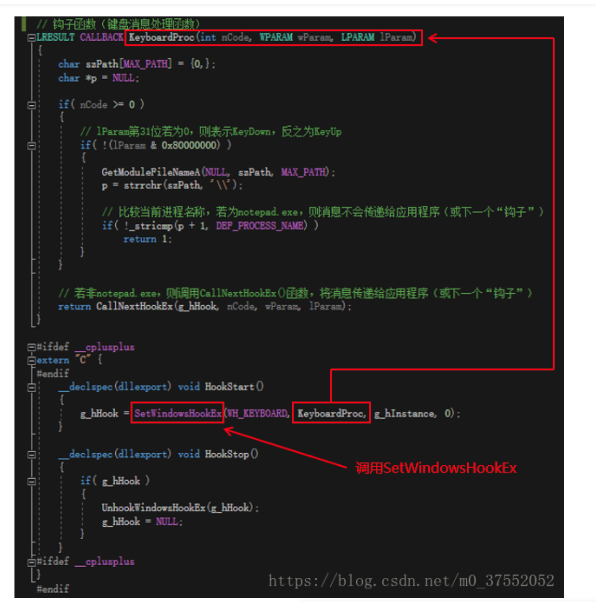

### 调试hook

#### 调试hook原理

该Hook方法的原理跟调试器的工作机制相似，核心思想都是让进程发生异常，然后自己捕获到该异常，对处于被调试状态下的级才能进行恶意操作。
下图是常规进程的异常事件处理，当进程未被其他进程调试时，其默认异常事件处理者是OS，一旦进程发生异常，OS将捕获到该异常，并进行相应的事件处理。


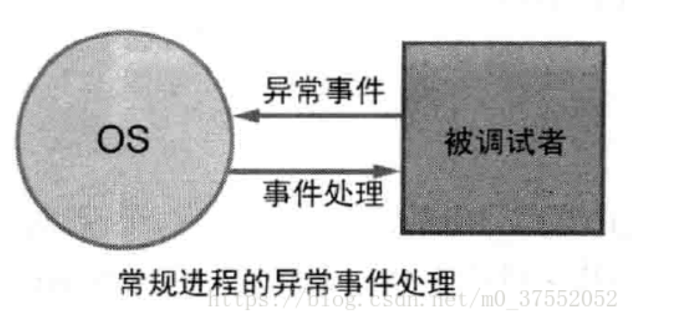


若进程被另一个进程调试了（如OllyDbg），异常事件的处理工作将移交给调试者，比如进程发生了除0错误，OllyDbg将接收到这个异常事件并对进行相应处理。
PS：调试器无处理或不关心的调试事件最终由OS处理。

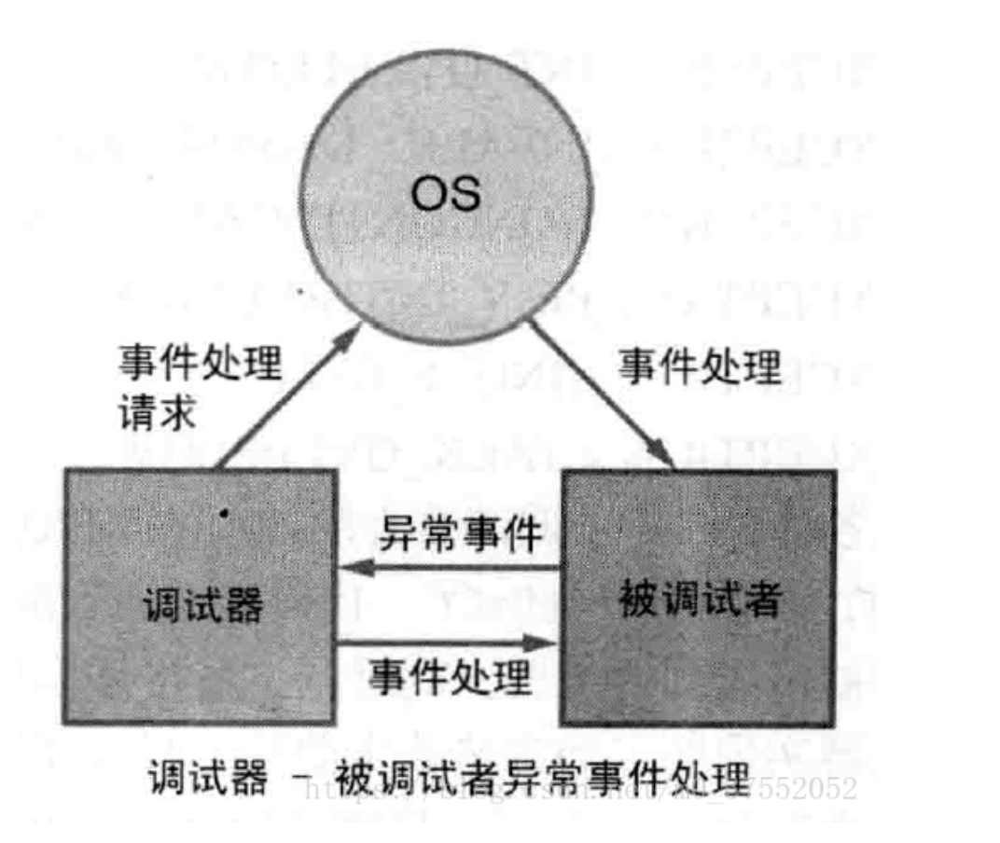


所以，调试Hook的核心思路就是将API的第一个字节修改为0xCC（INT 3），当API被调用时，由于触发了异常，控制权就被转交给调试器。

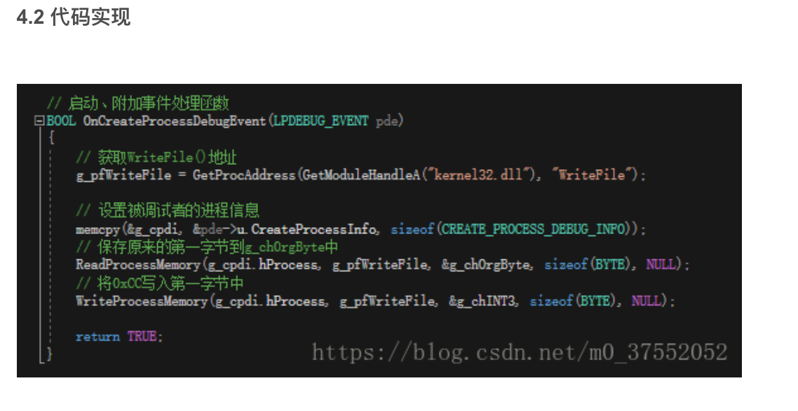

### 注入hook

Hook的核心思想就是修改API的代码，但是，比如我A进程要Hook一个B进程的CreateProcess函数，A是没有权限修改B内存中的代码的，怎么办？这时候使用DLL注入技术就可以解决这问题，我们将Hook的代码写入一个DLL（或直接一个shellcode），将此DLL注入到B进程中，此时因为DLL在B进程的内存中，所以就有权限直接修改B内存中的代码了。

[


](https://blog.csdn.net/m0_37552052/article/details/81453591)

#### IAT hook**（ring3 windows消息型）**

##### IAT（导入地址表）

Import Address Table 由于导入函数就是被程序调用但其执行代码又不在程序中的函数，这些函数的代码位于一个或者多个DLL 中.当PE 文件被装入内存的时候，Windows 装载器才将DLL 装入，并将调用导入函数的指令和函数实际所处的地址联系起来(动态连接)，这操作就需要导入表完成。其中**导入地址表就****指示函数****实际地址**。


##### IAT hook

IAT Hook顾名思义就是通过修改IAT里的函数地址对API进行Hook。

###### IAT hook技术原理 

如下，左图红框内是IAT修改前的状态，指明SetWindowTextW()的地址为0x77D0960E，所以calc.exe执行call SetWindowTextW（dword ptr[01001110]）实质上就是执行call 0x77D0960E。

右图是被Hook后的状态，IAT中的SetWinowTextW()的地址已被修改为0x10001000，calc.exe执行call SetWindowTextW（dword ptr[01001110]）实质变成了执行call 0x10001000（也就是恶意代码的起始地址），这时候就可以做我们想做的操作了。

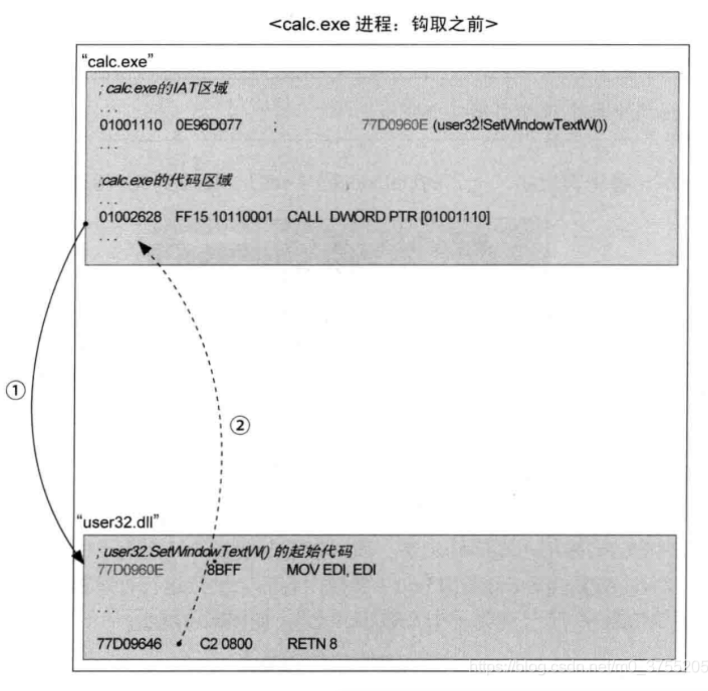


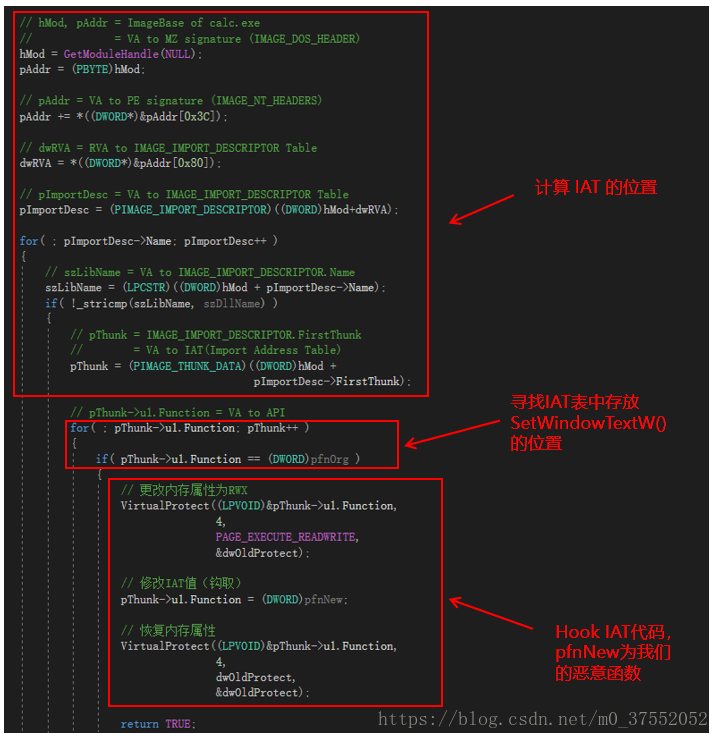

#### inline hook**（ring3 windows api型）**

内联Hook相比于IAT Hook，显得更简单粗暴，它直接修改内存中任意函数的代码，将其劫持至Hook API。同时，它比IAT Hook的适用范围更广，因为只要是内存中有的函数它都能Hook，而后者只能Hook IAT表里存在的函数（有些程序会动态加载函数）。

##### inline hook技术原理

Inline Hook的目标是系统函数，如下，左图是Hook之前的状态，procexp.exe进程调用ZwQuerySystemInformation()函数时，ZwQuerySystemInformation()的代码是正常的代码。右图是Hook后的状态，注意红框中的代码，ZwQuerySystemInformation()函数开头5个字节已被修改，变成了jmp 0x10001120，也就是我们恶意代码的地址，之后便可以开始我们的自定义操作。0x1000116A我们先进行unhook操作（脱钩），目的是将ZwQuerySystemInformation()的代码恢复。大家可能有疑惑，为什么刚修改完又要恢复回来，原因很简单，Hook的目的是当调用某个函数时，我们能劫持进程的执行流。现在我们已经劫持了进程的执行流，便可以恢复ZwQuerySystemInformation()的代码，以便我们的恶意代码可以正常调用ZwQuerySystemInformation()。执行完恶意代码后，再次挂钩，监控该函数。

[


](https://blog.csdn.net/m0_37552052/article/details/81453591)

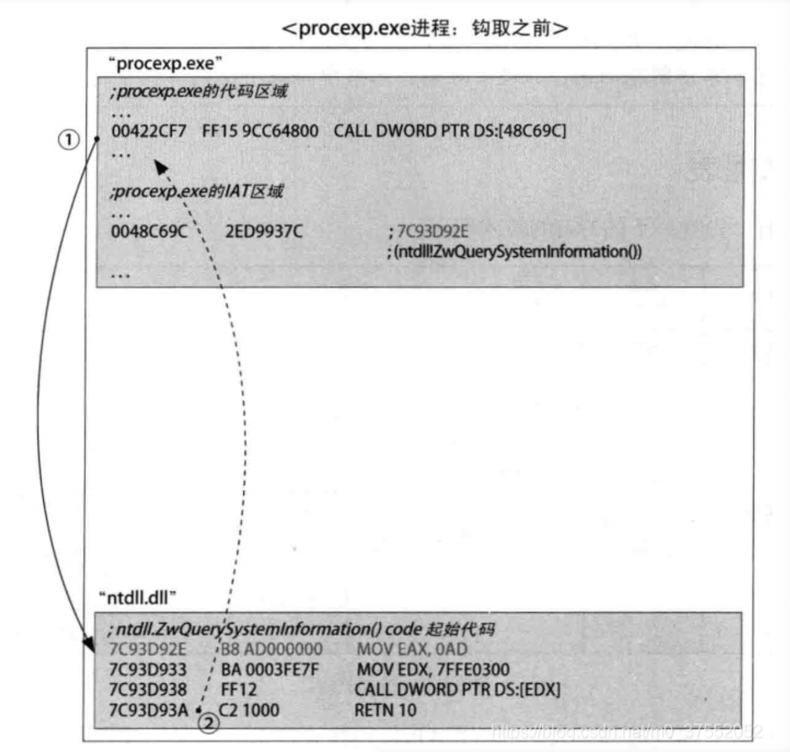


首先获取原API的地址，并保存在pfnOrg中，然后修改内存段属性为RWX，备份原有代码（以便后续代码恢复），实时计算JMP的相对偏移，最后修改API前5字节的代码，恢复内存属性。


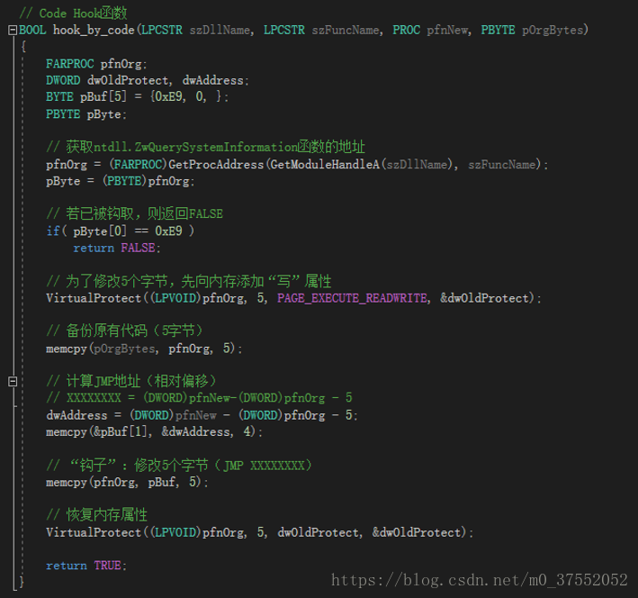


#### **HotFix Hook（ring3 windows api型）**

从上节对Code Hook方法的讲解中，我们会发现Code Hook存在一个效率的问题，因为每次Code Hook都要进行“挂钩+脱钩”的操作，也就是要对API的前5字节修改两次，这样，当我们要进行全局Hook的时候，系统运行效率会受影响。而且，当一个线程尝试运行某段代码时，若另一个线程正在对该段代码进行“写”操作，这时就会程序冲突，最终引发一些错误。

有没有办法避免这种隐患呢？答案是有的，可以使用HotFix Hook（“热补丁”）方法。


##### **HotFix Hook**技术原理

以上累出的API起始代码有如下两个明显的相似点：
\1. API代码以“MOV EDI,EDI”指令开始。
\2. API代码上方有5个NOP指令。


MOV EDI,EDI用于将EDI的值再次复制给EDI，这没有什么实际意义。也就是说，API起始代码的MOV指令（2个字节）与其上方的5个NOP指令（5个字节）合起来共7个字节的指令没有任何意义。所以我们就可以通过修改这7个字节来实现Hook操作。这种方法因为可以在进程处于运行状态时临时更改进程内存中的库文件，所以微软也常用这种方法来打“热补丁”。

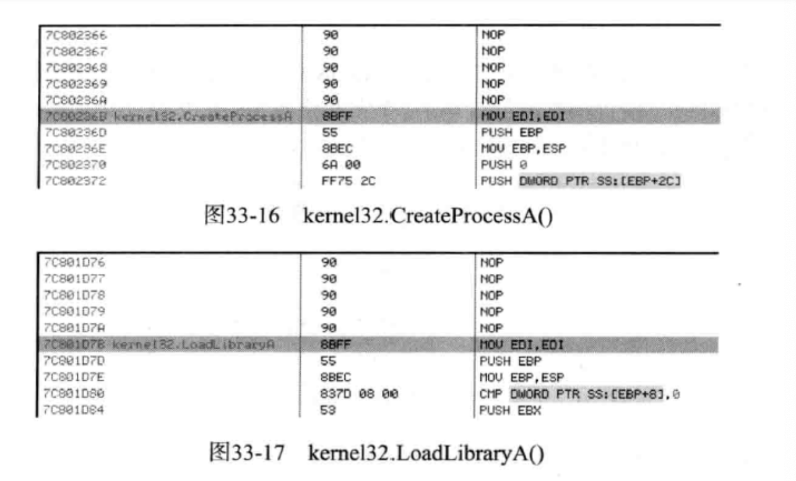

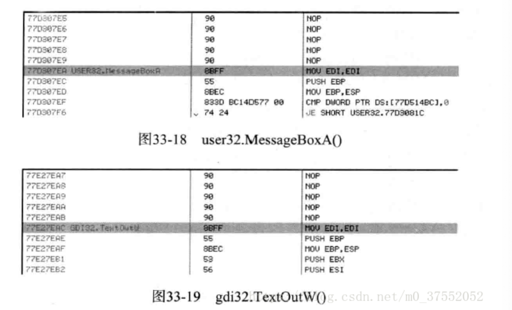


如下，将前7个字节改成：
JMP 10001000（恶意代码地址）
JMP SHORT 0x7C802366

这样，当API被调用时，首先执行了JMP SHORT 0x7C802366，便跳到了JMP 10001000处执行，最后跳到了恶意代码的起始处0x10001000。

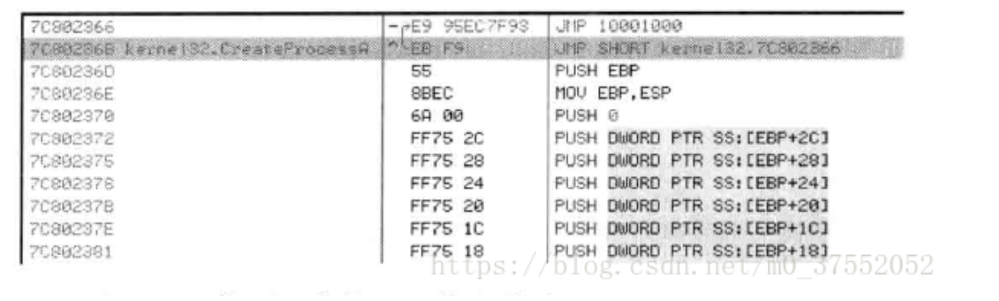

在5字节代码修改技术中“脱钩”是为了“调用原函数”，而使用“热补丁”技术钩取API时，在API代码遭到修改的状态下也能正常调用原API（从[API起始地址+2]地址开始，仍然能正常调用原API，且执行的动作也完全一样）。

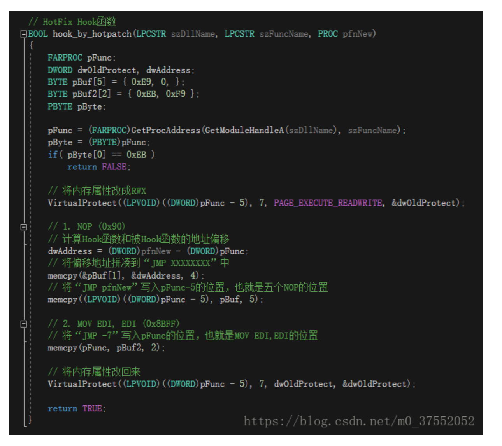


由于HotFix Hook需要修改7个字节的代码，所以并不是所有API都适用这种方法，若不适用，请使用5字节代码修改技术。


#### ssdt hook（ring0）

SSDT Hook属于内核层Hook，也是最底层的Hook。由于用户层的API最后实质也是调用内核API（Kernel32->Ntdll->Ntoskrnl），所以该Hook方法最为强大。

##### ssdt

内核通过SSDT（System Service Descriptor Table）系统服务描述符表调用各种内核函数，SSDT就是一个函数表，只要得到一个索引值，就能根据这个索引值在该表中得到想要的函数地址。

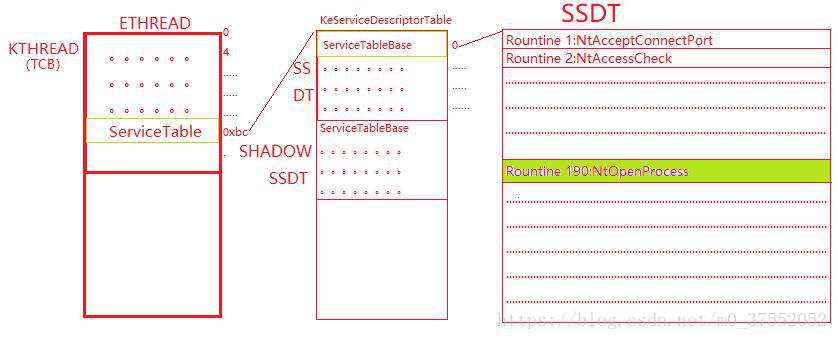

下图0x80563520处就是ntoskrnl对应的服务描述符表结构SSDT。那么第一个32位的0x804e58a0则是SSDT Base，即SSDT的首地址。

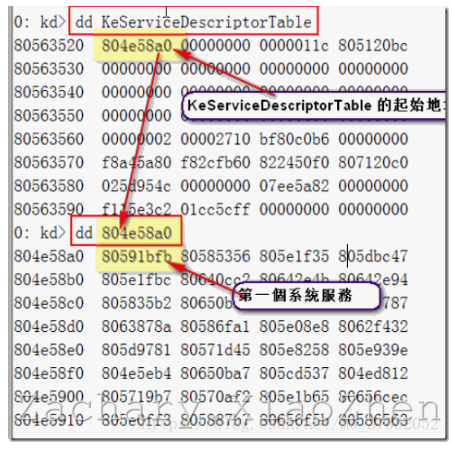

通过对这些地址反汇编，就能得到相应的函数，下图中0x80591bfb是SSDT表中的第一个函数NtAcceptConnectPort的地址。


我们接下来试着寻找NtQuerySystemInformation的地址，首先反汇编ZwQuerySystemInformation，得知它要寻找SSDT中索引号为0xAD的地址。

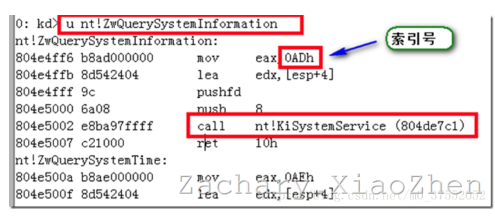

从上面我们可以知道，NtQuerySystemInformation的索引号为0xAD，那么我们就可以算出NtQuerySystemInformation的地址：
0x80591bfb + 0xAD = 0x8056ff1


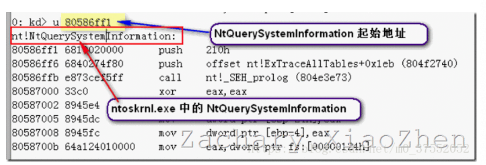

ssdt hook代码实现


其实内核层Hook并没想象中的那么高大上，Hook的原理相同，只不过Hook的对象不一样罢了。Hook步骤还是那5步：

1.修改内存属性为RWX。

2.拼接汇编码jmp [HookFunc]。

3.保存原代码头5个字节。

4.将头5个字节替换为2的汇编码。

5.恢复前5个字节。

6.恢复内存属性。

[
](https://blog.csdn.net/m0_37552052/article/details/81453591)

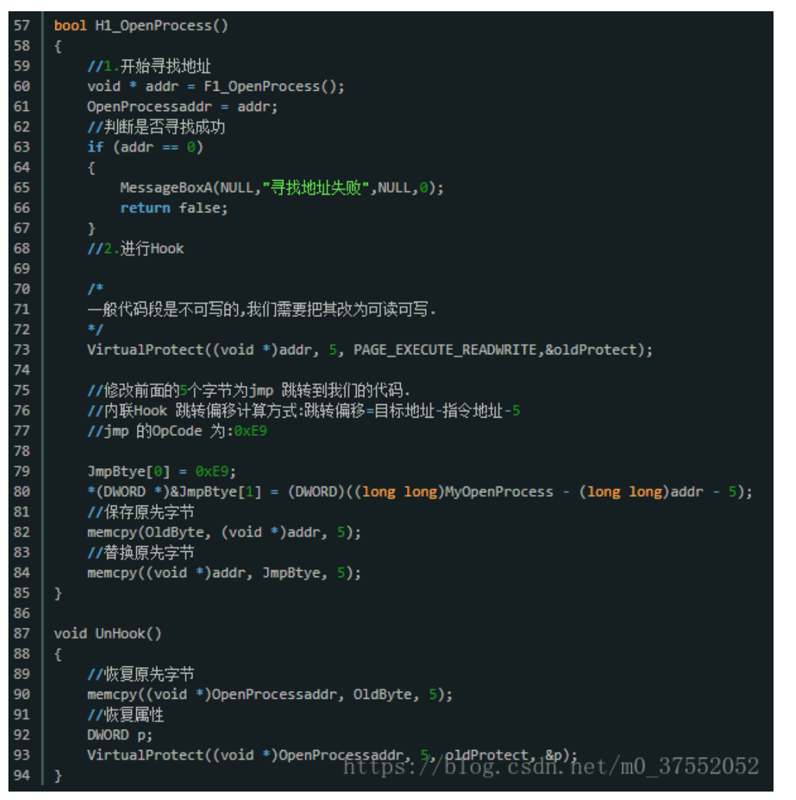


参考：

豪宝的hook笔记部分

小宝马的爸爸-进程隐藏与进程保护（SSDT Hook 实现）（一）https://www.cnblogs.com/BoyXiao/archive/2011/09/03/2164574.html

G4rb3n-Windows Hook原理与实现https://blog.csdn.net/m0_37552052/article/details/81453591


## 实现hook

### 实现IAT Hook


IAT（Import Address Table）导入地址表，是执行程序用来查询加载的动态库dll文件、查询函数地址的内存地址表。记录了导入函数的名字和所在动态库的名称.


参考：

https://baike.baidu.com/item/IAT/20444498?fr=aladdin


在理参考ired的关于IAThook的教程

测试流程：


#### 概述

- Windows 可移植可执行文件包含一个名为 Import Address Table (IAT)
- IAT 包含指向可执行文件完成其工作的关键信息的指针： 

- 提供预期功能所依赖的 DLL 列表
- 来自那些 DLL 的函数名称及其地址的列表，这些 DLL 可能在某些时候被二进制文件调用

- 可以通过用恶意函数地址覆盖目标函数的地址来挂钩 IAT 中指定的函数指针，并可选择执行最初预期的函数

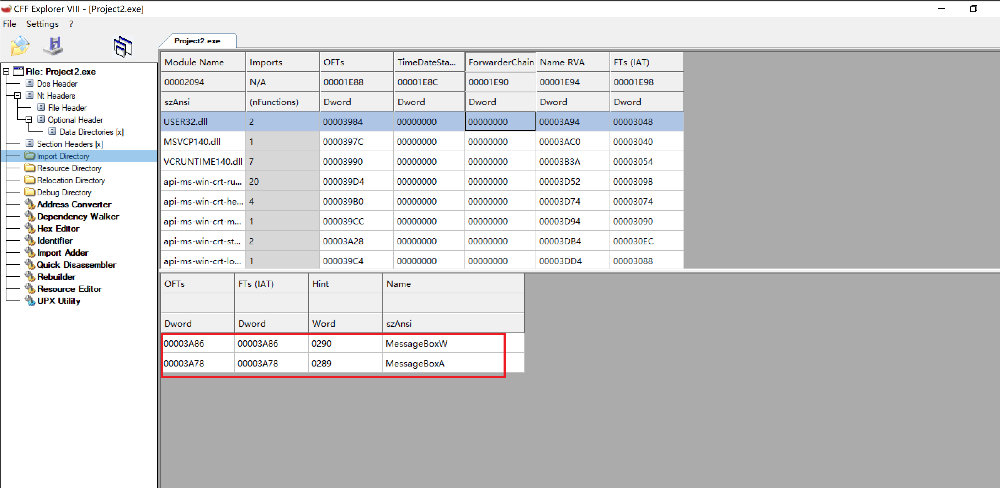

#### Hook前

- 目标程序调用 WinAPI函数MessageBoxA
- 程序在 IAT 中查找地址MessageBoxA

- 代码执行跳转到第 2 步中解析的 地址，其中显示（绿框）的合法代码所在kernel32!MessageBoxAMessageBoxA

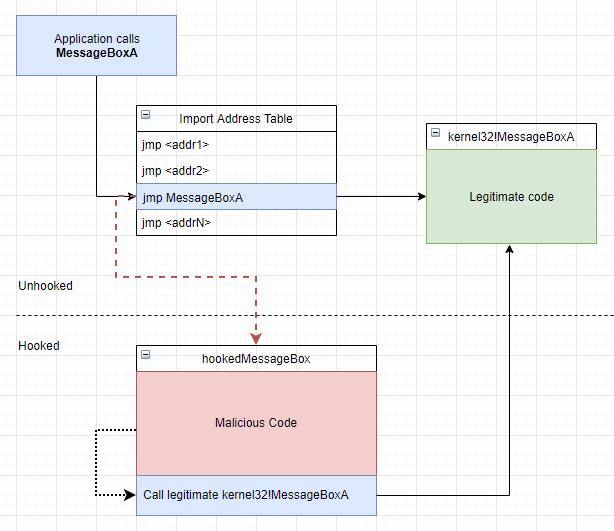

#### Hook之后

- 目标程序在钩子之前调用MessageBoxA
- 程序在 IAT 中查找地址MessageBoxA

- 这次因为IAT被篡改，IAT中的地址指向了一个流氓函数（红框）MessageBoxAhookedMessageBox
- 程序跳转到步骤3中检索到的hookedMessageBox

- hookedMessageBox拦截参数并执行一些恶意代码MessageBoxA
- hookedMessageBox调用合法的例程kernel32!MessageBoxA


二进制文件在内存中的基址位置为0x000007FF6BFD50000	

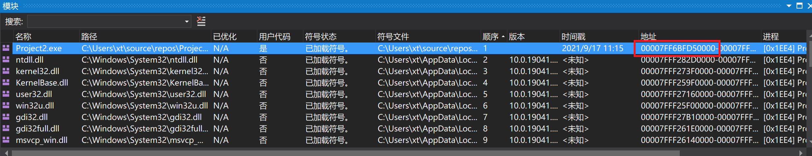


在IAT操作之前，指向：MessageBoxA地址 0x00007ff6bfd663f2 （IAT地址）

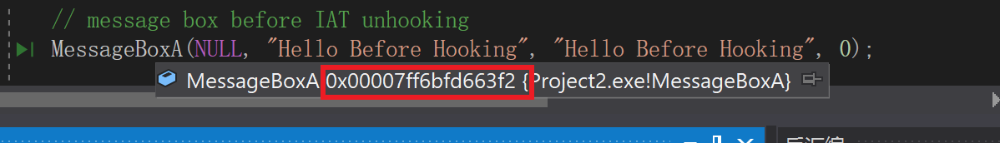

我们通过查询IAT内存地址即可知道实际MessageBoxA地址0x000007FF6BFD771D8。

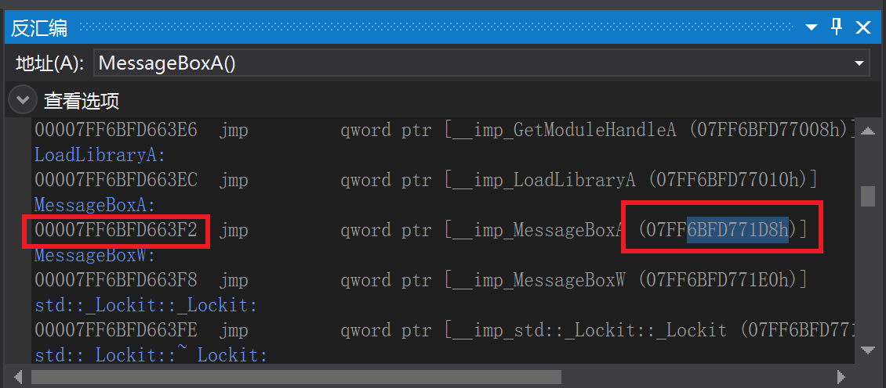


除此之外，我们还可以通过通过CPP查询到的偏移地址也可以推出MessageBoxA的实际地址=基址+偏移地址=0x000007FF6BFD50000+0x000000000000271D8=0x000007FF6BFD771D8

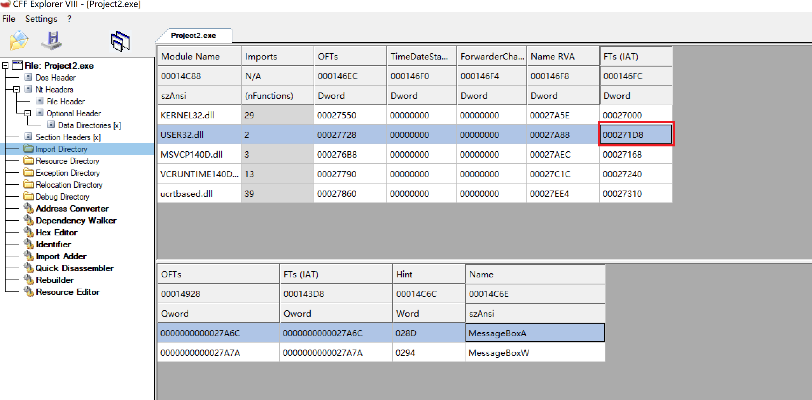


```
#include <iostream>
#include <Windows.h>
#include <winternl.h>

// define MessageBoxA prototype
using PrototypeMessageBox = int (WINAPI *)(HWND hWnd, LPCSTR lpText, LPCSTR lpCaption, UINT uType);

// remember memory address of the original MessageBoxA routine
PrototypeMessageBox originalMsgBox = MessageBoxA;

// hooked function with malicious code that eventually calls the original MessageBoxA
int hookedMessageBox(HWND hWnd, LPCSTR lpText, LPCSTR lpCaption, UINT uType)
{
	MessageBoxW(NULL, L"Ola Hooked from a Rogue Senor .o.", L"Ola Senor o/", 0);
	// execute the original NessageBoxA
	return originalMsgBox(hWnd, lpText, lpCaption, uType);
}

int main()
{
	// message box before IAT unhooking
	MessageBoxA(NULL, "Hello Before Hooking", "Hello Before Hooking", 0);
	
	LPVOID imageBase = GetModuleHandleA(NULL);
	PIMAGE_DOS_HEADER dosHeaders = (PIMAGE_DOS_HEADER)imageBase;
	PIMAGE_NT_HEADERS ntHeaders = (PIMAGE_NT_HEADERS)((DWORD_PTR)imageBase + dosHeaders->e_lfanew);

	PIMAGE_IMPORT_DESCRIPTOR importDescriptor = NULL;
	IMAGE_DATA_DIRECTORY importsDirectory = ntHeaders->OptionalHeader.DataDirectory[IMAGE_DIRECTORY_ENTRY_IMPORT];
	importDescriptor = (PIMAGE_IMPORT_DESCRIPTOR)(importsDirectory.VirtualAddress + (DWORD_PTR)imageBase);
	LPCSTR libraryName = NULL;
	HMODULE library = NULL;
	PIMAGE_IMPORT_BY_NAME functionName = NULL; 

	while (importDescriptor->Name != NULL)
	{
		libraryName = (LPCSTR)importDescriptor->Name + (DWORD_PTR)imageBase;
		library = LoadLibraryA(libraryName);

		if (library)
		{
			PIMAGE_THUNK_DATA originalFirstThunk = NULL, firstThunk = NULL;
			originalFirstThunk = (PIMAGE_THUNK_DATA)((DWORD_PTR)imageBase + importDescriptor->OriginalFirstThunk);
			firstThunk = (PIMAGE_THUNK_DATA)((DWORD_PTR)imageBase + importDescriptor->FirstThunk);

			while (originalFirstThunk->u1.AddressOfData != NULL)
			{
				functionName = (PIMAGE_IMPORT_BY_NAME)((DWORD_PTR)imageBase + originalFirstThunk->u1.AddressOfData);
					
				// find MessageBoxA address
				if (std::string(functionName->Name).compare("MessageBoxA") == 0)
				{
					SIZE_T bytesWritten = 0;
					DWORD oldProtect = 0;
					VirtualProtect((LPVOID)(&firstThunk->u1.Function), 8, PAGE_READWRITE, &oldProtect);
						
					// swap MessageBoxA address with address of hookedMessageBox
					firstThunk->u1.Function = (DWORD_PTR)hookedMessageBox;
				}
				++originalFirstThunk;
				++firstThunk;
			}
		}

		importDescriptor++;
	}

	// message box after IAT hooking
	MessageBoxA(NULL, "Hello after Hooking", "Hello after Hooking", 0);
	
	return 0;
}
```

1.hook执行之前

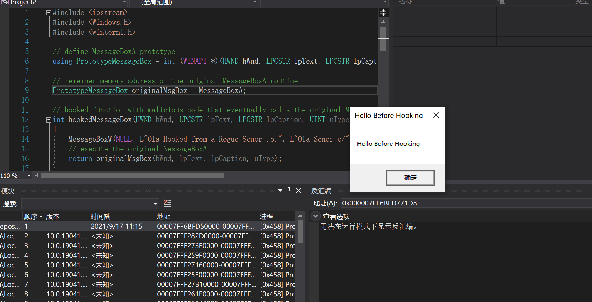


此时Trunk指针指向MessageBoxA的实际地址

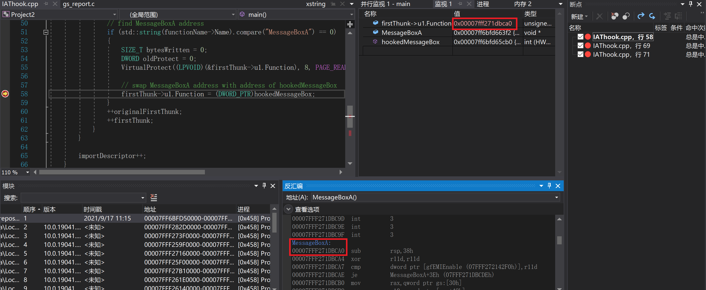

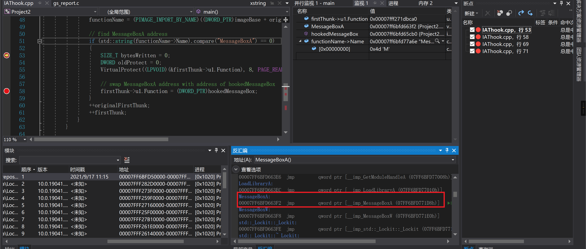

2.执行后指针指向hookedMessageBox，这里由于指针在满足hookedMessageBox之后仍然会继续轮询一段IAT，因此会发现程序执行完这个指针最后并不是正好处于HookedMessageBox位置，这里可以参考下图，抓取到的满足逻辑的时刻。

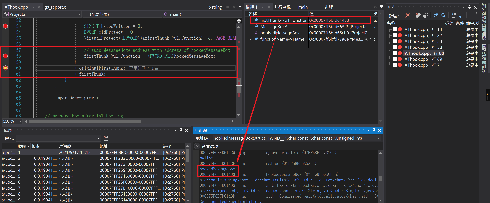

3.之后执行hookedMessageBox。

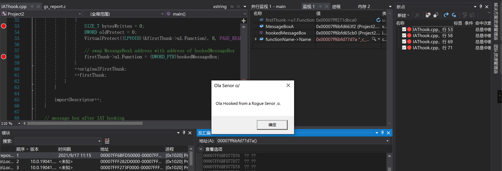

4.最后hook结束

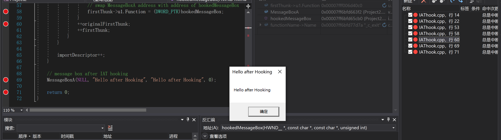


参考：

https://www.ired.team/offensive-security/code-injection-process-injection/import-adress-table-iat-hooking

https://tech-zealots.com/malware-analysis/journey-towards-import-address-table-of-an-executable-file/

### 实现inline hook


### 实现hotfix hook


### 实现ssdt hook


## 检测hook


### IAThook检测

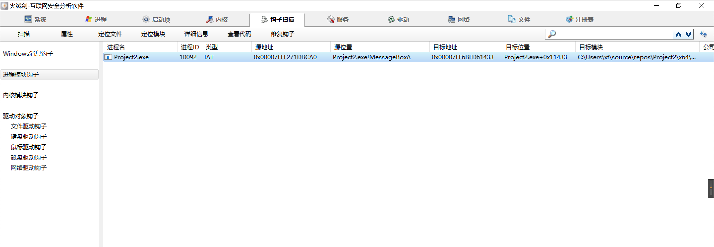

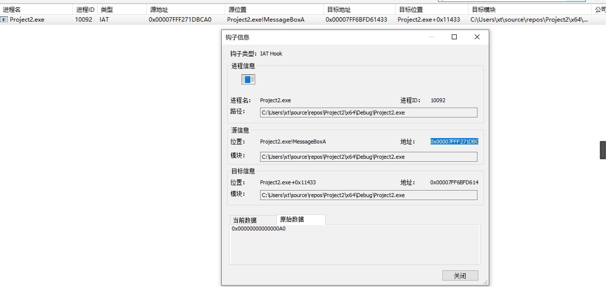

通过查看详情，可以看到钩子源MessageBoxA，目标已经挂在了HookedMessageBox上。


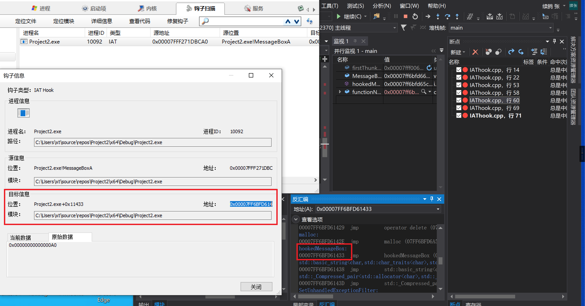

找到程序内存IAT双击进入程序内存位置。

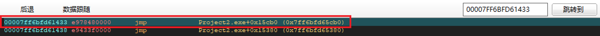

通过反汇编分析hook程序功能。

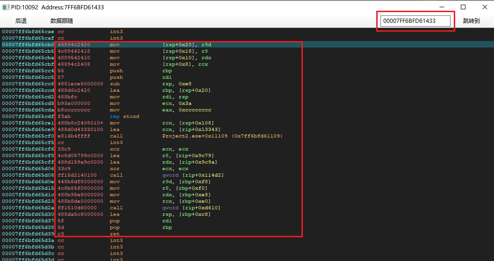


这里因为无法直接复制汇编，手工反汇编，因此需要借助dbg进行进一步分析，这里测试环境下我们选择重新VS运行不调试执行Ctrl+F5，然后附加dbg中，目标地址这次有所变化。

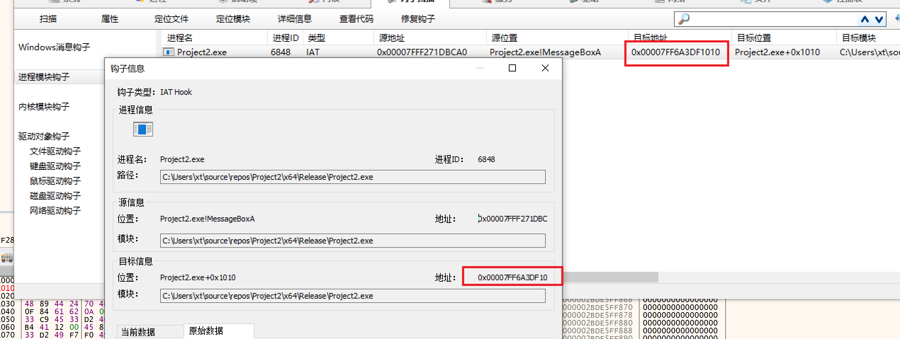

通过定位到内存中目标地址的内存情况。

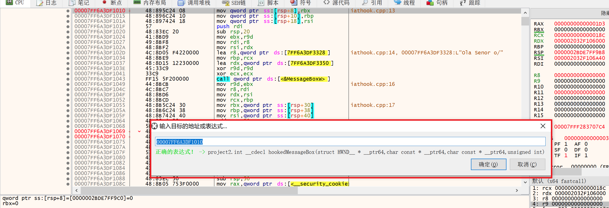

```
mov qword ptr ss:[rsp+8],rbx
mov qword ptr ss:[rsp+10],rbp
mov qword ptr ss:[rsp+18],rsi
push rdi
sub rsp,20
mov ebx,r9d
mov rdi,r8
mov rsi,rdx
lea r8,qword ptr ds:[7FF6A3DF3328]
mov rbp,rcx
lea rdx,qword ptr ds:[7FF6A3DF3350]
xor r9d,r9d
xor ecx,ecx
call qword ptr ds:[<&MessageBoxW>]
mov r9d,ebx
mov r8,rdi
mov rdx,rsi
mov rcx,rbp
mov rbx,qword ptr ss:[rsp+30]
mov rbp,qword ptr ss:[rsp+38]
mov rsi,qword ptr ss:[rsp+40]
add rsp,20
pop rdi
jmp qword ptr ds:[<int (__cdecl* __ptr64 originalMsgBox)(struct HWND__ * __ptr64,char const * __ptr64,char const * __ptr64,unsigned int)>]
mov qword ptr ss:[rsp+8],rbx
mov qword ptr ss:[rsp+10],rbp
mov qword ptr ss:[rsp+18],rsi
push rdi
push r12
push r13
push r14
push r15
sub rsp,50
```

这里另外一种方式通过，火绒剑的dump功能将钩子程序dump专项分析。

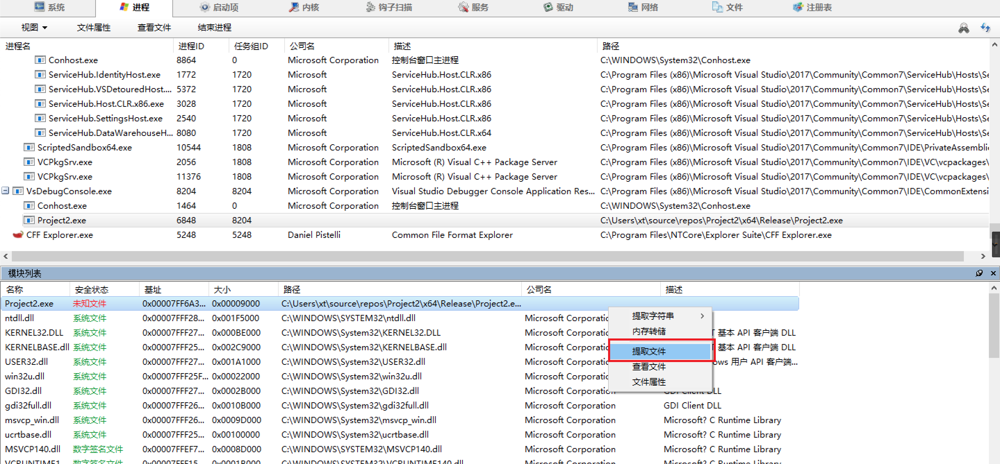


# linux下应用层和内核钩子检查
