# windows下防火墙规则检查

查询防火墙规则可以通过运行WF.msc，也可以通过netsh advfirewall 命令查询。

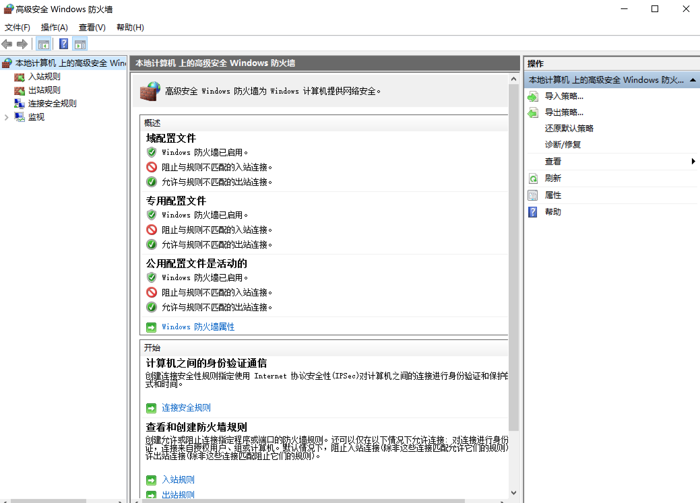

## netsh advfirewall

```
C:\Users\xt>netsh advfirewall ?
下列指令有效:

此上下文中的命令:
?              - 显示命令列表。
consec         - 更改到 `netsh advfirewall consec' 上下文。查询连接规则。
dump           - 显示一个配置脚本。
export         - 将当前策略导出到文件。
firewall       - 更改到 `netsh advfirewall firewall' 上下文。查询出入站规则。
help           - 显示命令列表。
import         - 将策略文件导入当前策略存储。
mainmode       - 更改到 `netsh advfirewall mainmode' 上下文。查询主模式规则。
monitor        - 更改到 `netsh advfirewall monitor' 上下文。查询防火墙状态信息。
reset          - 将策略重置为默认全新策略。
set            - 设置每个配置文件或全局设置。
show           - 显示配置文件或全局属性。

下列的子上下文可用:
 consec firewall mainmode monitor

若需要命令的更多帮助信息，请键入命令，接着是空格，
后面跟 ?。


show 此上下文中的命令:
show allprofiles - 显示所有配置文件的属性。
show currentprofile - 显示活动配置文件的属性。
show domainprofile - 显示域配置文件的属性。
show global    - 显示全局属性。
show privateprofile - 显示专用配置文件的属性。
show publicprofile - 显示公用配置文件的属性。
show store     - 显示当前交互式会话的策略存储。


C:\Users\xt>netsh advfirewall consec show rule

提供的许多参数无效。请查看帮助获取正确语法。

用法: show rule name=<string>
      [profile=public|private|domain|any[,...]]
      [type=dynamic|static (default=static)]
      [verbose]

注释:

      - 显示按名称识别的所有规则实例，
        也可按配置文件和类型识别。

示例:

      显示所有规则:
      netsh advfirewall consec show rule name=all

      显示所有动态规则:
      netsh advfirewall consec show rule name=all type=dynamic
      
      
C:\Users\xt>netsh advfirewall firewall /?

下列指令有效:

此上下文中的命令:
?              - 显示命令列表。
add            - 添加新入站或出站防火墙规则。
delete         - 删除所有匹配的防火墙规则。
dump           - 显示一个配置脚本。
help           - 显示命令列表。
set            - 为现有规则的属性设置新值。
show           - 显示指定的防火墙规则。


C:\Users\xt>netsh advfirewall mainmode /?

下列指令有效:

此上下文中的命令:
?              - 显示命令列表。
add            - 添加新的主模式规则。
delete         - 删除所有匹配的主模式规则。
dump           - 显示一个配置脚本。
help           - 显示命令列表。
set            - 为现有规则的属性设置新值。
show           - 显示指定的主模式规则。


C:\Users\xt>netsh advfirewall monitor show ?

下列指令有效:

此上下文中的命令:
show consec    - 显示当前 consec 状态信息。
show currentprofile - 显示当前活动的配置文件。
show firewall  - 显示当前防火墙状态信息。
show mainmode  - 显示当前主模式状态信息。
show mmsa      - 显示主模式 SA
show qmsa      - 显示快速模式 SA。
```


### 查询所有防火墙配置

```
netsh advfirewall show allprofiles  # 查询所有防火墙配置
```

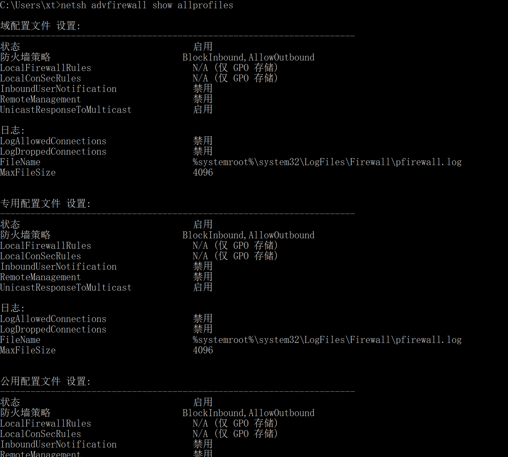

### 查询所有连接安全规则

```
# 管理员权限netsh
netsh> advfirewall consec show rule name=all
```

以创建的出入站请求身份验证连接安全规则为例，规则名称为test。

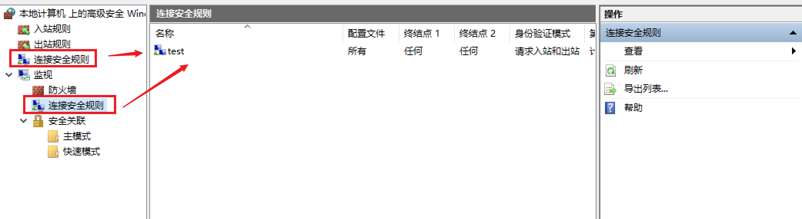

consec规则访问需要管理员权限，这里进入管理员cmd然后执行netsh> advfirewall consec show rule name=all进行查询。

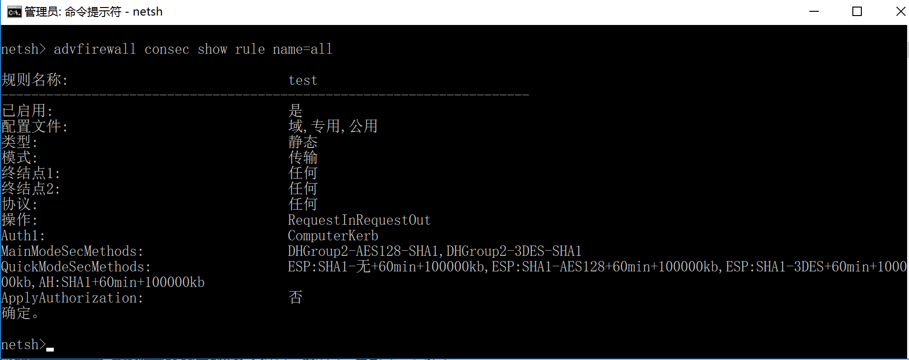


### 查询所有出入站规则

```
netsh advfirewall firewall show rule name=all # 查询所有出入站规则
```

举例这里创建一个名为9999portaccess规则的入站规则

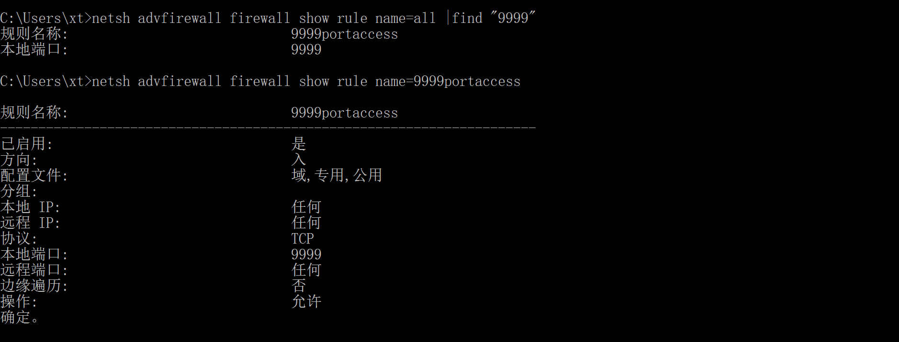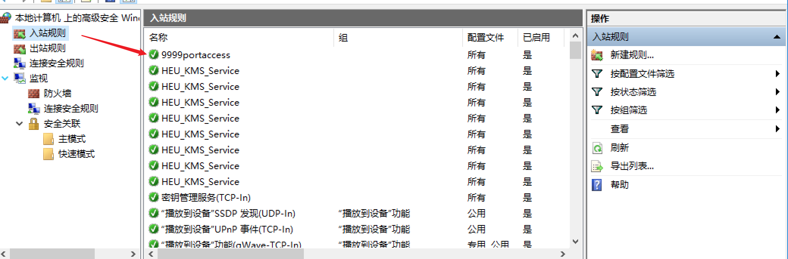

这里通过过滤和筛选定位入站规则


# linux下防火墙规则检查

## iptables

iptables是内核空间安全框架的命令行工具。iptables根据规则定义在PREROUTING、INPUT、FORWARD、OUTPUT、POSTROUTING链路上起到相应的作用。5个链路及其对应的表的对应关系如下图所示，这里引用朱双印的这个图形象的表示对应关系：


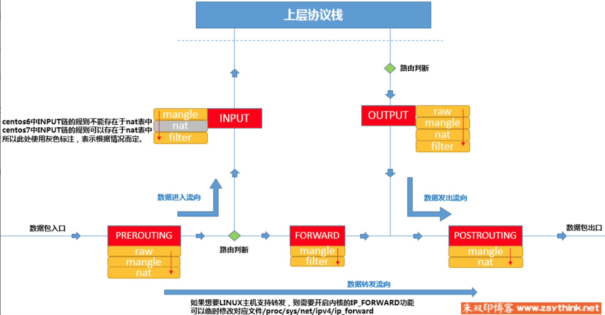

由于不同的链的规则有的存在重复，通过表的引用可以对相同功能的规则合集。根据功能大致可以分为四种表：

- **filter表**：负责过滤功能，防火墙；内核模块：iptables_filter
- **nat表**：network address translation，网络地址转换功能；内核模块：iptable_nat

- **mangle表**：拆解报文，做出修改，并重新封装 的功能；iptable_mangle
- **raw表**：关闭nat表上启用的连接追踪机制；iptable_raw


四种表的涉及的链的对应关系如下表，也同样参考朱双印总结的表格做理解：

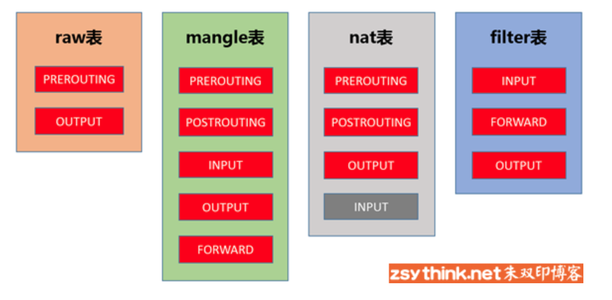


### 查询表中的规则

```
iptables -t raw -L  # 列出所有raw表中的所有规则
iptables -t mangle -L  # 列出mangle表中所有规则
iptables -t nat -L # 列出nat表中所有规则
iptables -t filter -L # 列出filter表中所有规则
```


### 查看不同的链中的规则

```
iptables -L INPUT  # 只看filter表中（默认-t 是filter表）input链的规则
iptables -vL INPUT  # 只看filter表中（默认-t 是filter表）input链的规则详情
iptables -nvL INPUT  # 只看filter表中（默认-t 是filter表）input链的规则详情，同时不对IP地址进行名称反解析，直接显示IP
iptables --line-number -nvL INPUT  # 只看filter表中（默认-t 是filter表）input链的规则详情，同时不对IP地址进行名称反解析，直接显示IP，每行加行标
```


IPTABLES规则中常见的动作有：ACCEPT（接受）、DROP（丢弃）、REJECT（拒绝）。


增删改举例不展开，详细参考可以看[IPTABLES规则管理增删改](https://www.zsythink.net/archives/1517)：

```
iptables -t filter -I INPUT -s 192.168.188.188 -j DROP # 丢弃所有来自192.168.188.188的入站报文
```

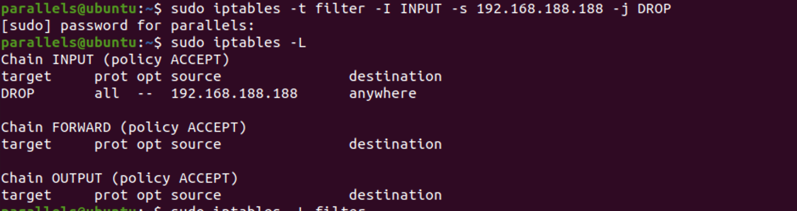

可以看到规则已经匹配到并拦截。

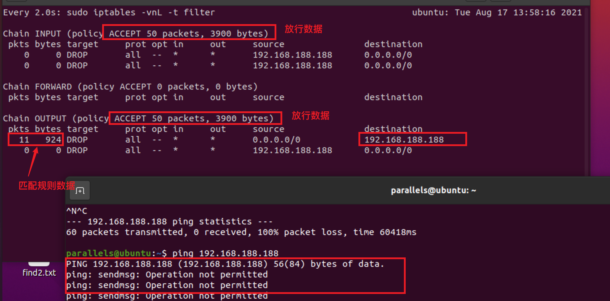

```
iptables -t filter -D INPUT 1  # 删除入站规则中重复的一条
```

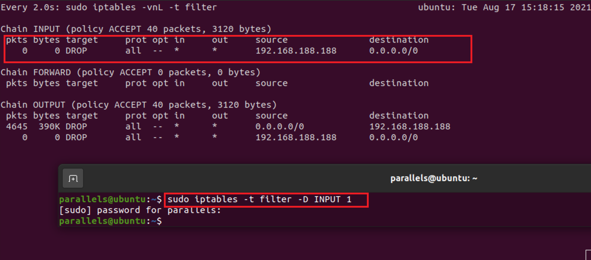

```
iptables -t filter -R INPUT 1 -d 192.168.188.188 -j REJECT  # 修改入站规则
```

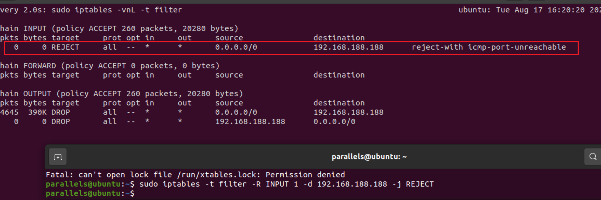

参考：

IPTABLES基础 https://www.zsythink.net/archives/1199

IPTABLES规则管理增删改 https://www.zsythink.net/archives/1517


## nftables

nftables[官方网站](http://www.iptables.org/)，从linux内核>=3.13开始，iptables将改为nftables，但仍然存在兼容iptables。参考[what is nftables](https://wiki.nftables.org/wiki-nftables/index.php/What_is_nftables%3F)。


### 相对于iptables的优点

1. 在 `iptables` 中添加一条规则，会随着规则数量增多而变得非常慢。这种状况对 `nftables` 而言就不存在了，因为 `nftables` 使用原子的快速操作来更新规则集合。
2. 使用 `iptables` 时，每一个匹配或投递都需要内核模块的支持。因此，如果你忘记一些东西或者要添加新的功能时都需要重新编译内核。而在 `nftables` 中就不存在这种情况了， 因为在 `nftables` 中，大部分工作是在用户态完成的，内核只知道一些基本指令（过滤是用伪状态机实现的）。例如，`icmpv6` 支持是通过 `nft` 工具的一个简单的补丁实现的，而在 `iptables` 中这种类型的更改需要内核和 `iptables` 都升级才可以。


### 查看nftables的规则汇总

```
nft list tables [<family>]
nft list table [<family>] <name> [-n] [-a]
nft list tables  # 列出所有表
nft list table family table # 列出指定表中的所有链和规则
nft list table inet filter # 要列出inet簇中f
nft list chain family table chain  # 列出一个链中的所有规则
nft list chain inet filter output  # 要列出inet中filter表的output链中的所有规则
```

### nftables的表管理

与 `iptables` 中的表不同，`nftables` 中没有内置表。表的数量和名称由用户决定。每个表只有一个地址簇，并且只适用于该簇的数据包。`nftables` 表可以指定为以下五个簇中的一个：


| nftables 簇 | 对应 iptables 的命令行工具 |
| ----------- | -------------------------- |
| ip          | iptables                   |
| ip6         | ip6tables                  |
| inet        | iptables 和 ip6tables      |
| arp         | arptables                  |
| bridge      | ebtables                   |


`ip`（即 IPv4）是默认簇，如果未指定簇，则使用该簇。如果要创建同时适用于 `IPv4` 和 `IPv6` 的规则，请使用 `inet` 簇 。`inet` 允许统一 `ip` 和 `ip6` 簇，以便更容易地定义规则。


*注意:* `inet` *不能用于* `nat` *类型的链，只能用于* `filter` *类型的链。*


下面我们来看看 `nftables` 是如何进行表管理操作的，以下为 `nftables` 创建表的基本命令语法。


```
nft list tables [<family>]
nft list table [<family>] <name> [-n] [-a]
nft (add | delete | flush) table [<family>] <name>
```


#### nft表管理

```
nft add table family table  # 创建一个新的表
nft list tables  # 列出所有表
nft list table family table # 列出指定表中的所有链和规则
nft list table inet filter # 要列出inet簇中filter表中的所有规则
nft delete table family table  # 删除一个表
nft flush table family table # 要清空一个表中的所有规则
```

##### 

### nftables的链管理

#### nft链管理

```
nft add chain family table chain   # 将名为chain的常规链添加到名为table的表中
nft add chain inet filter tcpchain   #例如，将名为tcpchain的常规链添加到inet簇中名为filter的表中
nft add chain family table chain { type type hook hook priority priority \; }   # 添加基本链，需要指定钩子和优先级值
nft list chain family table chain  # 列出一个链中的所有规则
nft list chain inet filter output  # 要列出inet中filter表的output链中的所有规则
nft chain family table chain { [ type type hook hook device device priority priority \; policy <policy> \; ] }  # 要编辑一个链，只需按名称调用并定义要更改的规则
nft chain inet filter input { policy drop \; }   # 将默认表中的input链策略从accept更改为drop
nft delete chain family table chain # 删除一个链,要删除的链不能包含任何规则或者跳转目标。
nft flush chain family table chain # 清空一个链的规则
```


`*type*`可以是`filter`、`route`或者`nat`。

IPv4/IPv6/Inet地址簇中，`*hook*`可以是`prerouting`、`input`、`forward`、`output`或者`postrouting`。其他地址簇中的钩子列表请参见[nft(8)](https://man.archlinux.org/man/nft.8)。

`*priority*`采用整数值。数字较小的链优先处理，并且可以是负数。[[3\]](https://wiki.nftables.org/wiki-nftables/index.php/Configuring_chains#Base_chain_types)

例如，添加筛选输入数据包的基本链：

\# nft add chain inet filter input { type filter hook input priority 0\; }


将上面命令中的`add`替换为`create`则可以添加一个新的链，但如果链已经存在，则返回错误。


##### 

### nftables规则管理

#### 添加规则

```
nft add rule family table chain handle handle statement  # 将一条规则添加到链中
nft insert rule family table chain handle handle statement # 将规则插入到指定位置,如果未指定handle，则规则插入到链的开头。
```

#### 表达式

通常情况下，`*statement*`包含一些要匹配的表达式，然后是判断语句。结论语句包括`accept`、`drop`、`queue`、`continue`、`return`、`jump *chain*`和`goto *chain*`。也可能是其他陈述。有关信息信息，请参阅[nft(8)](https://man.archlinux.org/man/nft.8)。


nftables中有多种可用的表达式，并且在大多数情况下，与iptables的对应项一致。最明显的区别是没有一般或隐式匹配。一般匹配是始终可用的匹配，如`--protocol`或`--source`。隐式匹配是用于特定协议的匹配，如TCP数据包的`--sport`。


以下是可用匹配的部分列表：

- meta （元属性，如接口）
- icmp （ICMP协议）

- icmpv6 （ICMPv6协议）
- ip （IP协议）

- ip6 （IPv6协议）
- tcp （TCP协议）

- udp （UDP协议）
- sctp （SCTP协议）

- ct （链接跟踪）


完整列表请参见[nft(8)](https://man.archlinux.org/man/nft.8)


##### 删除规则

```
# 下面命令确定一个规则的句柄，然后删除。--number参数用于查看数字输出，如未解析的IP地址。
# nft --handle --numeric list chain inet filter input
table ip fltrTable {
     chain input {
          type filter hook input priority 0;
          ip saddr 127.0.0.1 accept # handle 10
     }
}

nft delete rule inet fltrTable input handle 10 


# 可以用nft flush table命令清空表中的所有的链。可以用nft flush chain或者nft delete rule命令清空单个链。
# 第一个命令清空foo表中的所有链。第二个命令清空ip foo表中的bar链。第三个命令删除ip6 foo表bar两种的所有规则。
nft flush table foo
nft flush chain foo bar
nft delete rule ip6 foo bar
```

#### 自动重载

```
清空当前规则集：

# echo "flush ruleset" > /tmp/nftables 
导出当前规则集：

# nft list ruleset >> /tmp/nftables
可以直接修改/tmp/nftables文件，使更改生效则运行：

# nft -f /tmp/nftables
```


参考：

https://www.hi-linux.com/posts/29206.html


