---
title: "Mobsf_MAC_AVD_Android动静态环境搭建排坑实战"
menu: 
  main: 
    parent: "安卓样本分析"
--- 

关于Mobsf一直没有看到比较全面的实战的教程或者最佳实践发出来，由于目前手头有的MAC+Android Studio，加上最近任务，就想组个动态分析本地可复用的虚拟环境，这里记录了下搭建过程，并给出了最近的任务动态分析结果。测试下来效果还不错，因为Mobsf在git上的维护还比较频繁觉得算是个不错的辅助工具。

 

 测试设备的一些简单信息摘要：

 MAC x86_64

 Android Studio AVD 安卓模拟器

 安卓版本Nexus_5X_API_26_64_api

 

 # Mobsf环境要求

 ## 静态分析要求

 

 -  **Mac** 

 - -  安装 [Git](https://www.atlassian.com/git/tutorials/install-git) 
   -  安装 [Python **3.8-3.9**](https://www.python.org/) 

 - -  After installing Python 3.8+, go to `/Applications/Python 3.8/` and run `Update Shell Profile.command` and `Install Certificates.command` 
   -  安装 [JDK 8+](https://www3.ntu.edu.sg/home/ehchua/programming/howto/JDK_Howto.html) 

 - -  安装命令行工具 `xcode-select --install` 
   -  下载和安装 [wkhtmltopdf](https://wkhtmltopdf.org/downloads.html) 按照 [WIKI操作指南](https://github.com/JazzCore/python-pdfkit/wiki/Installing-wkhtmltopdf) 

 - -  macOS Mojave 用户, 请安装 headers（如果可用）： 

 

 ```
 sudo installer -pkg /Library/Developer/CommandLineTools/Packages/macOS_SDK_headers_for_macOS_10.14.pkg -target /Copy to clipboardErrorCopied
 ```

 

 -  Windows App静态分析需要Mac和Linux的Windows主机或Windows VM。 [更多信息](https://github.com/MobSF/Mobile-Security-Framework-MobSF/blob/master/mobsf/install/windows/readme.md) 
 -  **操作指南**: 

 - -  安装 Git `sudo apt-get install git` 
   -  安装 Python **3.8-3.9** `sudo apt-get install python3.8` 

 - -  安装 JDK 8+ `sudo apt-get install openjdk-8-jdk` 
   -  安装以下依赖项 

 

 ```
 sudo apt install python3-dev python3-venv python3-pip build-essential libffi-dev libssl-dev libxml2-dev libxslt1-dev libjpeg8-dev zlib1g-dev wkhtmltopdfCopy to clipboardErrorCopied
 ```

 

 -  Windows App静态分析需要Mac和Linux的Windows主机或Windows VM。 [更多信息](https://github.com/MobSF/Mobile-Security-Framework-MobSF/blob/master/mobsf/install/windows/readme.md) 
 -  **Windows** 

 - - 安装 [Git](https://git-scm.com/download/win)
   - 安装 [Python **3.8-3.9**](https://www.python.org/)

 - - 安装 [JDK 8+](https://www3.ntu.edu.sg/home/ehchua/programming/howto/JDK_Howto.html)
   - 安装 [Microsoft Visual C++ Build Tools](https://visualstudio.microsoft.com/thank-you-downloading-visual-studio/?sku=BuildTools&rel=16)

 - - 安装 [OpenSSL (non-light)](https://slproweb.com/products/Win32OpenSSL.html)
   - 下载和安装 [wkhtmltopdf](https://wkhtmltopdf.org/downloads.html) as per the [WIKI操作指南](https://github.com/JazzCore/python-pdfkit/wiki/Installing-wkhtmltopdf)

 - - 将包含 `wkhtmltopdf` 二进制文件的文件夹添加到环境变量PATH。

 

 ## 动态分析要求

 

 - **如果您使用MobSF docker容器或在虚拟机中设置MobSF，则动态分析将不起作用。**
 - 安装 [Genymotion](https://www.genymotion.com/fun-zone/) 或者 [Android Studio Emulator](https://developer.android.com/studio)

 

 # 安装

 ## [Linux/Mac](https://mobsf.github.io/docs/#/zh-cn/installation?id=linuxmac)

 

 ```
 git clone https://github.com/MobSF/Mobile-Security-Framework-MobSF.git
 cd Mobile-Security-Framework-MobSF
 ./setup.shCopy to clipboardErrorCopied
 ```

 

 # 运行MobSF

 

 ## [Linux/Mac](https://mobsf.github.io/docs/#/zh-cn/running?id=linuxmac)

 

 ```
 ./run.sh 127.0.0.1:8000
 ```

 

 注意：
 MobSF动态分析需要满足的条件：
 • Genymotion Android VM version 4.1 - 10.0 (x86, upto API 29)
 • Android Emulator AVD (non production) version 5.0 - 9.0 (arm, arm64, x86, and x86_64 upto API 28)

 

 https://mobsf.github.io/docs/#/zh-cn/installation

 

 /Users/[your_name]/Library/Android/sdk/tools/emulator
 emulator -avd Nexus_5X_API_28 -writable-system

 

 # 配置动态分析

 

 MobSF动态分析需要满足的条件：
 • Genymotion Android VM version 4.1 - 10.0 (x86, upto API 29)
 • Android Emulator AVD (non production) version 5.0 - 9.0 (arm, arm64, x86, and x86_64 upto API 28)

 

 这里使用的是Android Emulator AVD，安卓8.0+86x64+api版
 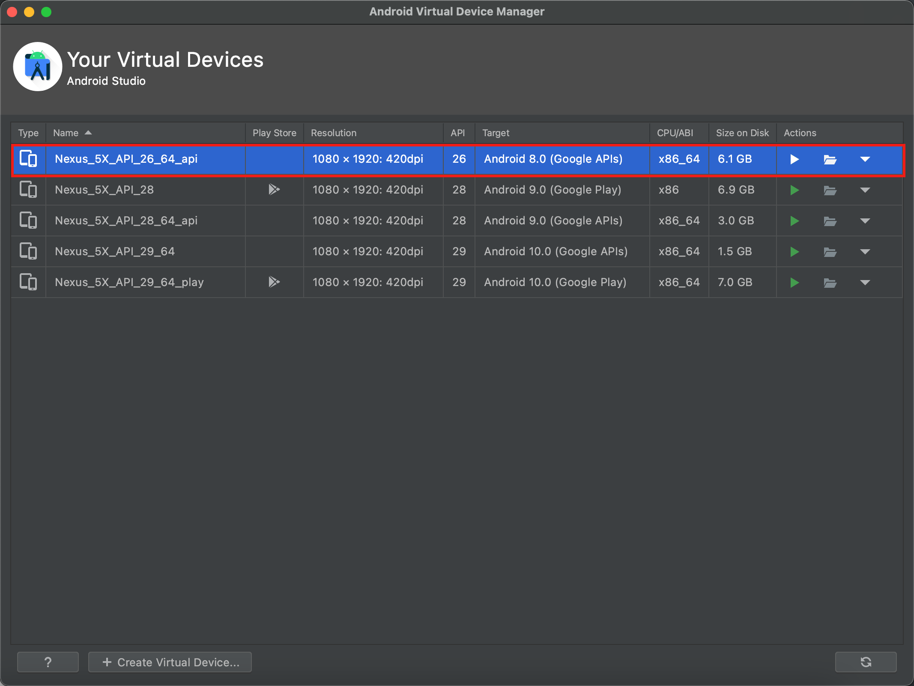

 

 这里根据自己的机器进行选择，测试主机机使用的mac x86架构，为了规避动态调试高版本安卓需要关闭OEM，Android Studio的AVD系统中找不到关闭OEM的尴尬处境，最终选择了安卓9以下的适配版本。如果你也用的AVD，建议直接使用8.0，防止remount failed问题找不到OEM关闭导致环境失败问题。

 

 确定好avd之后，更新mobsf配置，这里我的avd模拟器名为emulator-5554

 

 ```
 # =======ANDROID DYNAMIC ANALYSIS SETTINGS===========
 ANALYZER_IDENTIFIER = 'emulator-5554'
 FRIDA_TIMEOUT = 4
 ```

 

 这里的原理可以通过下面这个命令理解，他是通过adb -s 指定devicename的。ANALYZER_IDENTIFIER也就是使用adb devices中的内容即可。

 

 ```
 '['/Users/xt/Library/Android/sdk/platform-tools/adb', '-s', 'emulator-5554', 'shell', 'pm', 'list', 'packages', '-f', '-3']'
 ```

 

 查看自己的device name

 

 ```
 ╭─xt@MacBook-Pro ~/Downloads/data 
 ╰─$ adb devices
 List of devices attached
 emulator-5554	device
 ```

 

 ## 创建模拟器恢复点

 

 需要创建用于后续恢复的还原点，这里需要准备frida-server用于动态调试。这里官方的原文说明中没有给出，因此我们总结如下 ：

 

 1.  下载frida-server
    参考：https://github.com/frida/frida/releases
    如果是在mac x86架构64位下面使用模拟器进行调试，下载frida-server-x.x.x-android-x86_64，如果是使用实体手机进行运行的话，下载frida-server-x.x.x-android-arm，根据测试时间使用的最新版本以及适配的类型，我这选择frida-server-15.1.4-android-x86_64下载。 
 2.  adb push到模拟器中 

 

 ```
  cd ~/Downloads # 到存放frida-server-15.1.4-android-x86_64解压完成的目录下
  adb root
  adb push frida-server-15.1.4-android-x86_64 /data/local/tmp/ 
 frida-server-15.1.4-android-x86_64: 1 ... 118.1 MB/s (97874840 bytes in 0.790s)
 # 修改frida-server权限，并且在后台开启启用
  chmod 777 frida-server-15.1.4-android-x86_64
  nohup ./frida-server-15.1.4-android-x86_64  &   # 在后台运行frida-server服务
 ```

 

 环境布置完，拍摄快照用于保存环境情况：

 

 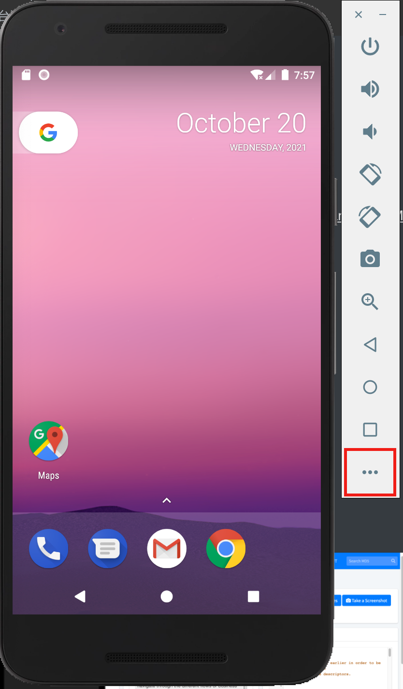

 

 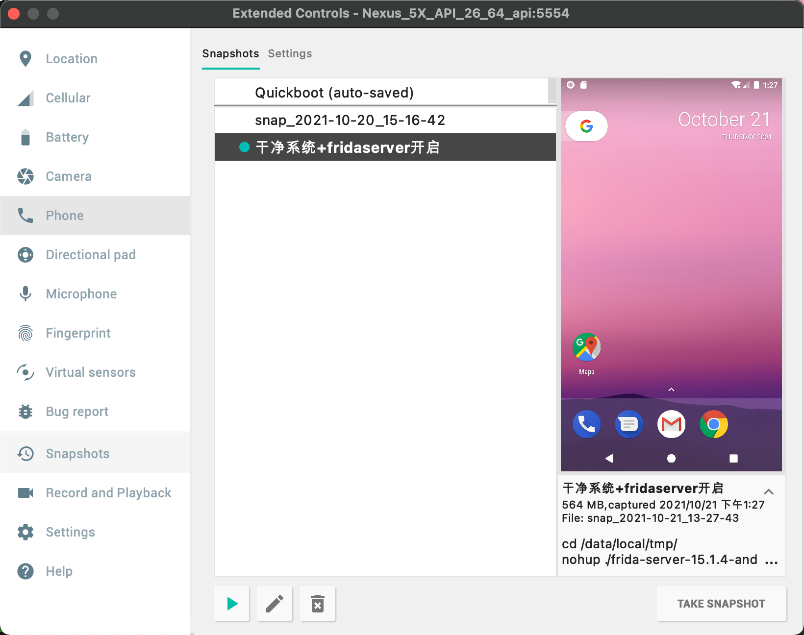

 

 相关链接：
 mobsf frida错误https://github.com/MobSF/Mobile-Security-Framework-MobSF/issues/1828
 mac安装frida-serverhttps://www.jianshu.com/p/15a4bf14d0a5

 

 ## 启动模拟器

 

 AVD环境准备好后，启动模拟器，这里需要注意找到本地模拟器位置，~/Library/Android/sdk/emulator ，还要使用可写模式启动：

 

 ```
 ╭─xt@MacBook-Pro ~/Library/Android/sdk/emulator 
 ╰─$ emulator -avd Nexus_5X_API_26_64_api -writable-system
 ```

 

 一句话开启模拟器环境+可写模式+不保存模式，但是由于无法拍照会经常崩溃，而且经常我的快照收到影响，这里不推荐，只能算提一下思路。

 

 ```
 emulator -avd Nexus_5X_API_26_64_api -no-snapshot-save -writable-system -snapshot 干净系统+fridaserver开启
 ```

 

 ## 运行测试动态分析

 

 1.  设置代理，这里直接使用的是我本地的SSR
    export http_proxy=127.0.0.1:1087
    export https_proxy=127.0.0.1:1087 
 2.  运行mobsf
    mobsf 127.0.0.1:8000 

 1.  进入动态分析
    点击dynamic进入动态分析界面
    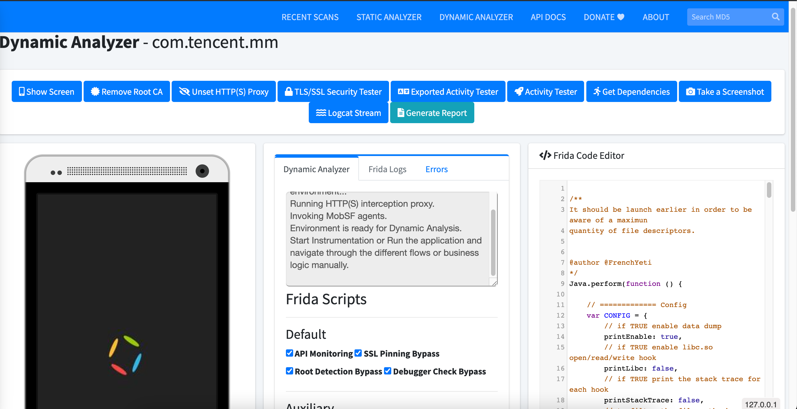
    同时check终端，一切正常
    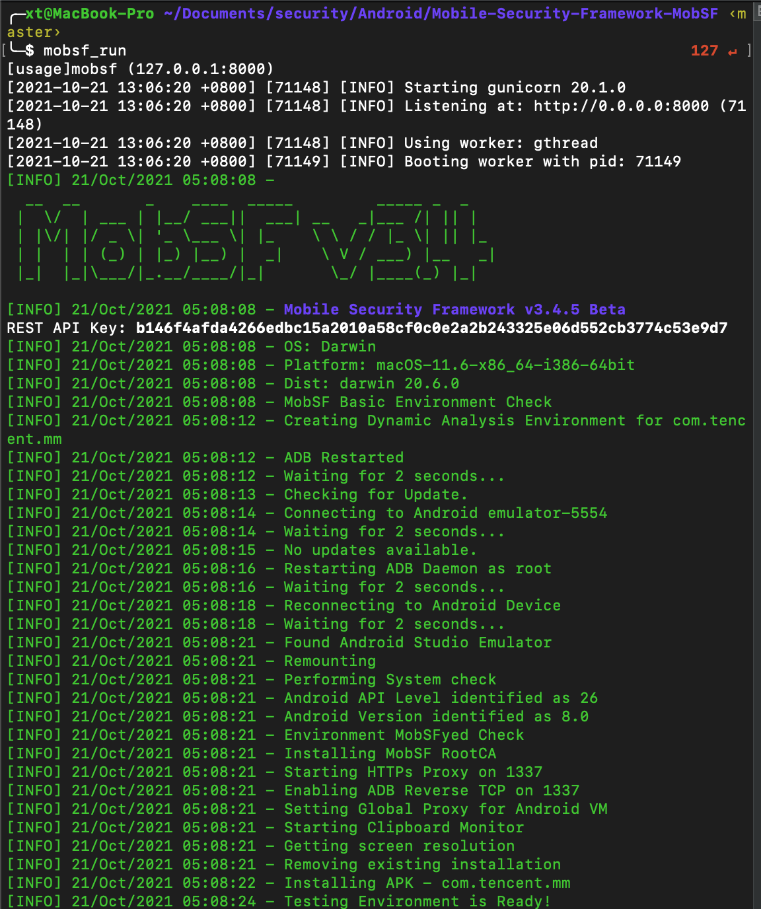 
 2.  配置完成
    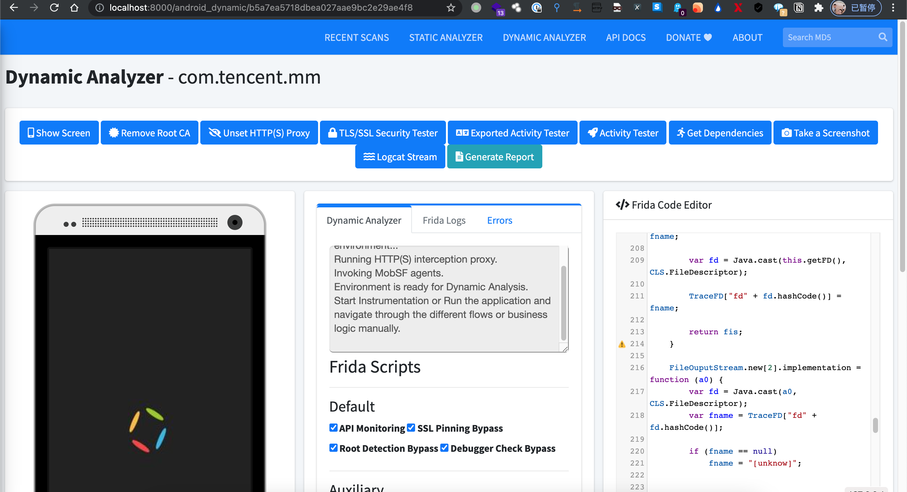 

 1.  在开始动态分析之前，开启frida-server，由于每次进入动态分析界面，mobsf会自动重启adb环境，因此这里需要重新载入前面配置好的frida-server镜像。或者手动进入adb shell启动frida-server即可。
     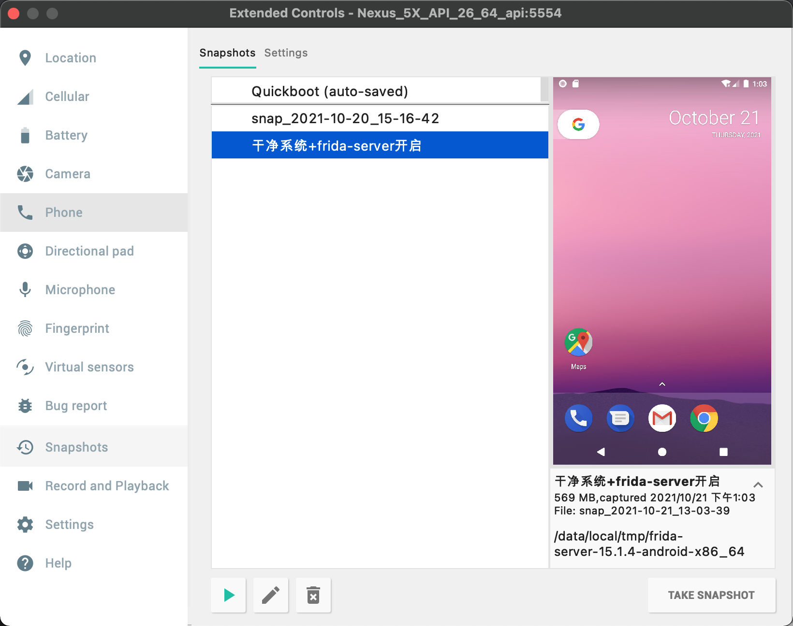
 2.  点击start instrumentation 即可动态分析 

 

 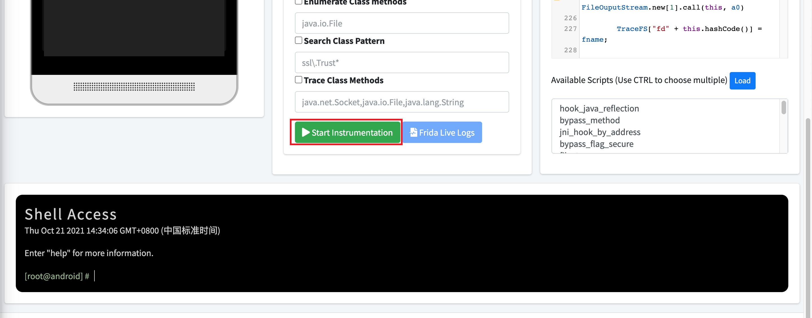

 

 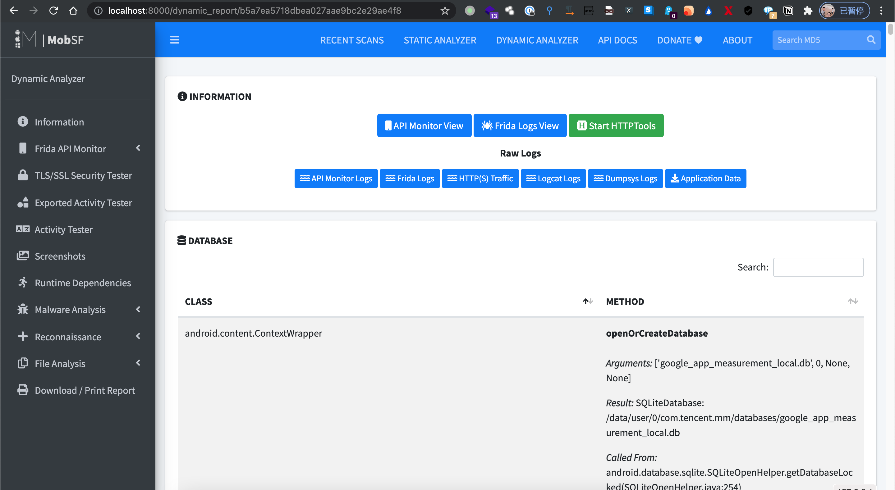

 

 检测正常、导出功能正常

 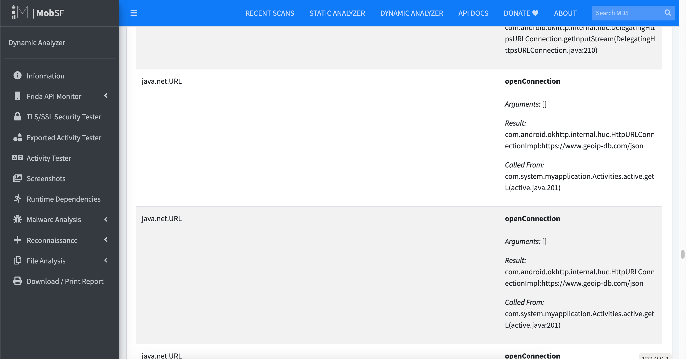

 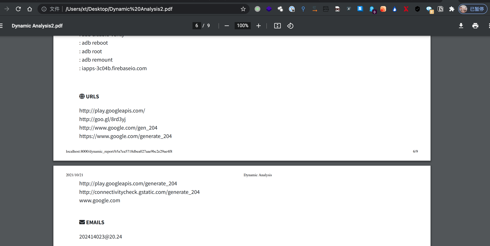

 

 

 

 ## 排坑

 

 问题：“MobSF cannot find android instance identifier. Make sure that an android instance is running and refresh this page.
 If this error persists, Please set ANALYZER_IDENTIFIER in /Users/xt/.MobSF/config.py or via environment variable ANALYZER_IDENTIFIER.”

 

 问题：

 

 ```
 VM's /system is not writable. This VM cannot be used for Dynamic Analysis.
 [ERROR] 20/Oct/2021 05:27:51 - Please start the AVD as per MobSF documentation!
 raise CalledProcessError(retcode, process.args,
 subprocess.CalledProcessError: Command '['/Users/xt/Library/Android/sdk/platform-tools/adb', '-s', 'emulator-5554', 'shell', 'pm', 'list', 'packages', '-f', '-3']' returned non-zero exit status 1.
 ```

 

 解决：
 目前（使用 Build Tools v26，如果 Google 没有像他们那样经常更改内容），如果您-writable-system在从命令行启动模拟器时使用该指令，它将允许/system通过重新启动持久化分区。也就是说，您将能够写入/system分区，如果您重新启动，更改仍将保留。
 emulator -avd <AVD_NAME -writable-system
 这也将您对qcow2图像文件的更改通常保存在.android/avd/<AVD_NAME.avd/system.img.qcow2
 您甚至可以复制此system.img.qcow2文件，使用-wipe-data指令从 AVD 中擦除数据，将此文件放回目录中，重新启动，您最初所做的系统更改仍将保留。（警告：至少现在，因为谷歌一直在改变事物）
 参考：https://stackoverflow.com/questions/15417105/forcing-the-android-emulator-to-store-changes-to-system

 

 问题：

 

 ```
 ╰─$ emulator -avd Nexus_5X_API_26_64_api -writable-system           
 [4710067712]:ERROR:android/android-emu/android/qt/qt_setup.cpp:28:Qt library not found at ../emulator/lib64/qt/lib
 Could not launch '/Users/xt/Library/Android/sdk/../emulator/qemu/darwin-x86_64/qemu-system-x86_64': No such file or directory
 ```

 

 解决：

 

 1. 关闭模拟器
 2. cd ~/Library/Android/sdk/emulator

 1. emulator -avd Nexus_5X_API_26_64_api -writable-system
 2. 顺利启动了

 

 问题：
 Cannot download frida-server binary. You will need frida-server-15.0.8-android-x86_64 in /Users/xt/.MobSF/downloads/ for Dynamic Analysis to work
 解决过程：

 

 1. 重新安装frida
    参考：https://www.jianshu.com/p/15a4bf14d0a5
 2. adb push
    adb push frida-server-15.1.4-android-x86_64 /data/local/tmp/
    frida-server-15.1.4-android-x86_64: 1 ... 118.1 MB/s (97874840 bytes in 0.790s)

 

 (实体机一般frida-server-15.1.4-android-arm64，模拟器一般frida-server-15.1.4-android-x86_64，我这里使用的mac是x86架构64位的)

 

 chmod u+x frida-server-15.1.4-android-x86_64
 ./frida-server-15.1.4-android-x86_64

 

 问题：
 remount of the / superblock failed: Permission denied
 解决：
 adb root
 adb disable-verity
 adb reboot
 adb root
 adb remount
 参考：https://blog.csdn.net/qq_43804080/article/details/102586939

 

 问题：remount of the / superblock failed: Permission denied
 remount failed
 解决：
 关闭OEM
 然后再执行
 adb root
 adb disable-verity
 adb reboot
 adb root
 adb remount

 

 问题：
 requests.exceptions.ReadTimeout: HTTPSConnectionPool(host='raw.githubusercontent.com', port=443): Read timed out. (read timeout=3)
 解决：
 挂代理、模拟器挂代理

 

 mobsf参考：
 http://purpleroc.com/MD/2016-08-31@Android Malware Analysis Tool(1)--MobSF.html

 

 问题：adb的一些坑

 

 adb shell

 

 error: more than one device and emulator

 

 adb devices
 adb shell -s 

 

 如果实际上只有一个设备或模拟器，并且查到有offline的状态；那就说明是ADB本身的BUG所导致的，就需要用如下的方法处理下了：

 

 adb kill-server
 taskkill /f /im adb

 

 第一条命令是杀ADB的服务，第二条命令是杀ADB的进程！
 如果第一条没有用，才考虑用第二条命令再试试看的！