## 9. 恶意软件的混淆技术

混淆一词指的是掩盖有意义信息的过程。恶意软件作者经常使用各种混淆技术来隐藏信息，并修改恶意内容，使安全分析人员难以发现和分析。敌方通常使用编码/加密技术来掩盖安全产品的信息。除了使用编码/加密，攻击者还使用打包器等程序来混淆恶意二进制内容，这使得分析和逆向工程更加困难。在本章中，我们将研究如何识别这些混淆技术，以及如何解码/解密和解压恶意二进制文件。我们将首先看一下编码/加密技术，随后我们将看一下解包技术。

攻击者通常出于以下原因使用编码和加密。

* 掩盖命令和控制通信
* 隐藏基于签名的解决方案，如入侵防御系统 隐藏恶意软件所使用的配置文件的内容
* 加密从受害者系统中传出的信息
* 混淆恶意二进制文件中的字符串，以躲避静态分析

在我们深入研究恶意软件如何使用加密算法之前，让我们试着了解一下本章将使用的基本知识和一些术语。明文是指未加密的信息；这可能是命令和控制（C2）流量或恶意软件想要加密的文件内容。加密文本指的是加密信息；这可能是恶意软件从C2服务器收到的加密的可执行文件或加密命令。

恶意软件对明文进行加密，将明文与密钥一起作为输入传递给加密函数，从而产生一个密码文本。由此产生的密码文本通常被恶意软件用来写入文件或通过网络发送。

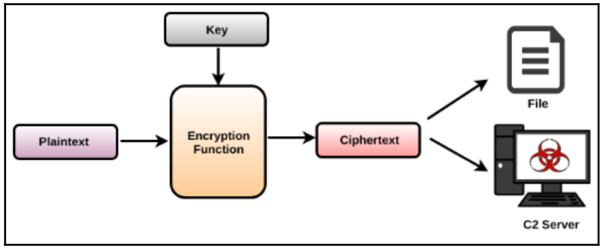

以同样的方式，恶意软件可以从C2服务器或文件中接收加密的内容，然后通过将加密的内容和密钥传递给解密功能来解密，如下所示。

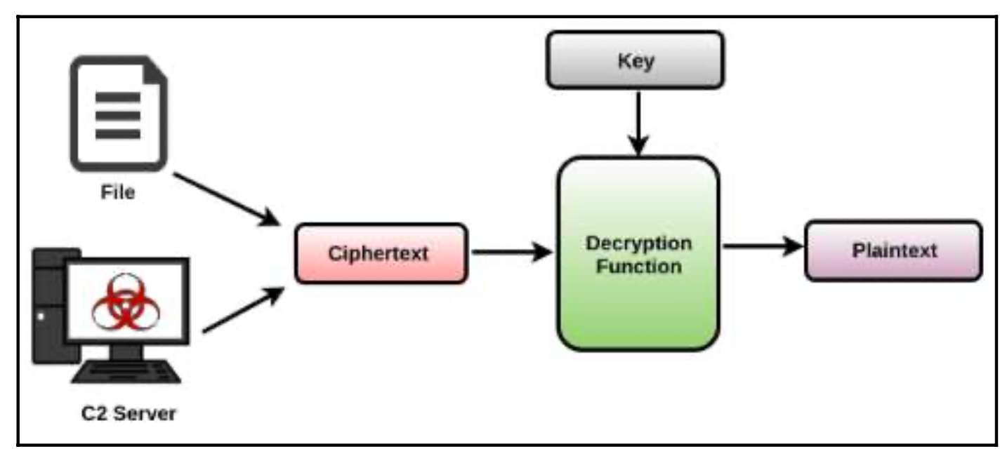

在分析恶意软件时，你可能想了解某个特定内容是如何被加密或解密的。要做到这一点，你将主要关注识别加密或解密功能以及用于加密或解密内容的密钥。例如，如果你想确定网络内容是如何被加密的，那么你可能会在网络输出操作（如HttpSendRequest()）之前找到加密函数。以同样的方式，如果你想知道C2的加密内容是如何被解密的，那么你很可能在使用诸如InternetReadFile()这样的API从C2检索到内容后找到解密函数。

一旦确定了加密/解密功能，检查这些功能将使你了解内容是如何加密/解密的，使用的密钥，以及用于混淆数据的算法。

### 1. 简单编码

大多数时候，攻击者使用非常简单的编码算法，如Base64编码或xor加密来掩盖数据。攻击者之所以使用简单的算法，是因为它们容易实现，占用较少的系统资源，而且刚好可以掩盖安全产品和安全分析人员分析的内容。

#### 1.1 凯撒密码

凯撒密码，也被称为移位密码，是一种传统的密码，是最简单的编码技术之一。它通过将明文中的每个字母在字母表中下移一些固定的位置来对信息进行编码。例如，如果你将字符 "A "向下移动3个位置，那么你将得到 "D"，而 "B "将是 "E"，以此类推，当移动到 "X "时，将包裹回 "A"。

##### 1.1.1 凯撒密码的工作原理

理解凯撒密码的最好方法是写下从A到Z的字母，并给这些字母分配一个索引，从0到25，如下所示换句话说，'A'对应于索引0，'B'对应于索引1，以此类推。一组从A到Z的所有字母被称为字符集。

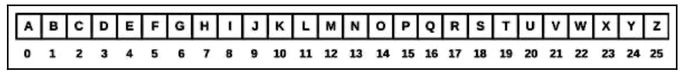

现在，让我们假设你想把字母转移三个位置，那么3就成了你的密钥。为了加密字母'A'，将字母A的索引，即0，加到钥匙3上；这样的结果是0+3=3。现在用结果3作为索引，找到相应的字母，也就是'D'，这样'A'就被加密成'D'了。为了加密'B'，你将把'B'的索引（1）加到钥匙3上，结果是4，索引4与'E'有关，所以'B'加密为'E'，以此类推。

这种技术的问题出现在我们到达'X'的时候，它的索引是23。当我们将23+3相加时，我们得到26，但我们知道没有与索引26相关的字符，因为最大索引值是25。我们还知道，索引26应该绕回索引0（与'A'相关）。为了解决这个问题，我们用字符集的长度进行模数运算。在这种情况下，字符集ABCDEFGHIJKLMNOPQRSTUVWXYZ的长度是26。现在，为了加密'X'，我们使用'X'的索引（23）并将其添加到密钥（3）中，然后对字符集的长度（26）进行模数运算（也就是26=0(mod26)），如下所示。这个操作的结果是0，它被用作索引来寻找相应的字符，也就是'A'。

```
(23+3)%26 = 0
```

模数操作允许你循环回到开头。你可以用同样的逻辑来加密字符集中的所有字符（从A到Z），并绕回起点。在凯撒密码中，你可以用以下方法获得被加密（密文）字符的索引。

```
(i + key) % (length of the character set 字符串长度)
where i = index of plaintext character 明文字符串索引
```

以同样的方式，你可以用以下方式获得明文（解密）字符的索引。

```
(j - key) % (length of the character set)
where j = index of ciphertext character
```

下图显示了字符集、加密和以3为密钥的文本 "ZEUS "的解密（移动三个位置）。加密后，文本 "ZEUS "被翻译成 "CHXV"，然后解密又将其翻译成 "ZEUS"。

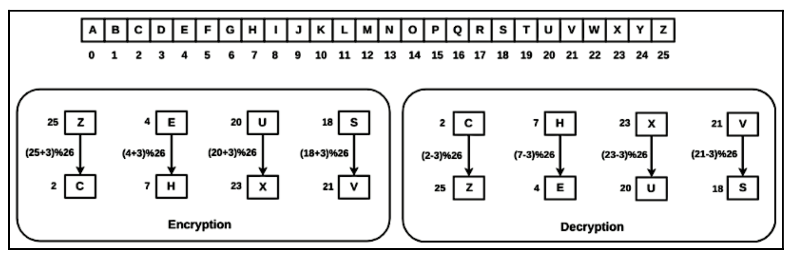

##### 1.1.2 用Python解密凯撒密码

下面是一个简单的Python脚本的例子，它将字符串 "CHXV "解密为 "ZEUS"。

```
>>> chr_set = "ABCDEFGHIJKLMNOPQRSTUVWXYZ" >>> key = 3
>>> cipher_text = "CHXV"
>>> plain_text = ""
>>> for ch in cipher_text:
j = chr_set.find(ch.upper())
                    plain_index = (j-key) % len(chr_set)
plain_text += chr_set[plain_index] >>> print plain_text
ZEUS
```

> 一些恶意软件样本可能使用凯撒（shift）密码的修改版本；在这种情况下，你可以修改前面提到的脚本以满足你的需求。APT1集团使用的恶意软件WEBC2-GREENCAT从C2服务器获取内容，并使用修改版的凯撒密码对内容进行解密。它使用了一个66个字符的字符集"abcdefghijklmnopqrstuvwxyzABCDEFGHIJKLMNOPQRSTUVWXYZ01 23456789._/-"，和一个56的密钥。

#### 1.2 base64编码

使用凯撒密码，攻击者可以对字母进行加密，但对二进制数据的加密还不够好。攻击者使用其他各种编码/加密算法来加密二进制数据。Base64编码允许攻击者将二进制数据编码为ASCII字符串格式。由于这个原因，你会经常看到攻击者在HTTP等纯文本协议中使用Base64编码的数据。


##### 1.2.1 将数据转换为Base64

标准的Base64编码由以下64个字符集组成。你要编码的二进制数据的每3个字节（24位）被翻译成该字符集的四个字符。每个翻译的字符大小为6比特。除了以下字符外，=字符用于填充。

```
ABCDEFGHIJKLMNOPQRSTUVWXYZabcdefghijklmnopqrstuvwxyz0123456789+/

```

为了了解数据如何被翻译成Base64编码，首先，建立Base64索引表，将索引0到63分配给字符集中的字母，如图所示。按照下表，索引0对应于字母A，索引62对应于+，以此类推。

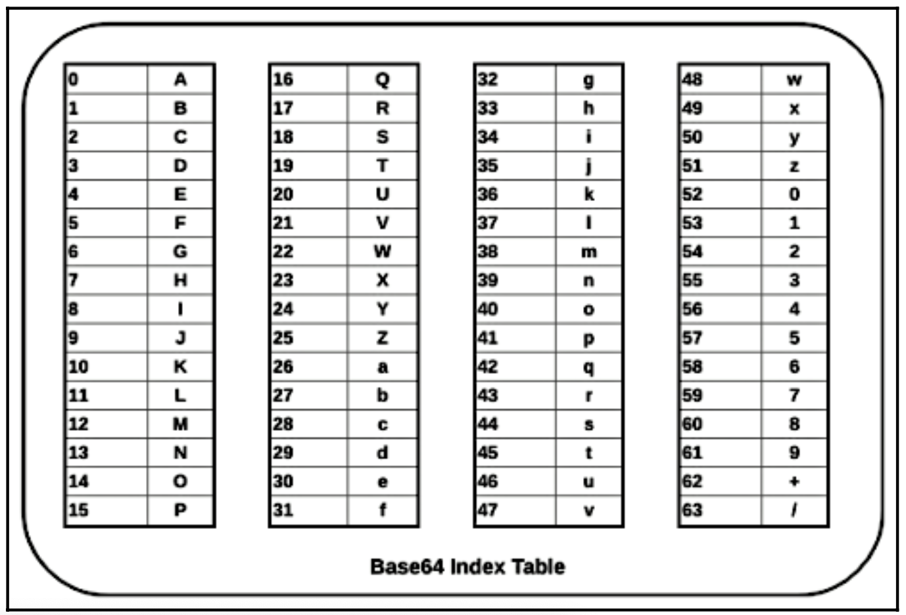

现在，让我们假设我们想对文本 "One "进行Base64编码。要做到这一点，我们需要将字母转换为其相应的比特值，如图所示。

```
O （ascii=79）-> 0x4f -> 01001111
n  (ascii=110)-> 0x6e -> 01101110
e （ascii=101）-> 0x65 -> 01100101
   
```

Base64算法一次处理3个字节（6比特）（24位）；在这种情况下，我们正好有24个比特，它们彼此相邻放置，如图所示。

```
010011110110111001100101
```

然后，这24位被分成四部分，每部分由6位组成，并转换为其等效的十进制值。然后，十进制值被用作索引，以便在Base64索引表中找到相应的值，因此文本一被编码为T25l。

```
010011 -> 19 -> base64 table lookup -> T
110110 -> 54 -> base64 table lookup -> 2
111001 -> 57 -> base64 table lookup -> 5
100101 -> 37 -> base64 table lookup -> l
```

> 解码Base64是一个反向的过程，但理解Base64编码或解码的工作原理并不是必须的，因为有一些python模块和工具可以让你在不了解算法的情况下解码Base64编码的数据。在攻击者使用自定义版本的Base64编码的情况下，了解它将有所帮助。

##### 1.2.2 编码和解码 Base64 

要在Python(2.x)中使用Base64对数据进行编码，请使用以下代码。

```
>>> import base64
>>> plain_text = "One"
>>> encoded = base64.b64encode(plain_text) 
>>> print encoded
T25l
```

要在python中解码base64数据，请使用以下代码。

```
>>> import base64
>>> encoded = "T25l"
>>> decoded = base64.b64decode(encoded) 
>>> print decoded
One
```

GCHQ的CyberChef是一个伟大的web应用程序，允许你在浏览器中进行各种编码/解码、加密/解密、压缩/解压和数据分析操作。你可以通过以下网址访问CyberChef：https://gchq.github.io/CyberChef/，更多的细节可以在https://github.com/gchq/ CyberChef找到。

你也可以使用诸如ConverterNET（http://www.kahusecurity.com/tools/）这样的工具对base64数据进行编码/解码。ConvertNET提供各种功能，允许你将数据转换为/从许多不同的格式。要进行编码，在输入栏中输入要编码的文本，然后点击Text to Base64按钮。要解码，在输入栏中输入要编码的数据，然后点击Base64到文本按钮。下面的截图显示了使用ConverterNET对字符串Hi进行的Base64编码。

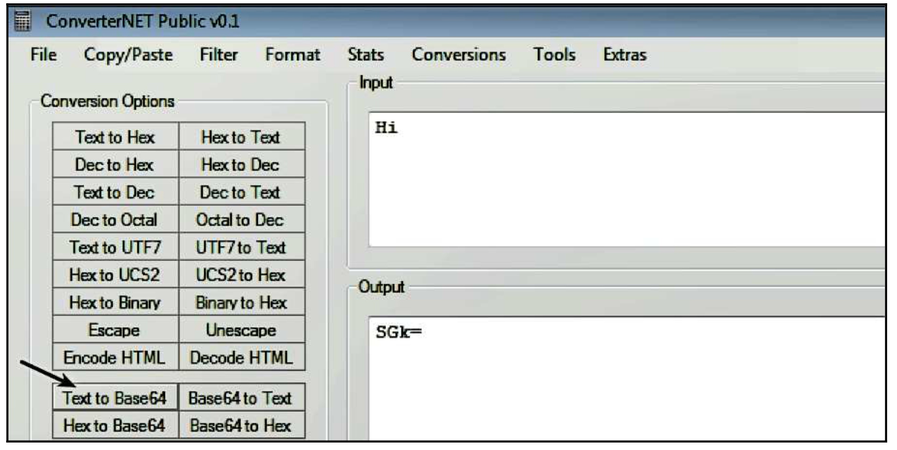

编码后的字符串末尾的=字符是填充字符。如果你还记得，该算法将三个字节的输入转换为四个字符，由于Hi只有两个字符，它被填充成三个字符；只要使用了填充，你就会在Base64编码的字符串的末尾看到=字符。这意味着一个有效的Base64编码的字符串的长度总是4的倍数。

##### 1.2.3 解码自定义的Base64

攻击者使用不同的Base64编码变化；其目的是阻止Base64解码工具成功解码数据。在本节中，你将了解这些技术中的一些。

一些恶意软件样本将填充字符（=）从末端移除。这里显示了一个恶意软件样本（Trojan Qidmorks）进行的C2通信。下面的帖子有效载荷看起来是用base64编码的。

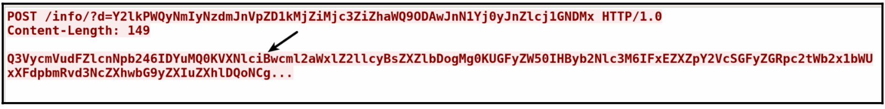

当你试图解码POST有效载荷时，你会得到不正确的填充错误，如下所示。

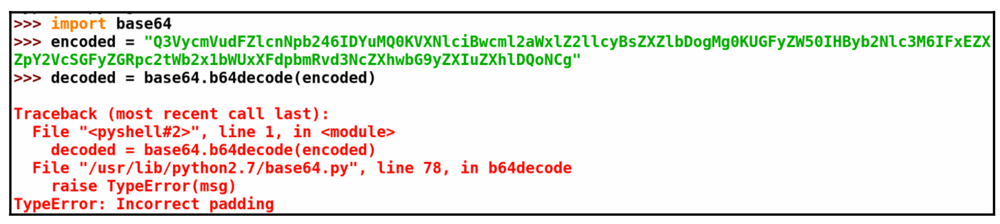

这个错误的原因是，编码字符串的长度（150）不是4的倍数。换句话说，Base64编码的数据中缺少两个字符，这很可能是填充字符（==）。

```
>>> encoded = "Q3VycmVudFZlcnNpb246IDYuMQ0KVXNlciBwcml2aWxlZ2llcyBsZXZlbDogMg0KUGFyZW50IHByb2Nlc3M6IFxEZXZpY2VcSGFyZGRpc2tWb2x1bWUxXFdpbmRvd3NcZXhwbG9yZXIuZXhlDQoNCg"
>>> len(encoded)
150 
```

将两个填充字符（==）附加到编码的字符串中，成功地解码了数据，如图所示。从解码后的数据可以看出，恶意软件向C2服务器发送了操作系统版本（6.1代表Windows 7）、用户的权限级别和父进程。

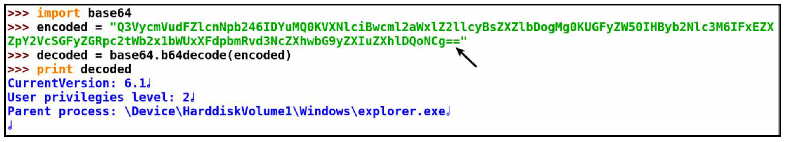

有时，恶意软件作者使用base64编码的轻微变化。例如，攻击者可以使用一个字符集，其中字符-和_被用来代替+和/（第63和64个字符），如图所示。

```
ABCDEFGHIJKLMNOPQRSTUVWXYZabcdefghijklmnopqrstuvwxyz0123456789-_
```

一旦你确定了在原始字符集中被替换的字符来对数据进行编码，那么你就可以使用如图所示的代码。这里的意思是将修改后的字符替换回标准字符集中的原始字符，然后再进行解码。

```
>>> import base64
>>> encoded = "cGFzc3dvcmQxMjM0IUA_PUB-"
>>> encoded = encoded.replace("-","+").replace("_","/") >>> decoded = base64.b64decode(encoded)
>>> print decoded
password1234!@?=@~
```

有时，恶意软件作者会改变字符集中的字符顺序。例如，他们可能使用以下字符集而不是标准字符集。

```
0123456789+/ABCDEFGHIJKLMNOPQRSTUVWXYZabcdefghijklmnopqrstuvwxyz
```

当攻击者使用非标准的Base64字符集时，你可以用以下代码对数据进行解码。注意，在下面的代码中，除了64个字符外，变量chr_set和non_chr_set还包括填充字符=（第65个字符），这是正确解码所需要的。

```
>>> import base64
>>> chr_set = "ABCDEFGHIJKLMNOPQRSTUVWXYZabcdefghijklmnopqrstuvwxyz0123456789+/=" >>> non_chr_set = "0123456789+/ABCDEFGHIJKLMNOPQRSTUVWXYZabcdefghijklmnopqrstuvwxyz="
>>> encoded = "G6JgP6w=" >>> re_encoded = ""
>>> for en_ch in encoded:
            re_encoded += en_ch.replace(en_ch,
   chr_set[non_chr_set.find(en_ch)])
>>> decoded = base64.b64decode(re_encoded) >>> print decoded
Hello
```

你也可以使用ConverterNET工具，通过选择转换|转换自定义Base64来执行自定义Base64解码。只要在Alphabet字段中输入自定义的Base64字符集，然后在Input字段中输入要解码的数据，并按下Decode按钮，如图所示。

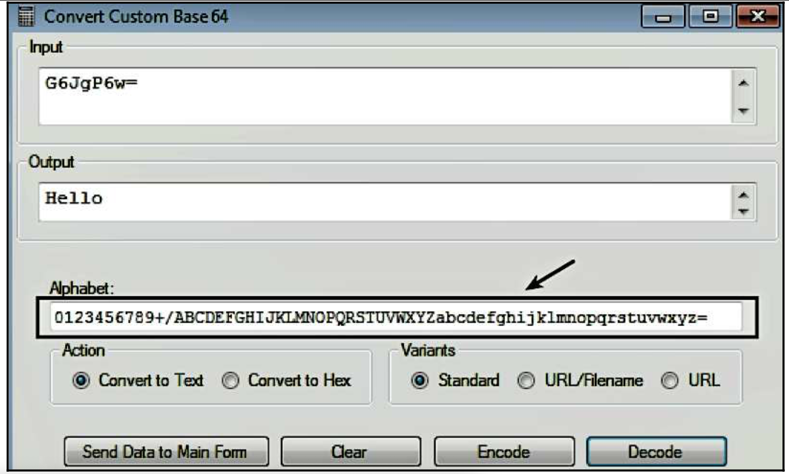

##### 1.2.4 识别Base64

你可以通过寻找一个由Base64字符集（字母数字字符、+和/）组成的长字符串来识别一个使用Base64编码的二进制文件。下面的截图显示了恶意二进制文件中的Base64字符集，表明恶意软件可能使用了Base64编码。

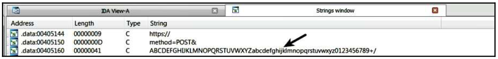

你可以使用字符串交叉引用功能（在第5章中涉及）来定位使用Base64字符集的代码，如以下截图所示。即使没有必要知道代码中哪里使用了Base64字符集来解码Base64数据，但有时，定位它是有用的，例如在恶意软件作者使用Base64编码和其他加密算法的情况下。例如，如果恶意软件用某种加密算法对C2网络流量进行加密，然后使用Base64编码；在这种情况下，定位Base64字符集可能会使你进入Base64函数。然后你可以分析Base64函数或确定调用Base64函数的函数（使用Xrefs功能），这可能会导致你找到加密函数。

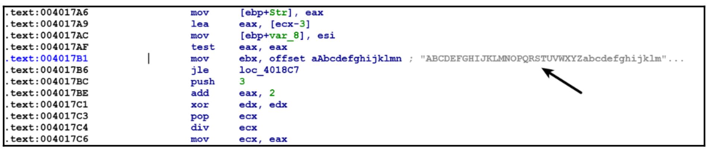

> 你可以在x64dbg中使用字符串交叉引用；要做到这一点，确保调试器在模块内任何地方暂停，然后在反汇编窗口（CPU窗口）上点击右键，选择搜索|当前模块|字符串引用。

另一种检测二进制文件中是否存在Base64字符集的方法是使用YARA规则（YARA在第2章 "静态分析 "中讲过），如这里所示。

```
 rule base64
   {
   strings:
       $a="ABCDEFGHIJKLMNOPQRSTUVWXYZabcdefghijklmnopqrstuvwxyz0123456789+/"
       $b="ABCDEFGHIJKLMNOPQRSTUVWXYZabcdefghijklmnopqrstuvwxyz0123456789-_"
   condition:
$a or $b }

```

#### 1.3 XOR 编码

除了Base64编码，恶意软件作者使用的另一种常见编码算法是XOR编码算法。XOR是一种位操作（像AND、OR和NOT），它是在操作数的相应位上进行的。下表描述了XOR操作的属性。在XOR操作中，当两个位都相同时，结果为0；否则，结果为1。

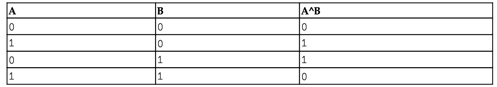

例如，当你XOR 2和4时，即2 ^ 4，结果是6，其工作方式如图所示。

```
						2: 0000 0010
         				4: 0000 0100
   ---------------------------
   Result After XOR : 0000 0110 (6)
```

##### 1.3.1 单字节XOR

在单字节XOR中，明文的每个字节都与加密密钥进行XOR。例如，如果攻击者想用0x40的密钥对明文cat进行加密，那么文本中的每个字符（字节）都会与0x40进行XOR，从而得到密码文本#！4。 下图显示了每个单独字符的加密过程。

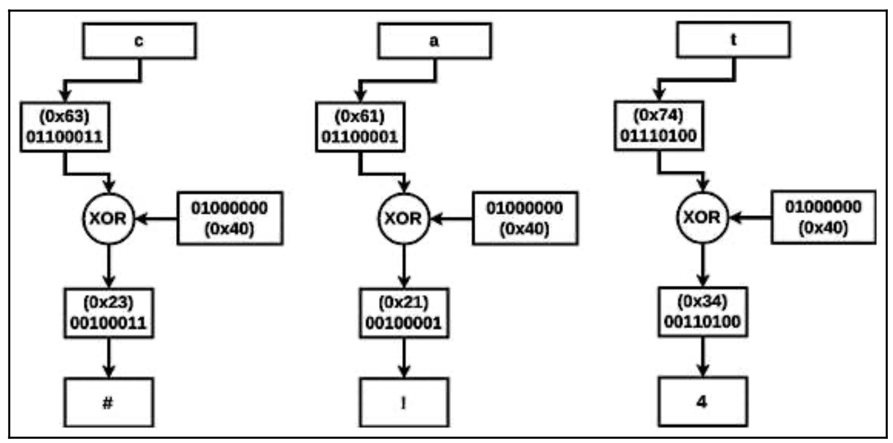

XOR的另一个有趣的特性是，当你将密码文本与用于加密的相同密钥进行XOR时，你将得到原文文本。例如，如果你把前面例子中的密码文本#！4与0x40（密钥）进行XOR，你会得到cat。这意味着，如果你知道密钥，那么同一个函数就可以用来加密和解密数据。下面是一个简单的python脚本，用于执行XOR解密（同样的函数也可以用于执行XOR加密）。

```
def xor(data, key):
       translated = ""
       for ch in data:
           translated += chr(ord(ch) ^ key)
       return translated
   if __name__ == "__main__":
      out = xor("#!4", 0x40)
      print out
```

有了对XOR编码算法的了解，让我们看看一个键盘记录器的例子，它将所有输入的按键编码到一个文件。当这个例子被执行时，它记录了击键，并使用CreateFileA()API打开了一个文件（所有击键都将被记录），如图所示。使用CreateFileA()API打开一个文件（其中所有的击键将被记录），如下面的截图所示。然后，它使用WriteFile()API将记录的击键写到文件中。请注意，恶意软件在调用CreateFileA()之后、WriteFile()之前调用了一个函数（重命名为enc_function）；该函数在将内容写入文件之前对其进行编码。enc_function需要两个参数；第一个参数是包含要加密的数据的缓冲区，第二个参数是缓冲区的长度。


检查enc_function可以发现恶意软件使用单字节异或。它从数据缓冲区中读取每个字符并使用0x5A的键进行编码，如下所示。在下面的XOR循环中，edx寄存器指向数据缓冲区，esi寄存器包含缓冲区的长度，ecx寄存器作为数据缓冲区的索引，在循环结束时增加，只要索引值(ecx)小于缓冲区的长度(esi)，循环就会继续:

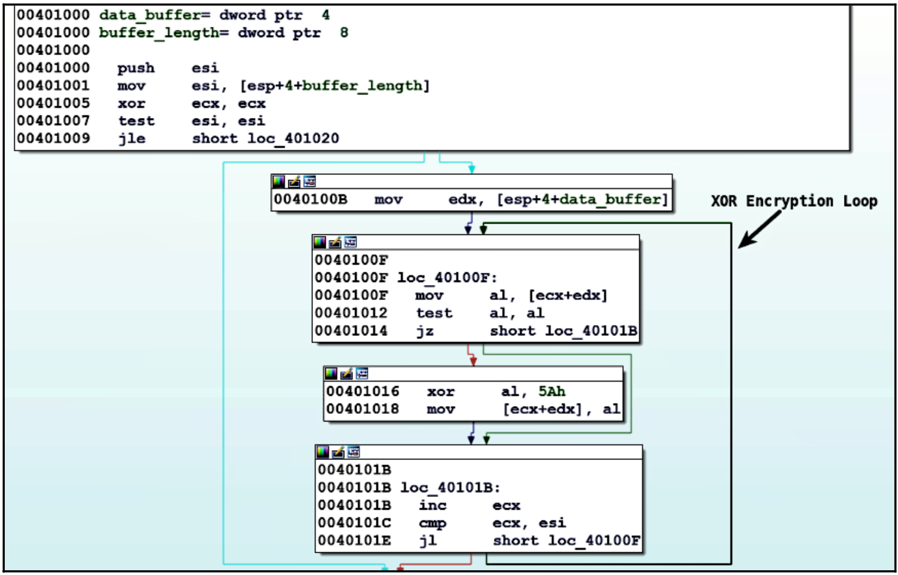

##### 1.3.2 通过蛮力找到XOR密钥

在单字节XOR中，密钥的长度是一个字节，所以只能有255个可能的密钥（0x0-0xff），但0作为密钥除外，因为将任何值与0进行XOR都会得到相同的结果（即没有加密）。由于只有255个密钥，你可以在加密的数据上尝试所有可能的密钥。如果你知道要在解密的数据中找到什么，这种技术就很有用。例如，在执行一个恶意软件样本时，假设恶意软件得到计算机主机名mymachine，并与一些数据连接，执行单字节xor加密，将其加密为密码文lkwpjeia>i}ieglmja。让我们假设这个密码文本在C2通信中被渗出。现在，为了确定用于加密密文的密钥，你可以分析加密函数，或对其进行暴力破解。下面的python命令实现了暴力技术；由于我们期望解密的字符串包含 "mymachine"，脚本用所有可能的密钥解密加密的字符串（密码文本），并在找到 "mymachine "时显示密钥和解密的内容。在下面的例子中，你可以看到密钥被确定为4，解密后的内容hostname:mymachine，包括主机名mymachine。

```
>>> def xor_brute_force(content, to_match): for key in range(256):
           translated = ""
           for ch in content:
               translated += chr(ord(ch) ^ key)
           if to_match in translated:
print "Key %s(0x%x): %s" % (key, key, translated) >>> xor_brute_force("lkwpjeia>i}ieglmja", "mymachine")
   Key 4(0x4): hostname:mymachine
```

你也可以使用一个工具，如ConverterNET，用暴力手段确定密钥。要做到这一点，请选择工具|密钥搜索/转换。在弹出的窗口中，输入加密的内容和匹配的字符串，然后按下搜索按钮。如果找到了密钥，它将显示在结果栏中，如图所示。

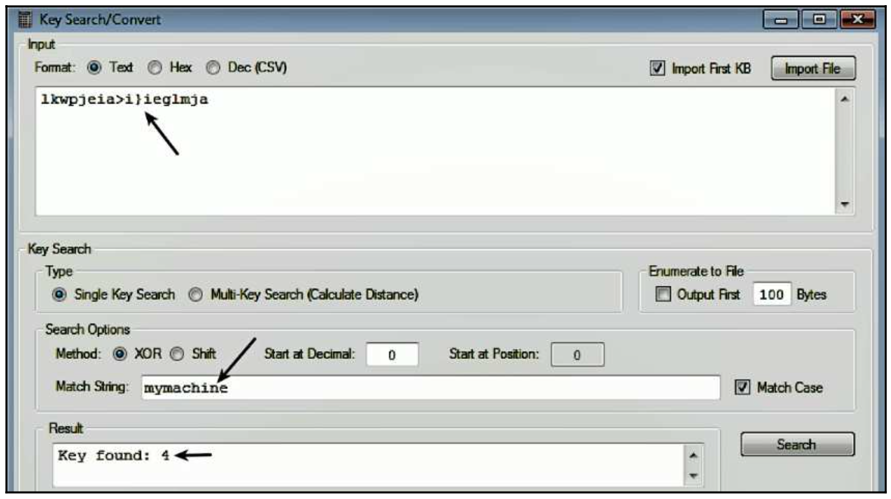

> 蛮力技术（爆破）在确定用于加密PE文件（如EXE或DLL）的XOR密钥时很有用。只要在解密的内容中寻找匹配的字符串MZ或这个程序不能在DOS模式下运行。


##### 1.3.3 忽略XOR编码的NULL

在XOR编码中，当一个空字节（0x00）与一个密钥进行XOR时，你会得到密钥，如图所示。

```
>>> ch = 0x00 
>>> key = 4 
>>> ch ^ key 4
```

这意味着只要对含有大量空字节的缓冲区进行编码，单字节的xor密钥就会清晰可见。在下面的例子中，明文变量被分配了一个包含三个空字节的字符串，用密钥0x4b（字符K）进行加密，加密后的输出以十六进制字符串格式和文本格式打印。请注意明文变量中的三个空字节是如何转化为加密内容中的XOR密钥值0x4b 0x4b 0x4b或（KKK）。如果不忽略空字节，XOR的这一特性使我们很容易发现密钥。

```
>>> plaintext = "hello\x00\x00\x00" >>> key = 0x4b
>>> enc_text = ""
>>> for ch in plaintext:
           x = ord(ch) ^ key
           enc_hex += hex(x) + " "
           enc_text += chr(x)
>>> print enc_hex
0x23 0x2e 0x27 0x27 0x24 0x4b 0x4b 0x4b >>> print enc_text
#.''$KKK
```

下面的截图显示了一个恶意软件样本（HeartBeat RAT）的XOR-加密通信。请注意到处都有0x2字节；这是由于恶意软件用0x2的XOR密钥加密了一个大的缓冲区（包含空字节）。关于这个恶意软件的逆向工程的更多信息，请参考作者的Cysinfo会议演讲：https://cysinfo.com/session-10-part-1-reversing-decrypting-communications-of-heartbeat-rat/。

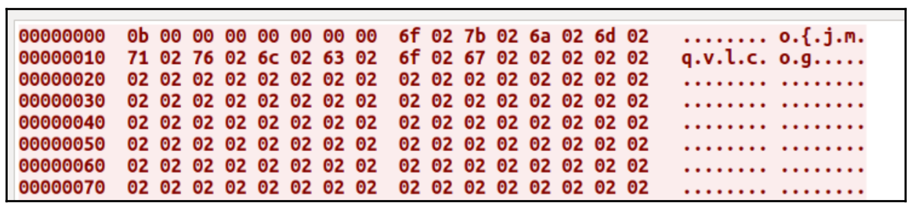

为了避免空字节问题，恶意软件作者在加密过程中会忽略空字节（0x00）和加密密钥，如这里提到的命令中所示。请注意，在下面的代码中，除了空字节（0x00）和加密密钥字节（0x4b）外，明文字符都是用密钥0x4b加密的；因此，在加密的输出中，空字节被保留下来，而不会泄露加密密钥。正如你所看到的，当攻击者使用这种技术时，仅仅通过查看加密的内容，是不容易确定密钥的。

```
>>> plaintext = "hello\x00\x00\x00" >>> key = 0x4b
>>> enc_text = ""
>>> for ch in plaintext:
           if ch == "\x00" or ch == chr(key):
              enc_text += ch
           else:
              enc_text += chr(ord(ch) ^ key)
>>> enc_text 
"#.''$\x00\x00\x00"
```

##### 1.3.4 多字节XOR编码

攻击者通常使用多字节的XOR，因为它能更好地防御暴力破解技术。例如，如果恶意软件作者使用4字节的XOR密钥来加密数据，然后进行暴力破解，你将需要尝试4,294,967,295（0xFFFFFFFF）可能的密钥，而不是255（0xFF）密钥。下面的截图显示了恶意软件（Taidoor）的XOR解密循环。在这种情况下，Taidoor从其资源部分提取了加密的PE（exe）文件，并使用4字节的XOR密钥0xEAD4AA34将其解密。

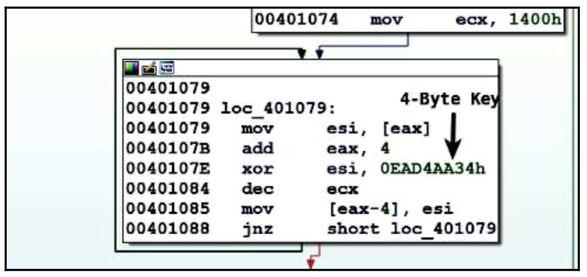

下面的屏幕截图显示了资源黑客工具中的加密资源。通过右键点击资源，然后选择将资源保存为*.bin文件，可以将资源提取并保存到文件。

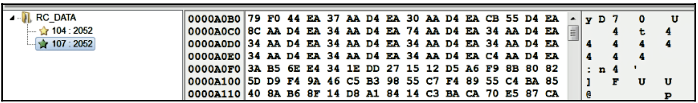

下面的屏幕截图显示了资源黑客工具中的加密资源。通过右键点击资源，然后选择将资源保存为*.bin文件，可以将资源提取并保存到文件。

```
import os
import struct
import sys

def four_byte_xor(content, key ):
   translated = ""
   len_content = len(content)
   index = 0
   while (index < len_content):
       data = content[index:index+4]
       p = struct.unpack("I", data)[0]
       translated += struct.pack("I", p ^ key)
       index += 4
   return translated
   
in_file = open("rsrc.bin", 'rb')
out_file = open("decrypted.bin", 'wb')
xor_key = 0xEAD4AA34
rsrc_content = in_file.read()
decrypted_content = four_byte_xor(rsrc_content,xor_key)
out_file.write(decrypted_content)

```

解密后的内容是一个PE（可执行文件），如图所示。

```
$ xxd decrypted.bin | more
00000000: 4d5a 9000 0300 0000 0400 0000 ffff 0000 MZ.............. 
00000010: b800 0000 0000 0000 4000 0000 0000 0000 ........@....... 
00000020: 0000 0000 0000 0000 0000 0000 0000 0000 ................ 
00000030: 0000 0000 0000 0000 0000 0000 f000 0000 ................ 
00000040: 0e1f ba0e 00b4 09cd 21b8 014c cd21 5468 ........!..L.!Th 
00000050: 6973 2070 726f 6772 616d 2063 616e 6e6f is program canno 
00000060: 7420 6265 2072 756e 2069 6e20 444f 5320 t be run in DOS
```

##### 1.3.5 识别XOR编码

为了识别XOR编码，在IDA中加载二进制文件，通过选择Search|Text来搜索XOR指令。在出现的对话框中，输入xor并选择查找所有出现的情况，如图所示。

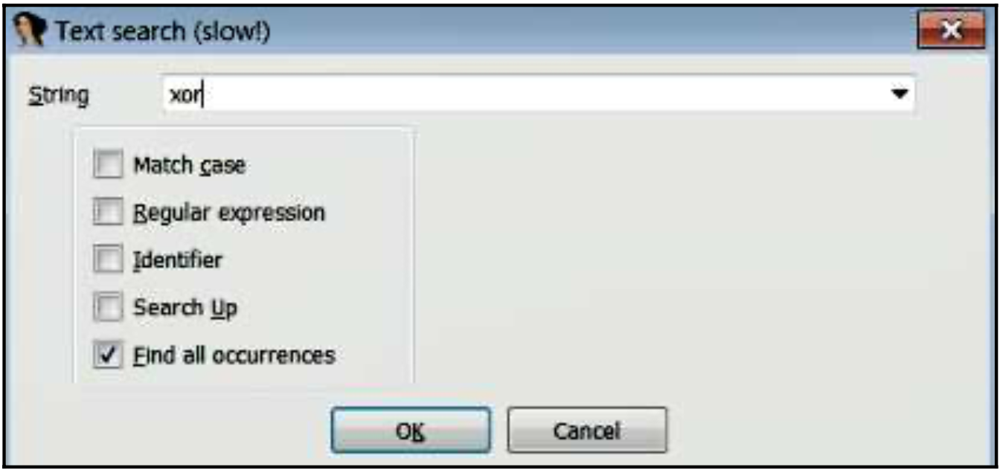

当你点击 "确定 "时，你会看到所有XOR的出现。在操作数为相同寄存器的情况下，XOR操作是非常常见的，例如xor eax,eax或xor ebx,ebx。这些指令被编译器用来清零寄存器的值，你可以忽略这些指令。要识别XOR编码，可以寻找（a）一个寄存器（或内存引用）与一个常量值的XOR，如这里所示，或者（b）寻找一个寄存器（或内存引用）与一个不同的寄存器（或内存引用）的XOR。你可以通过双击条目导航到代码。

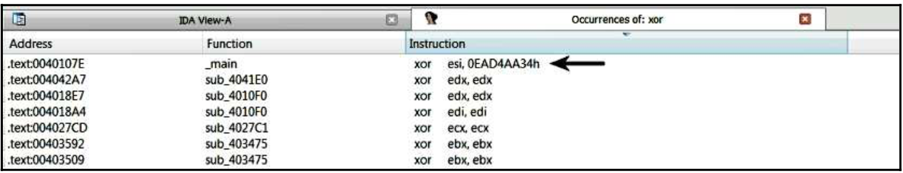

以下是一些你可以用来确定XOR密钥的工具。除了使用XOR编码外，攻击者还可能使用ROL、ROT或SHIFT操作来编码数据。这里提到的XORSearch和Balbuzard除了支持XOR之外，还支持ROL、ROT和Shift操作。CyberChef几乎支持所有类型的编码、加密和压缩算法。

* CyberChef:* https://gchq.github.io/CyberChef/

* XORSearch* by Didier Stevens: https://blog.didierstevens.com/programs/ xorsearch/

* Balbuzard:* https://bitbucket.org/decalage/balbuzard/wiki/Home *unXOR:* https://github.com/tomchop/unxor/#unxor
* brxor.py:* https://github.com/REMnux/distro/blob/v6/brxor.py *NoMoreXOR.py:* https://github.com/hiddenillusion/NoMoreXOR

### 2. 恶意软件加密

恶意软件作者经常使用简单的编码技术，因为这只足以掩盖数据，但有时，攻击者也使用加密技术。为了识别二进制文件中加密功能的使用，你可以寻找加密指标（签名），如：。

* 引用加密功能的字符串或导入表
* 加密的常量
* 加密程序使用的独特指令序列

#### 2.1 使用Signsrch识别加密货币签名

搜索文件或进程中的加密签名的一个有用工具是Signsrch，它可以从http://aluigi.altervista.org/mytoolz.htm。这个工具依靠密码学签名来检测加密算法。加密签名位于一个文本文件中，即signsrch.sig。在下面的输出中，当signsrch以-e选项运行时，它显示在二进制文件中检测到DES签名的相对虚拟地址。

```
C:\signsrch>signsrch.exe -e kav.exe
   Signsrch 0.2.4
   by Luigi Auriemma
   e-mail: aluigi@autistici.org
   web: aluigi.org
     optimized search function by Andrew http://www.team5150.com/~andrew/
     disassembler engine by Oleh Yuschuk
   - open file "kav.exe"
   - 91712 bytes allocated
   - load signatures
   - open file C:\signsrch\signsrch.sig
   - 3075 signatures in the database
    - start 1 threads
   - start signatures scanning:
     offset num description [bits.endian.size]
     --------------------------------------------
   00410438 1918 DES initial permutation IP [..64]
   00410478 2330 DES_fp [..64]
   004104b8 2331 DES_ei [..48]
   004104e8 2332 DES_p32i [..32]
00410508 1920 DES permuted choice table (key) [..56] 00410540 1921 DES permuted choice key (table) [..48] 00410580 1922 DES S-boxes [..512]
[Removed]

 
```

一旦你知道加密指标所在的地址，你就可以用IDA导航到该地址。例如，如果你想导航到地址00410438（DES的初始排列组合IP），在IDA中加载二进制文件并选择Jump|Jump to address（跳转|跳转到地址）（或G热键）并输入地址，如图所示。

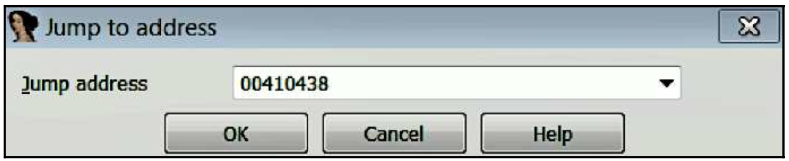

一旦你点击确定，你将到达包含指标的地址（在这种情况下，DES初始permutation IP，标记为DES_ip），如以下截图所示。

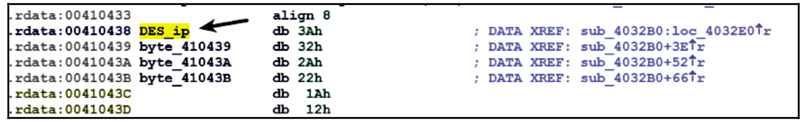

现在，要知道这个加密指标在代码中的使用位置和方式，你可以使用交叉引用（Xrefs-to）功能。使用交叉引用（Xrefs to）功能显示，DES_ip在地址为0x4032E0（loc_4032E0）的函数sub_4032B0中被引用。

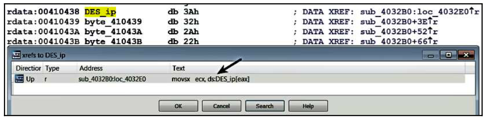

现在，导航到地址0x4032E0可以直接进入DES加密函数，如下面的截图所示。一旦找到了加密函数，你可以使用交叉引用来进一步检查，以了解在什么情况下加密函数被调用以及用于加密数据的密钥。

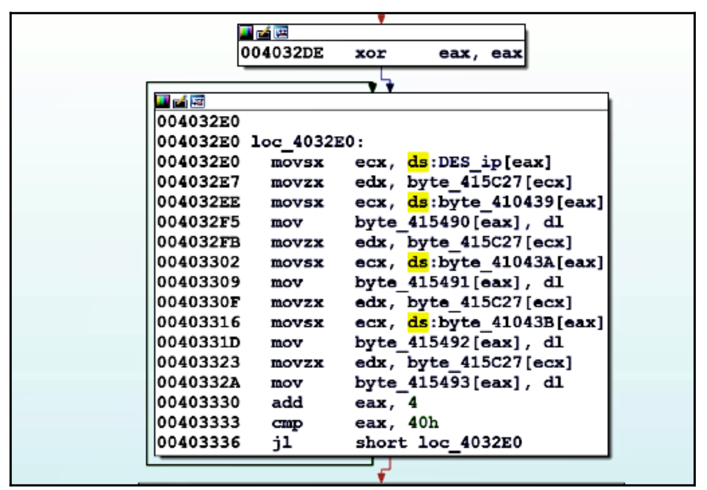

与其使用-e选项来定位签名，然后手动浏览使用签名的代码，你可以使用-F选项，它将给你使用加密指标的第一条指令的地址。在下面的输出中，用-F选项运行signsrch直接显示了代码中使用加密指标DES初始排列IP（DES_ip）的地址0x4032E0。

```
C:\signsrch>signsrch.exe -F kav.exe 
[removed]

  offset num description [bits.endian.size]
-------------------------------------------- 
[removed]
004032e0 1918 DES initial permutation IP [..64] 
00403490 2330 DES_fp [..64]
```

-e和-F选项显示相对于PE头中指定的首选基址的地址。例如，如果二进制文件的首选基址是0x00400000，那么由-e和-F选项返回的地址是通过将相对虚拟地址与首选基址0x00400000相加而确定的。当你运行（或调试）二进制文件时，它可以在首选基地址以外的任何地址被加载（例如，0x01350000）。如果你希望在一个正在运行的进程中或在调试二进制文件时（在IDA或x64dbg中）找到加密指标的地址，那么你可以用-P <pid或进程名称>选项运行signsrch。-P选项会自动确定加载可执行文件的基本地址，然后计算出加密签名的虚拟地址，如图所示。

```
C:\signsrch>signsrch.exe -P kav.exe [removed]
- 01350000 0001b000 C:\Users\test\Desktop\kav.exe - pid 3068
- base address 0x01350000
- offset 01350000 size 0001b000
   - 110592 bytes allocated
   - load signatures
   - open file C:\signsrch\signsrch.sig
   - 3075 signatures in the database
   - start 1 threads
   - start signatures scanning:
offset num description [bits.endian.size] -------------------------------------------- 01360438 1918 DES initial permutation IP [..64] 01360478 2330 DES_fp [..64]
     013604b8 2331 DES_ei [..48]
```

> 除了检测加密算法外，Signsrch还可以检测压缩算法、一些反调试代码和Windows加密函数，通常以Crypt开头，如CryptDecrypt()和CryptImportKey()。


#### 2.2 使用FindCrypt2检测加密常量

Findcrypt2 (http://www.hexblog.com/ida_pro/files/findcrypt2.zip)【由于目前已经无法下载因此这里查阅了一下推荐换yara的匹配的一个方式https://github.com/polymorf/findcrypt-yara或者下一个小节的推荐yara检测】 是一个IDA Pro插件，可以在内存中搜索许多不同算法所使用的加密常数。要使用该插件，请下载它，并将findcrypt.plw文件复制到IDA插件文件夹中。现在，当你加载二进制文件时，该插件会自动运行，或者你可以通过选择Edit | Plugins | Find crypt v2（编辑|插件|查找密码v2）来手动调用它。 该插件的结果会显示在输出窗口。

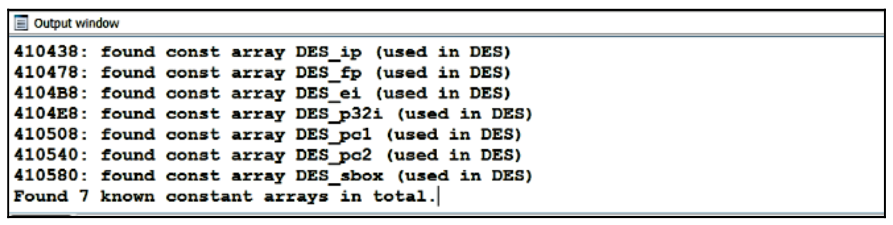

> FindCrypt2插件也可以在调试模式下运行。如果你使用IDA 6.x或更低的版本，FindCrypt2工作得很好；在编写本书时，它似乎不能在IDA 7.x版本中工作（可能是由于IDA 7.x API的变化）。


#### 2.3 利用YARA检测加密签名

另一种识别二进制文件中使用加密技术的方法是用包含加密签名的YARA规则扫描二进制文件。你可以自己编写YARA规则，或者下载其他安全研究人员编写的YARA规则（如
https://github.com/x64dbg/yarasigs/blob/master/crypto_signatures.yara），然后用YARA规则扫描二进制文件。

x64dbg集成了YARA；如果你想在调试时扫描二进制文件中的加密签名，这很有用。你可以将二进制文件加载到x64dbg中（确保执行在二进制文件的某个地方暂停），然后右键点击CPU窗口，选择YARA（或Ctrl + Y）；这将带来这里显示的Yara对话框。点击 "文件"，加载包含YARA规则的文件。你也可以通过点击目录按钮从一个目录中加载含有YARA规则的多个文件。

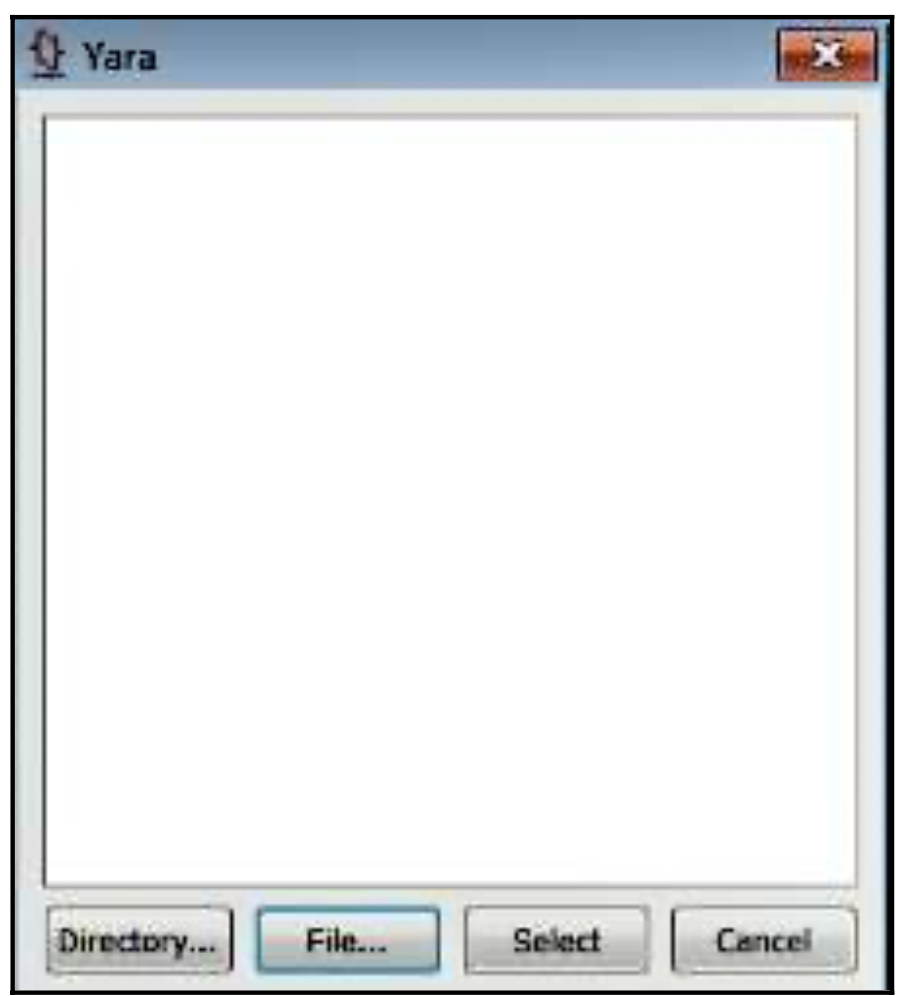

下面的截图显示了用包含加密签名的YARA规则扫描恶意二进制文件后检测到的加密常量。现在你可以右击任何一个条目，选择在转储中关注，以查看转储窗口中的数据，或者，如果签名与加密程序有关，那么你可以双击任何一个条目来浏览代码。

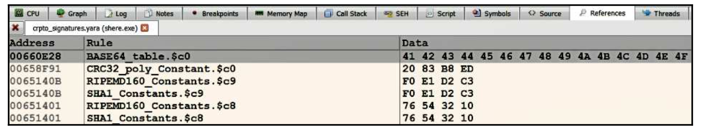

> 像RC4这样的加密算法不使用加密常数，因为它不容易用加密签名来检测。通常，你会看到攻击者使用RC4来加密数据，因为它很容易实现；在Talos的这篇博文中详细解释了RC4的使用步骤：http://blog.talosintelligence.com/2014/06/an-introduction-to-recognizing-and.html。

#### 2.4 用Python解密

在你确定了加密算法和用于加密数据的密钥后，你可以使用PyCryto (https://www.dlitz.net/software/pycrypto/) Python模块来解密数据。要安装PyCrypto，你可以使用apt-get install python-crypto 或 pip install pycrypto 或从源代码中编译它。Pycrypto支持散列算法，如MD2、MD4、MD5、RIPEMD、SHA1和SHA256。它还支持加密算法，如AES、ARC2、Blowfish、CAST、DES、DES3（Triple DES）、IDEA、RC5和ARC4。
下面的Python命令演示了如何使用Pycrypto模块生成MD5、SHA1和SHA256哈希值。

```
# 由于原脚本存在bug，这里给出的是调整过的脚本
>>> from Crypto.Hash import MD5,SHA256,SHA1 
>>> text = "explorer.exe"
>>> MD5.new(str.encode(text)).hexdigest() 
'cde09bcdf5fde1e2eac52c0f93362b79'
>>> SHA256.new(str.encode(text)).hexdigest() '7592a3326e8f8297547f8c170b96b8aa8f5234027fd76593841a6574f098759c' 
>>> SHA1.new(str.encode(text)).hexdigest() '7a0fd90576e08807bde2cc57bcf9854bbce05fe3'
```

为了解密内容，从Crypto.Cipher中导入适当的加密模块。下面的例子显示了如何在ECB模式下使用DES进行加密和解密。

```
# 由于原脚本存在bug，这里给出的是调整过的脚本
>>> from Crypto.Cipher import DES
>>> text = "hostname=blank78"
>>> key = "14834567"
>>> des = DES.new(str.encode(key), DES.MODE_ECB)
>>> cipher_text = des.encrypt(str.encode(text))
>>> cipher_text 
'\xde\xaf\t\xd5)sNj`\xf5\xae\xfd\xb8\xd3f\xf7' 
>>> plain_text = des.decrypt(cipher_text)
>>> plain_text 
'hostname=blank78'
```

### 3. 自定义编码/加密

有时，攻击者会使用自定义的编码/加密方案，这使得难以识别加密（和密钥），也使得逆向工程更加困难。自定义编码方法之一是使用编码和加密的组合来混淆数据；这种恶意软件的一个例子是Etumbot（https://www.arbornetworks.com/blog/asert/illuminating-theetumbot-apt-backdoor/）。Etumbot恶意软件样本在执行时，会从C2服务器获得RC4密钥；然后使用获得的RC4密钥对系统信息（如主机名、用户名和IP地址）进行加密，加密后的内容使用自定义Base64进一步编码，并外流到C2。包含混淆内容的C2通信在下面的截图中显示。关于这个样本的逆向工程细节，请参考作者的演讲和视频演示（https://cysinfo.com/12th-meetup-reversing-decrypting-malware-communications/）。

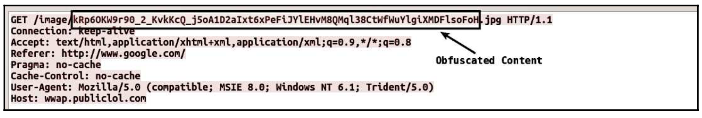

为了对内容进行解密，需要先用自定义的Base64进行解码，然后用RC4进行解密；这些步骤用以下python命令进行。输出显示解密后的系统信息。

```
>>> import base64
>>> from Crypto.Cipher import ARC4
>>> rc4_key = "e65wb24n5"
>>> cipher_text = "kRp6OKW9r90_2_KvkKcQ_j5oA1D2aIxt6xPeFiJYlEHvM8QMql38CtWfWuYlgiXMDFlsoFoH" 
>>> content = cipher_text.replace('_','/').replace('-','=')
>>> b64_decode = base64.b64decode(content)
>>> rc4 = ARC4.new(rc4_key)
>>> plain_text = rc4.decrypt(b64_decode)
>>> print plain_text
MYHOSTNAME|Administrator|192.168.1.100|No Proxy|04182|
```

一些恶意软件作者没有使用标准编码/加密算法的组合，而是实施了一个全新的编码/加密方案。这种恶意软件的一个例子是APT1集团使用的恶意软件。该恶意软件将一个字符串解密为一个URL；为此，恶意软件调用一个用户定义的函数（在下面的截图中更名为Decrypt_Func），该函数实现了自定义加密算法。Decrypt_Func接受三个参数；第一个参数是包含加密内容的缓冲区，第二个参数是将存储解密内容的缓冲区，第三个参数是缓冲区的长度。在下面的截图中，在执行Decrypt_Func之前暂停了执行，它显示了第1个参数（包含加密内容的缓冲区）。

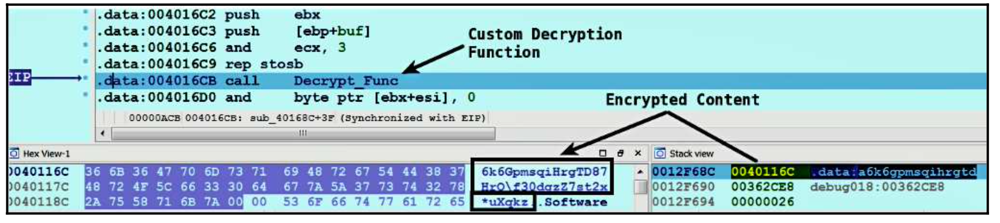

根据你的目标，你可以分析Decrypt_Func以了解算法的工作原理，然后按照作者的介绍（https://cysinfo.com/8th-meetup-understanding-apt1-malware-techniques-using-malware-analysis-reverse-engineering/）编写一个解密器，或者你可以让恶意软件为你解密内容。要让恶意软件解密内容，只需跨过Decrypt_Func（它将完成执行解密函数），然后检查第2个参数（存储解密内容的缓冲区）。下面的截图显示了包含恶意URL的解密缓冲区（第2参数）。

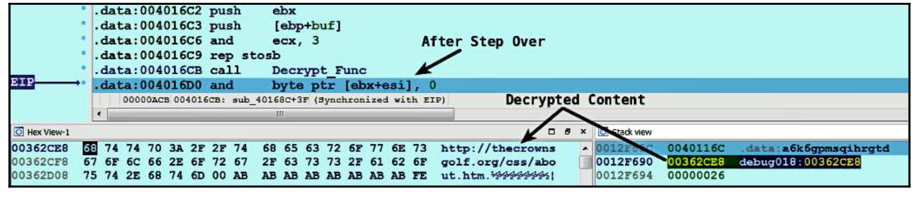

前面提到的让恶意软件解码数据的技术，如果解密函数被调用的次数不多，是很有用的。如果解密函数在程序中被多次调用，那么使用调试器脚本（在第6章，调试恶意二进制文件中涉及）自动解码过程会比手动操作更有效率。为了证明这一点，请考虑一个64位恶意软件样本的代码片段（在下面的截图中）。请注意恶意软件如何多次调用一个函数（重命名为dec_function）；如果你看一下代码，你会注意到一个加密的字符串被传递给这个函数作为第1个参数（在rcx寄存器中），执行该函数后，eax中的返回值包含存储解密内容的缓冲区的地址。


下面的截图显示了对dec_function的交叉引用；你可以看到，这个函数在程序中被多次调用。


每次调用dec_function时，它都会解密一个字符串。为了解密传递给这个函数的所有字符串，我们可以写一个IDAPython脚本（比如这里显示的那个）。

```
import idautils
import idaapi
import idc
for name in idautils.Names():
   if name[1] == "dec_function":
       ea= idc.get_name_ea_simple("dec_function")
       for ref in idautils.CodeRefsTo(ea, 1):
           idc.add_bpt(ref)
idc.start_process('', '', '')
while True:
   event_code = idc.wait_for_next_event(idc.WFNE_SUSP, -1)
   if event_code < 1 or event_code == idc.PROCESS_EXITED:
       break
   rcx_value = idc.get_reg_value("RCX")
   encoded_string = idc.get_strlit_contents(rcx_value)
   idc.step_over()
   evt_code = idc.wait_for_next_event(idc.WFNE_SUSP, -1)
   if evt_code == idc.BREAKPOINT:
       rax_value = idc.get_reg_value("RAX")
   decoded_string = idc.get_strlit_contents(rax_value)
   print "{0} {1:>25}".format(encoded_string, decoded_string)
   idc.resume_process()

```

由于我们已经将解密函数重命名为dec_function，所以它可以从IDA的名称窗口中访问。前面的脚本在名称窗口中进行迭代，以确定dec_function，并执行以下步骤。

1. 如果dec_function存在，它确定dec_function的地址。
2. 它使用dec_function的地址来确定对dec_function的交叉引用（Xrefs to），它给出了所有dec_function被调用的地址。
3. 3.它在所有调用dec_function的地址上设置断点。
4. 4.它自动启动调试器，当断点在dec_function处被击中时，它从rcx寄存器所指向的地址读取加密的字符串。需要记住的一点是，要使IDA调试器自动启动，一定要选择调试器（如本地Windows调试器），可以从工具栏区域或者选择调试器|选择调试器。
5. 然后，它步入函数，执行解密函数（dec_function），并读取返回值（rax），其中包含解密字符串的地址。然后它打印出解密的字符串。
6. 它重复前面的步骤，对传递给dec_function的每个字符串进行解密。

运行前面的脚本后，加密的字符串和它们相应的解密字符串会显示在输出窗口中，如图所示。从输出中可以看出，恶意软件在运行期间解密了文件名、注册表名和API函数名，以避免被怀疑。换句话说，这些是攻击者想要隐藏的字符串，以避免静态分析。

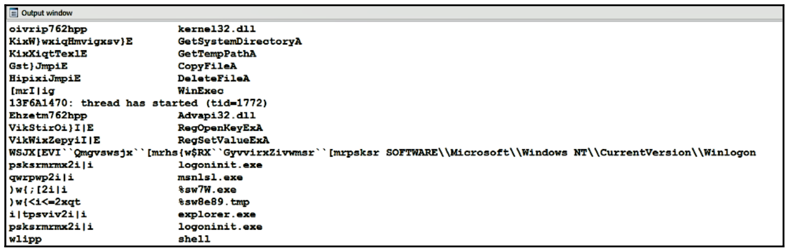

### 4. 恶意软件解包

攻击者不遗余力地保护他们的二进制文件免受反病毒检测，并使恶意软件分析师难以进行静态分析和反向工程。恶意软件作者经常使用打包器和加密器（见第2章，静态分析，了解打包器的基本介绍以及如何检测它们）来混淆可执行内容。打包器是一个程序，它将一个正常的可执行文件，压缩其内容，并生成一个新的混淆的可执行文件。加密器与打包器一样，不是压缩二进制文件，而是对其进行加密。换句话说，打包器或加密器将可执行文件转变为难以分析的形式。当一个二进制文件被打包时，它透露的信息非常少；你不会发现字符串透露出任何有价值的信息，导入的函数数量会减少，程序指令会被掩盖。为了理解一个打包的二进制文件，你需要移除应用于程序的混淆层（解包）；要做到这一点，首先要了解打包器的工作原理。
当一个正常的可执行文件通过打包器时，可执行文件的内容被压缩，并且它添加了一个解包存根（解压程序）。然后，打包器将可执行文件的入口点修改为存根的位置，并生成一个新的打包可执行文件。当打包后的二进制文件被执行时，解包存根会提取原始二进制文件（在运行期间），然后通过将控制权转移到原始入口点（OEP）来触发原始二进制文件的执行，如下图所描述。

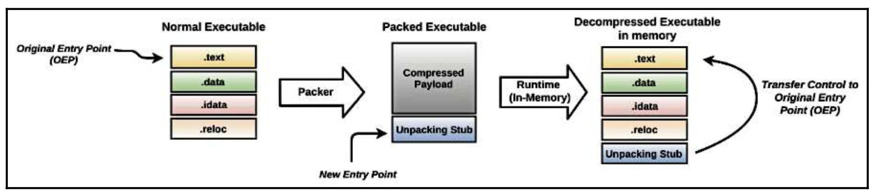

要解开一个打包的二进制文件，你可以使用自动工具，也可以手动操作。自动化方法可以节省时间，但并不完全可靠（有时成功，有时不成功），而手工方法则很费时，但一旦你掌握了技能，它就是最可靠的方法。

#### 4.3 手动拆包

要解开用打包器打包的二进制文件，我们通常要执行以下一般步骤。

1. 第一步是识别OEP；如前所述，当一个打包的二进制文件被执行时，它会提取原始二进制文件，并在某个时间点将控制权转移到OEP。原始入口点（OEP）是恶意软件被打包前的第一条指令（恶意代码开始的地方）的地址。在这一步，我们确定打包的二进制文件中的指令，它将跳转（引导我们）到OEP。
2. 下一步是执行程序，直到达到OEP；其目的是让恶意软件存根在内存中解包，并在OEP处暂停（在执行恶意代码之前）。
3. 第三步涉及将解包的程序从内存中转储到磁盘。
4. 最后一步涉及修复转储文件的导入地址表（IAT）。

在接下来的几节中，我们将详细研究这些步骤。为了演示前面的概念，我们将使用一个用UPX打包器打包的恶意软件（https://upx.github.io/）。在接下来的几节中所涉及的工具和技术应该给你一个手动解包过程的概念。


##### 4.1.1 识别OEP

在本节中，你将了解识别打包二进制文件中的OEP的技术。在下面的截图中，在pestudio(https://www.winitor.com/)中检查打包的二进制文件，显示了许多表明该文件是打包的指标。包装好的二进制文件包含三个部分：UPX0、UPX1和.rsrc。从截图中，你可以看到打包二进制文件的入口在UPX1部分，所以执行从这里开始，这部分包含解压存根，将在运行时解压原始可执行文件。另一个指标是，UPX0部分的原始大小为0，但虚拟大小为0x1f000；这表明UPX0部分不占用磁盘上的任何空间，但它占用了内存空间；具体而言，它占用了0x1f000字节的大小（这是因为恶意软件在内存中解压了可执行文件，并在运行时将其储存在UPX0部分）。另外，UPX0部分具有读、写、执行权限，很可能是因为在解压原始二进制文件后，恶意代码将在UPX0中开始执行。

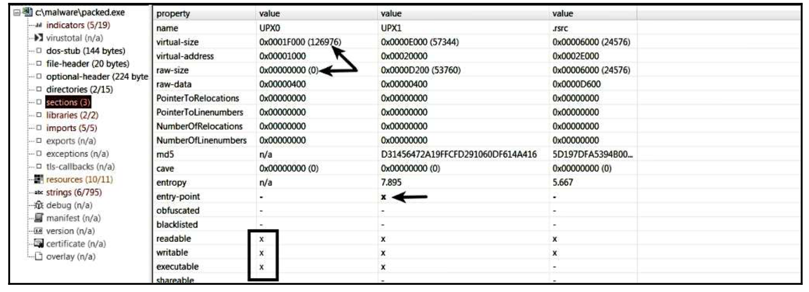

另一个指标是，打包的二进制文件包含混淆的字符串，当你在IDA中加载二进制文件时，IDA识别出导入地址表（IAT）在一个非标准的位置，并显示以下警告；这是由于UPX打包了所有的部分和IAT。

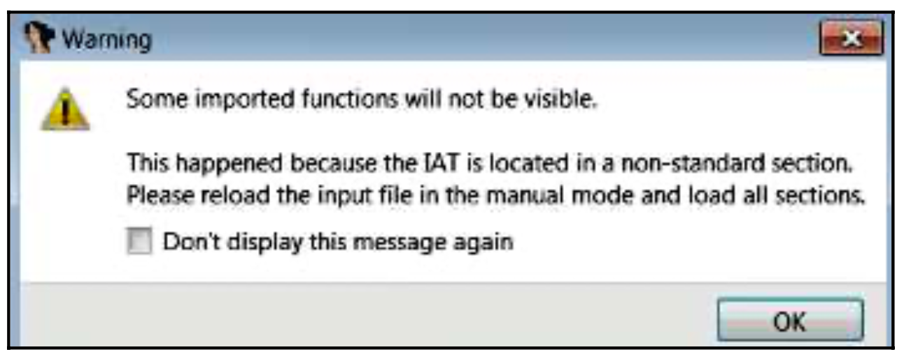

该二进制文件仅由一个内置函数和5个导入函数组成；所有这些指标都表明，该二进制文件是打包的。

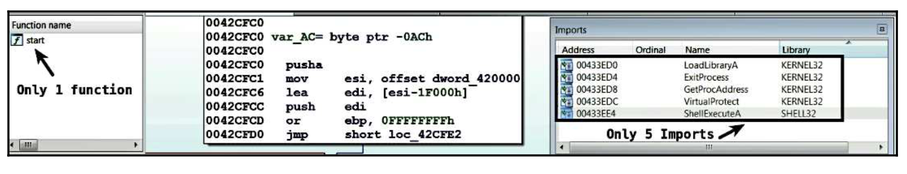

为了找到OEP，你需要在打包的程序中找到将控制权转移到OEP的指令。根据打包程序的不同，这可能很简单，也可能很有挑战性；通常你会关注那些将控制权转移到一个不明确目的地的指令。检查打包的二进制文件中的函数流程图，可以看到跳转到一个位置，这个位置被IDA用红色标出。

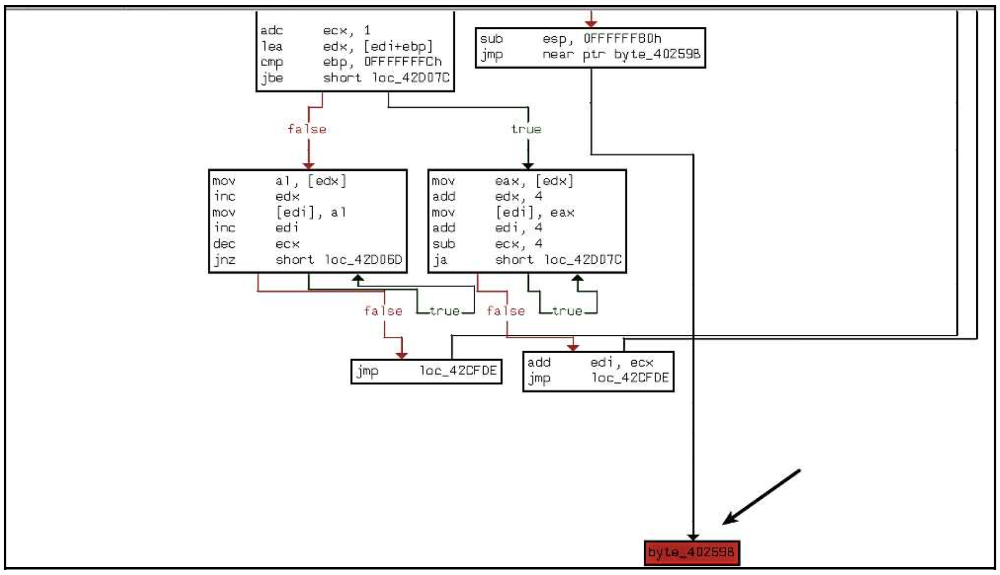

红色是IDA表示它不能分析，因为跳转目的地不明确。下面的屏幕截图显示了跳转指令。

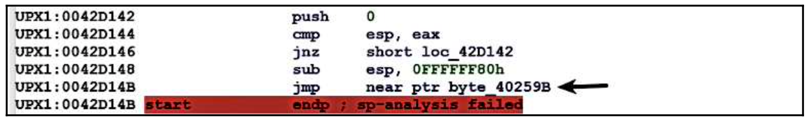

双击跳转目的地（byte_40259B）显示，跳转将被带到UPX0（从UPX1）。换句话说，执行时，恶意软件在UPX1中执行解压存根，解开原始二进制文件，复制UPX0中的解压代码，而跳转指令很可能将控制权转移到UPX0中的解压代码（从UPX1）。

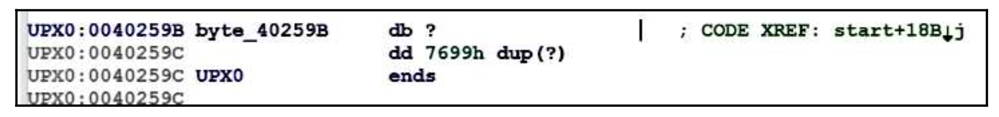

在这一点上，我们已经找到了我们认为会跳转到OEP的指令。下一步是在调试器中加载二进制文件，在执行跳转的指令处设置断点，并执行到该指令为止。为了做到这一点，二进制文件被加载到x64dbg中（你也可以使用IDA调试器并遵循同样的步骤），并设置断点，执行到跳转指令。如下面的截图所示，在该跳转指令处暂停执行。

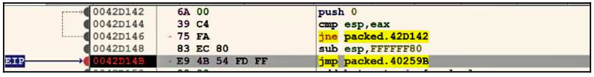

现在你可以假设恶意软件已经完成了解包；现在，你可以按一次F7（步入），这将带你到地址0x0040259B的原始入口点。在这一点上，我们是在恶意软件的第一个指令（解包后）。

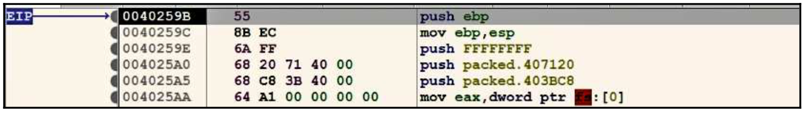

##### 4.1.2 用Scylla卸载进程内存

现在我们已经找到了OEP，下一步是将进程内存转储到磁盘。为了转储进程，我们将使用一个名为Scylla（https://github.com/NtQuery/Scylla）的工具；它是一个转储进程内存和重建导入地址表的伟大工具。x64dbg的一大特点是它集成了Scylla，可以通过点击插件|Scylla（或Ctrl+I）启动Scylla。要转储进程内存，当执行在OEP处暂停时，启动Scylla，确保OEP字段被设置为正确的地址，如下所示；如果没有，你需要手动设置，并点击转储按钮，将转储的可执行文件保存到磁盘（在这个例子中，它被保存为packed_dump.exe）。


现在，当你把转储的可执行文件加载到IDA时，你会看到整个内置函数列表（之前在打包的程序中是看不到的），函数代码也不再被混淆，但仍然看不到导入，API调用显示的是地址而不是名字。为了克服这个问题，你需要重建打包后的二进制文件的导入表。
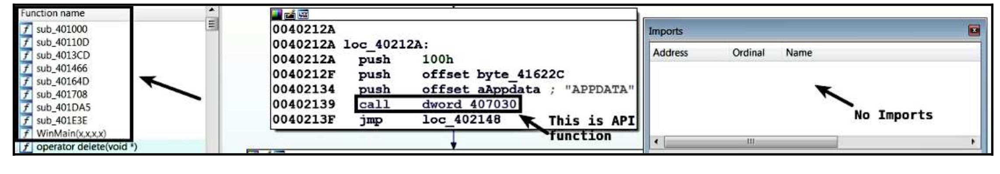

##### 4.1.3 修复导入表

要修复导入表，回到Scylla，并点击IAT自动搜索按钮，它将扫描进程的内存以找到进口表；如果找到，它将用适当的值填充VA和大小字段。要获得导入的列表，请点击Get Imports按钮。使用这种方法确定的导入函数的列表显示在这里。有时，你可能会注意到结果中的无效条目（条目旁边没有勾号）；在这种情况下，右击这些条目，选择Cut Thunk来删除它们。
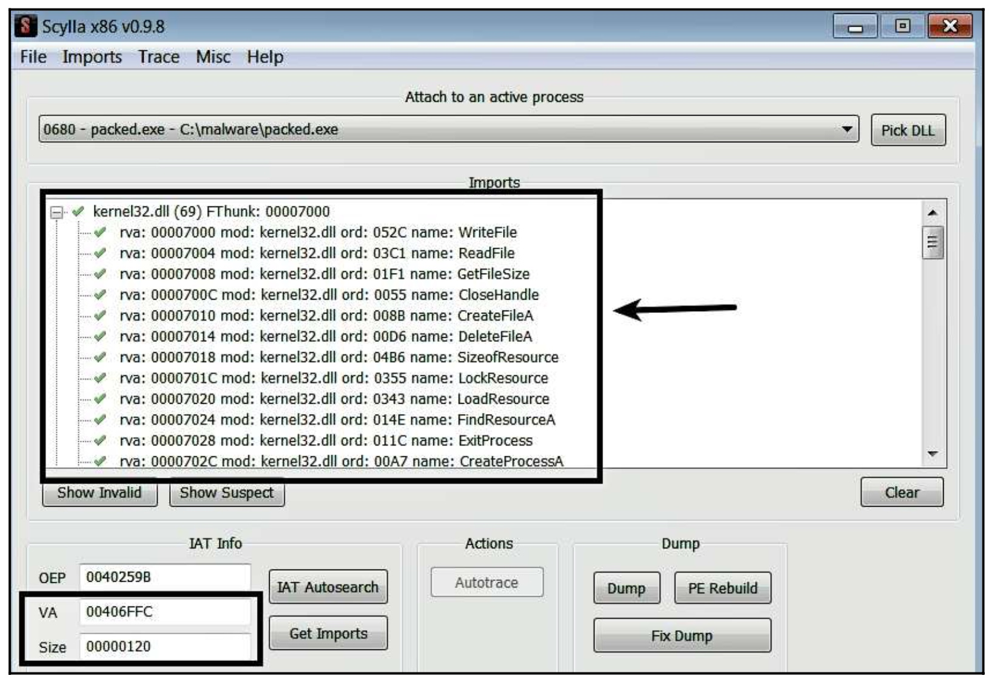

在使用上一步确定导入的功能后，你需要将补丁应用到转储的可执行文件（packed_dump.exe）中。要做到这一点，点击Fix Dump按钮，这将启动文件浏览器，你可以选择你之前转储的文件。Scylla将用确定的导入函数修补二进制文件，并将创建一个新的文件，文件名在末尾含有_SCY（如packed_dumped_SCY.exe）。现在，当你在IDA中加载打过补丁的文件时，你会看到对导入函数的引用，如图所示。
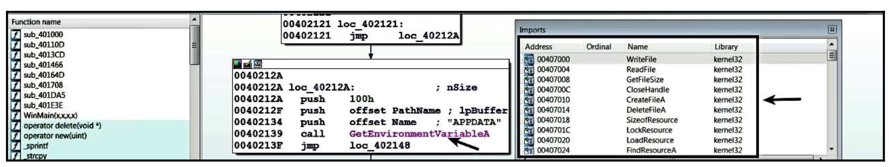

> 当你处理一些打包器时，Scylla中的IAT自动搜索按钮可能无法找到模块的导入表；在这种情况下，你可能需要付出一些额外的努力，手动确定导入表的开始和导入表的大小，并在VA和大小字段中输入。


#### 4.2 自动拆包
有各种工具可以让你解开用UPX、FSG和AsPack等常见打包器打包的恶意软件。自动工具对于已知的打包器是很好的，可以节省时间，但请记住，它可能并不总是有效的；这时，手动解包技能将有所帮助。ReversingLabs的TitanMist（https://www.reversinglabs.com/open-source/titanmist.html）是一个伟大的工具，由各种打包器签名和解包脚本组成。在你下载并解压后，你可以使用这里显示的命令针对打包的二进制文件运行它；使用-i，你指定输入文件（打包文件），而-o指定输出文件名，-t指定解包器的类型。在后面提到的命令中，TitanMist是针对用UPX打包的二进制文件运行的；注意它是如何自动识别打包器并执行解包过程的。该工具自动识别了OEP和导入表，转储了进程，修正了导入，并将补丁应用到转储的进程中。


```
C:\TitanMist>TitanMist.exe -i packed.exe -o unpacked.exe -t python
Match found!
│ Name: UPX
│ Version: 0.8x - 3.x
│ Author: Markus and Laszlo
│ Wiki url: http://kbase.reversinglabs.com/index.php/UPX │ Description:
   Unpacker for UPX 1.x - 3.x packed files
    ReversingLabs Corporation / www.reversinglabs.com
    [x] Debugger initialized.
    [x] Hardware breakpoint set.
    [x] Import at 00407000.
    [x] Import at 00407004.
    [x] Import at 00407008.[Removed] [x] Import at 00407118.
    [x] OEP found: 0x0040259B.
    [x] Process dumped.
    [x] IAT begin at 0x00407000, size 00000118. [X] Imports fixed.
    [x] No overlay found.
    [x] File has been realigned.
    [x] File has been unpacked to unpacked.exe. [x] Exit Code: 0.
    █ Unpacking succeeded!
```
另一个选择是使用IDA Pro的通用PE解包器插件。这个插件依赖于对恶意软件的调试，以确定代码何时跳转到OEP。关于这个插件的详细信息，请参考这篇文章（https://www.hex-rays.com/products/ida/support/tutorials/unpack_pe/unpacking.pdf）。要调用这个插件，将二进制文件加载到IDA，并选择Edit | Plugins | Universal PE 解包器。运行该插件可以在调试器中启动程序，并且它试图暂停程序，只要打包器完成解包。在IDA中加载UPX打包的恶意软件（与手动解包中使用的样本相同）并启动插件后，会显示以下对话框。在下面的截图中，IDA将开始地址和结束地址设置为UPX0部分的范围；这个范围被视为OEP范围。换句话说，当执行到这一段时（从UPX1开始，它包含解压存根），IDA将暂停程序的执行，给你一个机会采取进一步的行动。
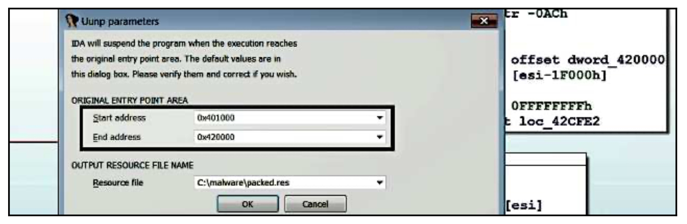
在下面的截图中，注意IDA是如何自动确定OEP地址，然后显示以下对话框的。

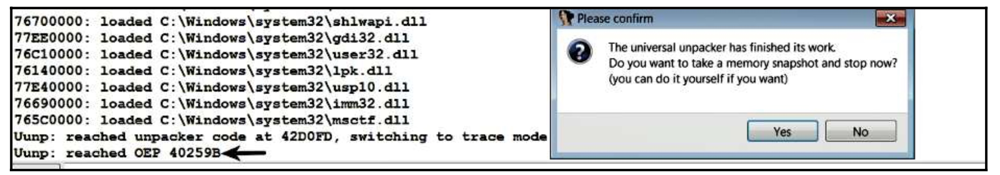

如果你点击 "是 "按钮，执行将被停止，进程将被退出，但在此之前，IDA将自动确定导入地址表（IAT），它将创建一个新段来重建程序的导入部分。在这一点上，你可以分析解压后的代码。下面的屏幕截图显示了新重建的导入地址表。
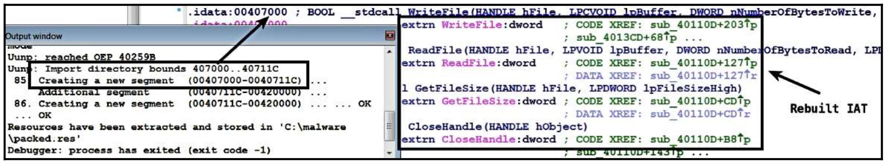

如果你不点击YES按钮，而是点击No按钮，那么IDA将在OEP处暂停调试器的执行，在这一点上，你可以调试已解压的代码或手动转储可执行文件，通过输入适当的OEP（如第4.1节手动解压），使用Scylla等工具修复导入。
在x64dbg中，你可以使用解包脚本执行自动解包，这些脚本可以从https://github.com/x64dbg/Scripts。要解包，确保二进制文件被加载并在入口点暂停。根据你所处理的打包器，你需要在脚本窗格上点击右键，然后选择加载脚本|打开（或Ctrl + O）来加载相应的解包脚本。下面的屏幕截图显示了UPX解包器脚本的内容。

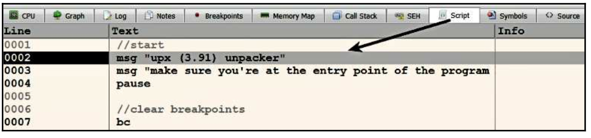

加载完脚本后，通过右键点击脚本窗格并选择运行来运行该脚本。如果脚本成功解压，就会弹出一个消息框说脚本完成了，执行将在OEP处暂停。下面的截图显示了运行UPX解包脚本后，在OEP处自动设置的断点（在CPU窗格中）。现在，你可以开始调试解压后的代码，或者你可以使用Scylla来转储进程并修复导入的代码（如4.1节手动解压中所述）。
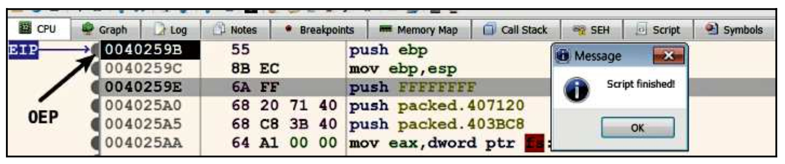
> 除了前面提到的工具外，还有其他各种资源可以帮助你进行自动解包。参见Ether Unpack Service: http://ether.gtisc.gatech.edu/web_unpack/, FUU（Faster Universal Unpacker）: https://github.com/crackinglandia/fuu。

### 总结
恶意软件作者使用混淆技术来掩盖数据，并从安全分析人员那里隐藏信息。在这一章中，我们研究了恶意软件作者常用的各种编码、加密和打包技术，我们还研究了不同的策略来消除数据的混淆。在下一章中，你将被介绍到内存取证的概念，你将了解如何使用内存取证来调查恶意软件的能力。

