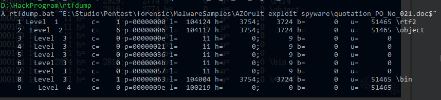

基础的静态分析可以考虑直接使用各公司平台产品分析产出，这里根据国外的习惯使用一些基本工具脚本进行相关分析的基础工作梳理。
<!--more-->
> 本系列主要内容来自《K A, Monnappa. Learning Malware Analysis: Explore the concepts, tools, and techniques to analyze and investigate Windows malware (pp. 95-96). Packt Publishing. Kindle 版本. 》的记录

## 静态分析
静态分析不执行程序，从二进制文件获取信息。
静态分析主要包含：
	识别目标样本框架
	恶意文件指纹
	使用反病毒引擎扫描可疑二进制文件
	提取字符，函数或使用file获取目标相关数据
	确定在文件分析过程中的混淆技术
	分类对比恶意文件样本

#### 0x01 确定文件类型
##### 手动方式识别文件类型
工具：
Windows systems, HxD hex editor  (https://mh-nexus.de/en/hxd/)
Linux systems, to look for the file signature, the ```xxd``` command can be used.
##### 工具方式识别文件类型
On Windows, CFF Explorer, part of Explorer Suite (http://www.ntcore.com/exsuite.php), can be used to determine the file type; windows下也可以在网上找到file.exe，通过file进行文件类型识别。
Linux system，the ```file``` command can be used.
##### python方式识别文件类型
python-magic模块
pip install python-magic
```python
import magic
figlet =""
m=magic.open(magic.MAGIC_NONE)
m.load()
try:
    ftype=m.file(sys.argv[1])
    print ftype
except Exception as e:
    figlet = '''File type               Author XT.        '''
    print figlet+"\nUsage: python filemagic.py <file>"
```
Test success on Python 2.7.13 Windows10:
```python
import magic
import sys,os
figlet =""
try:
    file=sys.argv[1]
except Exception as e:
    print "[Debug]Error :"+str(e)
    sys.exit()
if os.path.exists(file):
    try:
        m=magic.from_file(file)
        print m
    except Exception as e:
        print "[Debug]Error :"+str(e)
else:
    figlet = '''File type               Author XT.        '''
    print figlet+"\nUsage: python filemagic.py <file>"
    print "[Error]No such file or directory:", file
    sys.exit()
```
#### 0x02 恶意软件指纹
恶意软件的hash
恶意软件释放的新样本的hash
##### 使用工具获取hash
Linux使用the md5sum, sha256sum, and sha1sum
windows使用HashMyFiles (http://www.nirsoft.net/utils/hash_my_files.html)
##### 使用python获取hash
```python
import hashlib
import sys,os
# https://docs.python.org/2/library/hashlib.html
try:
    file=sys.argv[1]
except Exception as e:
    print "[Debug]Error :"+str(e)
    sys.exit()
if os.path.exists(file):
    try:
        content = open(file,"rb").read()
        print "md5:"+hashlib.md5(content).hexdigest()
        print "sha1:"+hashlib.sha1(content).hexdigest()
        print "sha256:"+hashlib.sha256(content).hexdigest()
    except Exception as e:
        print "[Debug]Error :"+str(e)
else:
    figlet = '''File hash               Author XT.        '''
    print figlet+"\nUsage: python filehash.py <file>"
    print "[Error]No such file or directory:", file
    sys.exit()
```
#### 0x03 病毒扫描
##### virustotal检测
通过多种病毒扫描引擎扫描结果帮助我们更好判断文件样本情况，节约我们分析的时间。
VirusTotal (http://www.virustotal.com)
详情：https://support.virustotal.com/hc/en-us/articles/115005002585-VirusTotal-Graph.
https://support.virustotal.com/hc/en-us/articles/115003886005-Private-Services

```python
import urllib
import urllib2
import json
import sys
hash_value = sys.argv[1]
vt_url = "https://www.virustotal.com/vtapi/v2/file/report"
api_key = "<virustotal api>"
parameters = {'apikey': api_key, 'resource': hash_value}
encoded_parameters = urllib.urlencode(parameters)
request = urllib2.Request(vt_url, encoded_parameters)
response = urllib2.urlopen(request)
json_response = json.loads(response.read())
if json_response['response_code']:
    detections = json_response['positives']
    total = json_response['total']
    scan_results = json_response['scans']
    print "Detections: %s/%s" % (detections, total)
    print "VirusTotal Results:"
    for av_name, av_data in scan_results.items():
        print "\t%s ==> %s" % (av_name, av_data['result'])
else:
    print "No AV Detections For: %s" % hash_value
```
利用virustotal hunter功能yara规则抓样本
https://bbs.pediy.com/thread-223070.htm
##### alienvault检测
使用alienvault进行威胁检测：
开发sdk:(https://github.com/AlienVault-OTX/OTX-Python-SDK)
API介绍: (https://otx.alienvault.com/api)
sdk中example文件中is_malicious有个已经集成了的用于检测威胁的脚本，可以借助其进行是否存在恶意检测。
https://github.com/AlienVault-OTX/OTX-Python-SDK/blob/master/examples/is_malicious/is_malicious.py 

otx.bat

```python
#!/usr/bin/env python
#  This script tells if a File, IP, Domain or URL may be malicious according to the data in OTX

from OTXv2 import OTXv2
import argparse
import get_malicious
import hashlib


# Your API key
API_KEY = '<API KEY>'
OTX_SERVER = 'https://otx.alienvault.com/'
otx = OTXv2(API_KEY, server=OTX_SERVER)

parser = argparse.ArgumentParser(description='OTX CLI Example')
parser.add_argument('-ip', help='IP eg; 4.4.4.4', required=False)
parser.add_argument('-host',
                    help='Hostname eg; www.alienvault.com', required=False)
parser.add_argument(
    '-url', help='URL eg; http://www.alienvault.com', required=False)
parser.add_argument(
    '-hash', help='Hash of a file eg; 7b42b35832855ab4ff37ae9b8fa9e571', required=False)
parser.add_argument(
    '-file', help='Path to a file, eg; malware.exe', required=False)

args = vars(parser.parse_args())


if args['ip']:
    alerts = get_malicious.ip(otx, args['ip'])
    if len(alerts) > 0:
        print('Identified as potentially malicious')
        print(str(alerts))
    else:
        print('Unknown or not identified as malicious')

if args['host']:
    alerts = get_malicious.hostname(otx, args['host'])
    if len(alerts) > 0:
        print('Identified as potentially malicious')
        print(str(alerts))
    else:
        print('Unknown or not identified as malicious')

if args['url']:
    alerts = get_malicious.url(otx, args['url'])
    if len(alerts) > 0:
        print('Identified as potentially malicious')
        print(str(alerts))
    else:
        print('Unknown or not identified as malicious')

if args['hash']:
    alerts =  get_malicious.file(otx, args['hash'])
    if len(alerts) > 0:
        print('Identified as potentially malicious')
        print(str(alerts))
    else:
        print('Unknown or not identified as malicious')


if args['file']:
    hash = hashlib.md5(open(args['file'], 'rb').read()).hexdigest()
    alerts =  get_malicious.file(otx, hash)
    if len(alerts) > 0:
        print('Identified as potentially malicious')
        print(str(alerts))
    else:
        print('Unknown or not identified as malicious')

```


#### 0x04 OFFICE分析
工具包 git clone https://github.com/decalage2/oletools.git
或者这样安装：
- On Linux/Mac: `sudo -H pip install -U oletools`
- On Windows: `pip install -U oletools`
帮助文档：https://github.com/decalage2/oletools/wiki
##### rtfobj分析
https://github.com/decalage2/oletools/wiki/rtfobj
http://decalage.info/rtf_tricks
rtf格式判断：
文档内容：“{\ rtvpn”。通常，RTF文件应以“{\ rtfN”开头，其中N标识RTF文档的主要版本；




###### shellcode 混淆

使用自定义脚本提取关键内容
```
paul@lab:~$ cat decode.py
#!/usr/bin/python
 
import sys
import os
 
file = open(sys.argv[1], 'r')
offset = int(sys.argv[2])
key = 0x00
file.seek(offset)
 
while offset <= os.path.getsize(sys.argv[1])-1:
   data = ord(file.read(1)) ^ key
   sys.stdout.write(chr(data))
   offset = offset+1
   key = (key + 1) & 0xFF
file.close()
 
 
paul@lab:~$ cat decode2.py
#!/usr/bin/python
 
import sys
import os
 
file = sys.stdin
sys.stdout.write(file.read(9))
offset = 9
 
while file:
   data = file.read(1)
   if not data:
      break
   offset = offset+1
   data2 = file.read(1)
   offset = offset+1
   if offset <= 512:
      sys.stdout.write(data2)
      sys.stdout.write(data)
   else:
      sys.stdout.write(data)
      sys.stdout.write(data2)
```

参考文章：
http://www.sekoia.fr/blog/ms-office-exploit-analysis-cve-2015-1641/
http://www.reconstructer.org/papers.html

#### 0x05 dns分析
##### PTR记录反查
http://www.ptrrecord.net/ 
PTR记录通常用于指向邮件服务器DNS主机A记录，因此其IP与主站IP相同，攻击者通过此记录尝试隐藏域名。
