## 使用IDA反汇编
代码分析常用语了解恶意样本内部源码不可见时使用。

### 1. 代码分析工具

代码分析工具可以根据他们的功能、描述、数量进行分类。
反汇编程序是一个可以将机器语言转汇编代码；并且可以静态代码分析。静态代码分析可以在不执行二进制程序的时候让你了解到程序的行为。

一个调试器是个应用程序同时也是可以反汇编代码；除此之外也可以执行控制汇编二进制执行。使用调试工具，你不仅可以执行单条指令，或选择函数，或执行整个程序。调试工具可以动态分析，还可以在程序执行的过程中检查可疑的二进制。

反编译器是一个将机器码转成更高级语言的程序（伪代码）。反编译器能够很好辅助反推工程进程并能够简化工作。

### 2. 静态代码分析（使用IDA反汇编）
Hex-Rays IDA pro
https://www.hex-rays.com/products/ida/
IDA是最有影响力且流行的商业反编译调试工具；常被用于逆向工程，恶意病毒分析以及脆弱性研究。IDA可以运行在不同平台（macOS、Linux和windows）支持分析不同的文件类型（PE/ELF/Macho-O）。除商业版本之外，IDA还提供2个其他版本：IDA demo版本（评估版本）和IDA免费版本；两个版本都有一定的限制，都可以反编译32和64位windows程序，但是免费版无法调试二进制，demo版本无法调试64位二进制，demo版本也无法保存数据库，并且demo版本和免费版都无法支持IDApython。

本部分和下一部分将会看下IDA pro的特征，并且使用IDA施行静态代码分析。这一部分仅包含与恶意代码分析相关的功能。
> IDA相关深入了解图书推荐《The IDA Pro Book》by Chris Eagle


#### 2.1 在IDA中加载二进制
IDA会像windows一样加载文件到内存中。IDA可以通过判断文件头确定最可能适合的加载器。在选择文件后IDA会加载对话框，用于确认合适的加载起和进程类型。文件设置（file option）选项是用于加载未识别的文件，一般使用该选项处理shellcode。默认情况下IDA不会在反编译中加载PE头和源部分。通过使用手动加载checkbox选项，可以手动选择加载基址和加载位置，IDA将会在加载的每个部分包括PE头给予相应的提示。点击OK，IDA将文件加载到内存，并且开始反编译相关代码。

#### 2.2 扩展IDA显示
IDA桌面版结合了很多静态分析工具的特征到一个单独特窗口中。下面将对IDA卓敏啊版和它不同窗口进行介绍。其包含多个不同的标签（IDA View,Hex View-1,等等），也可以通过点击添加标签按钮或者点击View/open subviews菜单进行添加。
##### 2.2.1 反汇编窗口
当二进制文件被加载，IDA展示的窗口就是反汇编编辑窗口（也叫做IDA-view窗口），这是个主要窗口，用于分析和展示反汇编代码，并且可以用于分析反汇编二进制。
IDA可以使用两个模式展示反编译的代码：Graph view（graph diassembly view）和Text view（实际应该叫text diassembly view）,默认进入的是graph view，这里可以使用空格快捷键进行切换。

在graph view模式下，IDA一次只显示一个函数，在一个流程图的窗口中函数在基本块区中断。这个模式可以快速识别分支和循环生命。在Graph view模式下，颜色和箭头的指示方向都是根据判断显示的。条件跳转使用红色和绿色的箭头，true条件用绿色箭头表示，false使用红色箭头表示。蓝色的箭头是被用来表示无条件跳转，循环使用的是向上的蓝色的箭头表示。在graph view中虚拟地址默认不显示（每个基础块仅显示最基本的信息展示）。如果需要显示虚拟地址信息，需要点击Options/general然后点击Line prefixes以启用。
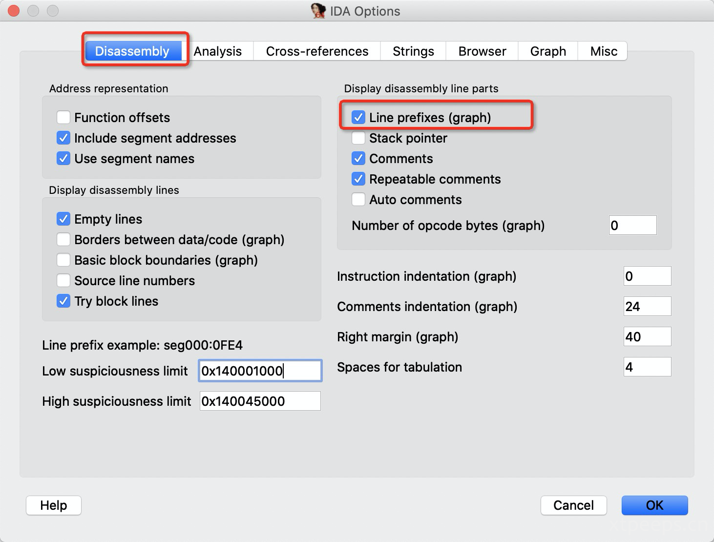

下图中可以观察到条件跳转中，绿色箭头（条件true）进行跳转，对应的虚拟地址也是跳转，而红色箭头指向正常的数据流，虚拟地址为连续。
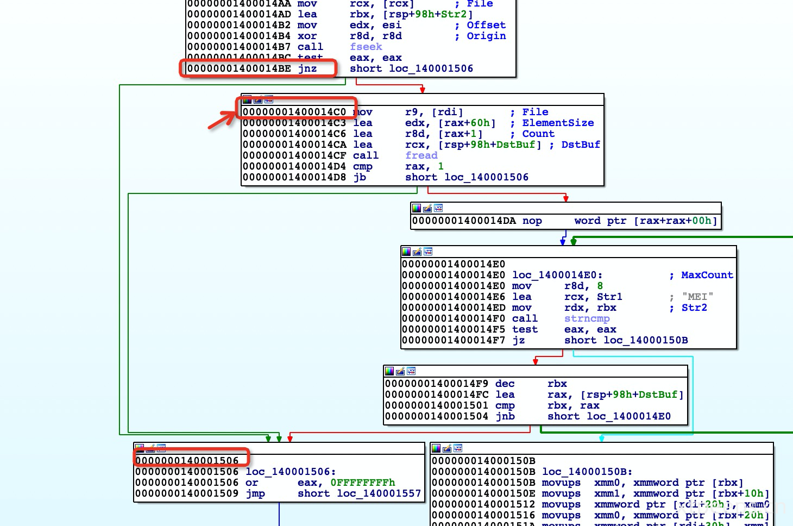

在text view模式中，整个反编译目前处于线性方式展示。整个虚拟地址默认展示，```<section name>:<virtual address>```格式。在text view窗口中最左边的部分被称为箭头窗口，用于展示程序的非线性流。虚线箭头代表条件跳转，实线箭头表示无条件跳转，加粗的箭头表示循环。


##### 2.2.2 函数窗口function widnow
函数窗口显示所有IDA识别出来的函数，该床扣同时也显示每个函数可以被找到的虚拟地址，每个函数的大小，以及其他函数相关信息。双击可以定位跳转到对应函数的位置。每个函数与大量的标志相关联（例如R、F、L等等标志）。通过F1按钮可以获取更多关于相关标志的帮助信息。一个有用的标志L标志，代表函数的库函数。库函数是编译器产生而非恶意软件作者编写的函数；从代码分析的角度来看，恶意样本分析的重点应该在恶意代码上，而不是库函数本身。

##### 2.2.3 输出窗口out window
输出窗口展示的是IDA以及IDA插件输出的相关信息。这些对于分析恶意样本以及样本对系统操作分析提供很多信息。可以通过查看输出在output窗口的内容可以获取IDA执行加载过程中的相关信息。
##### 2.2.4 十六进制窗口Hex view window
通过点击HexView-1标签可以展示Hex窗口。Hex窗口可以展示一系列的十六进制转储内容以及ASCII字符。默认情况下，十六进制窗口（hex window）。默认情况下十六进制窗口同步反编译窗口（disassembly window）内容；也就是在反汇编窗口中选择了一部分字节的数据，相应的在十六进制窗口中同样的会进行标记高亮相关的内容，这对于标记内存地址很有帮助。
##### 2.2.5 结构窗口structures window
点击structures windows标签，可以进入借口窗口。结构窗口展示程序使用的标准的数据结构，并且允许创建自建的数据结构。
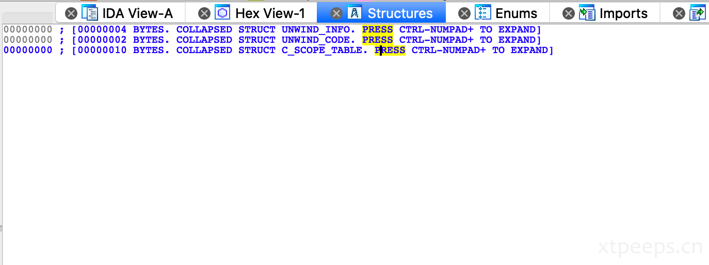

##### 2.2.6 引用窗口imports window

引用窗口是所有二进制程序引用的函数的列表。展示了引用的函数以及相关函数引用的库函数内容。
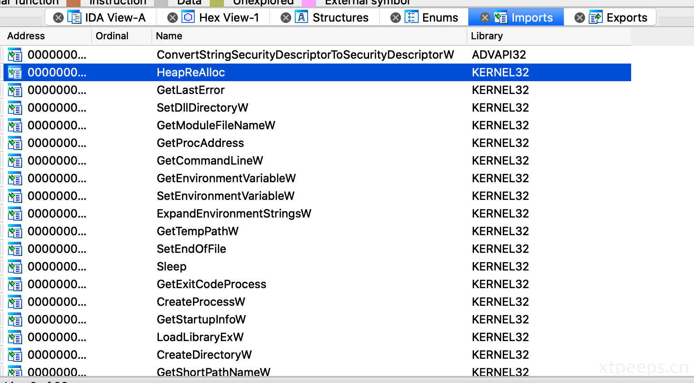

##### 2.2.7 出口窗口exports window
出口窗口展示的是程序出口函数的列，出口函数通常在DLL动态链接库中，因此对于分析恶意样本DLL时有用。
##### 2.2.8 字符窗口string window
IDA默认不展示字符窗口，你可以通过点击view/open subviews/strings（或者使用Shift+F12快捷方式打开）字符窗口。字符窗口展示的是从二进制和地址中能够发现字符列表。默认情况下，字符窗口仅展示长度不小于5的null-terminated ASCII字符串。有些恶意样本的二进制使用的是UNICODE字符。可以通过配置IDA显示不同的字符，右击Setup（或者Ctrl+U）检测Unicode C-style（16比特），点击ok即可。
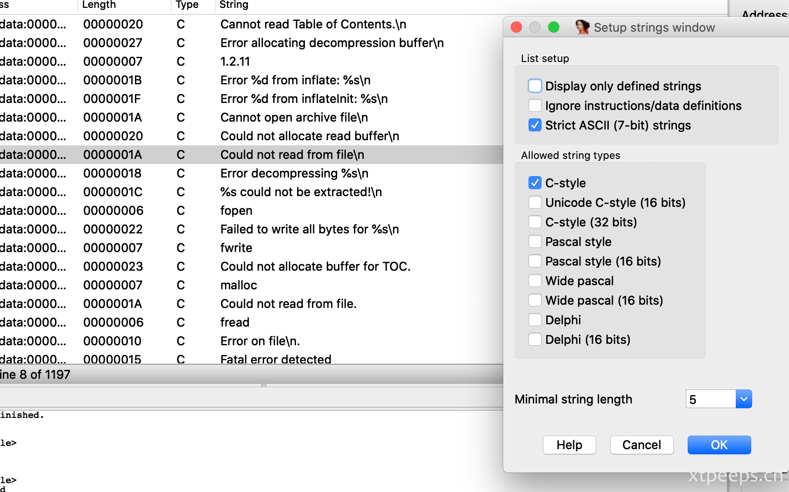

##### 2.2.9 段窗口segments window
段窗口可以通过view/open subviews/segments（或者使用shift+F7开启）。段窗口是展示（.text,.data等等）部分内容的列表。显示信息包括开始地址，以及结束地址，每个部分的内存权限。开始和结束的地址都有每个部分的虚拟地址的详细说明，可用于定位对应内存中的位置。

#### 2.3 使用IDA提高反汇编
本部分将结合之前相关的知识内容进行反编译分析。考虑下面一个小程序从一个本地函数拷贝到另外一个变量中：
```
int main()
{
int x=1;
int y;
y=x;
return 0;
}
```
 以上代码编译之后在IDA反汇编之后如下：
```
 .text:00401000 ; Attributes: bp-based frame ➊
.text:00401000
.text:00401000 ; ➋ int __cdecl main(int argc, const char **argv, const char **envp)
.text:00401000  ➐ _main proc near
.text:00401000
.text:00401000    var_8= dword ptr -8  ➌
.text:00401000    var_4= dword ptr -4  ➌
.text:00401000    argc= dword ptr 8   ➌
.text:00401000    argv= dword ptr 0Ch  ➌
.text:00401000    envp= dword ptr 10h  ➌
.text:00401000
.text:00401000    push ebp  ➏   
.text:00401001    mov ebp, esp  ➏
.text:00401003    sub esp, 8  ➏ .text:00401006    mov ➍ [ebp+var_4], 1
.text:0040100D    mov eax, [ebp+var_4] ➍
.text:00401010    mov ➎ [ebp+var_8], eax
.text:00401013    xor eax, eax 
.text:00401015    mov esp, ebp  ➏
.text:00401017    pop ebp  ➏
.text:00401018    retn
```
当加载可执行之后，IDA在每一个函数执行分析，反汇编确定栈框架。除此之外，使用大量的签名和运行特殊算法匹配提供IDA识别反汇编函数。注意到➊在执行过初始化分析之后，IDA添加了一个批注，用分号开头；这意味着ebp寄存器被局部变量和函数参数使用（前章节提到的函数在ebp堆栈寄存器基址中）。在➋中，IDA使用其规则可以确定main函数并添加在关于此函数的批注，这一特点可以用于确定函数需要接收多少个参数，以及参数的类型。

在➌中，IDA提供了一个总的栈的视角，IDA能够判断局部变量和函数参数。在主函数中IDA定义两个局部变量，并自动命名为var_4和var_8并分别赋值。-4和-8对应着与dbp（框架指针）的距离。➍和➎是IDA替换[ebp-4]与[ebp-8]的内容。

IDA会自动对变量或参数进行命名，并在代码中应用这些名称；IDA标记的var_xxx和arg_xxx可以节约人工标记并替换参数的工作，并便于识别变量名和参数。

function prologue, funcktion epilogue和在➏中用于分配的空间给局部变量的指令可以简易的忽略。这些函数仅用于设定函数的环境。梳理之后汇编代码简化为：
```
.text:00401006    mov [ebp+var_4], 1
.text:0040100D    mov eax, [ebp+var_4]
.text:00401010    mov [ebp+var_8], eax
.text:00401013    xor eax, eax
.text:00401018    retn
```
##### 2.3.1 重命名地址
当分析恶意病毒的时候，可以将这些变量或函数改成更有意义的名字。有劲啊变量或者参数名，选择重命名（rename或者按快捷键“N”）。当重命名之后IDA将会同步新名字到与其相关的项目上。通过重命名可以给予变量或函数更加有意义的名字。
```
.text:00401006    mov [ebp+x], 1
.text:0040100D    mov eax, [ebp+x]
.text:00401010    mov [ebp+y], eax
.text:00401013    xor eax, eax
.text:00401018    retn
```
##### 2.3.2 IDA标注功能
标注对于提示某一函数的作用很有帮助。为了添加一个合规的注释，首先将光标放在任何一个反编译列表里的一行中，然后使用快捷键（“:”），通过在新的对话框中填写相关信息并确定，完成相关备注。
```
.text:00401006    mov [ebp+x], 1
.text:0040100D    mov eax, [ebp+x]
.text:00401010    mov [ebp+y], eax
.text:00401013    xor eax, eax
.text:00401018    retn
```
常规的备注对于单行描述但行比较有用（多行也可以），但是如果可以把描述汇总到一起描述，类似主函数的描述就更好了。IDA提供了另一种备注，函数备注，允许组合备注，并且可以显示在函数反汇编列中。首先选择函数所在的虚拟地址，然后通过快捷键“:”添加备注即可，这里为sub_140001230，伪代码添加函数备注。可以看到这些备注与函数使用相同的虚拟地址。
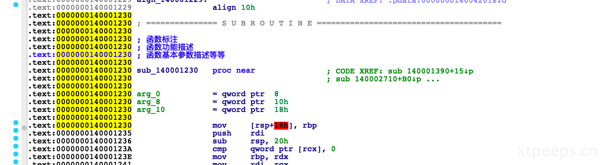

当前相关修改参数变量名称、添加备注的名称都只保存在IDA的数据库中，并没有保存在二进制可执行文件中。

##### 2.3.3 IDA 数据库
当可执行文件加载到IDA中，就会在工作目录中创建一个数据库该数据库一共包含5个文件（扩展名为：.id0,.id1,.nam,.id2以及.til）。每一个文件保存了大量的与可执行文件匹配的相关信息。这些文件被压缩和归档到以.idb（32进制）压缩文件中。当加载可执行程序后，从中读取创建信息保存在数据库中。大量的信息展都保存在数据库中以用于展示代码分析时有用的信息。任何的修改操作（如重命名，注释批注等等）都会显示在view中并且般存在数据库中，但是这些修改并不会修改原二进制文件。你可以通过关闭IDA保存数据库；当关闭IDA的时候将会提示是否保存数据库的提示框。默认情况下数据库包配置（默认配置）会将所有文件保存在IDB（.idb）或者i64（.i64）。当重新打开.idb或者.i64文件的时候，会看到重命名的变量和标注都在。

下面通过另一个简单的程序了解IDA的其他扩展特征。全局变量a、b，在主函数中赋值。参数x、y以及string为局部变量；a赋值给x，y和string都是保存的地址。
```
int a;
char b;
int main()
{
   a = 41;
   b = 'A';
   int x = a;
   int *y = &a;
   char *string = "test";
   return 0;
} 
```
程序转化为下面的反汇编列表。IDA也定义了全局变量和匹配名字例如dword_403374和byte_403370；记录如何补充内存地址并且在全局变量中被关联。当一个变量被定义之后在全局数据区域，对编译器来说变量的地址和变量的大小是明确的。全局的假的变量名被IDA详细知名变量的地址以及他们确切的数据类型。例如dword_403374则是说地址为0x403374可以接受dword（4bytes大小）的值。

IDA使用offset关键字表示变量地址被使用（而不是现实他们的值），当var_8、var_c被分配局部变量值时，可以认为他们被分配了值（指针变量值）。IDA使用aTest给地址确定字符（字符变量），这个名用于表示字符串，test用于添加批注，
```
.text:00401000    var_C= dword ptr -0Ch  ➊ 
.text:00401000    var_8= dword ptr -8  ➊ 
.text:00401000    var_4= dword ptr -4  ➊ 
.text:00401000    argc= dword ptr 8
.text:00401000    argv= dword ptr 0Ch
.text:00401000    envp= dword ptr 10h
.text:00401000
.text:00401000    push ebp
.text:00401001    mov ebp, esp
.text:00401003    sub esp, 0Ch
.text:00401006    mov ➋ dword_403374, 29h  
.text:00401010    mov ➌ byte_403370, 41h  
.text:00401017    mov eax, dword_403374  ➍ 
.text:0040101C    mov [ebp+var_4], eax
.text:0040101F    mov [ebp+var_8], offset dword_403374  ➎ 
.text:00401026    mov [ebp+var_C], offset aTest ; "test"  ➏
.text:0040102D    xor eax, eax
.text:0040102F    mov esp, ebp
.text:00401031    pop ebp
.text:00401032    retn
```

##### 2.3.4 格式化转化操作数
在➋和➌中操作数(29h和41h)代表16进制格式数值，然而在源码中我们使用十进制的41和字符“A”。IDA可以将16进制值编码为十进制、八进制、二进制。ASCII也可以转为字符型。例如，如果要修改41h格式的值，右击在这个值上选择即可。
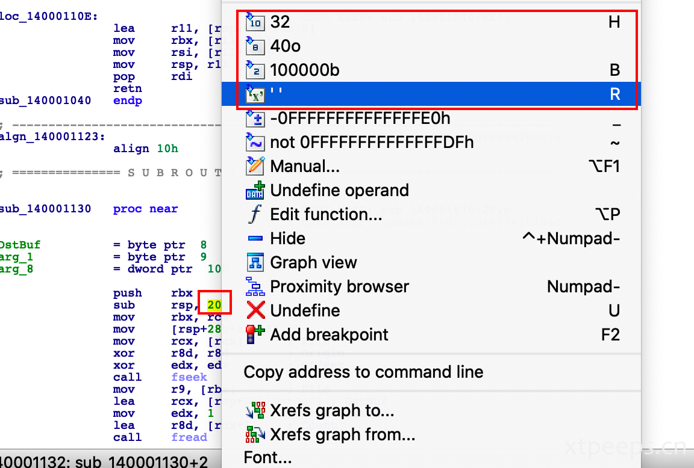

##### 2.3.5 导航地址

IDA的另一个特征是可以在程序中导航任意地址更加方便。当程序被反编译，IDA就会标记每一个程序中的地址，双击字符则会在显示中跳转到对应字符所在的位置。如函数名或变量。
IDA保持跟踪导航历史；任何时候被重定向到另外一个地址，都可以使用返回按钮返回之前的地址。
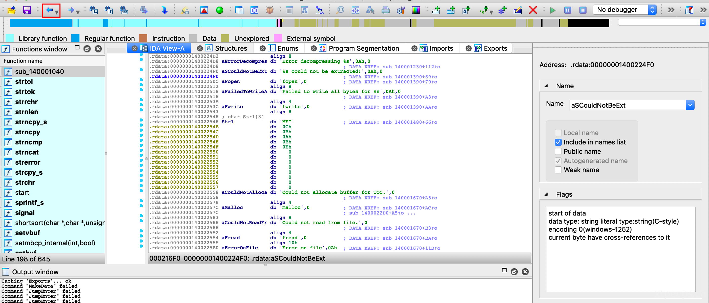
跳转到指定地址可以点击jump/jump to Address（或者使用快捷键G)来跳转到地址。点击OK完成跳转。

##### 2.3.6 交叉参考cross References

其他方式导航是通过交叉参考实现（也称为Xrefs）。交叉参考链接与地址链接关联。交叉参考可以不仅数据交叉，也可以代码交叉参考。

数据交叉参考描述了数据在二进制中如何交互。如➐、➑、➒。例如数据交叉，➑描述的是数据与命令相关联，从主函数开始偏移0x6长度。字符```w```表示一个交叉关联写；代表命令写入内存地址。字符```r```代表读相互关联，代表从内存中读取信息。省略号```...```代表更多相关联，但是他们由于显示限制不能显示。其他种类的关联数据是一个补充（使用o表示），代表地址正在被使用，而不是内容。数组和字符型数组被开始的地址使用，因为字符数据➐被标记为一个参考偏移值。


```
.data:00403000    aTest db 'test',0  ➐; DATA XREF: _main+26o Similarly, double-clicking on the address dword_403374 relocates to the virtual address shown here: .data:00403374     dword_403374 dd ?    ➑; DATA XREF: _main+6w 
.data:00403374                       ➒; _main+17r ...
```

一个代码交叉参考代表一个到另一个的数据流（如jump或者function调用），下面显示的一个c语言的if语句：

```
int x = 0;
if (x == 0)
{
    x = 5;
}
x = 2; 
```

程序反编译如下，jnz反编译为C语言中==条件语句（也就是jne或者jump，if not equal的别名）；执行结束将会执行分支（如➊ to ➋）。jump交叉关联命令➌为jump天转后直行的命令，从主函数偏移0xF。字符```j```表示jump跳转后的结果。这里可以双击（_main+Fj）来改变跳转命令关联的显示。

```
.text:00401004    mov [ebp+var_4], 0
.text:0040100B    cmp [ebp+var_4], 0
.text:0040100F    jnz short loc_401018 ➊
.text:00401011    mov [ebp+var_4], 5
.text:00401018
.text:00401018    loc_401018:  ➌; CODE XREF: _main+Fj
.text:00401018    ➋ mov [ebp+var_4], 2
```

之前的列可以通过按空格键切换视图查看。graph视角对于获取虚拟分支/循环说明特别有用。绿色箭头为跳转条件满足，红色箭头为跳转条件不满足，蓝色箭头为正常部分。

下面针对函数内调用函数的情况来看：

```
void test() { }
void main() {
    test();
}
```

下面是main函数的反汇编列表。```sub_401000```代表了test函数。IDA自动使用```sub_```前缀命函数地址，指向子函数或者函数。例如当看到```sub_401000```（你可以直接把它当作子函数地址sub_401000阅读）。当然这里也可以通过双击函数名定位到函数。

```
.text:00401010    push ebp
.text:00401011    mov ebp, esp
.text:00401013    call sub_401000 ➊
.text:00401018    xor eax, eax
```

在```sub_401000```（test函数）开始处，IDA添加了一处代码交叉关联代码，用于代表这是函数，sub_401000，位于主函数main偏移3的位置，可以通过双击_main+3p跳转到该位置。```p```后缀代标控制器调用地址为（0x401000）函数的结果并继续后续的执行。

```
.text:00401000    sub_401000    proc near ➋; CODE XREF: _main+3p
.text:00401000                  push ebp
.text:00401001                  mov ebp, esp
.text:00401003                  pop ebp
.text:00401004                  retn
.text:00401004    sub_401000    endp
```

##### 2.3.7 列出所有交叉引用

交叉参考可以在审计代码的过程中快速定位字符或者函数的引用。IDA的交叉引用是定位地址的不错的方式，但是只能显示2个参数，因此你不会看到所有的交叉参考。另外```...```代表还有更多的交叉引用。
如果想要列出所有的交叉参考只需要点击地址名然后按X。
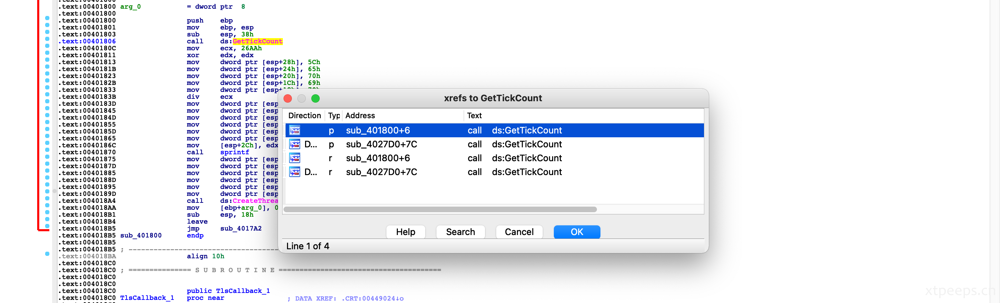       
一个程序通常包含很多函数。一个函数可以被一个或多个函数调用，或者调用一个或多个函数。在样本分析的时候，为了快速浏览一个函数的相关信息，例如在本例中，你可以通过选择view | open subviews | function calls 来获取函数的函数调用情况。如图所示上半部分展示函数被调用情况，下半部分展示函数调用其他函数情况。通过函数调用情况，一般就可以判断这个函数的功能情况。

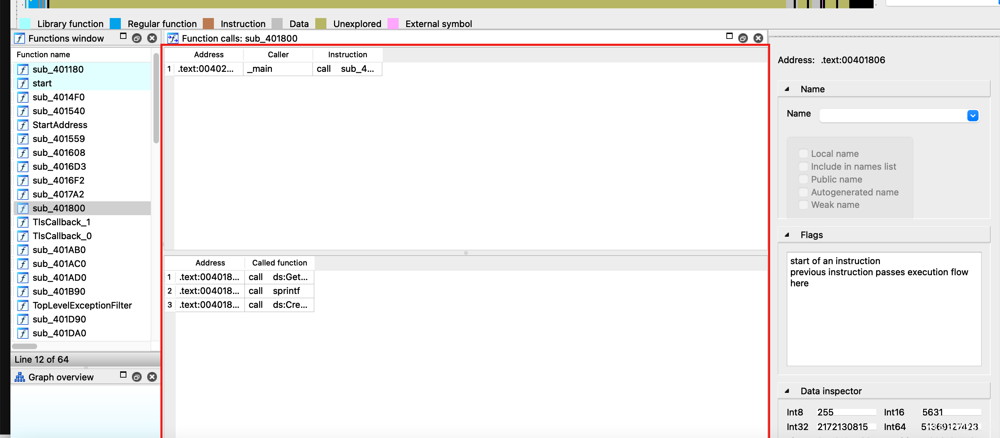

##### 2.3.8 相邻视角和图形化

IDA图形化选项是一个很好的形象化展示交叉引用的方式。在IDA图形化之前，可以使用相邻视角proximity view展示函数调用情况。点击view | open subviews | proximity browser。相邻视角中国呢，函数的数据通过节点以及交叉引用相互关联。你可以通过双击“+”钻入相邻节点函数/子函数，扩展/折叠节点。同时可以通过ctrl+鼠标滑轮，控制放大和缩小。退出相邻视角只需要在空白处右键，选择图形视图后者字符视图即可。

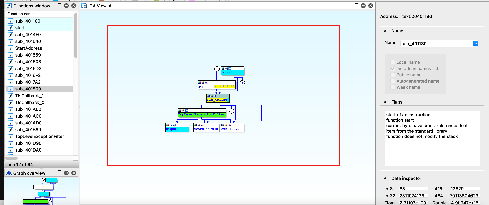

与自带的视图不同，IDA还可以展示第三方应用。要使用这些图形配置，可以右键工具栏，选择Graphs，会显示5个按钮：


通过点击这5个不同的视图，可以分别展示不同的展示方式，但是这5个视图不像图形化和相邻视角基于汇编视图可以交互。下面是不同的图形对应的不同的功能介绍：

|                          图标                           | 描述                                                         |
| :-----------------------------------------------------: | ------------------------------------------------------------ |
|                                  | 展示当前函数的外部流图表。展示的图形与IDA的交互视角很像。    |
|                                  | 展示当前函数的调用视图；这可以用来快速查看程序中函数调用关系情况；但如果程序的函数很多的话，这个视图就会显得非常大，被塞满。 |
|                                  | 这个视图显示一个函数的被交叉引用情况；如果想看一个程序的访问某个函数的不同路径，这个视图就相对比较清晰。 |
|  | 这个视图展示的是一个函数的交叉引用其他函数的情况；可以很清晰的展示函数调用所有其他函数。 |
|                | 这是一个自定义交叉引用视图，这个功能可以允许使用者定义交叉引用的一些视图生成内容和方式。 |

实践IDA的各项功能有助于提高逆向的水平。下面我们将根据windowsAPI影响我们的windows操作系统。我们将学到如何分辨以及解释32位和64位Windows API的功能。


### 3. 反编译windows API

恶意软件通常使用windows API函数影响操作系统（例如文件系统、进程、内存以及网络配置等）。如第二章静态分析和动态分析部分，windows扩展主要依赖文件DLL动态连接库文件。可执行程序的引用和调用来自于大量DLL中的提供不同功能的API。为了调用这些dll文件，需要先将其加载到内存中，然后调用API函数。检查一个恶意样本的dll引用情况可以指导我们分析其功能和能力。下面的表格展示了部分常见的DLL以及其执行功能：

| DLL文件名               | 描述                                                         |
| ----------------------- | ------------------------------------------------------------ |
| Kernel32.dll            | 这个dll扩展出口于进程、内存、硬件、文件系统配置有关。病毒程序从这些dll文件中引入API函数，传输文件系统、内存以及进程相关配置。 |
| Advapi32.dll            | 这是一个与系统服务以及注册表有关的函数。病毒程序通过使用这个dll中的函数来传输系统服务以及注册表相关的配置。 |
| Gdi32.dll               | 有关图形显示的扩展函数库。                                   |
| User32.dll              | 这个库的函数可以用来创建和操纵windows用户的洁面组建，例如窗口、桌面、菜单、消息通知、告警等等。一些病毒程序使用这个dll的函数执行DLL注入，键盘记录，鼠标记录。 |
| msvcrt.dll              | 包含了c语言的标准库函数的执行库。                            |
| Ws2_32.dll和wsock32.dll | 他们呢包含网络连接相关的函数。病毒通过引入这些dll的函数用来执行网络相关的任务。 |
| wininet.dll             | 这个展示使用http和ftp协议的高级函数。                        |
| urlmon.dll              | 这是一个wininet.dll的包装，它通常用来MIME类型连接和下载网络内容。恶意程序downloaders使用这个库里的函数用来下载新病毒程序内容。 |
| NTDLL.dll               | 扩展windows本地API函数和行为作为在用户程序及核心之间的转换器。例如，当一个程序在kernel32.dll（或kernelbase.dll）调用了API函数，API作为返回调用一个短票据在ntdll.dll。程序通常不会直接从ntdll.dll引用函数；ntdll.dll中的函数通常被间接的被如kernel32.dll的dll调用。ntdll.dll中的函数通常都是无文档的。病毒程序作者有时直接引用此dl中的函数。l |

#### 3.1 弄清楚Windows API

为了展示病毒程序如何使用windows API并且帮助你了解关于一个API更多的信息。以一个病毒样本为例。加载样本到IDA，在引用窗口展示出的相关windows API函数里，检查函数在windows引用情况。

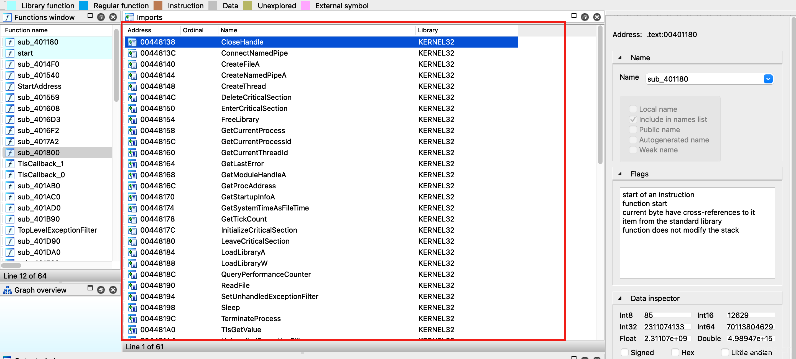

无论什么时候，在遇到windows API 函数的时候，可以通过微软的开发者MSDN中搜索或者在谷歌中搜索，https://msdn.microsoft.com/。MSDN文档对于API函数进行了相关描述，如函数参数、参数类型、返回值等。这里取Creat or open file 作为举例，如 https://msdn.microsoft.com/en-us/library/windows/desktop/aa363858(v=vs.85).aspx 所示。	通过文档可以知道这个函数的功能为创建和打开文件。第一个参数（lpfilename），用于记录文件名称。第二个参数（dwdesiredaccess），说明需要的权限如读或血的权限，第5个参数也是对文件创建和打开一个已经存在的文件。

```c++
HANDLE CreateFileA(
  LPCSTR                lpFileName,
  DWORD                 dwDesiredAccess,
  DWORD                 dwShareMode,
  LPSECURITY_ATTRIBUTES lpSecurityAttributes,
  DWORD                 dwCreationDisposition,
  DWORD                 dwFlagsAndAttributes,
  HANDLE                hTemplateFile
);
```

Windows API使用匈牙利语命名变量。在这个语法中，变量前缀增加数据种类，这个有助于我们了解给数据种类。如第二个参数dwdesiredaccess，dw的前缀代表dword 32 位无符号整数。在win32 API支持的不同数据类型如(https://msdn.microsoft.com/en-us/library/windows/desktop/aa383751(v=vs.85).aspx)。下面的表格未一些数据类型：

| 数据类型          | 描述                                                         |
| ----------------- | ------------------------------------------------------------ |
| BYTE (b)          | Unsigned 8-bit value.8位无符号字节                           |
| WORD (w)          | Unsigned 16-bit value. 16位无符号字节                        |
| DWORD (dw)        | Unsigned 32-bit value. 32位无符号字节                        |
| QWORD (qw)        | Unsigned 64-bit value. 64位无符号字节                        |
| Char (c)          | 8-bit ANSI character.一个8位 Windows (ANSI) 字符             |
| WCHAR             | 16-bit Unicode character.  一个16位 Windows (unicode) 字符   |
| TCHAR             | 如果定义了**UNICODE** ，则为[**WCHAR**](https://docs.microsoft.com/zh-cn/windows/win32/winprog/windows-data-types?redirectedfrom=MSDN#wchar) ; 否则为[**CHAR**](https://docs.microsoft.com/zh-cn/windows/win32/winprog/windows-data-types?redirectedfrom=MSDN#char) 。一个字节的ASCII字符或2个字节的Unicode字符。 |
| Long Pointer (LP) | 这是一个指向其他数据类型的指针。例如，lpdword是一个指向Dword的指针，LPCSTR是一个字符内容。LPCTSTR是TCHAR的常量（1比特ASCII字符或2比特Unicode字符），LPSTR是不固定的字符。LPTSTR是一个不固定的TCHAR（ASCII或Unicode）字符。有的时候LP(Long Pointer)可以用P(Pointer)代替。 |
| Handle (H)        | 这相当于处理数据类型。一个句柄是与对象相关的。在一个进程能够访问对象之前（例如一个文件、注册表、程序、互斥锁等等）必须先打开一个句柄对象。例如，如果一个程序想要卸乳一个文件，程序首先调用API，例如CreateFile，返回句柄到文件；然后进程使用句柄，通过句柄到写文件API，实现写入文件。 |

与数据类型和参数不同，之前的函数样本包括注释，例如```_in_```和```_out_```，描述了函数使用的参数和返回的值。```_in_```表示输入参数，调用必须通过提供参数给函数才能执行函数。```_in_opt```表示可选的输入参数（可以为null）。```_out_```表示输出的参数；表示函数将会输出参数作为返回值。这个特性对于了解函数调用后是否从存储中读取任何数据到输出函数很有帮助。```_inout_```对象可以让我们分辨函数参数和函数的输出。

在交叉参考中我们可以看到API调用情况，通过查阅相关API手册，我们可以知道，相关API的输入和输出参数。以createfile为例，通过查看函数的相关的两个函数，起始地址如下：

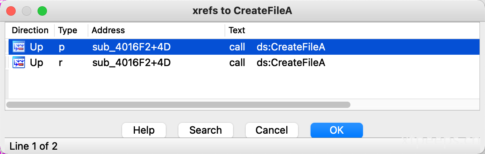

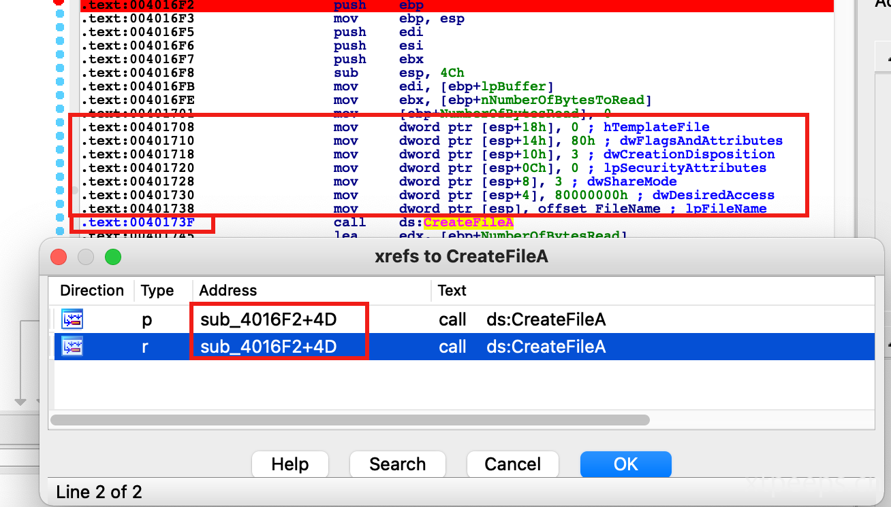

双击第一个参数，调转到代码反汇编窗口对应位置。并且高亮显示。通过分散，IDA提供了一个叫做快速识别库的技术（FLIRT），包括图像匹配算法用于确定函数函数是库函数还是一个引用函数（从dll引入的函数）。在这个例子中IDA能够识别引入的分散的函数，并且将其命名为CreateFileA。IDA的分辨引用函数和库函数的能力非常有用，因为当你分析恶意样本的时候，不会去浪费时间分辨是引用的函数还是库函数。IDA还会为参数添加参数的名字作为注释，标记出Windows API函数调用的对应的参数的名称。

```
.text:00401708                 mov     dword ptr [esp+18h], 0 ; hTemplateFile
.text:00401710                 mov     dword ptr [esp+14h], 80h ; dwFlagsAndAttributes
.text:00401718                 mov     dword ptr [esp+10h], 3 ; dwCreationDisposition
.text:00401720                 mov     dword ptr [esp+0Ch], 0 ; lpSecurityAttributes
.text:00401728                 mov     dword ptr [esp+8], 3 ; dwShareMode
.text:00401730                 mov     dword ptr [esp+4], 80000000h ; dwDesiredAccess
.text:00401738                 mov     dword ptr [esp], offset FileName ; lpFileName
.text:0040173F                 call    ds:CreateFileA
```

第一个参数表示需要创建的文件名lpFileName。第二个参数dwDesiredAccess内容80000000h，通过https://docs.microsoft.com/en-us/windows/win32/secauthz/access-mask-format，可以看到对应的是generic_read权限，这一部分应该在后面的针对widnows的API的详细解读中进一步细化。第5个参数值为3，通过https://docs.microsoft.com/en-us/windows/win32/api/fileapi/nf-fileapi-createfilea，可以知道代表**OPEN_EXISTING**，只有当其退出的时候打开文件或设备。

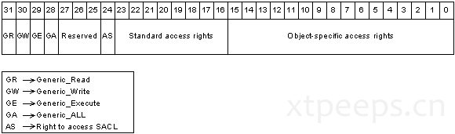

IDA的另一个特性是列出使用象征名标记Windows API，或C标准库函数。例如在80000000h可以通过右键值，选择使用标准象征内容参数，标记内容；这个操作将会出现一个窗口展示所有有关选择的值的象征名字。你需要选择一个适当的标志名称这里就是Generic_read。用相同的方式，你可以替换掉第五个参数内容3，为象征名称，OPEN_EXISTING；

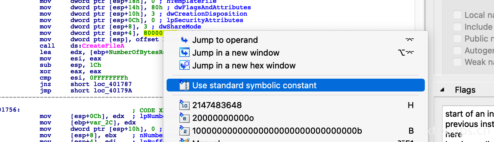

在使用象征名替换了内容之后，反汇编窗口列被转化成下图所示内容。代码变得更加可读。在函数调用之后，句柄到文件（可以在EAX寄存器中找到）被返回。通过函数操作文件还可以通过其他API来实现，例如readfile()或者writefile()，也可以实现类似的效果：

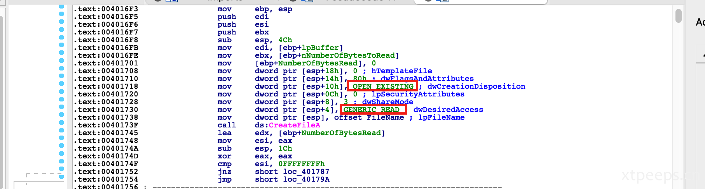

##### 3.1.1 ANSI和Unicode API函数

windows支持两个相似的API设置：一个是对于ANSI字符，另一个是Unicode字符。很多函数使用一个字符作为参数，在参数的名字后面包含A或者W。例如CreateFileA。换句话说，API名称的尾部，可以让你分辨通过函数的字符的种类（ANSI或Unicode）。以上面的CreateFileA为例，A表示函数使用一个ANSI字符作为输入。相应的CreateFileW则是表示函数使用一个Unicode字符作为输入。在恶意软件分析的过程中，当你看到一个函数名为CreateFileA或CreateFileW形式，可以删掉尾字母A或W，然后在MSDN中搜索函数文档。

##### 3.1.2 执行API函数

你可能会遇到很多名字带有Ex后缀的函数，例如RegCreateKeyEx（扩展RegCreateKey的变体）。当Microsoft升级一个与旧函数矛盾的函数的时候，升级的函数命名在原函数名的基础上增加Ex。

#### 3.2  32位和64位Windows API对比

让我们看一个32位恶意样本去了解恶意样本如何运用大量API函数去影响操作系统的，让我们尝试了解如何反汇编代码，去了解恶意程序的活动。在接下来的反汇编输出中，32位的恶意样本调用了RegOpenKeyEx API开启了一个句柄执行run注册表的值。当我们执行32位恶意样本的时候，所有regOpenKeyEx的API参数被压到栈上。相关的文档可以在 https://msdn.microsoft.com/en-us/library/windows/desktop/ms724897(v=vs.85).aspx 找到。输出参数phkResult是一个变量的指针（输出的参数由**_out_**注释指出）在函数调用后，指向打开注册表值的句柄。这里可以注意到，phkResult的地址是从ecx寄存器复制过去的，这个地址是作为RegOpenKeyEx API的第5个参数录入的。

```
lea  ecx, [esp+7E8h+phkResult] ➊
push ecx ➋                        ; phkResult
push 20006h                       ; samDesired
push 0                            ; ulOptions
push offset aSoftwareMicros ;Software\Microsoft\Windows\CurrentVersion\Run
push HKEY_CURRENT_USER            ; hKey
call ds:RegOpenKeyExW
```

在恶意软件通过调用RegOpenKeyEx打开run注册值后，返回的句柄（在phkResult变量存储）被移动到ecx寄存器中，并且作为RegSetValueExW的第一个参数传递。从MSDN关于这个API的文档中，可以发现使用RegSetValueEx API设置一个变量到run注册表的值中（持久化）。变量通过的第二个参数设置，system字符。对应的内容可以通过第五个参数的值去确认。从前面的描述中，可以确定eax保持由pszPath的地址的值。pszPath变量与在运行时的相关内容相关；因此通过查看代码，很难判断数据是病毒添加到注册表里的（你可以通过调试病毒样本确认）。但是在这点，通过静态分析（反汇编），你可以确定病毒添加了一个入口到注册表中作为持久化的方式：

```
mov   ecx, [esp+7E8h+phkResult] ➌
sub   eax, edx
sar   eax, 1
lea   edx, ds:4[eax*4]
push  edx                     ; cbData
lea   eax, [esp+7ECh+pszPath] ➐
push  eax ➏                  ; lpData
push  REG_SZ                 ; dwType
push  0                      ; Reserved
push  offset ValueName       ; "System" ➎
push  ecx ➍ ; hKey
call  ds:RegSetValueExW
```

在添加了一个入口到注册表中之后，病毒通过在句柄获取值之前（存有phkResult变量）关闭句柄到注册表值，如下所示：

```
mov   edx, [esp+7E8h+phkResult]
push  edx                     ; hKey
call  esi                     ; RegCloseKey
```

之前的例子展示了恶意样本如何使用多个windows API添加一个入口到注册表中，该注册遍能够在计算机重启的时候自动运行。你还可以看到，恶意样本如何获得一个对象的句柄，并分享句柄到其他API函数执行其他行为。

当你在看从64位病毒程序反汇编输出的函数的时候，可能会略显不同，这是由于参数通过64位架构。接下的一个64位样本调用CreateFile函数。在64位架构下，在寄存器中前4个参数被使用（rcx，rdx，r8和r9），并且剩余的参数被放置在寄存器中。在接下来的反汇编中，注意到第一个参数是如何通过rcx寄存器，第二个参数在edx寄存器中，第三个参数在r8，第四个在r9寄存器中。新增的参数被放置在栈中（注意这里没有push指令），这里使用mov指令。注意IDA如何识别参数柄添加注释到指令旁边的。函数的返回值（到文件的句柄）从rax寄存器中被移动到rsi寄存器中：

```
xor  r9d, r9d  ➍                           ; lpSecurityAttributes
lea  rcx, [rsp+3B8h+FileName] ➊             ; lpFileName
lea  r8d, [r9+1] ➌                          ; dwShareMode
mov  edx, 40000000h ➋                       ; dwDesiredAccess
mov  [rsp+3B8h+dwFlagsAndAttributes], 80h ➏  ; dwFlagsAndAttributes
mov  [rsp+3B8h+dwCreationDisposition], 2  ➎  ; lpOverlapped
call cs:CreateFileW
mov  rsi, rax  ➐
```

下面的反汇编为WriteFile API的，注意文件句柄在API调用之前被复制到rsi寄存器，现在通过writeFile函数第一个参数移动到rex寄存器。相同的方式，另一个参数被传入寄存器进入堆，如下所示：

```
and  qword ptr [rsp+3B8h+dwCreationDisposition], 0
lea  r9,[rsp+3B8h+NumberOfBytesWritten]       ; lpNumberOfBytesWritten
lea  rdx, [rsp+3B8h+Buffer]                   ; lpBuffer
mov  r8d, 146h                                ; nNumberOfBytesToWrite
mov  rcx, rsi ➑                               ; hFile
call cs:WriteFile From the preceding example,
```

从之前的案例可以看到，病毒程序创建一个文件和写入内容到文件，但是当你查找静态代码的时候，并不那么清楚的可以看出恶意软件创建了什么文件或者写入了什么内容到文件中。例如，想要知道软件创建的文件名，你需要检查ipFileName（传入CreateFile的一个参数）地址的内容；但ipFileName变量并非硬编码，并且只有当程序运行的时候才存在。


### 4. 使用IDA补丁二进制chengxu

当完成恶意程序分析，你想要修改二进制程序改变其内部工作原理或者逆向逻辑以便个人使用。你可以使用选择Edit/Patch program菜单。需要注意的是，当你使用这个菜单堆二进制进行修改的时候，你并不会直接对二进制文件本身进行修改；这个修改只会在IDA数据库中进行操作。如果需要应用修改到原始的二进制文件的话，你需要使用Apply patches to input file：

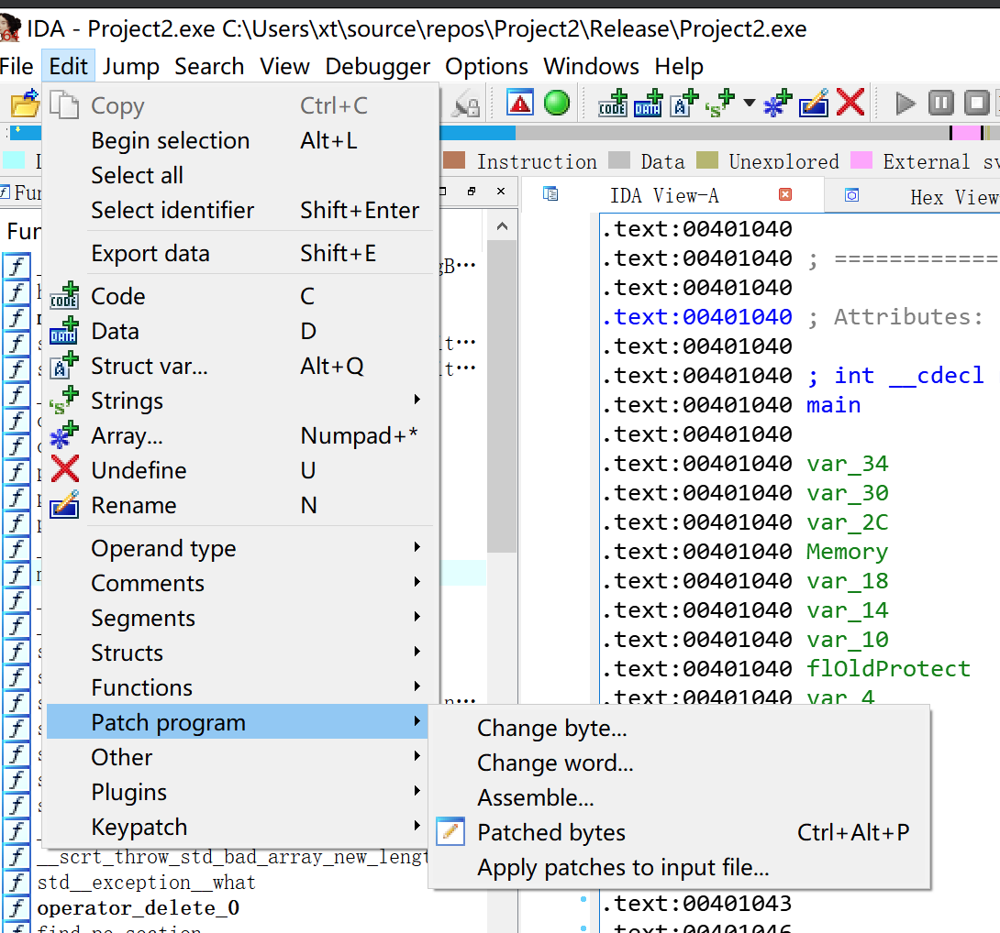 

#### 4.1 补丁程序字节

考虑到代码通过32位恶意软件dll执行（RDSS rootkit），通过检测可以确保其运行与spoolsv.exe下面。这里的检测会使用字符对比功能；如果自负对比失败，则代码跳转到函数结束，并且回到函数调用。特殊的，这个dll的恶意行为只发生在当其被spoolsv.exe调用的时候；除此之外，其都无返回。

```
10001BF2     push offset aSpoolsv_exe  ; "spoolsv.exe"
10001BF7     push edi                  ; char *
10001BF8     call _stricmp  ➊ 
10001BFD     test eax, eax
10001BFF     pop ecx
10001C00     pop ecx
10001C01     jnz loc_10001CF9
 [REMOVED]
 10001CF9 loc_10001CF9: ➋      ; CODE XREF: DllEntryPoint+10j
10001CF9      xor  eax, eax
10001CFB      pop  edi
10001CFC      pop  esi
10001CFD      pop  ebx
10001CFE      leave
10001CFF      retn 0Ch

K A, Monnappa. Learning Malware Analysis: Explore the concepts, tools, and techniques to analyze and investigate Windows malware (p. 189). Packt Publishing. Kindle 版本. 
```

假定你想要恶意dll执行恶意行为在任一程序下，例如执行在notepad.exe下面。你可以改变硬编码的字符从spoolsv.exe到notepad.exe。为了实现这个，通过点击aSpoolsv_exe定位硬编码地址，在下面的内容中展示：

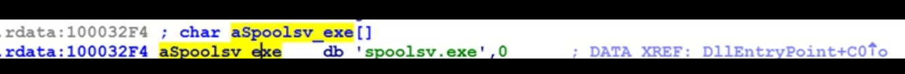

现在，将鼠标放在变量名上（aSpoolsv_exe）。此时，hex视图窗口中将会同步展示地址信息。在hex-View-1标签展示的hex和ascii导出内存地址。补丁字节内容，选择Edit/patch program/change byte；将会如下图所示带来补丁字节日志。你可以修改原始的二进制字节通过输入一个新的二进制值到栏目中。Address字段表示游标位置的虚拟地址，File offset字段指定二进制文件中字节所在的文件偏移量。
Original value字段显示当前地址的原始字节;即使你修改了这些值，该字段中的值也不会改变:

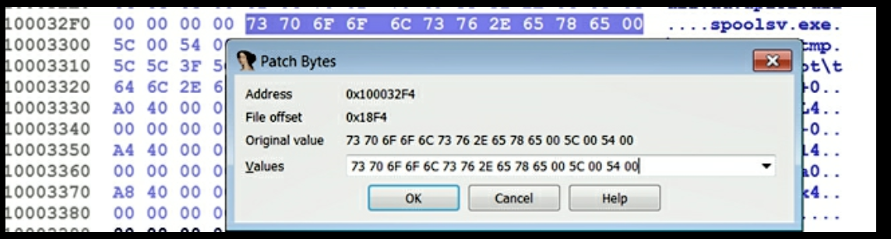

您所做的修改将应用于IDA数据库;要将更改应用到原始可执行文件，可以选择“Edit | Patch program | apply patches to the input file”。下面的屏幕截图显示了“应用补丁到输入文件”对话框。当您点击OK时，更改将应用到原始文件;您可以通过检查“创建备份”选项来保存原始文件的备份;在这种情况下，它会以.bak扩展名保存你的原始文件:

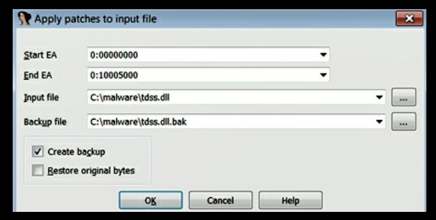

前面的示例演示了修补字节;以同样的方式，您可以通过选择Edit | patch program | Change word来一次打一个单词(2字节)的补丁。您还可以从十六进制视图窗口中修改字节，通过右键单击一个字节并选择Edit (F2)，您可以通过再次右键单击并选择apply changes (F2)应用更改。

#### 4.2 补丁命令

在之前的例子中，TDSS rootkit DLL执行了一个检查判断程序是否在spoolsv.exe下面运行。可以通过修改程序中的二进制信息将spoolsv.exe改为notepad.exe。可以通过逆向逻辑判断DLL可以运行在任意进程下面。为了实现这个想法，我们可以修改jnz命令使其变为jz，通过选择Edit｜patch program｜Assemble，如下所示。我们将要逆向逻辑并且让程序运行在spoolsv.exe下时，程序不会表现任何恶意行为表现，而运行在非spoolsv.exe时将会表现出恶意行为。在修改了命令之后，点击OK，命令将会被汇编，但是对话仍然保持打开状态，提示你在下一个地址汇编下一个命令。如果没有其他需要会变的可以点击取消结束。为了将修改保存到原始文件中，选择Edit｜patch program｜apply patches 将修改保存到文件中。

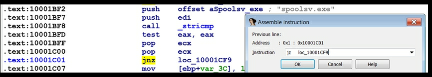


当你给任何命令打补丁的时候，小心需要确保所有的的命令的结合是正确的；除此之外，补丁的程序可能会出现无法预料的行为。如果新的命令比原始命令短的话，你可以使用**nop**命令保持长度完整。如果你在汇编一个新的命令超出原始的命令，IDA将会覆盖原始程序的后面的命令，这个行为可能并非我们希望如此的。

### IDA 脚本和插件

ODA提供将本的行为，为你提供访问IDA数据库内容的许可。通过脚本程序，你可以自动的执行一些命令任务和复杂的分析操作。IDA支持两个脚本语言：IDC，原生的内置语言（类似c语言的语法）和python 脚本通过IDApython实现。在2017年9月，Hex-Rays发布的新版本IDAPython脚本 API兼容IDA7.0和最新版本IDA。在这一部分，我们将体验使用IDApython执行脚本的能力；在这一部分IDApython脚本使用最新版本IDApython API，因此需要对应IDA的版本要大于7.0，否则将无法正常工作。当我们熟悉了IDA和逆向工程的概念之后，你可能希望能够自动完成任务，结下来的资源可以帮助你开始IDApython脚本：


The Beginner’s Guide to IDAPython by Alexander Hanel: https://leanpub.com/IDAPython-Book 
Hex-Rays IDAPython documentation: https://www.hex-rays.com/products/ida/support/idapython_docs/

#### 5.1 执行IDA脚本

脚本可以通过多种方式执行。你可以执行标准的IDC或者IDAPython脚本通过选择File ｜ Script File。如果你只是希望执行一小段命令，而不是执行脚本文件，那么你可以通过选择File｜scrpt command（shift+F2），然后从下拉菜单中选择恰当的脚本语言（IDC或者Python）。在运行下面的脚本命令之后，当前光标位置的虚拟地址和反汇编的文本将会显示在下面的窗口中：

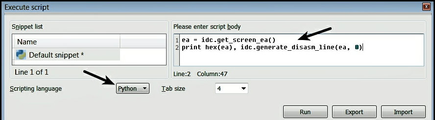

另一种方式执行脚本命令是输入IDA的命令行，如下图所示：

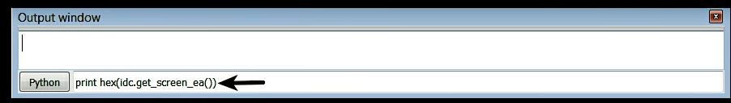

#### 5.2 IDApython

IDApython是基于python为IDA建立的一个特别有用的语言。他将IDA的分析特性与python结合，能够允许更多强大的功能。IDApython包含三种模块：idaapi，提供访问IDA API的访问；idautils，提供IDA更高级的功能函数；idc，一个IDC兼容模块。大部分IDApython函数允许地址以参数形式传递，当阅读IDApython文档的时候，你会找到地址被称为ea。大多IDApython函数返回地址；其中一个常见的函数是idc.get_screen_ea()，获取当前光标位置的地址：

```
Python>ea = idc.get_screen_ea()
Python>print hex(ea)
0x40206a
```

下面的代码片段展示了通过idc.get_screen_ea()获取的地址传入idc.get_segm_name()获取与地址相关的段的名称：

```
Python>ea = idc.get_screen_ea()
Python>idc.get_segm_name(ea)
.text
```

下面的代码片段，将idc.get_screen_ea()获取的当前光标的地址传入idc.generate_disasm_line()函数生成反汇编文本：

```
Python>ea = idc.get_screen_ea()
Python>idc.generate_disasm_line(ea,0)
push ebp
```

下面的代码，将idc.get_screen_ea()获取的当前光标的地址传入idc.get_func_name()确定与地址相关联的函数的名称。例如，根据Alexander Hanel's The Beginner’s Guide to IDAPython book (https://leanpub.com/IDAPython-Book):

```
Python>ea = idc.get_screen_ea()
Python>idc.get_func_name(ea)
_main
```

在恶意软件分析的时候，经常的，你将会想知道如果恶意软件引入了一个特定的函数（或者很多个函数），例如CreateFile，并且在程序代码中函数被调用。你可以通过前面章节中提到的IDA的cross-references交叉关联查询特性进行查询。对于IDApython给你一个感觉，下面的例子将展示IDApython如何检查CreateFile API调用并且识别CreateFile的交叉关联。

##### 5.2.1 检查CreateFile API的出现

如果你还记得，在反汇编的章节，IDA尝试通过模式匹配算法来确定反汇编函数是动态库函数还是导入函数。他还从符号表中派生出名称列表；这些派生名称可以通过使用（View｜Open subview ｜ Names或者 shift+F4）打开名称窗口；名称窗口包括导入、导出和命名数据位置列表。下面的截图显示了在名称窗口中的CreateFile API函数：

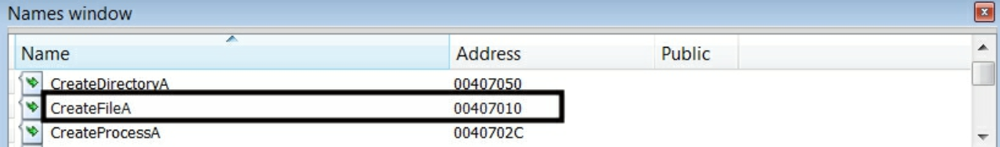

你可以通过编程的方式访问命名项。下面IDApython脚本检查通过遍历每一个命名来检查是否存在CreateFile API函数：

```
import idautils
for addr, name in idautils.Names():
      if "CreateFile" in name:
             print hex(addr),name
```

前面的脚本调用idautils.Names() ，该函数返回一个命名项（元组），其中包含虚拟地址和名称。迭代命名项检查是否存在CreateFile。运行上述脚本将返回CreateFileA API，如下面的代码片段所示。自从导入函数的代码驻留到共享库（DLL）中，其只会在运行时被夹在，地址（0x407010）中列出的以下片段是导入表相关的虚拟地址（并不是CreateFileA的地址）

```
0x407010      CreateFileA
```

确定CreateFileA函数是否存在的另一种方法是使用以下代码。idc.get_name_ea_simple()函数返回CreateFileA的虚拟地址。如果CreateFileA不存在，则返回值为-1（idaapi.BADADDR）：

```
import idc
import idautils
 ea = idc.get_name_ea_simple("CreateFileA")
if ea != idaapi.BADADDR:
    print hex(ea), idc.generate_disasm_line(ea,0)
else:
    print "Not Found"
```


##### 5.2.2 使用IDApython代码交叉引用CreateFile

确定了CreateFileA函数的引用之后，我们尝试确定CreateFileA的交叉关联（Xrefs to）；这将会返回给我们所有调用CreateFileA的地址。下面的脚本构建在前面的脚本之上，并且对CreateFileA函数的交叉引用：

```
import idc
import idautils
 ea = idc.get_name_ea_simple("CreateFileA")
if ea != idaapi.BADADDR:
    for ref in idautils.CodeRefsTo(ea, 1):
        print hex(ref), idc.generate_disasm_line(ref,0)
```

下面是运行上述脚本生成的输出。输出显示了调用CreateFileA API函数的所有指令：

```
0x401161   call  ds:CreateFileA
0x4011aa   call  ds:CreateFileA
0x4013fb   call  ds:CreateFileA
0x401c4d   call  ds:CreateFileA
0x401f2d   call  ds:CreateFileA
0x401fb2   call  ds:CreateFileA
```


#### 5.3 IDA插件

IDA插件极大的增强了IDA的功能，并且大多数开发用于IDA的第三方软件都是以插件的形式发布的。一个对恶意软件分析师和逆向工程时来说价值巨大的商业插件师Hex-Rays Decompiler(https://www.hex-rays.com/products/decompiler/)。这个插件能够把处理器代码反编译成人类刻可读的类似C相关的伪代码，从而更容易阅读代码，并可以加快分析速度。

可以在下面的地址找到有趣的插件https://www.hex-rays.com/contests/index.shtml Hex-Rays插件页面。你也可以在https://github.com/onethawt/idaplugins-list 上找到有用的IDA插件列表。


### 章节总结 

本章介绍了IDA Pro:它的特性，以及如何使用它来执行静态代码分析(反汇编)。在本章中，我们还讨论了一些与Windows API相关的概念。结合您从上一章中获得的知识，并利用IDA提供的特性，可以极大地增强您的逆向工程和恶意软件分析能力。尽管反汇编允许我们理解程序做什么，但大多数变量都不是硬编码的，只有在程序执行时才被填充。在下一章中，您将学习如何在调试器的帮助下以受控的方式执行恶意软件，您还将学习如何探索二进制文件的各个方面，而它是在调试器下执行的。
