## 6. 调试恶意软件二进制文件
调试时一个通过受控方式执行恶意代码的技术。Debugger是一个程序，使你可以在更细颗粒度的级别上检查恶意代码。debugger提供了对恶意软件运行时行为的完全控制，并允许控制执行单个或多个指令，也可以选择功能执行程序的（而不是执行整个程序），同时研究恶意软件的每个行动。

在本章中，你将主要学习IDA Pro（商业反汇编/调试器）和x64dbg（开源x32/x64调试器）提供的调试特性。你将在本章了解这些调试器提供的特性，以及如何使用他们检查程序的运行时行为。根据可用资源的不同，可以自由选择这两个调试器中的一个活两个来调试恶意二进制文件。当调试恶意软件时，需要采取适当措施，因为您将在系统上运行恶意代码。在本章最后，还有如何使用.net反编译器/调试器dnSpy（https://github.com/0xd4d/dnSpy)来调试.net应用程序。

其他受欢迎的反汇编器/调试器包括radare2 (http://rada.re/r/index.html),调试工具的WinDbg部分为Windows (https://docs.microsoft.com/en-us/windows-hardware/drivers/debugger/), Ollydbg (http://www.ollydbg.de/version2.html),免疫调试器(https://www.immunityinc.com/products/debugger/),Hopper (https://www.hopperapp.com/)和Binary Ninja (https://binary.ninja/)。

### 1. 通用调试内容
在我们深入研究这些调试器（IDA Pro、x64dbg和DnSpy）提供的特性之前，有必要了解大多数调试器提供的一些常见特性。在本节中，您将主要看到通用的调试概念，在接下来的小节中，我们将重点介绍IDA Pro、x64dbg和dnSpy的基本特性。

#### 1.1 启动和附加到进程

调试通常选择要调试的程序。有两种方法调试程序：
（a）将调试器附加到一个正在运行的进程上，
（b）启动一个新的进程。当您将调试器附加到正在运行的进程时，你讲无法控制或者监视程序的初始操作，因为当你有机会附加到进程时，它的所有启动和初始化代码都已经执行了。当您将调试器附加到某个进程时，调试器将刮起该进程，使您有机会在恢复进程之前检查进程的资源或设置断点。

另一方面，启动一个新进程允许你监视或调试流程采取的每个操作，您还将能够监视流程的初始操作。当你启动调试器时，原始二进制文件将以调试器的用户权限执行。当进程在调试器下启动时，执行将在程序的入口暂停。程序的入口点事将要执行的第一条指令的地址。子啊后面的小节中，将学习如何使用IDApro、x64dbg和dnspy启动并附加到 进程。程序的日寇点不一定是main或winmain函数；在将控制转移到main或winmain之前，执行初始化例程（启动历程）。启动历程的目的是在将控制传递给朱函数之前初始化程序的环境。这个初始化被调试器指定为程序的入口点。

> 程序的入口不一定是main或WinMain函数;在将控制转移到main或WinMain之前，初始化程序(启动程序)被执行。启动例程的目的是在将控制传递给主函数之前初始化程序环境。这个初始化被调试器指定为程序的入口点。

#### 1.2 控制进程执行

调试器使您能够在进程执行时控制/修改进程的行为。调试器提供的两个重要功能是:(a)控制执行的能力，(b)中断执行的能力(使用断点)。使用调试器，您可以在将控制权返回给调试器之前执行一个或多个指令(或选择函数)。在分析过程中，您将结合调试器的受控执行和中断(断点)特性来监视恶意软件的行为。在本节中，您将了解调试器提供的常用执行控制功能;在后面的章节中，您将学习如何在IDA Pro、x64dbg和dnSpy中使用这些特性。

下面是调试器提供的一些常见的执行控制选项:

* 继续（运行）。 这将执行所有的指令，直到达到一个断点或发生一个异常。当你把一个恶意软件加载到调试器中，并在没有设置断点的情况下使用继续（运行）选项时，它将执行所有的指令而不给你任何控制权；所以，你通常将这个选项和断点一起使用，在断点位置中断程序。

* 步入和跨步。 使用Step into和Step over，你可以执行一条指令。在执行完单条指令后，调试器停止，给你一个机会检查进程的资源。当您执行一条调用函数的指令时，步入和跨步的区别就出现了。例如，在下面的代码中，在➊，有一个对函数sub_401000的调用。当你对这条指令使用step into选项时，调试器将在函数的开始处（地址为0x401000）停止，而当你使用step over时，整个函数将被执行，调试器将在下一条指令➋（即地址为0x00401018）暂停。你通常会使用step into来进入一个函数内部，以了解它的内部工作原理。当你已经知道一个函数的作用（例如在API函数中）并希望跳过它时，就会使用Step over。

```
.text:00401010     push  ebp
.text:00401011     mov   ebp, esp
.text:00401013     call  sub_401000  ➊
.text:00401018     xor   eax,eax  ➋
```

* Execute till Return（运行至返回）。 这个选项允许你执行当前函数中的所有指令，直到它返回。如果你不小心进入了一个函数（或进入了一个不感兴趣的函数），并希望从里面出来，这就很有用。在一个函数中使用这个选项会把你带到函数的末端（ret或retn），之后你可以使用step into或step over选项返回到调用的函数。
* Run to cursor 运行到光标（运行到选择）。 这允许你执行指令直到当前的光标位置，或者直到到达所选指令。

#### 1.3 用断点中断程序

断点是调试器的一项功能，它允许你在程序中一个非常具体的位置中断程序的执行。断点可以用来暂停某条指令的执行，或者当程序调用某个函数/API函数时，或者当程序从某个内存地址读、写或执行时。你可以在一个程序中设置多个断点，当到达任何一个断点时，程序的执行将被中断。一旦达到一个断点，就有可能监测/修改程序的各个方面。调试器通常允许你设置不同类型的中断点。

* 软件断点。 默认情况下，调试器会使用软件断点。软件断点的实现是用一条软件断点指令替换断点地址的指令，如int 3指令（操作码为0xCC）。当软件断点指令（如int 3）被执行时，控制权被转移到调试器上，调试器正在调试被中断的进程。使用软件断点的好处是，你可以设置无限数量的断点。缺点是，恶意软件可以寻找断点指令（int 3），并修改它来改变所附调试器的正常操作。
* 硬件断点。CPU，如x86，通过使用CPU的调试寄存器DR0-DR7，支持硬件断点。你可以使用DR0-DR3设置最多四个硬件断点；其他剩余的调试寄存器用于指定每个断点的附加条件。在硬件断点的情况下，没有指令被替换，但是CPU会根据调试寄存器中的数值决定程序是否应该被中断。
* 内存断点。 这些断点允许你在一条指令访问（读出或写入）内存时暂停执行，而不是暂停执行。如果你想知道某条内存何时被访问（读或写），并想知道哪条指令访问了它，这就很有用。例如，如果你在内存中发现一个有趣的字符串或数据，你可以在该地址上设置一个内存断点，以确定在什么情况下访问该内存。条件性断点。 使用条件性断点，您可以指定必须满足的条件来触发断点。如果达到了条件性断点但条件没有得到满足，调试器会自动恢复程序的执行。条件性断点不是指令的特性，也不是CPU的特性，而是调试器提供的一种功能。因此，您可以为软件和硬件断点指定条件。当条件断点被设置后，调试器的责任是评估条件表达式，并确定程序是否需要中断。

#### 1.4 追踪程序的执行

追踪是一种调试功能，它允许你在进程执行时记录（日志）特定的事件。追踪给你提供二进制文件的详细执行信息。在后面的章节中，你将了解IDA和x64dbg所提供的不同类型的跟踪功能。

### 2. 使用x64dbg调试二进制文件

x64dbg（https://x64dbg.com）是一个开源的调试器。你可以使用x64dbg来调试32位和64位应用程序。它有一个易于使用的GUI，并提供各种调试功能（https://x64dbg.com/#features）。在本节中，你将看到x64dbg提供的一些调试功能，以及如何使用它来调试一个恶意的二进制文件。

#### 2.1 在x64dbg中启动一个新进程

在x64dbg中，要加载一个可执行文件，选择文件|打开，并浏览到你想调试的文件；这将启动该进程，调试器将在系统断点、TLS回调或程序入口点函数处暂停，这取决于配置设置。你可以通过选择选项|首选项|事件来访问设置对话框。默认的设置对话框显示如下，可执行文件被加载时的默认设置。调试器首先在系统函数中中断（因为系统断点*选项被选中）。接下来，在你运行调试器后，它将在TLS回调函数处暂停，如果存在的话（因为TLS回调*选项被选中）。这有时是有用的，因为一些反调试器的技巧包含TLS条目，允许恶意软件在主程序运行前执行代码。如果你进一步执行该程序，执行会在程序的入口处暂停。

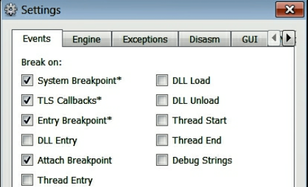

> 编辑百度：TLS回调函数是指，每当创建/终止进程的线程时会自动调用执行的函数。创建的主线程也会自动调用回调函数，且其调用执行先于EP代码。

如果你想让执行直接在程序的入口处暂停，那么请取消勾选系统断点*和TLS回调*选项（这种配置对大多数恶意软件程序来说应该是很好的，除非恶意软件使用反调试技巧）。要保存配置设置，只需点击保存按钮。有了这个配置，当可执行文件被加载时，进程就会开始，并在程序的进入点暂停执行，如图所示。


#### 2.2 附属于一个现有的进程

要在x64dbg中附加到一个现有的进程，选择文件|附加（或Alt + A）；这将出现一个显示运行进程的对话框，如下所示。选择你想调试的进程，然后点击附加按钮。当调试器被附加时，进程被暂停，给你时间设置断点和检查进程的资源。当您关闭调试器时，附加的进程将终止。如果您不希望所连接的进程终止，您可以通过选择文件|分离（Ctrl + Alt + F2）来分离一个进程；这可以确保在您关闭调试器时，所连接的进程不会被终止。

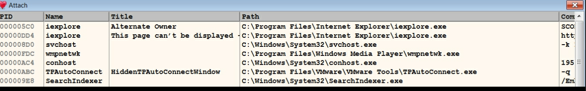

> 有时，当您尝试将调试器附加到一个进程时，您会发现并非所有的进程都列在对话框中。在这种情况下，请确保你是以管理员身份运行调试器；你需要通过选择 "选项"|"偏好"，并在 "引擎 "选项卡中勾选 "启用调试权限"，来启用调试权限设置。


#### 2.3 x64dbg调试器接口
当你在x64dbg中加载一个程序时，你会看到一个调试器显示屏，如下图所示。调试器显示包含多个标签；每个标签显示不同的窗口。每个窗口都包含关于被调试二进制文件的不同信息。

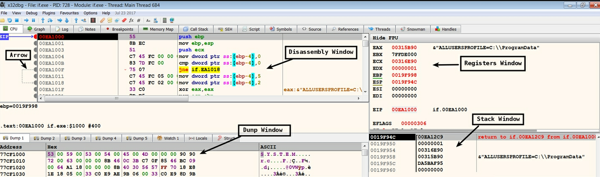

反汇编窗口（CPU窗口）。它显示了被调试程序的所有指令的反汇编情况。这个窗口以线性方式显示反汇编，并与指令指针寄存器（eip或rip）的当前值同步。这个窗口的左边部分显示一个箭头，表示程序的非线性流程（如分支或循环）。你可以通过按G热键来显示控制流图。控制图显示如下；条件性跳转使用绿色和红色箭头。绿色箭头表示如果条件为真将进行跳跃，红色箭头表示不进行跳跃。蓝色箭头用于无条件跳转，向上（向后）的蓝色箭头表示一个循环。

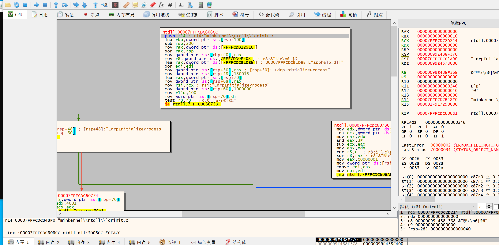

寄存器窗口。 这个窗口显示CPU寄存器的当前状态。通过双击寄存器并输入一个新的数值，可以修改寄存器中的数值（你也可以右击并修改寄存器的数值为零或增加/减少寄存器的数值）。你可以通过双击标志位的值来切换标志位的开或关。你不能改变指令指针（eip或rip）的值。当你调试程序时，寄存器的值会发生变化；调试器会用红色突出显示寄存器的值，以表示自上一条指令以来的变化。

堆栈窗口。 堆栈视图显示进程的运行时堆栈的数据内容。在恶意软件分析过程中，你通常会在调用一个函数之前检查堆栈，以确定传递给函数的参数数量和函数参数的类型（如整数或字符指针）。

转储窗口。 它显示内存的标准十六进制转储。你可以使用转储窗口来检查被调试进程中任何有效内存地址的内容。例如，如果一个堆栈位置、寄存器或指令包含一个有效的内存位置，要检查该内存位置，右击该地址并选择在转储中关注选项。

内存地图窗口。 你可以点击Memory Map标签来显示Memory Map窗口的内容。这提供了进程内存的布局，并为你提供了进程中分配的内存段的细节。它是查看可执行文件及其部分在内存中的加载位置的一个好方法。这个窗口还包含关于进程中的DLLs及其在内存中的部分的信息。你可以双击任何条目来重新定位显示到相应的内存位置。

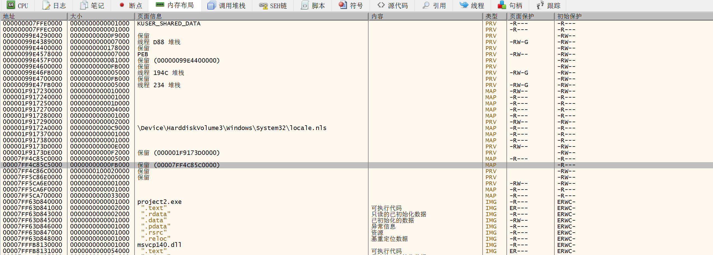

符号窗口。 你可以点击符号标签来显示符号窗口的内容。左边窗格显示加载的模块（可执行文件及其DLLs）的列表；点击一个模块条目将在右边窗格中显示其导入和导出函数，如下所示。这个窗口对于确定导入和导出函数在内存中的位置非常有用。


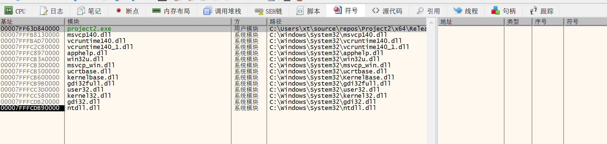


引用窗口References Window。 这个窗口显示对API调用的参考。点击引用标签，默认情况下不会显示API的引用。要填充这个窗口，在反汇编（CPU）窗口的任何地方（加载了可执行文件）点击右键，然后选择搜索|当前模块|中间调用；这将在参考窗口中填充程序中所有API调用的参考。下面的截图显示了对多个API函数的引用；第一个条目告诉你，在地址0x00401C4D处，指令调用了CreateFileA API（由Kernel32.dll导出）。双击该条目将带你到相应的地址（在这种情况下，0x00401C4D）。你也可以在这个地址设置一个断点；一旦断点被击中，你可以检查传递给CreateFileA函数的参数。

手柄窗口Handles Window。 你可以点击 "手柄 "选项卡，弹出手柄窗口；要显示内容，在手柄窗口内点击右键，选择 "刷新"（或F5）。这将显示所有打开的句柄的详细信息。在上一章中，当我们讨论Windows API时，你了解到进程可以打开一个对象（如文件、注册表等）的句柄，这些句柄可以传递给函数，如WriteFile，以执行后续操作。当你在检查API时，这些句柄很有用，比如WriteFile，它将告诉你与句柄相关的对象。例如，在调试一个恶意软件样本时，确定WriteFile API调用接受的句柄值为0x50。 检查句柄窗口显示，句柄值0x50与文件ka4a8213.log有关，如图所示。

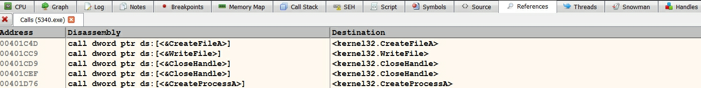

线程窗口Threads Window。这显示了当前进程中的线程列表。你可以在这个窗口上点击右键，暂停一个/多个线程或恢复一个暂停的线程。

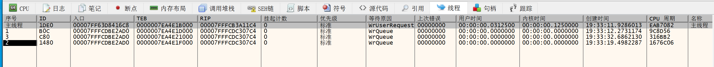

#### 2.4 使用x64dbg控制进程执行 

在第1.2节，控制进程执行，我们研究了调试器提供的不同执行控制功能。下表概述了常见的执行选项以及如何在x64dbg中访问这些选项。

| 功能                                | 快捷键 | Menu                            |
| ----------------------------------- | ------ | ------------------------------- |
| Run                                 | F9     | Debugger \|Run                  |
| Step into步进                       | F7     | Debugger \| Step into           |
| Step over步过                       | F8     | Debugger \| Step over           |
| Run until selection步进直到满足条件 | F4     | Debugger \| Run until selection |

#### 2.5 在x64dbg中设置断点
在x64dbg中，您可以通过导航到您希望程序暂停的地址并按下F2键（或右键单击并选择断点|切换）来设置一个软件断点。要设置硬件断点，可以在你想设置断点的位置上点击右键，选择断点|执行时设置硬件。

你也可以使用硬件断点在写或读/写（访问）一个内存位置时断点。要在内存访问中设置硬件断点，在转储窗格中，右击所需的地址，选择断点|硬件，访问，然后选择适当的数据类型（如字节、字、字或q字），如下面的截图所示。以同样的方式，你可以通过选择Breakpoint | Hardware, Write选项来设置内存写入时的硬件断点。

除了硬件内存断点外，你也可以用同样的方式设置内存断点。要做到这一点，在转储窗格中，右击所需的地址，选择断点|内存，访问（用于内存访问）或断点|内存，写入（用于内存写入）。

要查看所有的活动断点，只需点击断点标签；这将在断点窗口中列出所有的软件、硬件和内存断点。您也可以在断点窗口内的任何指令上点击右键，删除一个或所有的断点。

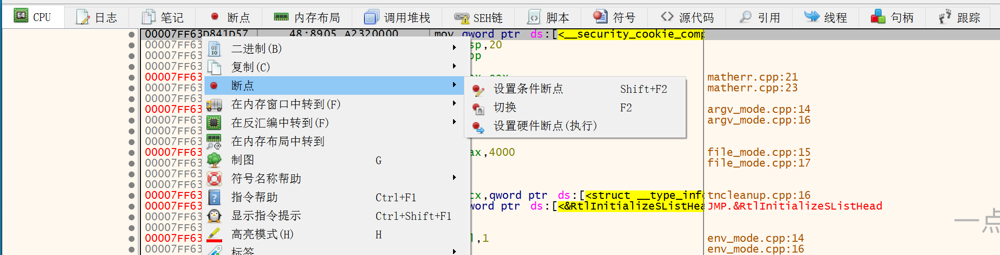


关于x64dbg中可用选项的更多信息，请参考x64dbg在线文档：http://x64dbg.readthedocs.io/en/latest/index.html。
你也可以在x64dbg界面上按F1键访问x64dbg帮助手册。

#### 2.6 调试32位恶意软件

有了对调试功能的了解，让我们来看看调试如何帮助我们了解恶意软件的行为。考虑一个恶意软件样本的代码摘录，其中恶意软件调用CreateFileA函数来创建一个文件。为了确定它所创建的文件的名称，你可以在调用CreateFileA函数时设置一个断点，并执行程序直到它到达断点。当它到达断点时（也就是在调用CreateFileA之前），该函数的所有参数将被推到堆栈中；然后我们可以检查堆栈中的第一个参数，以确定文件的名称。在下面的截图中，当执行在断点处暂停时，x64dbg会在指令旁边和堆栈上的参数旁边添加一个注释（如果是字符串），以表明正在传递给函数的参数。从截图中可以看出，该恶意软件在%Appdata%\Microsoft目录下创建了一个可执行文件winlogdate.exe。你也可以通过右击堆栈窗口中的第一个参数，并选择follow DWORD in dump选项来获得这些信息，该选项在十六进制窗口中显示内容。

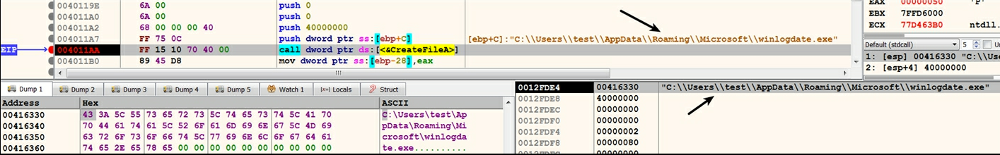

在创建可执行文件后，恶意软件将CreateFile返回的句柄值（0x54）作为第一个参数传递给WriteFile，并写入可执行内容（作为第二个参数传递），如这里所示。

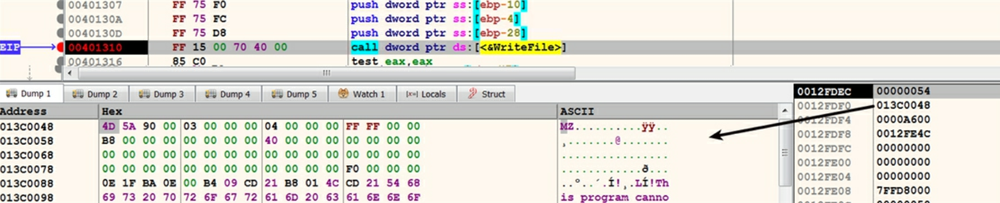

让我们假设你不知道哪个对象与句柄 0x54 相关联，可能是因为你直接在 WriteFile 上设置了一个断点，而最初没有在 CreateFile 上设置一个断点。要确定与句柄值相关联的对象，你可以在句柄窗口中查找它。在本例中，作为WriteFile的第一个参数传递的句柄值0x54，与winlogdate.exe相关，如图所示。

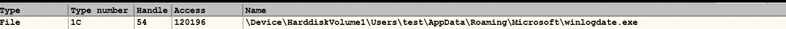

#### 2.7 调试64位恶意软件

你将使用同样的技术来调试一个64位的恶意软件；不同的是，你将处理扩展寄存器、64位内存地址/指针，以及稍微不同的调用惯例。如果你还记得（从第4章，汇编语言和反汇编入门），一个64位代码使用FASTCALL调用惯例，并在寄存器（rcx、rdx、r8和r9）中向函数传递前四个参数，其余的参数则放在堆栈中。在调试对函数/API的调用时，根据你要检查的参数，你将不得不检查寄存器或堆栈。之前提到的调用惯例适用于编译器生成的代码。攻击者用汇编语言编写的代码不需要遵循这些规则；因此，代码可以表现出不寻常的行为。当你遇到非编译器生成的代码时，可能需要对该代码进行进一步调查。

在调试64位恶意软件之前，让我们尝试用下面这个微不足道的C程序来理解64位二进制文件的行为，这个程序是用微软Visual C/C++编译器为64位平台编译的：

```
int main()
{
  printf("%d%d%d%d%s%s", 1, 2, 3, 4, "this", "is", "test") ;
  return 0;
} 
```

在前面的程序中，printf函数需要8个参数；这个程序在x64dbg中被编译和打开，并在printf函数处设置了一个断点。下面的截图显示了该程序，它在调用printf函数之前暂停了。在寄存器窗口，你可以看到前四个参数被放在rcx、rdx、r8和r9寄存器中。当程序调用一个函数时，该函数在堆栈上保留了0x20（32字节）的空间（可容纳四项，每项8字节大小）；这是为了确保被调用的函数有必要的空间，如果它需要保存寄存器参数（rcx、rdx、r8和r9）。这就是接下来的四个参数（第5、6、7、8个参数）被放在堆栈中的原因，从第五项（rsp+0x20）开始。我们向你展示这个例子是为了让你了解如何在堆栈中寻找参数。

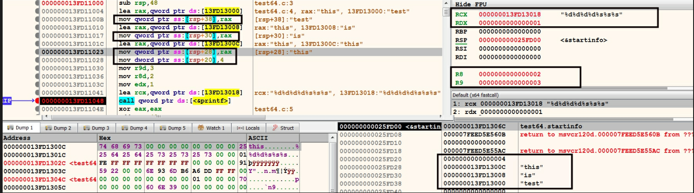

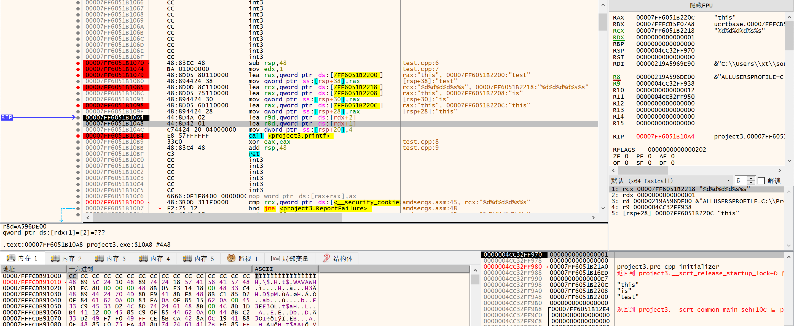

在32位函数的情况下，堆栈随着参数的推入而增长，当项目被弹出时则缩小。在64位函数中，堆栈空间是在函数开始时分配的，直到函数结束时才会改变。分配的堆栈空间用于存储局部变量和函数参数。在前面的截图中，注意第一条指令sub rsp,48是如何在堆栈上分配0x48（72）字节的空间的，之后在函数中间没有分配堆栈空间；另外，没有使用push和pop指令，而是使用mov指令将第5、6、7和8个参数放在堆栈上（在前面的截图中强调）。由于缺少push和pop指令，因此很难确定函数所接受的参数数量，也很难说内存地址是作为局部变量还是作为函数的参数。另一个挑战是，如果数值在函数调用前被移入寄存器rcx和rdx，就很难说它们是传递给函数的参数，还是因为其他原因被移入寄存器。

尽管对64位二进制文件进行逆向工程存在挑战，但你分析API调用应该不会有太大困难，因为API文档告诉你函数参数的数量、参数的数据类型，以及它们返回的数据类型。一旦你知道在哪里可以找到函数参数和返回值，你就可以在API调用处设置断点，检查其参数以了解恶意软件的功能。

 让我们看看一个64位恶意软件样本的例子，它调用RegSetValueEx来设置注册表中的一些值。在下面的截图中，断点是在调用RegSetValueEx之前触发的。您将需要查看寄存器和堆栈窗口中的值（如前所述），以检查传递给函数的参数；这将帮助您确定恶意软件设置的注册表值。在x64dbg中，快速获得函数参数摘要的最简单方法是查看默认窗口（在寄存器窗口下方），在下面的截图中突出显示。你可以在默认窗口中设置一个值来显示参数的数量。在下面的截图中，该值被设置为6，因为从API文档（https://msdn.microsoft.com/en-us/library/windows/desktop/ms724923(v=vs.85).aspx）中，你可以知道RegSetValueEx API需要6个参数。

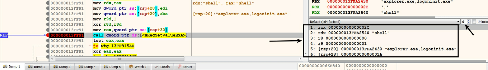

第一个参数值，0x2c，是打开注册表键的句柄。恶意软件可以通过调用RegCreateKey或RegOpenKey API来打开注册表键的句柄。从句柄窗口，你可以知道句柄值0x2c与下面截图中显示的注册表键有关。从句柄信息，以及通过检查第一、第二和第五个参数，你可以知道恶意软件修改了注册表键，HKEY_LOCAL_MACHINE\SOFTWARE\Microsoft\WindowsNT\CurrentVersion\Winlogon\shell，并添加了一个条目，"explorer.exe,logoninit.exe"。 在一个干净的系统中，这个注册表键指向explorer.exe（默认的Windows shell）。当系统启动时，Userinit.exe进程使用这个值来启动Windows外壳（explorer.exe）。通过添加logoninit.exe和explorer.exe，恶意软件确保logoninit.exe也被Userinit.exe启动；这是恶意软件使用的另一种类型的持久化机制。

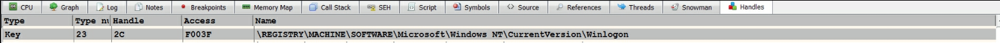

在这一点上，你应该对如何调试一个恶意可执行文件以了解其功能有了一定的了解。在下一节中，你将学习如何调试一个恶意的DLL以确定其行为。

#### 2.8 使用x64dbg调试一个恶意的DLL

在第3章 "动态分析 "中，你学到了执行DLL的技术来进行动态分析。在本节中，你将使用你在第3章动态分析中学到的一些概念，使用x64dbg调试DLL。如果你还不熟悉DLL的动态分析，强烈建议你在进一步阅读第3章动态分析中的第6节，动态链接库（DLL）分析。

要调试DLL，启动x64dbg（最好有管理员权限）并加载DLL（通过文件|打开）。当你加载DLL时，x64dbg将一个可执行文件（名为DLLLoader32_xxxx.exe，其中xxxx是随机的十六进制字符）放入你的DLL所在的同一目录；这个可执行文件作为一个通用的主机进程，它将被用来执行你的DLL（与rundll32.exe的方式相同）。在你加载DLL后，调试器可能会在系统断点、TLS回调或DLL入口点函数处暂停，这取决于配置设置（在前面的x64dbg中启动新进程部分提到）。如果不勾选系统断点*和TLS回调*选项，在加载DLL时，执行将暂停在DLL的入口点，如下面的截图所示。现在，你可以像其他程序一样对DLL进行调试。

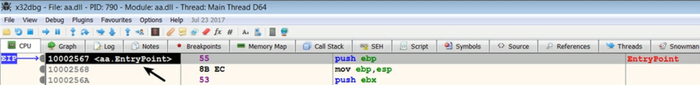

##### 2.8.1 在x64dbg中使用rundll32.exe来调试DLL

另一个有效的方法是使用 rundll32.exe 来调试 DLL（假设你想调试一个名为 rasaut.dll 的恶意软件 DLL）。要做到这一点，首先从system32目录下加载rundll32.exe（通过文件|打开）到调试器，这将使调试器在系统断点或rundll32.exe的入口点暂停（取决于前面提到的设置）。然后，选择Debug | Change Command Line，指定rundll32.exe的命令行参数（指定DLL的完整路径和导出函数），如下所示，然后点击OK。

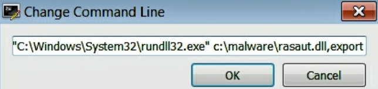

接下来，选择 "断点 "选项卡，在 "断点 "窗口内点击右键，选择 "添加DLL断点 "选项，这时会弹出一个对话窗口，提示你输入模块名称。输入DLL名称（在本例中是rasaut.dll），如下所示。这将告诉调试器在DLL（rasaut.dll）被加载时进行断点。配置完这些设置后，关闭调试器。

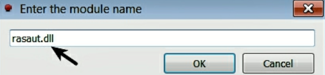

接下来，重新打开调试器，再次加载rundll32.exe；当你再次加载它时，之前的命令行设置仍将保持不变。现在，选择调试|运行（F9），直到你在DLL的入口处中断（你可能需要多次点击运行（F9），直到你到达DLL的入口点）。你可以通过查看断点地址旁边的注释来跟踪每次运行（F9）时执行暂停的位置。你也可以在eip寄存器旁边找到同样的注释。在下面的截图中，你可以看到执行在rasaut.dll的入口处暂停了。在这一点上，你可以像其他程序一样对DLL进行调试。你也可以在DLL导出的任何函数上设置断点。你可以通过使用符号窗口找到导出的函数；在你找到所需的导出函数后函数，双击它（这将带你到反汇编窗口中的导出函数的代码）。然后，在所需的地址设置一个断点。

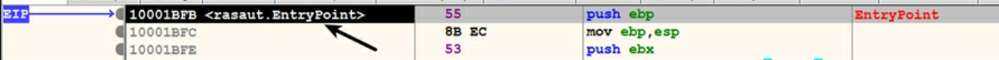

##### 2.8.2 调试一个特定进程中的DLL

有时，你可能想调试一个只在特定进程中运行的DLL（如explorer.exe）。这个过程与上一节所述的过程类似。首先，使用x64dbg启动进程或附加到所需的主机进程；这将暂停调试器。通过选择Debug | Run (F9)允许进程运行。接下来，选择 "断点 "选项卡，在 "断点 "窗口内点击右键，选择 "添加DLL断点 "选项，这时会出现一个对话窗口，提示您输入模块名称。输入DLL名称（如上一节所述）；这将告诉调试器在加载DLL时进行中断。现在，你需要将DLL注入到主机进程中。这可以通过像RemoteDLL（https://securityxploded.com/remotedll.php）这样的工具来完成。当DLL被加载时，调试器会在ntdll.dll的某个地方暂停；只要点击运行（F9），直到你到达注入的DLL的入口点（你可能要运行多次才能到达入口点）。你可以通过查看断点地址旁边的注释或eip寄存器旁边的注释来跟踪每次点击运行（F9）时执行暂停的位置，如上节所述。

#### 2.9 跟踪x64dbg的执行情况

跟踪允许你在进程执行时记录事件。x64dbg支持跟踪进入和跟踪超过条件的跟踪选项。你可以通过Trace | Trace into（Ctrl+Alt+F7）和Trace | Trace over（Ctrl+Alt+F8）访问这些选项。在Trace into中，调试器在内部通过设置步进断点来跟踪程序，直到满足条件或达到最大步数。在追踪结束时，调试器通过设置跨步断点来追踪程序，直到条件得到满足或达到最大步数。下面的截图显示了 "追踪到 "对话框（在 "追踪到 "对话框中也提供了同样的选项）。要跟踪日志，至少需要指定日志文本和日志文件的完整路径（通过日志文件按钮），跟踪事件将被重定向。

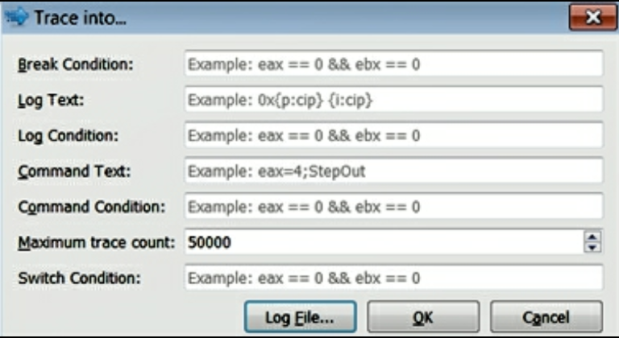


下面包括一些字段的简要描述。

* 断点条件。 你可以在这个字段中指定一个条件。这个字段的默认值是0（假）。为了指定条件，你需要指定任何有效的表达式（http://x64dbg.readthedocs.io/en/latest/introduction/Expressions.html），其评估值为非零值（真）。评价为非零值的表达式被认为是真的，从而触发断点。调试器通过评估所提供的表达式继续跟踪，当指定的条件得到满足时停止。如果条件不满足，则继续跟踪，直到达到最大跟踪次数。
* 日志文本。 此字段用于指定在日志文件中记录跟踪事件的格式。可以在这个字段中使用的有效格式在http://help.x64dbg.com/en/latest/introduction/Formatting.html。
* 日志条件。 这个字段的默认值是1。你可以选择提供一个日志条件，告诉调试器只有在满足特定条件时才记录事件。日志条件需要是一个有效的表达式（http://x64dbg.readthedocs.io/en/latest/introduction/Expressions.html）。
* 最大跟踪计数。 这个字段指定了在调试器放弃之前追踪的最大步骤数。默认值被设置为50000，你可以根据需要增加或减少这个值。
* 日志文件按钮。 你可以用这个按钮来指定保存跟踪日志的日志文件的完整路径。

x64dbg没有特定的指令跟踪和函数跟踪功能，但可以使用trace into和trace over选项来执行指令跟踪和函数跟踪。你可以通过添加断点来控制追踪。在下面的截图中，eip指向第1条指令，并在第5条指令处设置了一个断点。当追踪开始时，调试器从第一条指令开始追踪，并在断点处暂停。如果没有断点，则继续跟踪，直到程序结束，或达到最大跟踪次数。如果你想追踪函数内部的指令，你可以选择追踪到，或者追踪到函数的上方，追踪其余的指令。

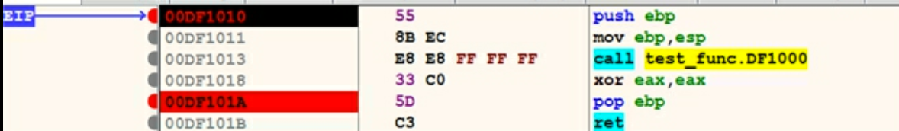

##### 2.9.1 指令追踪 

要对前一个程序进行指令追踪（例如，追踪到），可以在追踪到对话框中使用以下设置。如前所述，为了在日志文件中捕获跟踪事件，你需要指定日志文件的完整路径和日志文本。


前面截图中的Log Text值（0x{p:cip} {i:cip}）是字符串格式的，它指定调试器记录所有被跟踪指令的地址和反汇编情况。下面是该程序的跟踪记录。由于选择了跟踪到选项，函数内部的指令（0xdf1000）也被捕获（在下面的代码中突出显示）。指令追踪对于快速了解程序的执行流程非常有用。

```
0x00DF1011      mov ebp, esp
0x00DF1013      call 0xdf1000
0x00DF1000      push ebp
0x00DF1001      mov ebp, esp
0x00DF1003      pop ebp
0x00DF1004      ret
0x00DF1018      xor eax, eax
0x00DF101A      pop ebp
```

##### 2.9.2 函数跟踪

为了演示函数跟踪，请考虑下面截图中的程序。在这个程序中，eip指向第一条指令，断点设置在第五条指令（在这一点上停止追踪），第三条指令在0x311020处调用一个函数。我们可以使用函数追踪来确定该函数（0x311020）调用了哪些其他函数。

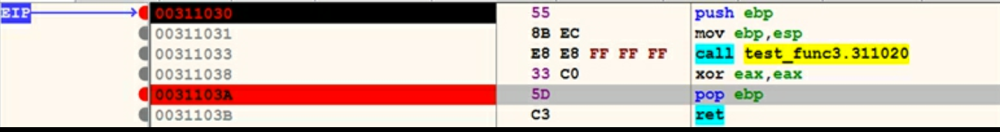

为了进行函数追踪（本例中选择了Trace into），采用了以下设置。这类似于指令跟踪，除了在日志条件字段中，指定一个表达式，告诉调试器只记录函数调用。

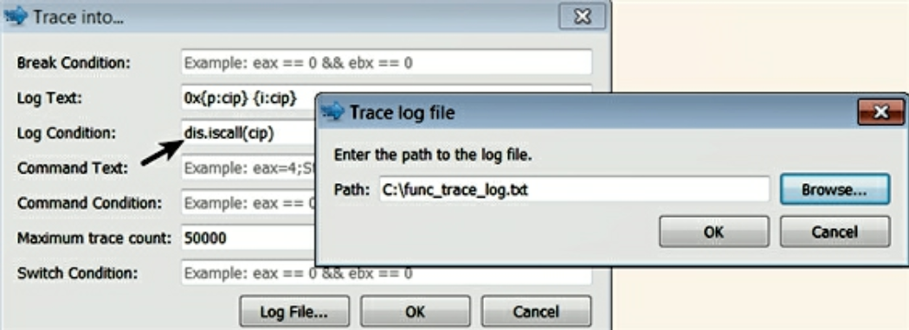

以下是日志文件中捕获的事件，是函数跟踪的结果。从下面的事件中，你可以知道函数0x311020在0x311000和0x311010调用了另外两个函数。
```
0x00311033 call 0x311020
0x00311023 call 0x311000
0x00311028 call 0x311010 
```

在前面的例子中，断点是用来控制跟踪的。当调试器到达断点时，执行被暂停，直到断点的指令/功能被记录下来。当你恢复调试器时，其余的指令会被执行，但不会被记录下来。

#### 2.10 在x64dbg中打补丁 
在进行恶意软件分析时，您可能想修改二进制文件以改变其功能或颠倒其逻辑以满足您的需要。x64dbg允许您修改内存中的数据或程序的指令。要修改内存中的数据，请导航到内存地址并选择你要修改的字节序列，然后右击并选择二进制|编辑（Ctrl + E），这将会出现一个对话框（如下所示），你可以用它来修改数据为ASCII、UNICODE或十六进制字节序列。

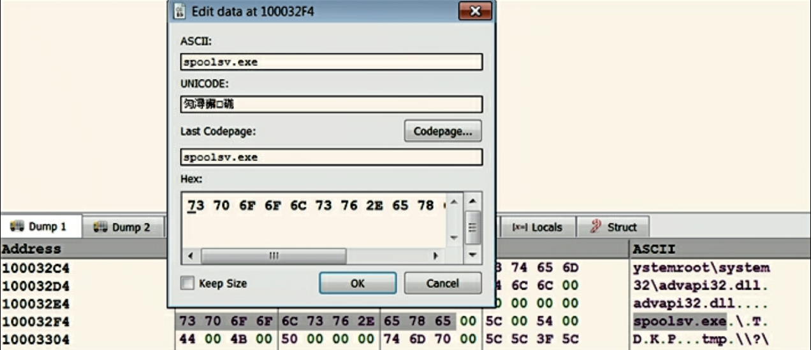

下面的截图显示了TDSS rootkit DLL的代码摘录（这也是上一章中使用IDA修补二进制文件一节中涉及的二进制文件）。如果你还记得，这个DLL使用字符串比较来执行检查，以确保它是在spoolsv.exe进程下运行。如果字符串比较失败（也就是说，如果DLL不是在spoolsv.exe下运行），那么代码就会跳到函数的末尾，并从函数中返回，而不会表现出恶意行为。假设你想让这个二进制文件在任何进程下运行（不仅仅是spoolsv.exe）。你可以用一条nop指令来修改条件跳转指令（JNE tdss.10001Cf9），以取消进程限制。要做到这一点，在条件性跳转指令上点击右键，选择组装，会出现如下所示的对话框，利用它可以输入指令。注意，在截图中，填充NOP的选项是被选中的，以确保指令的排列是正确的。

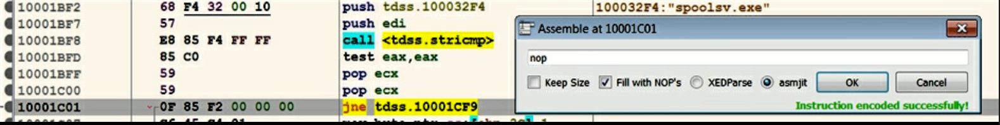

在你修改了内存或指令中的数据后，你可以通过选择文件|补丁文件将补丁应用到文件中，这时会出现一个补丁对话框，显示对二进制文件的所有修改。一旦你对所做的修改感到满意，点击补丁文件并保存该文件。

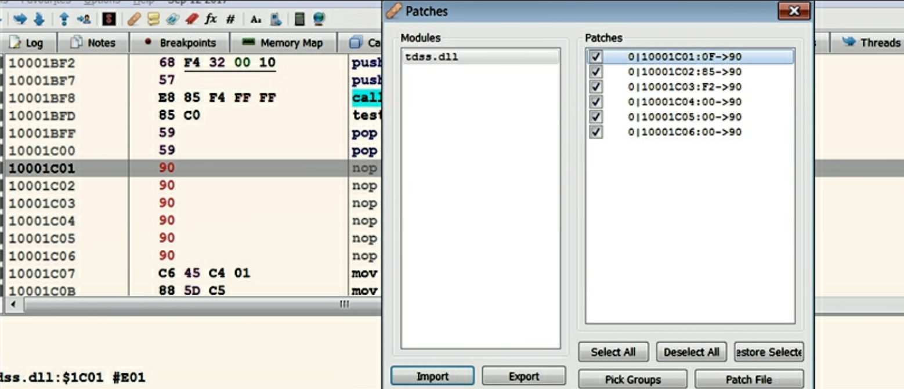

### 3. 使用IDA调试二进制文件

在上一章中，我们研究了IDA Pro的反汇编功能。在本章中，你将了解IDA的调试功能。IDA的商业版本可以调试32位和64位的应用程序，而演示版只允许你调试32位的Windows二进制文件。在本节中，你将看到IDA专业版提供的一些调试功能，并将学习如何使用它来调试一个恶意的二进制文件。  

#### 3.1 在IDA中启动一个新进程 
有不同的方法来启动一个新的进程；一种方法是直接启动调试器，而不需要最初加载程序。要做到这一点，启动IDA（不加载可执行文件），然后选择调试器|运行|本地Windows调试器；这将出现一个对话框，你可以选择要调试的文件。如果该可执行文件需要任何参数，你可以在参数栏中指定它们。这种方法将启动一个新的进程，调试器将在程序的进入点暂停执行。

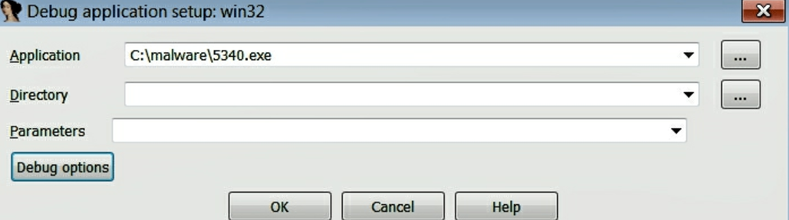

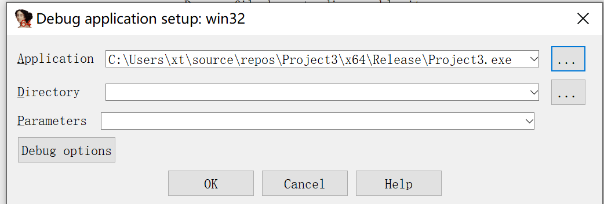

启动进程的第二种方法是首先在IDA中加载可执行文件（执行初始分析并显示反汇编的输出）。首先，通过调试器|选择调试器（或F9）选择正确的调试器；然后，你可以将光标放在第一条指令（或你希望执行暂停的指令）上，选择调试器|运行到光标（或F4）。这将启动一个新的进程，并将执行到当前光标位置（在这种情况下，断点会自动设置在当前光标位置）。

#### 3.2 使用IDA附加到一个现有的程序上

你附加到一个进程的方式取决于该程序是否已经加载。当一个程序还没有加载时，选择调试器|附加|本地Windows调试器。这将列出所有运行中的进程。只需选择要附加的进程。附加后，进程将立即暂停，让你有机会检查进程的资源并设置断点，然后再恢复进程的执行。在这种方法中，IDA将不能对二进制文件进行最初的自动分析，因为IDA的加载器将没有机会加载可执行图像。

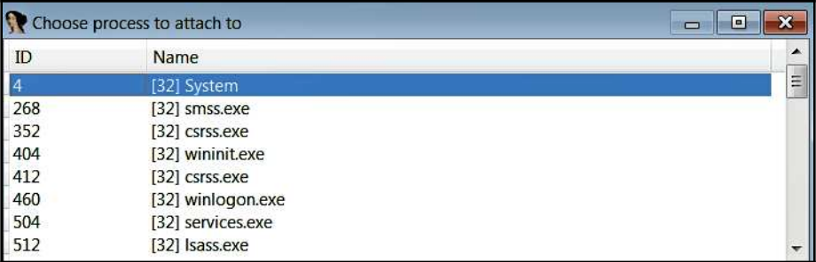

另一种附加到进程的方法是在附加到一个进程之前将与该进程相关的可执行文件加载到IDA。要做到这一点，使用IDA加载相关的可执行文件；这允许IDA执行其初始分析。然后，选择调试器|选择调试器，勾选本地Win32调试器（或本地Windows调试器）选项，并点击确定。然后，再次选择调试器|附加到进程，并选择要附加调试器的进程。

#### 3.3 IDA的调试器界面 
在IDA调试器中启动程序后，进程将暂停，下面的调试器显示将呈现给你。


当进程处于调试器控制之下时，反汇编工具栏被调试器工具栏取代。这个工具条由与调试功能有关的按钮组成（如进程控制和断点）。

* 反汇编窗口。这个窗口与指令指针寄存器（eip 或 rip）的当前值同步。反汇编窗口提供的功能与你在前一章学到的相同。你也可以通过按空格键在图形视图和文本视图模式之间切换。
* 寄存器窗口。这个窗口显示CPU的通用寄存器的当前内容。你可以右击一个寄存器的值，然后点击修改值、归零值、切换值、增量或减量值。如果你想改变CPU标志位的状态，切换一个值特别有用。如果寄存器的值是一个有效的内存位置，寄存器值旁边的直角箭头将被激活；点击这个箭头将把视图重新定位到相应的内存位置。如果你发现你已经导航到了一个不同的位置，并且想去指令指针所指向的位置，那么只要点击指令指针寄存器值（eip或rip）旁边的直角箭头即可。
* 堆栈视图。堆栈视图显示进程的运行时堆栈的数据内容。在调用一个函数之前检查堆栈可以得到关于函数参数的数量和函数参数的类型的信息。
* Hex视图。这显示的是内存的标准十六进制转储。如果你想显示一个有效的内存位置的内容（包含在寄存器、堆栈或指令中），十六进制视图很有用。
* 模块视图。它显示加载到进程内存中的模块（可执行文件及其共享库）的列表。双击列表中的任何模块会显示该模块导出的符号列表。这是一个简单的方法来导航到加载的库中的功能。
* 线程视图。显示当前进程中的线程列表。你可以在这个窗口上点击右键来暂停一个线程或恢复一个暂停的线程。
* 段落窗口。段落窗口可以通过查看|打开子视图|段落（或Shift + F7）来实现。当你在调试一个程序时，片段窗口提供了关于进程中分配的内存片段的信息。这个窗口显示了可执行文件及其部分在内存中的加载位置的信息。它还包含所有加载的DLLs的细节，以及它们的段信息。双击任何一个条目，都会带你到反汇编窗口或十六进制窗口中的相应内存位置。你可以控制内存地址的内容在哪里显示（在反汇编或十六进制窗口）；要做到这一点，只需将光标放在反汇编或十六进制窗口的任何地方，然后双击该条目。根据光标的位置，内存地址的内容将显示在适当的窗口中。

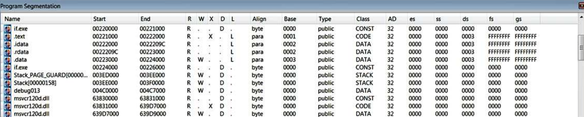

* 进口和出口窗口。当进程处于调试器控制下时，默认不显示进口和出口窗口。你可以通过视图|打开子视图来调出这些窗口。进口窗口列出了二进制文件导入的所有函数，而出口窗口则列出了所有导出的函数。导出的函数通常在DLLs中找到，所以当你调试恶意的DLLs时，这个窗口可能特别有用。

上一章介绍的其他IDA窗口，也可以通过视图| 打开子视图。

#### 3.4 使用IDA控制流程的执行

在第1.2节 "控制进程的执行 "中，我们研究了调试器提供的不同的执行控制 的不同执行控制功能。下表列出了你在调试程序时可以在IDA中使用的常见的执行 下表概述了在IDA中调试程序时可以使用的常见执行控制功能。


| 功能           | 快捷键 | Menu                         |
| -------------- | ------ | ---------------------------- |
| Continue (Run) | F9     | Debugger \| Continue process |
| Step into步进  | F7     | Debugger \| Step into        |
| Step over步过  | F8     | Debugger \| Step over        |
| Run to cursor  | F4     | Debugger \| Run to cursor    |

#### 3.5 在IDA中设置断点

要在IDA中设置一个软件断点，你可以导航到你想要的位置 程序暂停的位置，然后按F2键（或右击并选择添加断点）。在 你设置了断点后，设置断点的地址会以红色突出显示。 颜色。你可以在包含断点的行上按F2键来删除断点。 

在下面的截图中，断点被设置在地址0x00401013（调用 sub_401000）。要在断点地址暂停执行，首先，选择调试器 (如本地Win32调试器)，如前所述，然后通过以下方式运行程序 选择调试器|启动程序（或F9热键）。这将执行所有的 这将在到达断点前执行所有指令，并在断点地址处暂停。


在IDA中，你可以通过编辑已经设置的断点来设置硬件和条件断点。要设置一个硬件断点，请右击现有的断点，选择编辑断点。在弹出的对话框中，选中硬件复选框，如下图所示。IDA允许你设置四个以上的硬件断点，但只有其中的四个能起作用，其他的硬件断点将被忽略。

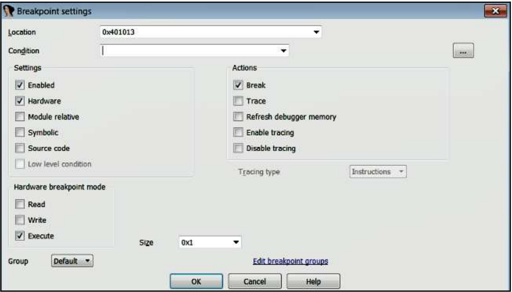

你可以使用硬件断点来指定是执行时断点（默认）、写时断点还是读/写时断点。写时断点和读/写时断点选项允许你在任何指令访问指定的内存位置时创建内存断点。如果你想知道你的程序何时从一个内存位置访问一个数据（读/写），这个断点就很有用。执行时断点选项允许你在指定内存位置被执行时设置断点。除了指定模式外，你还必须指定一个大小。一个硬件断点的大小与它的地址相结合，形成一个可以触发断点的字节范围。

你可以通过在条件栏中指定条件来设置一个条件断点。该条件可以是一个实际的条件，或者是IDC或IDAPython表达式。你可以点击条件字段旁边的...按钮，这将打开编辑器，在这里你可以使用IDC或IDAPython脚本语言来评估该条件。您可以在https://www.hex-rays.com/products/ida/ support/idadoc/1488.shtml找到一些设置条件断点的例子。

你可以通过导航到Debugger | Breakpoints | Breakpoint List（或键入Ctrl + Alt + B）来查看所有的活动断点。你可以右键单击断点条目，禁用或删除断点。

#### 3.6 调试恶意软件的可执行文件

在本节中，我们将看看如何使用IDA来调试一个恶意软件的二进制文件。考虑一下32位恶意软件样本的反汇编列表。恶意软件调用CreateFileW API来创建一个文件，但是，只看反汇编列表，并不清楚恶意软件创建了什么文件。从MSDN的CreateFile文档中，你可以知道CreateFile的第一个参数将包含文件名；同时，CreateFile的后缀W指定文件名是UNICODE字符串（关于API的细节在前一章已经介绍过了）。为了确定文件名，我们可以在调用CreateFileW➊的地址处设置一个断点，然后运行程序（F9）直到它到达断点。当它到达断点时（在调用CreateFileW之前），函数的所有参数将被推入堆栈，因此我们可以检查堆栈中的第一个参数，以确定文件的名称。调用CreateFileW后，文件的句柄将在eax寄存器中返回，并被复制到位于➋的esi寄存器中。

```
.text:00401047 push 0 ; hTemplateFile
.text:00401049 push 80h ; dwFlagsAndAttributes
.text:0040104E push 2 ; dwCreationDisposition
.text:00401050 push 0 ; lpSecurityAttributes
.text:00401052 push 0 ; dwShareMode
.text:00401054 push 40000000h ; dwDesiredAccess
.text:00401059 lea edx, [esp+800h+Buffer]
.text:00401060 push edx ; lpFileName
.text:00401061 ➊ call ds:CreateFileW
.text:00401067 mov esi, eax ➋
```

在下面的截图中，在调用CreateFileW时，执行被暂停了（由于设置了断点并运行了该程序）。该函数的第一个参数是UNICODE字符串（文件名）的地址（0x003F538）。你可以使用IDA的Hex-View窗口来检查任何有效内存位置的内容。通过右击地址0x003F538并选择Follow in hex dump选项，倾倒第一个参数的内容，在Hex-View窗口中显示文件名，如下所示。在这种情况下，恶意软件正在C:\Users\test\AppData\Local\Temp目录下创建一个文件，SHAMple.dat。

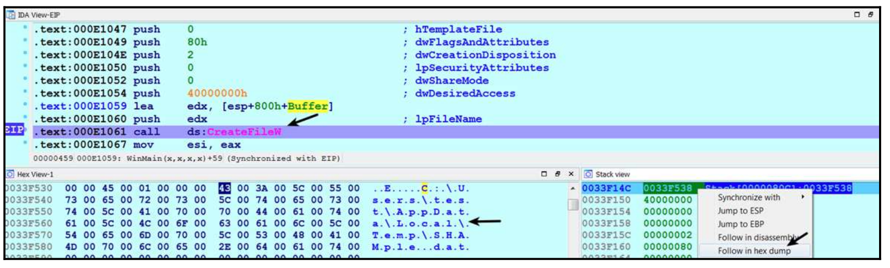

恶意软件在创建文件后，将文件句柄作为第一个参数传递给WriteFile函数。这表明，恶意软件向SHAmple.dat文件写入了一些内容。为了确定它向文件写入了什么内容，你可以检查WriteFile函数的第二个参数。在这种情况下，它正在将字符串FunFunFun写入文件，如下面的截图中所示。如果恶意软件正在向文件写入可执行内容，你也将能够使用这种方法看到它。

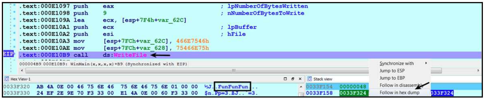

#### 3.7 使用IDA调试一个恶意的DLL

在第3章，动态分析中，你学到了执行DLL的技术来进行动态分析。在本节中，你将使用你在第3章动态分析中所学到的一些概念来使用IDA调试一个DLL。如果你不熟悉DLL的动态分析，强烈建议你在进一步阅读第3章动态分析中的第6节，动态链接库（DLL）分析。

要使用IDA调试器调试DLL，你首先需要指定用于加载DLL的可执行文件（如rundll32.exe）。要调试一个DLL，首先，将DLL加载到IDA，它可能会显示DLLMain函数的反汇编。在DLLMain函数的第一条指令处设置一个断点（F2），如下面的屏幕截图所示。这确保了当你运行DLL时，执行将在DLLMain函数的第一条指令处暂停。你也可以通过从IDA的Exports窗口导航到DLL导出的任何函数上设置断点。

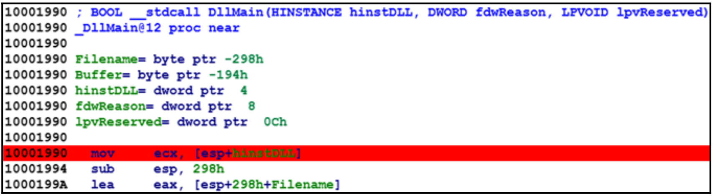

在您在所需的地址（您希望执行暂停的地方）设置断点后，通过调试器|选择调试器|本地Win32调试器（或调试器|选择调试器|本地Windows调试器）选择调试器并点击确定。接下来，选择调试器 | 进程选项，会出现下面截图中的对话框。在应用程序领域，输入用于加载DLL的可执行文件的完整路径（rundll32.exe）。在输入文件字段中，输入你希望调试的DLL的完整路径，在参数字段中，输入要传递给rundll32.exe的命令行参数，然后点击确定。现在，你可以运行该程序以达到断点，之后你可以像调试其他程序一样调试它。你传递给rundll32.exe的参数应该有正确的语法，以便成功地调试DLL（参考第三章动态分析中rundll32.exe的工作部分）。需要注意的一点是，rundll32.exe也可以用来执行64位DLL，方式相同。

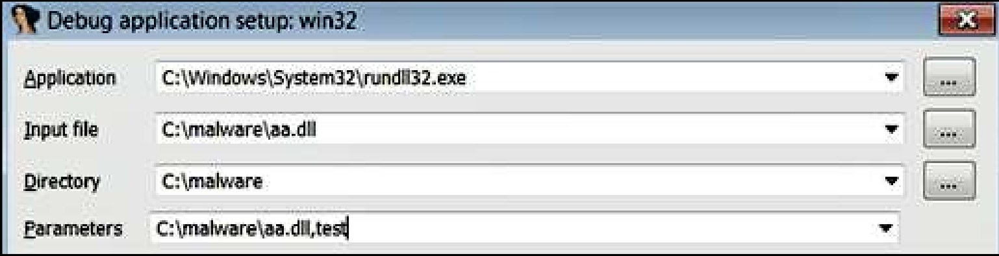

##### 3.7.1 调试一个特定进程中的DLL

在第三章，动态分析中，你了解到一些DLL如何进行进程检查，以确定它们是否在一个特定的进程下运行，如explorer.exe或iexplore.exe。在这种情况下，你可能想在一个特定的主机进程内调试一个DLL，而不是rundll32.exe。要在DLL的入口点暂停执行，你可以启动一个新的主机进程实例，或者使用调试器附加到所需的主机进程，然后选择调试器|调试器选项，勾选库加载/卸载时暂停的选项。这个选项将告诉调试器，每当加载或卸载一个新模块时就暂停。完成这些设置后，你可以恢复暂停的主机进程，并通过按F9热键让它运行。现在你可以用像RemoteDLL这样的工具将DLL注入到被调试的主机进程中。当DLL被主机进程加载时，调试器将暂停，让你有机会在加载模块的地址上设置断点。你可以通过查看Segments窗口来了解DLL加载到内存的位置，如图所示。

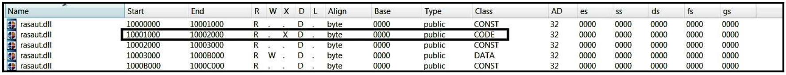

在前面的截图中，你可以看到注入的DLL（rasaut.dll）已经在地址0x10000000（基础地址）处加载到内存中。你可以通过将基址（0x10000000）与PE头中AddressOfEntryPoint字段的值相加，在进入点的地址处设置一个断点。你可以通过将DLL加载到pestudio或CFFexplorer等工具中来确定入口点的地址值。例如，如果AddressOfEntryPoint的值是0x1BFB，那么可以通过将基础地址（0x10000000）与0x1BFB的值相加来确定DLL的入口点，结果是0x10001BFB。现在你可以导航到地址0x10001BFB（或者通过按G键跳转到该地址）并在该地址设置一个断点，然后恢复暂停的进程。

#### 3.8 使用IDA追踪执行情况

追踪允许你在一个进程执行时记录（日志）特定的事件。它可以 提供关于二进制文件的详细执行信息。IDA支持三种类型的 追踪：指令追踪、函数追踪和基本块追踪。要在IDA中启用追踪功能。 你需要设置一个断点，然后右击断点地址，选择编辑 断点，这时会出现一个断点设置对话框。在该对话框中，勾选 启用跟踪选项，并选择适当的跟踪类型。然后，选择调试器 通过调试器|选择调试器菜单（如前所述），并运行（F9）该 程序。下面的截图中的位置字段指定了正在编辑的断点。 被编辑的断点，它将被用作执行跟踪的起始地址。追踪将持续到 追踪将继续进行，直到它到达一个断点，或到达程序的终点。为了表明 哪些指令被追踪，IDA用彩色编码突出显示这些指令。在 追踪后，你可以通过选择调试器|追踪|追踪窗口来查看追踪的结果。 窗口。你可以通过Debugger | Tracing | Tracing options来控制跟踪选项。

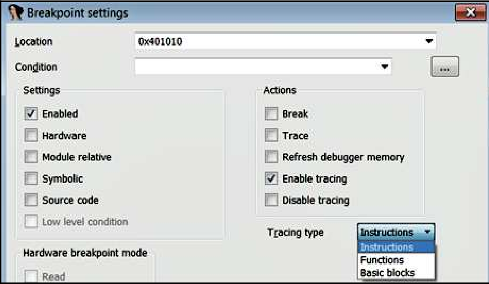

指令跟踪记录每条指令的执行，并显示修改的寄存器值。指令跟踪的速度较慢，因为调试器在内部对程序进行单步操作，以监测和记录所有的寄存器值。指令跟踪对于确定程序的执行流程是非常有用的，可以了解每条指令的执行过程中哪些寄存器被修改。你可以通过添加断点来控制跟踪。

考虑一下下面截图中的程序。让我们假设你想追踪 前四条指令（在第三条指令中还包括一个函数调用）。要做到这一点 首先，在第一条指令设置一个断点，在第五条指令设置另一个断点。 第五条指令，如下面的截图所示。然后，编辑第一个断点（位于 地址0x00401010）并启用指令跟踪。现在，当你开始调试时，调试器会追踪前四条指令。 调试器会跟踪前四条指令（包括函数内部的指令） 并在第五条指令时暂停。如果您没有指定第二个断点，它将跟踪 所有的指令。

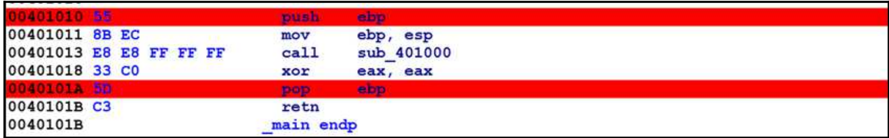

 下面的截图显示了跟踪窗口中的指令跟踪事件，当时调试器在第五条指令处暂停。注意执行过程是如何从main流向sub_E41000，然后又回到main的。如果你想跟踪其余的指令，你可以通过恢复暂停的进程来实现。

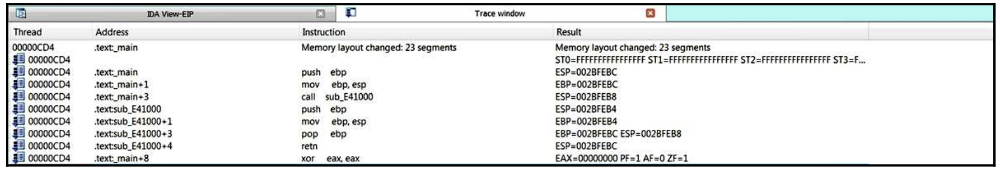

函数跟踪。这记录了所有的函数调用和返回，对于函数追踪事件不记录寄存器的值。函数跟踪对于确定哪些函数和子函数被程序调用很有用。你可以通过将跟踪类型设置为函数，并按照指令跟踪的相同程序来执行函数跟踪。

在下面的例子中，恶意软件样本调用了两个函数。假设我们想快速了解第一个函数调用了哪些其他函数。为此，我们可以在第一条指令处设置第一个断点，并启用函数跟踪（通过编辑断点），然后我们可以在第二条指令处设置另一个断点。第二个断点将作为停止点（追踪将被执行，直到达到第二个断点）。下面的屏幕截图显示了这两个断点。

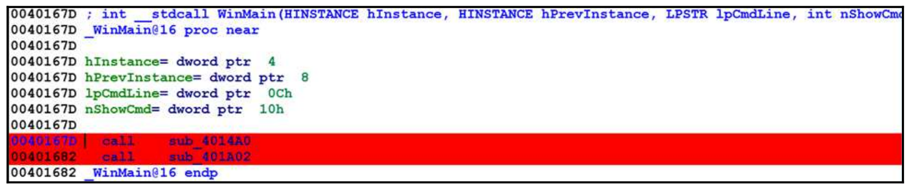

在下面的例子中，恶意软件样本调用了两个函数。 假设我们想快速了解第一个函数调用了哪些其他函数。

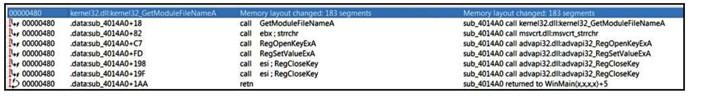

有时，你的跟踪可能需要很长的时间，而且似乎永远不会结束；如果函数没有返回给它的调用者，而是在一个循环中运行，等待一个事件的发生，就会发生这种情况。在这种情况下，你仍然能够在跟踪窗口中看到跟踪记录。   

* 块追踪。IDA允许你进行块追踪，这对于了解在运行期间执行了哪些代码块很有用。你可以通过将追踪类型设置为基本块来启用块追踪。
* 在块追踪的情况下，调试器在每个函数的每个基本块的最后一条指令处设置断点，它还在被追踪块中间的任何调用指令处设置断点。基本块跟踪比正常执行要慢，但比指令或函数跟踪要快。

#### 3.9 使用IDAPython的调试器脚本

你可以使用调试器脚本来自动完成与恶意软件分析有关的常规任务。在上一章中，我们看了使用IDAPython进行静态代码分析的例子。在本节中，你将学习如何使用IDAPython来执行调试相关任务。本节演示的IDAPython脚本使用了新的IDAPython API，这意味着，如果你使用旧版本的IDA（低于IDA 7.0），这些脚本将无法工作。

下面的资源应该可以帮助你开始使用IDAPython调试器的脚本。这些资源中的大部分（除了IDAPython文档）都是使用旧的IDAPython API来演示脚本功能的，但它们应该足以让你明白这个道理。任何时候你遇到困难，你都可以参考IDAPython文档。

* IDAPython API文档：https://www.hex-rays.com/products/ida/ support/idapython_docs/idc-module.html 
* Magic Lantern Wiki: http://magiclantern.wikia.com/wiki/IDAPython 
* IDA脚本调试器：https://www.hex-rays.com/products/ida/debugger/scriptable.shtml 
* 使用IDAPython使你的生活更轻松（系列）：https://researchcenter.paloaltonetworks.com/2015/12/using-idapython-to-make-your-life-easierpart-1/

本节将让你感受到如何使用IDAPython进行调试相关的工作。首先，在IDA中加载可执行文件，并选择调试器（通过调试器|选择调试器）。为了测试下面的脚本命令，选择了本地Windows调试器。可执行文件加载完毕后，你可以在IDA的Python shell中执行下面提到的Python代码片段，或者选择文件|脚本命令（Shift + F2），并选择脚本语言为Python（从下拉菜单）。如果你希望以独立脚本的形式运行，你可能需要导入相应的模块（例如，导入idc）。

下面的代码片段在当前光标位置设置一个断点，启动调试器，等待暂停调试器事件发生，然后打印出与断点地址相关的地址和反汇编文本。


```
idc.add_bpt(idc.get_screen_ea())
idc.start_process('', '', '')
evt_code = idc.wait_for_next_event(WFNE_SUSP, -1)
if (evt_code > 0) and (evt_code !=idc.PROCESS_EXITED):
	evt_ea = idc.get_event_ea()
	print "Breakpoint Triggered at:",
hex(evt_ea),idc.generate_disasm_line(evt_ea, 0)
```

以下是执行前述脚本后产生的输出结果命令。

```
Breakpoint Triggered at: 0x1171010 push ebp
```

下面的代码片断步入下一条指令，并打印出地址和反汇编文本。以同样的方式，你可以使用idc.step_over()来步入指令。

```
idc.step_into()
evt_code = idc.wait_for_next_event(WFNE_SUSP, -1)
if (evt_code > 0) and (evt_code !=idc.PROCESS_EXITED):
	evt_ea = idc.get_event_ea()
	print "Stepped Into:", hex(evt_ea),idc.generate_disasm_line(evt_ea, 0)
```

执行前面的脚本命令的结果显示在这里。

```
Stepped Into: 0x1171011 mov ebp,esp
```

要获得一个寄存器的值，你可以使用 idc.get_reg_value() 。下面的例子 获取esp寄存器的值并在输出窗口中打印出来。

```
Python>esp_value = idc.get_reg_value("esp")
Python>print hex(esp_value)
0x1bf950
```

要获得地址为0x14fb04的dword值，请使用以下代码。以 同样，你可以使用idc.read_dbg_byte(ea), idc.read_dbg_word(ea), 和idc.read_dbg_qword(ea)来获取特定地址的字节、字和qword值。 地址的字节、字和q字值。

```
Python>ea = 0x14fb04
print hex(idc.read_dbg_dword(ea))
0x14fb54
```

要获得地址为0x01373000的ASCII字符串，使用以下方法。默认情况下，idc.get_strlit_contents()函数会得到指定地址的ASCII字符串。

```
Python>ea = 0x01373000
Python>print idc.get_strlit_contents(ea)
This is a simple program
```

为了获得UNICODE字符串，你可以使用idc.get_strlit_contents()函数，将其strtype参数设置为常量值idc.STRTYPE_C_16，如下所示。你可以在idc.idc文件中找到定义的常量值，该文件位于你的IDA安装目录中。

```
Python>ea = 0x00C37860
Python>print idc.get_strlit_contents(ea, strtype=idc.STRTYPE_C_16)
SHAMple.dat
```

下面的代码列出了所有加载的模块（可执行文件和DLLs）以及它们的基础地址。

```
import idautils
for m in idautils.Modules():
   print "0x%08x %s" % (m.base, m.name)
```

执行前面的脚本命令的结果显示在这里。

```
0x00400000 C:\malware\5340.exe
0x735c0000 C:\Windows\SYSTEM32\wow64cpu.dll
0x735d0000 C:\Windows\SYSTEM32\wow64win.dll
0x73630000 C:\Windows\SYSTEM32\wow64.dll
0x749e0000 C:\Windows\syswow64\cryptbase.dll
[REMOVED]
```

要获得kernel32.dll中CreateFileA函数的地址，使用以下代码。

```
Python>ea = idc.get_name_ea_simple("kernel32_CreateFileA")
Python>print hex(ea)
0x768a53c6
```

要恢复一个暂停的进程，你可以使用以下代码。

```
Python>idc.resume_process()
```

##### 3.9.1 确定恶意软件所访问的文件的例子

在上一章，在讨论IDAPython时，我们写了一个IDAPython脚本来确定CreateFileA函数的所有交叉引用（CreateFileA被调用的地址）。在本节中，让我们加强该脚本，以执行调试任务，并确定由恶意软件创建（或打开）的文件的名称。

下面的脚本在程序中调用CreateFileA的所有地址上设置一个断点，并运行恶意软件。在运行以下脚本之前，选择适当的调试器（调试器|选择调试器|本地Windows调试器）。当这个脚本被执行时，它在每个断点（换句话说，在调用CreateFileA之前）暂停，并打印出第一个参数（lpFileName）、第二个参数（dwDesiredAccess）和第五个参数（dwCreationDisposition）。这些参数将给我们提供文件的名称，一个代表对文件进行操作的常量值（如读/写），以及另一个常量值，表示将进行的操作（如创建或打开）。当触发断点时，第一个参数可以在[esp]处访问，第二个参数在[esp+0x4]处，第五个参数在[esp+0x10]处。除了打印一些参数外，脚本还通过在步入CreateFile函数后检索EAX寄存器的值来确定文件的句柄（返回值）。

```
import idc
import idautils
import idaapi
ea = idc.get_name_ea_simple("CreateFileA")
if ea == idaapi.BADADDR:
	print "Unable to locate CreateFileA"
else:
  for ref in idautils.CodeRefsTo(ea, 1):
  idc.add_bpt(ref)
idc.start_process('', '', '')
while True:
  event_code = idc.wait_for_next_event(idc.WFNE_SUSP, -1)
  if event_code < 1 or event_code == idc.PROCESS_EXITED:
  	break
  evt_ea = idc.get_event_ea()
  print "0x%x %s" % (evt_ea, idc.generate_disasm_line(evt_ea,0))
  esp_value = idc.get_reg_value("ESP")
  dword = idc.read_dbg_dword(esp_value)
  print "\tFilename:", idc.get_strlit_contents(dword)
  print "\tDesiredAccess: 0x%x" % idc.read_dbg_dword(esp_value + 4)
 	print "\tCreationDisposition:",hex(idc.read_dbg_dword(esp_value+0x10))
 	idc.step_over()
 	evt_code =idc.wait_for_next_event(idc.WFNE_SUSP, -1)
	if evt_code == idc.BREAKPOINT:
 		print "\tHandle(return value): 0x%x" %idc.get_reg_value("EAX")
	idc.resume_process()
```

下面是执行前述脚本的结果。DesiredAccess值，0x40000000和0x80000000，分别代表GENERIC_WRITE和GENERIC_READ操作。createDisposition值，0x2和0x3，分别表示CREATE_ALWAYS（总是创建一个新文件）和OPEN_EXISTING（打开一个文件，只有当它存在时）。正如你所看到的，通过使用调试器脚本，可以快速确定恶意软件创建/访问的文件名。

```
0x4013fb call ds:CreateFileA
 Filename: ka4a8213.log
 DesiredAccess: 0x40000000
 CreationDisposition: 0x2
 Handle(return value): 0x50
0x401161 call ds:CreateFileA
 Filename: ka4a8213.log
 DesiredAccess: 0x80000000
 CreationDisposition: 0x3
 Handle(return value): 0x50
0x4011aa call ds:CreateFileA
 Filename: C:\Users\test\AppData\Roaming\Microsoft\winlogdate.exe
 DesiredAccess: 0x40000000
 CreationDisposition: 0x2
 Handle(return value): 0x54
----------------[Removed]------------------------
```

### 4. 调试一个.NET应用程序

在进行恶意软件分析时，你将不得不处理分析各种各样的代码。你可能会遇到使用微软Visual C/C++、Delphi和.NET框架创建的恶意软件。在本节中，我们将简要介绍一个名为dnSpy（https:// github.com/0xd4d/dnSpy）的工具，它使分析.NET二进制文件更加容易。当涉及到反编译和调试.NET应用程序时，它是相当有效的。要加载一个.NET应用程序，你可以将应用程序拖放到dnSpy中，或者启动dnSpy并选择文件|打开，给它二进制文件的路径。一旦加载了.NET应用程序，dnSpy就会对该程序进行反编译，你可以在左侧的窗口（名为Assembly explorer）中访问该程序的方法和类。下面的截图显示了反编译后的.NET恶意二进制文件（名为SQLite.exe）的主要功能。

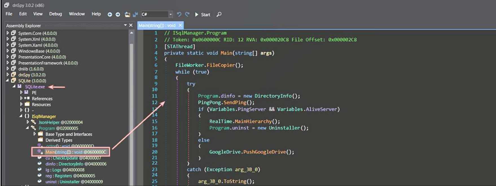

一旦二进制文件被反编译，你可以阅读代码（静态代码分析），以确定恶意软件的功能，或调试代码并执行动态代码分析。要调试恶意软件，你可以点击工具栏上的 "开始 "按钮，或选择 "调试"|"调试汇编"（F5）；这将弹出如图所示的对话框。

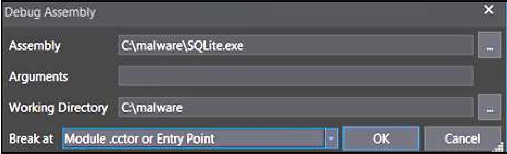

使用Break at下拉选项，您可以指定调试器启动时的中断位置。一旦您对这些选项满意，您可以点击确定，这将在调试器的控制下启动进程，并在入口处暂停调试器。现在，您可以通过Debug菜单访问各种调试器选项（如Step Over, Step into, Continue等），如下图所示。你也可以通过双击某一行来设置断点，或者选择Debug | Toggle Breakpoint（F9）。当你调试时，你可以利用本地窗口来检查一些本地变量或内存位置。

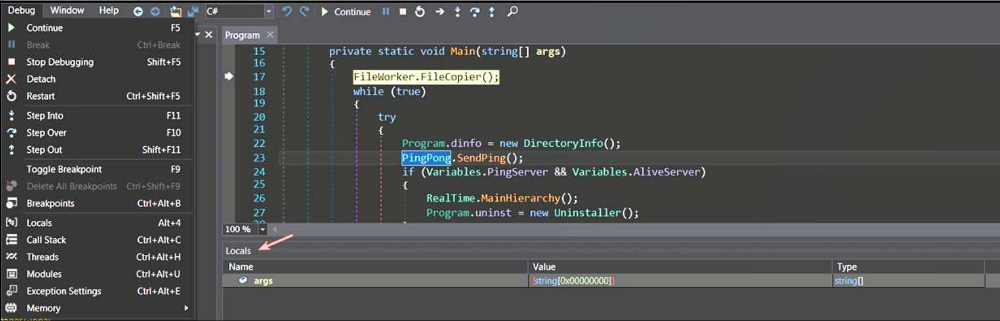

为了了解.NET二进制分析，以及对前面提到的二进制文件（名为SQLite.exe）的详细分析，你可以阅读作者的博文：https://cysinfo.com/cyber-attack-targetingcbi-and-possibly-indian-army-officials/。


### 摘要

本章所涉及的调试技术是了解恶意二进制文件内部运作的有效方法。恶意二进制文件的内部工作原理。代码分析工具所提供的调试功能 诸如IDA、x64dbg和dnSpy等代码分析工具所提供的调试功能可以大大增强你的逆向工程进程。工程过程。在恶意软件分析过程中，你通常会结合反汇编 和调试技术来确定恶意软件的功能，并从恶意二进制文件中获得有价值的 从恶意二进制文件中获得有价值的信息。

在下一章中，我们将使用迄今为止学到的技能来了解各种恶意软件的特点和功能。
