## 8. 代码注入和钩子

在上一章中，我们研究了恶意软件用来留在受害者系统中的不同持久性机制。在本章中，你将学习恶意程序如何将代码注入另一个进程（称为目标进程或远程进程）以执行恶意行动。将恶意代码注入目标进程的内存并在目标进程的上下文中执行恶意代码的技术被称为代码注入（或进程注入）。

攻击者通常选择一个合法进程（如explorer.exe或svchost.exe）作为目标进程。一旦恶意代码被注入目标进程，它就可以在目标进程的上下文中执行恶意行为，如记录击键、窃取密码和渗出数据。在将代码注入目标进程的内存后，负责注入代码的恶意软件组件可以继续在系统上持续存在，从而在每次系统重启时将代码注入目标进程，或者它可以从文件系统中删除自己，只将恶意代码保留在内存中。/

在我们深入研究恶意软件的代码注入技术之前，必须了解虚拟内存的概念。


### 8.1 虚拟内存

当你双击一个包含指令序列的程序时，就会创建一个进程。Windows操作系统为每个新创建的进程提供自己的私有内存地址空间（称为进程内存）。进程内存是虚拟内存的一部分；虚拟内存不是真正的内存，而是由操作系统的内存管理器创造的一种假象。正是由于这种假象，每个进程都认为它有自己的私有内存空间。在运行期间，Windows内存管理器在硬件的帮助下，将虚拟地址转化为实际数据所在的物理地址（在RAM中）；为了管理内存，它将一些内存分页到磁盘。当进程的线程访问被分页到磁盘的虚拟地址时，内存管理器将其从磁盘装回内存。下图说明了两个进程，A和B，它们的进程内存被映射到物理内存中，而有些部分被分页到磁盘上。

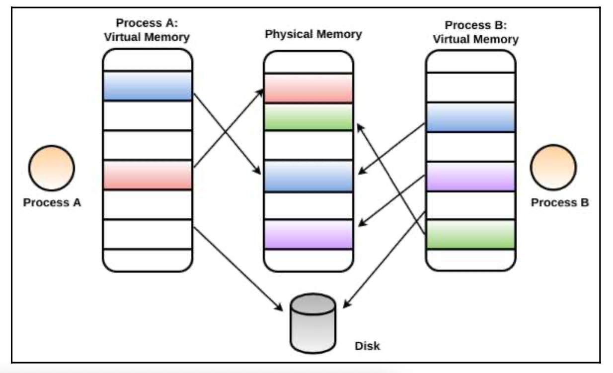

由于我们通常处理的是虚拟地址（就是你在调试器中看到的那些），所以在本章的其余部分，我们将不讨论物理内存。现在，让我们来关注一下虚拟内存。虚拟内存被划分为进程内存（进程空间或用户空间）和内核内存（内核空间或系统空间）。虚拟内存地址空间的大小取决于硬件平台。例如，在32位架构上，默认情况下，总的虚拟地址空间（包括进程和内核内存）最大为4GB。低于一半的部分（下2GB空间），范围从0x00000000到0x7FFFFFFF，被保留给用户进程（进程内存或用户空间），地址的上半部分（上2GB空间），范围从0x80000000到0xFFFFFFFF，被保留给内核内存（内核空间）。

在32位系统中，在4GB的虚拟地址空间中，每个进程认为它有2GB的进程内存，范围从0x00000000 - 0x7FFFFFFF。由于每个进程认为它有自己的私有虚拟地址空间（最终被映射到物理内存），总的虚拟地址会比可用的物理内存（RAM）大很多。Windows内存管理器通过将一些内存分页到磁盘来解决这个问题；这释放了物理内存，它可以用于其他进程或操作系统本身。尽管每个Windows进程都有自己的私有内存空间，但内核内存在大多数情况下是公用的，并由所有进程共享。下图显示了32位架构的内存布局。你可能会注意到在用户空间和内核空间之间有一个64KB的空隙；这个区域是不可访问的，它可以确保内核不会意外地越过边界而破坏用户空间。你可以通过检查符号MmHighestUserAddress来确定进程地址空间的上边界（最后可用的地址），通过使用内核调试器（如Windbg）查询符号MmSystemRangeStart来确定内核空间的下边界（第一个可用地址）。

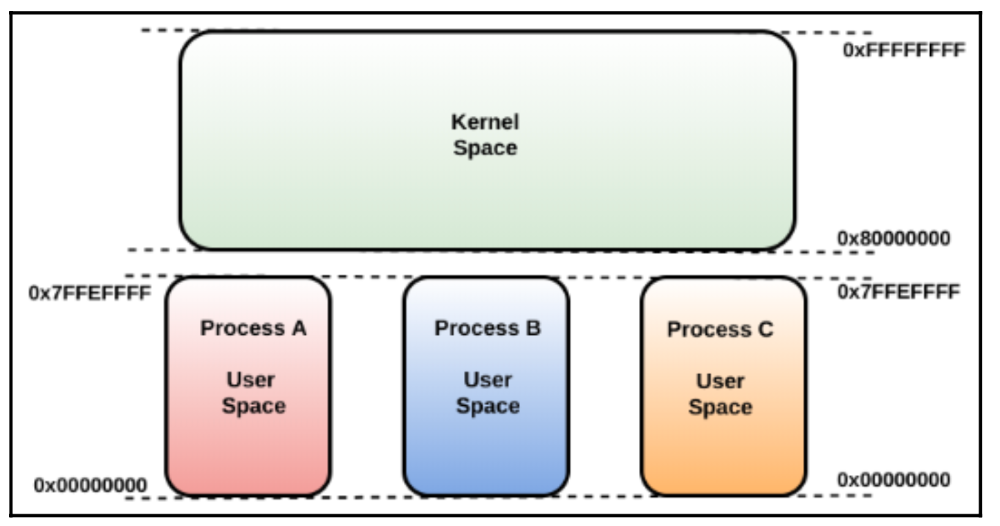

即使每个进程的虚拟地址范围是相同的（x00000000 - 0x7FFFFFFF），硬件和Windows都确保映射到这个范围的物理地址对每个进程是不同的。例如，当两个进程访问同一个虚拟地址时，每个进程最终将访问物理内存中的不同地址。通过为每个进程提供私有的地址空间，操作系统确保进程不会覆盖对方的数据。

虚拟内存空间不需要总是被分成2GB的两半，这只是默认设置。例如，你可以通过以下命令启用3GB的启动开关，将进程内存增加到3GB，范围从0x00000000 -
0xBFFFFFFF；内核内存得到剩余的1GB，从0xC0000000-0xFFFFFFFF。

```
 bcdedit /set increaseuserva 3072
```

x64架构为进程和内核内存提供更大的地址空间，如下图所示。在x64架构上，用户空间的范围是0x000000000000-0x000007ffffffff，而内核空间的范围是0xffff080000000000及以上。你可能会注意到在用户空间和内核空间之间有一个巨大的地址差距；这个地址范围是不能使用的。尽管在下面的截图中，内核空间是从0xffff080000000000开始的，但内核空间的第一个可用地址是从ffff800000000开始的。原因是x64代码中使用的所有地址都必须是规范的。如果一个地址的第47-63位全部被设置或全部被清除，那么这个地址就是规范的的。试图使用一个非规范的地址会导致一个页面故障异常。

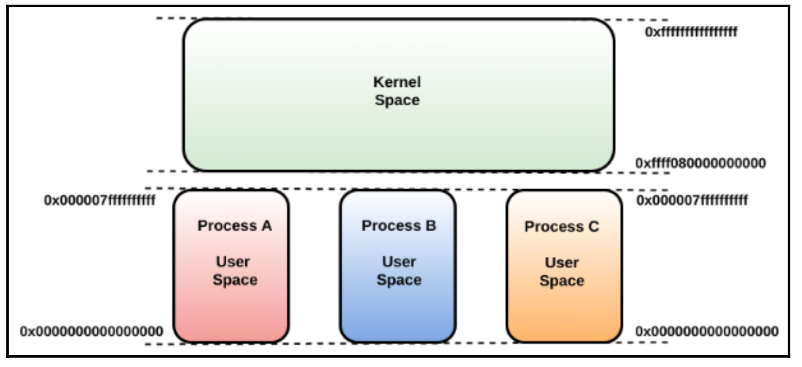

#### 1.1 进程内存组件（用户空间）

有了对虚拟内存的了解，让我们把注意力集中在虚拟内存的一部分，即进程内存。进程内存是用户应用程序使用的内存。下面的截图显示了两个进程，并给出了驻留在进程内存中的组件的高级概述。在下面的截图中，为了简单起见，内核空间被故意留空（我们将在下一节中填补这一空白）。请记住，进程共享相同的内核空间。

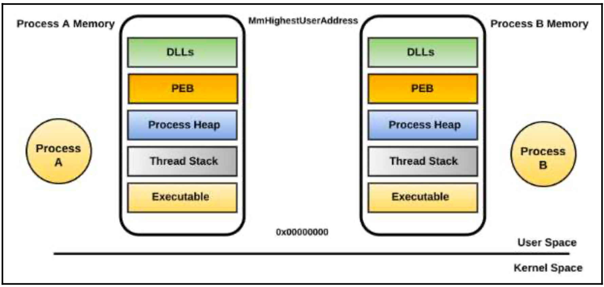

过程存储器由以下主要部分组成。

* 进程可执行文件。这个区域包含与应用程序相关的可执行文件。当双击磁盘上的一个程序时，就会创建一个进程，并将与该程序相关的可执行文件加载到进程内存中。
* 动态链接库（DLLs）。当一个进程被创建时，其所有相关的DLLs被加载到进程内存中。这个区域代表与进程相关的所有DLLs。
* 进程环境变量。这个内存区域存储进程的环境变量，如临时目录、主目录、AppData目录等等。
* 进程堆。这个区域指定了进程的堆。每个进程有一个单一的堆，并且可以根据需要创建额外的堆。这个区域指定了进程所接受的动态输入。 
* 线程堆栈。这个区域代表分配给每个线程的进程内存的专用范围，称为其运行时堆栈。每个线程都有自己的堆栈，在这里可以找到函数参数、局部变量和返回地址。
* 进程环境块（PEB）。这个区域代表了PEB结构，它包含了关于可执行文件的加载位置、它在磁盘上的完整路径以及在内存中找到DLL的信息。

你可以通过使用Process Hacker（https://processhacker.sourceforge.io/）工具来检查一个进程的内存内容。要做到这一点，启动Process Hacker，右键单击所需的进程，选择属性，并选择内存选项卡。

#### 1.2 内核内存内容（内核空间）

内核内存包含操作系统和设备驱动程序。下面的截图显示了用户空间和内核空间的组件。在本节中，我们将主要关注内核空间的组件。

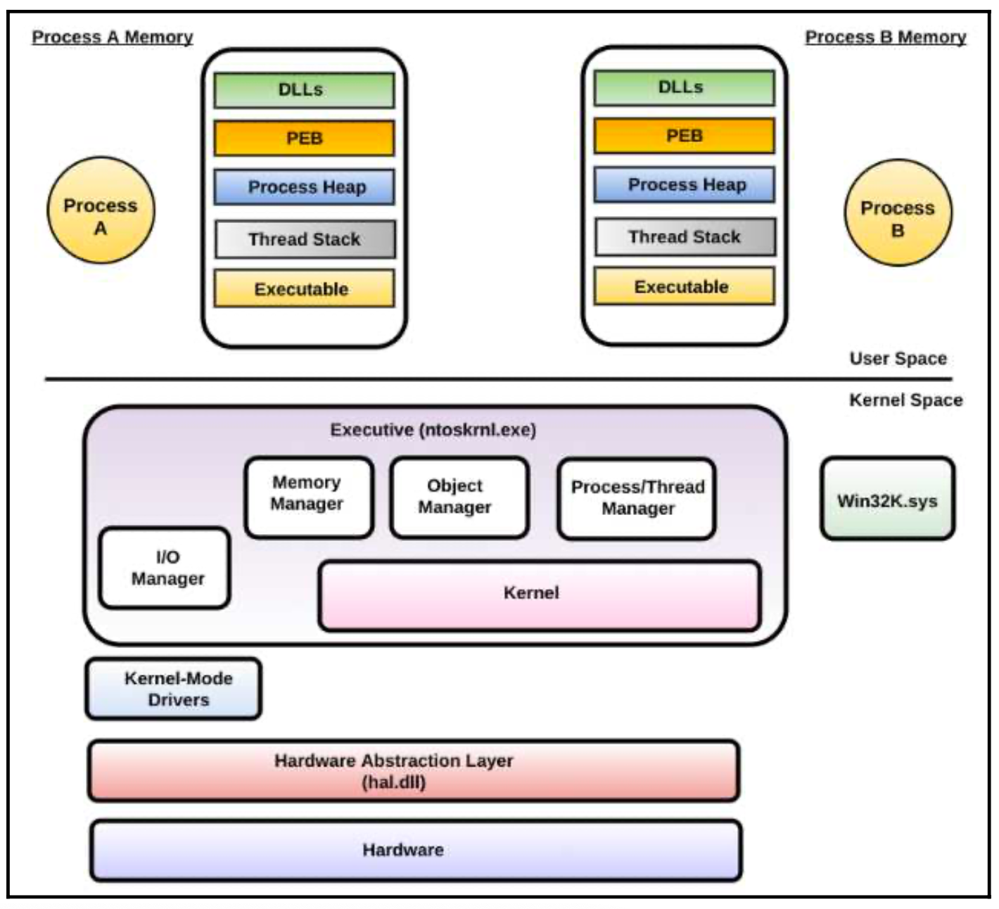

内核内存由以下关键部分组成。

* hal.dll。硬件抽象层（HAL）是在可加载的内核模块hal.dll中实现的。HAL将操作系统与硬件隔离；它实现了支持不同硬件平台（主要是芯片组）的功能。它主要为Windows执行器、内核和内核模式设备驱动程序提供服务。内核模式设备驱动程序调用hal.dll暴露的功能与硬件进行交互，而不是直接与硬件进行通信。
* ntoskrnl.exe。这个二进制文件是被称为内核镜像的Windows操作系统的核心组件。ntoskrnl.exe二进制文件提供两种类型的功能：执行和内核。执行器实现了被称为系统服务例程的功能，用户模式的应用程序可以通过一个受控机制调用这些功能。执行器还实现了主要的操作系统组件，如内存管理器、I/O管理器、对象管理器、进程/线程管理器，等等。内核实现了低级别的操作系统服务，并公开了一系列的例程，这些例程由执行器建立，以提供高级别的服务。
* Win32K.sys。这个内核模式的驱动程序实现了用户界面和图形设备接口（GDI）服务，这些服务用于在输出设备（如显示器）上渲染图形。它为GUI应用程序提供功能。

### 2. 用户模式和内核模式

在上一节中，我们看到虚拟内存是如何被分为用户空间（进程内存）和内核空间（内核内存）的。用户空间包含的代码（如可执行文件和DLL）以受限的访问方式运行，被称为用户模式。换句话说，在用户空间运行的可执行文件或DLL代码不能访问内核空间的任何东西，也不能与硬件直接交互。内核空间包含内核本身（ntoskrnl.exe）和设备驱动程序。运行在内核空间的代码以高权限执行，即所谓的内核模式，它可以同时访问用户空间和内核空间。通过为内核提供高权限级别，操作系统确保用户模式的应用程序不能通过访问受保护的内存或I/O端口而导致系统不稳定。第三方驱动程序可以通过实现和安装签名的驱动程序使他们的代码在内核模式下运行。

空间（用户空间/内核空间）和模式（用户模式/内核模式）之间的区别是，空间指定了内容（数据/代码）的存储位置，而模式指的是执行模式，它指定了允许应用程序的指令如何执行。

如果用户模式的应用程序不能直接与硬件交互，那么问题是，在用户模式下运行的恶意软件二进制文件如何通过调用WriteFile API将内容写入磁盘上的文件？事实上，大多数由用户模式应用程序调用的API，最终都会调用内核执行程序（ntoskrnl.exe）中实现的系统服务程序（功能），而内核执行程序又会与硬件进行交互（例如，向磁盘上的文件写入）。以同样的方式，任何调用GUI相关API的用户模式应用程序最终都会调用内核空间中win32k.sys所暴露的功能。下图说明了这个概念；为了简单起见，我从用户空间删除了一些组件。ntdll.dll（驻留在用户空间）充当了用户空间和内核空间之间的网关。以同样的方式，user32.dll作为GUI应用程序的网关。在下一节，我们将主要关注通过ntdll.dll将API调用过渡到内核执行的系统服务例程。

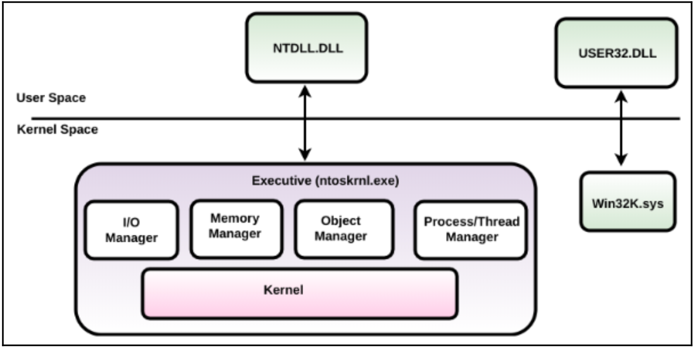

#### 2.1 Windows API调用流程

Windows操作系统通过暴露在DLLs中实现的API来提供服务。一个应用程序通过调用DLL中实现的API来使用服务。大多数API函数最终会调用ntoskrnl.exe（内核执行）中的系统服务程序。在这一节中，我们将研究当应用程序调用API时会发生什么，以及API如何最终调用ntoskrnl.exe（执行）中的系统服务例程。具体来说，我们将看看当一个应用程序调用WriteFile()API时会发生什么。下图给出了API调用流程的高级概述。

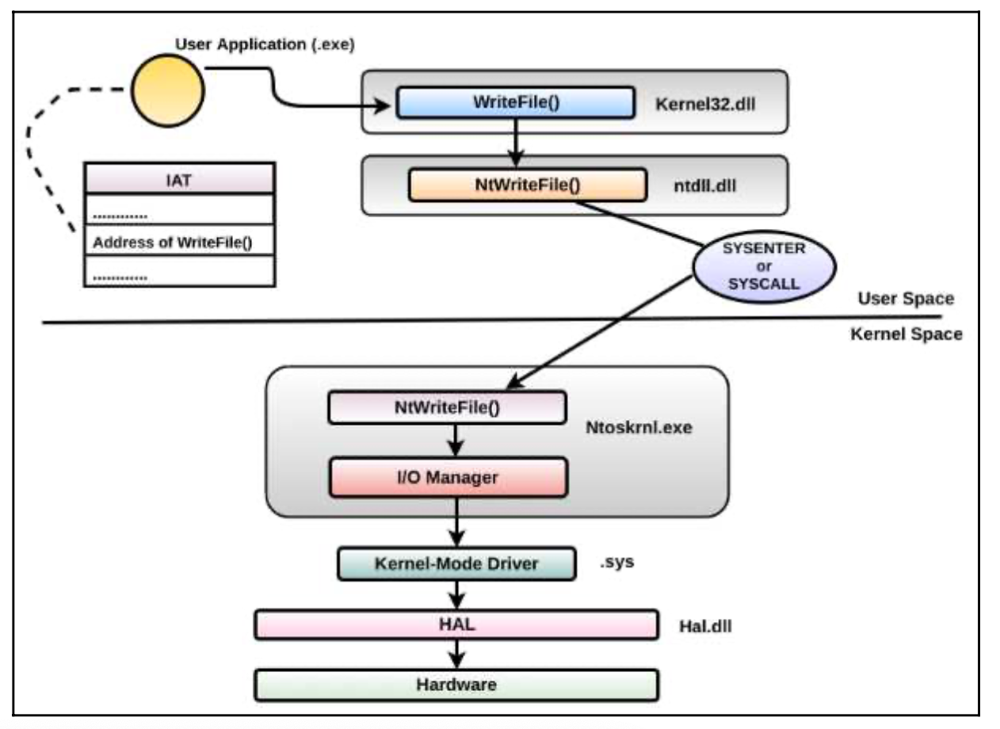

1. 当一个进程通过双击程序被调用时，进程的可执行图像及其所有相关的DLLs被Windows加载器加载到进程内存中。当一个进程启动时，主线程被创建，它从内存中读取可执行代码并开始执行它。需要记住的一点是，执行代码的不是进程，而是执行代码的线程（进程只是线程的一个容器）。被创建的线程开始在用户模式下执行（有限制的访问）。一个进程可以根据需要明确地创建额外的线程。
2. 我们假设一个应用程序需要调用WriteFile()API，它是由kernel32.dll导出的。为了将执行控制转移到WriteFile()，线程必须知道WriteFile()在内存中的地址。如果应用程序导入了WriteFile()，那么它可以通过查看一个叫做导入地址表（IAT）的函数指针表来确定其地址，如前图所示。这个表位于内存中的应用程序的可执行映像中，当DLLs被加载时，它被windows加载器填充了函数地址。
一个应用程序也可以在运行期间通过调用LoadLibrary()API来加载DLL。
它可以通过使用GetProcessAddress()API来确定加载的DLL中的函数地址。如果一个应用程序在运行期间加载一个DLL，那么IAT就不会被填充。
3. 一旦线程从IAT或在运行时确定了WriteFile()的地址，它就会调用WriteFile()，在kernel32.dll中实现。WriteFile()函数中的代码最终会调用一个DLL网关，ntdll.dll导出的函数NtWriteFile()。ntdll.dll 中的 NtWriteFile() 函数并不是 NtWriteFile() 的真正实现。实际的函数，具有相同的名称，NtWriteFile()（系统服务例程），驻留在ntoskrnl.exe（执行）中，它包含真正的实现。ntdll.dll中的NtWriteFile()只是一个存根例程，执行SYSENTER（x86）或SYSCALL（x64）指令。这些指令将代码过渡到内核模式。
4. 现在，在内核模式下运行的线程（具有不受限制的访问权限）需要找到实际函数NtWriteFile()的地址，该函数在ntoskrnl.exe中实现。要做到这一点，它需要查询内核空间中的一个表称为系统服务描述符表（SSDT），并确定NtWriteFile()的地址。然后，它调用Windows执行程序（在ntoskrnl.exe中）中实际的NtWriteFile()（系统服务例程），该程序将请求引向I/O管理器中的I/O功能。然后，I/O管理器将请求指向适当的内核模式设备驱动程序。内核模式设备驱动程序使用HAL导出的例程来与硬件接口。

### 3. 代码注入技术

如前所述，代码注入技术的目的是将代码注入远程进程的内存，并在远程进程的上下文中执行注入的代码。注入的代码可以是一个模块，如可执行文件，DLL，甚至是shellcode。代码注入技术为攻击者提供了许多好处；一旦代码被注入到远程进程中，攻击者可以做以下事情。

* 迫使远程进程执行注入的代码以进行恶意操作（如下载额外的文件或窃取键盘按键信息）。
* 注入一个恶意模块（如DLL），并将远程进程的API调用重定向到注入模块中的一个恶意函数。然后，该恶意函数可以拦截API调用的输入参数，也可以过滤输出参数。例如，Internet Explorer使用HttpSendRequest()向Web服务器发送一个包含可选POST有效载荷的请求，它使用InternetReadFile()从服务器的响应中获取字节，并在浏览器中显示它。攻击者可以在Internet Explorer的进程内存中注入一个模块，并将HttpSendRequest()重定向到被注入模块中的恶意函数，以便从POST有效载荷中提取证书。以同样的方式，它可以拦截从InternetReadFile()API收到的数据，读取数据或修改从网络服务器收到的数据。这使攻击者能够在数据到达网络服务器之前拦截数据（如银行凭证），也使攻击者能够在数据到达受害者的浏览器之前替换或插入额外的数据到服务器的响应中（如在HTML内容中插入一个额外的字段）。
* 将代码注入到已经运行的进程中，允许攻击者实现持久性。
* 将代码注入到受信任的进程中，允许攻击者绕过安全产品（如白名单软件）并躲避用户。

在本节中，我们将主要关注用户空间中的代码注入技术。我们将研究攻击者用来对远程进程进行代码注入的各种方法。

在以下代码注入技术中，有一个注入代码的恶意软件进程（启动器或加载器）和一个合法进程（如explorer.exe），代码将被注入其中。在执行代码注入之前，启动器需要首先确定要注入代码的进程。这通常是通过列举系统上运行的进程来完成的；它使用三个API调用。CreateToolhelp32Snapshot(), Process32First(), 和Process32Next()。CreateToolhelp32Snapshot()用于获取所有正在运行的进程的快照；Process32First()获取快照中第一个进程的信息；Process32Next()在一个循环中用于遍历所有进程。Process32First()和Process32Next()API获得有关进程的信息，如可执行名称、进程ID和父进程ID；这些信息可以被恶意软件用来确定它是否是目标进程。有时，恶意程序不是将代码注入已经运行的进程，而是启动一个新的进程（如notepad.exe），然后向其中注入代码。

无论恶意软件是向已经运行的进程注入代码，还是启动一个新的进程来注入代码，所有代码注入技术（接下来会介绍）的目标都是向目标（合法）进程的地址空间注入恶意代码（无论是DLL、可执行代码，还是Shellcode），并迫使合法进程执行注入的代码。根据代码注入技术的不同，要注入的恶意组件可以驻留在磁盘或内存中。下图应该能让你对用户空间的代码注入技术有一个高层次的了解。

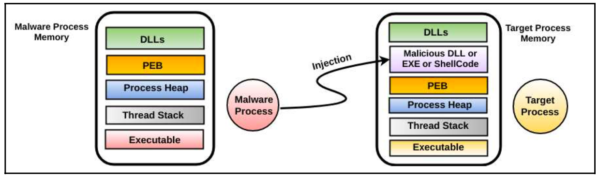

#### 3.1 远程DLL注入

在这种技术中，目标（远程）进程被强迫通过LoadLibrary()API将一个恶意的DLL加载到其进程内存空间。kernel32.dll输出LoadLibrary()，该函数接受一个参数，即磁盘上DLL的路径，并将该DLL加载到调用进程的地址空间。在这种注入技术中，恶意软件进程在目标进程中创建了一个线程，该线程通过传递恶意DLL路径作为参数来调用LoadLibrary()。由于线程在目标进程中被创建，目标进程将恶意DLL加载到其地址空间。一旦目标进程加载了恶意DLL，操作系统就会自动调用DLL的DllMain()函数，从而执行恶意代码。

下面的步骤详细描述了这种技术是如何进行的，以一个名为nps.exe（加载器或启动器）的恶意软件为例，它通过LoadLibrary()向合法的explorer.exe进程注入一个DLL。在注入恶意的DLL组件之前，它被投放到磁盘上，然后执行以下步骤。

1. 恶意软件进程（nps.exe）识别目标进程（explorer.exe，在这种情况下）并获得其进程ID（pid）。获取pid的目的是为目标进程打开一个句柄，以便恶意软件进程能够与之互动。要打开一个句柄，需要使用OpenProcess()API，它接受的参数之一是进程的pid。在下面的截图中，恶意软件通过传递explorer.exe的pid（0x624，即1572）作为第三个参数调用OpenProcess()。OpenProcess()的返回值是对explorer.exe进程的句柄。

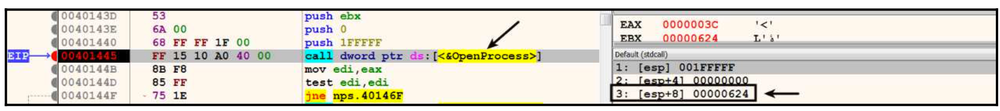

2. 然后，恶意软件进程在目标进程中使用VirutualAllocEx()API分配内存。在下面的截图中，第1个参数（0x30）是explorer.exe（目标进程）的句柄，它从上一步获得。第3个参数，0x27（39），代表目标进程中要分配的字节数，第5个参数（0x4）是一个常量值，代表PAGE_READWRITE的内存保护。VirtualAllocEx()的返回值是explorer.exe中分配的内存地址。

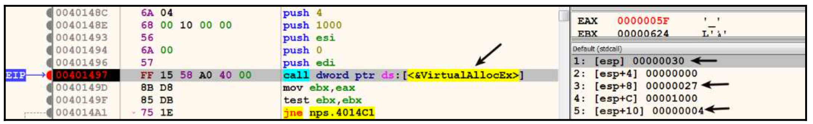

3. 在目标进程中分配内存的原因是为了复制一个字符串，以确定磁盘上恶意DLL的完整路径。恶意软件使用WriteProcessMemory()将DLL路径名复制到目标进程的分配内存中。在下面的截图中，第2个参数0x01E30000是目标进程中分配的内存地址，第3个参数是DLL的完整路径，将被写入explorer.exe中分配的内存地址0x01E30000。

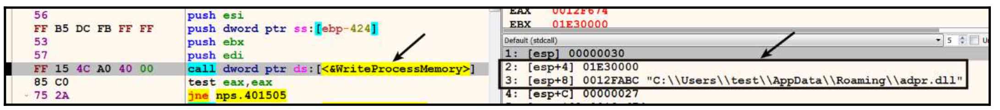

4. 将DLL路径名复制到目标进程内存的想法是，以后在目标进程中创建远程线程以及通过远程线程调用LoadLibrary()时，DLL路径将作为参数传递给LoadLibrary()。在创建远程线程之前，恶意软件必须确定LoadLibrary()在kernel32.dll中的地址；为此，它调用GetModuleHandleA()API并传递kernel32.dll作为参数，这将返回Kernel32.dll的基地址。一旦得到kernel32.dll的基地址，它就通过调用GetProcessAddress()来确定LoadLibrary()的地址。
5. 在这一点上，恶意软件已经复制了目标进程内存中的DLL路径名，并确定了LoadLibrary()的地址。现在，恶意软件需要在目标进程（explorer.exe）中创建一个线程，这个线程必须通过传递复制的DLL路径名来执行LoadLibrary()，这样恶意的DLL就会被explorer.exe加载。要做到这一点，恶意软件调用CreateRemoteThread()（或未记录的API NtCreateThreadEx()），这在目标进程中创建一个线程。在下面的截图中，CreateRemoteThread()的第一个参数0x30是explorer.exe进程的句柄，该线程将在其中创建。第4个参数是目标进程内存中线程将开始执行的地址，也就是LoadLibrary()的地址，第5个参数是目标进程内存中包含DLL完整路径的地址。在调用CreateRemoteThread()后，explorer.exe中创建的线程调用LoadLibrary()，它将从磁盘上加载DLL到explorer.exe进程内存空间。作为加载恶意DLL的结果，其DLLMain()函数被自动调用，从而在explorer.exe的上下文中执行恶意代码。

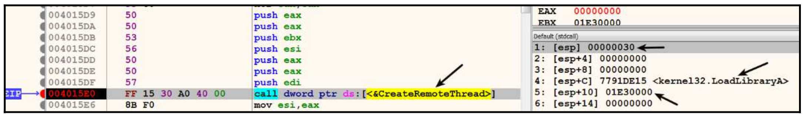

6. 一旦注入完成，恶意软件调用VirtualFree()API释放包含DLL路径的内存，并通过使用CloseHandle()API关闭目标进程（explorer.exe）的句柄。

> 一个恶意进程可以将代码注入到以相同或更低的完整性级别运行的其他进程。例如，一个以中等完整性运行的恶意软件进程可以将代码注入explorer.exe进程（它也以中等完整性级别运行）。为了操纵系统级进程，恶意进程需要通过调用AdjustTokenPrivileges()来启用SE_DEBUG_PRIVILEGE（这需要管理员权限）；这允许它读取、写入或注入代码到另一个进程的内存。

#### 3.2 使用APC的DLL注入（APC注入）

在之前的技术中，在写入DLL路径名后，CreateRemoteThread()被调用，以在目标进程中创建一个线程，而这个线程又调用LoadLibrary()来加载恶意的DLL。APC注入技术类似于远程DLL注入，但恶意软件不是使用CreateRemoteThread()，而是利用异步过程调用（APC）来强迫目标进程的线程加载恶意DLL。

APC是一个在特定线程的上下文中异步执行的函数。每个线程都包含一个APC队列，当目标线程进入可警告状态时，APC将被执行。根据微软的文档（https://msdn.microsoft.com/en-us/library/windows/desktop/ms681951(v=vs.85).aspx），如果一个线程调用了以下函数之一，它就进入了可预警状态。

```
   SleepEx(),
   SignalObjectAndWait()
   MsgWaitForMultipleObjectsEx()
   WaitForMultipleObjectsEx()
   WaitForSingleObjectEx()
```

APC注入技术的工作方式是，恶意软件进程确定目标进程（将注入代码的进程）中的线程，该线程处于可警告状态，或可能进入可警告状态。然后，它通过使用QueueUserAPC()函数将自定义代码放入该线程的APC队列。排列自定义代码的想法是，当线程进入可警告状态时，自定义代码会从APC队列中被选中，并由目标进程的线程执行。

1. 它使用OpenThread()API为目标进程的线程打开一个句柄。在下面的截图中，第3个参数，0xBEC(3052)，是iexplore.exe进程的线程ID（TID）。OpenThread()的返回值是iexplore.exe的线程句柄。

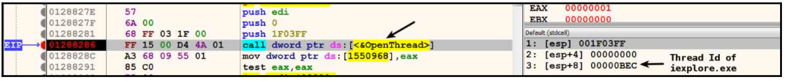

2. 然后，恶意软件进程调用QueueUserAPC()，在Internet Explorer线程的APC队列中编排指定的APC函数。在下面的截图中，QueueUserAPC()的第一个参数是指向恶意软件希望目标线程执行的APC函数的指针。在这种情况下，APC函数是LoadLibrary()，其地址先前已经确定。第二个参数，0x22c，是iexplore.exe目标线程的句柄。第3个参数，0x2270000，是目标进程（iexplore.exe）内存中的地址，包含恶意DLL的完整路径；当线程执行时，这个参数将自动作为参数传递给APC函数（LoadLibrary()）。

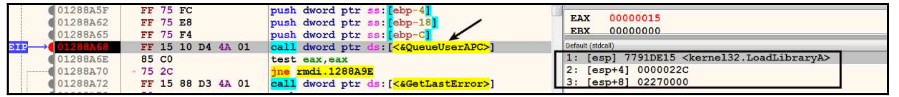

下面的截图显示了Internet Explorer进程内存中的地址0x2270000的内容（这是作为第3个参数传递给QueueUserAPC()的；这个地址包含了之前被恶意软件写入的DLL的完整路径。

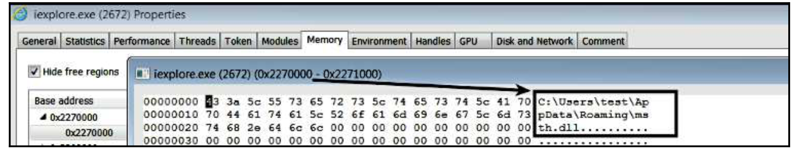

此时，注入已经完成，当目标进程的线程进入可预警状态时，该线程从APC队列中执行LoadLibrary()，DLL的完整路径被作为参数传递给LoadLibrary()。结果，恶意的DLL被加载到目标进程的地址空间，而目标进程又调用了包含恶意代码的DLLMain()函数。

#### 3.3 使用SetWindowsHookEx()进行DLL注入

在上一章中（参考第1.3.2节，使用SetWindowsHookEx的键盘记录器），我们研究了恶意软件如何使用SetWindowsHookEx() API来安装一个钩子程序来监控键盘事件。SetWindowsHookEx()API也可用于将DLL加载到目标进程地址空间并执行恶意代码。要做到这一点，恶意软件首先将恶意DLL加载到自己的地址空间。然后，它为一个特定的事件（如键盘或鼠标事件）安装一个钩子程序（由恶意DLL导出的函数），并将该事件与目标进程的线程（或当前桌面中的所有线程）联系起来。这个思路是，当一个特定的事件被触发时，为其安装的钩子，目标进程的线程将调用该钩子程序。为了调用DLL中定义的钩子程序，它必须将DLL（包含钩子程序）加载到目标进程的地址空间。

换句话说，攻击者创建了一个包含导出函数的DLL。包含恶意代码的导出函数被设置为特定事件的钩子程序。该钩子程序与目标进程的一个线程相关联，当事件被触发时，攻击者的DLL被加载到目标进程的地址空间，钩子程序被目标进程的线程调用，从而执行恶意代码。恶意软件可以为任何类型的事件设置钩子，只要该事件有可能发生。这里的重点是，DLL被加载到目标进程的地址空间，并执行恶意的行为。

下面描述了恶意软件样本（Trojan Padador）执行的步骤，将其DLL加载到远程进程的地址空间，并执行恶意代码。

1. 恶意软件的可执行程序在磁盘上投放了一个名为tckdll.dll的DLL。该DLL包含一个导入函数，和一个名为TRAINER的导出函数，如下所示。DLL的导入函数并没有做什么，而TRAINER函数包含恶意代码。这意味着，DLL只被加载时（其导入函数被调用），不会执行恶意代码；只有当TRAINER函数被调用时，才会执行恶意行为。

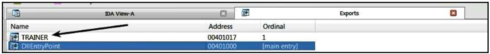

2. 恶意软件使用LoadLibrary()API将DLL（tckdll.dll）加载到自己的地址空间。使用LoadLibrary()API将DLL（tckdll.dll）加载到自己的地址空间，但在这一点上没有恶意代码被执行。LoadLibrary()的返回值是加载模块（tckdll.dll）的句柄。模块（tckdll.dll）的句柄。然后它通过使用GetProcAddress()确定TRAINER函数的地址。

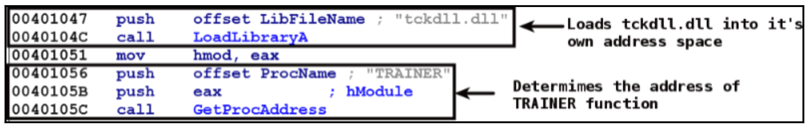

3. 恶意软件使用tckdll.dll的句柄和TRAINER函数的地址为键盘事件注册一个钩子程序。TRAINER函数的地址来为键盘事件注册一个钩子过程。在下面的截图中，第1个参数WH_KEYBOARD（常量值2）指定了将调用钩子程序的事件类型。第2个参数是钩子程序的地址，也就是上一步确定的TRAINER函数的地址。第3个参数是指向tckdll.dll的句柄，它包含钩子程序。第四个参数，0，指定钩子程序必须与当前桌面上的所有线程相关联。恶意软件可以不把钩子程序与所有的桌面线程联系起来，而是通过提供线程ID来锁定一个特定的线程。

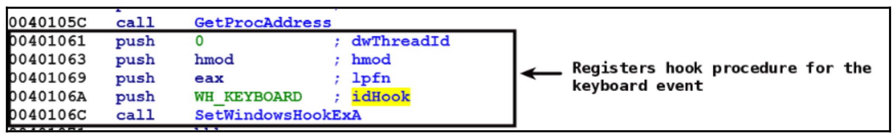

在执行了前面的步骤后，当键盘事件在一个应用程序中被触发时，该应用程序将加载恶意的DLL并调用TRAINER函数。例如，当你启动记事本并输入一些字符（触发了键盘事件）时，tckdll.dll将被加载到记事本的地址空间，TRAINER函数将被调用，迫使notepad.exe进程执行恶意代码。

#### 3.4 使用应用程序兼容性的DLL注入

微软Windows应用程序兼容性基础设施/框架（应用垫片shim）是一项功能，允许为旧版本的操作系统（如Windows XP）创建的程序在现代版本的操作系统（如Windows 7或Windows 10）上运行。如Windows XP创建的程序能够在现代版本的操作系统（如Windows 7或Windows 10）上运行。这是通过应用程序兼容性修复（垫片shim）实现的。

垫片是由微软提供给开发者的，这样他们就可以在不重写代码的情况下对其程序进行修复。当垫片被应用于一个程序，并且当垫片后的程序被执行时，垫片引擎将垫片后的程序所做的API调用重定向到垫片代码；这是通过将IAT中的指针替换为垫片代码的地址来实现的。关于应用程序如何使用IAT的细节已在第2.1节Windows API调用流程中涉及。换句话说，它钩住了Windows API，将调用重定向到shim代码，而不是在DLL中直接调用API。作为API重定向的结果，shim代码可以修改传递给API的参数，重定向API，或者修改Windows操作系统的响应。下图应该可以帮助你理解Windows操作系统中正常应用程序和shimed应用程序之间的交互差异。

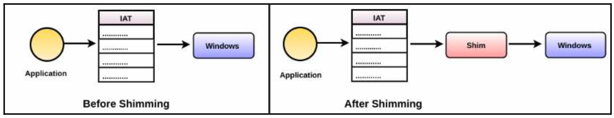

为了帮助你理解垫片的功能，让我们看一个例子。假设几年前（在Windows 7发布之前），你写了一个应用程序（xyz.exe），在执行一些有用的操作之前检查操作系统版本。假设你的应用程序通过调用kernel32.dll中的GetVersion()API来确定操作系统的版本的API来确定操作系统的版本。简而言之，只有当操作系统的版本是Windows XP时，该应用程序才会做一些有用的事情。现在，如果你把那个应用程序（xyz.exe）放在Windows 7上运行，它将不会做任何有用的事情，因为Windows 7上通过GetVersion()返回的操作系统版本因为GetVersion()返回的操作系统版本与Windows XP不一致。要使该程序在Windows 7上运行，你可以修复代码并重建程序，或者你可以在该程序（xyz.exe）上应用一个名为WinXPVersionLie的垫片。

在应用垫片后，当垫片应用程序（xyz.exe）在Windows 7上执行时，当它试图通过调用GetVersion()来确定操作系统版本时，垫片引擎拦截并返回一个不同的Windows版本（Windows XP而不是而不是Windows 7）。更具体的说，当被垫片的应用程序被执行时，垫片引擎修改了IAT并将GetVersion()API调用重定向到店牌呢代码（而不是kernel32.dll）。换句话说，WinXPVersionLie 垫片是在欺骗应用程序，使其相信自己是在Windows XP上运行，而没有修改应用程序中的代码。

> 关于垫片引擎工作的详细信息，请参阅Alex Ionescu的博文《应用程序兼容性数据库的秘密》 (SDB)，http://www.alex-ionescu.com/?p=39。  

微软提供了数以百计的垫片（如WinXPVersionLie），可以应用于一个应用程序以改变其行为。其中一些垫片被攻击者滥用，以实现持久性，注入代码，并以较高的权限执行恶意代码。


##### 3.4.1 创建一个shim垫片

有许多垫片可以被攻击者滥用于恶意的目的。在本节中，我将引导你完成创建一个用于将DLL注入目标进程的垫片的过程；这将帮助你了解攻击者创建一个垫片并滥用这一功能是多么容易。在这个案例中，我们将为 notepad.exe 创建一个 shim（主要是 shimeng.dll 和 apphelp.dll — 这是应用程序兼容性接口），并使其加载一个我们选择的 DLL。为一个应用程序创建一个垫片可以分为四个步骤。

```
选择要进行垫片的应用程序。
为该应用程序创建垫片数据库。
保存数据库（.sdb文件）。
安装数据库。
```

要创建和安装一个垫片，你需要有管理员权限。你可以通过使用微软提供的一个工具来执行前面所有的步骤，这个工具叫做Application Compatibility Toolkit（ACT）。对于Windows 7，它可以从https://www.microsoft.com/en-us/download/details.aspx?id=7352(已经不再支持下载了) 下载，对于Windows 10，它与Windows ADK捆绑在一起；根据版本不同，它可以从https://developer.microsoft.com/en-us/windows/hardware/windows-assessment-deployment-kit（https://docs.microsoft.com/zh-cn/windows-hardware/get-started/adk-install）下载。在64位版本的Windows上，ACT将安装两个版本的兼容性管理员工具（32位和64位）。要对32位程序进行调整，你必须使用32位版本的兼容性管理员工具，要对64位程序进行调整，请使用64位版本。 要想了解关于调整引擎工作的详细信息，请参考Alex Ionescu的博文《应用程序兼容性数据库的秘密》(SDB)，网址是http://www.alex-ionescu.com/?p=39。
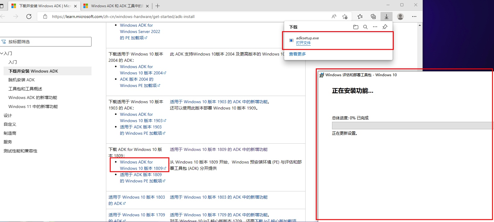
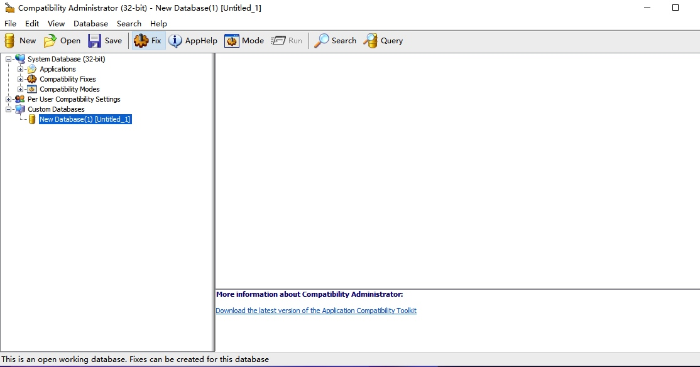

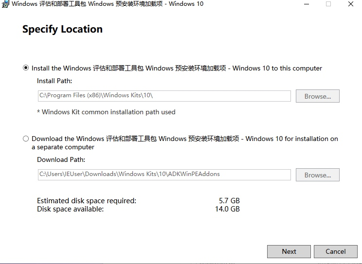
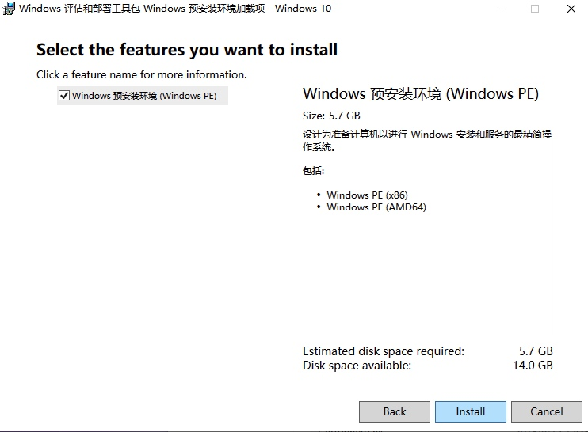


为了演示这个概念，我将使用32位版本的Windows 7，选择的目标进程是notepad.exe。我们将创建一个InjectDll垫片来使notepad.exe加载一个名为abcd.dll的DLL。要创建一个垫片，从开始菜单中启动兼容性管理员工具（32位），然后右键点击新数据库|应用程序修复。

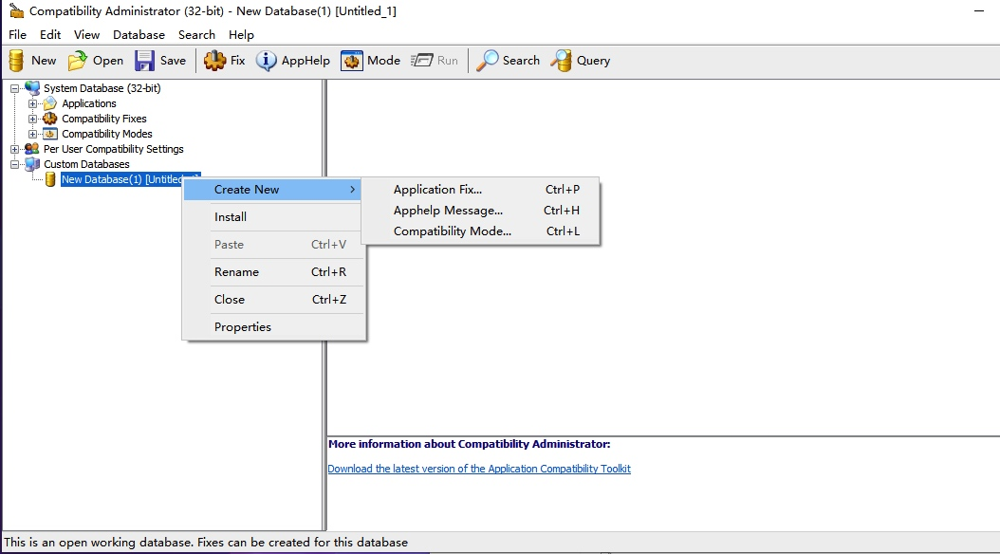


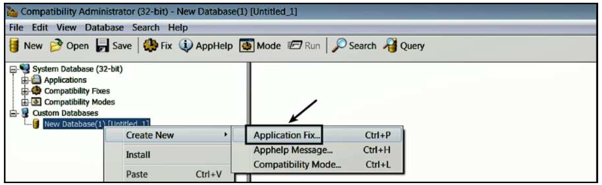

在下面的对话框中，输入你要调整的应用程序的细节。程序的名称和供应商名称可以是任何东西，但程序文件的位置应该是正确的。
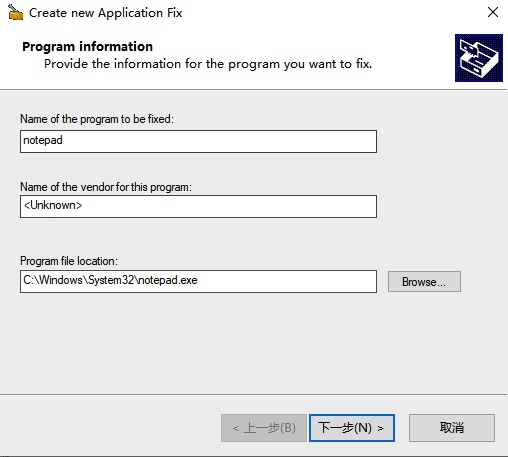


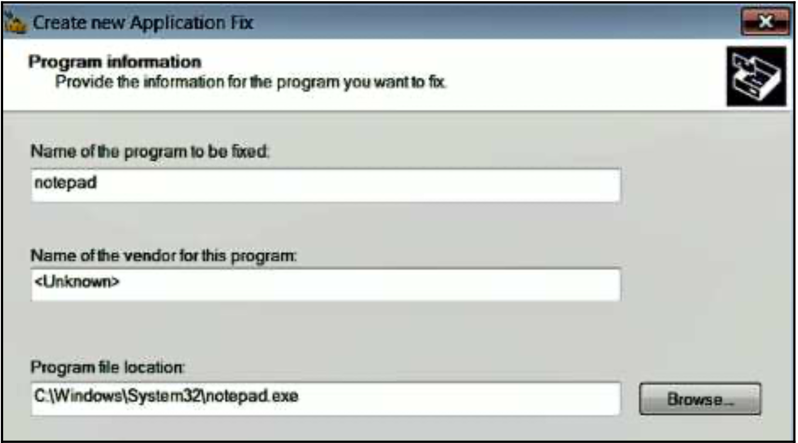

在你按下 "下一步 "按钮后，你将看到一个 "兼容模式 "对话框；你可以直接按 "下一步 "按钮。在下一个窗口中，你将会看到兼容性修复（Shims）对话框；在这里你可以选择各种Shims。在这种情况下，我们对InjectDll 垫片感兴趣。选择InjectDll垫片复选框，然后点击参数按钮，输入DLL的路径（这是我们希望记事本加载的DLL），如下所示。点击 "确定 "并按下 "下一步 "按钮。需要注意的一点是，InjectDll垫片选项只在32位兼容管理员工具中可用，这意味着你只能将这个shim应用到32位进程中。

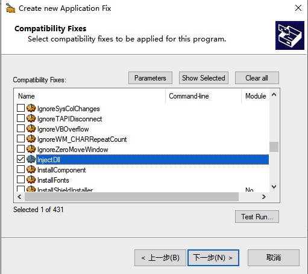
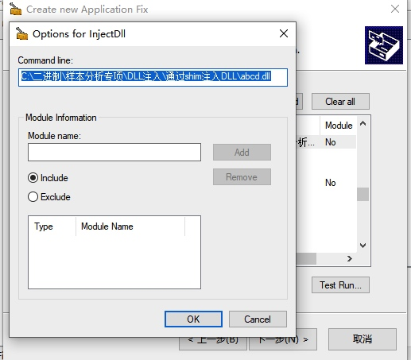


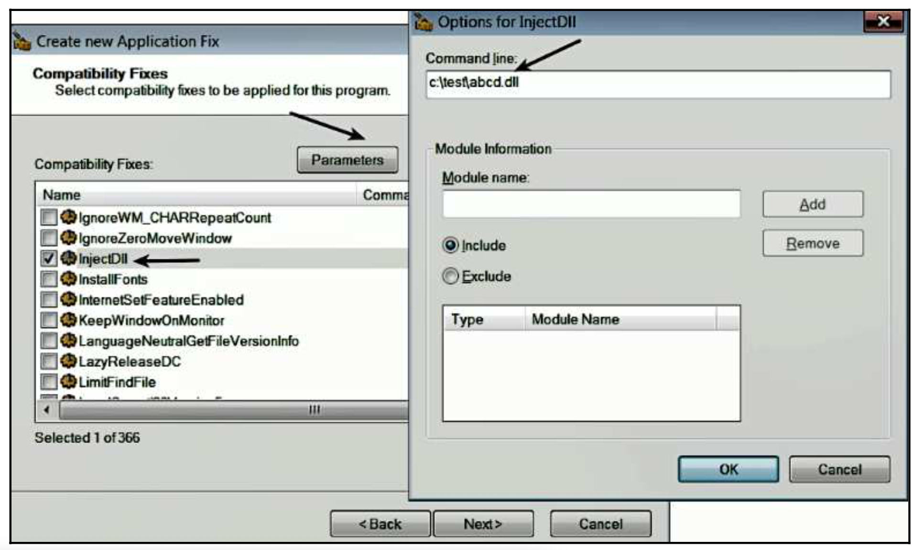

接下来，你将看到一个屏幕，指定哪些属性将被程序（notepad）匹配。当notepad.exe运行时，所选的属性将被匹配，在匹配条件得到满足后，将应用垫片。为了使匹配条件不那么严格，我取消了所有的选项，在这里显示。


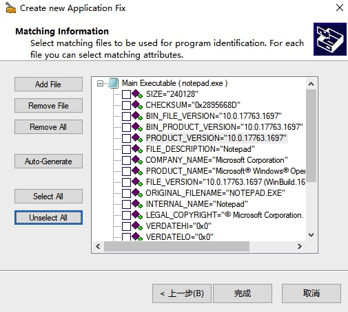


在你点击 "完成 "后，一个完整的应用程序和应用的修复的摘要将呈现在你面前，如下所示。在这一点上，包含notepad.exe的shim信息的shim数据库被创建。

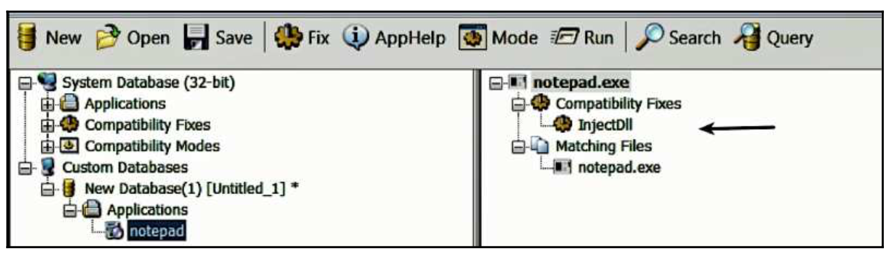

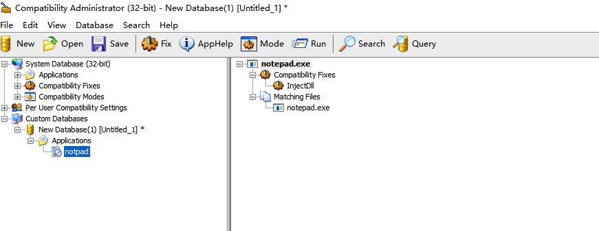


下一步是保存数据库；要做到这一点，点击 "保存 "按钮，在出现提示时，给你的数据库起个名字并保存文件。在这种情况下，数据库文件被保存为notepad.sdb（你可以自由选择任何文件名）。

数据库文件被保存后，下一步是安装数据库。你可以通过右击保存的垫片，点击安装按钮进行安装，如图所示。 
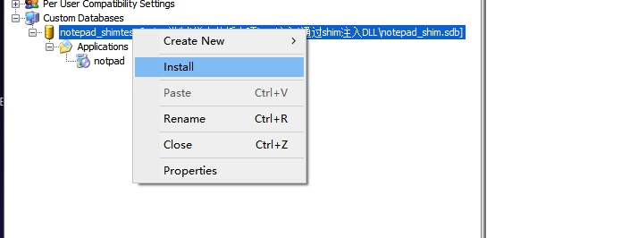
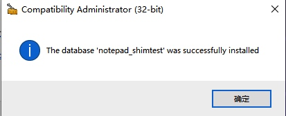

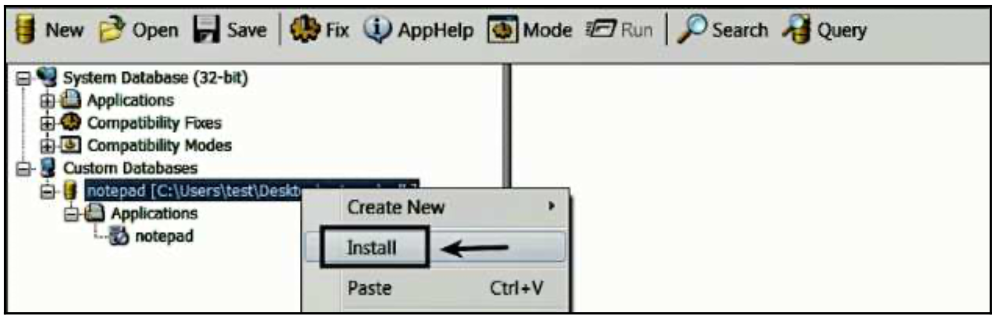

另一种安装数据库的方法是使用一个内置的命令行工具，sdbinst.exe；可以通过使用以下命令安装数据库。

```
sdbinst.exe notepad.sdb
```
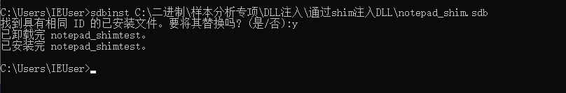


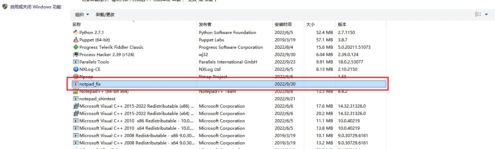
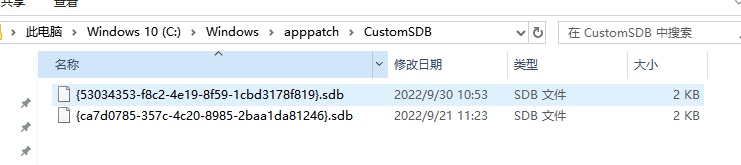

现在，如果你调用notepad.exe，abcd.dll将从c:\test目录加载到notepad的进程地址空间，如图所示。

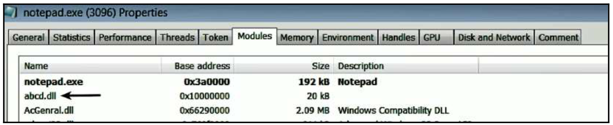

##### 3.4.2 shim工件

在这一点上，你已经了解了如何使用shim将DLL加载到目标进程的地址空间。在我们研究攻击者如何使用 shim 之前，必须了解当你安装 shim 数据库（通过右键点击数据库并选择安装或使用sdbinst.exe工具）。当你安装数据库时，安装程序为数据库创建一个GUID，并将.sdb文件复制到%SystemRoot%\AppPatch\Custom\<GUID>.sdb（对于32位垫片）或%SystemRoot%\AppPatch\Custom\Custom64\<GUID>.sdb（用于64位垫片）。它还在以下注册表键中创建两个注册表项。

```
HKLM\SOFTWARE\Microsoft\Windows NT\CurrentVersion\AppCompatFlags\Custom\
HKLM\SOFTWARE\Microsoft\Windows
NT\CurrentVersion\AppCompatFlags\InstalledSDB\
```

下面的截图显示了创建的注册表项HKLM\SOFTWARE\Microsoft\WindowsNT\CurrentVersion\AppCompatFlags\Custom\这个注册表项包含应用垫片的程序名称，以及相关的垫片数据库文件（<GUID>.sdb）。

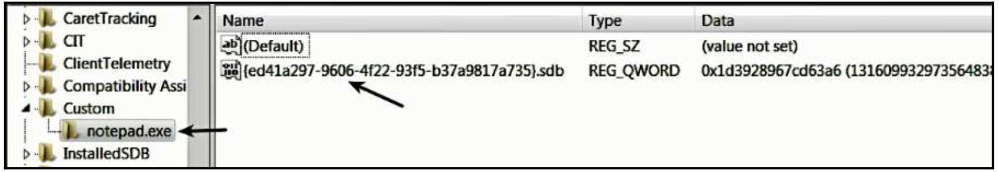

第二个注册表，HKLM\SOFTWARE\Microsoft\WindowsNT\CurrentVersion\AppCompatFlags\InstalledSDB\，包含数据库信息和shim数据库文件的安装路径。

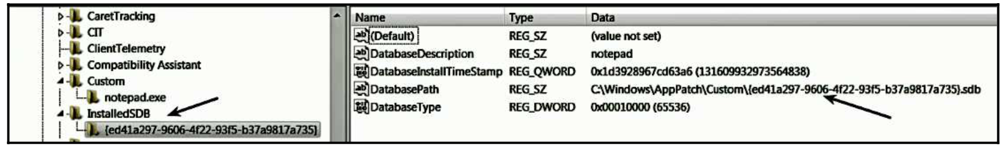

创建这些组件的目的是为了在执行应用程序时，加载器通过查询这些注册表项来确定应用程序是否需要垫片，并调用垫片引擎，该引擎将使用位于AppPatch/目录中的.sdb文件的配置来垫片应用程序。由于安装shim数据库而产生的另一个组件是，在控制面板的已安装程序列表中添加了一个条目。

##### 3.4.3 攻击者如何使用垫片
下面的步骤描述了攻击者可能以何种方式将一个应用程序进行垫片并安装在受害者系统上。

* 攻击者为目标应用程序（如notepad.exe，或受害者经常使用的任何合法第三方应用程序）创建一个应用程序兼容性数据库（shim数据库）。攻击者可以选择一个垫片，如InjectDll，或多个垫片。
* 攻击者保存为目标应用程序创建的shim数据库（.sdb文件）。
* .sdb文件被传递并丢在受害者系统上（主要是通过恶意软件），它被安装，通常使用sdbinst工具。
* 攻击者调用目标应用程序或等待用户执行目标应用程序。
* 攻击者也可能删除安装shim数据库的恶意软件。在这种情况下，你就只剩下.sdb文件了。

> 攻击者只需将.sdb文件放到文件系统的某个位置，并修改最小的注册表项集，就可以安装一个shim数据库。这种技术避免了使用sdbinst工具。shim_persist（https://github.com/hasherezade/persistence_demos/tree/master/shim_persist）是一个POC，由安全研究员Hasherezade（https://github.com/hasherezade/persistence_demos/）编写。
> 研究员Hasherezade (@hasherezade)编写的POC，它使用一个DLL安装垫片，而不使用sdbinst工具将所丢的DLL注入explorer.exe进程。

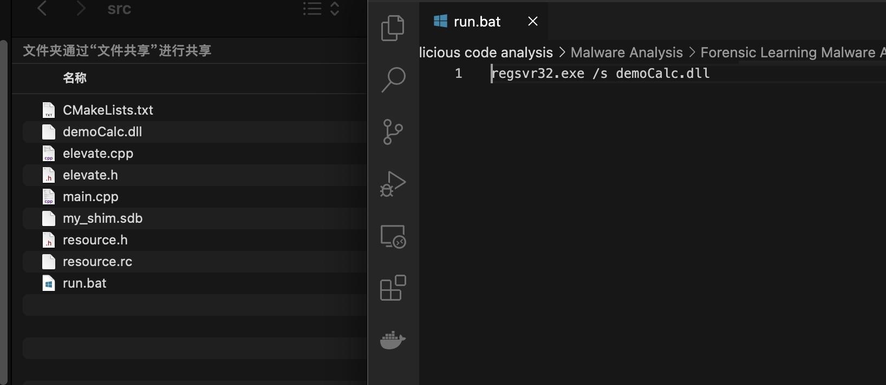

恶意软件作者出于不同的目的滥用了垫片，如实现持久性、代码注入、禁用安全功能、以高权限执行代码和绕过用户账户控制（UAC）提示。下表概述了一些有趣的垫片和它们的描述。

|Shim名称|描述|
|---|---|
|RedirectEXE|重定向执行|
|InjectDll|将DLL注入到应用程序中|
|DisableNXShowUI|禁用数据执行预防（DEP）|
|CorrectFilePaths|重定向文件系统路径|
|VirtualRegistry|注册表重定向|
|RelaunchElevated|以较高的权限启动应用程序|
|TerminateExe|在启动时终止可执行程序|
|DisableWindowsDefender|禁用应用程序的Windows Defender服务 |
|RunAsAdmin|标记一个应用程序以管理员权限运行|


> 关于在攻击中如何使用垫片的更多信息，请参阅安全研究人员在各种会议上发表的谈话，所有这些都可以在https://sdb.tools/talks.html。

##### 3.4.4 分析Shim数据库

为了对一个应用程序进行垫片，攻击者会安装垫片数据库（.sdb），该数据库驻留在受害者的文件系统的某个地方。假设你已经确定了恶意活动中使用的.sdb文件，你可以通过使用诸如sdb-explorer（https://github.com/evil-e/sdb-explorer）或python-sdb（https://github.com/williballenthin/python-sdb）的工具来调查.sdb文件。

在下面的例子中，python-sdb工具被用来调查我们先前创建的shim数据库（.sdb）文件。在shim数据库上运行python-sdb显示其元素，如图所示。


```
$ python sdb_dump_database.py notepad.sdb <DATABASE>
<TIME type='integer'>0x1d3928964805b25</TIME> <COMPILER_VERSION type='stringref'>2.1.0.3</COMPILER_VERSION> <NAME type='stringref'>notepad</NAME>
<OS_PLATFORM type='integer'>0x1</OS_PLATFORM>
<DATABASE_ID type='guid'>ed41a297-9606-4f22-93f5-
b37a9817a735</DATABASE_ID> <LIBRARY>
   </LIBRARY>
      <EXE>
<NAME type='stringref'>notepad.exe</NAME>
<APP_NAME type='stringref'>notepad</APP_NAME>
<VENDOR type='stringref'>&lt;Unknown&gt;</VENDOR>
<EXE_ID type='hex'>a65e89a9-1862-4886-b882-cb9b888b943c</EXE_ID> <MATCHING_FILE>
          <NAME type='stringref'>*</NAME>
        </MATCHING_FILE>
        <SHIM_REF>
<NAME type='stringref'>InjectDll</NAME>
<COMMAND_LINE type='stringref'>c:\test\abcd.dll</COMMAND_LINE> </SHIM_REF>
      </EXE>
   </DATABASE>
```


> 在其中一次攻击中，RedirectEXE shim被dridex恶意软件用来绕过UAC。它安装了shim数据库，并在提升权限后立即将其删除。欲了解更多细节，请参考博文：
https://blogs.jpcert.or.jp/en/2015/02/a-new-uac-bypass-method-that-dridex-uses.html

```
sdbinst.exe /q /u "C:\Users\user_name\AppData\LocalLow\$$$.sdb"
```

#### 3.5 远程可执行程序/外壳代码注入

在这种技术中，恶意代码被直接注入到目标进程的内存中，而不在磁盘上丢弃组件。恶意代码可以是一个shellcode或一个可执行文件，其导入地址表是为目标进程配置的。注入的恶意代码通过CreateRemoteThread()创建一个远程线程来强制执行，并使该线程的起点指向注入的代码块中的代码/函数。这种方法的优点是，恶意软件进程不必在磁盘上投放恶意DLL；它可以从二进制文件的资源部分提取要注入的代码，或者通过网络获取，直接进行代码注入。

下面的步骤描述了这种技术的执行方式，以一个名为nsasr.exe（W32/Fujack）的恶意软件样本为例，它将可执行文件注入Internet Explorer（iexplorer.exe）进程。

1. 恶意软件进程（nsasr.exe）使用OpenProcess()API打开Internet Explorer进程（iexplore.exe）的一个句柄。

2. 它在目标进程（iexplore.exe）中分配内存的一个特定地址，0x13150000。地址，0x13150000，使用带有PAGE_EXECUTE_READWRITE保护的VirutualAllocEx()，而不是PAGE_READWRITE（与在第3.1节涉及的远程DLL注入技术相比）。PAGE_EXECUTE_READWRITE保护允许恶意软件进程（nsasr.exe）将代码写入目标进程，在写入代码后，这种保护允许目标进程（iexplore.exe）从该内存读取和执行代码。

3. 然后，它使用WriteProcessMemory()将恶意的可执行内容写入上一步分配的内存中。在下面的截图中，第一个参数，0xD4，是iexplore.exe的句柄。第二个参数，0x13150000，是目标进程（iexplore.exe）中的地址。内存中的地址，内容将被写入其中。第3个参数，0x13150000，是恶意软件（nsasr.exe）进程内存中的缓冲区；这个缓冲区包含可执行内容，它将被写入目标进程内存。

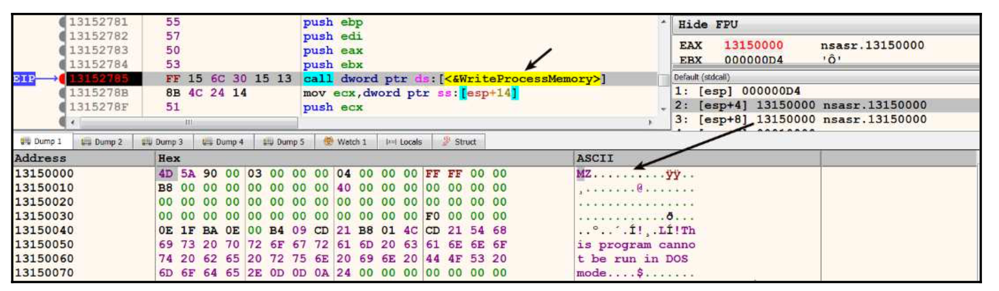

4. 恶意可执行内容被写入（地址为0x13150000）iexplore.exe进程内存后，它调用CreateRemoteThread()API来创建一个远程线程，并使线程的起始地址指向注入的可执行文件的入口地址。在下面的截图中，第4个参数，0x13152500，指定了目标进程（iexplore.exe）内存中线程开始执行的地址；这是注入的可执行文件的入口地址。在这一点上，注入已经完成，iexplore.exe进程中的线程开始执行恶意代码。

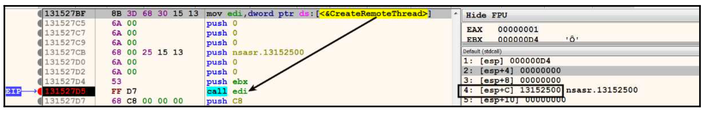

> 反射性DLL注入是一种类似于远程可执行文件/ShellCode注入的技术。在这种方法中，包含反射式加载器组件的DLL被直接注入，而目标进程则要调用反射式加载器组件，该组件负责解决导入问题，将其重新定位到一个合适的内存位置，并调用DllMain()函数。这种技术的优点是，它不依赖于LoadLibrary()函数来加载DLL。由于LoadLibrary()只能从磁盘上加载库，注入的DLL不需要驻留在磁盘上。关于这项技术的更多信息，请参考Stephen Fewer的Reflective DLL Injection，网址是：https://github.com/stephenfewer/ReflectiveDLLInjection。


#### 3.6 hollow空洞化进程注入（进程空洞化）

进程空洞化，或空洞进程注入，是一种代码注入技术，其中合法进程在内存中的可执行部分，被替换为恶意的可执行文件。这种技术允许攻击者将其恶意软件伪装成合法进程并执行恶意代码。这种技术的好处是，被掏空的进程的路径仍然会指向合法的路径，而且，通过在合法进程的上下文中执行，恶意软件可以绕过防火墙和主机入侵防御系统。例如，如果svchost.exe进程被掏空，其路径仍将指向合法的可执行路径（C:\Windows\system32\svchost.exe），但是，只有在内存中，svchost.exe的可执行部分被替换为恶意代码；这使得攻击者可以不被现场取证工具检测到。

下面的步骤描述了恶意软件样本（Skeeyah）执行的空心程序注入。在下面的描述中，恶意软件进程在执行这些步骤之前，从其资源部分提取要注入的恶意可执行文件。

1. 恶意软件进程在暂停模式下启动一个合法进程。因此，合法进程的可执行部分被加载到内存中，内存中的进程环境块（PEB）结构确定了合法进程的完整路径。PEB的ImageBaseAddress(Peb.ImageBaseAddress)字段包含合法进程可执行文件被加载的地址。在下面的截图中，恶意软件以暂停模式启动合法的svchost.exe进程，在这种情况下，svchost.exe被加载到地址0x01000000。


2. 恶意软件确定了PEB结构的地址，这样它就可以读取PEB.ImageBaseAddress字段来确定进程可执行文件（svchost.exe）的基本地址。为了确定PEB结构的地址，它调用GetThreadContext()。GetThreadContext()检索指定线程的上下文，它需要两个参数：第1个参数是线程的句柄，第2个参数是一个指向结构的指针，名为CONTEXT。在这种情况下，恶意软件将悬浮线程的句柄作为GetThreadContext()的第1个参数，并将指向CONTEXT结构的指针作为第2个参数。在这个API调用后，CONTEXT结构被填充了暂停线程的上下文。该结构包含暂停线程的寄存器状态。然后，恶意软件读取CONTEXT._Ebx字段，它包含指向PEB数据结构的指针。一旦确定了PEB的地址，它就会读取PEB.ImageBaseAddress，以确定进程可执行文件的基础地址（换句话说，0x01000000）。

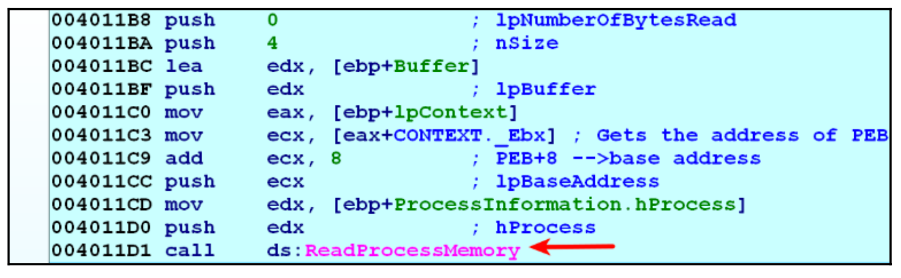


另一种确定指向PEB的指针的方法是使用NtQueryInformationProcess()函数；详情可在https://msdn.microsoft.com/en-us/library/windows/desktop/ms684280(v=vs.85).aspx（https://learn.microsoft.com/zh-cn/windows/win32/api/winternl/nf-winternl-ntqueryinformationprocess?redirectedfrom=MSDN）。
3. 一旦确定了目标进程可执行文件在内存中的地址，它就会使用NtUnMapViewofSection()API来取消合法进程（svchost.exe）的可执行部分的分配。在下面的截图中，第一个参数是svchost.exe进程的句柄（0x34），第二个参数是要取消分配的进程可执行文件的基本地址（0x01000000）。

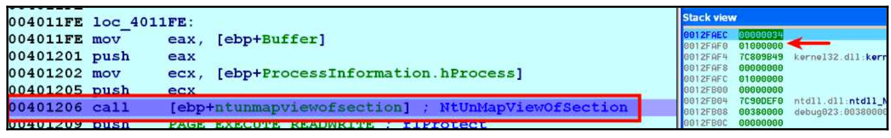

4. 进程可执行部分被掏空后，它在合法进程（svchost.exe）中分配了一个新的内存段，具有读、写和执行权限。新的内存段可以分配在同一地址（空洞化之前进程可执行部分所在的位置）或不同的区域。在下面的截图中，恶意软件使用VirutalAllocEX()来分配不同区域的内存（在这种情况下，在0x00400000）。


5. 然后，它使用WriteProcessMemory()将恶意的可执行文件及其部分复制到新分配的内存地址0x00400000。


6. 然后，恶意软件用新分配的地址覆盖了合法进程的PEB.ImageBaseAdress。下面的截图显示了恶意软件用新的地址（0x00400000）覆盖了svchost.exe的PEB.ImageBaseAdress；这改变了svchost.exe在PEB中的基础地址，从0x1000000到0x00400000（这个地址现在包含注入的可执行文件）。


7. 然后，恶意软件改变了暂停线程的起始地址，使其指向注入的可执行文件的入口点地址。这是通过设置CONTEXT._Eax值并调用SetThreadContext()。在这一点上，暂停进程的线程指向被注入的代码。然后，它使用ResumeThread()恢复被暂停的线程。在这之后，恢复的线程开始执行注入的代码。

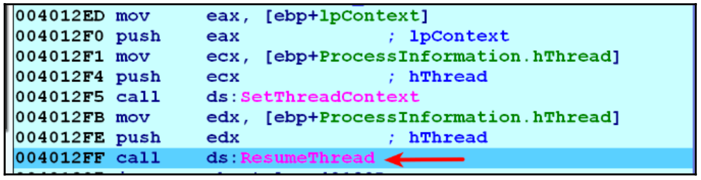

> 恶意软件进程可能只是使用NtMapViewSection()来避免使用VirtualAllocEX()和WriteProcessMemory()将恶意可执行文件内容写入目标进程；这使得恶意软件可以将一段内存（包含恶意可执行文件）从自己的地址空间映射到目标进程的地址空间。除了前面描述的技术外，攻击者已经知道使用空心进程注入技术的不同变化。要了解这一点，请观看作者在黑帽会议上的演讲：https://www.youtube.com/watch?v=9L9I1T5QDg4或阅读相关博文：https://cysinfo.com/detecting-deceptive-hollowing-techniques/。

### 4.钩子技术

到目前为止，我们已经看了不同的代码注入技术来执行恶意代码。攻击者将代码（主要是DLL，但也可以是可执行文件或shellcode）注入合法（目标）进程的另一个原因是为了勾住目标进程的API调用。一旦代码被注入到目标进程中，它就可以完全访问进程内存，并可以修改其组件。改变进程内存组件的能力允许攻击者替换IAT中的条目或修改API函数本身，这种技术被称为钩子。通过钩子API（hook api），攻击者可以控制程序的执行路径，并将其重新引导到他选择的恶意代码中。然后，该恶意函数可以：
* 阻止合法应用程序（如安全产品）对API的调用。
* 监控和拦截传递给API的输入参数。
* 过滤从API返回的输出参数。

在本节中，我们将研究不同类型的钩子（hook）技术。

#### 4.1 IAT钩子（IAT Hook）

如前所述，IAT包含一个应用程序从DLLs导入的函数地址。在这种技术中，当一个DLL被注入到目标（合法）进程中后，被注入的DLL中的代码（Dllmain()函数）会钩住IAT中目标进程的入口。下面给出了用于执行这种钩子的步骤的高级概述：
* 通过解析内存中的可执行镜像，找到IAT的位置。
* 确定要钩住的函数的入口。
* 用恶意函数的地址替换该函数的地址。 

为了帮助你理解，让我们看看一个合法程序通过调用DeleteFileA()API来删除一个文件的例子。DeleteFileA()对象接受一个参数，即要删除的文件的名称。下面的截图显示了合法程序（在上钩之前），正常通过IAT确定DeleteFileA()的地址，然后在kernel32.dll中调用DeleteFileA()。

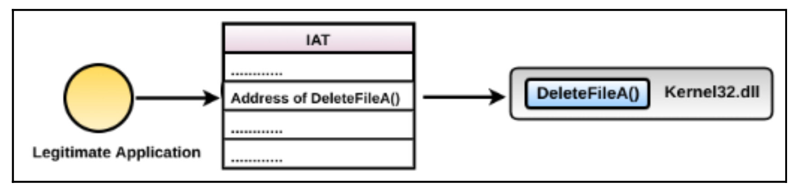

当程序的IAT被钩住时，IAT中DeleteFileA()的地址被替换为恶意函数的地址，如下所示。现在，当合法程序调用DeleteFileA()时，该调用被重定向到恶意软件模块中的恶意函数。恶意函数然后调用原来的DeleteFileA()函数，以使它看起来一切正常。坐在中间的恶意函数可以阻止合法程序删除文件，或者监视参数（正在被删除的文件），然后采取一些其他动作。

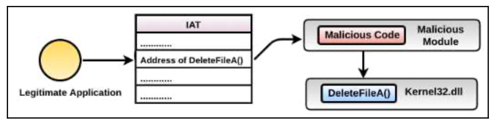

除了通常在调用原始函数之前发生的阻断和监控之外，恶意函数还可以过滤输出参数，这发生在重新调用之后。这样，恶意软件可以钩住显示进程、文件、驱动、网络端口等列表的API，并过滤输出，以躲避使用这些API函数的工具。

对于使用这种技术的攻击者来说，其缺点是，如果程序使用运行时链接（动态链接），或者攻击者希望钩子的功能已经作为表的内容导入，此时它就不起作用。攻击者的另一个缺点是，IAT钩子很容易被发现。在正常情况下，IAT中的条目应该位于其相应模块的地址范围内。例如，DeleteFile()的地址应该在kernel32.dll的地址范围内。为了检测这种挂钩技术，安全产品可以识别IAT中不在其模块地址范围内的条目。在64位Windows上，一项名为PatchGuard的技术可以阻止对包括IAT在内的调用表进行修补。由于这些问题，恶意软件作者使用了一种略微不同的钩子技术，接下来将讨论这个问题。


#### 4.2 内联钩子inline hooking(内联修补)

IAT钩子依赖于交换函数指针，而在内联钩子中，API函数本身被修改（打补丁）以将API重定向到恶意代码。与IAT钩子技术一样，这种技术允许攻击者拦截、监测和阻止特定应用程序的调用，并过滤输出参数。在内联钩子中，目标API函数的前几个字节（指令）通常被一个跳转语句所覆盖，该语句将程序控制重新引导到恶意代码。然后，恶意代码可以拦截输入参数，过滤输出，并将控制权重定向到原始函数。

为了帮助你理解，让我们假设一个攻击者想钩住一个合法应用程序所做的DeleteFileA()函数调用。通常情况下，当合法应用程序的线程遇到对DeleteFileA()的调用时，该线程会从DeleteFileA()函数的起点开始执行，如下面所示。

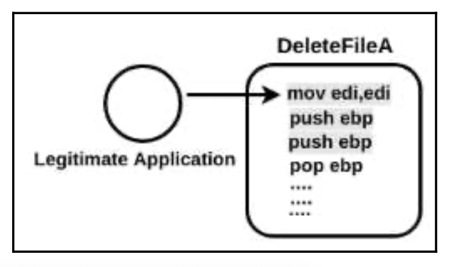

为了用跳转取代函数的前几条指令，恶意软件需要选择哪些指令来取代。jmp指令至少需要5个字节，所以恶意软件需要选择占用5个字节以上的指令。在上图中，替换前三条指令（使用不同颜色突出显示）是安全的，因为它们正好占用5个字节，而且，这些指令除了设置堆栈框架外，没有什么作用。在DeleteFileA()中要替换的三条指令被复制，然后用某种跳转语句替换，将控制权转移到恶意函数中。恶意函数做它想做的事，然后执行DeleteFileA()的原始三条指令，并跳回位于补丁下面的地址（在跳转指令下面），如下图所示。被替换的指令，连同返回目标函数的跳转语句，被称为蹦床。

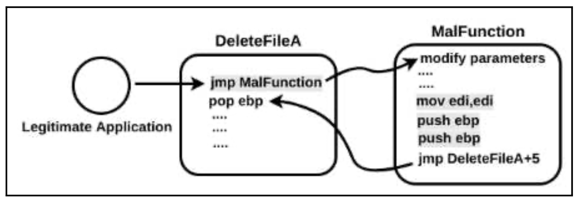

这种技术可以通过寻找API函数开始时的意外跳转指令来检测，但要注意的是，恶意软件可以通过在API函数中插入更深的跳转，而不是在函数开始时插入，从而使检测变得困难。而不是使用恶意软件可能会使用call指令，或push和ret指令的组合来重定向控制；这种技术可以绕过安全工具，因为安全工具只寻找jmp指令。
有了对内联钩子的了解，让我们来看看恶意软件（Zeus Bot）使用这种技术的例子。宙斯机器人钩住了各种API函数；其中之一是Internet Explorer（iexplore.exe）的HttpSendRequestA()。通过钩住这个函数，恶意软件可以从POST有效载荷中提取凭证。在挂钩之前，恶意的可执行文件（包含各种功能）被注入到Internet Explorer的地址空间。下面的截图显示了地址0x33D0000，可执行文件被注入其中。

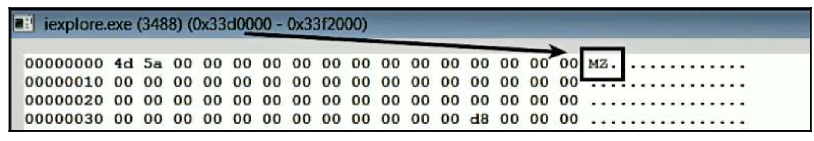

在注入可执行文件后，HttpSendRequestA()被钩住，将程序控制重定向到注入的可执行文件中的一个恶意函数。在我们看这个被钩住的函数之前，让我们看一下合法的HttpSendRequestA()函数的前几个字节（如图所示）。

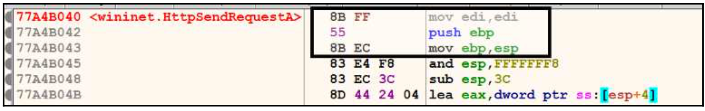

前三个指令（占用5个字节，在前面的截图中突出显示）被替换为重定向控制。下面的截图显示了挂钩后的HttpSendRequestA()。前三条指令被替换为jmp指令（占用5个字节）；注意跳转指令是如何将控制权重定向到地址为0x33DEC48的恶意代码上的，这属于注入的可执行程序的地址范围。

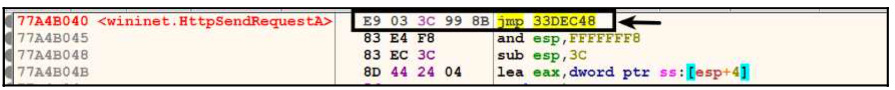


#### 4.3 使用Shim进行内存修补

在内联挂接中，我们看到了函数中的一系列字节是如何被修补以将控制权重定向到恶意代码的。使用应用程序兼容性垫片可以进行内存内修补（垫片的细节之前已经介绍过）。微软使用内存打补丁的功能来应用补丁来修复其产品中的漏洞。内存打补丁是一个没有记录的功能，在兼容性管理员工具中也没有（前面讲过），但是安全研究人员，通过逆向工程，已经弄清楚了内存打补丁的功能，并且开发了分析它们的工具。Jon Erickson的sdb-explorer（https://github.com/evil-e/sdb-explorer）和William Ballenthin的python-sdb（https://github.com/williballenthin/python-sdb）允许你通过分析
shim数据库（.sdb）文件。这些研究人员的以下演讲包含了关于内存补丁的详细信息，以及分析这些补丁的工具。

* 持续使用和滥用微软的补丁: https://www.blackhat.com/docs/asia-14/materials/Erickson/WP-Asia-14-Erickson-Persist-It-Using-And-Abusing-Microsofts-Fix-It-Patches.pdf


* 真正的Shim靠不住: http://files.brucon.org/2015/Tomczak_and_Ballenthin_Shims_for_the_Win.pdf


恶意软件作者使用内存补丁来注入代码和钩住API功能。使用内存打补丁的恶意软件样本之一是GootKit；这个恶意软件使用sdbinst工具安装各种垫片数据库（文件）。下面的截图显示了为多个应用程序安装的垫片，该截图显示了与explorer.exe相关的.sdb文件。

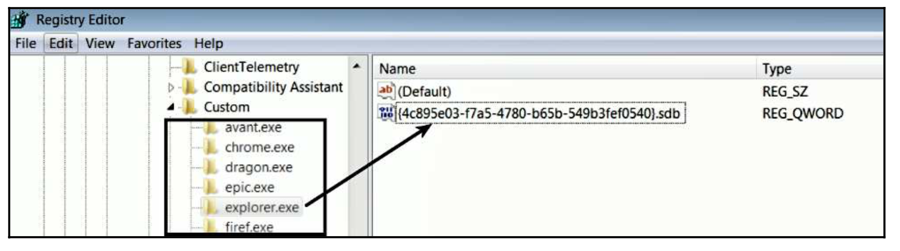

安装的.sdb文件包含将被直接修补到目标进程内存中的shellcode。你可以使用sdb_dump_database.py脚本（python-sdb工具的一部分）来检查.sdb文件，命令如下。

```
$ python sdb_dump_database.py {4c895e03-f7a5-4780-b65b-549b3fef0540}.sdb
```

前面命令的输出显示恶意软件以explorer.exe为目标，并应用名为patchdata0的垫片。垫片名称下面的PATCH_BITS是一个原始的二进制数据，包含将被打入explorer.exe内存的shellcode。

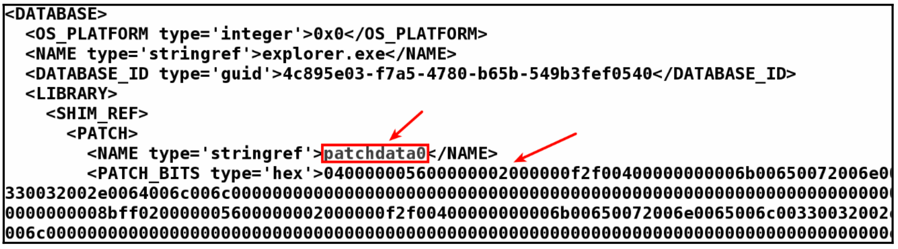

为了知道shellcode在做什么，我们需要能够解析PATCH_BITS，它是一个无文档的结构。为了解析这个结构，你可以使用sdb_dump_patch.py脚本（python-sdb的一部分），给出补丁名称，patchdata0，如图所示。

```
$ python sdb_dump_patch.py {4c895e03-f7a5-4780-b65b-549b3fef0540\}.sdb patchdata0
```

运行前面的命令显示在explorer.exe内的kernel32.dll中应用的各种补丁。下面的截图显示了第一个补丁，它在相对虚拟地址（RVA）0x0004f0f2处匹配了两个字节，8B FF（mov edi,edi），并用EB F9（jmp 0x0004f0ed）替换它们。换句话说，它将控制权重定向到RVA 0x0004f0ed。

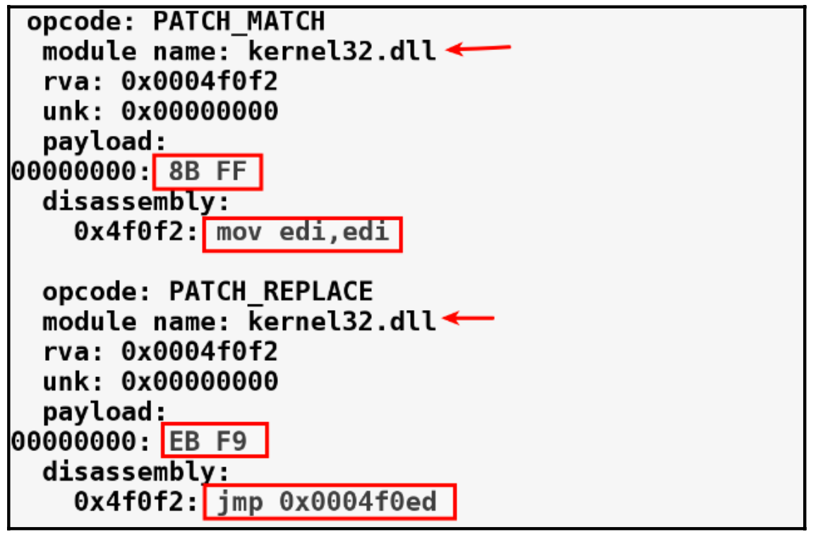

下面的输出显示了在kernel32.dll的RVA 0x0004f0ed处应用的另一个补丁，恶意软件用调用0x000c61a4替换了一系列NOP指令，从而将程序控制重定向到RVA 0x000c61a4处的功能。这样，恶意软件修补了kernel32.dll中的多个位置，并进行了各种重定向，最终将其引向实际的shellcode。

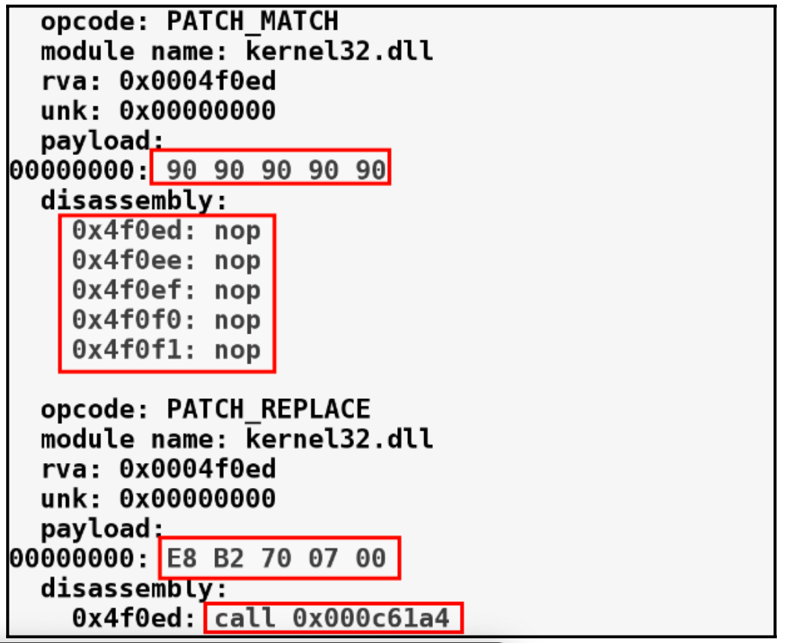

为了了解恶意软件在kernel32.dll中打了什么补丁，你可以将调试器连接到打了补丁的explorer.exe进程，并在kernel32.dll中找到这些补丁。例如，为了检查RVA 0x0004f0f2的第一个补丁，我们需要确定kernel32.dll被加载的基址。在我的例子中，它被加载在0x76730000，然后加上RVA 0x0004f0f2（换句话说，0x76730000 + 0x0004f0f2 = 0x7677f0f2）。下面的截图显示，这个
地址0x7677f0f2与API函数LoadLibraryW（）相关。

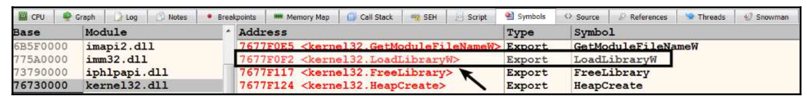

检查LoadLibraryW()函数可以看到该函数开始时的跳转指令，该指令最终将把程序控制权转给shellcode。

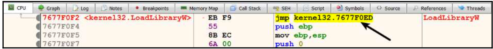

这种技术很有趣，因为在这种情况下，恶意软件没有直接分配内存或注入代码，而是依靠微软的shim功能来注入shellcode和钩住LoadLibraryW()API。它还通过跳转到kernel32.dll中的不同位置来使检测变得困难。

#### 5. 其他资源

除了本章介绍的代码注入技术外，安全研究人员还发现了其他各种注入代码的手段。以下是一些新的代码注入技术，以及进一步阅读的资源。

* *ATOMBOMBING: BRAND NEW CODE INJECTION FOR WINDOWS:* https:// blog.ensilo.com/atombombing-brand-new-code-injection-for-windows

* PROPagate:* http://www.hexacorn.com/blog/2017/10/26/propagate-a-new- code-injection-trick/

* Process Doppelg*ä*nging, by Tal Liberman and Eugene Kogan:* https://www.blackhat. com/docs/eu-17/materials/eu-17-Liberman-Lost-In-Transaction-Process- Doppelganging.pdf

* Gargoyle:* https://jlospinoso.github.io/security/assembly/c/cpp/ developing/software/2017/03/04/gargoyle-memory-analysis-evasion.html

* GHOSTHOOK:* https://www.cyberark.com/threat-research-blog/ghosthook- bypassing-patchguard-processor-trace-based-hooking/

在本章中，我们主要关注的是用户空间的代码注入技术；在内核空间也可以实现类似的功能（我们将在第11章中研究内核空间的钩子技术）。以下书籍应该能帮助你更深入地了解rootkit技术和Windows内部概念。

* The Rootkit Arsenal: Escape and Evasion in the Dark Corners of the System (2nd Edition), by Bill Blunden
* Practical Reverse Engineering: x86, x64, ARM, Windows Kernel, Reversing Tools, and Obfuscation, by Bruce Dang, Alexandre Gazet, and Elias Bachaalany
* Windows Internals (7th Edition), by Pavel Yosifovich, Alex Ionescu, Mark E. Russinovich, and David A. Solomon

### 总结

在本章中，我们研究了恶意程序用来在合法进程的上下文中注入和执行恶意代码的不同代码注入技术。这些技术允许攻击者执行恶意行为并绕过各种安全产品。除了执行恶意代码，攻击者还可以劫持合法进程调用的API函数（使用钩子），并将控制权重定向到恶意代码，以监视、阻止甚至过滤API的输出，从而改变程序的行为。在下一章中，你将学习攻击者为不被安全监控解决方案发现而使用的各种混淆技术。
