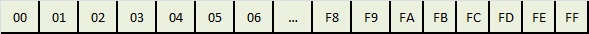
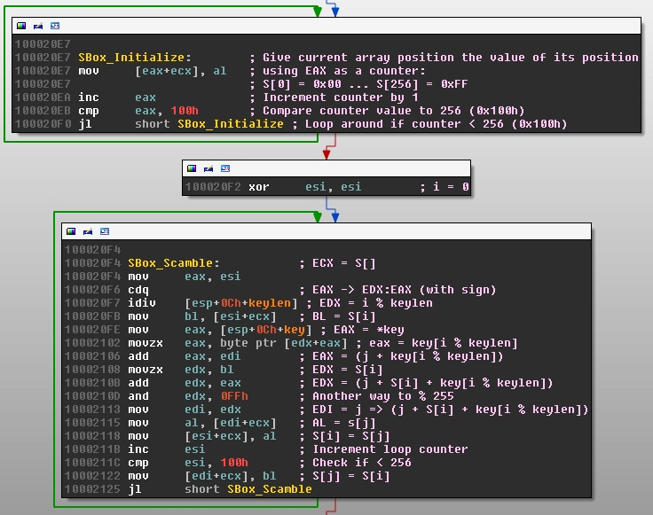
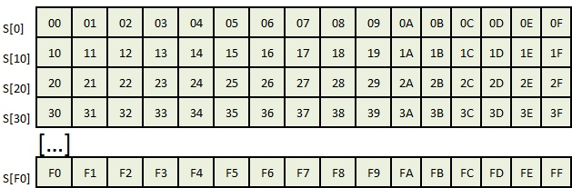
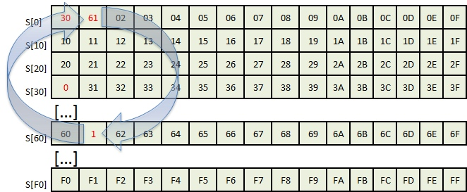
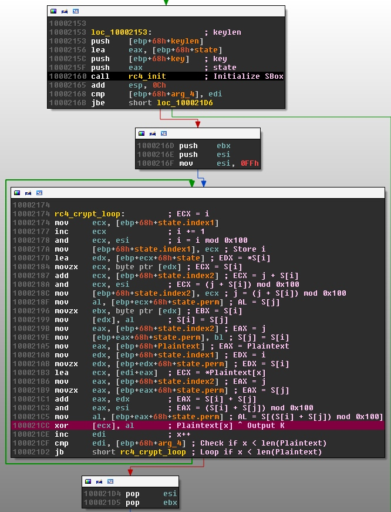
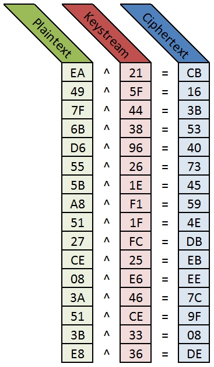
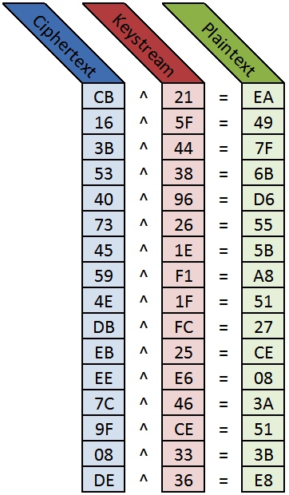

介绍恶意软件中RC4加密的识别与解码
Jonathan Munshaw


## 背景
在第九章9.2.4中RC4的利用简单不容易用加密签名的方式来检测，因此常常被攻击者用于加密。这里根据作者的推荐对Talos的这篇文章进行跟进。

## 正文翻译
当我们分析VRT: RC4中的恶意软件时，我们几乎每天都会遇到一些问题。我们最近遇到了CVE-2014-1776，和我们分析的许多恶意软件样本和漏洞一样，RC4被用来混淆或加密它真正在做的事情。实现RC4的方法有很多，它是一个非常简单的小算法。这使得它在野外和各种标准应用程序中非常常见。开源C实现可以在一些网站上找到，比如apple.com和OpenSSL.org。

RC4是什么?
RC4是由RSA安全公司的Ron Rivest在1987年设计的。RC4是一种快速、简单的流密码，使用伪随机数生成算法生成密钥流。此密钥流可用于与明文进行异或操作以生成密文。然后可以使用相同的密钥流对密文进行异或操作，以生成原始明文。
虽然RC4在恶意软件中仍然很常见，但在一些需要考虑速度和隐私的领域，RC4已经被合法地实现了。在过去，WEP和TLS都使用RC4来保护通过线路发送的数据。然而，去年秋天，微软建议客户通过启用TLS1.2和AES-GCM来禁用RC4。

要了解更多信息，包括RC4的详细历史，请查看维基百科的文章。

为什么它被用在恶意软件中?
我们越来越多地发现，RC4用于对发送到远程服务器的数据进行编码，这些数据将使用预共享密钥在另一端进行解密。这使得检测变得有点棘手(但不是不可能)，也使确定通过线路发送的确切内容变得更加困难。当我们认为我们遇到某种加密时，我们通常会做的是确定它的来源，被发送的数据是否是静态的(为了匹配目的)，以及数据到底是什么。
它是如何工作的?
*注意:对于这些例子，我将使用Coremex Search Engine Hijacker（Coremex搜索引擎劫持者）的一个变体(MD5: 70E2090D5DEE18F3E45D38BF254EFF87)，在它恢复了暂停的子进程之后。
RC4的实现分为两个主要阶段:

1. 密钥调度算法使用对称密钥来创建256字节(0x100h)的数组。
2. 然后在伪随机数生成算法中使用该数组生成可以使用相同密钥解码的密码流。

许多书籍和网络文章将用以下伪代码表示密钥调度算法(KSA):
```
for i from 0 to 255
   S[i]:= i
endfor
j :=0
for i from 0 to 255
   j :=(j + S[i]+ key[i mod keylength])mod256
   swap values of S[i]and S[j]
endfor
```
为了更好地理解算法是如何工作的，可以将其分成多个部分。

### 第一部分
创建并初始化替换框
```
for i from 0 to 255
   S[i]:= i
endfor
```
本节创建一个数组(或“SBox”/Substitution Box)，其中每个值等于它在数组中从0-255 (0x00-0xFF)的位置，这也称为其标识排列:
在恶意软件样本中寻找这种类型的加密时，这种初始表创建是一个关键指标。对于这个示例，使用x86汇编代码中的以下循环初始化RC4 KSA:



在恶意软件样本中寻找这种类型的加密时，这种初始表创建是一个关键指标。对于这个示例，使用x86汇编代码中的以下循环初始化RC4 KSA:

```
100020E5xoreax,eax    ; Initialize counter to 0
 loop:
100020E7                    ; Give each array index its identity value
100020E7 mov[eax+ecx],al; using EAX as a counter/value:
100020E7                    ; S[0] = 0x00 ... S[256] = 0xFF
100020EA inc eax         ; Increment counter by 1
100020EB cmp eax,100h   ; Compare counter value to 256 (0x100h) // NOTE THE 100h!
100020F0jlshort loop ; Loop around if counter < 256
```
注意，0x100020EB 100h处的指令对于在诸如IDA Pro这样的反汇编程序中搜索二进制文件来说是一个很好的值。寻找将寄存器与100h进行比较的指令通常可以为您指明正确的方向，特别是如果您事先知道恶意软件正在使用RC4的话。

当查看[eax+ecx]在循环完成后指向的内存转储时，你可以看到新构造的SBox看起来像上图:

```
0012FBB0  00 01 02 03 04 05 06 07  08 09 0A 0B 0C 0D 0E 0F  ................
0012FBC0  10 11 12 13 14 15 16 17  18 19 1A 1B 1C 1D 1E 1F  ................
0012FBD0  20 21 22 23 24 25 26 27  28 29 2A 2B 2C 2D 2E 2F   !"#$%&'()*+,-./
0012FBE0  30 31 32 33 34 35 36 37  38 39 3A 3B 3C 3D 3E 3F  0123456789:;<=>?
0012FBF0  40 41 42 43 44 45 46 47  48 49 4A 4B 4C 4D 4E 4F  @ABCDEFGHIJKLMNO
0012FC00  50 51 52 53 54 55 56 57  58 59 5A 5B 5C 5D 5E 5F  PQRSTUVWXYZ[\]^_
0012FC10  60 61 62 63 64 65 66 67  68 69 6A 6B 6C 6D 6E 6F  `abcdefghijklmno
0012FC20  70 71 72 73 74 75 76 77  78 79 7A 7B 7C 7D 7E 7F  pqrstuvwxyz{|}~.
0012FC30  80 81 82 83 84 85 86 87  88 89 8A 8B 8C 8D 8E 8F  Ç.éâäàåçêëèïî.Ä.
0012FC40  90 91 92 93 94 95 96 97  98 99 9A 9B 9C 9D 9E 9F  .æÆôöòûùÿÖÜ¢£.Pƒ
0012FC50  A0 A1 A2 A3 A4 A5 A6 A7  A8 A9 AA AB AC AD AE AF  áíóúñѪº¿¬¬½¼¡«»
0012FC60  B0 B1 B2 B3 B4 B5 B6 B7  B8 B9 BA BB BC BD BE BF  ¦¦¦¦¦¦¦++¦¦+++++
0012FC70  C0 C1 C2 C3 C4 C5 C6 C7  C8 C9 CA CB CC CD CE CF  +--+-+¦¦++--¦-+-
0012FC80  D0 D1 D2 D3 D4 D5 D6 D7  D8 D9 DA DB DC DD DE DF  ---++++++++¦_¦¦¯
0012FC90  E0 E1 E2 E3 E4 E5 E6 E7  E8 E9 EA EB EC ED EE EF  aßGpSsµtFTOd8fen
0012FCA0  F0 F1 F2 F3 F4 F5 F6 F7  F8 F9 FA FB FC FD FE FF  =±==()÷˜°··vn²¦
```
既然已经初始化了表，就该打乱方框了。


### 第二部分
打乱带有“0006”键的SBox (ASCII 0x30303036)

```
j :=0
for i from 0 to 255
   j :=(j + S[i]+ key[i mod keylength])mod256
   swap values of S[i]and S[j]
endfor
```
这个例程接受初始化的表，并使用键及其长度(键的长度可以从1到>255字节)对表执行各种字节交换。下面是这个示例如何实现这个例程。注意，确切的汇编指令会因编译器、平台和语言而异。

```
100020F4 loop:              ; ECX = S[0] | EDI = j
100020F4mov    eax,esi        ; Initialize EAX
100020F6cdq                       ; EAX -> EDX:EAX (with sign)
100020F7idiv   [esp+0Ch+keylen]        ; EDX = i mod keylen
100020FBmov    bl,[esi+ecx]       ; BL = S[i]
100020FEmov    eax,[esp+0Ch+key]  ; EAX = key
10002102movzxeax,byteptr[edx+eax]; EAX = key[i mod keylen]
10002106add    eax,edi                ; EAX = (j + key[i mod keylen])
10002108movzxedx,bl            ; EDX = S[i]
1000210Badd    edx,eax                ; EDX = (j + S[i] + key[i mod keylen])
1000210Dand    edx,0FFh               ; Another way to mod 255
10002113mov    edi,edx            ; j = (j + S[i] + key[i mod keylen])
10002115mov    al,[edi+ecx]       ; AL = s[j]
10002118mov    [esi+ecx],al   ; S[i] = S[j]
1000211Binc    esi                ; i++
1000211Ccmp    esi,100h           ; Check if i < 256 // NOTE THE 100h!
10002122mov    [edi+ecx],bl       ; S[j] = S[i]
10002125jl     shortloop; Loop if Less  In IDA Pro, the SBox Scramble loop following the Initialization loop may resemble these basic blocks:
```



用一支铅笔和一张纸手动计算这个例子的至少前几个字节将有助于更清楚地了解字节是如何交换来生成这个新的SBox的:

初始化SBox:

对于键“0006”的第一个字节(键[0])是“0”，记住这是ASCII“0x30>”:

```
j :=(j + S[i]+ key[i mod keylength])mod256
swap values of S[i]andS[j]
i =0// first round
j =(j+ S[i]+ key[imodkeylength])mod0x100
=(0+ S[0x00]+ key[0mod4])mod0x100
=(0+0+ key[0])mod0x100
=(0+0x30)mod0x100
=0x30mod0x100
=0x30
S[0x0]=0x30
S[0x30]=0x00
```
在字节S[0x00]和S[0x30]交换之后，结果表看起来像这样:
对于键" 0006 "的第二个字节，(键[1])也是" 0 "，或ASCII " 0x30 ":
```
i =1// second round
j =(j+ S[i]+ key[imodkeylength])mod0x100
=(0x30+S[0x01]+ key[1mod4])mod0x100
=(0x30+1+key[1])mod0x100
=(0x31+0x30)mod0x100
=0x61mod0x100
=0x61
S[0x1]=0x100
S[0x61]=0x100
```
在字节S[0x01]和S[0x61]交换之后，结果表看起来像这样:
该算法将继续执行此计算256次。注意，这些值将继续被交换出来，甚至还将交换以前交换的字节。使用“0006”键，恶意软件示例将最终在堆栈上生成以下SBox(我添加了相应的SBox数组索引，仅为了可视化目的):

```
S[00] | 0012FBB0  18 8A 98 7B|16 35 F4 A8|C0 A5 53 94|D0 0D 87 90| 

S[10] | 0012FBC0  2B 11 BA 26|08 25 C7 75|EB C6 83 D4|20 12 73 DB|

S[20] | 0012FBD0  1B 4E FF D3|EF 72 50 2E|B9 33 AF DC|6C C9 42 8C|

S[30] | 0012FBE0  BC 29 3A E8|EC 3B E7 54|44 F5 C3 3F|3C A9 32 17|

S[40] | 0012FBF0  59 60 DF 23|F0 6A B7 89|8B 43 7E C2|47 A3 37 A6|

S[50] | 0012FC00  34 A7 67 95|D8 B1 46 D9|56 28 A2 5B|7D 4C 41 7F|

S[60] | 0012FC10  5E AE 85 88|B2 9C 9B 0F|0A AB 8D 6E|ED 96 40 92|

S[70] | 0012FC20  45 1A F9 CE|B0 3E 9D 1D|68 1E E3 13|2A 51 D6 B4|

S[80] | 0012FC30  EE 58 D5 E1|D1 BB 39 4A|4F 15 07 B8|80 69 E4 FC|

S[90] | 0012FC40  5A 21 A1 1C|7C 9A 0E 5F|FD CB 02 B5|FA BD 57 86|

S[A0] | 0012FC50  E9 8E CA E5|5D 19 6F AA|4D CD 71 F2|BE 49 0B E2|

S[B0] | 0012FC60  F1 79 A0 D2|B6 DD F6 F8|2F E6 78 C1|52 CF 05 04|

S[C0] | 0012FC70  E0 6D 70 97|99 24 FE 06|4B 91 76 A4|B3 FB 63 09|

S[D0] | 0012FC80  81 64 00 82|5C C5 EA 36|AD 03 C8 0C|1F 84 48 C4|

S[E0] | 0012FC90  74 31 01 55|62 66 8F 9F|38 61 F7 BF|27 7A 22 AC|

S[F0] | 0012FCA0  9E 65 77 F3|6B 2C DE DA|30 14 3D CC|2D 93 D7 10|
```
### 第三部分
生成密钥流并编码数据
```

i :=0

j :=0

for x from 0 to len(plaintext)

i :=(i +1) mod 256

j :=(j + S[i]) mod 256

  swap values of S[i] and S[j]

K := S[(S[i]+ S[j]) mod 256]

output K ^ plaintext[x]

endfor
```
下一步是使用新创建的SBox对数据进行编码。这是通过使用SBox和此算法创建一个密钥流来实现的。然后将结果K用于与明文的每个字节进行异或操作，以生成加密数据。

这个例程接受修改后的SBox，并再次对表执行各种字节交换。然后它使用这个信息生成密钥流(K)。这个流对明文进行异或运算，直到所有明文都被编码。如果明文的长度超过了密钥流的长度，则密钥流从K[0]开始。下面是这个示例如何实现例程:

注意，这个示例使用了以下结构(其他实现可能使用u_char作为索引)来存储SBox及其两个计数器:
```
struct rc4_state

{

u_char perm[256]; // SBox

__int32 index1;// i

__int32 index2;// j

};
```
此示例对有关受害计算机的各种数据进行编码，并将使用此RC4流编码的数据发送到其命令和控制服务器。恶意软件的这部分恰好是对我的一个系统文件进行哈希编码。它编码的原始散列是:EA497F6BD6555BA85127CE083A513BE8:
```
 10002174loop:

10002174movecx,[ebp+68h+state.index1]; ECX = i

10002177incecx                    ; i += 1

10002178andecx,esi            ; i = i mod 0x100

1000217Amov[ebp+68h+state.index1],ecx; Store i

1000217Dleaedx,[ebp+ecx+68h+state]    ; EDX = *S[i]

10002184movzx     ecx,byteptr[edx]    ; ECX = S[i]

10002187addecx,[ebp+68h+state.index2]; ECX = j + S[i]

1000218Aandecx,esi                ; ECX = (j + S[i]) mod 0x100

1000218Cmov[ebp+68h+state.index2],ecx; j = (j + S[i]) mod 0x100

1000218Fmoval,[ebp+ecx+68h+state.perm]; AL = S[j]

10002196movzx      ebx,byteptr[edx]   ; EBX = S[i]

10002199mov[edx],al               ; S[i] = S[j]

1000219Bmoveax,[ebp+68h+state.index2]; EAX = j

1000219Emov[ebp+eax+68h+state.perm],bl; S[j] = S[i]

100021A5moveax,[ebp+68h+Plaintext]     ; EAX = Plaintext

100021A8movedx,[ebp+68h+state.index1]   ; EDX = i

100021ABmovzx     edx,[ebp+edx+68h+state.perm]; EDX = S[i]

100021B3leaecx,[edi+eax]; ECX = *Plaintext[x]

100021B6moveax,[ebp+68h+state.index2]; EAX = j

100021B9movzx     eax,[ebp+eax+68h+state.perm]; EAX = S[j]

100021C1addeax,edx; EAX = S[i] + S[j]

100021C3andeax,esi; EAX = (S[i] + S[j]) mod 0x100


100021C5moval,[ebp+eax+68h+state.perm]; AL = S[(S[i] + S[j]) mod 0x100]

100021CCxor[ecx],al; Plaintext[x] ^ Output K

100021CEincedi; x++

100021CFcmpedi,[ebp+68h+arg_4]; Check if x < len(Plaintext)

100021D2jbshortloop; Loop if x < len(Plain  In IDA Pro, the RC4_Crypt loop may resemble these basic blocks:
```

一旦明文的长度满足，密钥流K就完全生成。随着K的每一个值的生成，它被用来对明文的补充字节进行异或运算，在这种情况下，它看起来像这样:

要解密密文，只需将此过程反向:

用python把它们组合在一起
我在python中实现了rc4，将输入视为字符串，并在打乱之前和之后输出sbox内容。
```
*注意:由于此脚本将输入作为字符串，您必须为非ascii字符发送原始字节。在上面的例子中，这可以像这样完成:

./rc4Gen.py 0006 ' perl -e 'print "\xEA\x49\x7F\x6B\xD6\x55\x5B\xA8\x51\x27\xCE\x08\x3A\x51\x3B\xE8"' '
```
I've linked the Python code here: [rc4Gen.py](http://labs.snort.org/blogfiles/rc4Gen.py)

## 参考文章
[介绍恶意软件中RC4加密的识别与解码 Talos](http://blog.talosintelligence.com/2014/06/an-introduction-to-recognizing-and.html)
