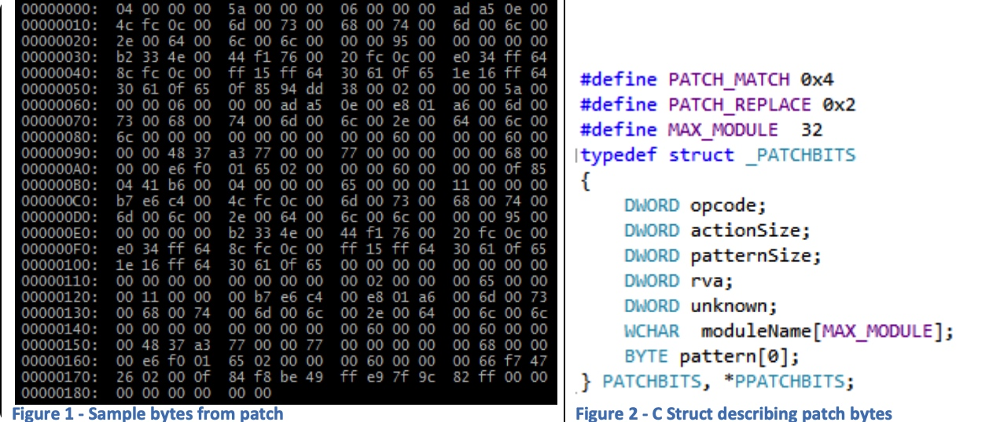
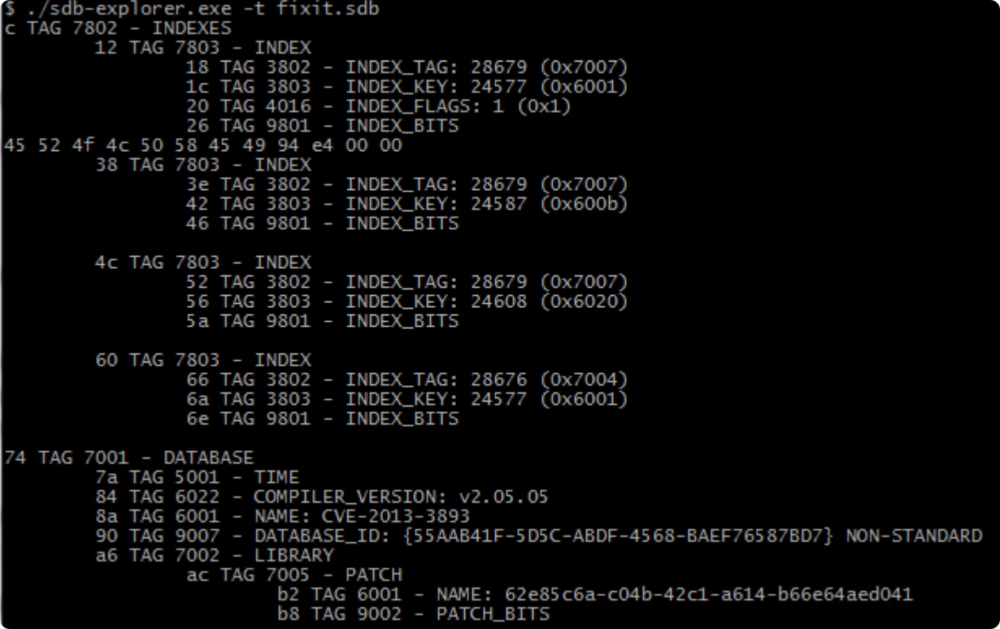
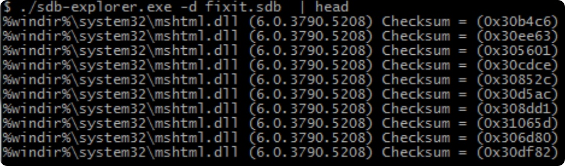
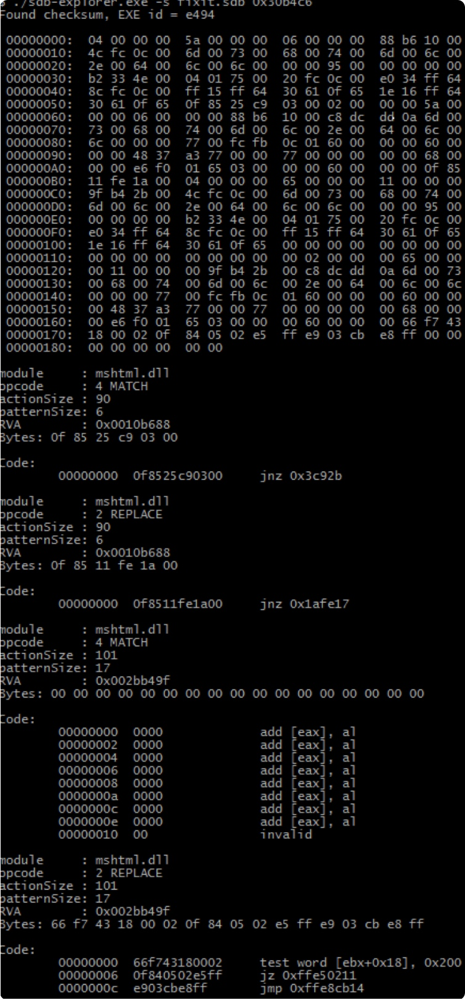
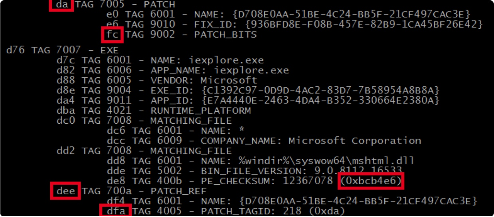
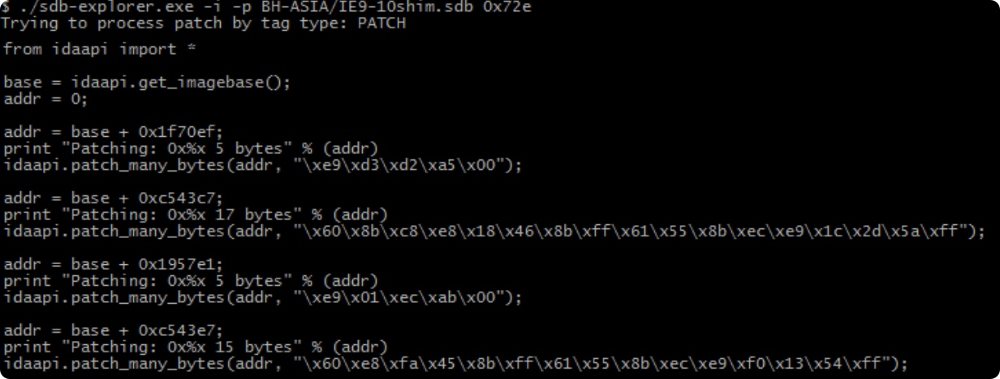
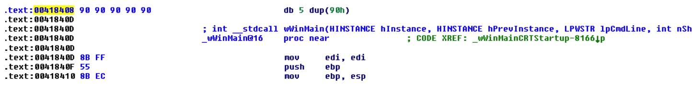
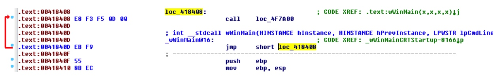

## 背景介绍
在《Malware Analysis》的翻译过程中，8.4.3使用Shim进行内存修补这一节中，作者提到了有关shim或windows打补丁的过程性研究的两篇文章，Jon Erickson的《Using and Abusing Microsoft’s Fix It Patches》和William Ballenthin、Jonathan Tomczak的《The Real Shim Shady》两篇文章。本文就是针对《Using and Abusing Microsoft’s Fix It Patches》的翻译及研究记录。


## 正文翻译
### 摘要
Microsoft经常使用Fix it修补程序，这是应用程序兼容性修补程序的一个子集，作为阻止新发现的针对其产品的主动利用方法的一种方式。用于防止攻击的常见修复修补程序类型是以前未记录的内存修复修补程序。本研究首先重点分析了这些内存补丁。通过从中提取信息，研究人员能够更好地理解微软打算修补的漏洞。然后，研究的重点是对补丁进行逆向工程，并使用这些信息来提供创建补丁的能力，这些补丁可用于维护系统的持久性。
### 导言
微软的应用程序兼容性组合最初只是为了允许过时的软件在较新的操作系统上运行而设计的。在XP版本中，微软提供了一个包含200个应用程序兼容性修复的数据库。高级用户能够使用兼容性管理工具来选择特定的程序或可执行文件，然后应用这200个可用修复程序中的任何一个。这将导致自定义数据库为该程序修复它。多年来，应用程序兼容性修补程序的效用已经发展到能够通过使用内存修补程序修补程序来修补安全漏洞，该修补程序不包括在兼容性管理工具的可用修补程序列表中。(Microsoft Corporation,2001)      
        
虽然微软允许使用现有的修复程序，但他们明确禁止创建新的修复程序，并表示，“这种限制是有意的，旨在降低允许非微软方在加载过程中注入潜在有害代码对系统安全造成的风险。”这项研究表明，通过使用未记录的内存修复它，完全可以做到这一点。              

在讨论了之前的工作之后，我们将提供关于应用程序兼容性修复如何工作的背景信息。然后，我们将展示Windows Loader进程如何使用它们。在了解它们是什么以及如何使用它们之后，我们将分解并分析Microsoft如何使用内存修复它来修补Internet Explorer中的漏洞。然后，我们将介绍一个工具来分析这些修复its，并允许创建支持持久性的补丁。 
### 前期工作
前期工作 如前所述，Fix It文件的内存补丁功能没有文档记录。亚历克斯·约内斯库是第一批对修复补丁进行研究的人之一。在约内斯库关于修复补丁的博客上，他说：“补丁是通过一种方法完成的，这种方法将在以后更详细地研究。”（约内斯库， 应用程序兼容性数据库的秘密（SDB）-第3部分，2007）虽然他可能理解这种格式，但他从未发布过关于补丁或查看补丁的工具的博客帖子。缺乏来自微软和研究的公开信息产生了执行分析和恢复这种补丁结构的愿望。

Mark Barggett介绍了“Windows是默认拥有的！”在2013年德比大会上。（Baggett，2013）他的演讲描述了用户空间rootkit的工作方式，并展示了rootkit作者创建的大多数东西是如何内置到Windows操作系统中的，并且可以通过使用应用程序兼容性工具包来访问。他展示了如何使用这个工具创建不同的shim数据库文件来维护系统的持久性。Application Compatibility Toolkit没有为用户提供创建内存补丁修补程序的能力，也没有提供分析它们的能力，而这正是本研究的重点。Baggett还指出，您可以通过查看控制面板的Add Remove programs部分来识别通过Microsoft提供的sdbinst程序安装的shim数据库。本研究使用了另一种安装方法，但无法通过添加、删除程序对话框识别该方法。

### 应用程序兼容性背景
应用程序兼容性修复解决了应用程序之间的兼容性问题及其与Windows的交互方式。修复it解决方案中心是一个专门修复Its的微软网站，允许用户选择他们的问题领域，如Windows、Internet Explorer、Office等。然后选择问题类型，可以是从性能到安全相关的任何问题。然后，该网站提供了一个可能的解决方案列表。这些解决方案以填充数据库（SDB）的形式发布。

安装填充程序数据库后，它们将在注册表中的以下两个位置注册：

    HKLM\SOFTWARE\Microsoft\Windows NT\CurrentVersion\AppCompatFlags\Custom 
    HKLM\SOFTWARE\Microsoft\Windows NT\CurrentVersion\AppCompatFlags\InstalledSDB 

例如，微软发布了一个修复补丁，以防止主动利用CVE-2012-1889。（Microsoft，2012）安装此修补程序会创建两个密钥。它首先用目标可执行文件的名称在Custom下创建一个键，在本例中是iexplore.exe。在这个键下，它创建一个名为{91d42a30-5434-48bc-9620-c00936f38898}。然后，修复修补程序会在InstalledSDB中创建一个名为{91d42a30-5434-48bc-9620-c00936f38898}的密钥。此键包含以下值：
    
    DatabaseDescription=MSXML5:CVE-2012-1889
    DatabaseInstallTimeStamp=0x1ceab108adaac2c
    DatabasePath=C:\Windows\AppPatch\Custom\{91d42a30-5434-48bc-9620-c00936f38898}.sdb
    DatabaseType=0x10000

通过查看DatabasePath值可以看到，SDB文件被复制到C:\Windows\AppPatch\Custom目录中。该目录用于存储32位应用程序的SDB文件。 如果为64位应用程序安装补丁，那么SDB文件将位于C:\Windows\AppPatch\Custom\Custom64目录中。并不要求SDB文件位于这些目录中，这只是微软使用的一种惯例。SDB文件可以位于任何可访问的目录位置，并且可以使用任何文件名。甚至有可能有不同文件扩展名的SDB文件。对目录位置的唯一警告是针对64位应用程序。如果是64位应用程序，SDB文件的目录路径中必须有Custom64。DatabaseType值0x10000表示数据库包含要填充的条目。(微软，2012)

有两种已知的工具可以对SDB文件执行分析。首先是CDD兼容性数据库转储程序，它不对公众开放（约内斯库，应用程序兼容性数据库的秘密（SDB）-第1部分，2007）。第二个是将数据库填充到XML，sdb2xml.exe，这是一个由微软员工创建的工具（Stewart，2007）。sdb2xml在开始这项研究时提供了有用的信息。微软还提供了应用程序兼容性工具包，允许开发人员创建sdb文件，但是，该工具不能解析或理解包含补丁条目的sdb文件。微软还提供了一个读写SDB文件的API。（Microsoft，2013）此API不完整，并且不提供对内存修补程序修复它的洞察，但是，此API用于创建新的和读取现有的SDB文件。 
### 装载机
Windows加载程序用于将进程加载到内存中并开始执行。作为此过程的一部分，加载程序查看特定的应用程序兼容性注册表位置，以查看该进程是否需要任何修补程序。然后，加载程序在修补程序内部查找更具体的指令，例如将修补程序用于哪个版本的应用程序。这被称为匹配步骤。本研究中作为示例使用的特定补丁包含各种Internet Explorer（IE）版本号和语言标识符。根据操作系统语言和IE版本，将应用补丁的特定部分。
以下代码路径用于将修补程序应用于进程内存空间中加载的映像。加载程序代码从apphelp.dll获取SE_DllLoaded函数的地址，然后尝试应用修补程序。

    ntdll.dll
    LdrpInitializeProcess()->LdrpLoadShimEngine()->LdrpLoadDll()->SE_DllLoaded()
    
    apphelp.dll
    SE_DllLoaded()->PatchNewModules()->SeiAttemptPatches()->SeiApplyPatch()

SeiApplyPatch函数将在后面的修补程序格式部分中讨论。 

### 补丁分析
本研究中使用了CVE-2013-3393的修复程序，并将在本文的其余部分用作示例。 对于此修复程序，Microsoft提供了mshtml.dll中更改的说明信息，显示了应用修复程序前后的目标函数。(Sikka,2013)。由此，可以看出修复程序做了两处更改，在CDoc::SetMouseCapture方法中引入了新的逻辑。

了解目标映像在应用修复之前和之后的内存差异，可以进一步了解Fix it补丁的文件格式。

确定修补程序对特定映像做了什么的快速方法是使用"!chkimg"Windbg的扩展。（Microsoft，2013）通过使用-d选项！chkimg扩展将显示当前加载的内存映像与Microsoft符号存储中已知良好版本之间的任何“损坏”（差异）的摘要。
在mshtml.dll版本为10.0.9200.16686的系统上运行此命令。那个！chkimg-d mshtml命令将产生以下输出。 

    在安装补丁之前：
      0:021>！chkimg -d mshtml
      0个错误：mshtml
    修复补丁后：
      0:019>！chkimg-d mshtml
          5dc0a5af-5dc0a5b1 3字节-MSHTML!CDoc::SetMouseCapture+3e
          [94 dd 38:04 41 b6]   3个错误：mshtml(5dc0a5af-5dc0a5b1)

上面的输出显示，当安装修复补丁时，有一个三字节的损坏。应该是94 dd 38的现在是04 41 b6，这些字节用粗体显示在下面。chkimg命令没有检测到第二个损坏。这很可能是由于在图像的原始大小之外添加了额外的代码。上面的三个字节损坏说明了下面的指令更改。

    从：
    5dc0a5ad 0f8594dd3800    jne     MSHTML！CDoc::SetMouseCapture+0x4b (5df98347) 
    
    改为：
    5dc0a5ad 0f850441b600    jne     MSHTML！SZ_HTMLNAMESPACE+0xf(5e76e6b7) 

这与Sikka对补丁的描述相符。现在我们知道了应用补丁的代码路径以及补丁如何影响内存中的映像，我们可以直接从sdb文件中提取补丁信息。


### 补丁格式
可以使用sdb2xml工具将sdb文件转储为可读的xml格式。但是，对于描述内存修补的修补程序条目，该工具将显示base64编码的字符串或输出包含字节的二进制文件。请参见图1查看与mshtml.dll版本10.0.9200.16686的CVE-2013-3393相关的字节。

（图形1-补丁字节样本）（图形2-C结构描述补片字节）
 图形 2 - C 结构 描述 补片 字节图形 1 - 样品 字节 从 补片

通过结合我们从图像损坏分析中获得的知识，并通过反转SeiApplyPatch函数，我们可以构建一个C结构来帮助我们以有意义的方式理解这些补丁字节，请参见图2。 

SeiApplyPatch函数的伪代码是：
```
SeiApplyPatch(PPATCHBITS pb)
{ 
while(1)
    {         
        if (pb->opcpde==PATCH_MATCH)         
        {
            if (memcmp(pb->pattern，modulebase+rva，pb->patternSize)!=0)
                return 0;
        }         
        else if (pb->opcode==PATCH_REPLACE)
        {
            NtProtectVirtualMemory(-1,modulebase+rva,pb->patternSize,PAGE_READWRITE,&old);
            memcpy(modulebase+rva，pb->pattern，pb->patternSize)；
            NtProtectVirtualMemory(-1，modulebase+rva，pb->patternSize，old，&old）；
            FlushInstructionCache(-1，modulebase+rva，pb->patternSize)；         
        }         
        else
            return 1；         
        //转到下一个命令         
        pb=(PPATCHBITS)((PBYTE)pb+pb->actionSize); 
}
}
```
有两个可能的命令，Match和Replace。匹配操作在模块中指定的相对虚拟地址（RVA）处搜索模式。RVA来自指定的模块基址。如果找不到该模式，修补过程将停止。替换操作将模式写入指定RVA处的模块。这是通过使目标页具有读/写权限、将模式写入目标位置、恢复原始权限以及刷新指令缓存来实现的。

只有一个地方我发现我不能写，SeiApplyPatch函数本身。程序会崩溃，因为当它试图自我修补时。它将更改自身的读/写权限，这意味着它不能再执行。 


### sdb-exeplorer
现有的检查sdb文件的工具不具备以有用的方式解析补丁信息的能力；这促使我开发sdb-exeplorer。 
                 
该工具的当前版本具有以下功能： 
```           
打印完整的sdb树 
          sdb-explorer.exe -t 文件名.sdb打印修补程序详细信息 
          sdb-explorer.exe[-i]-p filename.sdb(patch patchid patchref patchbin) 
            -i -创建IDAPython脚本（可选） 

打印校验和的修补程序详细信息 
          sdb-explorer.exe [-i] -s filename.sdb

创建包含泄漏内存的文件 
          sdb-explorer.exe -l 文件名.sdb打印匹配项 
          sdb-explorer.exe -d 文件名.sdb从文件创建修补程序 
          sdb-explorer.exe -c config.dat [-o filename.sdb] 
注册sdb文件 
          sdb-explorer.exe -r filename.sdb [-a application.exe] 
显示用法
          sdb-explorer.exe -h 
```

使用’-t’命令行参数，它将打印完整的sdb树。这可以根据sdb文件的大小产生大量输出。最好将此命令的输出重定向到一个文件，以便可以在文本编辑器中查看。图3显示了检查CVE-2013-
3893的修复补丁的部分输出。 

                        图3-t选项的输出。 
             
“-d”命令打印sdb文件中的所有匹配项。该命令将生成所有目标模块的列表、它们的版本号以及相关的校验和。 
             

               图4--D选项的输出 
             
图4显示了CVE-2013-3893的相同修复结果。正如您在下面看到的，我们只显示了这个命令的结果的子集。这个子集包括10个目标，它们都是针对IE版本6.0.3790.5208的。然而，它们有不同的校验和，这是为了覆盖同一版本的不同语言版本。 

要打印出特定补丁的详细信息，您可以使用’-s’或’-p’选项。 
                                                 

                 
图5-s选项的输出 
上面的图5使用了’-s’选项，显示了从IE 6匹配中打印列表中第一个校验和的补丁细节时的输出。输出显示存储在补丁中的二进制blob和解码内容。解码内容的含义与本文补丁分析部分讨论的含义相同。 
             

                 图6-补丁和校验和标记 
             
还可以使用-p选项，使用户能够指定patch、patchbits、patchref、patch_tag_id或校验和，如图6所示。 

这两个选项中的任何一个都可以与’-i’选项一起使用，以生成一个IDA python脚本，该脚本可以在IDA中运行，以修补当前正在分析的文件。图7显示了针对CVE2014-0322的Fix It补丁运行时的情况。 
             

                 图7-IDAPython脚本 
             
其他三个命令：Create Patch、Register Patch和print leaked data，将在后面的章节中讨论。 

​            

### 信息泄露
我在弄清楚补丁位结构时遇到的一件有趣的事情是，模块名称字段包含垃圾数据。一开始我以为这些数据可能是一些保留的或特殊的未记录的标志。进一步研究后，我确定结构中的module name字段是64字节的固定大小。当模块名占用少于64个字节时，其余部分包含未初始化的堆栈数据。使用带有-l标志的sdb-explorer，它将遍历SDB文件中的每个补丁位条目，并创建一个包含所有泄漏数据的新文件。我认为，如果微软用来创建这些补丁文件的工具在堆栈上留下一些秘密数据，那就太好了，但在我的测试中，情况并非如此。无论哪种方式，标志都在sdb-explorer工具中，供任何人使用。当使用sdb-explorer工具创建修补程序时，模块名称字段首先被初始化为零，以防止数据泄漏。 
### 持久性
Mark Baggett展示了许多可以使用应用程序兼容性工具包来维护持久性的方法。需要注意的一点是，您必须拥有系统的管理员权限，因为所需的注册表项在HKEY_LOCAL_MACHINE中。 本研究展示了如何使用内存补丁功能来提供持久性。通常，内存补丁允许将任意代码注入进程。
使用内存修复修补程序使得攻击者能够让加载程序执行内存修补程序。此修补程序可用于防止Microsoft预期使用的漏洞，也可用于维护持久性。为了保持系统的持久性，我们将重点放在explorer.exe进程上。每次登录到Windows系统时，都会自动启动此过程。利用这些知识，我们可以创建一个针对explorer.exe进程的内存修补程序，将攻击者的代码注入explorer.exe进程的内存空间。


         图8-修补前的explorer.exe main
图8显示了explorer.exe进程的主要功能。Explorer.exe编译时启用了热修补程序。这可以通过使用“mov edi，edi”指令来识别，该指令前面有5个NOP指令。对于我们来说，这显然是一个修补主函数的地方，以便将附加功能注入到explorer.exe进程中。没有为进程启用热修补的要求，这只是为了方便。
在这种情况下，explorer.exe的模块基址是0x400000，NOP指令从地址0x418408开始。这意味着该区域的RVA为0x18408。我们可以创建一个替换命令 这将转到RVA 0x18408，并用以下字节替换内容：e8 f3 f5 0d 00 eb f9。 图9显示了应用补丁后main函数的新行为。

             图9-explorer.exe主补丁后
这段代码现在调用一个新函数，该函数被添加到可执行内存空间的末尾。演示中使用的确切代码在本文末尾的配置文件中。演示代码执行calc.exe进程，并返回explorer.exe中的主函数继续。虽然执行calc可能没有用，但可以用任意代码替换此代码。每次资源管理器.exe运行时都会执行此操作，这是在系统登录时以及每次打开新的资源管理器窗口时执行的。本文末尾的配置文件中有一个示例补丁，可以在explorer.exe的多个版本上执行calc。
要从配置文件创建此sdb文件，请运行以下命令：
      sdb-explore.exe-c config.dat-o output.sdb
然后可以使用以下命令安装新数据库：
      sdb-explore.exe-r output.sdb-a explorer.exe
      
注册shim数据库将创建所需的两个注册表项，如背景部分所述。您必须以管理员权限运行此命令。也可以使用Microsoft的sdbinst程序注册sdb文件，但是如前所述，这会在添加/删除程序对话框中创建一个条目。
应用程序兼容性的使用潜在地提供了在系统上维护持久性的其他方法，除了上面提到的两种方法，Mark Baggett给出了一个概述和许多可用于维护持久性的兼容性修复示例。 Microsoft Windows Sysinternals中的自动运行实用程序包括关于启动位置的最全面的知识。（Mark Russinovich，2013）目前，Autoruns实用程序不寻找应用程序兼容性修复程序作为Autoruns的可能位置。

### 结论
Microsoft的Fix it修补程序提供了大量用于应用程序兼容性和防止安全利用的功能。这项研究表明，以前没有记录的内存补丁通常被微软使用。从这项研究中获得的知识允许创建一个工具来对包含内存补丁的sdb文件进行分析。有了这方面的知识，用户现在就可以创建自己的自定义内存修补程序， 可用于维护系统上的持久性。目前，微软的自动运行工具不认为应用程序兼容性是自动运行的潜在目标。虽然sdb数据库的安装需要管理员权限，但我们认为Microsoft应该为sdb文件格式添加签名支持，并提供一个选项，只允许加载已由已知来源签名的应用程序兼容性修复程序，或者提供一个通知，说明应用程序即将从未签名的数据库修补程序中进行修补。 
### 文章引用
M.巴格特（2013年2月23日）。2013年员额和出版物。检索于2013年10月23日，来自深度防御：http://www.indepthdefense.com/2013/02/2013-posts-and-publications.html 

约内斯库（2007年5月20日）。应用程序兼容性数据库的秘密（SDB）-第1部分。2013年9月5日，摘自Alex Ionescu的博客：http://www.alex-ionescu.com/？p=39 

约内斯库（2007年5月26日）。应用程序兼容性数据库的秘密（SDB）-第3部分。2013年9月5日，摘自Alex Ionescu的博客：http://www.alex-ionescu.com/？p=41

马克·鲁西诺维奇（2013年8月1日）。Windows v11.70的自动运行检索于2013年9月5日，来自Windows Sysinternals：http://technet.microsoft.com/en-us/Sysinternals/bb963902.aspx 

微软。（二零一三年九月六日）。！chkimg。检索于2013年10月2日，来自Dev Center：http://msdn.microsoft.com/en-us/library/windows/hardware/ff562217%28v=vs.85%29.aspx 

微软。（二零一三年十月一日）。应用程序兼容性数据库。检索于2013年10月23日，来自Microsoft Developer Network：http://msdn.microsoft.com/library/bb432182.aspx

微软公司。（2001年6月1日）。Windows XP应用程序兼容性技术。检索于2013年11月8日，来自TechNet：http://technet.microsoft.com/en-us/library/bb457032.aspx 

微软。(2013).修复it解决方案中心。从Microsoft Support检索到2013年的消息：http://support.microsoft.com/fixit/ 

微软。（二零一二年十月一日）。Microsoft安全警告：Microsoft XML核心服务中存在允许远程代码执行的漏洞。检索于2013年9月5日，来自Microsoft支持：http://support.microsoft.com/kb/2719615

微软。（二零一二年十二月七日）。填充数据库类型。检索于2013年9月5日，来自Microsoft Developer Network：http://msdn.microsoft.com/en-us/library/bb432483%28v=vs.85%29.aspx 

新泽西州西卡（2013年9月17日）。CVE-2013-3893：修复它的解决方法可用。检索于2013年10月2日，来自Security Research&Defense：http://blogs.technet.com/b/srd/archive/2013/09/17/CVE-2013-3893-fix-it-workaround-available.aspx

斯图尔特（2007年11月3日）。将数据库填充到XML。检索于2013年9月5日，Heath Stewart的Setup&Install：http://blogs.msdn.com/b/heaths/archive/2007/11/02/sdb2xml.aspx 用于修补explorer.exe以在启动时运行calc.exe的配置文件。 


## 参考文章
[持续使用和滥用微软的补丁](https://www.blackhat.com/docs/asia-14/materials/Erickson/WP-Asia-14-Erickson-Persist-It-Using-And-Abusing-Microsofts-Fix-It-Patches.pdf)
