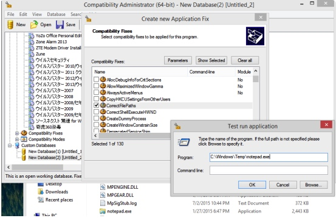
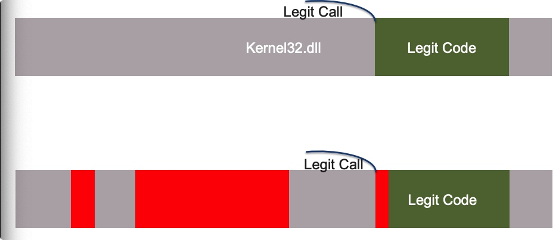
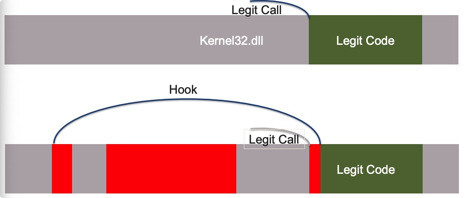
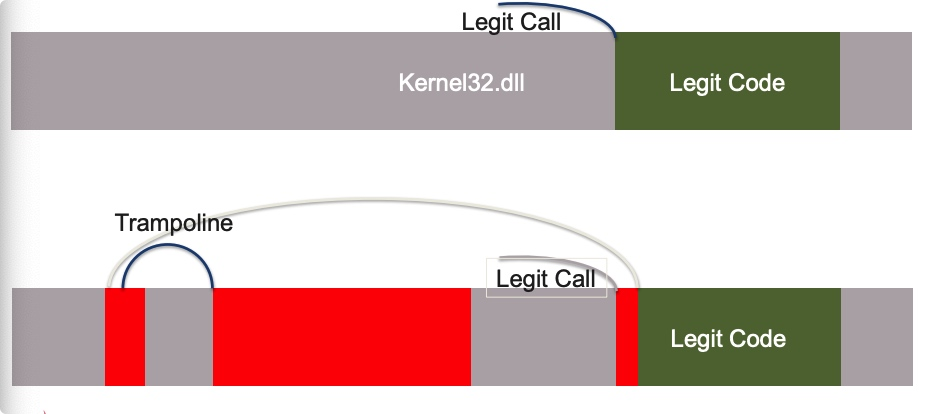
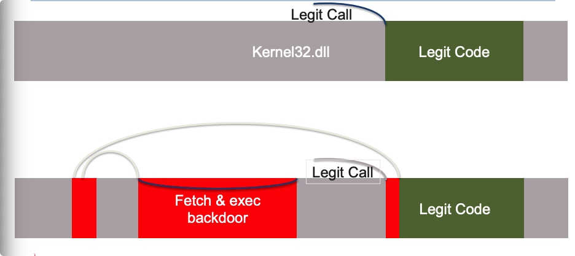
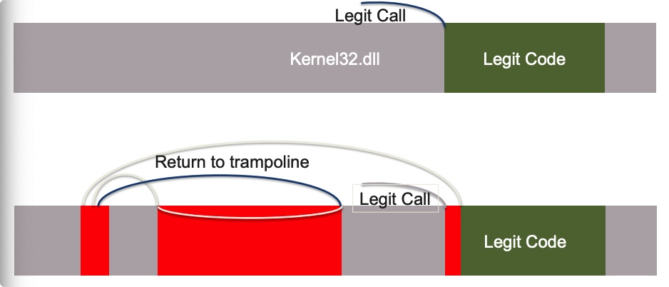
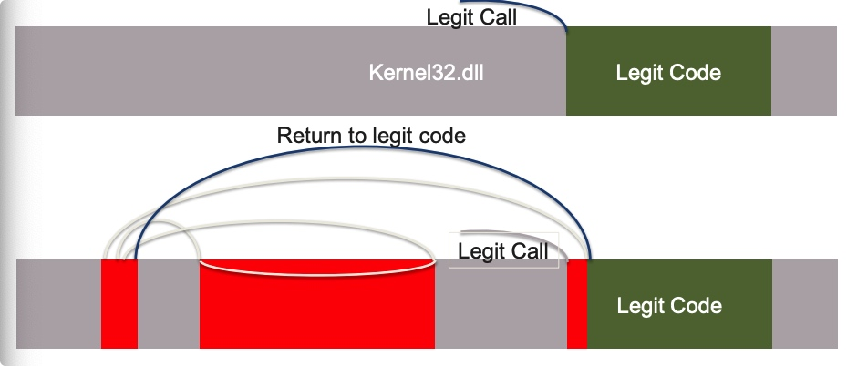
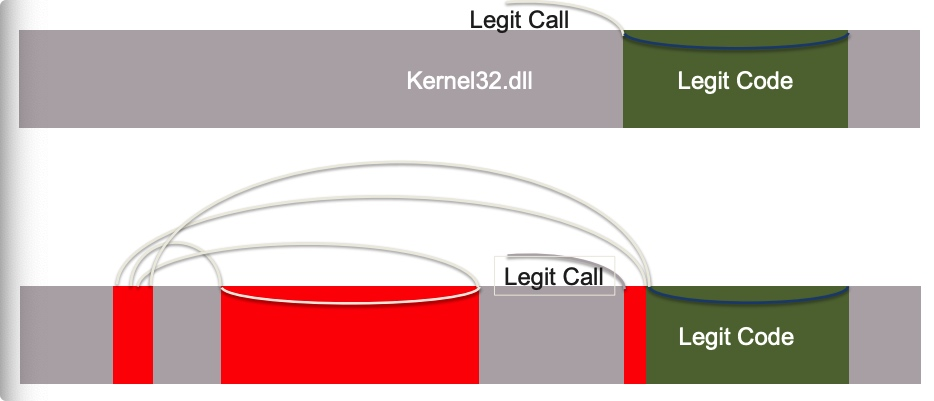
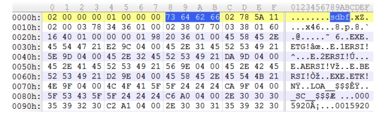

## 背景
在《Malware Analysis》的翻译过程中，8.4.3使用Shim进行内存修补这一节中，作者提到了有关shim或windows打补丁的过程性研究的两篇文章，Jon Erickson的《Using and Abusing Microsoft’s Fix It Patches》和William Ballenthin、Jonathan Tomczak的《The Real Shim Shady》两篇文章。本文就是针对《The Real Shim Shady》的翻译及研究记录。


## 正文翻译

### Bio, plan
. William Ballenthin,逆向工程师 
   - FireEye实验室高级逆向工程小组 
   - 恶意软件分析，正向和反向工程 

. Jonathan Tomczak,顾问 
   - Mandiant专业服务 
   - 事件响应、取证、工具开发 

. 今天的主题：劫持事件的案例研究和调查技术 
  应用程序兼容性基础设施。 
### 把火扑灭
. 在处理恶意软件分类队列时，遇到了有趣的情况： 
        -    被网络钓鱼电子邮件锁定的客户端 
        -    大型部署火眼箱没有开火 
        -    恶意软件在某种程度上保持了持久性 
       
       
. 发生了什么？如何确定检测和调查方法？

### 通过Shims注入DLL
. 恶意软件：自解压RAR 
   释放KORPLUG启动器(elogger.dll) 
   正在加载外壳代码后门（elogger.dat） 
. elogger.dat做所有的事情：手动加载PE有效负载、注入、privesc、安装服务、HTTP协议 
. 另外，安装ACI shim填充程序： 
   - 将两个（32/64位）硬编码的嵌入式SDB文件写入磁盘 
   - 调用sdbinst.exe 

### 什么是ACI
shims填充程序是什么，为什么他们在系统中？

. 使用Microsoft Windows更新管理和解决应用程序兼容性问题 
. 通过免费提供的应用程序兼容性工具包(ACT)进行配置 
. 可执行加载程序内置的API挂钩(&more) 
   - “垫片”通常实现为代码或配置（禁用功能） 
   - 由指示源和目标的数据库（SDB文件）描述的垫片 
   - 向OS注册的SDB，由加载程序查询 

### 应用程序兼容性的基础设施，2
. 由可执行文件元数据metadat指定的目标，包括： 
   -  文件名 
   -  PE校验和 
   -  文件大小 
   -  版本信息字段等。 
. 有很多垫片可以玩 
   -  几十个预配置的快速修复程序（重定向文件读取、更改堆行为） 
   -  MS分发的数千个SDB条目 
   -  一些未记录的特征 
### SDB的内容
```
<EXE>
     <NAME type='stringref'>OREGON32.EXE</NAME>
     <APP_NAME type='stringref'>The Oregon Trail v1.2</APP_NAME>
     <VENDOR type='stringref'>Minnesota Educational Computing Corp.</VENDOR>
     <EXE_ID type='hex'>568058f1-da4f-4105-8f72-edd5d2a4aaf3</EXE_ID>
         <APP_ID type='hex'>82f31111-af62-4849-b866-14c4e748e33c</APP_ID>
     <MATCH_MODE type='integer'>0x2</MATCH_MODE>
     <MATCHING_FILE>
         <NAME type='stringref'>OREGON32.DLL</NAME>
     </MATCHING_FILE>
     <SHIM_REF>
         <NAME type='stringref'>EmulateGetDiskFreeSpace</NAME>
         <SHIM_TAGID type='integer'>0x23298</SHIM_TAGID>
     </SHIM_REF>
 </EXE>
```
 ### 应用程序兼容性工具包
 

### SDB部署
. sdbinst.exe向操作系统注册SDB文件 
    - 在控制面板中创建卸载项 
    - 向注册表项添加值： 
        •  HKLM\SOFTWARE\Microsoft\Windows NT\CurrentVersion\AppCompatFlags\Custom 
        •  HKLM\SOFTWARE\Microsoft\Windows NT\CurrentVersion\AppCompatFlags\InstalledSDB 
. Microsoft建议在MSI中打包并通过GPO进行部署 
. 直接添加注册表值可以绕过sdbinst.exe和extra控制面板条目 

### 有趣的shims
|垫片的名字|作用|
|--|--|
|DisableWindowsDefender|"此修复程序将禁用Windows Defender for不能与Windows Defender一起工作的安全应用程序。|
|CorrectFilePaths |重定向文件系统路径 |
|LoadLibraryRedirectFlag|更改DLL的加载目录|
|NoSignatureCheck|??? |
|RelaunchElevated |确保EXE以管理员身份运行|
|TerminateExe |??? |
|VirtualRegistry|注册表重定向和扩展|

### 技巧1:通过垫片注入DLL(在野)
. 自提取RAR 
   释放KORPLUG启动器(elogger.dll) 
   正在加载外壳代码后门（elogger.dat） 
. elogger.dat执行所有操作：手动加载PE有效负载、注入、privesc、安装服务、HTTP协议 
. 另外，安装ACI填充程序： 
   - 将两个（32/64位）硬编码的嵌入式SDB文件写入磁盘 
   - 调用sdbinst.exe 
#### SDB内容
```
<DATABASE><NAME type='stringref'>Brucon_Database</NAME>
 <DATABASE_ID type='guid'>503ec3d4-165b-4771-b798-099d43b833ed</DATABASE_ID>
 <LIBRARY> <SHIM>
 <NAME type='stringref'>Brucon_Shim</NAME>
 <DLLFILE type='stringref'>Custom\elogger.dll</DLLFILE>
 </SHIM></LIBRARY>
 <EXE>
 <NAME type='stringref'>svchost.exe</NAME>
 <APP_NAME type='stringref'>Brucon_Apps</APP_NAME>
 <EXE_ID type='hex'>e8cc2eb6-469d-43bc-9d6a-de089e497303</EXE_ID>
 <MATCHING_FILE><NAME type='stringref'>*</NAME></MATCHING_FILE>
 <SHIM_REF><NAME type='stringref'>Brucon_Shim</NAME></SHIM_REF>
 </EXE></DATABASE>
```
#### 分析
  . 通过特殊的文件格式配置持久性 
  . 硬编码的SDB文件可通过文件名、ID轻松签名 
     - 有效负载文件存在于非常有限的目录集中 
         • C:\Windows\AppPatch\Custom\ 
         • C:\Windows\AppPatch\Custom\Custom64\ 
  . FireEye标识的文件名elogger.dll经常在KORPLUG&SOGU战役。 

### 技巧2:通过垫片更换参数(在实验室中见)
  . CorrectFilePath修复将参数从应用程序的路径重定向到 
    攻击者指定的路径 
     - 简单的挂钩到CreateProcess、WinExec、ShellExecute 
    
  . 自定义程序mine.exe启动C:\windows\temp\1.exe 
     - Add shim：将C:\windows\temp\1.exe重定向到C:\dump\1.exe 
     - CorrectFilePath："C:\windows\temp\1.exe;C:\dump\1.exe" 

### SDB内容
```
<DATABASE><TIME type='integer'>0x1d100fac0a4a7fc</TIME>
 <NAME type='stringref'>minesdb</NAME>
 <DATABASE_ID type='guid'>
 2840a82e-91ff-4f29-bff2-fd1e9780b6eb</DATABASE_ID>
<EXE>
 <APP_NAME type='stringref'>mine.exe</APP_NAME>
 <MATCHING_FILE><NAME type='stringref'>*</NAME></MATCHING_FILE>
 <SHIM_REF>
 <NAME type='stringref'>CorrectFilePaths</NAME>
 <COMMAND_LINE type='stringref'>
 "C:\Windows\Temp\1.exe; C:\dump\1.exe“
 </COMMAND_LINE>
 </SHIM_REF></EXE></DATABASE>
```
### 分析
 . 分析： 
     - 假设目标进程是命令行.exe 
         • 隐藏持久性，过程创建的MITM 
         • #DFIR混乱 
     - 通过不透明文件格式配置 
     - 有效负载不限于特定目录 


### 技巧3:通过垫片注入Shellcode(在野外见)
 . 网络钓鱼电子邮件导致dropper释放器加载
     dropper安装模板SDB并动态修改它们SDB声明它注入到可执行负
     载上的外壳代码有效负载是其他阶段的下载器 

 . 由趋势科技首次识别发现

 #### SDB内容
 ```
 <DATABASE><NAME type='stringref'>opera.exe</NAME>
 <DATABASE_ID>
 538f5e1c-932e-4426-b1c9-60a6e15bcd7f</DATABASE_ID>
 <LIBRARY><SHIM_REF><PATCH>
 <NAME type='stringref'>patchdata0</NAME>
 <PATCH_BITS type='hex'>040000c…0000000000000000</PATCH_BITS>
 </PATCH></SHIM_REF></LIBRARY>
 <EXE><APP_NAME type='stringref'>opera.exe</APP_NAME>
 <MATCHING_FILE><NAME>opera.exe</NAME></MATCHING_FILE>
 <PATCH_REF>
 <NAME type='stringref'>patchdata0</NAME>
 <PATCH_TAGID type='integer'>0x6c</PATCH_TAGID>
 </PATCH_REF></EXE></DATABASE>
 ```

### 补丁位
  . Windows加载程序将任意字节写入模块内存 
     - PATCH_MATCH验证内存写入目标 
     - PATCH_REPLACE标记（以原始字节为单位） 
     - 可以同时针对EXE和DLL模块 
####  补丁细节1
```
00000000 (04) opcode: PATCH_MATCH
0000000c (04) rva: 0x00053c2e
00000014 (64) module_name:u'kernel32.dll'
00000054 (05) pattern: 9090909090
 disassembly:
 0x53c2e: nop
 0x53c2f: nop
 0x53c30: nop
 0x53c31: nop
 0x53c32: nop
00000000 (04) opcode: PATCH_REPLACE
0000000c (04) rva: 0x00053c2e
00000014 (64) module_name:u'kernel32.dll'
00000054 (07) pattern: e8321a0700ebf9
 disassembly:
 0x53c2e: call 0x000c5665
 0x53c33: jmp 0x00053c29
```
#### 补丁细节2
```
00000000 (04) opcode: PATCH_MATCH
0000000c (04) rva: 0x000c5665
00000014 (64) module_name:u'kernel32.dll'
00000054 (08) pattern:
0000000000000000
00000000 (04) opcode: PATCH_REPLACE
0000000c (04) rva: 0x000c5665
00000014 (64) module_name: u'kernel32.dll'
00000054 (14) pattern:83042402609ce8030000009d61c3

 disassembly:
 0xc5665: add dword [esp],2
 0xc5669: pushad
 0xc566a: pushfd
 0xc566b: call 0x000c566d
 0xc5670: popfd
 0xc5671: popad
 0xc5672: ret 

```

#### 补丁细节3
```
< Multi-kilobyte shellcode downloader >
```
#### 补丁详情总结







#### 分析
. MS基础设施的持久性和注入！ 
. 不透明格式外壳代码的外部存储 


. 从模板动态修改SDB文件 
        -    为数据库ID生成唯一的GUIDs 
        -    可扩展有效载荷 
        -    未记录PATCH_BYTES 

### 透过母体
了解SDB文件 
#### SDB文件格式
   . SDB文件格式是未记录的Microsoft格式 
           -   apphelp.dll公开了大约254个用于操作垫片的导出 
           -   这对法医分析没有帮助！ 
        


#### SDB文件格式2
   . 所以，我们对它进行了逆向工程 
       
   . 从概念上讲，类似于索引的XML文档 
           -   三个主要节点：索引、数据库结构和字符串表 
           -   没有压缩、加密、签名或校验和 
#### 考虑的场景

 . 填充定义：名称和填充操作 
```
    <LIBRARY><SHIM>
        <NAME type='stringref'>Brucon_Shim</NAME> 
        <DLLFILE type='stringref'>Custom\elogger.dll</DLLFILE> 
    </SHIM></LIBRARY> 
```
 . 应用程序定义：目标和填充指针 
```
    <NAME type='stringref'>svchost.exe</NAME> 
    <APP_NAME type='stringref'>Brucon_Apps</APP_NAME> 
    <SHIM_REF> 
      <NAME type='stringref'>Brucon_Shim</NAME> 
      <SHIM_TAGID type='integer'>0x47c</SHIM_TAGID> 
    </SHIM_REF> 
```
#### python-sdb
 . 存在一些用于解包SDB文件的工具 
    - 但它们依赖于Windows API 
 . python-sdb是一个用于解析sdb的跨平台纯Python库 
    - Python API使得构建检查SDB特性的脚本变得很容易 
    - 提供了以各种XML风格转储数据库的示例脚本 
 . https://github.com/williballenthin/python-sdb 


### 检测方法 
在大型环境中大规模调查恶意垫片 
#### 考虑的场景
 . Trojan.mambashim 
    - Python（什么，只需阅读源代码！？！） 
    - 模糊字节码 
    - 安装服务，或使用ctypes动态创建sdb并安装 
    - sdb导致Windows加载程序将DLL有效负载启动器注入putty44.exe 
 你知道这发生在你的环境中吗？ 
#### 现有的管理工具？
   . 事实：Trojan.mambashim使用英语单词字典生成随机sdb路径，使用sd
     binst.exe安装 

   . ACI失败： 
       . 系统上没有SDB的集中管理 
       . 没有用于SDB管理的Active Directory工具 
       . 不记帐ACI更改或回滚功能 
   . 赢了？ 
       . 也许通过流程审计抓住sdbinst.exe？ 
#### ACI完整性检查吗?
   . SDB文件未签名:<
   . 按哈希将SDB列入白名单不起作用 
       . 例如，在6000台主机上收集会产生18000个唯一的SDB文件 

   . 嵌入的时间戳和安装顺序会影响SDB完整性检查 
       . 如果Office安装在Visual Studio之前，反之亦然 
        另一个系统，它可能会导致不同的SDB。 

#### 质量检验和异常检测1
. 获取，检查%systemdrive%\*.sdb 
    . 合法的SDB通常驻留在Windows和程序文件中 
    . 在%USERSPROFILE%的工作目录中发现攻击者SDB 
. 获取，检查 

    . HKLM\SOFTWARE\Microsoft\Windows 
       NT\CurrentVersion\AppCompatFlags\Custom 
    . HKLM\SOFTWARE\Microsoft\Windows 
       NT\CurrentVersion\AppCompatFlags\InstalledSDB 

. 默认SDB：drvmain,frxmain,msimain,pcamain,sysmain
. Trojan.mambashim 
   - 随机标头时间戳（范围0-最大int64（！！！））
   - 随机编译器版本（rand.rand.rand.rand）
   - EXE供应商名称"供应商" 
   - 随机数据库ID（嗯，这是一个GUID…）
   - 随机EXE ID（也称为GUID…）
. 但是，黑名单不会缩放 
. 适合打猎，而不是开火就忘了     

#### 质量检验和异常检测2
Microsoft-Windows-Application-Experience-Program-Telemetry.evtx
```
Compatibility fix applied to C:\PROGRAM FILES\Putty\putty44.exe.
Fix information: vendor, {7e4053fe-ade9-426f-9dc2-0bbfa76b5366},
0x80010156.
```
应用于C:\PROGRAM FILES\Putty\putty44.exe的兼容性修复程序。 
修复信息：供应商，{7e4053fe-ade9-426f-9dc2-0bbfa76b5366}，0x80010156。 
    
    
. 你有可以检测“异常条目”的技术吗？ 
    - 计数元组（主机名、供应商、应用程序）和排序ASC 
    - 对新元组发出警报？ 

#### 领域特定哈希

. 实际上，Trojan.mambashim可能更糟糕。 
    
    
. 我们不指望黑名单会扩大，那只是在追赶 
. 我们真的想加入白名单： 
   .  但是，不能按哈希将整个文件列入白名单（见前面） 
   .  散列填充程序可以定义和应用程序定义嘛？
       . 别指望这些会改变 
       . 用这个建立一个白名单！ 
   . shims_hash_shims.py 


#### 为这种情况做好准备
. https://github.com/ganboing/sdb_packer 
   . 提取现有合法的sysmain.sdb 
   . 为explorer.exe等添加新的垫片。 
       . 有效载荷：执行exfil的keylog数据和shellcode代码 
   . 重新打包sysmain.sdb 
   . 部署 
   . ？？？ 
   . 受益
#### 垫片是真的。不要被绊倒
. 目标威胁和商品威胁都在积极使用ACI垫片 
. 没有现有的检测基础设施 
. 考虑风险 
       
. 你现在是第一线。
### 前期工作
[“Persist It - Using and Abusing Microsoft Fix It Patches” - Jon Erickson/iSIGHT@ BH ’14](https://www.blackhat.com/docs/asia-14/materials/Erickson/Asia-14-Erickson-Persist-It-Using-And-Abusing-Microsofts-Fix-ItPatches.pdf)
[“Shim: A new method of injection” (in Russian)](
ftp://os2.fannet.ru/fileechoes/programming/XA_159.PDF)
[“Roaming Tiger” - Anton Cherepanov/ESET @ ZeroNights ’14](
http://2014.zeronights.org/assets/files/slides/roaming_tiger_zeronights_2014.pdf)
“Windows - Owned By Default!” – Mark Baggett @ DerbyCon 2013
[“Compatibility Fix Descriptions” - MSDN](https://technet.microsoft.com/en-us/library/cc722305%28v=ws.10%29.aspx)

## 参考链接
[](http://files.brucon.org/2015/Tomczak_and_Ballenthin_Shims_for_the_Win.pdf)
